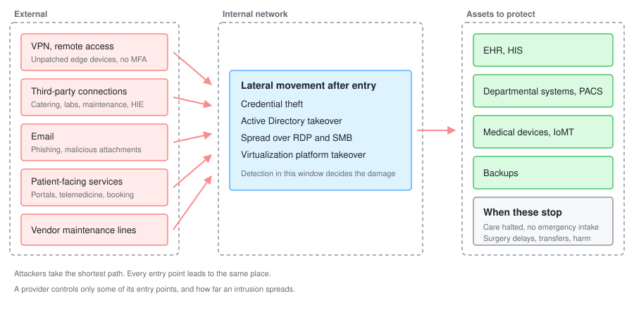
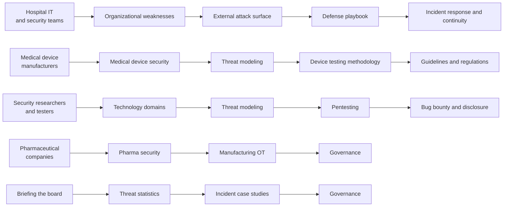

<div align="center">

# 🏥 Awesome Healthcare Security

A curated knowledge base of **healthcare × cybersecurity**, organized from primary sources in Japan and abroad.

<br>

[](https://github.com/sindresorhus/awesome)
[](LICENSE)
[](https://github.com/scgajge12/awesome-healthcare-security/commits/main)
[](https://github.com/scgajge12/awesome-healthcare-security/stargazers)

[日本語](README.md) | **English**

<br>

[**Threats**](docs/threats/) |
[**Technology**](docs/technology/) |
[**Practice**](docs/practice/) |
[**Response**](docs/response/) |
[**Guidelines**](docs/guidelines/) |
[**Governance**](docs/governance/) |
[**Reference**](docs/reference/) |
[**Monthly**](monthly-reports/)

</div>

> [!NOTE]
> The linked pages are written in Japanese, with the underlying sources cited in their original language.
> English translations of the individual pages are on the roadmap.

---

## Why healthcare security is different

Healthcare is not the only life-critical infrastructure.
What makes healthcare and pharma distinct is that the thing you are defending is not the IT estate but **the continuity of care and of drug supply**.
Enterprise systems are designed with confidentiality first; here, availability and integrity come before it.
A lab value that is off by one digit and still readable, or a batch record altered while shipping continues, can be more dangerous than a system that is down.
That inverted priority is where the six constraints below start.

Everything below covers both care providers and pharmaceutical companies.

<table>
<tr>
<td width="50%" valign="top">

### ⏱️ No slack in the decision cycle

Clinical systems run 24/7/365, and even planned downtime is hard to schedule.
Prolonged downtime turns directly into decisions about diverting ambulances, postponing surgery, and halting shipment of a drug.
The argument is rarely about whether a control is correct, but about whether a window exists to apply it.

</td>
<td width="50%" valign="top">

### 🚪 The "it's air-gapped, so it's safe" assumption

Hospital information systems and production line controls alike were designed around closed networks isolated from the internet.
That assumption becomes the reason perimeter devices sit unpatched.
Those same perimeter devices are where real intrusions start.

</td>
</tr>
<tr>
<td width="50%" valign="top">

### 🕰️ Old assets inside a structure nobody can map

Medical devices have service lives past ten years, and end-of-life operating systems stay in production.
Regulated devices and validated manufacturing equipment cannot be reconfigured without going through approval.
The EHR, departmental systems, medical devices, production line controls, and back-office IT share one network while ownership and vendors are split across them.
If you cannot draw what connects to what, you can neither scope an incident nor isolate it.

</td>
<td width="50%" valign="top">

### 🔗 The attack surface does not end at your own organization

Catering, laboratory, cleaning, and maintenance suppliers, along with API and contract manufacturing partners, all hold network connections into the estate.
A design that only covers what is inside the organization cannot close the paths that come from outside it.

</td>
</tr>
<tr>
<td width="50%" valign="top">

### 💊 Data you cannot revoke, all in one place

Health records cannot be reissued the way a card number can.
A diagnosis or treatment history stays true for life, and it sits next to names, addresses, and insurance details.
In pharma, trial data and pre-approval research sit on top of that, and their value is gone the moment they are stolen.
In both cases, encryption plus exposure is effective leverage.

</td>
<td width="50%" valign="top">

### 💰 The conditions that push toward paying

Attackers price a target on the probability of collecting, not on the value of the data.
When stopped care or stopped shipment is urgent, recovery is slow, and patient safety is the hostage, the decision leans toward payment.
That expected value is why healthcare and pharma keep getting targeted.

</td>
</tr>
</table>

These six are not independent.
Trust in the closed network licenses weak asset management and segmentation, and once a supplier connection is abused in that state, the systems that cannot go down go down.
Attacker motives differ (money, espionage, political messaging), but the entry points they use overlap.
Defensive design is therefore driven by the number of entry points, not by the taxonomy of actors ([threat actors and risks](docs/threats/actors/actors-and-risks.md)).
Actual intrusion paths and how far the damage spread are collected in the [incident case studies](docs/threats/incidents/).

### How fast the assumptions break: DX and AX

Systems that assume connectivity to external networks, such as online insurance eligibility verification and electronic prescriptions, are being rolled out across providers.
Inventory of those connection points, authorization design, traffic monitoring, and incident playbooks tend to arrive after the rollout rather than with it.
When connection points multiply while the design philosophy still assumes a closed network, trust in isolation and opacity of structure degrade at the same time.

AI adoption (AX) widens that gap further.
Generative AI does not create the six constraints above, but it compresses the timeline on all of them.

1. **The window before exploitation shrinks.** As vulnerability analysis and target-specific phishing get automated, the gap between disclosure and exploitation narrows.
   A sector that measures patch cycles in months is on the wrong side of that compression.
2. **LLMs move into the clinical and development workflow.** Chart text, patient-entered questionnaires, OCR of inbound referral letters, trial documents, and safety reports go straight into a model as input.
   All of these are external inputs an attacker can write into, which makes them a path for indirect prompt injection.
3. **Agents get connected to the EHR.** A broken authorization check is no longer one leaked record but cross-patient access.
   A classic IDOR turns into bulk retrieval driven by a single natural-language instruction.
4. **The update problem repeats itself.** For AI-enabled software as a medical device, the model update itself falls under the approval process.
   The constraint of "no changes without vendor approval" comes back for artifacts that are expected to change often.

All of it comes from the same gap: the speed at which the field adopts new technology versus the speed at which regulation and operations catch up.

### Frontier AI and critical infrastructure

Healthcare is designated as critical infrastructure in most jurisdictions ([guidelines and regulation](docs/guidelines/)).
Rising frontier model capability reaches attackers and defenders alike, but not in the same order.
An attacker can use a new capability the day it ships, while a provider or a drug maker has to move the same capability through regulation, procurement, and validation before it touches operations.
That lag grows with how slowly a sector can change.

- **Do not build the defense plan on the model vendor's safeguards.** Restrictions on misuse differ by provider and shift over time.
  Do not count them as a control you own.
- **The gains show up where staffing is the bottleneck.** Asset inventory, log summarization, and advisory impact triage are the work that gets skipped for lack of people.
- **If the output reaches a clinical decision, treat it as an integrity problem.** Tampered input data or a poisoned model is a patient safety event, not a disclosure event.

On 18 May 2026, the Japanese government issued an advisory to critical infrastructure operators on this exact lag, jointly signed by the National Cyber Office and eight other bodies, alongside a government-wide package named Project YATA-Shield.
What it asks for is asset inventory and a triage process built on the assumption that the window between disclosure and exploitation is shrinking ([AI security in healthcare](docs/technology/dx-ax/ai-security.md)).

This repository is written for the people on the other side of that equation: security teams at care providers and pharmaceutical companies, medical device manufacturers, security researchers, bug bounty hunters, and compliance professionals.

<p align="center">
  
</p>

---

## 🔍 The four lenses

Material on healthcare security tends to settle into one of three shapes: a regulatory summary, a product pitch, or a retelling of incidents.
This repository keeps what survives four lenses instead.
Drop any one of them and the reader is left with something they cannot act on.

| Lens | What it means in practice | Where it shows up |
|---|---|---|
| **Write down to the implementation** | A control is not finished at the policy statement. Where it goes, and how you verify it, belong in the same row. A control with an empty verification column does not count as a control | [Defense playbook](docs/threats/actors/defense-playbook.md), [Network segmentation](docs/technology/segmentation.md), [Identity and access management](docs/technology/identity.md), [Logging and monitoring](docs/technology/logging.md) |
| **Read the paths in the attacker's order** | Count from the entry points reachable from outside, not from the asset register. Paths are built from disclosed incidents and observed tradecraft | [External attack surface](docs/practice/attack-surface.md) (Japanese), [Ransomware chains](docs/threats/actors/ransomware-chain.md), [Group TTPs](docs/threats/actors/ransomware-groups.md), [Bug bounty](docs/practice/bug-bounty/) |
| **Sequence the work by risk** | Write the order that fits the budget, the staffing, and the downtime window that actually exists. Not descending CVSS, but reachable from outside, reaching the patient, and whether a compensating control can be placed | [Risk-based thinking](docs/reference/security-basics.md#3-リスクベースの考え方), [Translating severity into clinical terms](docs/practice/pentest/README.md#7-深刻度を診療と患者安全の言葉に翻訳する), [Small organizations](docs/governance/small-organizations.md) |
| **Enumerate at design time** | Before measuring what was built, count the flows that cross trust boundaries and the paths that reach the target. A provider's only points of leverage over the design are procurement and new connections | [Threat modeling for healthcare](docs/practice/threat-modeling.md) (Japanese), [Secure by design](docs/reference/security-basics.md#9-セキュリティバイデザイン), [Device testing methodology](docs/technology/medical-devices/testing-methodology.md) |

The four look at the same system from different directions.
Enumerate at design time, confirm how it looks from outside, measure whether the path actually works, and let outsiders tell you about the part you never looked at ([Practice](docs/practice/)).
How trustworthy each statement is comes from the [editorial principles](#-editorial-principles) below.

---

## 📚 Contents

`docs/` is split into seven groups: understand the threat, understand what you are defending, test it, respond when it happens, check the regulation, decide who owns it, and look things up.

### Where to start, by role

You do not have to read it in order.
Starting from the role closest to your own gets you to the decisions you need faster.



If you want the shared vocabulary first, [Security fundamentals](docs/reference/security-basics.md) collects the concepts the other pages assume.

### 🎯 [Threats](docs/threats/)

<table>
<tr>
<td width="50%" valign="top">

#### 🚨 [Incident Case Studies](docs/threats/incidents/)

Incidents at healthcare providers in Japan and abroad. Cyber attacks come first, tracked through initial access, scope of compromise, clinical impact, and remediation; non-attack events (tech support scams, system failures, insider misuse, lost or stolen media) are collected as a secondary category.

- [Japan](docs/threats/incidents/japan/) (per-year timelines)
- [Rest of the world](docs/threats/incidents/global/) (per-year timelines)
- [Year in review](docs/threats/incidents/years/) (Japan and the rest of the world combined: tallies and regulatory developments)
- [2025 US HHS OCR breach filings, full tally](docs/threats/incidents/global/2025-us-hhs.md) (all 795 filings by distribution, every one of the 96 above 100,000 individuals, and how to retrieve the data)
- [How to research a case](docs/threats/incidents/research-tips.md) (sources, method, pitfalls)

</td>
<td width="50%" valign="top">

#### 🎯 [Threat Actors and TTPs](docs/threats/actors/)

Who targets healthcare and why, plus TTPs of ransomware groups mapped to MITRE ATT&CK and paired with defenses.

- [Threat actors and risks](docs/threats/actors/actors-and-risks.md)
- [TTPs by group](docs/threats/actors/ransomware-groups.md)
- [How ransomware attacks on hospitals cascade](docs/threats/actors/ransomware-chain.md)
- [Defense playbook](docs/threats/actors/defense-playbook.md)
- [Organizational vulnerabilities: hospitals and pharma](docs/threats/actors/organizational-vulnerabilities.md)
- [The dark web and medical data](docs/threats/actors/dark-web-medical-data.md)

</td>
</tr>
<tr>
<td width="50%" valign="top">

#### 📊 [Reading the Threat from Official Statistics](docs/threats/statistics/)

Statistics from the National Police Agency, IPA, the Personal Information Protection Commission and MHLW, alongside FBI IC3, HHS OCR and ENISA, read for where the health sector actually lands. Covers what each figure counts and how an incident travels before it shows up in a statistic.

- [Japan](docs/threats/statistics/japan.md)
- [Rest of the world](docs/threats/statistics/global.md)

</td>
<td width="50%" valign="top">

#### 🧪 [Integrity Attacks and Patient Safety](docs/threats/integrity-attacks.md)

The third failure mode, neither disclosure nor downtime: values that have been altered and are still being read.

</td>
</tr>
</table>

### 🧩 [Technology](docs/technology/)

<table>
<tr>
<td width="50%" valign="top">

#### 🩺 [Medical Device Security](docs/technology/medical-devices/)

Risks specific to IoMT and PACS/DICOM, and how to test them safely.

- [IoMT risks](docs/technology/medical-devices/iomt.md)
- [PACS / DICOM security](docs/technology/medical-devices/pacs-dicom.md)
- [Testing methodology](docs/technology/medical-devices/testing-methodology.md)
- [Vulnerability intake and disclosure on the manufacturer side](docs/technology/medical-devices/psirt-cvd.md)

</td>
<td width="50%" valign="top">

#### 🧬 [Open Source Health IT Vulnerabilities](docs/technology/oss-vulnerabilities/)

A catalog of open source software used in healthcare, reported CVEs, and how SCA and SBOM address known vulnerabilities.

- [OSS catalog used in healthcare](docs/technology/oss-vulnerabilities/oss-catalog.md)
- [Reported vulnerabilities (CVE)](docs/technology/oss-vulnerabilities/cve-cases.md)
- [SCA and SBOM for known vulnerabilities](docs/technology/oss-vulnerabilities/sca-sbom.md)
- [OSS EHR / HIS](docs/technology/oss-vulnerabilities/ehr-systems.md)
- [Medical imaging OSS (PACS/DICOM)](docs/technology/oss-vulnerabilities/imaging-pacs.md)

</td>
</tr>
<tr>
<td width="50%" valign="top">

#### 🌐 [Healthcare Web Application Security](docs/technology/web-security/)

Vulnerabilities that tend to show up in patient portals and telehealth, plus the attack surface of healthcare interoperability APIs.

- [Patient portal vulnerabilities](docs/technology/web-security/patient-portal.md)
- [HL7 v2 and FHIR attack surface](docs/technology/web-security/hl7-fhir.md)
- [Third-party transmission from patient-facing sites](docs/technology/web-security/tracking.md)
- [PHR, health apps and wearables](docs/technology/web-security/phr-apps.md)

</td>
<td width="50%" valign="top">

#### ☁️ [Cloud Providers and Healthcare](docs/technology/cloud/)

How responsibility is split across AWS, Google Cloud, Azure, and Sakura Internet, and the paths by which cloud-hosted health systems are compromised.

</td>
</tr>
<tr>
<td width="50%" valign="top">

#### 🔄 [Healthcare DX and AX](docs/technology/dx-ax/)

The connection points added by Japan's national health data platform, and the threats that come with putting AI into clinical and back-office work.

- [Healthcare DX: national platforms and connection points](docs/technology/dx-ax/medical-dx.md)
- [Healthcare DX led by the Digital Agency](docs/technology/dx-ax/digital-agency.md)
- [Regional health information exchange networks](docs/technology/dx-ax/regional-networks.md)
- [AX: AI security in healthcare](docs/technology/dx-ax/ai-security.md)
- [Frontline-led DX and AX](docs/technology/dx-ax/field-led.md)

</td>
<td width="50%" valign="top">

#### 🧬 [Protecting Genomic Data](docs/technology/genomics.md)

Where sequence data lives, how it moves into secondary use, and what happens to it when the custodian goes out of business.

</td>
</tr>
<tr>
<td colspan="2" valign="top">

#### 📲 [Digital Health](docs/technology/digital-health/)

Therapeutic apps, telemedicine, PHR, SaaS sold to providers, and platforms for secondary use of health data.
Products built outside the hospital that handle the same data under a different regulatory regime, ranked by how much an attacker gets in one reach.

- [Google's digital health](docs/technology/digital-health/google.md)

</td>
</tr>
<tr>
<td width="50%" valign="top">

#### 🧱 [Network Segmentation](docs/technology/segmentation.md)

A zone model for hospitals, the structures that quietly defeat segmentation, how to verify reachability, and how to manage exceptions.

</td>
<td width="50%" valign="top">

#### 🔑 [Identity and Access Management](docs/technology/identity.md)

Two-factor requirements and their deadlines, account inventories, break-glass procedures, and vendor maintenance accounts.

</td>
</tr>
<tr>
<td colspan="2" valign="top">

#### 🪵 [Logging and Monitoring](docs/technology/logging.md)

What to record, how long to keep it, and who reads it, derived from three uses: scoping a breach, detecting insider misuse, and meeting notification deadlines.

</td>
</tr>
<tr>
<td width="50%" valign="top">

#### ✉️ [Email and Domain Management](docs/technology/email-domain.md)

Sender authentication, domains that lapse and get re-registered by someone else, and fraud aimed at invoices and payments.

</td>
<td width="50%" valign="top">

#### 🗑️ [Media Disposal and Device Trade-In](docs/technology/media-disposal.md)

Assets leaving the organization: sanitization methods, the chain of subcontractors, and the network credentials left on second-hand medical devices.

</td>
</tr>
</table>

### 🛡️ [Practice](docs/practice/)

<table>
<tr>
<td width="50%" valign="top">

#### 🧠 [Threat Modeling for Healthcare](docs/practice/threat-modeling.md)

Starting without a design document: trust boundaries, STRIDE applied to healthcare asset classes, attack trees, and turning the output into a prioritized list of controls and test items. (Japanese)

</td>
<td width="50%" valign="top">

#### 🛰️ [External Attack Surface](docs/practice/attack-surface.md)

Why the asset register and reality diverge, how to count the entry points visible from outside, where the line between passive and active measurement sits, and how to notice when the surface grows. (Japanese)

</td>
</tr>
<tr>
<td width="50%" valign="top">

#### 🛡️ [Security Assessment and Penetration Testing](docs/practice/pentest/)

Testing scopes for hospitals and pharma, separated by domain: people, perimeter, web, cloud, internal, medical devices, and manufacturing OT.

</td>
<td width="50%" valign="top">

#### 🎯 [Bug Bounty × Healthcare](docs/practice/bug-bounty/)

Bug bounty and vulnerability disclosure in healthcare: what is in scope, where to report, how researchers fit into national cyber defence frameworks, and how to stand up a VDP. (Japanese)

</td>
</tr>
</table>

### 🚑 [Incident Response and Continuity](docs/response/)

What happens after a breach: the first decisions, keeping care running while the EHR is down, statutory reporting deadlines, and the order in which systems come back.

- [BCP for cyber attacks](docs/response/bcp-cyber.md) (Japanese)
- [Infrastructure posture and external dependencies](docs/response/dependencies.md) (Japanese)

Remaining topics are being added.

### ⚖️ [Guidelines and Regulation](docs/guidelines/)

From Japan's "three-ministry, two-guideline" framework to HIPAA, FDA, EU MDR, and NIS2.

- [Japan](docs/guidelines/japan.md)
- [International](docs/guidelines/global.md)

### 🏛️ [Governance and Management](docs/governance/)

Who decides, and how: the CISO role and reporting lines, reporting to the board, maturity assessment, budget and staffing, risk transfer, and where to start with no dedicated staff.

- [Reading survey data as an attacker would](docs/governance/readiness-gaps.md)
- [The cost of an incident, and how to explain it to the board](docs/governance/cost.md)
- [Where to start with no dedicated staff](docs/governance/small-organizations.md)

Individual pages are being added.

### 📚 [Reference](docs/reference/)

<table>
<tr>
<td width="50%" valign="top">

#### 💊 [Pharmaceutical Security](docs/reference/pharma/)

Theft of trial data and intellectual property, manufacturing equipment under GMP, and the API and contract manufacturing supply chain.

- [Clinical trials and research data](docs/reference/pharma/clinical-trials.md)
- [Manufacturing and OT](docs/reference/pharma/manufacturing-ot.md)
- [API, contract manufacturing, distribution](docs/reference/pharma/supply-chain.md)

</td>
<td width="50%" valign="top">

#### 🔬 [Labs and Communities](docs/reference/labs-communities/)

Research labs, ISACs, and communities in Japan and abroad.

- [Biohacking Village (DEF CON, CODE BLUE)](docs/reference/labs-communities/biohacking-village.md)
- [Cyberbiosecurity](docs/reference/labs-communities/cyberbiosecurity.md)

</td>
</tr>
<tr>
<td width="50%" valign="top">

#### 🗂️ [Security Service Catalogue](docs/reference/security-services/)

Services that can be procured from outside, sorted into fourteen categories, with notes on selection, on the reach of third-party endorsements, and on what to settle in the contract.
Listing is not endorsement.

- [Japan](docs/reference/security-services/japan.md)
- [Global](docs/reference/security-services/global.md)

</td>
<td width="50%" valign="top">

#### 🧰 [Tools and Learning Resources](docs/reference/resources/)

- [Tools](docs/reference/resources/tools.md)
- [Papers and reports](docs/reference/resources/research.md)
- [Map of research themes](docs/reference/resources/research-themes.md)
- [Learning resources](docs/reference/resources/learning.md)
- [Leak-site aggregator feeds](docs/reference/resources/leak-site-feeds.md)
- [Glossary](docs/reference/GLOSSARY.md)

</td>
</tr>
<tr>
<td colspan="2" valign="top">

#### 🧭 [Security Fundamentals](docs/reference/security-basics.md)

The vocabulary and frameworks the rest of this repository assumes: the seven elements of information security, working backwards from what must be protected, risk-based prioritisation, design principles (defence in depth, least privilege, zero trust, secure by design), threat modeling, assessment versus penetration testing, detection and response, DevSecOps, OWASP, and hardening.

</td>
</tr>
<tr>
<td colspan="2" valign="top">

#### ⚖️ [Medical Ethics and Security Ethics](docs/reference/ethics.md)

How the two sets of ethics differ in concept, character, and reasoning: the gap between who consents and who bears the harm, the opposite directions in which each justifies an intrusion, who benefits from confidentiality, and the moments when the order of what to protect is reversed. Written in Japanese.

</td>
</tr>
<tr>
<td colspan="2" valign="top">

#### 🤖 [Using This Repository with AI Agents](docs/reference/ai-agent.md)

How to point an AI agent at this repository: ingesting the files, handing over the directory map, phrasing the question, checking what comes back, and tracking updates (git, Atom feeds, Slack). Written in Japanese.

</td>
</tr>
</table>

### 📅 [Monthly Reports](monthly-reports/)

A month-by-month record of the sector: incidents, vulnerabilities, regulatory changes, and threat activity.

- [Index](monthly-reports/README.md)

---

## 🗂️ Repository structure

```
awesome-healthcare-security/
├── docs/
│   ├── threats/                     Threats
│   │   ├── incidents/               Incident case studies (japan/, global/ hold per-year timelines; years/ holds the combined year-in-review; cyber attacks first, other events secondary)
│   │   ├── actors/                  Threat actors, TTPs, defense playbook
│   │   ├── statistics/              Official statistics on cyber attacks (japan.md, global.md)
│   │   └── integrity-attacks.md     Integrity attacks and patient safety (paths, detection)
│   ├── technology/                  Technology domains
│   │   ├── medical-devices/         Medical device security (IoMT, PACS)
│   │   ├── oss-vulnerabilities/     Open source health IT vulnerabilities
│   │   ├── web-security/            Healthcare web application security
│   │   ├── cloud/                   Cloud providers and healthcare
│   │   ├── dx-ax/                   Healthcare DX and AX (platforms, Digital Agency, regional networks, AI, frontline-led adoption)
│   │   ├── digital-health/          Digital health (regulatory boundaries, attack surface, Google's digital health)
│   │   ├── genomics.md              Protecting genomic data (where it lives, secondary use, custodian failure)
│   │   ├── identity.md              Identity and access management (2FA deadlines, account inventory, break-glass)
│   │   ├── logging.md               Logging and monitoring (what to keep, retention, who reads it)
│   │   ├── email-domain.md          Email and domain management (sender auth, lapsed domains, BEC)
│   │   ├── media-disposal.md        Media disposal and device trade-in (sanitization, evidence)
│   │   └── segmentation.md          Network segmentation (zone model, verification, exceptions)
│   ├── practice/                    Assessment and practice
│   │   ├── threat-modeling.md       Threat modeling for healthcare (trust boundaries, STRIDE, attack trees)
│   │   ├── attack-surface.md        External attack surface (inventory, measurement limits, continuity)
│   │   ├── pentest/                 Security assessment and penetration testing
│   │   └── bug-bounty/              Bug bounty and vulnerability disclosure
│   ├── response/                    Incident response and continuity (cyber BCP, infrastructure and dependencies, first response, reporting)
│   ├── guidelines/                  Guidelines and regulation
│   ├── governance/                  Governance and management (incident cost, small organizations)
│   └── reference/                   Reference
│       ├── pharma/                  Pharmaceutical security
│       ├── labs-communities/        Labs and communities
│       ├── resources/               Tools, papers, research themes, learning resources, leak-site feeds
│       ├── security-services/       Security service catalogue (japan.md, global.md)
│       ├── _templates/              Templates for new entries
│       ├── security-basics.md       Security fundamentals (7 elements, design principles, threat modeling, detection)
│       ├── ethics.md                Medical ethics and security ethics (concepts, character, reasoning)
│       ├── ai-agent.md              Using this repository with AI agents (ingestion, prompting, tracking updates)
│       └── GLOSSARY.md              Glossary
├── monthly-reports/                 Monthly reports (YYYY/YYYY-MM.md)
├── skills/                          Review skills for this repository
├── scripts/                         Link check script
├── .githooks/                       Pre-commit hook
└── assets/                          Diagrams (SVG)
```

## 🤖 Using this repository with AI agents

Everything here is plain Markdown.
Clone it, or let an agent read it over GitHub, and it works as a knowledge base as it is.
[Using This Repository with AI Agents](docs/reference/ai-agent.md) covers ingestion, the directory map to hand over, how to phrase questions, and how to check the output. Written in Japanese.

Updates can be tracked in any of these ways.

| Method | How |
|---|---|
| git | `git pull`, then `git log --since=<date> --name-status` to list what changed |
| Atom feed | `https://github.com/scgajge12/awesome-healthcare-security/commits/main.atom` |
| Slack | `/github subscribe scgajge12/awesome-healthcare-security` via the official GitHub app ([details](docs/reference/ai-agent.md#7-slack-で通知を受け取る)) |
| Monthly reports | [Index](monthly-reports/README.md) |

When summarising or reusing the content, keep the primary-source links and the fact / press-reported / analysis distinction intact (see [License](#-license)).

---

## ✍️ Editorial principles

This repository is written to be usable in real decisions, so every page follows four rules.

| Principle                        | What it means                                                                                                          |
| -------------------------------- | ---------------------------------------------------------------------------------------------------------------------- |
| **Separate fact from analysis**  | Anything sourced to a primary document is labeled as such, and clearly distinguished from the author's interpretation. |
| **Link to primary sources**      | Victim disclosures, government documents, CVEs, and vendor advisories — not secondhand news coverage.                  |
| **Don't state what isn't known** | Attribution, ransom amounts, and victim counts are marked as unconfirmed when they are unconfirmed.                    |
| **Write for defenders**          | Attack techniques are always paired with detection and mitigation.                                                     |

---

## ⚠️ Disclaimer

> [!WARNING]
> **Testing a live medical device or clinical system without authorization can put patients' lives at risk.**
> Only test with written authorization, in an isolated lab or an approved test environment.

### Why this repository exists

This repository is published to help the people who defend hospitals, medical device vendors, and pharmaceutical companies learn their own attack surface.
Attack techniques appear here because detection and mitigation are impossible without knowing what an attack actually looks like.
Every technique is therefore paired with detection and mitigation, and no directly weaponizable exploit code is included ([editorial policy](CLAUDE.md), in Japanese).

The intended readers are hospital IT staff, developers and QA engineers at device manufacturers and vendors, security teams at pharmaceutical companies, and security engineers working on healthcare targets.

### Scope of authorized use

Apply what you read here only to systems you own, or to systems whose operator has given you written authorization.
Pointing these techniques at systems you are not authorized to test is not a use this repository permits.
"I only wanted to see if it worked" and "I had no intention of breaking anything" do not remove legal liability.
In healthcare, the act of testing can itself halt clinical care or harm a patient: equipment and clinical systems can stop when they receive traffic or input they were never built to handle, and that stop lands in the middle of a procedure.

Legal outlets for the same curiosity exist: coordinated vulnerability disclosure (in Japan, [IPA's reporting scheme](https://www.ipa.go.jp/security/todokede/vuln/uketsuke.html)), CTF competitions, and officially run [bug bounty programs](docs/practice/bug-bounty/).
Environments you build yourself, or labs provided for training, are yours to experiment with.

### Japanese law

**Fact**: In Japan, acting against a system without authorization can fall under the following provisions.

| Example conduct | Provision that may apply | Statutory penalty |
|---|---|---|
| Logging into an access-controlled server with someone else's ID and password; bypassing access control by exploiting a vulnerability | [Act on Prohibition of Unauthorized Computer Access](https://laws.e-gov.go.jp/law/411AC0000000128) (Act No. 128 of 1999), Article 3 | Up to 3 years' imprisonment or a fine of up to JPY 1,000,000 (Article 11) |
| Improperly obtaining, storing, or phishing for someone else's identification code | Same Act, Articles 4, 6, and 7 | Up to 1 year's imprisonment or a fine of up to JPY 500,000 (Article 12) |
| Providing someone else's identification code to a third party | Same Act, Article 5 | Fine of up to JPY 300,000 (Article 13); Article 12(ii) if provided knowing the recipient's intent |
| Feeding improper commands to a computer used in business so that it behaves contrary to its purpose, thereby obstructing that business (ransomware encryption, denial of service) | [Penal Code](https://laws.e-gov.go.jp/law/140AC0000000045) Article 234-2 (obstruction of business by damaging a computer) | Up to 5 years' imprisonment or a fine of up to JPY 1,000,000 |
| Creating or supplying malware, without justifiable grounds, for execution on another person's computer | Penal Code Article 168-2 (unauthorized commands / electromagnetic records) | Up to 3 years' imprisonment or a fine of up to JPY 500,000 |

**Source**: current statutory text is available at [e-Gov Law Search](https://laws.e-gov.go.jp/) (Japanese).

The Act on Prohibition of Unauthorized Computer Access has no minority exemption.
Under its Article 14, the offenses in Article 11 and Article 12(i)–(iii) also apply to conduct committed outside Japan.
Targeting a system abroad additionally exposes you to the law of the country where it sits.

"Imprisonment" above renders 拘禁刑, the single custodial sentence that replaced the former imprisonment-with-work and imprisonment-without-work penalties when the relevant part of Act No. 67 of 2022 took effect on 1 June 2025.
Material written before that date says 懲役 instead.

The table lists conduct, not verdicts; whether an offense is established depends on the specific facts.
Consult a lawyer when the answer matters.

The Ministry of Internal Affairs and Communications maintains an overview of [cybersecurity-related laws and guidelines](https://www.soumu.go.jp/main_sosiki/cybersecurity/kokumin/basic/legal/) (Japanese).
Healthcare adds the Act on the Protection of Personal Information (special-care-required personal information), the Ordinance for Enforcement of the Medical Care Act, and the Pharmaceuticals and Medical Devices Act on top of these. See [Japanese guidelines and regulations](docs/guidelines/japan.md).

Readers outside Japan are subject to their own equivalents, such as the Computer Fraud and Abuse Act in the United States and the Computer Misuse Act in the United Kingdom.

### Status of the content

- Content reflects the state of knowledge at the time of writing and comes with no warranty of accuracy or completeness. For compliance work, always consult the original regulatory text and the responsible authority.
- The legal summaries above describe statutory provisions; they are not legal advice.
- Views expressed here are the author's own and do not represent those of any employer.

---

## 📄 License

Released under [CC BY 4.0](LICENSE) (Creative Commons Attribution 4.0 International).

---

<div align="center">

## 👤 Author

**Yuta Morioka / morioka12**

Security Engineer / Ethical Hacker

[](https://github.com/scgajge12)
[](https://x.com/scgajge12)
[](https://scgajge12.github.io/)

<br>

<sub>© 2026 Yuta Morioka (morioka12) — Licensed under <a href="LICENSE">CC BY 4.0</a></sub>

</div>
