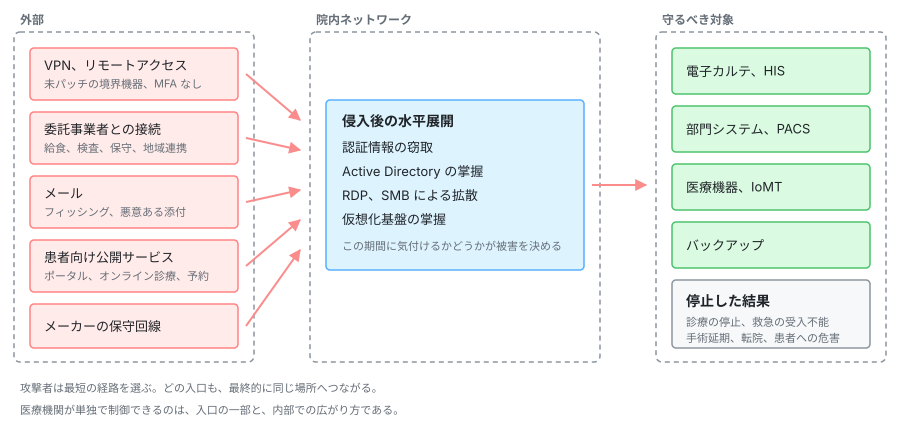

<div align="center">

# 🏥 Awesome Healthcare Security

A curated knowledge base of **healthcare × cybersecurity**, organized from primary sources in Japan and abroad.

<br>

[](https://github.com/sindresorhus/awesome)
[](LICENSE)
[](https://github.com/scgajge12/awesome-healthcare-security/commits/main)
[](https://github.com/scgajge12/awesome-healthcare-security/stargazers)

[日本語](README.md) | **English**

<br>

[**Incidents**](docs/incidents/) |
[**OSS Vulnerabilities**](docs/oss-vulnerabilities/) |
[**Medical Devices**](docs/medical-devices/) |
[**Pharma**](docs/pharma/) |
[**Web**](docs/web-security/) |
[**Bug Bounty**](docs/bug-bounty/) |
[**Pentest**](docs/pentest/) |
[**Cloud**](docs/cloud/) |
[**DX / AX**](docs/dx-ax/) |
[**Regulation**](docs/guidelines/) |
[**Threat Actors**](docs/threat-actors/) |
[**Monthly**](monthly-reports/) |
[**Resources**](docs/resources/)

</div>

> [!NOTE]
> The linked pages are written in Japanese, with the underlying sources cited in their original language.
> English translations of the individual pages are on the roadmap.

---

## Why healthcare security is different

Healthcare is not the only life-critical infrastructure.
What makes healthcare and pharma distinct is that the thing you are defending is not the IT estate but **the continuity of care and of drug supply**.
Enterprise systems are designed with confidentiality first; here, availability and integrity come before it.
A lab value that is off by one digit and still readable, or a batch record altered while shipping continues, can be more dangerous than a system that is down.
That inverted priority is where the six constraints below start.

Everything below covers both care providers and pharmaceutical companies.

<table>
<tr>
<td width="50%" valign="top">

### ⏱️ No slack in the decision cycle

Clinical systems run 24/7/365, and even planned downtime is hard to schedule.
Prolonged downtime turns directly into decisions about diverting ambulances, postponing surgery, and halting shipment of a drug.
The argument is rarely about whether a control is correct, but about whether a window exists to apply it.

</td>
<td width="50%" valign="top">

### 🚪 The "it's air-gapped, so it's safe" assumption

Hospital information systems and production line controls alike were designed around closed networks isolated from the internet.
That assumption becomes the reason perimeter devices sit unpatched.
Those same perimeter devices are where real intrusions start.

</td>
</tr>
<tr>
<td width="50%" valign="top">

### 🕰️ Old assets inside a structure nobody can map

Medical devices have service lives past ten years, and end-of-life operating systems stay in production.
Regulated devices and validated manufacturing equipment cannot be reconfigured without going through approval.
The EHR, departmental systems, medical devices, production line controls, and back-office IT share one network while ownership and vendors are split across them.
If you cannot draw what connects to what, you can neither scope an incident nor isolate it.

</td>
<td width="50%" valign="top">

### 🔗 The attack surface does not end at your own organization

Catering, laboratory, cleaning, and maintenance suppliers, along with API and contract manufacturing partners, all hold network connections into the estate.
A design that only covers what is inside the organization cannot close the paths that come from outside it.

</td>
</tr>
<tr>
<td width="50%" valign="top">

### 💊 Data you cannot revoke, all in one place

Health records cannot be reissued the way a card number can.
A diagnosis or treatment history stays true for life, and it sits next to names, addresses, and insurance details.
In pharma, trial data and pre-approval research sit on top of that, and their value is gone the moment they are stolen.
In both cases, encryption plus exposure is effective leverage.

</td>
<td width="50%" valign="top">

### 💰 The conditions that push toward paying

Attackers price a target on the probability of collecting, not on the value of the data.
When stopped care or stopped shipment is urgent, recovery is slow, and patient safety is the hostage, the decision leans toward payment.
That expected value is why healthcare and pharma keep getting targeted.

</td>
</tr>
</table>

These six are not independent.
Trust in the closed network licenses weak asset management and segmentation, and once a supplier connection is abused in that state, the systems that cannot go down go down.
Attacker motives differ (money, espionage, political messaging), but the entry points they use overlap.
Defensive design is therefore driven by the number of entry points, not by the taxonomy of actors ([threat actors and risks](docs/threat-actors/actors-and-risks.md)).
Actual intrusion paths and how far the damage spread are collected in the [incident case studies](docs/incidents/).

### How fast the assumptions break: DX and AX

Systems that assume connectivity to external networks, such as online insurance eligibility verification and electronic prescriptions, are being rolled out across providers.
Inventory of those connection points, authorization design, traffic monitoring, and incident playbooks tend to arrive after the rollout rather than with it.
When connection points multiply while the design philosophy still assumes a closed network, trust in isolation and opacity of structure degrade at the same time.

AI adoption (AX) widens that gap further.
Generative AI does not create the six constraints above, but it compresses the timeline on all of them.

1. **The window before exploitation shrinks.** As vulnerability analysis and target-specific phishing get automated, the gap between disclosure and exploitation narrows.
   A sector that measures patch cycles in months is on the wrong side of that compression.
2. **LLMs move into the clinical and development workflow.** Chart text, patient-entered questionnaires, OCR of inbound referral letters, trial documents, and safety reports go straight into a model as input.
   All of these are external inputs an attacker can write into, which makes them a path for indirect prompt injection.
3. **Agents get connected to the EHR.** A broken authorization check is no longer one leaked record but cross-patient access.
   A classic IDOR turns into bulk retrieval driven by a single natural-language instruction.
4. **The update problem repeats itself.** For AI-enabled software as a medical device, the model update itself falls under the approval process.
   The constraint of "no changes without vendor approval" comes back for artifacts that are expected to change often.

All of it comes from the same gap: the speed at which the field adopts new technology versus the speed at which regulation and operations catch up.

### Frontier AI and critical infrastructure

Healthcare is designated as critical infrastructure in most jurisdictions ([guidelines and regulation](docs/guidelines/)).
Rising frontier model capability reaches attackers and defenders alike, but not in the same order.
An attacker can use a new capability the day it ships, while a provider or a drug maker has to move the same capability through regulation, procurement, and validation before it touches operations.
That lag grows with how slowly a sector can change.

- **Do not build the defense plan on the model vendor's safeguards.** Restrictions on misuse differ by provider and shift over time.
  Do not count them as a control you own.
- **The gains show up where staffing is the bottleneck.** Asset inventory, log summarization, and advisory impact triage are the work that gets skipped for lack of people.
- **If the output reaches a clinical decision, treat it as an integrity problem.** Tampered input data or a poisoned model is a patient safety event, not a disclosure event.

On 18 May 2026, the Japanese government issued an advisory to critical infrastructure operators on this exact lag, jointly signed by the National Cyber Office and eight other bodies, alongside a government-wide package named Project YATA-Shield.
What it asks for is asset inventory and a triage process built on the assumption that the window between disclosure and exploitation is shrinking ([AI security in healthcare](docs/dx-ax/ai-security.md)).

This repository is written for the people on the other side of that equation: security teams at care providers and pharmaceutical companies, medical device manufacturers, security researchers, bug bounty hunters, and compliance professionals.

<p align="center">
  
</p>

> [!NOTE]
> The labels in the diagram are in Japanese. Its structure follows the sections listed below.

---

## 📚 Contents

<table>
<tr>
<td width="50%" valign="top">

### 🚨 [Incident Case Studies](docs/incidents/)

Attacks on healthcare providers in Japan and abroad, tracked through initial access, scope of compromise, clinical impact, and remediation.

- [Japan](docs/incidents/japan.md)
- [Rest of the world](docs/incidents/global.md)

</td>
<td width="50%" valign="top">

### 🧬 [Open Source Health IT Vulnerabilities](docs/oss-vulnerabilities/)

Vulnerabilities and CVEs in open source EHR systems and medical imaging software. An entry point for research.

- [OSS EHR / HIS](docs/oss-vulnerabilities/ehr-systems.md)
- [Medical imaging OSS (PACS/DICOM)](docs/oss-vulnerabilities/imaging-pacs.md)

</td>
</tr>
<tr>
<td width="50%" valign="top">

### 🩺 [Medical Device Security](docs/medical-devices/)

Risks specific to IoMT and PACS/DICOM, and how to test them safely.

- [IoMT risks](docs/medical-devices/iomt.md)
- [PACS / DICOM security](docs/medical-devices/pacs-dicom.md)
- [Testing methodology](docs/medical-devices/testing-methodology.md)

</td>
<td width="50%" valign="top">

### 🌐 [Healthcare Web Application Security](docs/web-security/)

Vulnerabilities that tend to show up in patient portals and telehealth.

- [Patient portal vulnerabilities](docs/web-security/patient-portal.md)

</td>
</tr>
<tr>
<td width="50%" valign="top">

### 🎯 [Bug Bounty × Healthcare](docs/bug-bounty/)

Bug bounty and vulnerability disclosure in healthcare: what is in scope, where to report, and how to stand up a VDP. (Japanese)

</td>
<td width="50%" valign="top">

### 🔬 [Labs and Communities](docs/labs-communities/)

Research labs, ISACs, and communities in Japan and abroad.

- [Biohacking Village (DEF CON)](docs/labs-communities/biohacking-village.md)

</td>
</tr>
<tr>
<td width="50%" valign="top">

### 💊 [Pharmaceutical Security](docs/pharma/)

Theft of trial data and intellectual property, manufacturing equipment under GMP, and the API and contract manufacturing supply chain.

- [Clinical trials and research data](docs/pharma/clinical-trials.md)
- [Manufacturing and OT](docs/pharma/manufacturing-ot.md)
- [API, contract manufacturing, distribution](docs/pharma/supply-chain.md)

</td>
<td width="50%" valign="top">

### ⚖️ [Guidelines and Regulation](docs/guidelines/)

From Japan's "three-ministry, two-guideline" framework to HIPAA, FDA, EU MDR, and NIS2.

- [Japan](docs/guidelines/japan.md)
- [International](docs/guidelines/global.md)

</td>
</tr>
<tr>
<td width="50%" valign="top">

### ☁️ [Cloud Providers and Healthcare](docs/cloud/)

How responsibility is split across AWS, Google Cloud, Azure, and Sakura Internet, and the paths by which cloud-hosted health systems are compromised.

</td>
<td width="50%" valign="top">

### 🔄 [Healthcare DX and AX](docs/dx-ax/)

The connection points added by Japan's national health data platform, and the threats that come with putting AI into clinical and back-office work.

- [Healthcare DX: national platforms and connection points](docs/dx-ax/medical-dx.md)
- [AX: AI security in healthcare](docs/dx-ax/ai-security.md)

</td>
</tr>
<tr>
<td width="50%" valign="top">

### 🎯 [Threat Actors and TTPs](docs/threat-actors/)

Who targets healthcare and why, plus TTPs of ransomware groups mapped to MITRE ATT&CK and paired with defenses.

- [Threat actors and risks](docs/threat-actors/actors-and-risks.md)
- [TTPs by group](docs/threat-actors/ransomware-groups.md)
- [Defense playbook](docs/threat-actors/defense-playbook.md)

</td>
<td width="50%" valign="top">

### 📅 [Monthly Reports](monthly-reports/)

A month-by-month record of the sector: incidents, vulnerabilities, regulatory changes, and threat activity.

- [Index](monthly-reports/README.md)

</td>
</tr>
<tr>
<td width="50%" valign="top">

### 🧰 [Tools and Learning Resources](docs/resources/)

- [Tools](docs/resources/tools.md)
- [Papers and reports](docs/resources/research.md)
- [Learning resources](docs/resources/learning.md)
- [Glossary](docs/GLOSSARY.md)

</td>
<td width="50%" valign="top">

### 🛡️ [Security Assessment and Penetration Testing](docs/pentest/)

Testing scopes for hospitals and pharma, separated by domain: people, perimeter, web, cloud, internal, medical devices, and manufacturing OT.

</td>
</tr>
</table>

---

## 🗂️ Repository structure

```
awesome-healthcare-security/
├── docs/
│   ├── incidents/           Incident case studies (Japan, global)
│   ├── oss-vulnerabilities/ Open source health IT vulnerabilities
│   ├── medical-devices/     Medical device (IoMT, PACS) security
│   ├── web-security/        Healthcare web application security
│   ├── bug-bounty/          Bug bounty and vulnerability disclosure in healthcare
│   ├── pentest/             Security assessment and penetration testing
│   ├── pharma/              Pharmaceutical security (trials, manufacturing OT, supply chain)
│   ├── cloud/               Cloud providers and healthcare (AWS, Google Cloud, Azure, Sakura)
│   ├── dx-ax/               Healthcare DX and AX (national platforms, AI security)
│   ├── guidelines/          Guidelines and regulation
│   ├── threat-actors/       Threat actors and TTPs
│   ├── labs-communities/    Labs and communities
│   ├── resources/           Tools, papers, learning resources
│   ├── _templates/          Templates for adding new entries
│   └── GLOSSARY.md          Glossary
├── monthly-reports/         Monthly reports (YYYY/YYYY-MM.md)
├── skills/                  Review skill for the documents
├── scripts/                 Link check script
├── .githooks/               Git hooks run before commit
└── assets/                  Diagrams (SVG)
```

## ✍️ Editorial principles

This repository is written to be usable in real decisions, so every page follows four rules.

| Principle                        | What it means                                                                                                          |
| -------------------------------- | ---------------------------------------------------------------------------------------------------------------------- |
| **Separate fact from analysis**  | Anything sourced to a primary document is labeled as such, and clearly distinguished from the author's interpretation. |
| **Link to primary sources**      | Victim disclosures, government documents, CVEs, and vendor advisories — not secondhand news coverage.                  |
| **Don't state what isn't known** | Attribution, ransom amounts, and victim counts are marked as unconfirmed when they are unconfirmed.                    |
| **Write for defenders**          | Attack techniques are always paired with detection and mitigation.                                                     |

---

## ⚠️ Disclaimer

> [!WARNING]
> **Testing a live medical device or clinical system without authorization can put patients' lives at risk.**
> Only test with written authorization, in an isolated lab or an approved test environment.

- This repository is published for **educational and defensive purposes**. Do not apply anything here to systems you are not authorized to test.
- Content reflects the state of knowledge at the time of writing and comes with no warranty of accuracy or completeness. For compliance work, always consult the original regulatory text and the responsible authority.
- Views expressed here are the author's own and do not represent those of any employer.

---

## 📄 License

Released under [CC BY 4.0](LICENSE) (Creative Commons Attribution 4.0 International).

---

<div align="center">

## 👤 Author

**Yuta Morioka / morioka12**

Security Engineer / Ethical Hacker

[](https://github.com/scgajge12)
[](https://x.com/scgajge12)
[](https://scgajge12.github.io/)

<br>

<sub>© 2026 Yuta Morioka (morioka12) — Licensed under <a href="LICENSE">CC BY 4.0</a></sub>

</div>
