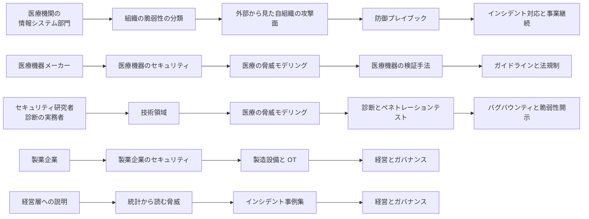

<div align="center">

# 🏥 Awesome Healthcare Security

**医療業界 × サイバーセキュリティ**の知見を、国内外の一次情報にもとづいて体系化したキュレーションリポジトリ

<br>

[](https://github.com/sindresorhus/awesome)
[](LICENSE)
[](https://github.com/scgajge12/awesome-healthcare-security/commits/main)
[](https://github.com/scgajge12/awesome-healthcare-security/stargazers)

**[日本語](README.md)** | [English](README-en.md)

<br>

[**脅威**](docs/threats/) |
[**技術領域**](docs/technology/) |
[**検証と実務**](docs/practice/) |
[**インシデント対応**](docs/response/) |
[**ガイドラインと法規制**](docs/guidelines/) |
[**経営とガバナンス**](docs/governance/) |
[**リファレンス**](docs/reference/) |
[**月報**](monthly-reports/)

</div>

---

## なぜ「医療 × セキュリティ」なのか

生命に関わるインフラは医療だけではない。
医療と製薬に固有なのは、守る対象が情報システムではなく**診療と医薬品供給の継続**である点にある。
一般の企業システムが機密性を最優先に設計されるのに対し、ここでは可用性と完全性が先に来る。
検査値が 1 桁ずれたまま参照できる状態や、製造記録が書き換わったまま出荷が続く状態は、システムが停止している状態より危険になりうる。
この優先順位の違いが、以下の六つの制約の出発点になっている。

本リポジトリは、病院などの医療機関と、製薬企業の双方を対象とする。

<table>
<tr>
<td width="50%" valign="top">

### ⏱️ 判断に猶予がない

24/365 稼働が前提で、計画停止の調整さえ難しい。
停止が長引けば、救急の受入可否、手術の延期、医薬品の出荷停止といった判断に直接つながる。
対策が正しいかどうかではなく、適用できる時間枠があるかどうかが争点になる。

</td>
<td width="50%" valign="top">

### 🚪 「閉域だから安全」という前提

医療情報システムも製造ラインの制御系も、外部から切り離された閉域網を前提に設計されてきた。
その前提が、境界機器のパッチ適用を後回しにする理由として働く。
実際の侵入は、その境界機器から始まる。

</td>
</tr>
<tr>
<td width="50%" valign="top">

### 🕰️ 古い資産と、把握しきれない構造

医療機器のライフサイクルは 10 年を超え、サポート切れ OS が現役で稼働する。
規制下にある機器や、バリデーション済みの製造設備は、承認を経ずに構成を変えられない。
電子カルテ、部門システム、医療機器、製造ラインの制御系、事務系が同じ網に同居し、管理主体もベンダも分かれる。
何がどこにつながっているかを描けない状態では、影響範囲の見積もりも隔離もできない。

</td>
<td width="50%" valign="top">

### 🔗 攻撃対象領域が自組織で完結しない

給食、検査、清掃、保守などの委託事業者や、原薬、受託製造の取引先との接続が侵入経路になる。
自組織の内側だけを対象にした設計では、外側から入られる経路を塞げない。

</td>
</tr>
<tr>
<td width="50%" valign="top">

### 💊 無効化できないデータが、まとまって置かれている

診療情報は、カード番号と違って再発行できない。
病名や治療歴は生涯変わらず、氏名、住所、保険資格までが同じ場所に揃う。
製薬では、これに治験データと承認前の研究情報が重なり、盗まれた時点で価値が戻らない。
どちらも、暗号化と暴露を組み合わせた二重恐喝が効きやすい。

</td>
<td width="50%" valign="top">

### 💰 支払いに傾く条件が揃っている

攻撃者が見ているのはデータの価値ではなく、回収できる確率である。
診療や出荷が止まる緊急度が高く、復旧に時間がかかり、患者の安全が人質になる構造では、支払いの判断に傾きやすい。
この期待値の高さが、医療と製薬が狙われ続ける理由になっている。

</td>
</tr>
</table>

この六つは独立していない。
閉域網への信頼が資産管理と分離の遅れを許し、その状態で委託先から侵入されると、止められないはずのシステムが止まる。
狙う側の動機は、金銭、諜報、政治的主張と分かれるが、通る入り口は重なる。
そのため防御の設計は、アクターの分類ではなく入り口の数で決まる（[脅威アクターとリスク](docs/threats/actors/actors-and-risks.md)）。
実際の侵入経路と被害の広がりは、[インシデント事例集](docs/threats/incidents/)にまとめている。

### DX と AX が前提を崩す速度

オンライン資格確認や電子処方箋のように、外部ネットワークとの接続を前提とする仕組みの導入が進んでいる。
一方で、接続点の棚卸し、権限設計、通信の監視、事故時の運用は、後から追いかける形になりやすい。
閉域網を前提とした設計思想のまま接続点だけが増えると、閉域への信頼と構造の不透明さが同時に悪化する。

AI の導入（AX）は、この差をさらに広げる。
生成 AI は上の六つを新しく生むわけではないが、いずれの時間軸も詰める方向に働く。

1. **悪用までの猶予が縮む**：脆弱性の解析や標的に合わせたメールの生成が自動化され、公開から悪用までの期間が短くなる。
   パッチ適用に月単位を要する医療は、この短縮の影響を受けやすい側にいる。
2. **診療と開発のフローに LLM が入る**：カルテ本文、患者が入力した問診票、外部から届く紹介状の OCR テキスト、治験文書や安全性情報が、そのまま LLM の入力になる。
   これらは攻撃者が内容を書き込みうる外部入力であり、間接プロンプトインジェクションの経路になる。
3. **エージェントが EHR に接続する**：認可の不備が、1 件の漏えいではなく患者横断の参照に直結する。
   従来の IDOR が、自然言語の指示ひとつで大量取得に変わる。
4. **更新できない問題が繰り返される**：AI を組み込んだプログラム医療機器では、モデルの更新そのものが承認プロセスの対象になる。
   メーカー承認なしに更新できないという制約が、更新頻度の高いモデルで再演される。

いずれも、現場が新しい技術を取り入れる速度と、規制と運用が追いつく速度の差から生じている。
国の基盤ごとの接続点と、医療に AI を組み込むときの脅威は、[医療 DX と AX](docs/technology/dx-ax/) にまとめている。

### フロンティア AI × 重要インフラ（医療）

医療は、各国で重要インフラとして位置づけられている（[ガイドラインと法規制](docs/guidelines/)）。
フロンティアモデルの能力向上は攻撃側と防御側の双方に効くが、届く順序が違う。
攻撃側は新しい能力を公開された日から使えるのに対し、医療機関や製薬企業が同じ能力を運用に組み込むには、規制、調達、検証の工程を通る必要がある。
この時間差は、更新の遅い分野ほど大きくなる。

- **防御計画を、モデル側の安全対策に依存させない**：悪用への制限は提供者ごとに異なり、時期によっても変わる。
  守りの前提として数えない。
- **人手が足りない作業から効果が出る**：資産の棚卸し、ログの要約、アドバイザリの影響判定など、人員の制約で頻度を落としてきた作業に向く。
- **出力が診療判断に入るなら、完全性の問題として扱う**：入力データの改ざんやモデルへの毒入れは、情報漏えいではなく患者安全に関わる事象になる。

2026 年 5 月 18 日には、この時間差を前提とした要請が政府から出ている。
内閣官房国家サイバー統括室ほか 8 機関の連名による重要インフラ事業者等への注意喚起と、対策パッケージ Project YATA-Shield である。
求められているのは、脆弱性の発見から悪用までの時間が短くなることを前提とした資産管理と、優先順位付けの体制である（[AX：医療における AI のセキュリティ](docs/technology/dx-ax/ai-security.md)）。

本リポジトリは、医療機関と製薬企業のセキュリティ担当者、医療機器メーカー、セキュリティ研究者、規制対応担当者が、それぞれの立場で必要な情報にたどり着けることを目指す。

<p align="center">
  
</p>

---

## 🔍 どの視点で書いているか

医療とセキュリティを扱う資料は、規制の解説か、製品の説明か、事例の紹介に寄りやすい。
本リポジトリは、次の四つを通したときに残るものを書く。
どれか一つが欠けると、読んだ内容が手元の判断に使えなくなる。

| 視点 | 何をするか | 主に現れる場所 |
|---|---|---|
| **実装と運用に落ちる形で書く** | 対策を方針で終わらせず、どこに何を置き、何で確かめるかまで書く。確かめ方の欄が埋まらない対策は、対策として数えない | [防御プレイブック](docs/threats/actors/defense-playbook.md)、[ネットワークの分離](docs/technology/segmentation.md)、[認証とアクセス管理](docs/technology/identity.md)、[ログと監視の設計](docs/technology/logging.md) |
| **攻撃側の順序で経路を読む** | 資産台帳の側からではなく、外から到達できる入口の側から数える。経路の材料は、公表された事例と観測された手口に取る | [医療機関に対する OSINT](docs/practice/osint.md)、[外部から見た自組織の攻撃面](docs/practice/attack-surface.md)、[連鎖するランサムウェア攻撃](docs/threats/actors/ransomware-chain.md)、[グループ別 TTPs](docs/threats/actors/ransomware-groups.md)、[Bug Bounty × 医療、ヘルスケア](docs/practice/bug-bounty/) |
| **リスクベースで順序を決める** | 予算と人員と停止調整の枠に収まる順序を書く。CVSS の高い順ではなく、外から届くか、患者に届くか、緩和策を置けるかで並べる | [リスクベースの考え方](docs/reference/security-basics.md#3-リスクベースの考え方)、[深刻度を、診療と患者安全の言葉に翻訳する](docs/practice/pentest/README.md#7-深刻度を診療と患者安全の言葉に翻訳する)、[小規模組織で何から始めるか](docs/governance/small-organizations.md) |
| **設計の段階で数え上げる** | 実装されたものを測る前に、境界をまたぐ流れと到達経路を数える。医療機関が構成に介入できる時点は、調達と接続の追加に限られる | [医療の脅威モデリング](docs/practice/threat-modeling.md)、[セキュリティ・バイ・デザイン](docs/reference/security-basics.md#9-セキュリティバイデザイン)、[医療機器の検証手法](docs/technology/medical-devices/testing-methodology.md) |

五つは、同じ対象を別の方向から見る。
設計で数え、外から何が分かるかを集め、見え方を確かめ、通るかどうかを測り、見ていない範囲を外部から知らせてもらう、という順に並ぶ（[検証と実務](docs/practice/)）。
記述そのものの確からしさは、後述の[記述の方針](#-記述の方針)で担保する。

---

## 📚 コンテンツ

`docs/` は七つの群に分かれている。
脅威を知り、守る対象を把握し、検証し、起きたときに動き、規制を確認し、体制を決め、参照材を引く、という順に並べた。

### 立場ごとの読み始め

全部を順に読む必要はない。
手元の役割に近いところから入ると、必要な判断材料に早く着く。



セキュリティの用語や枠組みから確認したい場合は、[セキュリティの基礎](docs/reference/security-basics.md) が各ページの前提をまとめている。

### 🎯 [脅威](docs/threats/)

<table>
<tr>
<td width="50%" valign="top">

#### 🚨 [インシデント事例集](docs/threats/incidents/)

国内外の医療機関の事例。
サイバー攻撃を主として、侵入経路、侵害範囲、診療への影響、再発防止策まで追跡する。
サポート詐欺、システム障害、内部不正、記憶媒体の紛失と盗難などの事案も副として収録する。

- [国内の事例](docs/threats/incidents/japan/)（年ごとの履歴）
- [海外の事例](docs/threats/incidents/global/)（年ごとの履歴）
- [年ごとの情勢](docs/threats/incidents/years/)（国内と海外を統合した集計、規制の動き）
- 2019 年以前の履歴：[国内](docs/threats/incidents/japan/2019-earlier.md)（79 件）／[海外](docs/threats/incidents/global/2019-earlier.md)（33 件）
- 米国 HHS OCR 届出の全件集計（届出の分布、影響人数の上位、取得の手順）：[2025 年](docs/threats/incidents/global/2025-us-hhs.md)（795 件）／[2024 年](docs/threats/incidents/global/2024-us-hhs.md)（741 件）／[2023 年](docs/threats/incidents/global/2023-us-hhs.md)（746 件）／[2022 年](docs/threats/incidents/global/2022-us-hhs.md)（718 件）／[2021 年](docs/threats/incidents/global/2021-us-hhs.md)（715 件）／[2020 年](docs/threats/incidents/global/2020-us-hhs.md)（663 件）
- [事例の調べ方](docs/threats/incidents/research-tips.md)（情報源、手順、落とし穴）
- [調査報告書から攻撃の流れを復元する](docs/threats/incidents/report-reading.md)（取り出す欄、書かれていないことの扱い）

</td>
<td width="50%" valign="top">

#### 🎯 [脅威アクターと TTPs](docs/threats/actors/)

医療を狙うアクターと動機を整理し、ランサムウェアグループの TTPs を ATT&CK にマッピングして防御策と対応づける。

- [脅威アクターとリスク](docs/threats/actors/actors-and-risks.md)
- [グループ別 TTPs](docs/threats/actors/ransomware-groups.md)
- [連鎖するランサムウェア攻撃](docs/threats/actors/ransomware-chain.md)
- [防御プレイブック](docs/threats/actors/defense-playbook.md)
- [組織の脆弱性の分類](docs/threats/actors/organizational-vulnerabilities.md)
- [ダークウェブと医療情報](docs/threats/actors/dark-web-medical-data.md)

</td>
</tr>
<tr>
<td width="50%" valign="top">

#### 📊 [統計から読む脅威](docs/threats/statistics/)

警察庁、IPA、個人情報保護委員会、厚生労働省と、FBI IC3、HHS OCR、ENISA の統計を集め、医療分野がどの位置に現れるかを読む。
数え方の違いと、被害が統計に現れるまでの経路も扱う。

- [日本の統計](docs/threats/statistics/japan.md)
- [海外の統計](docs/threats/statistics/global.md)

</td>
<td width="50%" valign="top">

#### 🧪 [完全性への攻撃と患者安全](docs/threats/integrity-attacks.md)

漏えいでも停止でもない三つ目の型。
値が変わったまま参照される状態を、どこで検知するか。

</td>
</tr>
</table>

### 🧩 [技術領域](docs/technology/)

<table>
<tr>
<td width="50%" valign="top">

#### 🩺 [医療機器のセキュリティ](docs/technology/medical-devices/)

IoMT、PACS/DICOM 固有のリスクと、安全に検証するための手法。

- [IoMT（医療 IoT 機器）のリスク](docs/technology/medical-devices/iomt.md)
- [PACS / DICOM のセキュリティ](docs/technology/medical-devices/pacs-dicom.md)
- [医療機器の検証手法](docs/technology/medical-devices/testing-methodology.md)
- [メーカー側の脆弱性受付と開示](docs/technology/medical-devices/psirt-cvd.md)

</td>
<td width="50%" valign="top">

#### 🧬 [OSS 医療情報システムの脆弱性](docs/technology/oss-vulnerabilities/)

医療で使われる OSS の一覧と、報告された脆弱性の事例。
SCA と SBOM による既知脆弱性への対処。

- [医療で使われる OSS の一覧](docs/technology/oss-vulnerabilities/oss-catalog.md)
- [報告された脆弱性の事例（CVE）](docs/technology/oss-vulnerabilities/cve-cases.md)
- [SCA と SBOM で既知脆弱性に対処する](docs/technology/oss-vulnerabilities/sca-sbom.md)
- [OSS 電子カルテ、HIS](docs/technology/oss-vulnerabilities/ehr-systems.md)
- [医用画像 OSS（PACS/DICOM 実装）](docs/technology/oss-vulnerabilities/imaging-pacs.md)

</td>
</tr>
<tr>
<td width="50%" valign="top">

#### 🌐 [医療系 Web アプリのセキュリティ](docs/technology/web-security/)

患者ポータル、オンライン診療で狙われやすい脆弱性と、医療情報連携の API の攻撃面。

- [患者用ポータルの脆弱性](docs/technology/web-security/patient-portal.md)
- [HL7 v2 と FHIR の攻撃面](docs/technology/web-security/hl7-fhir.md)
- [患者向けサイトの第三者送信](docs/technology/web-security/tracking.md)
- [PHR、健康アプリ、ウェアラブル](docs/technology/web-security/phr-apps.md)

</td>
<td width="50%" valign="top">

#### ☁️ [クラウド事業者と医療](docs/technology/cloud/)

AWS、Google Cloud、Azure、さくらインターネットの責任分界と、クラウド上の医療システムが侵害される経路。

- [MITRE ATT&CK for Cloud から見た医療クラウド環境（AWS 編）](docs/technology/cloud/mitre-attack-aws.md)
- [MITRE ATT&CK for Cloud から見た医療クラウド環境（Google Cloud 編）](docs/technology/cloud/mitre-attack-google-cloud.md)

</td>
</tr>
<tr>
<td colspan="2" valign="top">

#### 🪟 [Windows 環境のセキュリティ](docs/technology/windows/)

医療機関の情報システムの大半が動く基盤。
端末とサーバを分けた七つの攻撃シナリオ、Active Directory の攻撃面、端末で動くアプリケーションの権限昇格とメモリ破壊、Defender と EDR の回避、バックドアが残る場所と復旧で消えないもの。
いずれも、成立の条件と検知の観測点を対にして扱う。

- [Active Directory の攻撃面と、段階的な手当](docs/technology/windows/active-directory.md)
- [Windows アプリケーションのセキュリティ](docs/technology/windows/app-security.md)
- [Microsoft Defender と EDR の回避が成立する条件](docs/technology/windows/defense-evasion.md)

</td>
</tr>
<tr>
<td width="50%" valign="top">

#### 🔄 [医療 DX と AX](docs/technology/dx-ax/)

国の基盤で増える接続点と、医療に AI を組み込むときの脅威。
前提が崩れる速度を扱う。

- [医療 DX：国の基盤と接続点](docs/technology/dx-ax/medical-dx.md)
- [デジタル庁が担う医療 DX](docs/technology/dx-ax/digital-agency.md)
- [地域医療情報連携ネットワーク](docs/technology/dx-ax/regional-networks.md)
- [AX：医療における AI のセキュリティ](docs/technology/dx-ax/ai-security.md)
- [現場主導の DX と AX](docs/technology/dx-ax/field-led.md)

</td>
<td width="50%" valign="top">

#### 🧬 [ゲノムデータの保護](docs/technology/genomics.md)

再発行できないデータの所在、二次利用、事業者が消えるときの帰結。
がんゲノム医療の情報基盤から、消費者向け遺伝子検査までを扱う。

</td>
</tr>
<tr>
<td colspan="2" valign="top">

#### 📲 [デジタルヘルス](docs/technology/digital-health/)

治療用アプリ、遠隔医療、PHR、医療機関向け SaaS、健康データの二次利用基盤。
医療機関の外で作られ、同じデータを扱いながら規制の当たり方が変わる製品群を、攻撃者から見た集約度で並べる。

- [Google のデジタルヘルス](docs/technology/digital-health/google.md)

</td>
</tr>
<tr>
<td width="50%" valign="top">

#### 🧱 [ネットワークの分離](docs/technology/segmentation.md)

医療機関のゾーンモデル、分離が破れる典型的な構造、到達性の確認、例外の扱い。
直せない資産を周囲から守るための設計。

</td>
<td width="50%" valign="top">

#### 🔑 [認証とアクセス管理](docs/technology/identity.md)

二要素認証の要求と期限、ID の棚卸し、ブレークグラス、保守アカウント。
現場の運用を崩さずに、水平展開を止める設計。

</td>
</tr>
<tr>
<td colspan="2" valign="top">

#### 🪵 [ログと監視の設計](docs/technology/logging.md)

何を残し、どれだけ保存し、誰が読むか。
侵害範囲の確定、内部不正の検知、届出の三つの用途から逆算する。

</td>
</tr>
<tr>
<td width="50%" valign="top">

#### 📡 [検知の設計を技法単位に落とす](docs/technology/detection-engineering.md)

技法ごとの観測点と条件、医療の正常な業務が誤検知になる形。
欺瞞とカナリアを置ける場所と、置いてはいけない場所。

</td>
<td width="50%" valign="top">

#### 🔓 [外に出た認証情報](docs/technology/credential-exposure.md)

資格情報が組織の外へ出る経路と、攻撃側での使われ方。
自組織のものを確認する手順と、見つけたときの失効の順序。

</td>
</tr>
<tr>
<td width="50%" valign="top">

#### ✉️ [メールとドメインの管理](docs/technology/email-domain.md)

送信ドメイン認証、失効したドメインの再取得、請求と支払いを狙うメール。
なりすまされたときの被害が組織の外に出る領域。

</td>
<td width="50%" valign="top">

#### 🗑️ [記憶媒体の廃棄と機器の下取り](docs/technology/media-disposal.md)

組織の管理から外れていく資産。
消去の方法、委託の連鎖、中古の医療機器に残るネットワークの資格情報。

</td>
</tr>
<tr>
<td width="50%" valign="top">

#### 🔍 [検索経路の汚染](docs/technology/seo-poisoning.md)

職員の業務上の検索が初期侵入になる型、患者が偽サイトや未承認の販売サイトに到達する型、自組織のサイトが踏み台になる型。
配信側が一度しか渡さないことが調査に与える制約と、実行の段を壊す手当。

</td>
<td width="50%" valign="top">
</td>
</tr>
</table>

### 🛡️ [検証と実務](docs/practice/)

<table>
<tr>
<td width="50%" valign="top">

#### 🧠 [医療の脅威モデリング](docs/practice/threat-modeling.md)

設計図が手元にない状態から始めて、信頼境界と攻撃ツリーを描き、優先順位のついた対策と検証項目に落とす。

</td>
<td width="50%" valign="top">

#### 🔍 [医療機関に対する OSINT](docs/practice/osint.md)

制度、広報、学会、求人、調達から何が外に出るか。
情報の種類ごとに、経路と手法、攻撃側の使い道、減らせるものと減らせないものを対応づける。
Web と IoMT に分けた道具と段階を含む。

</td>
</tr>
<tr>
<td width="50%" valign="top">

#### 🛰️ [外部から見た自組織の攻撃面](docs/practice/attack-surface.md)

台帳と実際のずれ、外から到達できる入口の数え方、測ってよい範囲の線引き、増えたときに気付く仕組み。

</td>
<td width="50%" valign="top">

#### 🛡️ [診断とペネトレーションテスト](docs/practice/pentest/)

医療機関と製薬企業に対する検証を、人、外部境界、Web、クラウド、内部、医療機器、製造 OT の領域に分けて整理する。
レッドチーム演習と TLPT の違い、工程と主体、Red Team Operator の職能、潜伏（ステルス）と対になる検知、病院のゾーンを通る経路と越えない線は、[レッドチームと TLPT を医療機関に当てはめる](docs/practice/pentest/red-team-tlpt.md) に置いた。
演習環境の攻略の型を病院に当てはめた読み替えと、実在の医療機関の診断で繰り返し所見になる製品と構成は、[Hack The Box の型で病院を想定する](docs/practice/pentest/htb-style-hospital.md) に置いた。

</td>
</tr>
<tr>
<td colspan="2" valign="top">

#### 🎯 [Bug Bounty × 医療、ヘルスケア](docs/practice/bug-bounty/)

医療分野でのバグバウンティと脆弱性開示。
触れてよい対象の線引き、報告経路、サイバー防衛としての位置づけ、受け入れ側の始め方。

</td>
</tr>
<tr>
<td colspan="2" valign="top">

#### ⚖️ [検証と調査の法的境界](docs/practice/legal-boundary.md)

行為の段ごとに当たる法令、立場ごとの線、許諾の文面に書く事項。
実データに到達したときの扱いと、制度が用意している報告の経路。

</td>
</tr>
</table>

### 🚑 [インシデント対応と事業継続](docs/response/)

侵害が起きたあとを扱う。
初動の判断、電子カルテが止まった状態で診療を続ける運用、届出の義務、復旧の優先順位。

- [サイバー攻撃を想定した BCP](docs/response/bcp-cyber.md)
- [基盤の構えと、外部への依存](docs/response/dependencies.md)
- [演習シナリオのカタログ](docs/response/tabletop.md)

残りの主題は順次追加する。

### ⚖️ [ガイドラインと法規制](docs/guidelines/)

国内の三省二ガイドラインから、HIPAA、FDA、EU MDR / NIS2 まで。

- [国内のガイドライン、法規制](docs/guidelines/japan.md)
- [海外のガイドライン、法規制](docs/guidelines/global.md)

### 🏛️ [経営とガバナンス](docs/governance/)

誰がどう決めるかを扱う。
CISO の役割と体制、経営層への報告、成熟度の把握、予算と人材、リスク移転、小規模組織での進め方。

- [経営層の責任の明確化](docs/governance/executive-accountability.md)
- [調査データから読む、備えの穴](docs/governance/readiness-gaps.md)
- [インシデントの費用と、経営層への説明](docs/governance/cost.md)
- [小規模組織で何から始めるか](docs/governance/small-organizations.md)

個別のページは順次追加する。

### 📚 [リファレンス](docs/reference/)

<table>
<tr>
<td width="50%" valign="top">

#### 💊 [製薬企業のセキュリティ](docs/reference/pharma/)

治験データと知的財産の窃取、GMP 下の製造設備、原薬と受託製造の供給網。

- [治験と研究データ](docs/reference/pharma/clinical-trials.md)
- [製造設備と OT](docs/reference/pharma/manufacturing-ot.md)
- [原薬、受託製造、流通](docs/reference/pharma/supply-chain.md)

</td>
<td width="50%" valign="top">

#### 🔬 [ラボ、コミュニティ](docs/reference/labs-communities/)

医療セキュリティの研究室、ISAC、国内外のコミュニティ。

- [Biohacking Village（DEF CON、CODE BLUE）](docs/reference/labs-communities/biohacking-village.md)
- [サイバーバイオセキュリティ](docs/reference/labs-communities/cyberbiosecurity.md)

</td>
</tr>
<tr>
<td width="50%" valign="top">

#### 🗂️ [セキュリティサービスのカタログ](docs/reference/security-services/)

外部から調達できるサービスを十四区分に分け、選び方、第三者評価の射程、契約で決めることを整理する。
掲載は推奨ではない。

- [国内のサービス](docs/reference/security-services/japan.md)
- [海外のサービス](docs/reference/security-services/global.md)

</td>
<td width="50%" valign="top">

#### 🧰 [ツールと学習リソース](docs/reference/resources/)

- [ツール](docs/reference/resources/tools.md)
- [論文、レポート](docs/reference/resources/research.md)
- [研究テーマの地図](docs/reference/resources/research-themes.md)
- [学習リソース](docs/reference/resources/learning.md)
- [リークサイト横断フィード](docs/reference/resources/leak-site-feeds.md)
- [用語集](docs/reference/GLOSSARY.md)

</td>
</tr>
<tr>
<td colspan="2" valign="top">

#### 🧭 [セキュリティの基礎](docs/reference/security-basics.md)

各ページが前提として使う語彙と枠組みを一通り並べる。
情報セキュリティの 7 要素、守るべきものからの逆算、リスクベースの考え方、設計の原則（多層防御、最小権限、ゼロトラスト、セキュリティ・バイ・デザイン）、脅威モデリング、診断とペネトレーションテスト、検知と対応、DevSecOps、OWASP、ハードニング。

</td>
</tr>
<tr>
<td colspan="2" valign="top">

#### ⚖️ [医療の倫理とセキュリティの倫理](docs/reference/ethics.md)

二つの倫理の概念、特徴、考え方の違いを並べる。
同意を与える者と危害を受ける者のずれ、侵襲を正当化する向き、守秘の受益者、緊急時に守る対象の順位が入れ替わる場面。

</td>
</tr>
<tr>
<td colspan="2" valign="top">

#### 🤖 [AI エージェントから使う](docs/reference/ai-agent.md)

本リポジトリを AI エージェントの参照先として使う手順。
取り込み方、構造の渡し方、聞き方、生成物の確かめ方、更新の追い方（git、Atom フィード、Slack 通知）。

</td>
</tr>
</table>

### 📅 [月報](monthly-reports/)

医療分野の動向を月単位で記録する。
インシデント、脆弱性、規制の動き、脅威動向。
進行中の年の速報はここに置き、一次情報が確定したものを[インシデント事例集](docs/threats/incidents/)の履歴へ繰り上げる。
2026 年 8 月分から書き始めた段階であり、過去の月は遡って埋めていない。

- [月報一覧](monthly-reports/README.md)

---

## 🗂️ リポジトリの構成

```
awesome-healthcare-security/
├── docs/
│   ├── threats/                     脅威
│   │   ├── incidents/               インシデント事例（japan/、global/ に年別の履歴、years/ に年ごとの情勢。サイバー攻撃を主、それ以外の事案を副として収録）
│   │   ├── actors/                  脅威アクターと TTPs、防御プレイブック
│   │   ├── statistics/              公的統計から読む脅威（japan.md、global.md）
│   │   └── integrity-attacks.md     完全性への攻撃と患者安全（改変の経路、検知の設計）
│   ├── technology/                  技術領域
│   │   ├── medical-devices/         医療機器（IoMT、PACS）のセキュリティ
│   │   ├── oss-vulnerabilities/     OSS 医療情報システムの脆弱性
│   │   ├── web-security/            医療系 Web アプリケーションのセキュリティ
│   │   ├── windows/                 Windows 環境のセキュリティ（Active Directory、Windows アプリ、Defender と EDR の回避）
│   │   ├── cloud/                   クラウド事業者と医療（AWS、Google Cloud、Azure、さくら）
│   │   ├── dx-ax/                   医療 DX と AX（国の基盤、デジタル庁、地域医療連携、医療 AI、現場主導の導入）
│   │   ├── digital-health/          デジタルヘルス（規制の当たり方、攻撃面、Google のデジタルヘルス）
│   │   ├── genomics.md              ゲノムデータの保護（所在、二次利用、事業者が消えるときの扱い）
│   │   ├── identity.md              認証とアクセス管理（二要素認証の期限、ID の棚卸し、ブレークグラス）
│   │   ├── logging.md               ログと監視の設計（何を残すか、保存期間、読む仕組み）
│   │   ├── detection-engineering.md 検知の設計を技法単位に落とす（観測点、条件、正常系、欺瞞）
│   │   ├── credential-exposure.md   外に出た認証情報（流出の経路、確認、失効の順序）
│   │   ├── email-domain.md          メールとドメインの管理（送信ドメイン認証、失効ドメイン、BEC）
│   │   ├── seo-poisoning.md         検索経路の汚染（職員の検索、患者の検索、踏み台になるサイト）
│   │   ├── media-disposal.md        記憶媒体の廃棄と機器の下取り（消去、証跡、中古市場）
│   │   └── segmentation.md          ネットワークの分離（ゾーンモデル、到達性の確認、例外の管理）
│   ├── practice/                    検証と実務
│   │   ├── threat-modeling.md       医療の脅威モデリング（信頼境界、STRIDE、攻撃ツリー、順序づけ）
│   │   ├── osint.md                 医療機関に対する OSINT（情報源、手法、リスク、減らせる範囲）
│   │   ├── attack-surface.md        外部から見た自組織の攻撃面（棚卸し、測り方の線引き、継続）
│   │   ├── legal-boundary.md        検証と調査の法的境界（条文、立場ごとの線、許諾の文面）
│   │   ├── pentest/                 セキュリティ診断とペネトレーションテスト
│   │   └── bug-bounty/              バグバウンティと脆弱性開示（医療分野）
│   ├── response/                    インシデント対応と事業継続（サイバー BCP、基盤の構えと外部依存、演習、初動、届出）
│   ├── guidelines/                  ガイドラインと法規制
│   ├── governance/                  経営とガバナンス（経営層の責任、体制、報告、予算、リスク移転、インシデントの費用、小規模組織）
│   └── reference/                   リファレンス
│       ├── pharma/                  製薬企業のセキュリティ（治験、製造 OT、供給網）
│       ├── labs-communities/        ラボ、コミュニティ
│       ├── resources/               ツール、論文、研究テーマ、学習リソース、リークサイト横断フィード
│       ├── security-services/       セキュリティサービスのカタログ（japan.md、global.md）
│       ├── _templates/              事例追加のテンプレート
│       ├── security-basics.md       セキュリティの基礎（7 要素、設計の原則、脅威モデリング、検知と対応）
│       ├── ethics.md                医療の倫理とセキュリティの倫理（概念、特徴、考え方の違い）
│       ├── ai-agent.md              AI エージェントから使う（取り込み方、聞き方、更新の追い方）
│       └── GLOSSARY.md              用語集
├── monthly-reports/                 月報（YYYY/YYYY-MM.md）
├── skills/                          文書レビュー用のスキル
├── scripts/                         リンク切れ確認のスクリプト
├── .githooks/                       コミット前に走らせるフック
└── assets/                          図（SVG）
```

## 🤖 AI エージェントから使う

本リポジトリは Markdown だけで構成している。
クローンするか GitHub 越しに読ませれば、AI エージェントの参照先としてそのまま使える。
取り込み方、構造の渡し方、聞き方、生成物の確かめ方は [AI エージェントから使う](docs/reference/ai-agent.md) にまとめた。

更新は、次のいずれかで追える。

| 手段 | 方法 |
|---|---|
| git | `git pull` のあと `git log --since=<日付> --name-status` で変更ファイルを一覧する |
| Atom フィード | `https://github.com/scgajge12/awesome-healthcare-security/commits/main.atom` |
| Slack | GitHub 公式アプリで `/github subscribe scgajge12/awesome-healthcare-security`（[設定と絞り込み](docs/reference/ai-agent.md#7-slack-で通知を受け取る)） |
| 月報 | [月報一覧](monthly-reports/README.md) |

要約や再利用のときは、本文に載せている一次情報のリンクと、「事実」「報道ベース」「分析」の区別を残してほしい（[ライセンス](#-ライセンス)）。

---

## ✍️ 記述の方針

本リポジトリは、セキュリティ実務者が意思決定に使えることを前提に、次の四つを徹底する。

| 原則                           | 内容                                                                                  |
| ------------------------------ | ------------------------------------------------------------------------------------- |
| **事実と推測を分ける**         | 公表された一次情報にもとづく記述と、筆者の分析や推測を区別して表記する                |
| **一次情報にリンクする**       | 報道の二次引用ではなく、当事者の公表資料、行政文書、CVE、ベンダアドバイザリを優先する |
| **断定できないことは書かない** | 攻撃グループの帰属や被害額など、確度の低い情報は「未確認」と明記する                  |
| **防御に資する形で書く**       | 攻撃手法は、必ず検知、緩和策とセットで記述する                                        |

---

## ⚠️ 免責事項

> [!WARNING]
> **稼働中の医療機器や医療情報システムに対する無断の検証は、患者の生命を危険にさらしうる。**
> 検証は書面での許可を得たうえで、隔離環境または承認されたテスト環境で実施してほしい。

### 何のために公開しているか

本リポジトリは、医療機関と製薬企業を守る側の学習と啓発のために公開している。
攻撃の手口を扱う箇所があるのは、何が起きるのかを知らないままでは検知も緩和もできないためである。
そのため攻撃手法は検知、緩和策とセットで記述し、そのまま攻撃に使える実装コードやエクスプロイトは掲載しない（[執筆方針](CLAUDE.md)）。

想定する読者は、医療機関の情報システム担当者、医療機器メーカーとベンダの開発、品質保証の担当者、製薬企業のセキュリティ担当者、医療分野を対象とするセキュリティ技術者である。

### どこまで使ってよいか

記載した技術情報は、自分に権限のあるシステム、または管理者から書面で許可を得たシステムに対してだけ使ってほしい。
権限のないシステムに向けて試す行為は、本リポジトリが認める利用ではない。
「動作を確かめるだけ」「壊すつもりはない」という意図は、法的な責任を打ち消さない。

医療分野では、検証行為そのものが診療の停止や患者への危害につながりうる。
診療に使われている機器やシステムは、想定していない通信や入力を受け取ると停止することがあり、その停止が処置の中断に直結するためである。

技術的な関心を向ける先としては、合法な経路が用意されている。
IPA の[脆弱性関連情報の届出制度](https://www.ipa.go.jp/security/todokede/vuln/uketsuke.html)、CTF、公式に運営されている[バグバウンティ](docs/practice/bug-bounty/)がこれにあたる。
自分で構築した環境や、演習のために提供された環境であれば、手を動かして確かめられる。

### 日本の法律との関係

**事実**：日本国内では、権限のないシステムに対する行為が次の規定に触れうる。

| 行為の例 | 該当しうる規定 | 法定刑 |
|---|---|---|
| 他人の ID とパスワードでアクセス制御のかかったサーバに接続する。脆弱性を突いてアクセス制御を回避する | [不正アクセス行為の禁止等に関する法律](https://laws.e-gov.go.jp/law/411AC0000000128) 第 3 条（不正アクセス行為の禁止） | 3 年以下の拘禁刑または 100 万円以下の罰金（第 11 条） |
| 他人の識別符号を不正に取得する、不正に保管する、フィッシングで入力させる | 同法 第 4 条、第 6 条、第 7 条 | 1 年以下の拘禁刑または 50 万円以下の罰金（第 12 条） |
| 他人の識別符号を第三者に提供する | 同法 第 5 条（不正アクセス行為を助長する行為の禁止） | 30 万円以下の罰金（第 13 条）。相手に不正アクセスの目的があると知って提供した場合は第 12 条第 2 号 |
| 業務に使われている計算機に不正な指令を与えるなどして、意図に反する動作をさせ、業務を妨害する（ランサムウェアによる暗号化、サービス妨害など） | [刑法](https://laws.e-gov.go.jp/law/140AC0000000045) 第 234 条の 2（電子計算機損壊等業務妨害） | 5 年以下の拘禁刑または 100 万円以下の罰金 |
| 正当な理由なく、他人の計算機で実行させる目的でマルウェアを作成する、提供する | 刑法 第 168 条の 2（不正指令電磁的記録作成等） | 3 年以下の拘禁刑または 50 万円以下の罰金 |

**出典**：[e-Gov 法令検索](https://laws.e-gov.go.jp/)で各条文の現行の文言を確認できる。

不正アクセス行為の禁止等に関する法律には、年齢による適用除外がない。
また同法第 14 条により、第 11 条と第 12 条第 1 号から第 3 号までの罪は、日本国外で犯した場合も処罰の対象となる。
国外のシステムを対象とする場合は、あわせてその国の法律も適用される。

表中の「拘禁刑」は、懲役と禁錮を一本化した刑である。
刑法等の一部を改正する法律（令和 4 年法律第 67 号）の刑法に関する部分が 2025 年 6 月 1 日に施行され、これ以降の条文は「拘禁刑」と表記されている（出典：[e-Gov 法令検索の改正沿革](https://laws.e-gov.go.jp/law/140AC0000000045)）。
それ以前に書かれた資料では「懲役」と記載されている。

上の表は行為の外形を並べたものであり、どの罪が成立するかは個別の事情によって決まる。
判断が必要な場面では、弁護士や所管の窓口に相談してほしい。

関連する法律とガイドラインの全体像は、総務省「国民のためのサイバーセキュリティサイト」の[サイバーセキュリティ関連の法律・ガイドライン](https://www.soumu.go.jp/main_sosiki/cybersecurity/kokumin/basic/legal/)にまとまっている。
医療分野では、個人情報保護法（要配慮個人情報の取り扱い）、医療法施行規則、薬機法も重ねて適用される。
詳細は[国内のガイドライン、法規制](docs/guidelines/japan.md)を参照してほしい。

### 記載内容の位置づけ

- 記載内容は執筆時点のものであり、正確性と完全性を保証しない。規制やガイドラインへの対応にあたっては、原文および所管官庁の最新情報を確認してほしい。
- 法令に関する記述は、条文の内容を紹介したものであって、法的助言ではない。
- 本リポジトリの内容は著者個人の見解であり、所属組織の見解を代表しない。

---

## 📄 ライセンス

本リポジトリは [CC BY 4.0](LICENSE)（クリエイティブ・コモンズ 表示 4.0 国際）で公開している。

---

<div align="center">

## 👤 Author

**Yuta Morioka / morioka12**

Security Engineer, Ethical Hacker

[](https://github.com/scgajge12)
[](https://x.com/scgajge12)
[](https://scgajge12.github.io/)

<br>

<sub>© 2026 Yuta Morioka (morioka12) — Licensed under <a href="LICENSE">CC BY 4.0</a></sub>

</div>
