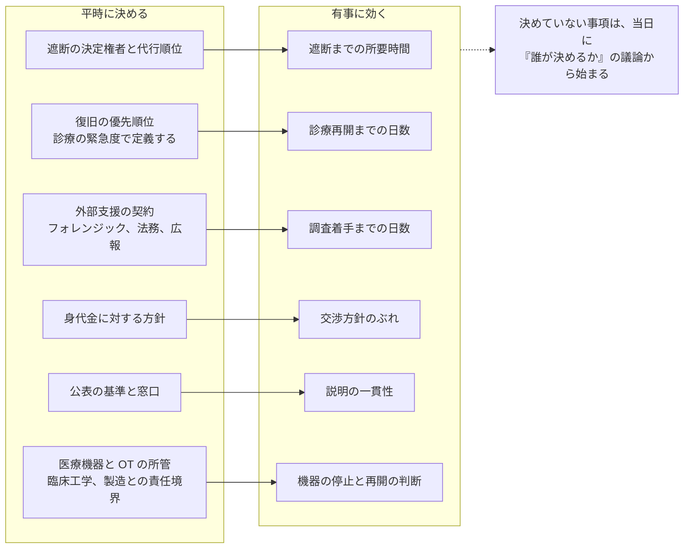

# 🏛️ 経営とガバナンス

守る対象や手法ではなく、**誰がどう決めるか**を扱う。
体制、権限、予算、経営層への報告という、平時に決めておかないと有事に決められない事項をまとめる。

## この群で扱うこと

| 主題 | 内容 |
|---|---|
| CISO の役割と体制 | 医療機関と製薬企業における責任の分掌。専任者が置けない場合の代替設計、情報システム部門、医療情報部門、臨床工学部門との責任境界 |
| 経営層への報告 | 理事会、経営会議で使う指標。診療停止日数、復旧費用、患者への影響で語る |
| 成熟度の把握 | 自組織の現在地を測る枠組みと、既存のチェックリストとの対応づけ |
| 予算と人材 | 投資の根拠、支援制度、内製と外部委託の切り分け |
| リスク移転 | サイバー保険の適用範囲と免責、支払い判断への影響 |
| 小規模組織 | 診療所と中小病院。専任者がいない前提で何から着手するか |

## 一覧

- [調査データから読む、備えの穴](readiness-gaps.md)

個別のページは順次追加する。

## 平時に決める事項と、有事に効く場面

同じ事項でも、平時に決めるときは合議で足りるが、有事には一人が即断する形に落ちていなければ動かない。
左の列で決めておかなかった事項が、右の列で議論から始まる。

**分析**：この対応づけは、経営層に投資を説明するときの材料にもなる。
技術対策の効果は説明しにくいが、決定権限の設計は、遮断までの時間と診療停止日数という、経営が扱える単位に直接つながる。

## 対策費用の桁

予算の議論は、「いくらかかるか分からない」という状態で止まりやすい。
公表資料に現れている費用感を、平時の恒常費と有事の一時費に分けて並べる。

> [!NOTE]
> 以下の数値は、日医総研が専門家、実務家へのインタビューで得た費用感であり、個別の見積りではない。
> 構成と規模で大きく変わるため、桁を把握するための材料として扱う。

| 区分 | 費用感 | 内訳 |
|---|---|---|
| 平時（診療所、中小病院） | 年間 68 万円から 180 万円 | ウイルス対策と EDR、IDS/IPS または UTM、サーバの脆弱性対策、オフラインバックアップ |
| 平時（保守契約） | 導入コストの 5% から 7% が目安 | ベンダへの委託分。委託事項を保守契約に明記することが前提 |
| 平時（大規模病院のリスク評価） | 1 回あたり 500 万円から | 評価そのものの費用。対策の実装費は別 |
| 有事（再接続の安全性の検証） | 数百万円から数千万円 | 攻撃を受けてネットワークから切断されたあと、再接続して安全であることを専門事業者の支援を受けて個別に検証する費用 |

**事実**：上記はいずれも [日医総研ワーキングペーパー No.488](https://www.jmari.med.or.jp/result/working/post-4657/)（2024 年 12 月 10 日）による。
同資料では、警察庁が指摘する水準のセキュリティを満たすには、診療所規模でも年間 100 万円規模の運用コストがかかるとの見解が示されている。

**事実**：一方で、対策費用を計画的に準備している医療機関は限られる。
2021 年の調査では、計画的に対策費用を準備していると回答した施設は 1 割強であった（[No.453](https://www.jmari.med.or.jp/result/working/post-233/)）。
2026 年の医師会共同利用施設への調査でも、健診・検査センターなどでは対策費用の準備がないとの回答が約 6 割弱を占めた（[No.501](https://www.jmari.med.or.jp/result/working/post-5118/)）。

**事実**：同資料は、導入コストは補助金で、運用コストは診療報酬上の評価で賄うことが望ましいとして、国に財源の確保を求めている。

**分析**：この表を経営会議に出す意味は、金額を示すことより、費用の性質を分けて見せることにある。
平時の費用は年単位の恒常費であり、有事の費用は一回で桁が上がるうえ、診療停止による減収と並行して発生する。
「予算がないので来年度に」という判断は、有事の費用が発生しない前提に立っている。
制度上の手当てが追いつくまでは、運用コストを設備投資ではなく恒常的な経費として計上する形に、費目の側から変える必要がある。

各資料の位置づけと、そこに現れる他の数値は [論文、レポート](../reference/resources/research.md#業界団体系シンクタンクの調査) に整理している。

## ガイドラインとの違い

[ガイドラインと法規制](../guidelines/) は、外から与えられる要求を扱う。
この群は、その要求を自組織のどの役職、どの会議体で引き受けるかを扱う。

厚生労働省の医療情報システムの安全管理に関するガイドラインは、読み手の役割ごとに編を分ける構成をとっており、経営層向けの編が独立して置かれている。
規制側が経営の関与を前提にしている一方で、実務資料は技術と運用に偏りやすい。
この群は、その差を埋めるために置いている。

## 有事との関係

体制が決まっていない組織では、侵害の当日に「誰がネットワークを切るか」から議論が始まる。
判断の主体と権限を平時に確定させる作業がこの群にあたり、確定したあとの手順は [インシデント対応と事業継続](../response/) に対応する。

自組織のどこが弱いかを棚卸しする段階では、[組織の脆弱性の分類](../threats/actors/organizational-vulnerabilities.md) が入口になる。
着手の順序を決める段階では、[防御プレイブック](../threats/actors/defense-playbook.md) の第 0 段階が対応する。

---

[トップへ](../../README.md)
