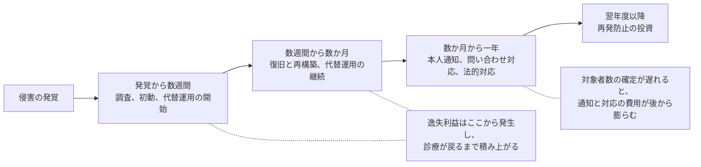

# 💰 インシデントの費用と、経営層への説明

セキュリティ投資の議論が止まるのは、たいてい同じ場所である。
「対策をしないとどうなるか」を金額で答えられないためである。

医療機関と製薬企業には、この問いに答えるための材料が公表されている。
調査報告書に書かれた復旧費用、警察庁の統計、届出制度に現れた影響人数である。
本ページは、それらを費用の枠組みに当てはめ、経営層への説明に使える形に整理する。

対策の中身は各技術ページで扱う。
ここで扱うのは、金額と期間と患者への影響という、経営会議の言語に翻訳する部分である。

> [!NOTE]
> **表記ルール**：本ページでは、**事実**（一次情報で確認できる内容。出典を併記する）、**報道ベース**（報道のみで確認でき、当事者の公表資料では裏付けが取れていない内容）、**分析**（筆者の解釈）を書き分ける。

---

## 費用は六つに分かれる

一つの金額で語ると、過小になる。
発生する時期も、支払う先も、保険での扱いも違うためである。

| 区分 | 内容 | 発生時期 | 保険での扱われ方 |
|---|---|---|---|
| 調査 | フォレンジック、原因究明、影響範囲の確定 | 発覚から数週間 | 費用補償の対象になることが多い |
| 復旧と再構築 | サーバと端末の再構築、データの復元、機器の再設定 | 発覚から数か月 | 一部が対象。設備更新にあたる部分は対象外になりやすい |
| 代替運用 | 紙運用の人件費、応援職員、外部委託、超過勤務 | 停止中の全期間 | 契約により分かれる |
| 逸失利益 | 診療制限、手術延期、外来縮小、出荷停止による減収 | 停止中と、その後の回復期間 | 利益補償の特約の有無で分かれる |
| 通知と対外対応 | 本人通知、コールセンター、広報、法務、訴訟対応 | 発覚から数か月以上 | 対象になることが多い |
| 再発防止投資 | 設計変更、機器更新、体制強化 | 翌年度以降 | 対象外 |

**分析**：この表で説明の効果が大きいのは、四番目の逸失利益である。
調査と復旧の費用は情報システム部門の予算として理解されるが、逸失利益は経営指標に直接現れる。
医療機関では診療制限、製薬企業では出荷停止として、事業計画の側から見える形になる。

---

## 公表された実額

### 国内の事例

**事実**：大阪急性期・総合医療センターの情報セキュリティインシデント調査委員会報告書（2023 年 3 月 28 日）は、被害額について「調査・復旧費用で数億円以上」「診療制限に伴う逸失利益として十数億円以上を見込んでいる」と記している。
基幹システムサーバの再稼働に 43 日間、部門システムを含めた診療システム全体の復旧に 73 日間を要した。
2022 年 11 月の診療実績は、新入院患者数 558 人（前年同月比 33.3%）、延入院患者数 10,191 人（同 52.9%）、初診患者数 465 人（同 17.9%）、延外来患者数 15,744 人（同 61.6%）である。
出典：[調査報告書 概要（PDF）](https://www.gh.opho.jp/pdf/reportgaiyo_v01.pdf)、[報告書本文（PDF）](https://www.gh.opho.jp/pdf/report_v01.pdf)、[事例](../threats/incidents/japan/2022-timeline.md#JP-2022-01)

**分析**：この事例が費用の説明に使いやすいのは、二つの数字の桁が違うためである。
調査と復旧が数億円、逸失利益が十数億円であり、後者が前者を上回っている。
「復旧できれば終わり」という前提で見積もると、被害の主要部分を落とすことになる。

**事実**：警察庁の統計では、ランサムウェア被害に関する調査費用の総額が 1,000 万円以上だった組織は 46 件で、有効回答の 51.7% にあたる。
復旧に 2 か月以上を要した組織が 7 件、回答時点で復旧中の組織が 25 件ある。
医療分野を含む全業種の集計であり、詳細は[日本の統計](../threats/statistics/japan.md)に整理している。

**分析**：この統計は「自組織で起きたらいくらか」ではなく「同程度の事案でどの範囲に収まるか」を示す。
個別事例の実額と統計の分布を並べて出すと、単一の数字より説明が通りやすい。

### 海外の事例

**事実**：Change Healthcare への攻撃について、影響を受けた個人の数は届出のたびに更新され、2025 年 7 月 31 日時点で 1 億 9,270 万人となった。
2024 年 7 月の当初の届出は 500 人であり、2025 年 1 月に約 1 億 3,000 万人へ更新されている。
出典：[OCR Breach Portal](https://ocrportal.hhs.gov/ocr/breach/breach_report.jsf)

**分析**：影響人数が 1 年以上かけて更新される構造は、費用の見積もりにも同じ形で効く。
本人通知とコールセンターの費用は人数に比例するため、初期の見積もりが後から数百倍になりうる。
初動の段階で総額を確定できると考えないほうがよい。

**分析**：米国の上場企業では、攻撃対応の費用が四半期ごとの決算資料に現れる。
本リポジトリで金額を事実として扱う場合は、報道の引用ではなく、当該企業の開示資料（10-K、10-Q、8-K）を出典にする。

---

## 金額より先に効く三つの指標

**分析**：経営層への説明では、金額だけを並べると「保険で対応できないか」という議論に収束しやすい。
医療機関で先に置くべきなのは、金額に換算する前の三つの指標である。

| 指標 | 何を示すか | 平時に測る方法 |
|---|---|---|
| 診療停止日数 | 電子カルテが使えない期間 | 過去の障害と、復旧手順の所要時間から見積もる |
| 救急応需の可否 | 地域の医療提供体制への影響 | 停止時に受け入れを継続できる体制があるか |
| 復旧の順序と所要時間 | 何が先に戻り、何が最後になるか | バックアップからの復元テストの実績 |

**分析**：この三つは、いずれも金額に翻訳できる。
診療停止日数に、一日あたりの診療収入を掛ければ逸失利益の概算になる。
逆向きには翻訳できず、金額から診療への影響は復元できない。
経営会議の資料は、三つの指標を先に置き、金額を後段に置く順序にする。

---

## 自組織で見積もる

外部の事例をそのまま当てはめると、規模が違うため説得力を失う。
自組織の数字で組み立てる。

1. 一日あたりの診療収入（または出荷額）を、直近の実績から出す
2. 電子カルテが停止した場合の診療制限の割合を、部門ごとに見積もる（外来、入院、手術、検査、透析）
3. 停止日数のシナリオを三つ置く（数日、二週間、二か月）
4. 各シナリオで、逸失利益、代替運用の費用、調査と復旧の費用を並べる
5. 前提（どの範囲が停止するか、バックアップから戻せるか、応援を得られるか）を明示する

**分析**：見積もりの精度は高くならない。
それでも作る価値があるのは、前提を書き出す過程で、決まっていない事項が判明するためである。
「バックアップから戻せる前提」で計算しようとしたときに、復元テストを実施していないことが分かる、という形で効く。

**事実**：警察庁の統計では、バックアップを取得していた組織は 116 件中 105 件にのぼる一方、そこから復元できたのは有効回答 99 件のうち 20 件である。
復元できなかった理由の最多は、バックアップ自体が暗号化されていたことだった（[日本の統計](../threats/statistics/japan.md)）。

**分析**：この数字は、見積もりの前提を「戻せる」から「戻せない可能性が高い」へ変える根拠になる。
シナリオの三つ目（二か月）を非現実的だと退けられたときに、この統計を出す。

---

## リスク移転で戻る範囲と戻らない範囲

| 区分 | 戻りやすい | 戻りにくい |
|---|---|---|
| 費用 | 調査、通知、コールセンター、法律相談 | 設備更新にあたる再構築、再発防止投資 |
| 損害 | 第三者への賠償 | 逸失利益（特約の有無による） |
| 事象 | 外部からの攻撃 | 設定不備や運用に起因する事象は、条件により争点になる |
| 時間 | 支払いは事後 | 停止中の資金繰りは補われない |

**分析**：保険の議論で見落とされやすいのは、最下段の時間である。
保険金は事後に支払われるため、停止中の代替運用にかかる支出は自組織の資金で先に立て替える。
補償額の議論と同時に、支払いまでの期間を確認する（[セキュリティサービスのカタログ](../reference/security-services/)）。

---

## 検証の結果を、経営指標に翻訳する

**分析**：診断やペネトレーションテストの報告書は、そのままでは経営層に届かない。
脆弱性の一覧ではなく、「その経路が使われたとき、診療が何日止まるか」に変換したときに、投資判断の材料になる。

| 検証で確かめた事実 | 経営指標への翻訳 |
|---|---|
| 委託先の接続点から基幹システムへ到達できた | 委託先の一台の侵害が、電子カルテの停止につながる |
| 業務ドメインの管理者でバックアップ基盤に到達できた | 復旧手段が同時に失われ、停止日数がシナリオの上限側になる |
| 医療機器ゾーンへ事務系から直接到達できた | 停止範囲が診療機器まで広がり、手術と検査の制限が加わる |
| 侵入の各段でログが残らなかった | 影響範囲を確定できず、確報の期限内に対象者を特定できない |
| 保守アカウントが常時有効で共有されていた | 侵入の起点が外部委託先に依存し、自組織だけでは防げない |

**分析**：右列は、いずれも金額の前段にある。
「電子カルテが何日止まるか」まで言えれば、あとは一日あたりの診療収入を掛けるだけで金額になる。
検証の発注時に、報告書へこの変換を含めることを要件として書いておくと、報告会がそのまま経営会議の資料になる（[診断とペネトレーションテスト](../practice/pentest/)）。

---

## 実務チェックリスト

**材料をそろえる**
- [ ] 一日あたりの診療収入（出荷額）を把握した
- [ ] 部門ごとの停止時の診療制限の割合を見積もった
- [ ] 公表された事例の実額と、統計の分布を資料に含めた
- [ ] 自組織のバックアップからの復元テストの実績を確認した

**説明の型**
- [ ] 診療停止日数、救急応需の可否、復旧の順序を先に置いた
- [ ] 金額は、前提を明示したうえで幅で示した
- [ ] 費用を六区分に分け、保険で戻る範囲を区別した
- [ ] 検証の結果を、停止日数と影響範囲の言葉に翻訳した

**継続**
- [ ] 見積もりの前提を、システム更改のたびに更新する運用にした
- [ ] 保険の補償範囲と支払いまでの期間を、更新時に確認する運用にした

---

## 関連ページ

- [調査データから読む、備えの穴](readiness-gaps.md)：自組織の現在地を測る
- [日本の統計](../threats/statistics/japan.md)：復旧期間と費用の分布
- [海外の統計](../threats/statistics/global.md)：届出制度に現れる規模
- [サイバー攻撃を想定した BCP](../response/bcp-cyber.md)：停止日数の見積もりに使う前提
- [基盤の構えと、外部への依存](../response/dependencies.md)：停止範囲を決める構成
- [診断とペネトレーションテスト](../practice/pentest/)：検証結果を経営指標へ翻訳する
- [ログと監視の設計](../technology/logging.md)：確報の期限に間に合うかを決める
- [セキュリティサービスのカタログ](../reference/security-services/)：外部委託とリスク移転

---

[← 経営とガバナンス](README.md) | [トップへ](../../README.md)
