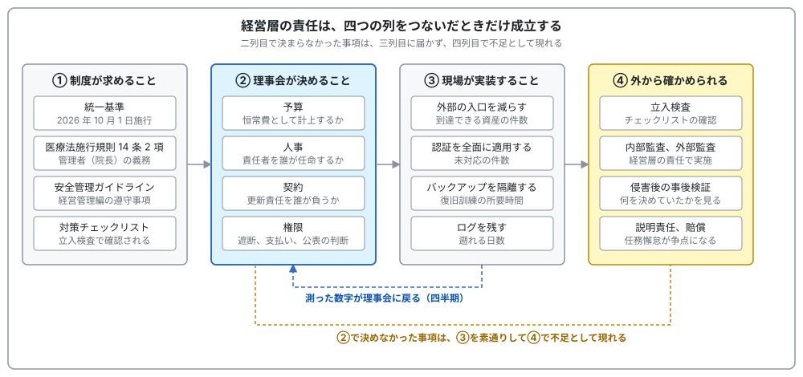
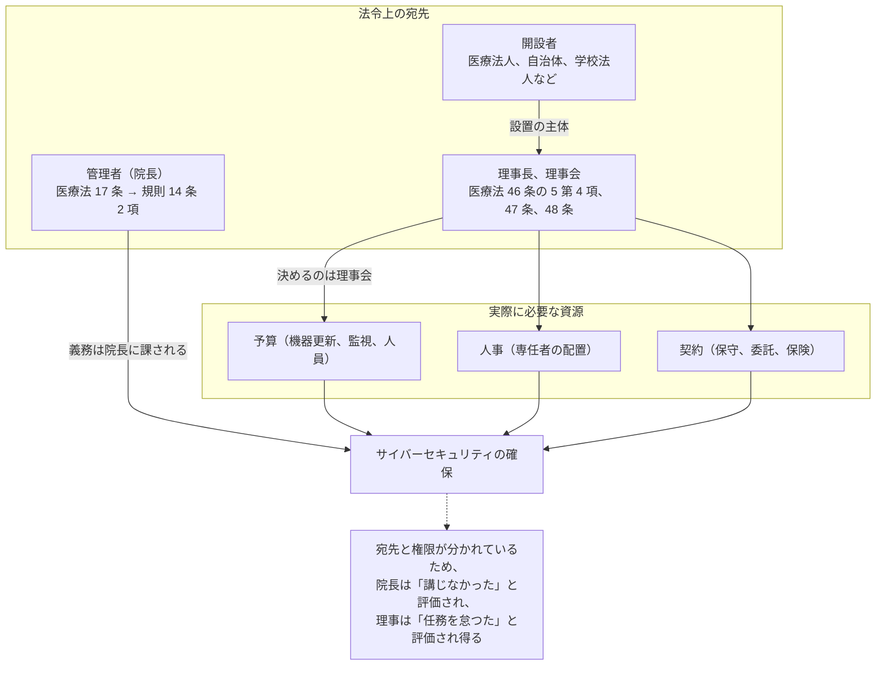
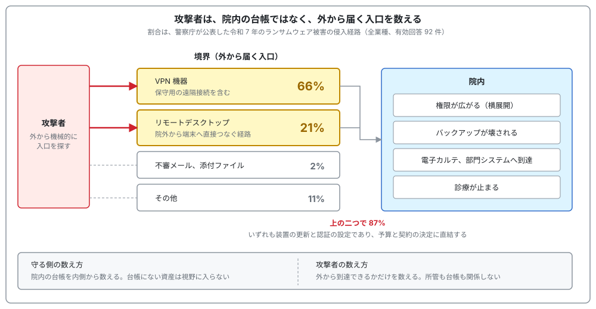
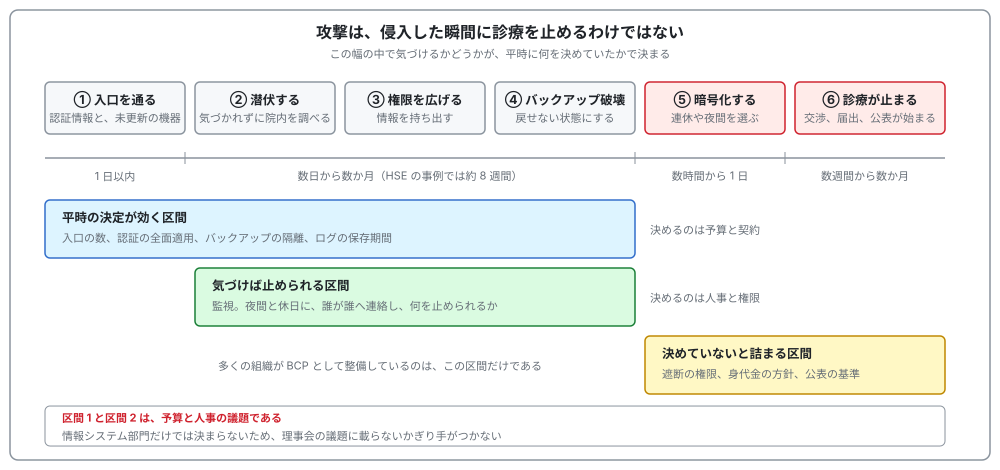
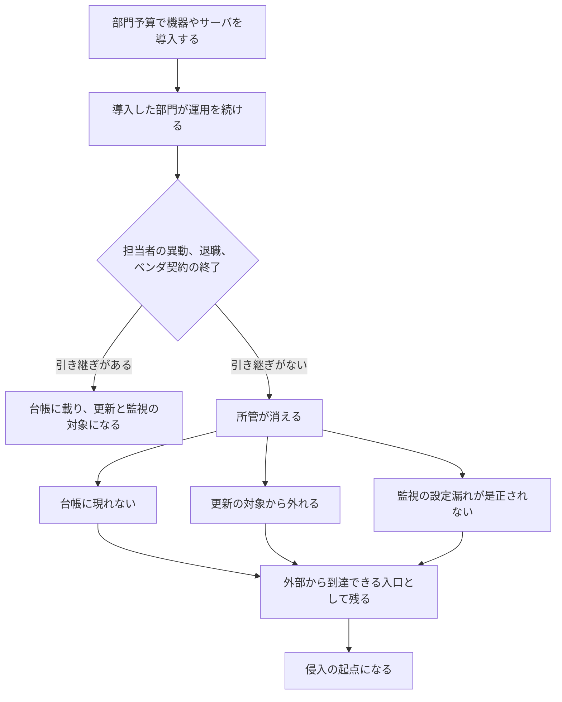
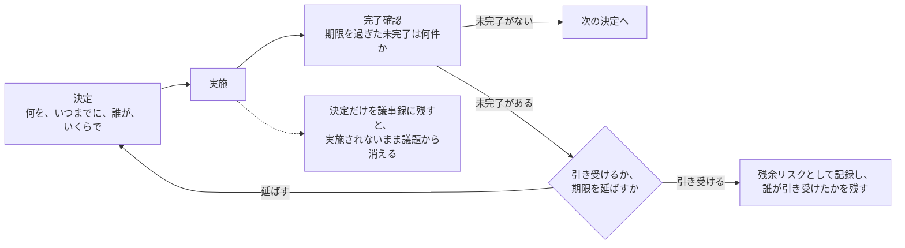

# 🏛️ 経営層の責任の明確化

サイバーセキュリティを「経営課題」と呼ぶ文書は多い。
一方で、誰が何を決め、決めなかったときに誰が問われるかまで書いた文書は少ない。

本ページは、2026 年に固まりつつある重要インフラ向けの制度と、医療機関に既に課されている義務を突き合わせ、責任の所在を具体的な役職と場面に落とす。
そのうえで、明確化された責任が実際に攻撃者の手間を増やしているかを、攻撃側の見方で検証する方法を扱う。

> [!NOTE]
> **表記ルール**：本ページでは、**事実**（一次情報で確認できる内容。出典を併記する）、**報道ベース**（報道や第三者の集計のみで確認でき、当事者の公表資料では裏付けが取れていない内容）、**分析**（筆者の解釈）を書き分ける。

---

## 経営層が最初に読む部分

### 何が起きているか

- 2026 年 10 月 1 日、医療を含む重要インフラ 16 分野を対象とする政府の統一基準が施行される。医療機関に届くのは、厚生労働省と業界団体がそれを受けて作る基準を通じてである
- 新しい枠組みが問うのは「攻撃を受けたか」ではなく、「組織の規模に見合う体制を**決めたか**」である
- 医療機関では、法令上の義務は**院長**に課され、予算と人事を決める権限は**理事会**にある。宛先が分かれている
- 侵入されてから診療が止まるまでには、数日から数か月の幅がある。そこで手を打てるかどうかは、平時に誰が何を決めていたかで決まる
- 侵入経路の 8 割超は VPN 機器とリモートデスクトップであり、装置の更新状態と認証の設定で決まる。どちらも予算と契約の決定である

  

### 役員会で聞く十の質問

技術の知識がなくても、この十問は聞ける。
答えに**数字と日付**が出てくるかどうかで、体制の実在が分かる。

| 聞くこと | 実体のある答え | 危ない答え |
|---|---|---|
| 1. 止まると外来を閉じるシステムはどれか。誰が決めたか | 一覧があり、診療部門と合意した日付と決めた会議体が記録されている | 「電子カルテです」（一覧も決定の記録もない） |
| 2. インターネットから当院に入れる入口は何件あるか。前回数えたのはいつか | 件数と測定日、前回からの増減が出る | 「ファイアウォールで守っています」 |
| 3. その入口のうち、パスワードだけで入れるものは何件か | 「38 件中 2 件」のように、母集団と未対応件数が言える | 「多要素認証を導入済みです」（対象の範囲が示されない） |
| 4. 退職した職員のアカウントは、退職後何日で使えなくなるか | 人事の名簿と突き合わせた実測の件数がある | 「手続きに沿って削除しています」 |
| 5. サーバの更新は誰の責任か。契約書のどこに書いてあるか | 条項を示せる。書かれていないサーバの台数も言える | 「ベンダにお任せしています」 |
| 6. ネットワークを切る判断は誰がするか。不在時は誰か | 権限者と代行順位が規程にあり、訓練で測った所要時間がある | 「そのときは理事会で相談します」 |
| 7. バックアップから電子カルテを戻す訓練を、最後にいつやったか | 実施日と所要時間、そこで出た想定外の件数 | 「毎日バックアップを取っています」 |
| 8. 身代金を払うかどうかの方針は決まっているか | 方針が文書にあり、決定権者と相談先が指名されている | 「そのときに判断します」 |
| 9. 前回決めたセキュリティ関連事項のうち、期限を過ぎて未完了のものは何件か | 件数が即答され、引き受けるか延ばすかが議題になっている | 「順調に進んでいます」 |
| 10. 外部に測ってもらった最後はいつか。指摘は何件残っているか | 実施日、残っている指摘の件数、それぞれの期限 | 「監査は受けています」（範囲が違う） |

**分析**：右の列に共通するのは、数字と日付がないことである。
セキュリティの説明が抽象的になるのは、担当者が隠しているからではなく、**測っていないから測れない**という順序であることが多い。
十問のうち答えに数字が出ない項目が、そのまま次に着手すべき領域になる。

### この文書の読み方

| 立場 | 読む範囲 |
|---|---|
| 理事長、院長、理事 | 本節と、[侵入経路の分布](#侵入経路の分布)、[交渉の席で起きること](#交渉の席で起きること)、[誤解しやすい点](#誤解しやすい点)、[経営層に何を出すか](#経営層に何を出すか) |
| 事務長、企画管理者 | 上記に加えて [この要求は医療機関のどこに落ちるか](#この要求は医療機関のどこに落ちるか)、[着手の順序](#着手の順序) |
| 情報システム担当、CISO | 全体。特に [攻撃側の見方で検証する](#責任の明確化を攻撃側の見方で検証する) |

### 出てくる言葉の対応

制度の文書は技術の言葉で書かれている。
経営の議論に載せるときは、右の列に置き換える。

| 技術の言葉 | 経営の言葉に直すと |
|---|---|
| CISO（最高情報セキュリティ責任者） | セキュリティについて、理事長に直接ものを言える責任者 |
| 多要素認証（MFA） | パスワードだけでは入れない仕組み。盗まれたパスワードを無効にする |
| 攻撃面（アタックサーフェス） | 外から当院に触れる入口の総数 |
| 資産台帳 | 院内にある機器とシステムの一覧。ここに載っていないものは守れない |
| 横展開（ラテラルムーブメント） | 一台の侵入が院内全体へ広がること |
| 潜伏期間 | 侵入されてから被害が表に出るまでの期間。気づける猶予 |
| 二重恐喝 | 業務を止めたうえで、盗んだ情報の公開も材料にして金銭を要求する手口 |
| ログ | 誰がいつ何をしたかの記録。事故のあとで範囲を確定するための唯一の材料 |
| BCP | 情報システムが止まった状態で診療を続けるための段取り |
| リスクファイナンス | 対策で下げきれない損失を、保険や手元資金で賄う準備 |
| リークサイト | 攻撃者が、盗んだ情報の一覧やサンプルを公開して支払いを迫るために運営するサイト |
| フォレンジック | 侵入の経路と持ち出された範囲を、記録から事後に確定させる調査 |
| パッチ、セキュリティ更新 | 機器やソフトの欠陥をふさぐ修正。適用しないかぎり欠陥は残る |

---

## 制度側で何が固まったか

### 統一基準と、その下のガイドライン案

**事実**：「重要インフラのサイバーセキュリティ対策のための統一基準」が、2026 年 7 月 31 日にサイバーセキュリティ戦略本部で決定された。
末尾に「この決定は、令和８年 10 月１日から施行する。」と記されている。
根拠はサイバーセキュリティ基本法第 25 条第 1 項第 3 号である（[統一基準（案文、PDF）](https://public-comment.e-gov.go.jp/pcm/download?seqNo=0000318965)）。

**事実**：統一基準は、適用対象を情報通信、金融、航空、空港、鉄道、電力、ガス、行政サービス、**医療**、水道、物流、化学、クレジット、石油、港湾、郵便の 16 分野とする。

**事実**：統一基準の第 3 部が「安全基準等において規定されるべき事項」を定め、その詳細を「重要インフラのサイバーセキュリティに係る安全基準等策定ガイドライン（案）」（内閣官房 国家サイバー統括室）が書いている（[ガイドライン案（PDF）](https://public-comment.e-gov.go.jp/pcm/download?seqNo=0000318964)）。
医療分野では、所管省庁である厚生労働省と業界団体が策定する安全基準等が、この統一基準を受ける立場にある。

**報道ベース**：意見公募は 2026 年 8 月 26 日まで実施され、9 月中に成案が公表される見通しと報じられている（[時事ドットコム 2026 年 8 月 23 日](https://www.jiji.com/jc/article?k=2026082300167&g=eco)、[リスク対策.com](https://www.risktaisaku.com/articles/-/114582)）。

**事実**：ガイドライン案は、統一基準の各規定について「講ずべき対策事項」と「講ずることが望ましい対策事項」を書き分けている。
案文を数えると、講ずべき対策事項は 156、望ましい対策事項は 97 であった（本リポジトリでの計数。案文中の `①-1`、`①-1-1` 形式の項目番号を、二つの見出しのどちらに属するかで分けて集計した）。

**分析**：報道が伝える「約 150 項目」は、この計数のうち講ずべき対策事項の数と一致する。

> [!IMPORTANT]
> 統一基準とガイドライン案は、医療機関に直接適用される規則ではない。
> 所管省庁と業界団体が安全基準等を作るときの、政府側の基準と参照文書である。
> 医療機関にとっての実効的な要求は、厚生労働省のガイドラインとチェックリストを通じて届く。

### 経営層とは誰か

**事実**：ガイドライン案は、脚注で「経営層」を次のように定義している。

> 組織の代表者として統括責任を負う者（CEO、理事長、首長等）、組織の業務を執行する者、及び、もしあれば、取締役会・理事会等。

医療法人であれば、理事長、業務を執行する理事、理事会がこれにあたる。

**事実**：ガイドライン案の 1.2 は、経営層の法的な立場を次のように書いている。

> 経営層は、組織の意思決定機関が決定したサイバーセキュリティ体制が当該組織の規模や業務内容に鑑みて不十分なことに起因して組織や第三者に損害が生じた場合、善管注意義務違反や任務懈怠（けたい）に基づく損害賠償責任を問われ得るなどの会社法・民法等の規定する法的責任やステークホルダーへの説明責任を負う。

**分析**：ガイドライン案が名指ししているのは、攻撃を受けたこと自体ではなく、**体制の不十分さ**である。
この書き方のもとでは、対策の網羅性より、決定の過程と記録のほうが守りの材料になる。

### 経営層に名指しで課される事項

ガイドライン案から、主語が経営層である記述を抜き出す。
大半は第 2 章「組織統治」にあり、第 6 章と第 7 章のものは規定ではなく解説中の記述である。

| 節 | 規定 | 求められる行為 |
|---|---|---|
| 2.2.2 | サイバーセキュリティ方針 | 経営層の責任において策定する |
| 2.3 | 組織内外のコミュニケーション | 経営層と担当者層との間に定期的な対話の機会を設ける |
| 2.4 ① | 経営リスクとしての管理 | リスクと事業への影響を経営層が理解し評価できる体制を整備する。CISO 等が報告する |
| 2.4 ② | リスクファイナンス | サイバー保険等によるリスク移転を検討する |
| 2.5.1 ② | CISO 等の任命 | 経営層の責任において任命する。CIO 等との兼務ではなく専任者とすることを検討する |
| 2.5.2 ① | 資源の確保 | 予算と人材を、コストや損失を減らすための「投資」として配分する |
| 2.6 ① | 監査 | 監査（難しい場合は少なくとも自己点検）を経営層の責任において実施する |
| 2.7 ① | 情報開示 | 既存の開示体制を使い、可能な範囲で取組を開示する |
| 6.2.3（解説） | インシデント対応 | 初動から復旧までの意思決定を行う前提として、サイバーセキュリティに関する知識を得ておく |
| 7（解説） | 事業継続計画 | 完全な防御は困難である前提で、停止を想定した事業継続計画等を策定し、対応と復旧の方針を明確にする |

**事実**：2.4 ①-3 は、経営層自身が理解すべき対象を「重要インフラサービスの提供に不可欠な情報システムは何か、それらがどのようにサイバー脅威にさらされる可能性があるか、どのようなセキュリティ対策をとるべきか」と書いている。

**分析**：これは「報告を受ける」より一段強い。
どのシステムをそこに数えるかは、経営層が事業の側から答えるべき問いであり、情報システム部門が単独で決められない。
医療機関に置き換えれば、電子カルテ、部門システム、オーダリング、医事会計、画像のうち、どれが止まると外来を閉じるかという判断であり、診療部門の合意なしには決まらない。

### サイバー保険とリスクファイナンス

**事実**：統一基準 3.2.4 ② は「サイバーセキュリティリスクに係るリスクファイナンスを検討する」と規定し、ガイドライン案がその解説として次を挙げる。

- ランサムウェア攻撃により極めて大きな財務的インパクトが発生し得るため、リスクファイナンスは事業体として存続するための資源を手当てするレジリエンスの観点から重要である
- 手段としては、サイバー保険によるリスク共有、移転等が考えられる
- 「検討」については、実効性確保の観点から、検討結果を経営層に報告し、承認を得ることが考えられる

**分析**：義務づけられたのは保険への加入ではなく、検討と、その結果を経営層が承認する手続きである。
「検討したが加入しない」という結論も成立するが、その場合は、加入しない理由と、代わりに手元資金や与信枠で何をどこまで賄うかを記録に残す必要がある。

加入する場合も、保険が移転できるのは復旧費用の一部である。
診療停止による減収と、再接続の安全性を検証する費用の全額を賄うとは限らない。
免責と支払い判断への影響を含む整理は [インシデントの費用と、経営層への説明](cost.md) に置いている。

### CISO の専任と、任命の主体

**事実**：統一基準 3.2.5.1 ② は、CISO 等の任命を「経営層の責任において実施する」と規定する。
ガイドライン案は、CISO 等を CIO 等と兼務ではなく専任者として任命することを検討するよう求め、その理由を「牽制も含めた CISO 等の機能の実効性の確保」と説明している。

**事実**：ガイドライン案は、株式会社について、CISO 等の任命は通常「重要な使用人の選任」（会社法第 362 条第 4 項第 3 号）にあたり、原則として取締役会で決定しなければならないと整理している。
取締役会を設置しない会社でも、取締役の過半数の賛成を得ることが必要であるとしている。

**事実**：医療法人に会社法は適用されないが、医療法第 46 条の 7 第 2 項が、理事会の職務として医療法人の業務執行の決定を定める。
同条第 3 項は、「重要な役割を担う職員の選任及び解任」を含む重要な業務執行の決定を、理事会が理事に委任することができないと定める。

**分析**：CISO 等に相当する責任者を「重要な役割を担う職員」と位置づけるなら、その選任は理事会の決定事項になる。
安全管理ガイドライン経営管理編が、医療情報システム安全管理責任者を経営層が担うことを想定しているのは、この読みと整合する。
「情報システム部長が兼務している」という状態は、専任か兼務かという論点である前に、**誰の決定でその役割が置かれたか**が記録されていないことが多い。

### 経営ガイドラインとの関係

**事実**：ガイドライン案は、第 2 章「組織統治」の冒頭の脚注で、経済産業省「サイバーセキュリティ経営ガイドライン Ver.3.0」と、国家サイバー統括室「サイバーセキュリティ関係法令 Q&A ハンドブック Ver2.0」を参考として挙げている。
責任と権限の割当て（2.5.1）と資源の確保（2.5.2）では、あわせて「Ver2.0 付録 F サイバーセキュリティ体制構築・人材確保の手引き」を参照するよう求めている。

**事実**：ガイドライン案 2.5.1 ②-3 は、講ずることが望ましい対策事項として、経営層が CISO 等の権限を定期的にレビューすることを挙げ、その解説で「CISO 等の必要な権限」の例を「サイバーセキュリティ経営ガイドライン Ver.3.0」の「サイバーセキュリティ経営の重要 10 項目」に関する権限としている。

**事実**：IPA は「サイバーセキュリティ経営ガイドライン Ver 3.0 実践のためのプラクティス集」（第 4 版、2023 年 10 月 31 日公開）を公表している。
全体は CISO 等とセキュリティ担当者向けだが、第 1 章「経営とサイバーセキュリティ」は経営者向けに書かれている（[IPA](https://www.ipa.go.jp/security/economics/csm-practice.html)）。

**分析**：ここまでに出てきた文書は、答える問いで役割が分かれる。

| 文書 | 答える問い |
|---|---|
| 統一基準、安全基準等策定ガイドライン | 重要インフラとして何を求められるか |
| 安全管理ガイドライン 経営管理編 | 医療機関の経営層として何を遵守するか |
| サイバーセキュリティ経営ガイドライン Ver3.0 | 経営者として何を指示するか（重要 10 項目） |
| プラクティス集 | 他の組織がそれをどう実行したか |

医療機関の理事会に最初に配るなら、経営者向けに書かれたプラクティス集の第 1 章が扱いやすい。
重要 10 項目は、CISO 等に与えるべき権限の一覧としても使える。

---

## この要求は医療機関のどこに落ちるか

### 義務の宛先と、資源を配分する権限

医療機関に固有の事情は、サイバーセキュリティ確保の義務の宛先と、それを実行するための資源を配分する権限が、別の役職に置かれている点にある。

**事実**：医療法第 17 条にもとづき、医療法施行規則第 14 条第 2 項が新設され、病院、診療所または助産所の**管理者**は、医療の提供に著しい支障を及ぼすおそれがないように、サイバーセキュリティを確保するために必要な措置を講じなければならないとされた。
2023 年 4 月 1 日施行である（[厚生労働省 産情発 0310 第 2 号（PDF）](https://www.mhlw.go.jp/content/10808000/001075881.pdf)）。
同通知は、「必要な措置」として最新の医療情報システムの安全管理に関するガイドラインを参照するよう求めている。

**事実**：薬局については、医薬品医療機器等法施行規則第 11 条第 2 項が、薬局の管理者に同様の措置を求めている（[安全管理ガイドライン第 7.0 版 経営管理編（PDF）](https://www.mhlw.go.jp/content/10808000/001716291.pdf) 1.1.2）。

**事実**：医療法人の役員については、次の規定がある（[医療法（e-Gov 法令検索）](https://laws.e-gov.go.jp/law/323AC0000000205)）。

- **医療法第 46 条の 5 第 4 項**：医療法人と役員との関係は、委任に関する規定に従う（したがって理事は善管注意義務を負う）
- **医療法第 47 条第 1 項**：社団たる医療法人の理事または監事は、その任務を怠つたときは、当該医療法人に対し、これによつて生じた損害を賠償する責任を負う（財団たる医療法人の評議員、理事、監事には同条第 4 項で準用される）
- **医療法第 48 条第 1 項**：役員等がその職務を行うについて悪意または重大な過失があつたときは、第三者に生じた損害を賠償する責任を負う

**分析**：この分離があるため、「うちは院長が見ている」という説明も、「理事会で予算は承認している」という説明も、単独では責任の明確化にならない。
必要なのは、院長が講ずべき措置の一覧と、理事会が配分した資源とが、同じ表の上で突き合わされていることである。
突き合わせができていない状態は、有事に「予算がつかなかった」と「要求されなかった」が同時に主張される形で現れる。

### 経営管理編が既に求めていること

**事実**：安全管理ガイドライン第 7.0 版の経営管理編は、経営層に対する遵守事項を章ごとに列挙している。
第 1 章から第 3 章の遵守事項には、次が含まれる（前掲 PDF より抜粋）。

| 章 | 遵守事項の例 |
|---|---|
| 1 責任、責務 | 管理責任を果たすために必要な組織体制を整備する。定期的に管理状況の報告を受け、組織内で監査を実施する。委託先の選定と管理を適切に行い、責任分界を書面で可視化する |
| 2 リスク評価 | 回避、低減、移転、受容のリスク管理方針を決定する。リスク評価結果と管理方針に関する説明責任を果たす |
| 3 統制、設計、管理 | 医療情報システム安全管理責任者と企画管理者を設置する。人事権の帰属先を越えて組織横断的に統制する。内部監査または外部監査を実施する。BCP を整備し、訓練の結果を踏まえて改善を指示する |

**事実**：経営管理編 3.1.2 は、「医療情報システム安全管理責任者は、経営層が担うことを想定しているが、企画管理者が医療情報システム安全管理責任者を兼務することも妨げない」と書いている。
あわせて、「医療機関等においては、人事権が各部局に帰属し、各部局でそれぞれ情報セキュリティ対策に係る組織編成を行っている場合がある」と、統制が分断されやすい構造を明示している。

**事実**：同 2.2.1 は、リスク管理方針の一つとして「移転（発生したリスクを、保険等により移転する）」を挙げつつ、「医療継続の必要性を考慮すると、医療機関等において選択される主なリスク管理方針は『リスクの低減』になる」としている。

**分析**：統一基準がリスクファイナンスの検討を求め、経営管理編が低減を主とするよう述べている点は矛盾しない。
保険は低減を代替せず、低減しきれない残余に対する手当てである。
理事会での議論を「保険に入るか」から始めると、この順序が逆転する。

### 立入検査で確認される最小限

**事実**：厚生労働省の令和 8 年度版「医療機関・薬局におけるサイバーセキュリティ対策チェックリスト」は、冒頭に「立入検査時、本チェックリストを確認します」と明記し、令和 8 年度中にすべての項目で「はい」となるよう求めている（[チェックリスト（PDF）](https://www.mhlw.go.jp/content/10808000/001716185.pdf)）。

**事実**：区分「1 体制構築」の項目は 1 件で、「医療情報システム安全管理責任者を設置している」である。
区分「4 規程類の整備」は、区分 1 から 3 のすべての項目について、具体的な実施方法を運用管理規程等に定めていることを求める。

**分析**：体制に関する検査項目は 1 行しかない。
一方で、区分 4 が「規程に書いてあるか」を問うため、責任者を置いただけで規程に権限が書かれていない場合は、区分 4 で不足として現れる。
検査を通す観点では、責任者の氏名より、その責任者が何を決められるかが規程に書かれているかが問われる。

### 三つの文書の対応

| 事項 | 統一基準、ガイドライン案 | 安全管理ガイドライン 経営管理編 | 対策チェックリスト |
|---|---|---|---|
| 責任者の設置 | CISO 等を経営層の責任で任命。専任を検討 | 医療情報システム安全管理責任者と企画管理者を設置。前者は経営層が担うことを想定 | 1 ①「医療情報システム安全管理責任者を設置している」 |
| 方針と規程 | サイバーセキュリティ方針を経営層の責任で策定 | 情報セキュリティ方針を整備し、実運用可能な内容にする | 4 ①「具体的な実施方法を運用管理規程等に定めている」 |
| 監査 | 経営層の責任で監査、難しければ自己点検し CISO 等へ報告 | 独立した組織による内部監査または外部監査を実施 | 明示項目なし（規程類の整備で間接的に問われる） |
| BCP | 停止を前提に BCP と復旧方針を明確化 | 業務継続の可否の判断基準と意思決定プロセスを検討 | 3 ③「サイバー攻撃の想定を含む BCP を策定している」 |
| リスク移転 | リスクファイナンスを検討し、結果を経営層へ報告 | リスク管理方針の一つとして移転を挙げる | 項目なし |
| 資源の配分 | コストではなく投資として配分 | 対策を「投資」と捉え、資源の確保に努める | 項目なし |

**分析**：チェックリストの列が空欄の三つ、すなわち監査、リスク移転、資源の配分は、立入検査では見えないまま、統一基準の側では求められる。
検査で指摘されない領域が、有事に不足として現れる。

---

## 責任が曖昧になりやすい場所

医療機関で所管が抜け落ちやすい領域を、資産の性質ごとに並べる。

| 資産 | よくある所管 | 抜けやすい理由 |
|---|---|---|
| 電子カルテ、オーダリング | 情報システム部門、医療情報部 | 所管は明確だが、ベンダの保守用回線が院内の把握から外れやすい |
| 医療機器（CT、MRI、輸液ポンプ、内視鏡） | 臨床工学部門 | 資産台帳が医療機器管理台帳と情報システム台帳に分かれ、ネットワーク上の存在として数えられない |
| 画像（PACS、ビューア） | 放射線部門 | 部門予算で導入され、更新の判断が部門内で完結する |
| 検査部門の解析装置 | 検査部門、外部委託先 | 装置付属の PC が汎用 OS で、更新できないまま常時接続される |
| 研究、治験のシステム | 研究部門、大学 | 診療系と別ネットワークという前提が、実際には共有される |
| 健診、人間ドック | 健診センター | 別法人、別会計で運営され、院内の規程の適用外になる |
| 訪問看護、在宅 | 事業所 | 端末が院外に常在し、資産台帳の更新頻度が下がる |

**分析**：経営管理編が人事権の分断を名指ししているのは、この表の構造に対応する。
権限が部門ごとに閉じている組織では、「全体の責任者」を置いても、部門の調達と更新には届かない。
実効性を持たせるには、責任者に対して、部門予算での情報システムの導入と更新に承認を要する仕組みを与える必要がある。
経営管理編 3 章の遵守事項 ⑥ は、委員会が設置されない場合でも「情報システムの導入や変更に当たっては、経営層や医療情報システム安全管理責任者等の承認を必要とする仕組みを構築すること」を求めている。

### 委託先との責任分界

**事実**：経営管理編 1.3.1 は、「委託先事業者の過失による情報セキュリティインシデントについても医療機関等が責任を免れることはできず、医療機関等が患者等に対する責任を負う」と書いている。

**事実**：第 7.0 版で新設された保守委託機関編の適用は、すべてのサーバのセキュリティアップデートの責任を事業者が負うことが契約書、約款、サービスレベル合意書に記載されている場合に限られる（[国内のガイドラインと法規制](../guidelines/japan.md)）。

**分析**：この分岐は自己申告では決まらない。
「ベンダに任せている」という認識と、契約書の記載が一致していない場合、責任は医療機関側に残る。
経営層が確認すべきは、契約書のどの条項にアップデートの責任が書かれているかである。

### 特定機能病院と基幹インフラ指定

**事実**：経済安全保障推進法の改正により、2026 年 6 月に医療分野が基幹インフラ制度へ追加された。
対象医療機関は特定機能病院を念頭に段階的に指定される見込みである（[国内のガイドラインと法規制](../guidelines/japan.md#経済安全保障推進法の基幹インフラ制度への追加)）。

**分析**：大学附属病院では、病院長と大学の法人執行部の間で、情報システムの所管と予算が分かれることが多い。
指定を受ければ、届出と審査の主体が法人であるのに対し、設備を使うのは病院という構図になる。
指定の可能性がある病院では、法人と病院のどちらが導入等計画書を作るかを、指定を待たずに決めておく必要がある。

---

## 責任の明確化を攻撃側の見方で検証する

責任者を置き、方針を承認し、議事録に残したあとで、外から見た攻撃面が変わったかどうかは、別に確かめる必要がある。
確かめ方は、攻撃側が何を見て何を試すかから組み立てる。

### 攻撃者から見た医療機関

**事実**：米国 FBI IC3 の 2025 年の集計では、医療・公衆衛生は、米国の重要インフラ 16 分野のうちランサムウェアの申告件数が最多（460 件）である（[海外の統計](../threats/statistics/global.md)）。

**分析**：この件数を「医療は狙い撃ちされている」と読むと、対策を進めれば狙われなくなるという誤った期待につながる。
実際には、侵入そのものは外から見える入口を機械的に探す形で起きることが多く、そこに業種の選別はあまり働かない。
差が出るのは、侵入したあとで攻撃者が交渉に進むかどうかの段階である。
その場面で、医療機関は次の三点により不利な位置に立つ。

- **止められない**：診療の停止が患者の安全に直結するため、復旧を急ぐ圧力が組織の内側から働く
- **代替がない**：電子カルテが止まったとき、他社のサービスへ切り替えて業務を続けることができない
- **公開されると重い**：診療情報は要配慮個人情報であり、公開の予告そのものが交渉材料になる

三点はいずれも医療という事業の性質に根ざしており、対策で消しきれない。
対策で変えられるのは、**攻撃者が交渉の位置に立つまでの手間**である。
経営の議論を「狙われないようにする」ではなく「侵入から停止までの手間をいくつ増やすか」に置き換えると、投資の効果が測れる形になる。

**事実**：米国 FBI と CISA は、休日と週末に影響の大きいランサムウェア攻撃が増えることを観測し、当該期間の監視の継続と要員の待機を勧告している（[AA21-243A: Ransomware Awareness for Holidays and Weekends](https://www.cisa.gov/news-events/cybersecurity-advisories/aa21-243a)、2021 年 8 月 31 日）。

**分析**：連休を狙う手口が突くのは、組織の空白である。
判断できる人が不在で、外部への連絡先が分からず、誰も権限を持たない時間帯を選ぶ。
遮断の権限と代行順位を平時に決めることが対策として挙がるのは、この理由による。

### 侵入経路の分布

医療機関のセキュリティ対策は、職員への教育として語られることが多い。
公表されている統計では、侵入の入口は別のところに集中している。

**事実**：警察庁が公表した令和 7 年のランサムウェア被害の侵入経路は、VPN 機器が 61 件（66%）、リモートデスクトップが 19 件（21%）、不審メールと添付ファイルが 2 件（2%）、その他が 10 件である（有効回答 92 件）。
4 年連続で、インターネットに露出した VPN 機器とリモートデスクトップの合計が有効回答の 8 割前後を占める（[令和 7 年 統計データ（xlsx）](https://www.npa.go.jp/publications/statistics/cybersecurity/data/R7/R07_jousei_data.xlsx) 統計編 P124、[日本の統計](../threats/statistics/japan.md)）。

> [!NOTE]
> この統計は全業種を対象としたもので、医療分野に限った集計ではない。
> 分野別の内訳は公表されていないため、医療機関の分布が同じであるとは断定できない。
> 一方、VPN 装置と保守用の遠隔接続を多く抱える構造は医療機関にも共通しており、傾向を把握する材料として扱える。

  

**事実**：同じ統計で、侵入経路とされた機器のセキュリティパッチの適用状況は、未適用のパッチがあった組織が 40 件、最新のパッチを適用済みだった組織が 31 件であった（有効回答 71 件）。

**分析**：この分布から「教育は要らない」とは読めない。
フィッシングで盗まれた認証情報が VPN 経由で使われた場合、統計上は「VPN 機器」に分類されるため、メールの 2% は教育が関わる範囲を過小に見せている。

そのうえで読み取れるのは、**入口の大半が、装置の更新状態と認証の設定で決まっている**ということである。
装置を更新するのは保守契約の話であり、認証を全面に適用するのは予算と工程の話である。
どちらも現場の努力では動かず、理事会が決めない限り変わらない。

パッチの適用状況が半々に近いことも同じ方向を指している。
侵入経路になった機器が最新の状態だった例が 31 件ある以上、更新だけで防ぎきることはできない。
この 31 件がどう入られたかまでは統計が示していないため、原因を断定することはできない。
言えるのは、更新は入口を減らす手段であり、認証を絞る手当てと組にして初めて効く、ということである。

**分析**：経営会議で「職員教育を強化します」という報告が出たとき、確かめるべきは次の一点である。
**VPN 機器とリモートデスクトップの入口が何件あり、そのうち多要素認証が未設定のものが何件か**。
この数字が出てこない状態で教育だけを増やしても、統計が示す 8 割の側には手が届かない。

### 侵入の前段にある調査

攻撃者は、侵入を試みる前に、費用がかからず、こちらに痕跡も残らない調査を行う。
公開されている情報だけで、院内の構成がかなりの精度で推定できる。

| 公開されている場所 | そこから分かること |
|---|---|
| 職員の求人票 | 使用している電子カルテ、部門システム、基盤の製品名 |
| ベンダの導入事例、プレスリリース | 導入した製品、時期、規模。保守の体制 |
| サーバ証明書の公開記録 | 外部に出ているホスト名の一覧。試験用や旧システムの名前も残る |
| 学会発表、研究紀要、講演資料 | ネットワークの構成図、システム間の連携の図 |
| 退職者の職歴 | 担当していたシステムの名称と、在任期間 |

**分析**：これらは一つずつ見れば公開して差し支えない情報である。
組み合わせると、どの製品のどの版が動いていて、どこに保守用の接続があるかの見当がつく。
攻撃者が最初に行うのはこの突き合わせであり、防御側が同じ作業を行っていない状態が続きやすい。

対策は、自分で同じ調査を定期的に行うことである。

- 四半期に一度、自組織の名称と製品名で検索し、出てくる情報を一覧にする
- 求人票と導入事例は、掲載前に製品名と版数の記載可否を確認する
- サーバ証明書の公開記録に現れるホスト名を、資産台帳と突き合わせる。台帳にないものは停止するか、所管を決める
- 講演資料に構成図を載せる場合、機器名と接続先の粒度を落とす

手順の設計は [外部から見た自組織の攻撃面](../practice/attack-surface.md) に整理している。

### 侵入から診療停止までの時間と、経営が介入できる点

攻撃は、侵入した瞬間に診療を止めるわけではない。
攻撃者は、侵入したあとで権限を広げ、バックアップを探して壊し、影響が最大になる時点を選んで暗号化する。
この間に数週間の幅がある。

**事実**：アイルランドの HSE の事例では、初期侵入から暗号化までに約 8 週間の潜伏期間があり、その間に複数の検知機会が存在したことが事後レビューで指摘されている（[ランサムウェアの連鎖](../threats/actors/ransomware-chain.md)）。

  

**分析**：三つの区間は、決めなかったときに現れ方が違う。

| 区間 | 決めていないと、当日こうなる |
|---|---|
| 平時の決定が効く区間（①から④） | 気づく手段がなく、⑤の暗号化まで進んでから初めて知る |
| 気づけば止められる区間（②から④） | 検知が現場で止まり、判断できる者へ届かない。休日と夜間はとくに届かない |
| 決めていないと詰まる区間（⑤から⑥） | 「誰がネットワークを切るか」の議論から始まり、その間も暗号化が進む |

**分析**：BCP として整備されているのは三つ目の区間だけ、という組織が多い。
一つ目と二つ目は、監視の仕組みと人の配置に費用がかかるため、予算の議題として理事会に上がらないかぎり着手されない。
逆にいえば、経営が使える時間のほとんどは、診療が止まる前の区間にある。

### 交渉の席で起きること

診療が止まったあと、経営層は数時間のうちに、平時なら数か月かける判断を求められる。

**事実**：ガイドライン案は、第 7 章のランサムウェア対策の「講ずべき対策事項」として、「ランサムウェア攻撃を助長しないようにするためにも、金銭の支払は厳に慎む」と明記している（①-1-3）。

**事実**：Change Healthcare の事案では、身代金支払いの判断が CEO 自身のものであったことが、公聴会に提出された証言に記されている（前掲）。

**分析**：当日に働く圧力を五つ挙げる。
いずれも、意思決定の速度を狙っている。

| 圧力 | 何が起きるか | 平時に決めておけば効かなくなること |
|---|---|---|
| 時間 | 短い期限を切られ、延長のたびに条件が悪くなる | 支払いに関する方針と決定権者を先に決めておく |
| 復旧の見通しが立たない | 復旧に何日かかるか分からないため、支払いが合理的に見える | 復旧訓練の実測値があれば、日数を根拠に判断できる |
| 公開の予告 | リークサイトに組織名と件数が先行して掲載される | 公表の基準と窓口を決めておけば、掲載に反応して動かずに済む |
| 外部への直接接触 | 患者、取引先、報道機関へ攻撃者が直接連絡する | 説明の主体と内容を先に決めておけば、説明が一貫する |
| 届出の期限 | 個人情報保護委員会への確報の期限と、交渉の期限が重なる | 届出の担当と手順を分けておけば、交渉と並行して進む |

**分析**：五つの圧力に共通するのは、**決めていない組織ほど時間の圧力が効く**ことである。
支払うか否かの結論以前に、誰が決めるか、何を根拠に決めるかが定まっていない状態そのものが、交渉上の不利になる。

平時に決めておく事項は次のとおりである。
いずれも経営の判断である。

- 支払いに関する方針。ガイドライン案の水準に合わせるのか、例外を認めるのか、認めるとすれば誰が決めるのか
- 相談先の指名。警察、所管官庁、弁護士、フォレンジック事業者のうち、誰にいつ連絡するか
- 公表の基準と窓口。リークサイトへの掲載を公表の起点にするのか、しないのか
- 患者への説明の主体と、問い合わせ窓口の設置基準
- 復旧の優先順位。診療の緊急度で定義し、事前に診療部門と合意しておく

交渉と復旧の実務は [サイバー攻撃を想定した BCP](../response/bcp-cyber.md)、公開されたデータの扱いは [ダークウェブと医療情報](../threats/actors/dark-web-medical-data.md) に整理している。

### 所管の決まっていない資産

侵入の起点になりやすいのは、最も守りの弱い資産ではなく、所管の決まっていない資産である。
所管がないと、棚卸しに現れず、更新の対象にならず、監視の設定漏れが是正されない。
責任の明確化がそのまま攻撃面に効くのは、この種の資産を減らすときである。

医療機関で所管が消えやすいものを、外部から見える順に並べる。

| 資産 | 外から見えるか | 所管が消えやすい理由 |
|---|---|---|
| VPN 装置、リモート保守用の入口 | 見える | 導入した部門と、更新を担う部門が違う |
| 検査部門、健診部門の独立した公開サーバ | 見える | 部門予算で立ち、情報システム部門の台帳にない |
| 退職者、異動者、ベンダ作業員のアカウント | 見えない | 発行の依頼元が部門で、失効の起点がない |
| テスト環境、移行時の並行稼働環境 | 見えることがある | 稼働後に停止する担当が決まっていない |
| 期限切れの独自ドメイン、旧サイト | 見える | 広報や研究室が取得し、更新の予算が引き継がれない |

外部から見た自組織の棚卸しの手順は [外部から見た自組織の攻撃面](../practice/attack-surface.md) に、アカウントの棚卸しは [認証とアクセス管理](../technology/identity.md) に整理している。

### Change Healthcare の多要素認証の適用範囲

**事実**：UnitedHealth Group の CEO は、2024 年 5 月 1 日の連邦議会公聴会に提出した証言で、2024 年 2 月 12 日に攻撃者が窃取した認証情報を用いて Change Healthcare の Citrix ポータル（デスクトップへの遠隔接続を可能にするアプリケーション）へアクセスしたこと、そのポータルには多要素認証が設定されていなかったこと、その後に内部を移動してデータを持ち出し、9 日後にランサムウェアが展開されたことを述べている（[下院エネルギー商業委員会 提出証言（PDF）](https://democrats-energycommerce.house.gov/sites/evo-subsites/democrats-energycommerce.house.gov/files/evo-media-document/Testimony_Witty_OI_2024.05.01.pdf)）。
同証言は、身代金支払いの判断が CEO 自身のものであったことも記している。

**報道ベース**：同社の方針は外部公開システムすべてに多要素認証を設定することであり、当該サーバがなぜ保護されていなかったかを調査中である旨を CEO が述べたと報じられている（[Cybersecurity Dive](https://www.cybersecuritydive.com/news/unitedhealth-change-attack-tech-takeaways/715200/)）。

事例の詳細は [GL-2024-01 Change Healthcare](../threats/incidents/global/2024-timeline.md#GL-2024-01) に収録している。

**分析**：方針の有無ではなく、方針の適用範囲を誰が測っていたかが分かれ目になっている。
「全公開システムに多要素認証」という文は、対象の母集団が確定していなければ検証できない。
経営層が承認すべきは、母集団の定義と、適用率を誰がいつ測って報告するかである。

### HSE のリスク登録簿と理事会の議題

**事実**：アイルランドの Health Service Executive（HSE）が公表した独立事後レビューは、次を記録している（[Conti Cyber Attack on the HSE: Independent Post Incident Review](https://about.hse.ie/publications/conti-cyber-attack-on-the-hse-independent-post-incident-review/)、PwC、2021 年 12 月）。

- サイバーセキュリティは 2019 年第 1 四半期にコーポレートリスク登録簿へ「High」として記録されていた。事案発生時のリスク評価値は 16（発生可能性 4、影響「Major」）であった
- 理事会の Performance and Delivery 委員会が 2020 年 9 月に当該リスクを経営陣とレビューし、緩和計画が改訂された。委員会には大規模組織の IT 責任者経験者が 2 名含まれていたが、サイバーセキュリティの専門家ではなかった
- 事案発生前に完了した対策は、この領域のリスクを実質的に低減しなかった
- IT 関連リスクは理事会に複数回提示されていたが、HSE の脆弱性の水準に照らしたサイバーセキュリティ上の重大さは、理事会へ十分に説明されておらず、定義されたリスク選好に照らした評価も行われていなかった
- 事案発生時、HSE には上級役員または管理層のいずれにも、サイバーセキュリティの単一の責任者がいなかった
- サイバーセキュリティ業務に従事していたのは約 15 人（常勤換算）で、期待される業務を遂行する専門性と経験を備えていなかった

レビューは、CISO を National Director 級で任命すること、IT とサイバーセキュリティを監督する理事会委員会を設置し、必要な訓練と、専門性を持つ非業務執行メンバーの追加を検討することを勧告している。

事例の詳細は [GL-2021-01 HSE](../threats/incidents/global/2021-timeline.md#GL-2021-01) に収録している。

**分析**：HSE は、責任の明確化について形式的な条件をいくつも満たしていた。
リスクは登録簿にあり、評価値がつき、理事会の委員会が議題として扱い、緩和計画が改訂されていた。
それでも侵害は起き、全国規模の復旧に約 4 か月を要した。

欠けていたのは、**決定と、完了の確認を分けること**である。
緩和計画の改訂は決定であり、実施の完了確認ではない。
理事会に報告されていたのは前者であり、後者は事案発生後に「完了分は実質的にリスクを下げなかった」と評価された。

医療機関の理事会に置き換えると、次の二つは別の議題として扱う必要がある。

- **決定**：何をいつまでにやるか、誰が責任を負うか、いくら配分するか
- **完了確認**：期限を過ぎた項目のうち、未完了はどれか。未完了のまま残るリスクを引き受けるか、期限を延ばすか

### 宣言を反証する測り方

経営層が承認した文言を、技術側から反証できる形に置き換える。
反証できない宣言は、監査でも侵害でも役に立たない。

| 経営層の宣言 | 反証する測り方 | 出てくる数字 |
|---|---|---|
| 外部公開システムには多要素認証を設定している | 外部から到達する認証画面を列挙し、多要素認証の有無を 1 件ずつ確認する | 到達可能な認証画面の総数と、そのうち未設定の件数 |
| 資産は台帳で管理している | 外部からの探索結果と台帳を突き合わせる | 台帳にない到達可能ホストの件数 |
| 不要なアカウントは削除している | 人事の退職者名簿と、認証基盤の有効アカウントを突き合わせる | 退職後 30 日を超えて有効なアカウント数 |
| 保守は事業者に委託している | 契約書のうち、サーバのアップデート責任を明記した条項を数える | 対象サーバ数に対する、責任が明記された割合 |
| BCP を策定している | 電子カルテ停止を想定し、外来 1 コマを紙で回す訓練を行う | 訓練で発生した想定外の手順の件数 |
| ログを管理している | 直近のインシデント想定に必要なログの保存期間を確認する | 遡れる日数と、必要日数との差 |
| ネットワークを遮断できる | 遮断の判断から実施までの手順を、時間を測って通す | 判断から遮断完了までの分数 |

**分析**：右端の列が、そのまま経営層への定期報告の指標になる。
「対策を実施した」という進捗ではなく、「未達が何件あるか」を数える形にすると、期限管理と結びつく。
[調査データから読む、備えの穴](readiness-gaps.md) は、この種の指標を業界全体の分布と比べる材料になる。

> [!WARNING]
> 外部からの探索は、自組織の資産に対してのみ行う。
> 委託先や関連法人の資産を対象にする場合は、事前に書面で範囲と期間の合意を取る。
> 測り方の線引きは [外部から見た自組織の攻撃面](../practice/attack-surface.md) に整理している。

### 経営判断が、攻撃者の手間をどう増やすか

技術対策の効果は経営に説明しにくい。
攻撃者の側から見て何が起きるかを併記すると、投資の意味が伝わりやすい。

| 経営が決めること | 攻撃者の側で起きること | 経営が見る数字 |
|---|---|---|
| 外部の入口を減らす（不要な公開サーバ、旧サイトの停止） | 試せる入口が減る。探索の段階で候補が尽きる | 外部から到達する資産の件数 |
| すべての入口をパスワードだけで通さない | 盗んだり買ったりした認証情報が、そのままでは使えない | 未対応の入口の件数（母集団つき） |
| 管理者権限を日常の作業から分ける | 一台を奪っただけでは全体に届かず、権限を上げる手間が加わる | 管理者権限を持つアカウント数 |
| バックアップを別の認証で隔離する | 暗号化しても復旧できるため、交渉の材料が一つ減る（持ち出したデータの公開は残る） | 隔離済みバックアップの割合、復旧訓練の所要時間 |
| ログを残し、読む仕組みを置く | 潜伏中の動きが記録に残り、見られていれば気づかれる。事後には範囲を確定される | 遡れる日数と必要な日数との差、検知から報告までの時間 |
| 遮断の権限を一人に落とす | 気づかれてから断たれるまでが短くなり、広げきる前に止められる | 判断から遮断完了までの分数 |
| 委託先の更新責任を契約に書く | 放置された機器が残らない | 責任が明記されたサーバの割合 |

**分析**：左の列はいずれも予算か人事か契約の話であり、情報システム部門が単独では決められない。
右の列は測れる数字であり、四半期ごとに増減を追える。
真ん中の列は、その二つをつなぐ理由にあたる。

この表のどれを実施しても、攻撃を受けない状態にはならない。
増えるのは攻撃者の手間であり、稼げるのは気づいて止めるまでの時間である。
「これをやれば安全になるか」という問いには答えられないが、「侵入から停止までの手間がいくつ増えたか」には答えられる。

### 外部に測ってもらうときに、経営が決めること

自己点検には限界がある。
台帳にない資産は台帳を見ても出てこないため、外から測る作業には外部の目を一度入れることになる。

発注の前に経営が決める事項は三つある。

- **範囲**：止められない機器（稼働中の医療機器、部門システム）を対象に含めるか。含めない場合、その領域は測られないまま残る
- **深さ**：脆弱性を見つけるところまでか、実際に到達できるかを確かめるところまでか。前者は一覧が出るだけで、診療が止まる経路が通るかは分からない
- **報告の宛先**：報告書を誰が受け取り、誰が是正の期限を決めるか。情報システム部門止まりにすると、予算を要する指摘が消える

報告書を受け取ったあと、経営が読む場所は次の二つである。

| 読む場所 | 何を確かめるか |
|---|---|
| 到達経路の記述 | 「電子カルテに到達できた」と書かれているか。深刻度の点数より、診療が止まる経路が実際に通ったかを見る |
| 測れなかった範囲 | 対象外にした領域が明記されているか。書かれていない報告書は、範囲の合意ができていない |

**分析**：深刻度の点数が高い順に直す運用は、点数の付け方が診療の停止を織り込んでいないため、順序を誤らせる。
発注時に「どの経路が通ったら診療が止まるか」を先に伝え、その経路を検証の目標に据えるほうが、経営が読める報告書になる。
発注の設計と実施方法は [セキュリティ診断とペネトレーションテスト](../practice/pentest/) に整理している。

---

## 海外の制度は誰に責任を負わせるか

### EU の管理機関に課される義務

NIS2 は対象を、分野と規模に応じて essential entities と important entities の二区分に分ける。
以下では、訳語の紛れを避けるため原語のまま記す。

**事実**：NIS2 指令（(EU) 2022/2555）第 20 条は次を定める（[EUR-Lex 32022L2555](https://eur-lex.europa.eu/legal-content/EN/TXT/HTML/?uri=CELEX%3A32022L2555)）。

- 第 20 条 1 項：加盟国は、essential entities および important entities の管理機関が、第 21 条に適合するために講じられるサイバーセキュリティリスク管理措置を**承認し、その実施を監督し、違反について責任を問われ得る**ことを確保する
- 第 20 条 2 項：加盟国は、管理機関の構成員が訓練を受けることを義務づけ、リスクを識別し、リスク管理の実務と事業へ提供するサービスへの影響を評価するのに十分な知識と技能を得られるようにする

**事実**：第 32 条 5 項 (b) は、essential entities について、所管当局が国内法に従い、CEO または法定代理人の水準で管理責任を担う自然人に対して、当該事業体における管理職務の遂行を一時的に禁止するよう関係機関、裁判所へ請求する権限を持つことを定める。
前文は、この措置を、他の執行措置を尽くしたあとの最後の手段として、違反の重大さに比例する形でのみ適用すべきものとしている。

**事実**：第 34 条 4 項は、第 21 条または第 23 条に違反した essential entities に対する制裁金の上限を、1000 万ユーロまたは全世界年間売上高の 2% のいずれか高い額以上とするよう加盟国に求める。
important entities については、700 万ユーロまたは 1.4% である（同条 5 項）。

**事実**：附属書 I（Sectors of high criticality）は健康分野を含めており、規模の要件を満たす医療提供者は essential entities として扱われ得る。

**分析**：NIS2 の設計は、責任を機関に負わせるだけでなく、承認という行為を管理機関に義務づけた点にある。
「知らされていなかった」という抗弁を、承認義務が塞ぐ構造になっている。
日本のガイドライン案が方針の策定とレビューを経営層の責任と書いているのは、同じ方向の設計である。

### 米国の開示義務と執行

| 枠組み | 経営層に関わる要求 |
|---|---|
| HIPAA Security Rule 改正案（NPRM、2024 年 12 月公表） | 多要素認証、保存時と転送時の暗号化、資産目録の作成を、限定的な例外を除いて求める内容。2026 年 8 月時点で最終規則は未公表（[国内外の整理](../guidelines/global.md#hipaa)） |
| HPH CPGs | 医療分野向けの性能目標を Essential と Enhanced の二層で提示。優先順位づけの出発点になる |
| SEC Regulation S-K Item 106(c) | 上場企業に対し、取締役会によるサイバーセキュリティリスクの監督、担当委員会の特定、取締役会が情報を得る過程、および管理側の担当職位とその専門性の開示を年次報告で求める |

**事実**：米上院財政委員会の委員長は、2024 年 5 月 30 日付で FTC と SEC に対し、UnitedHealth Group のサイバーセキュリティ実務に関する調査を要請する書簡を送った。
宛先は FTC 委員長と SEC 委員長である。
公表資料は、攻撃者が多要素認証で保護されていないリモートアクセスサーバへのログインによって最初の足がかりを得たこと、業界標準の防御を怠った結果生じた損害は CEO と取締役会を含む上級幹部の責任であること、を書簡の内容として示している（[上院財政委員会 委員長リリース](https://www.finance.senate.gov/chairmans-news/wyden-urges-biden-administration-to-investigate-unitedhealth-group-negligent-cybersecurity)）。

**分析**：米国では、規則による直接の個人責任の枠組みより、開示義務と執行機関への申立てを通じて経営層に圧力がかかる形が定着している。
上場している製薬企業や医療関連事業者にとっては、Item 106(c) の開示が実質的な統治の点検表になる。
非上場の医療機関には直接適用されないが、委託先の選定にあたって、相手の 10-K の該当節を読むという使い方はできる。

### 英国とアイルランド

**事実**：英国では NHS と取引する組織が Data Security and Protection Toolkit（DSPT）で自己評価を提出し、その枠組みは NCSC の Cyber Assessment Framework（CAF）へ整合する形で移行している（[海外のガイドラインと法規制](../guidelines/global.md#英国)）。

**事実**：アイルランドの事例は制度ではなく事後検証だが、公的機関が委託した独立レビューが統治の欠落を名指しし、CISO の設置と理事会委員会の新設を勧告した点で、責任の所在に関する参照例になっている（前掲）。

### 責任の宛先の比較

| 枠組み | 責任の宛先 | 具体的な帰結 |
|---|---|---|
| 日本（統一基準、ガイドライン案） | 経営層（代表者、業務執行者、理事会） | 会社法、民法上の善管注意義務違反、任務懈怠。方針策定、CISO 任命、監査を経営層の責任と明記 |
| 日本（医療法、施行規則） | 管理者（院長） | 立入検査でチェックリストを確認。是正が求められる |
| 日本（医療法 47 条、48 条） | 理事、監事 | 任務懈怠による法人への賠償責任、悪意または重過失による第三者への賠償責任 |
| EU（NIS2） | 管理機関、CEO 水準の自然人 | 措置の承認義務、訓練義務、違反時の責任。最後の手段として管理職務の一時的禁止。制裁金の上限は 1000 万ユーロまたは売上高 2% のいずれか高い額を下回らない水準とされる |
| 米国（SEC） | 上場企業の取締役会と管理側 | 監督体制と専門性の年次開示。不実開示は執行の対象 |
| 米国（HHS OCR） | Covered Entity、Business Associate（法人） | リスク分析の未実施等を理由とする解決 |

**分析**：日本の枠組みは、個人への行政処分ではなく、法人法上の責任と立入検査を通じて働く。
制裁金や職務禁止のような直接の制裁がない分、記録の有無が争点になりやすい。
理事会の議事録に、何を決め、いつまでに、誰が、いくらで、という四点が残っているかが、事後の評価をほぼ決める。

---

## 経営層に何を出すか

### 定期報告に載せる項目

四半期に一度の報告で扱う項目を、決定を要するものと、状態を伝えるものに分ける。

**決定を求める項目**
- 期限を過ぎた未完了項目について、期限を延ばすか、リスクを引き受けるか
- 更新できない機器の扱い（入れ替え、隔離、運用での回避のいずれか）
- 委託契約の更新時に追加する要求事項
- リスクファイナンス（保険の要否と、賄えない範囲の手当て）

**状態を伝える項目**
- 外部から到達する資産の件数と、前期からの増減
- 多要素認証の適用率（母集団を明示する）
- 台帳にない到達可能ホストの件数
- 退職後 30 日を超えて有効なアカウント数
- 訓練の実施状況と、そこで見つかった想定外の手順の件数
- 遮断の判断から実施までに要した時間（訓練または実事案）

**分析**：状態の項目を「良い数字」で埋めるわけにはいかない。
前期からの増減と、未達の件数を並べるほうが、次の決定につながる。
費用の側から説明する材料は [インシデントの費用と、経営層への説明](cost.md) に置いている。

### 議事録に残す決定

平時に決めておかないと有事に決められない事項は [経営とガバナンス](README.md#平時に決める事項と有事に効く場面) に一覧がある。
そのうち、経営層の決定として記録に残す必要があるものは次である。

- ネットワーク遮断の決定権者と、その代行順位
- 診療の緊急度で定義した復旧の優先順位
- 身代金に対する方針
- 公表の基準と窓口
- 外部支援（フォレンジック、法務、広報）の契約の有無
- 医療機器と部門システムの所管の境界
- 情報システムの導入と更新に、安全管理責任者の承認を要するという仕組み

### 承認の型

一件の承認について、次の四点が書かれていない記録では、事後に「決めた」と主張しにくい。

| 要素 | 書く内容 |
|---|---|
| 何を | 対象の資産または領域を、母集団が確定する形で書く |
| いつまでに | 期限を日付で書く |
| 誰が | 役職ではなく、責任を負う個人を書く |
| いくらで | 配分した予算と、その原資を書く |

次回の会議で確認するのは、期限を過ぎた項目の件数である。

---

## 着手の順序

**30 日で終わること**
- [ ] 医療情報システム安全管理責任者が誰か、どの決定で置かれたかを確認した
- [ ] 令和 8 年度版チェックリストを埋め、「いいえ」の項目に目標日を入れた
- [ ] 経営管理編の遵守事項を一覧にし、自院で誰が担っているかを対応づけた
- [ ] 委託契約書のうち、サーバのアップデート責任が書かれた条項を抜き出した

**90 日で終わること**
- [ ] 外部から到達する資産を棚卸しし、台帳との差分を数えた
- [ ] 多要素認証の母集団を定義し、適用率を測った
- [ ] 退職者と異動者のアカウントを突き合わせ、失効の起点を規程に書いた
- [ ] 理事会または経営会議に、決定を求める項目と状態を伝える項目を分けて出した
- [ ] リスクファイナンスの検討を行い、結論と理由を記録に残した

**一年で終わること**
- [ ] 内部監査または外部監査を一度実施し、結果を経営層へ報告した
- [ ] 電子カルテ停止を想定した訓練を行い、遮断の判断から実施までの時間を測った
- [ ] 部門予算での情報システムの導入と更新に、安全管理責任者の承認を要する仕組みを整えた
- [ ] 前年に承認した項目のうち、期限を過ぎた未完了項目を洗い出し、引き受けるか延ばすかを決めた

---

## 誤解しやすい点

| 誤解 | 実際 |
|---|---|
| 責任者を置けば責任が明確になる | 権限が規程に書かれていなければ、部門の調達と更新には届かない |
| 理事会の議題に載せれば足りる | HSE は載せていた。決定と完了確認を分けなければ、議題は記録にしかならない |
| 保険に入れば経営リスクは移転できる | 移転できるのは費用の一部である。診療停止による減収と再接続の検証費用は残る |
| ベンダに任せているので責任はベンダにある | 委託先の過失による事案でも、患者に対する責任は医療機関が負う（経営管理編 1.3.1） |
| 立入検査を通れば要求は満たしている | チェックリストに監査、リスク移転、資源配分の項目はない |
| 統一基準は医療機関に直接適用される | 直接の宛先は所管省庁と業界団体である。医療機関には安全基準等を通じて届く |
| 攻撃を受けたら経営層の責任が問われる | 問われるのは体制の不十分さである。規模と業務内容に見合う体制を決めた記録が防御になる |
| 対策を進めれば狙われなくなる | 侵入は外から見える入口を機械的に探す形で起きる。医療が交渉で不利なのは事業の性質による。対策で変えられるのは、交渉の位置に立つまでに攻撃者が要する手間である |
| うちは小規模なので狙われない | 攻撃者は組織を選んで侵入するより、外から見える入口を機械的に探して入る。規模は選定条件になりにくい |
| セキュリティは専門的で経営には判断できない | 判断が要るのは予算、人事、契約、権限の四つであり、いずれも経営の領域である。技術の詳細は判断の対象ではない |
| 侵入されたら終わりである | 侵入から診療停止までには数日から数か月の幅がある。気づいて止められるかどうかは、監視と連絡経路への投資で決まる |

---

## 出典

| 資料 | 発行 |
|---|---|
| [重要インフラのサイバーセキュリティ対策のための統一基準（案文、PDF）](https://public-comment.e-gov.go.jp/pcm/download?seqNo=0000318965) | サイバーセキュリティ戦略本部（2026 年 7 月 31 日決定、2026 年 10 月 1 日施行） |
| [重要インフラのサイバーセキュリティに係る安全基準等策定ガイドライン（案、PDF）](https://public-comment.e-gov.go.jp/pcm/download?seqNo=0000318964) | 内閣官房 国家サイバー統括室 |
| [医療情報システムの安全管理に関するガイドライン 第 7.0 版 経営管理編（PDF）](https://www.mhlw.go.jp/content/10808000/001716291.pdf) | 厚生労働省 |
| [令和 8 年度版 医療機関・薬局におけるサイバーセキュリティ対策チェックリスト（PDF）](https://www.mhlw.go.jp/content/10808000/001716185.pdf) | 厚生労働省 |
| [医療法施行規則の一部を改正する省令について（産情発 0310 第 2 号、PDF）](https://www.mhlw.go.jp/content/10808000/001075881.pdf) | 厚生労働省（2023 年 3 月 10 日） |
| [医療法（e-Gov 法令検索）](https://laws.e-gov.go.jp/law/323AC0000000205) | 第 17 条、第 46 条の 5、第 46 条の 7、第 47 条、第 48 条 |
| [サイバーセキュリティ経営ガイドライン Ver 3.0 実践のためのプラクティス集](https://www.ipa.go.jp/security/economics/csm-practice.html) | IPA（第 4 版、2023 年 10 月 31 日）。第 1 章が経営者向け |
| [サイバー空間をめぐる脅威の情勢等について 令和 7 年 統計データ（xlsx）](https://www.npa.go.jp/publications/statistics/cybersecurity/data/R7/R07_jousei_data.xlsx) | 警察庁（統計編 P124 に侵入経路、P134 にパッチ適用状況） |
| [AA21-243A: Ransomware Awareness for Holidays and Weekends](https://www.cisa.gov/news-events/cybersecurity-advisories/aa21-243a) | 米国 CISA、FBI（2021 年 8 月 31 日） |
| [Conti Cyber Attack on the HSE: Independent Post Incident Review](https://about.hse.ie/publications/conti-cyber-attack-on-the-hse-independent-post-incident-review/) | Health Service Executive、PwC（2021 年 12 月） |
| [Testimony of Andrew Witty（下院エネルギー商業委員会、PDF）](https://democrats-energycommerce.house.gov/sites/evo-subsites/democrats-energycommerce.house.gov/files/evo-media-document/Testimony_Witty_OI_2024.05.01.pdf) | UnitedHealth Group（2024 年 5 月 1 日） |
| [Wyden Urges Biden Administration to Investigate UnitedHealth Group Negligent Cybersecurity](https://www.finance.senate.gov/chairmans-news/wyden-urges-biden-administration-to-investigate-unitedhealth-group-negligent-cybersecurity) | 米上院財政委員会（2024 年） |
| [Directive (EU) 2022/2555（NIS2）](https://eur-lex.europa.eu/legal-content/EN/TXT/HTML/?uri=CELEX%3A32022L2555) | 欧州議会、理事会。第 20 条、第 32 条、第 34 条、附属書 I |
| [SEC Adopts Rules on Cybersecurity Risk Management, Strategy, Governance, and Incident Disclosure](https://www.sec.gov/newsroom/press-releases/2023-139) | 米国 SEC（2023 年 7 月 26 日） |

---

## 関連ページ

- [インシデントの費用と、経営層への説明](cost.md)：費用の区分と、投資判断の材料
- [調査データから読む、備えの穴](readiness-gaps.md)：自組織の現在地を業界の分布と比べる
- [小規模組織で何から始めるか](small-organizations.md)：専任者がいない前提での着手順序
- [国内のガイドラインと法規制](../guidelines/japan.md)：医療法施行規則、安全管理ガイドライン、基幹インフラ制度
- [海外のガイドラインと法規制](../guidelines/global.md)：HIPAA、NIS2、FDA
- [サイバー攻撃を想定した BCP](../response/bcp-cyber.md)：停止したときの診療の継続
- [外部から見た自組織の攻撃面](../practice/attack-surface.md)：宣言を反証する測り方
- [認証とアクセス管理](../technology/identity.md)：二要素認証の要求と期限、ID の棚卸し
- [組織の脆弱性の分類](../threats/actors/organizational-vulnerabilities.md)：体制の穴が攻撃面に変わる経路
- [ランサムウェアの連鎖](../threats/actors/ransomware-chain.md)：侵入から診療停止までの各段階と、止められる場所
- [セキュリティ診断とペネトレーションテスト](../practice/pentest/)：外部に測ってもらうときの発注と読み方
- [海外の統計](../threats/statistics/global.md)：分野別の被害件数と、医療の位置
- [GL-2021-01 HSE](../threats/incidents/global/2021-timeline.md#GL-2021-01) ／ [GL-2024-01 Change Healthcare](../threats/incidents/global/2024-timeline.md#GL-2024-01)

---

[← 経営とガバナンス](README.md) | [トップへ](../../README.md)
