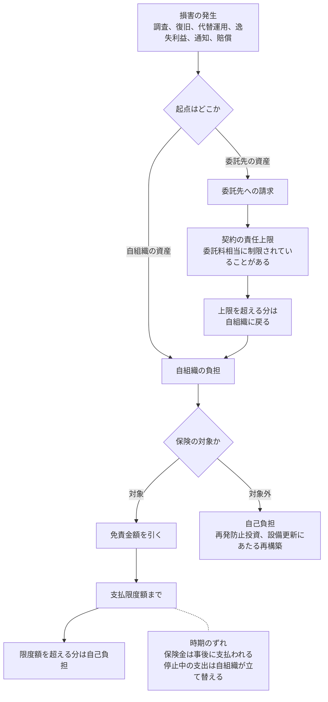

# 🛡️ サイバー保険とリスクの移転

サイバー保険は、診療を早く戻す手段ではない。
移せるのは、費用の一部と、支出が自組織の資金を圧迫する度合いである。
それでも医療機関にとって意味があるのは、停止による減収と再構築の費用が、単年度の収支で吸収できない桁になるためである。

本ページは、何が移せて何が残るか、補償額をどう置くか、加入と更新のときに約款のどこを読むかを扱う。
費用そのものの見積もりは [インシデントの費用と、経営層への説明](cost.md)、制度上の位置づけは [経営層の責任の明確化](executive-accountability.md) に置いている。

> [!NOTE]
> **表記ルール**：本ページでは、**事実**（一次情報で確認できる内容。出典を併記する）、**報道ベース**（報道や第三者の集計のみで確認でき、当事者の公表資料では裏付けが取れていない内容）、**分析**（筆者の解釈）を書き分ける。
> 保険商品の内容は引受会社と契約ごとに異なる。本ページは特定の商品を説明するものではなく、自組織の約款で確認する項目を整理したものである。

---

## 制度が求めているのは、加入ではなく検討

**事実**：重要インフラのサイバーセキュリティ対策のための統一基準 3.2.4 ② は「サイバーセキュリティリスクに係るリスクファイナンスを検討する」と規定し、手段としてサイバー保険によるリスク共有と移転を挙げている。
検討の結果を経営層に報告し、承認を得ることが考えられるとされている（[統一基準（PDF）](https://www.cyber.go.jp/pdf/policy/infra/jyuhurakijun_2026.pdf)、条文の読み方は[経営層の責任の明確化](executive-accountability.md)）。

**分析**：義務づけられたのは検討と承認の手続きであり、加入そのものではない。
「検討したが加入しない」という結論も成立する。
その場合に残す記録は、加入しない理由と、代わりに何をどこまで自組織で賄うかである。

---

## 加入率の数字は、母集団を確かめてから使う

**事実**：日本医師会総合政策研究機構の調査では、サイバー保険への加入は次のとおりである。

| 調査 | 対象 | 加入 |
|---|---|---|
| [No.453](https://www.jmari.med.or.jp/result/working/post-233/)（2021 年 5 月公表、2020 年時点） | 病院 約 5000 施設と診療所 約 5000 施設。回収 2,989 | 8.9% |
| [No.501](https://www.jmari.med.or.jp/result/working/post-5118/)（2026 年 2 月公表） | 医師会共同利用施設 225 施設。回答 135 | 49.6% |

他の項目とあわせた整理は [調査データから読む、備えの穴](readiness-gaps.md) に置いている。

**分析**：二つの数字は母集団が異なる。
後者の対象は医師会共同利用施設であり、全国の医療機関の代表値ではない。
差を加入率の伸びとして読むことはできない。
経営層への説明で「医療機関の約半数が加入している」と使うと、根拠を問われたときに答えられない。

**分析**：どちらの数字を採るにせよ、補償の範囲と付帯サービスの内容を把握しているかは別の問いである。
有事に判断材料として使えるのは、証券の存在ではなく、免責の条件と、事故対応の付帯サービスで誰を呼べるかの二つである。

---

## 公表事例で、保険が届いた範囲

**事実**：保険の効き方に言及した公表事例には、次のものがある。

| 事例 | 保険の扱われ方 |
|---|---|
| [Erie County Medical Center](../threats/incidents/global/2019-earlier.md#GL-2017-02)（2017 年、米） | 事案の前に補償を年 200 万ドルから 1000 万ドルへ引き上げており、約 1000 万ドルの再構築費用の大半が賄われた（報道ベース） |
| [University of Vermont Health Network](../threats/incidents/global/2020-timeline.md#GL-2020-08)（2020 年、米） | 被害額は 6300 万ドルを超えると見積もられ、当時の補償上限は 3000 万ドルだった（報道ベース） |
| [Champaign-Urbana Public Health District](../threats/incidents/global/2020-timeline.md#GL-2020-05)（2020 年、米） | 保険を通じて約 35 万ドルの身代金が支払われたと報じられた（報道ベース） |
| [Sun Pharmaceutical Industries](../threats/incidents/global/2023-timeline.md#GL-2023-17)（2023 年、印） | 証券取引所への届出で、収益への悪影響とサイバー保険の費用の増加を認めた |
| [Artivion](../threats/incidents/global/2024-timeline.md#GL-2024-39)（2024 年、米） | 保険で一部を補填するが、賄えない追加の費用が発生する見込みとした |
| [Masimo](../threats/incidents/global/2025-timeline.md#GL-2025-22)（2025 年、米） | 対応費用の大半が補償される見込みであると説明した |

**分析**：この六件は、保険が効いた例と足りなかった例の両方を含む。
分かれ目は、補償の上限が復旧費用の想定と同じ桁にあるかどうかである。
University of Vermont Health Network の被害額は、サーバ 1300 台と端末 5000 台の再構築を含んだ結果であり、データの復元費用ではない。
補償額を決めるときに見積もるべきは、戻すデータの量ではなく、作り直す基盤の規模である（[バックアップと復旧の設計](../technology/backup.md)）。

**分析**：Sun Pharmaceutical Industries の届出にある「サイバー保険の費用の増加」は、事案の後に保険料が上がることを指す。
一度支払いを受けた組織は、更新時に保険料の上昇か、補償の縮小か、引受条件の追加に直面する。
保険は一度加入すれば同じ条件で続くものではない。

---

## 損害を誰が負担するか

**分析**：この図で見落とされやすいのは二か所である。
一つは委託先の責任上限で、契約上の賠償額が委託料相当に制限されていると、実際の損害との桁が合わない。
もう一つは時期のずれで、保険金は事後に支払われるため、停止中の代替運用にかかる支出は自組織の資金で立て替える。
医療機関では、この期間に診療報酬の入金も止まる（[インシデントの費用と、経営層への説明](cost.md)）。

---

## 医療機関で約款を読むときの論点

**分析**：一般的な企業向けの補償設計と、医療機関で実際に起きる損害は、次の点でずれやすい。
自組織の約款で確認する項目として整理する。

| 論点 | 確認すること |
|---|---|
| 待機時間 | 事業中断の補償が始まるまでの時間。数時間で復旧した停止は、この時間を下回ると対象にならない |
| 逸失利益の算定 | 診療収入の減少をどの資料で立証するか。診療報酬は請求と入金が遅れて現れるため、停止月の入金額では測れない |
| 対象システムの範囲 | 電子カルテと事務系だけか。医療機器、部門システム、施設設備の制御系が含まれるか |
| 委託先の事故 | 委託先のシステムに起因する停止と漏えいが、自組織の契約で対象になるか |
| 身代金 | 支払いの費用と交渉の費用が対象か。支払いに保険会社の事前承認が要るか |
| 引受の条件 | 多要素認証、オフラインバックアップ、端末側の防御製品の導入が条件になっていないか。条件を満たさない状態での事故が免責にならないか |
| 告知の内容 | 加入時に申告した対策の状態が、現在も維持されているか |
| 免責事由 | 戦争と国家に起因する行為の除外が、どの範囲まで及ぶか |
| 事業者の指定 | フォレンジックと法務の事業者を、保険会社の指定先から選ぶ必要があるか |
| 支払いまでの期間 | 請求から入金までの想定期間 |

**分析**：このうち医療機関で効きやすいのは、待機時間と対象システムの範囲である。
本リポジトリが収録した事案には、救急の停止が数時間で解除されたものから、診療システム全体の復旧に 73 日を要したものまで幅がある。
短い停止は補償の対象にならない一方、長い停止では上限に達する。
補償は、想定する停止の長さを決めてから設計する。

**分析**：引受の条件と告知は、有事に争点になりやすい。
病院ではパッチの適用も機器の更新も納入ベンダ側の作業であるため、「対策を導入している」と申告した状態を、自組織だけでは維持できない。
契約で対策の実施をベンダに求め、その実施状況を定期に報告させる形にしておくと、告知の内容と実態の差を追える。

---

## 補償額をどう置くか

**分析**：補償額は、次の三つを足した幅で置く。

1. **復旧の費用**：調査、再構築、機器の調達。基盤の規模で決まる
2. **代替運用の費用**：紙運用の人件費、応援職員、超過勤務。停止日数に比例する
3. **逸失利益**：一日あたりの診療収入に、診療制限の割合と停止日数を掛けた額

**分析**：三つのうち、上限に最も早く達するのは三番目である。
一日あたりの診療収入を把握していれば計算できるが、この数字を持っていない医療機関では、補償額の議論が根拠のない金額の比較になる。
[インシデントの費用と、経営層への説明](cost.md)の六区分と、公表された実額を見積もりの出発点に使う。

**分析**：再発防止のための設計変更と機器更新は、通常は補償の対象外である。
事案後に必要になる支出のうち、保険で戻らない部分を先に把握しておくと、翌年度の予算要求の材料になる。

---

## 小規模組織での選択肢

**事実**：IPA の「サイバーセキュリティお助け隊サービス」制度は、中小企業向けに、相談窓口、異常の監視、緊急時の対応支援、簡易サイバー保険をひとまとめにした民間サービスを、IPA が基準に照らして登録し公表するものである（[サイバーセキュリティお助け隊サービス制度](https://www.ipa.go.jp/security/sme/otasuketai/index.html)）。

**分析**：診療所や薬局の規模では、保険単体よりも、監視と初動支援を含むパッケージのほうが有事に機能しやすい。
保険金が支払われても、事案の当日に誰を呼ぶかが決まっていなければ初動は進まない。
選定のときは、補償額ではなく、事故対応の付帯サービスで到達できる事業者と、その連絡手段を先に確認する（[小規模組織で何から始めるか](small-organizations.md)、[セキュリティサービスのカタログ](../reference/security-services/)）。

---

## 加入しないと決める場合に残すもの

**分析**：加入しない判断は、次を記録に残したうえでなら成立する。

- 想定する停止日数と、そのときの復旧費用と逸失利益の見積もり
- 手元資金、与信枠、開設者からの補填のうち、どれで何をどこまで賄うか
- 賄えない部分が生じたときに、誰がいつ判断するか
- 見積もりの前提を、いつ見直すか

**分析**：自治体立の病院では、開設者である自治体の予算措置が実質的なリスクファイナンスにあたる。
その場合も、補正予算の編成に要する期間を見積もりに入れる。
停止中の支出が先に発生する構造は、保険に加入した場合と変わらない。

---

## 実務チェックリスト

**加入と更新**
- [ ] 想定する停止日数と復旧費用を見積もり、補償額と突き合わせた
- [ ] 待機時間と免責金額を確認した
- [ ] 対象システムの範囲に、医療機器と部門システムが含まれるかを確認した
- [ ] 委託先のシステムに起因する事故の扱いを確認した
- [ ] 引受の条件になっている対策を、現在も満たしているかを確認した
- [ ] 保険金の請求から入金までの想定期間を確認した

**有事に使えるようにする**
- [ ] 事故対応の付帯サービスで呼べる事業者と、連絡先を当直帯から参照できる場所に置いた
- [ ] フォレンジック事業者の指定の有無を、事前に確認した
- [ ] 保険会社への通知の期限と、担当者を決めた
- [ ] 逸失利益の立証に使う資料（診療実績、収入の推移）の出し方を決めた

**経営層への報告**
- [ ] リスクファイナンスの検討結果を、経営層または理事会へ報告し承認を得た
- [ ] 加入しない場合、賄う手段と判断者を記録に残した
- [ ] 保険で戻らない支出（再発防止投資）を、翌年度の予算の議題に載せた

---

## 関連ページ

- [インシデントの費用と、経営層への説明](cost.md)：費用の六区分と、支出と入金の時期のずれ
- [経営層の責任の明確化](executive-accountability.md)：統一基準が経営層に求める行為
- [調査データから読む、備えの穴](readiness-gaps.md)：加入率と、他の備えの状況
- [小規模組織で何から始めるか](small-organizations.md)：専任者がいない組織での着手順序
- [バックアップと復旧の設計](../technology/backup.md)：復旧費用の桁を決める要因
- [サイバー攻撃を想定した BCP](../response/bcp-cyber.md)：停止日数の見積もりに使う前提
- [セキュリティサービスのカタログ](../reference/security-services/)：付帯サービスと外部委託の区分

---

[← 経営とガバナンス](README.md) | [トップへ](../../README.md)
