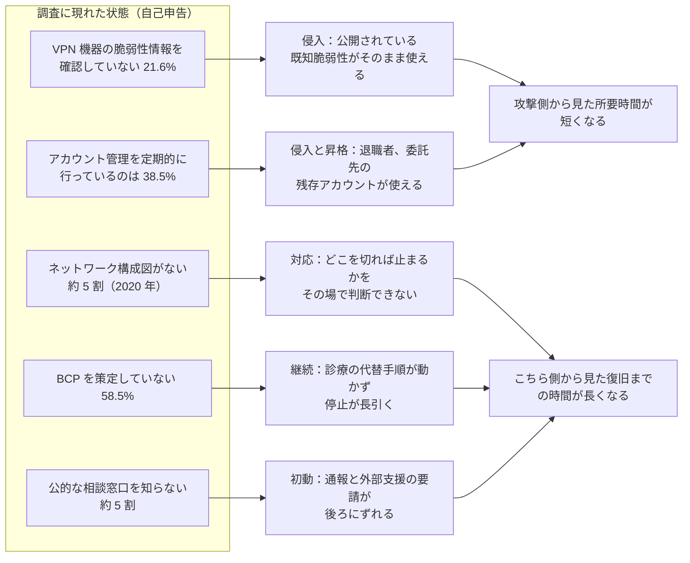
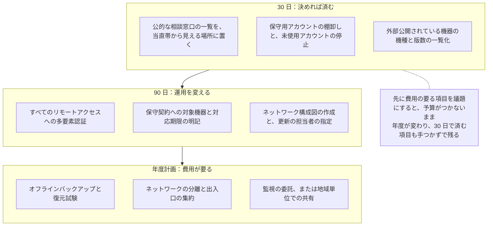
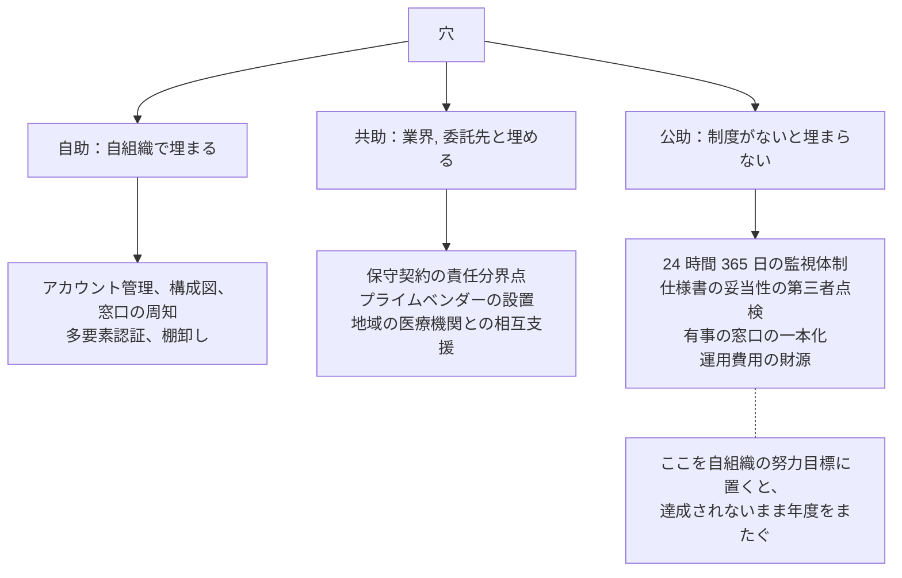

# 調査データから読む、備えの穴

医療機関のセキュリティ体制については、自己申告のアンケート調査が公表されている。
本ページは、その数字を「対策の進捗」としてではなく、**攻撃者から見て何が得られる状態か**として読み替える。
数字は調査の引用（事実）、読み替えと確認方法は筆者の整理（分析）である。

> [!NOTE]
> **表記ルール**：本ページでは、**事実**（一次情報で確認できる内容。出典を併記する）、**報道ベース**（報道のみで確認でき、当事者の公表資料では裏付けが取れていない内容）、**分析**（筆者の解釈）を書き分ける。
> 出典は、当事者の公表資料、行政文書、CVE、ベンダアドバイザリなどの一次情報を優先して示す。

技術対策の実施順序は [医療機関向け防御プレイブック](../threats/actors/defense-playbook.md)、弱点の分類は [組織の脆弱性の分類](../threats/actors/organizational-vulnerabilities.md) にある。
この読み替えを使う場面は、その手前にある。
着手する対策を選ぶ前に、自組織が公表された分布のどのあたりにいるのかを測る段である。

---

## 材料にする調査

| 資料 | 対象と規模 | 位置づけ |
|---|---|---|
| [日医総研 No.453](https://www.jmari.med.or.jp/result/working/post-233/)（2021 年 5 月 14 日） | 病院約 5,000 施設と診療所約 5,000 施設。回収 2,989、回収率 30.4% | 全国規模の分布。2020 年時点の状態 |
| [日医総研 No.488](https://www.jmari.med.or.jp/result/working/post-4657/)（2024 年 12 月 10 日） | 専門家, 実務家, 学識経験者、計 8 団体 18 人へのインタビュー | 数字ではなく、現場で何が起きているかの記述 |
| [日医総研 No.501](https://www.jmari.med.or.jp/result/working/post-5118/)（2026 年 2 月 24 日） | 医師会共同利用施設 225 施設。回答 135、回収率 60.0% | 直近の項目別の分布。厚生労働省の 2025 年調査との比較を含む |

### 数字を読むときの前提

**分析**：この三つは、そのまま自組織の目標値には使えない。
理由は四つある。

- **自己申告である**：「確認し、適宜対応している」という回答は、実際に最新版が適用されている状態を意味しない
- **対象が偏る**：No.501 の対象は医師会共同利用施設であり、全国の医療機関の代表値ではない
- **時点が古いものがある**：No.453 が示すのは 2020 年時点の状態である
- **無回答の側が見えない**：回答しなかった施設のほうが整備が進んでいない可能性があり、実際の分布は数字より悪い側に寄っていると見ておくほうが安全である

使い方は、平均に追いつくことではなく、自組織が下位の側に入っていないかを確かめることになる。
平均は、対象が偏った調査の平均でしかない。

---

## 穴が、攻撃のどの一歩に効くか

**分析**：五つの穴は性質が違う。
VPN の脆弱性対応とアカウント管理は侵入の難易度を下げ、構成図、BCP、窓口の三つは侵入されたあとの被害時間を伸ばす。
予算が限られるときに前の二つを先に埋めるのは、攻撃者が費やす作業量を直接増やせるためである。

---

## 数字と、攻撃側の利得と、自組織での確認方法

**事実**：以下の割合は、いずれも [No.501](https://www.jmari.med.or.jp/result/working/post-5118/)（n=135、VPN の項目は利用施設 n=102）または [No.453](https://www.jmari.med.or.jp/result/working/post-233/)（2020 年調査）による。

| 調査に現れた状態 | 攻撃側が得るもの（分析） | 自組織での確認方法（分析） |
|---|---|---|
| VPN 利用施設の 21.6% が脆弱性情報を確認していない。5.9% は確認したが未対応 | 公表済みアドバイザリの対象機器が、そのまま境界に残る。探索は組織を選ばず機械的に行われる | 外から見えている機器の機種と版数を一覧にし、ベンダのアドバイザリと突き合わせる。EOL 機器の有無を先に確認する |
| VPN の用途の 88.2% が外部業者の保守用 | 常時接続と共有アカウントが揃う。委託先の端末が侵害されれば、そのまま院内に届く | 保守用アカウントの棚卸し。多要素認証の有無、常時接続か必要時開放か、接続元の限定、操作の記録の四点を契約と実機の両方で確認する |
| アカウント管理を定期的に行っているのは 38.5%。5.2% は行っていない | 退職者, 異動者, 終了した委託のアカウントが残る。パスワードの使い回しと組み合わさると、認証情報の再利用が成立する | 90 日以上ログインのないアカウントを抽出する。抽出できない場合、その事実自体が結果である |
| 脆弱性情報の入手経路の最上位は保守, 運用業者からの 58.5%。6.7% は情報収集を行っていない | 業者が扱わない機器（複合機、ネットワークカメラ、独自導入の装置）が更新から漏れる | 自組織の機器一覧のうち、誰も更新を担当していない機器を数える |
| ネットワーク構成図がない施設が約 5 割（2020 年）。保有して計画的に見直しているのは 5.7% | 侵害時に、影響範囲の切り分けが会議になる。攻撃側は探索を続けられる | 「電子カルテのデータが外に出る経路を五分で説明できるか」を、担当者不在の想定で試す |
| サイバー保険への加入は 49.6%（2020 年調査では 8.9%） | 直接の利得はない。ただし補償と付帯サービスの内容を把握していない場合、有事の判断材料が減る | 免責事項と、事故対応の付帯サービスの範囲を、契約書で確認する |
| BCP を策定していない施設が 58.5%。健診, 検査センター等では 71.4% | 停止時間がそのまま診療の停止になる。恐喝側の圧力が上がる | 停電訓練ではなく、電子カルテだけが使えない前提の紙運用を、外来の一枠で試す |
| 厚生労働省の連絡先を知っているのは 50.4%、IPA の相談窓口は 47.4% | 初動の遅れ。届出と支援要請の開始が遅れる | 連絡先の一覧を、当直帯から参照できる場所（紙）に置く |
| 対策費用の準備がない施設が約 6 割弱 | 中長期の是正が翌年度以降に流れる | [対策費用の桁](README.md#対策費用の桁)を、恒常費と一時費に分けて経営会議の議題に載せる |

> [!IMPORTANT]
> 表の右列は、いずれも自組織の資産に対する確認である。
> 外形の確認であっても、対象が委託先の設備や共用回線に及ぶ場合は、事前に範囲と時期を書面で合意してから行う。
> 手順は [セキュリティ診断とペネトレーションテスト](../practice/pentest/) にまとめている。

---

## 自己申告と実測のずれをどう埋めるか

**分析**：調査で最も扱いにくいのは、「確認し、適宜対応している」と答えた 72.5% の側である。
ここには三つのずれが残る。

| ずれ | 内容 | 埋める方法 |
|---|---|---|
| 対象のずれ | 主要な機器は更新しているが、一覧に載っていない機器が残る | 資産の棚卸しを、購買記録ではなく通信の実測から作り直す |
| 時点のずれ | 導入時に対応し、その後の公表分が反映されていない | 更新の頻度と、最後に適用した日付を機器ごとに記録する |
| 主体のずれ | 業者が対応していると考えており、業者は依頼がないと動かない | 保守契約に、対象機器と対応の期限を明記する |

**事実**：主体のずれは、専門家インタビューでも指摘されている。
No.488 は、ベンダへの委託内容を保守契約上明確にし、費用も医療機関側が負担する形を現実解として挙げ、複数のベンダが並立する場合には総合的な相談先となるプライムベンダーを保守契約上に置くことを提言している（[No.488](https://www.jmari.med.or.jp/result/working/post-4657/)）。

**事実**：No.501 では、保守契約に責任分界点の記載がある施設は全体の 47.4% であった（記載があり契約料金に含まれる 33.3%、記載はあるが料金に含まれない 14.1%）。
記載がなく、ベンダとの話し合いも行われていない施設が 17.8% あった。
参考として、厚生労働省の 2025 年調査では、病院 200 床未満（n=4,800）の 48% から 50% が責任分界点を定めていた（[No.501](https://www.jmari.med.or.jp/result/working/post-5118/)）。

**分析**：責任分界点が定まっていない状態は、平時には表面化しない。
表面化するのは、脆弱性が公表された当日と、侵害の当日である。
どちらも、契約書を読み直す時間がない場面である。

---

## 埋める順序

穴の性質によって、埋めるのに必要な資源が違う。
費用がかからず今週決められるものから順に並べる。

**分析**：この順序は、効果の大きさではなく、決裁の重さで並べている。
効果の順に並べると、最初の項目に予算がつくまで何も進まない。
30 日の三項目は、いずれも費用ではなく所掌の指定で片付くため、経営会議の一回で決められる。

各項目の技術的な内容は [防御プレイブック](../threats/actors/defense-playbook.md) の第 1 段階から第 4 段階に対応する。

---

## 自組織では埋まらない穴

**事実**：No.488 は、国に対して、司令塔組織の見直しと強化、脆弱性情報の確実な伝達と対策実装の支援、システム仕様書を点検する第三者機関の創設、SOC の制度化と医療機関向け地域別 SOC の構築支援、有事の相談窓口の一本化、財源の確保を提言している（[No.488](https://www.jmari.med.or.jp/result/working/post-4657/)）。
No.501 も、導入費用は補助金で、運用費用は診療報酬で賄う制度設計を展望すべきだとしている（[No.501](https://www.jmari.med.or.jp/result/working/post-5118/)）。

**分析**：この切り分けは、経営層への説明でそのまま使える。
「24 時間 365 日の監視ができていない」は、専任者を置けない施設では努力目標にならない。
できるのは、監視の範囲を保守契約に書くか、地域単位の共有の枠組みに参加するかであり、それ以上は制度側の整備を待つ部分になる。
待っている間の空白をどう扱うかを決めておくことが、この群で扱う「決める」の中身にあたる。

---

## 経営会議に出す十問

現在地の確認は、対策の一覧ではなく、答えられるかどうかで測るほうが早い。

1. 外部から到達できる機器を何台把握しているか。最後に一覧を更新したのはいつか
2. リモートアクセスの経路のうち、多要素認証がないものは残っているか
3. 保守用アカウントは何件あり、そのうち直近 90 日で使われたものは何件か
4. 電子カルテのデータが外に出る経路を、担当者不在でも説明できるか
5. 脆弱性が公表されたとき、自院の対象機器の有無を誰が何日で判定するか
6. バックアップから電子カルテを復元する試験を、最後に行ったのはいつか
7. 電子カルテだけが停止した状態で、外来を何日続けられるか
8. 侵害の疑いが出たとき、ネットワークを切る判断を誰がするか。その代行は誰か
9. 患者情報が公開された場合、患者への通知と窓口の設置を誰が担当するか
10. 上の九つのうち、答えが「業者に聞かないと分からない」ものはいくつあるか

九番目に答えるには、漏えいしたデータがその後どう扱われるかを知っておく必要がある。
流通の構造と、患者に及ぶ二次被害は [ダークウェブと医療情報](../threats/actors/dark-web-medical-data.md) にまとめている。

**分析**：十番目の答えが多いほど、有事の所要時間は業者の応答時間に左右される。
その依存を減らす作業が、保守契約の書き換えと、資産の把握にあたる。

---

## 出典

| 資料 | 発行 |
|---|---|
| [病院, 診療所のサイバーセキュリティ：医療機関の情報システムの管理体制に関する実態調査から（No.453）](https://www.jmari.med.or.jp/result/working/post-233/) | 日本医師会総合政策研究機構 |
| [医療現場のサイバーセキュリティ確保に向けて：専門家インタビュー調査から（No.488）](https://www.jmari.med.or.jp/result/working/post-4657/) | 日本医師会総合政策研究機構 |
| [医師会共同利用施設のサイバーセキュリティ：医師会病院と健診, 検査センター, 複合体の実態（No.501）](https://www.jmari.med.or.jp/result/working/post-5118/) | 日本医師会総合政策研究機構 |
| [令和 7 年度版 医療機関におけるサイバーセキュリティ対策チェックリスト](https://www.mhlw.go.jp/content/10808000/001703610.pdf) | 厚生労働省 |
| [サイバー攻撃を想定した事業継続計画（BCP）策定の確認表](https://www.mhlw.go.jp/content/10808000/001261299.pdf) | 厚生労働省 |

各資料の全体像は [論文, レポート](../reference/resources/research.md#業界団体系シンクタンクの調査) に整理している。

---

[トップへ](../../README.md)
