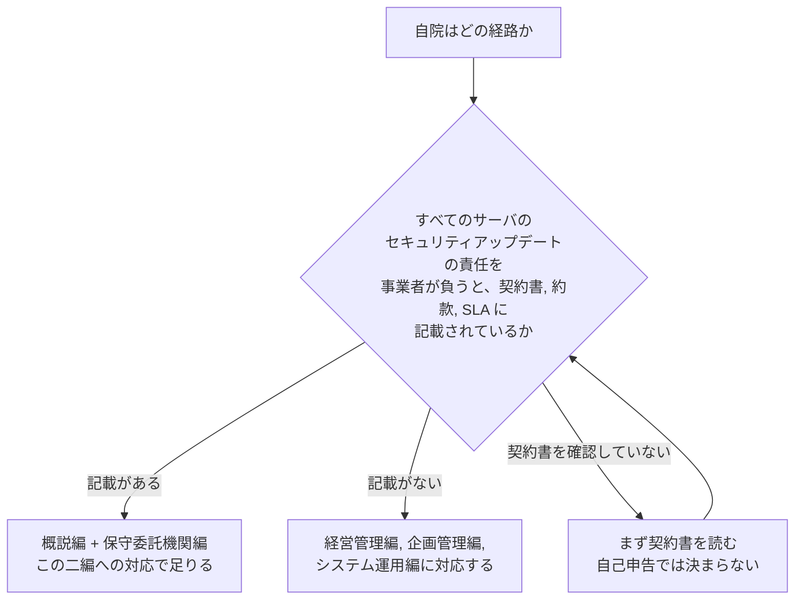
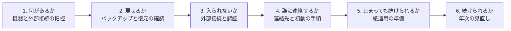

# 🏥 小規模組織で何から始めるか

セキュリティ対策の文書は、専任の担当者がいる組織を想定して書かれる。
体制を作り、規程を整え、監視を導入し、訓練を実施する、という順序である。

一方で、数の上では、そのいずれも実行できない組織が大半を占める。
本ページは、診療所、歯科診療所、薬局、訪問看護、介護事業所のように、情報システムの専任者がいない組織を対象に、何から着手するかを扱う。

> [!NOTE]
> **表記ルール**：本ページでは、**事実**（一次情報で確認できる内容。出典を併記する）、**報道ベース**（報道のみで確認でき、当事者の公表資料では裏付けが取れていない内容）、**分析**（筆者の解釈）を書き分ける。

---

## 前提を数字で置く

**事実**：国内の医療施設数は 179,645 施設で、うち病院は 8,060、一般診療所は 105,207、歯科診療所は 66,378 である（[令和 6 年医療施設動態調査](https://www.mhlw.go.jp/toukei/saikin/hw/iryosd/24/dl/11gaikyou06.pdf)、[日本の統計](../threats/statistics/japan.md)）。

**分析**：病院は施設数の 5% に満たない。
対策の議論は病院を前提に組み立てられるが、地域の医療提供を支える施設の大半は、情報システムの担当者を置いていない。
このため、対策を「縮小して適用する」のではなく、着手の順序そのものを組み替える必要がある。

---

## 制度上、何が求められているか

**事実**：2023 年 4 月に施行された医療法施行規則の改正により、病院、診療所、助産所の管理者に対して、医療情報システムの安全管理に関する措置を講じることが義務づけられている（[国内のガイドラインと法規制](../guidelines/japan.md)）。

**事実**：厚生労働省は、履行状況の確認に用いるチェックリストを公表しており、立入検査で使用されている。
令和 8 年度版は「医療機関・薬局におけるサイバーセキュリティ対策チェックリスト」として、薬局を対象に含む形で公表されている。
出典：[チェックリスト（PDF）](https://www.mhlw.go.jp/content/10808000/001716185.pdf)、[チェックリストマニュアル（PDF）](https://www.mhlw.go.jp/content/10808000/001716186.pdf)

**事実**：医療情報システムの安全管理に関するガイドライン第 7.0 版では、保守委託機関編が新設された。
すべてのサーバのセキュリティアップデートの責任を事業者が負うことが契約書、約款、サービスレベル合意書に記載されている場合に限り、概説編と保守委託機関編に対応することでガイドラインを遵守しているものとみなされる（[国内のガイドラインと法規制](../guidelines/japan.md)）。

**分析**：この分岐は、規模ではなく契約の記載で決まる。
「小規模だから簡略な経路でよい」ではない。
契約に責任の所在が書かれていない場合、責任は医療機関の側に残る。
最初の作業は、対策の導入ではなく、保守契約を読み直すことになる。

---

## 着手の順序

| 段階 | やること | 判断の目安 | 委託してよい部分 |
|---|---|---|---|
| 1 | 端末、サーバ、医療機器、複合機、無線、外部接続の一覧を作る | 一覧が A4 一枚に収まる規模であれば手書きでよい | ベンダに構成図の提出を求める |
| 2 | バックアップの保存先と、復元の手順を確認する。実際に一度戻す | 「取得している」ではなく「戻せた」で判定する | 復元テストの立ち会いをベンダに依頼する |
| 3 | 外部から接続できる経路を数える。VPN、リモートデスクトップ、保守回線 | 数が把握できていない状態を、まず解消する | 機器の設定変更はベンダに依頼する |
| 4 | 異常時の連絡先を一枚にまとめる。ベンダ、医師会、警察、保健所 | 電子カルテが止まった状態でも読めるよう、紙で保管する | 外部の相談窓口を確保する |
| 5 | 紙の処方箋、問診票、検査依頼の様式を印刷して保管する | 半日の診療を紙で回せるかで判定する | ー |
| 6 | チェックリストを年に一度埋め直す | 前年からの差分を確認する | 支援制度の相談窓口を使う |

**分析**：順序の根拠は、失われたときの回復可能性である。
バックアップから戻せない状態は、他のどの対策を積んでも回復しない。
一方で、外部接続の把握は、費用をかけずに実施でき、侵入の入口を直接減らす。
この二つを先に置くと、以降の投資の判断がしやすくなる。

---

## 委託できる部分と、残る部分

| 委託できる | 自組織で決めるしかない |
|---|---|
| 機器の設定、更新の適用 | 診療を止めるかどうかの判断 |
| バックアップの取得と保管 | 復元の優先順位（どの業務から戻すか） |
| 監視と、異常の通報 | 通報を受けたあとに誰が動くか |
| 復旧作業 | 患者への説明と、公表の内容 |
| 技術的な調査 | 支払いに関する方針 |

**分析**：右列は、契約で外部に移せない。
専任者がいない組織では、管理者（院長、開設者）がこの判断者になる。
そのため、平時に決めておく事項は少数に絞り、書面にして紙で保管する形が現実的になる。

---

## 使える支援

| 支援 | 提供元 | 内容 |
|---|---|---|
| サイバーセキュリティ支援制度 | 日本医師会 | 会員向けの基礎的な支援策。相談窓口を含む。2022 年 6 月に創設し、2023 年 6 月 1 日の改訂で内容を拡充している（[日本医師会](https://www.med.or.jp/doctor/sys/cybersecurity/001566.html)） |
| チェックリストの実践ガイド | 日本医師会 | チェックリストを効率的に確認するための解説資料。2025 年 11 月に作成され、会員向けに公開されている（[日医 on-line](https://www.med.or.jp/nichiionline/article/011545.html)） |
| サイバーセキュリティお助け隊サービス | IPA | 中小企業向けに、相談窓口、異常の監視、緊急時の対応支援、簡易サイバー保険をひとまとめにした民間サービスを、IPA が基準に照らして登録し公表する制度（[IPA](https://www.ipa.go.jp/security/sme/otasuketai/index.html)、[セキュリティサービスのカタログ 国内](../reference/security-services/japan.md)） |
| 自治体の補助事業 | 都道府県ほか | 医療機関向けの対策費用の補助。例として、東京都は令和 8 年度に民間医療機関向けの支援事業を実施している（[東京都保健医療局](https://www.hokeniryo.metro.tokyo.lg.jp/iryo/jigyo/h_gaiyou/cybersecurity)） |
| 人材育成の連携 | IPA、日本医療情報学会 | 2025 年 12 月 1 日に、医療分野のサイバーセキュリティ対策強化に向けた人材育成の協定を締結している（[IPA プレスリリース](https://www.ipa.go.jp/pressrelease/2025/press20251201.html)） |
| 情報共有と相談 | 医療 ISAC、JPCERT/CC | 脅威情報の共有と、インシデント時の相談（[国内のガイドラインと法規制](../guidelines/japan.md)） |

**分析**：支援の多くは、申請の手間が導入の障壁になる。
制度を比較してから選ぶのではなく、まず相談窓口に一度連絡して、自組織の状況を説明するところから始めるほうが早い。

---

## 止まったときにどうするか

**分析**：小規模組織には、大規模病院にない利点がある。
関係する職員が少なく、意思決定の階層が浅い。
紙運用への切り替えを、その場の判断で実行できる。

一方で、不利な点もある。
代替の要員がいないため、復旧作業と診療を同時に進められない。
近隣の医療機関との連携が、実質的な代替手段になる。

事前に決めておく事項を挙げる。

- 電子カルテが使えない場合に、当日の診療をどこまで続けるか
- 予約済みの患者へ、どの手段で連絡するか（電話、掲示、ホームページ）
- 処方箋の発行を、紙でどう行うか
- 検査や画像の依頼先へ、どう連絡するか
- 近隣の医療機関に、どの範囲で受け入れを依頼するか

**分析**：詳細な手順書は要らない。
上の五つに一文ずつ答えを書いた紙が、受付と診察室に置いてあれば足りる（[サイバー攻撃を想定した BCP](../response/bcp-cyber.md)）。

---

## 攻撃側から見た小規模組織

**分析**：攻撃者は、組織の規模で標的を選んでいない。
外部から到達できる機器を探し、既知の脆弱性か、弱い資格情報が通るかを試す。
小規模組織が狙われるのは、規模の小ささではなく、次の条件が揃いやすいためである。

| 入口 | なぜ成立しやすいか | 費用をかけずに確認する方法 |
|---|---|---|
| VPN 装置、リモートデスクトップ | ベンダが保守用に設置し、更新されないまま残る | 設置している機器と、その版をベンダに照会する |
| 業者の共通アカウント | 複数の顧客で同じ認証情報が使われる | 保守用アカウントの一覧と、パスワードの変更履歴を確認する |
| 初期設定のままの機器 | 導入時の設定が引き継がれる | 管理画面の初期パスワードが変更されているかを確認する |
| 公開されたままの管理画面 | 検証時の設定が残る | 外部から自院のアドレスに接続し、何が見えるかを確認する |
| 更新されない端末 | 台数が少なく、更新の管理者がいない | 端末ごとの更新状況を一覧にする |
| バックアップが同じ場所にある | 外部保管の運用がない | バックアップの保存先を物理的に確認する |

**分析**：右列は、いずれも新たな製品の導入を必要としない。
確認して、ベンダに依頼するだけで消える入口が多い。
最初の一年で費用が必要になるのは、多くの場合バックアップの外部保管と、更新できない端末の入れ替えだけである。

---

## 実務チェックリスト

**一日で終わること**
- [ ] 保守契約書を読み、サーバの更新の責任がどちらにあるかを確認した
- [ ] 異常時の連絡先を一枚にまとめ、紙で保管した
- [ ] バックアップの保存先を物理的に確認した
- [ ] 端末、サーバ、医療機器、複合機の一覧を作った

**一か月で終わること**
- [ ] バックアップから実際に復元し、戻せることを確認した
- [ ] 外部から接続できる経路を数え、不要なものを止めた
- [ ] 保守用アカウントの一覧を、ベンダから受け取った
- [ ] 厚生労働省のチェックリストを一通り埋めた
- [ ] 相談窓口（医師会、IPA の枠組み、ベンダ）に一度連絡した

**一年で終わること**
- [ ] バックアップを、院内の他の機器から到達できない場所に置いた
- [ ] 更新できない端末を特定し、入れ替えか隔離の方針を決めた
- [ ] 紙で半日の診療を回す準備を整え、一度試した
- [ ] チェックリストを埋め直し、前年からの差分を確認した

---

## 関連ページ

- [調査データから読む、備えの穴](readiness-gaps.md)：自組織の現在地を測る
- [インシデントの費用と、経営層への説明](cost.md)：投資判断の材料
- [国内のガイドラインと法規制](../guidelines/japan.md)：義務とチェックリスト、第 7.0 版の各編
- [サイバー攻撃を想定した BCP](../response/bcp-cyber.md)：止まったときの診療の継続
- [防御プレイブック](../threats/actors/defense-playbook.md)：対策の着手順序
- [医療の脅威モデリング](../practice/threat-modeling.md)：専任者がいない前提での短縮版
- [セキュリティサービスのカタログ 国内](../reference/security-services/japan.md)：外部に頼むときの区分
- [日本の統計](../threats/statistics/japan.md)：施設数と被害の分布

---

[← 経営とガバナンス](README.md) | [トップへ](../../README.md)
