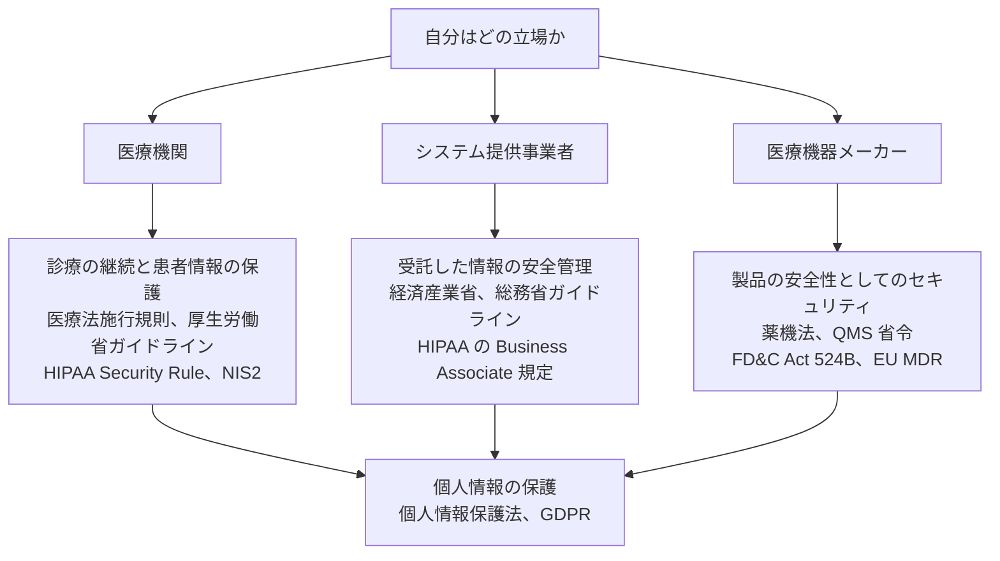

# ⚖️ 医療業界のガイドラインと法規制

医療のセキュリティは、技術だけで完結しない。
何をどこまでやるかは、多くの場合、規制と業界ガイドラインが決めている。

> [!NOTE]
> **表記ルール**：本ページでは、**事実**（一次情報で確認できる内容。出典を併記する）、**報道ベース**（報道のみで確認でき、当事者の公表資料では裏付けが取れていない内容）、**分析**（筆者の解釈）を書き分ける。
> 出典は、当事者の公表資料、行政文書、CVE、ベンダアドバイザリなどの一次情報を優先して示す。

## このセクションの構成

- [国内のガイドラインと法規制](japan.md)
- [海外のガイドラインと法規制](global.md)

## 規制を読むときの枠組み

医療のセキュリティ規制は、対象によって所管も要求内容も異なる。
自分がどの立場でどの規制に向き合っているのかを、最初に確定させる必要がある。

| 対象 | 何が問われるか | 国内の主な根拠 | 海外の主な根拠 |
|---|---|---|---|
| 医療機関 | 診療の継続と、患者情報の保護 | 医療法施行規則、厚生労働省ガイドライン、経済安全保障推進法（指定を受けた医療機関） | HIPAA Security Rule（米）、NIS2（EU） |
| 医療情報システムの提供事業者 | 受託した情報の安全管理 | 経済産業省、総務省ガイドライン | HIPAA の Business Associate 規定（米） |
| 医療機器メーカー | 製品自体の安全性としてのセキュリティ | 薬機法、QMS 省令、基本要件基準 | FD&C Act 524B、FDA ガイダンス、EU MDR |
| 個人情報の取扱い全般 | 要配慮個人情報の適正な取扱い | 個人情報保護法 | GDPR（EU）、州法（米） |

## 三つの視点

規制文書を実務に落とすとき、次の三つを分けて読むと整理しやすい。

**義務**：法令で定められ、違反に罰則や行政処分が伴うもの。
**要求**：ガイドラインや業界標準で「すべき」とされ、監査や立入検査で確認されるもの。
**推奨**：ベストプラクティスとして示され、実施の判断が組織に委ねられるもの。

日本の厚生労働省ガイドラインは、この三層が「遵守事項」と「考え方」という形で書き分けられている。
読み飛ばさずに、どちらの記載なのかを確認してほしい。

---

[トップへ](../../README.md)
