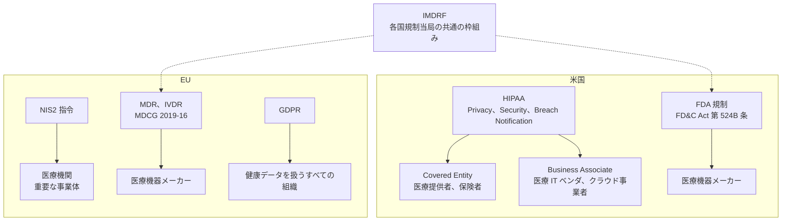

# 🌍 海外のガイドラインと法規制

> [!NOTE]
> 規制の改正が続いている領域である。
> 特に米国の HIPAA Security Rule と EU の各規則は、施行時期と適用範囲を必ず原文で確認してほしい。
>
> **表記ルール**：本ページでは、**事実**（一次情報で確認できる内容。出典を併記する）、**報道ベース**（報道のみで確認でき、当事者の公表資料では裏付けが取れていない内容）、**分析**（筆者の解釈）を書き分ける。
> 出典は、当事者の公表資料、行政文書、CVE、ベンダアドバイザリなどの一次情報を優先して示す。

---

## 適用関係の全体像

同じ組織に複数の規制が同時に適用される。
どの立場でどの規制に向き合っているのかを、先に確定させる。

## 米国

### HIPAA

医療情報の保護を定める連邦法であり、実務上は次の三つの規則に分かれている。

| 規則 | 内容 |
|---|---|
| Privacy Rule | 保護対象保健情報（PHI）の利用と開示のルール |
| Security Rule | 電子的な PHI（ePHI）に対する管理的, 物理的, 技術的セーフガード |
| Breach Notification Rule | 侵害発生時の本人, HHS, 報道機関への通知義務 |

適用対象は、医療提供者や保険者などの Covered Entity と、その業務を受託する Business Associate である。
クラウド事業者や医療 IT ベンダは後者にあたり、契約（BAA）を通じて同等の義務を負う。

Security Rule は技術中立的に書かれており、要求事項は「必須（Required）」と「対処すべき（Addressable）」に区分されている。
Addressable は「任意」を意味しない。
実施しない場合は、その理由と代替措置を文書化する必要がある。

なお HHS は、多要素認証や暗号化、資産の棚卸しなどを明確に求める方向で Security Rule の改正を進めており、改正案が公表されて議論が続いている。
最新の状況は HHS の公表資料で確認してほしい。

**参照先**：[HHS HIPAA](https://www.hhs.gov/hipaa/index.html) ／ [OCR Breach Portal](https://ocrportal.hhs.gov/ocr/breach/breach_report.jsf)

### 405(d) Program と HICP

HHS が主導する官民連携の取り組みで、医療機関の規模別に実践的な対策をまとめた **HICP（Health Industry Cybersecurity Practices）** を公表している。
HIPAA が「何を達成すべきか」を述べるのに対し、HICP は「具体的に何をするか」を示している点で使い分けられる。

**参照先**：[HHS 405(d)](https://405d.hhs.gov/)

### Healthcare and Public Health CPGs

HHS が公表した医療分野向けのサイバーセキュリティ性能目標である。
「必須（Essential）」と「発展（Enhanced）」の二層で構成され、優先順位を判断しやすい形になっている。
限られた予算で何から手をつけるかを決めるとき、実用的な出発点になる。

### NIST

| 文書 | 内容 |
|---|---|
| NIST SP 800-66 Rev.2 | HIPAA Security Rule の実装ガイド。要求事項を具体的な統制へ対応づけている |
| NIST CSF 2.0 | 分野横断のサイバーセキュリティフレームワーク。ガバナンス機能が追加された |
| NIST SP 1800-24 ほか | 患者モニタリングや輸液ポンプなど、医療機器を対象とした実装事例集 |

**参照先**：[NIST Cybersecurity](https://www.nist.gov/cybersecurity)

### FDA（医療機器）

2023 年から、市販前提出において医療機器のサイバーセキュリティ情報の提出が法的に義務づけられた（FD&C Act 第 524B 条）。
対象となる機器（Cyber Device）については、次の提出が求められる。

- 脆弱性の監視, 特定, 対処に関する計画
- 市販後にセキュリティを合理的に保証するためのプロセス（アップデートの提供を含む）
- **SBOM（ソフトウェア部品表）**
- 上記を満たすことを示す設計, 開発, ラベリングの情報

関連するガイダンスとして、市販前サイバーセキュリティガイダンス（2023 年最終版）と、市販後ガイダンスが公表されている。

**参照先**：[FDA Medical Device Cybersecurity](https://www.fda.gov/medical-devices/digital-health-center-excellence/cybersecurity)

---

## 欧州連合

| 規制 | 対象 | 要点 |
|---|---|---|
| **MDR（2017/745）** | 医療機器 | 附属書 I の基本安全性能要件に、ソフトウェアのセキュリティ要求が含まれる |
| **IVDR（2017/746）** | 体外診断用医療機器 | MDR と同様の枠組み |
| **MDCG 2019-16** | 医療機器 | MDR のサイバーセキュリティ要求に関する解釈ガイダンス |
| **NIS2 指令（2022/2555）** | 重要インフラ | 医療分野が明示的に対象。リスク管理措置とインシデント報告を義務化し、経営層の責任を規定 |
| **GDPR** | 個人データ全般 | 健康データを特別カテゴリとして扱う。侵害通知は 72 時間以内 |
| **Cyber Resilience Act** | デジタル要素を持つ製品 | 製品のライフサイクル全体でのセキュリティ要求。医療機器は MDR との整合が図られる |
| **European Health Data Space** | 医療データの流通 | 医療データの一次利用と二次利用の枠組みを定める |

NIS2 は、医療機関を「重要（Essential）」な事業体として扱い、対策の不備に対して制裁金と経営層の責任を規定した点で影響が大きい。
加盟国ごとの国内法化の内容に差があるため、事業を行う国の実装を確認する必要がある。

**参照先**：[ENISA Health](https://www.enisa.europa.eu/topics/critical-information-infrastructures-and-services/health)

---

## 英国

| 枠組み | 内容 |
|---|---|
| NHS Data Security and Protection Toolkit（DSPT） | NHS と取引する組織が自己評価を提出する仕組み |
| Cyber Assessment Framework（CAF） | NCSC が定める評価枠組み。DSPT が CAF に整合する形へ移行している |
| NHS England Cyber Security | 医療分野向けの警告, 支援体制 |

**参照先**：[NHS Digital Data Security](https://digital.nhs.uk/) ／ [NCSC](https://www.ncsc.gov.uk/)

---

## 国際標準と業界標準

| 標準 | 対象 |
|---|---|
| **IMDRF N60 / N70** | 医療機器サイバーセキュリティの国際的な原則、およびレガシー機器の扱い |
| **IEC 81001-5-1** | 医療機器ソフトウェアのセキュアな開発ライフサイクル |
| **IEC 80001 シリーズ** | 医療機器を含む IT ネットワークのリスクマネジメント |
| **ISO 14971** | 医療機器のリスクマネジメント |
| **ISO 13485** | 医療機器の品質マネジメントシステム |
| **ISO 27799** | ISO 27002 を医療分野に適用するための指針 |
| **HITRUST CSF** | 米国医療業界で広く使われる統制フレームワークと認証制度 |
| **MDS2（HIMSS / NEMA HN 1）** | 医療機器のセキュリティ仕様をメーカーが開示するための標準様式 |

IMDRF は各国規制当局が参加する枠組みであり、日本の手引書や FDA ガイダンスの基礎になっている。
国際的に製品を展開する場合、IMDRF の文書から入ると各国要求の共通部分を把握しやすい。

---

## 情報共有組織

| 組織 | 対象地域 |
|---|---|
| [Health-ISAC](https://health-isac.org/) | 国際（米国主導） |
| [HHS HC3](https://www.hhs.gov/about/agencies/asa/ocio/hc3/index.html) | 米国 |
| [CISA](https://www.cisa.gov/) | 米国（ICS Medical Advisories を含む） |
| [ENISA](https://www.enisa.europa.eu/) | EU |
| [NCSC](https://www.ncsc.gov.uk/) | 英国 |

---

## 関連ページ

- [国内のガイドラインと法規制](japan.md)
- [医療機器のセキュリティ](../technology/medical-devices/)
- [海外のインシデント事例](../threats/incidents/global/)

---

[← 国内](japan.md) | [ガイドラインと法規制](README.md) | [トップへ](../../README.md)
