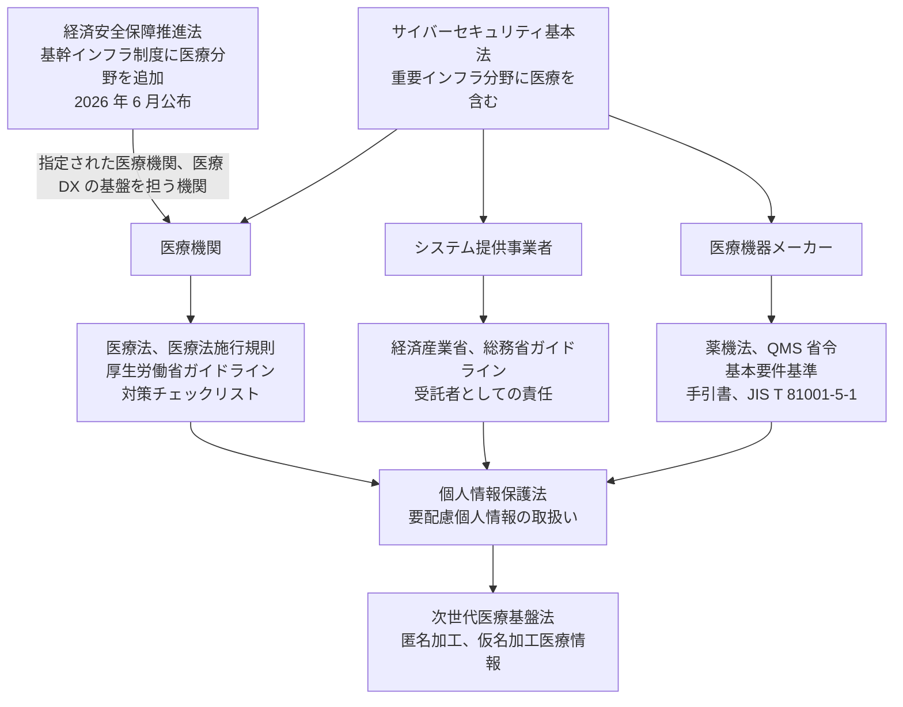
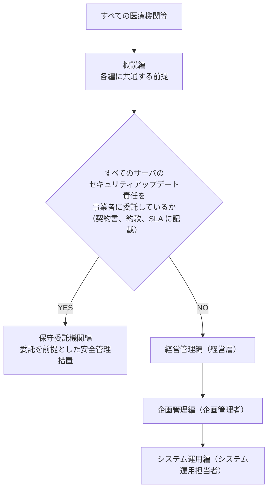
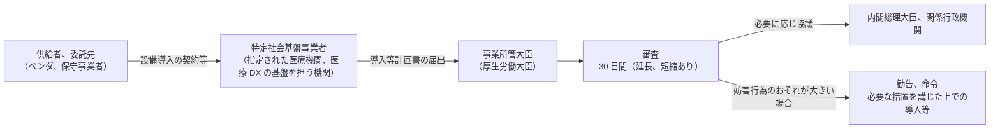

# 🇯🇵 国内のガイドラインと法規制

> [!NOTE]
> 本ページは規制の全体像を把握するための整理である。
> 実際の対応にあたっては、必ず所管官庁が公表している最新の原文を確認してほしい。
> 改定の頻度が高い領域であり、版数の取り違えがそのまま不適合につながる。
>
> **表記ルール**：本ページでは、**事実**（一次情報で確認できる内容。出典を併記する）、**報道ベース**（報道や第三者の集計のみで確認でき、当事者の公表資料では裏付けが取れていない内容）、**分析**（筆者の解釈）を書き分ける。
> 出典は、当事者の公表資料、行政文書、CVE、ベンダアドバイザリなどの一次情報を優先して示す。

---

## 全体像

---

## 医療機関が向き合う規制

### 医療法施行規則によるサイバーセキュリティ確保の義務

2023 年 4 月に施行された医療法施行規則の改正により、病院、診療所、助産所の管理者に対して、医療情報システムの安全管理に関する措置を講じることが義務づけられた。
それまで「ガイドラインに沿った対応が望ましい」という位置づけだったものが、法令上の義務に格上げされた。

厚生労働省は、この義務の履行状況を確認するための **医療機関等におけるサイバーセキュリティ対策チェックリスト** を公表しており、医療機関への立入検査で使用されている。
自組織の現状を把握する出発点として、まずこのチェックリストを埋めてみることを勧めたい。

### 医療情報システムの安全管理に関するガイドライン

厚生労働省が公表している、医療機関向けのセキュリティガイドラインである。
2005 年 3 月に初版が策定され、技術の進展と制度改定に応じて改定されてきた。
最新版は **第 7.0 版**（2026 年 6 月公表）である。

**事実**：第 6.0 版（2023 年 5 月公表）で、読み手の役割ごとに編を分ける構成へ再編された。
第 7.0 版では、根拠法にサイバーセキュリティ基本法（平成 26 年法律第 104 号）が追加され、「重要インフラのサイバーセキュリティに係る安全基準等策定指針」との整合が図られた。
あわせて、すべてのサーバのセキュリティアップデートを事業者に委託している医療機関等の負担軽減を目的として **保守委託機関編** が新設され、5 編構成になった（第 7.0 版 概説編 1. はじめに、3. 本ガイドラインの構成、読み方）。

| 編 | 想定読者 | 内容 |
|---|---|---|
| 概説編 | 全読者 | 各編に共通する前提、目的と対象の範囲 |
| 経営管理編 | 経営層 | 医療情報システムの安全管理に関する統制 |
| 企画管理編 | 企画管理者 | 組織体制、規程の整備、リスク管理、委託先管理 |
| システム運用編 | システム運用担当者、委託事業者 | 技術的な対応の要求事項 |
| 保守委託機関編 | 保守を全て委託している医療機関等の管理者、担当者 | 事業者に技術的安全対策を委託する前提での安全管理措置 |

#### どの編を読むかは、保守の委託状況で分かれる

**事実**：すべてのサーバのセキュリティアップデートの責任を事業者が負うことが契約書、約款、サービスレベル合意書に記載されている場合に限り、概説編と保守委託機関編に対応することで本ガイドラインを遵守しているものとみなされる。

ここでいう「サーバ」は、医療情報の保存や主要な処理を担う機器を指す。
クライアント端末は原則として含まないが、電子カルテアプリ等を端末に導入して処理が完結する場合は含む。

**分析**：保守委託機関編は、専任のシステム担当者を置いていない小規模な医療機関を想定した簡略経路である。
分岐の判定は自己申告ではなく契約書の記載で決まるため、契約に責任の所在が書かれていない場合、責任は医療機関側に残る。
自院がどちらの経路に該当するかは、契約書を確認するまで確定しない。

**参照先**：[厚生労働省 医療情報システムの安全管理に関するガイドライン 第 7.0 版](https://www.mhlw.go.jp/stf/shingi/0000516275_00006.html)

> [!TIP]
> 経営層への説明には「経営管理編」が使える。
> 技術者が「システム運用編」だけを読んで対策を進めると、責任分界や委託先管理の要求を見落としやすい。

> [!IMPORTANT]
> 第 6.0 版を前提に作られた社内規程、委託契約、ベンダの提案書は、第 7.0 版との差分を確認する必要がある。

### 三省二ガイドライン

医療情報を扱う際に参照される枠組みの通称である。
所管する省庁が厚生労働省、経済産業省、総務省の三つで、現行の文書が二つであることによる。

| 所管 | ガイドライン | 最新版 | 対象 |
|---|---|---|---|
| 厚生労働省 | 医療情報システムの安全管理に関するガイドライン | 第 7.0 版（2026 年 6 月公表） | 医療機関等 |
| 経済産業省、総務省 | 医療情報を取り扱う情報システム・サービスの提供事業者における安全管理ガイドライン | 第 2.0 版（2025 年 3 月改定。初版は 2020 年 8 月） | 医療情報を取り扱う情報システム・サービスの提供事業者 |

**事実**：事業者向けガイドラインの第 2.0 版は 2025 年 3 月 28 日に公表された。
対象事業者の明確化、事業者と医療機関等の間で合意すべき内容の明確化、リスクコミュニケーションの実効化という観点から改定されている（[総務省 報道発表](https://www.soumu.go.jp/menu_news/s-news/01ryutsu06_02000427.html)、[経済産業省 ガイドライン本文（PDF）](https://www.meti.go.jp/policy/mono_info_service/healthcare/01gl_20250328.pdf)）。

医療機関とベンダが責任分界を議論するときは、この二つを突き合わせる形になる。

#### 三省四ガイドラインからの一本化

**事実**：かつては、厚生労働省のガイドラインに加えて、経済産業省と総務省がそれぞれ事業者向けの文書を公表しており、あわせて「三省四ガイドライン」と呼ばれていた。
事業者向けの文書は 2020 年 8 月に一本化され、現在の二本立てになった（[総務省 報道発表](https://www.soumu.go.jp/menu_news/s-news/01ryutsu18_02000001_00004.html)）。

| 旧文書 | 所管 | 公表 | 現在の扱い |
|---|---|---|---|
| 医療情報を受託管理する情報処理事業者向けガイドライン（第 2 版） | 経済産業省 | 2012 年 10 月（[PDF](https://www.meti.go.jp/policy/it_policy/privacy/iryouglv2.pdf)） | 2020 年 8 月の統合により、提供事業者ガイドラインへ引き継がれた |
| ASP・SaaS 事業者が医療情報を取り扱う際の安全管理に関するガイドライン | 総務省 | 2009 年 7 月、第 1.1 版 2010 年 12 月（[PDF](https://www.soumu.go.jp/main_content/000095031.pdf)） | クラウドサービス事業者向けへの改組を経て、同じく提供事業者ガイドラインへ引き継がれた |
| ASP・SaaS（医療情報取扱いサービス）の安全・信頼性に係る情報開示指針 | 総務省 | 2017 年 3 月 | 統合の対象ではなく、「クラウドサービスの安全・信頼性に係る情報開示指針」の一部として存続している |

**事実**：情報開示指針にもとづく医療情報 ASP・SaaS 情報開示認定制度は、特定非営利活動法人 ASP・SaaS・AI クラウドコンソーシアム（ASPIC）が運用している。
この認定は、事業者が安全性と信頼性に関する情報を適切に開示していることを認定するものであり、セキュリティ対策の水準そのものを認定する制度ではない（[ASPIC 医療情報 ASP・SaaS 情報開示認定制度](https://aspicjapan.org/nintei/iryo-nintei/)）。

**分析**：旧文書の名称は、既存の委託契約書、ベンダの提案書、社内規程に残っていることがある。
名称が旧いままでも要求内容が現行版へ読み替えられているとは限らないため、契約更新や調達の際に、参照している文書の版数を確認する必要がある。
認定の取得を委託先選定の材料にする場合も、認定が意味するのは開示の適正さであって、対策水準の保証ではない。

**参照先**：[経済産業省 医療情報を取り扱う情報システム・サービスの提供事業者における安全管理ガイドライン](https://www.meti.go.jp/policy/mono_info_service/healthcare/teikyoujigyousyagl.html) ／ [総務省 医療・介護・健康分野のデジタル化ガイドライン](https://www.soumu.go.jp/menu_seisaku/ictseisaku/ictriyou/iryou_kaigo_kenkou.html)

### 経済安全保障推進法の基幹インフラ制度への追加

**事実**：経済安全保障推進法（令和 4 年法律第 43 号）にもとづく基幹インフラ制度は、国が指定した事業者（特定社会基盤事業者）が、国の定める重要設備（特定重要設備）を導入し、または維持管理等を委託しようとする際に、事前の届出と審査を求める制度である。
2023 年 11 月に同法が施行され、2024 年 5 月 17 日から制度の運用が始まった。
特定社会基盤事業者は、2025 年 7 月 31 日時点で 257 者である（厚生労働省 社会保障審議会医療部会 資料）。

**事実**：2026 年 6 月 10 日に改正法が成立し、同月 17 日に公布された。
これにより、従来の 15 分野（電気、ガス、石油、水道、鉄道、貨物自動車運送、外航貨物、港湾運送、航空、空港、電気通信、放送、郵便、金融、クレジットカード）に**医療分野**が加わった（[内閣府 基幹インフラ役務の安定的な提供の確保に関する制度](https://www.cao.go.jp/keizai_anzen_hosho/suishinhou/infra/infra.html)）。

追加された事業は次の二つである。

| 事業 | 主体 | 特定重要設備の候補 |
|---|---|---|
| 病院が行う医業、歯科医業 | 高度な医療の提供能力を有する医療機関（特定機能病院を念頭に指定） | 電子カルテ、手術部門、集中治療部門に関連する設備 |
| 医療 DX 関連業務 | 診療報酬の審査支払と医療 DX の基盤を担う機関 | オンライン資格確認等システム、電子処方箋管理サービス、電子カルテ情報共有サービスに係る設備 |

**事実**：対象医療機関は、事業規模（病床数等）と代替可能性（地域医療で果たす役割、救急医療や災害医療の拠点としての役割）を踏まえ、**特定機能病院**（2025 年 4 月時点で 88 病院、うち大学附属病院 79 病院）を念頭に指定される。
指定は段階的で、改正法の施行時には 1 地方につき少なくとも 1 病院、施行から 3 年度目までに各都道府県につき 1 病院（地域性に応じて複数）が想定されている。
具体的な指定範囲と特定重要設備は、資料の時点では「案」として精査中とされている（厚生労働省 社会保障審議会医療部会 第 118 回、第 121 回 資料）。

**分析**：この制度が医療機関の実務に及ぼす影響は、セキュリティ対策そのものより**調達と委託の手続き**に現れる。
電子カルテや手術部門の設備を入れ替えるとき、保守を委託するときに、事前の届出と審査期間を工程に織り込む必要がある。
指定を受ける病院は当面ごく少数だが、対象になる設備の候補は、どの病院でも診療の停止に直結する領域と重なっている。
指定の有無にかかわらず、自院の重要設備とその委託先を把握しておく作業は、[医療情報システムの安全管理に関するガイドライン](#医療情報システムの安全管理に関するガイドライン)が求める資産管理と同じ対象を指している。

### AI 性能の高度化を踏まえた注意喚起（2026 年 5 月）

**事実**：2026 年 5 月 18 日、内閣官房国家サイバー統括室ほか 8 機関の連名で、重要インフラ事業者等に対する注意喚起「AI 性能の高度化を踏まえたサイバーセキュリティ対策の強化について」が発出され、政府全体の対策パッケージ **Project YATA-Shield** が取りまとめられた。
厚生労働省は 2026 年 5 月 27 日に、医療機関等に向けた注意喚起を発出している。
要請の内容と、医療にとっての意味は [AX：医療における AI のセキュリティ](../technology/dx-ax/ai-security.md) に整理した。

---

## 医療機器メーカーが向き合う規制

### 薬機法と基本要件基準

医療機器のサイバーセキュリティは、製品の安全性の一部として規制されている。
2023 年 4 月から、医療機器の基本要件基準においてサイバーセキュリティに関する要求が明確化され、プログラムを用いた医療機器に対して、開発から市販後までの一貫した対応が求められるようになった。

対応の指針としては、次の文書が実務で参照される。

| 文書 | 編集、発行 | 内容 |
|---|---|---|
| 医療機器のサイバーセキュリティ導入に関する手引書（第 2 版、2023 年 3 月） | 日本医療機器産業連合会（医機連） 医療機器サイバーセキュリティ対応 WG | IMDRF ガイダンスを踏まえた、製造販売業者向けの実装指針。厚生労働省の通知で参照されている |
| 医療機関における医療機器のサイバーセキュリティ確保のための手引書 | 日本医療機器産業連合会（医機連） | 医療機器を使う側（医療機関）が行う対策をまとめた手引書 |
| JIS T 81001-5-1 | 日本産業標準 | 医療機器ソフトウェアのセキュアな開発ライフサイクル（IEC 81001-5-1 に対応） |
| JIS T 2304 | 日本産業標準 | 医療機器ソフトウェアのライフサイクルプロセス（IEC 62304 に対応） |
| JIS T 14971 | 日本産業標準 | 医療機器のリスクマネジメント（ISO 14971 に対応） |

**参照先**：[PMDA 医療機器のサイバーセキュリティについて](https://www.pmda.go.jp/review-services/drug-reviews/about-reviews/devices/0051.html) ／ [厚生労働省 医療機器のサイバーセキュリティ](https://www.mhlw.go.jp/stf/seisakunitsuite/bunya/0000179749_00004.html) ／ [日本医療機器産業連合会（医機連）](https://www.jfmda.gr.jp/)

> [!IMPORTANT]
> 医療機器の規制対応では、市販前の設計だけでなく **市販後のセキュリティ対応**（脆弱性の監視、報告、アップデートの提供）が明示的に求められる。
> SBOM の整備は、この市販後対応を成立させるための前提になる。

---

## 個人情報の取扱い

### 個人情報保護法と要配慮個人情報

病歴、診療情報、健康診断の結果、遺伝情報は **要配慮個人情報** にあたる。
取得には原則として本人の同意が必要であり、オプトアウトによる第三者提供は認められていない。
漏えい等が発生した場合、個人情報保護委員会への報告と本人への通知が義務づけられている。

報告の要否と期限は、次のとおり定められている。

| 項目 | 内容 |
|---|---|
| 報告の対象 | 要配慮個人情報が含まれる場合は 1 人分でも対象になる。診療情報、調剤情報は要配慮個人情報にあたる |
| 速報 | 発覚から、おおむね 3 日から 5 日以内 |
| 確報 | 発覚から 30 日以内。不正の目的をもって行われたおそれがある行為による場合は 60 日以内 |
| 本人への通知 | 本人が権利利益を保護するために必要な措置をとれるよう、速やかに行う |

**分析**：ランサムウェアによる漏えいは「不正の目的をもって行われたおそれがある行為」に該当するため、確報の期限は 60 日側になることが多い。
ただし、リークサイトへの掲載や患者からの問い合わせは、この期限を待たずに起こる。
届出の期限と、対外的な説明を始める時期は別に設計する必要がある（[ダークウェブと医療情報](../threats/actors/dark-web-medical-data.md#公表と届出)）。

医療分野に特化した解釈は、次のガイダンスに整理されている。

**参照先**：[医療・介護関係事業者における個人情報の適切な取扱いのためのガイダンス](https://www.ppc.go.jp/personalinfo/legal/)、[漏えい等報告・本人への通知の義務化について](https://www.ppc.go.jp/news/kaiseihou_feature/roueitouhoukoku_gimuka/)

### 委員会による注意喚起

**事実**：個人情報保護委員会は 2024 年 9 月 25 日、病院、診療所および薬局における、要配慮個人情報を含む個人データの漏えい、滅失、毀損について注意喚起を行った。
これらの事業者では要配慮個人情報を取り扱う機会が多く、患者の取り違えによる誤交付が多数発生していることを踏まえ、安全管理措置に関する具体的な取組事例を示している。
出典：[医療機関における個人情報の取扱いに関する注意喚起](https://www.ppc.go.jp/alart_for_medical_organizations/)

**分析**：この注意喚起が対象としているのは、外部からの攻撃ではなく、日常業務での誤りである。
届出の件数で見れば、こちらのほうが多い。
サイバー攻撃への備えと、誤交付の防止は、担当部署も対策の性質も違うが、届出の窓口と期限は同じである。
インシデント対応の手順を作る際は、両方を同じ流れで扱えるようにしておくと、実際の運用で迷いが減る（[インシデント対応と事業継続](../response/)）。

### 次世代医療基盤法

医療情報を匿名加工または仮名加工したうえで研究開発に利活用するための枠組みを定めた法律である。
認定を受けた事業者が、医療機関からの提供を受けて加工と提供を行う。
2023 年の改正により仮名加工医療情報の枠組みが追加され、2024 年から施行されている。

---

## 情報共有と支援の窓口

> [!NOTE]
> 掲載は、各組織が公開している情報にもとづく。
> 提供内容や窓口は変わりうるため、実際に頼るときは公式サイトで確認してほしい。

### 行政と公的機関

| 組織 | 役割 |
|---|---|
| [厚生労働省 医療分野のサイバーセキュリティ対策について](https://www.mhlw.go.jp/stf/seisakunitsuite/bunya/kenkou_iryou/iryou/johoka/cyber-security.html) | ガイドライン、チェックリスト、注意喚起が集約されている。国内の対応はまずここを見る |
| [厚生労働省 医療分野の情報化の推進について](https://www.mhlw.go.jp/stf/seisakunitsuite/bunya/kenkou_iryou/iryou/johoka/index.html) | 医療情報化の施策全体。HPKI 認証局の運用規約もここに置かれている |
| [個人情報保護委員会](https://www.ppc.go.jp/) | 漏えい等の報告の受付。医療・介護関係事業者向けガイダンスの所管 |
| [PMDA 医療機器のサイバーセキュリティについて](https://www.pmda.go.jp/review-services/drug-reviews/about-reviews/devices/0051.html) | 医療機器の審査と市販後安全対策。関連通知の一覧 |
| [JPCERT/CC](https://www.jpcert.or.jp/) | 脆弱性情報の調整、インシデント対応支援 |
| [IPA](https://www.ipa.go.jp/security/) | 注意喚起、脆弱性関連情報の届出受付 |
| [国家サイバー統括室（NCO）](https://www.nisc.go.jp/) | 重要インフラ分野としての施策。2025 年 7 月 1 日に内閣サイバーセキュリティセンター（NISC）から改組された |
| [AI セーフティ・インスティテュート（AISI）](https://aisi.go.jp/) | AI の安全性評価の観点を整理する組織。ヘルスケア領域の評価観点ガイドを公表している |

### 情報共有組織と業界団体

| 組織 | 役割 |
|---|---|
| [一般社団法人医療 ISAC](https://m-isac.jp/) | 国内の医療機関を対象とした脅威情報の共有と支援 |
| [Health-ISAC（日本語ページ）](https://health-isac.org/ja/) | 医療分野の国際的な情報共有組織。日本語での情報提供がある |
| [一般社団法人医療サイバーセキュリティ協議会（MedCSC）](https://medcsc.org/) | セミナー、ワークショップの開催、人材の実践的トレーニングとインシデント訓練、リスク可視化ツールの提供 |
| [一般社団法人保健医療福祉情報システム工業会（JAHIS）](https://www.jahis.jp/) | 医療情報システムの業界団体。医療情報セキュリティ開示書（MDS、SDS）のガイドなどを公表 |
| [一般社団法人日本医療機器産業連合会（医機連）](https://www.jfmda.gr.jp/) | 医療機器の業界団体。サイバーセキュリティの手引書を編集している |
| [一般社団法人日本画像医療システム工業会（JIRA）](https://www.jira-net.or.jp/publishing/security.html) | 画像医療システムの業界団体。セキュリティ関連の刊行物と MDS2 の解説を公開 |
| [一般財団法人医療情報システム開発センター（MEDIS-DC）](https://www.medis.or.jp/) | 標準マスターの整備と、HPKI カードを発行する認証局の運営 |
| [ASPIC 医療情報 ASP・SaaS 情報開示認定制度](https://aspicjapan.org/nintei/iryo-nintei/) | 総務省の情報開示指針にもとづく、事業者の情報開示に対する認定 |
| [特定非営利活動法人日本医療 AI リテラシー協会（JAMAIL）](https://jamail.or.jp/) | 医療 AI に関する教育と人材育成、情報発信。無料のオンラインコミュニティ AcademiX Medical を運営 |
| [日本デジタルヘルス・アライアンス（JaDHA）](https://jadha.jp/) | デジタルヘルス領域の団体。AISI と連携し、ヘルスケア領域の AI セーフティ評価観点ガイドの策定に参加 |

### 教育と研究

| 窓口 | 内容 |
|---|---|
| [医療機関向けセキュリティ教育支援ポータルサイト（MIST）](https://mist.mhlw.go.jp/) | 厚生労働省の委託事業。経営者向け、システム管理者向け、初学者向けの研修と e-learning、動画教材、年度別の研修資料を提供する。サイバー攻撃発生時の初動対応支援窓口も置かれている |
| [厚生労働科学研究成果データベース](https://mhlw-grants.niph.go.jp/) | 厚生労働科学研究費補助金による研究の報告書を検索できる。医療機関のセキュリティを対象にした研究も含まれる |

---

## 関連ページ

- [海外のガイドラインと法規制](global.md)
- [医療機器のセキュリティ](../technology/medical-devices/)
- [防御プレイブック](../threats/actors/defense-playbook.md)

---

[← ガイドラインと法規制](README.md) | [海外 →](global.md) | [トップへ](../../README.md)
