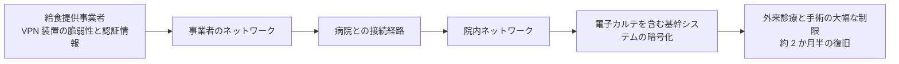

# 🇯🇵 国内の医療機関に対するサイバー攻撃事例

> [!NOTE]
> **表記ルール**
> - **事実** … 当事者、公的機関が公表した資料で確認できる内容
> - **報道ベース** … 報道機関の報道のみで、当事者の公表資料では確認できていない内容
> - **分析** … 筆者による解釈、推測
>
> 一次情報の URL は、リンク切れを避けるため公表元のサイトを示しています。報告書名で検索してください。

## 概観

日本の医療機関に対するランサムウェア被害は、2021 年以降に急増しました。警察庁は「ランサムウェア被害の報告件数」を業種別に半期ごとに公表しており、医療、福祉分野は継続して上位に含まれています（出典: 警察庁「サイバー空間をめぐる脅威の情勢等」各期）。

国内事例に共通する特徴として、以下が繰り返し指摘されています（**分析**）。

1. **境界機器の脆弱性が起点になりやすい**：閉域網を前提とした設計が、VPN 装置のパッチ遅延と組み合わさる
2. **委託事業者との接続が監視されていない**：給食、検査、保守など、医療周辺の事業者が踏み台になる
3. **バックアップが同一ネットワーク上にある**：暗号化がバックアップまで到達し、復旧が長期化する
4. **紙運用への切り戻しが復旧を左右する**：事業継続計画の実効性が、診療を継続できるかどうかを決める

---

## 事例一覧

| 発生時期 | 組織 | 種別 | 主な影響 |
|---|---|---|---|
| 2021-10 | 徳島県つるぎ町立半田病院 | ランサムウェア（LockBit 2.0） | 電子カルテ停止、新規患者受入停止、約 2 か月の復旧 |
| 2022-10 | 大阪急性期・総合医療センター | ランサムウェア | 電子カルテ停止、外来診療の大幅制限、約 2 か月半の復旧 |
| 2024-05 | 岡山県精神科医療センター | ランサムウェア | 電子カルテ停止、患者情報流出の可能性 |
| 2018-10 | 奈良県宇陀市立病院 | ランサムウェア | 電子カルテの一部が暗号化 |

---

## 徳島県つるぎ町立半田病院（2021 年 10 月）

**事実**

- 2021 年 10 月 31 日未明、院内の複数のプリンタから英文の脅迫文書が印刷される事象が発生し、電子カルテを含む院内システムが暗号化された。
- ランサムウェアは **LockBit 2.0** と特定されている。
- 電子カルテが利用できなくなり、新規患者の受け入れを停止。紙カルテによる限定的な診療運用に切り替えた。
- 病院は身代金を支払わず、システムを再構築する方針を選択。2022 年 1 月に通常診療を再開した。
- 病院は有識者会議による調査報告書を 2022 年 6 月に公表した。国内の医療機関が技術的な経緯を詳細に公開した例として、希少な一次情報である。
- 報告書では、侵入経路として VPN 装置の脆弱性が指摘されている。ウイルス対策ソフトが停止されていたこと、バックアップも被害を受けたことなど、運用上の問題が率直に記載されている。

**教訓（分析）**

| 論点 | 示唆 |
|---|---|
| VPN 装置の管理 | 「閉域だから安全」という前提が、パッチ適用の遅れを生む。境界機器は最優先のパッチ対象として扱う |
| ベンダ任せの運用 | システム納入ベンダに運用を委ねると、脆弱性管理の責任所在が曖昧になる |
| バックアップ設計 | 同一ネットワーク上のバックアップは、ランサムウェア対策として機能しない（オフライン／イミュータブル保管が必要） |
| 情報公開の価値 | 詳細な報告書の公開は、業界全体の防御力を押し上げる。この公開姿勢自体が国内医療セキュリティの転換点となった |

**一次情報**：[つるぎ町立半田病院 公式サイト](https://www.handa-hospital.jp/)（「コンピュータウイルス感染事案 調査報告書」）

---

## 大阪急性期・総合医療センター（2022 年 10 月）

**事実**

- 2022 年 10 月 31 日、電子カルテシステムを含む基幹システムがランサムウェアにより暗号化され、外来診療、手術の大幅な制限に至った。
- 侵入経路は、病院に給食を提供していた事業者のネットワーク経由であったことが調査で示されている。委託事業者の VPN 装置の脆弱性と認証情報が悪用された。
- 病院は身代金を支払わず、システムの復旧、再構築を実施。2023 年 1 月に通常診療を再開した。
- 病院は**調査報告書を 2023 年 3 月に公表**している。

**教訓（分析）**

| 論点 | 示唆 |
|---|---|
| サプライチェーン | 医療機関の攻撃対象領域は、院内で完結しない。給食、検査、清掃、保守など、あらゆる委託先との接続が侵入経路になりうる |
| 接続先の可視化 | 「誰が、どこから、どのシステムに、どの権限で接続しているか」の棚卸しが最初の一歩 |
| 委託契約 | 委託先に対するセキュリティ要件（パッチ適用、MFA、ログ提供義務）を契約に落とし込む必要がある |
| 相互接続の分離 | 委託先との接続は、必要最小限のセグメント、ポート、期間に限定する |

**一次情報**：[大阪急性期・総合医療センター 公式サイト](https://www.gh.opho.jp/)（「情報セキュリティインシデント調査委員会 報告書」）

---

## 岡山県精神科医療センター（2024 年 5 月）

**事実**

- 2024 年 5 月、ランサムウェアにより電子カルテを含むシステムが利用できなくなった。
- 患者の個人情報が流出した可能性が公表され、対象規模は数万人規模とされている。
- 精神科医療という、特に配慮を要する診療情報を扱う医療機関での被害であり、情報流出時の患者への影響が他の診療科より重くなりうる点で注目された。

**教訓（分析）**

- 診療科によって、情報漏えいがもたらす被害の性質が異なる。精神科、産婦人科、感染症など、患者へのスティグマに直結する診療情報は、恐喝の圧力が高くなる（フィンランドの [Vastaamo 事件](global.md) がその極端な例である）。
- リスクアセスメントでは、「何件漏れるか」だけでなく「何が漏れるか」を評価軸に含める必要がある。

**一次情報**：[岡山県精神科医療センター 公式サイト](https://www.pref.okayama.jp/site/seishiniryo/)

---

## その他の事例

| 時期 | 組織 | 概要 |
|---|---|---|
| 2018-10 | 奈良県宇陀市立病院 | ランサムウェアにより電子カルテの一部データが暗号化された（**報道ベース**） |
| 継続的 | 各地の医療機関 | 医療機関を狙った Emotet の感染、ばらまき型フィッシング、および委託先経由の被害が継続的に報告されている |

> [!TIP]
> 国内の事例を継続的に追跡するときは、次の情報源が使える。
> - [厚生労働省 医療分野のサイバーセキュリティ対策](https://www.mhlw.go.jp/stf/seisakunitsuite/bunya/kenkou_iryou/iryou/johoka/index.html)
> - [IPA 情報セキュリティ白書](https://www.ipa.go.jp/security/publications/hakusyo/index.html)
> - [JPCERT/CC](https://www.jpcert.or.jp/)
> - [警察庁 サイバー空間をめぐる脅威の情勢等](https://www.npa.go.jp/publications/statistics/cybersecurity/index.html)
> - [一般社団法人医療 ISAC](https://m-isac.jp/)

---

[← インシデント事例集](README.md) | [海外の事例 →](global.md) | [トップへ](../../README.md)
