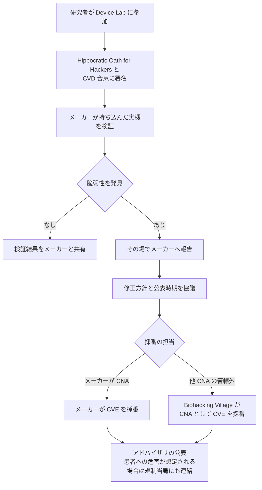

# 🧬 Biohacking Village（DEF CON）

医療機器の実機を、メーカーの同意のもとで検証できる数少ない場である。
稼働中の医療機器に無断で触れることはできず、中古機の入手にも限界がある。
Biohacking Village は、この制約を、メーカーが機器を持ち込み、研究者が合意書に署名して検証する形で解いている。

> [!NOTE]
> **表記ルール**：本ページでは、**事実**（一次情報で確認できる内容。出典を併記する）、**報道ベース**（報道のみで確認でき、当事者の公表資料では裏付けが取れていない内容）、**分析**（筆者の解釈）を書き分ける。
> 出典は、当事者の公表資料、行政文書、CVE、ベンダアドバイザリなどの一次情報を優先して示す。

---

## 概要

| 項目 | 内容 |
|---|---|
| 名称 | Biohacking Village（[villageb.io](https://villageb.io/)） |
| 位置づけ | DEF CON 内のビレッジのひとつ。医療とバイオセキュリティを扱う |
| 組織 | 501(c)(3) の非営利団体（登録番号 83-3941279） |
| 掲げる目的 | "making healthcare safer through better cybersecurity" |
| 沿革 | 公式サイトの Our Story で、2014 年の DEF CON 22 に言及している |
| 主な活動 | 実機を用いた機器セキュリティのラボ、CTF、講演、ワークショップ、調整型脆弱性開示（CVD）の支援 |
| CNA | 2023 年 6 月に CVE Numbering Authority となった |

（事実、出典：[Biohacking Village About](https://villageb.io/About)、[CVE Program](https://medium.com/@cve_program/our-cve-story-biohacking-village-3611169d1f87)）

**分析**：この場の特異さは、参加者の顔ぶれにある。
メーカー、研究者、臨床医、規制当局、病院側の担当者が同じ会場にいるため、脆弱性の技術的な指摘が、修正の可否と臨床への影響の議論にその場でつながる。

---

## Device Lab

メーカーが実機を持ち込み、研究者がリアルタイムで検証する。
発見された問題はメーカーへ直接報告され、調整型脆弱性開示として扱われる。

参加者は次に同意したうえで検証に入る（事実、出典：[Device Lab](https://www.villageb.io/device-lab)）。

- **Hippocratic Oath for Hackers への署名**：会期中と会期後の行動規範に同意する
- **CVD の合意**：脆弱性を見つけた場合の取り扱いを、検証を始める前に確定する

DEF CON 34 の Device Lab では、9 社の 19 機器が研究対象として公開された（事実、出典：[Medical Device Vulnerability Database](https://www.villageb.io/DeviceList)）。

| メーカー | 公開された機器数 |
|---|---|
| Siemens Healthineers | 5 |
| Philips | 3 |
| MiniMed | 2 |
| Solventum | 2 |
| Boston Scientific | 2 |
| Omnicell | 2 |
| BD | 1 |
| Medtronic | 1 |
| Roche | 1 |

掲載されている機器には、患者モニタ（Philips IntelliVue）、超音波（Siemens ACUSON）、PET/CT（Siemens Biograph）、MRI（Siemens MAGNETOM）、インスリンポンプ（MiniMed）、薬剤管理システム（Omnicell）、PCR 診断装置（Roche）が含まれる（事実、出典：Biohacking Village）。

**分析**：画像診断装置から薬剤管理まで、臨床で実際に動いている系列が並んでいる。
検証の対象が実機であるため、ネットワークやプロトコルの検証だけでなく、機器の操作画面や保守モードといった、資料からは読み取れない部分に触れられる。

---

## 発見から開示までの流れ

CNA としてのスコープは、他の CNA の管轄に含まれない医療機器の脆弱性である（事実、出典：CVE Program）。
CNA になる前は、Device Lab で見つかった脆弱性の扱いはメーカー側に委ねられていた。
講演や Catalyst Workshops で見つかる脆弱性も責任をもって開示できるようにする必要が、CNA 取得の背景にあった（事実、出典：CVE Program）。

---

## Device Lab 以外の構成

DEF CON 会期中は、ラボ、CTF、ワークショップが並行して行われる（事実、出典：[Biohacking Village at DEF CON](https://www.villageb.io/def-con)）。

- **Device Lab**：実機の検証
- **Research Hub**：研究発表と講演
- **CTF**：医療をテーマにした競技
- **Tabletop**：机上演習
- **ワークショップ**：デジタルリテラシー、実技の講習

---

## 参加を検討するときの前提

**分析**：次の点を理解したうえで参加を計画するのが現実的である。

- 参加には DEF CON への現地参加が必要になる。オンラインでの実機検証は提供されていない。
- 検証を始める前に合意書へ署名する。署名の内容は、発見物の取り扱いと公表の制約を伴う。
- 対象機器は年ごとに変わる。事前に公開されるリストで、狙う機器の系統を決めてから臨む。
- 会期中に得た知見をそのまま公表することはできない。公表はメーカーとの協議を経る。
- 医療機器の脆弱性は、修正の配布に薬事上の手続きが伴うため、一般的なソフトウェアより開示までの期間が長くなる（[医療機器の検証手法](../medical-devices/testing-methodology.md)）。

---

## 関連ページ

- [ラボ、コミュニティ](README.md)
- [医療機器の検証手法](../medical-devices/testing-methodology.md)
- [IoMT（医療 IoT 機器）のリスク](../medical-devices/iomt.md)
- [Bug Bounty × 医療、ヘルスケア](../bug-bounty/)
- [学習リソース](../resources/learning.md)

---

[トップへ](../../README.md)
