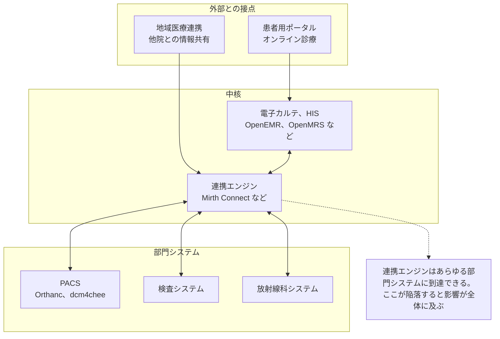

# 🧬 OSS 医療情報システムの脆弱性

オープンソースの電子カルテ（EHR/EMR）、病院情報システム（HIS）、医用画像システムは、小規模なクリニック、新興国の医療機関、研究用途で世界的に使われている。
ソースコードが公開されているため、脆弱性研究の入口としても現実的な対象になる。

> [!NOTE]
> **表記ルール**：本ページでは、**事実**（一次情報で確認できる内容。出典を併記する）、**報道ベース**（報道のみで確認でき、当事者の公表資料では裏付けが取れていない内容）、**分析**（筆者の解釈）を書き分ける。
> 出典は、当事者の公表資料、行政文書、CVE、ベンダアドバイザリなどの一次情報を優先して示す。

## なぜ OSS 医療システムを見るのか

| 観点 | 内容 |
|---|---|
| **合法的に検証できる** | 商用の医療情報システムと異なり、自前で構築して自由に検証できる |
| **実運用されている** | 研究用の玩具ではなく、実際の診療現場で患者データを扱っている |
| **医療ドメイン固有の設計が学べる** | 患者、受診、オーダ、処方、保険請求という医療特有のデータモデルと権限設計を、コードレベルで理解できる |
| **商用システムにも通じる** | 医療 IT に共通する設計上の落とし穴（患者 ID の直接参照、監査ログの欠落など）は、商用製品でも同様に発生する |

> [!WARNING]
> 検証は、自分で構築したローカル環境で行ってほしい。
> インターネット上で公開稼働している医療システムへの無許可のテストは、多くの国で違法であり、実在する患者の診療に影響する。

## 一覧

- [OSS 電子カルテ、HIS の脆弱性](ehr-systems.md)
- [医用画像 OSS（PACS/DICOM 実装）の脆弱性](imaging-pacs.md)

## 医療情報システムの構成

OSS であれ商用であれ、医療情報システムの構成は共通している。
どの層を見ているのかを意識すると、脆弱性の性質が整理しやすい。

## 医療システムに固有の脆弱性パターン

一般的な Web 脆弱性のうち、医療システムでは次のものが繰り返し発見される（**分析**）。

| パターン | 医療における現れ方 | 深刻度が上がる理由 |
|---|---|---|
| **IDOR / 権限昇格** | `patient_id`、`encounter_id`、`document_id` の直接参照 | 1 件の欠陥で全患者の診療録が読める |
| **認証、セッションの不備** | 共有端末前提の設計、長時間セッション、緊急時ログイン（Break-glass）の乱用 | 病棟の共有端末が実質的に無認証端末になる |
| **SQL インジェクション** | 検索画面（患者検索、オーダ検索）に集中 | 検索は患者テーブル全体に対する権限で動くことが多い |
| **ファイルアップロード / ダウンロード** | スキャン文書、紹介状、画像添付 | 医療文書は種類が多く、検証が緩くなりがち |
| **監査ログの欠落、改ざん可能性** | 誰がどの患者記録を見たかの記録 | 法令上の要求事項であり、欠落自体がコンプライアンス違反になる |
| **API / 連携インタフェース** | HL7 v2、FHIR、CSV バッチ連携 | 「内部システム間だから」と認証が省略されがち |

## 脆弱性の調べ方

特定の製品について既知の脆弱性を調べるときの入口を挙げる。

| 情報源 | 用途 |
|---|---|
| [NVD 検索](https://nvd.nist.gov/vuln/search) | 製品名で CVE を横断検索する |
| [CVE Program 検索](https://www.cve.org/) | CVE の一次情報を確認する |
| [GitHub Security Advisories](https://github.com/advisories) | OSS のエコシステム別アドバイザリ |
| [GitHub Issues / Commit ログ](https://github.com/) | 「セキュリティ修正だが CVE が振られていない」コミットを探す |
| [Exploit-DB](https://www.exploit-db.com/) | 公開 PoC の有無を確認する |
| [OSV](https://osv.dev/) | 依存パッケージ由来の脆弱性を機械的に確認する |
| [FDA / CISA ICS Medical Advisories](https://www.cisa.gov/news-events/cybersecurity-advisories) | 医療機器、医療システム向けの公的アドバイザリ |

## 新規追加のしかた

新しい脆弱性事例を追加するときは、[`docs/_templates/vulnerability.md`](../_templates/vulnerability.md) をコピーして使ってほしい。

---

[トップへ](../../README.md)
