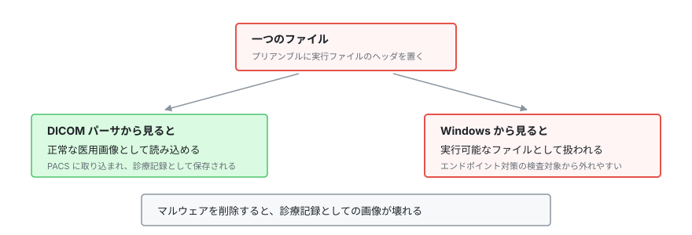

# 医用画像 OSS（PACS / DICOM 実装）の脆弱性

医用画像を扱う PACS（Picture Archiving and Communication System）と、その通信規格である DICOM の OSS 実装をまとめる。

> [!NOTE]
> **表記ルール**：本ページでは、**事実**（一次情報で確認できる内容。出典を併記する）、**報道ベース**（報道のみで確認でき、当事者の公表資料では裏付けが取れていない内容）、**分析**（筆者の解釈）を書き分ける。
> 出典は、当事者の公表資料、行政文書、CVE、ベンダアドバイザリなどの一次情報を優先して示す。

> 規格そのもののリスクと検証手法は [PACS / DICOM のセキュリティ](../medical-devices/pacs-dicom.md) にまとめている。
> 本ページは、OSS 実装のコードレベルの脆弱性を扱う。

---

## 主要な OSS 実装

| 製品 | 種別 | 特徴 | 一次情報 |
|---|---|---|---|
| **Orthanc** | PACS サーバ | 軽量。REST API を備え、研究、小規模施設で広く利用 | [公式](https://www.orthanc-server.com/) | [NVD](https://nvd.nist.gov/vuln/search/results?query=orthanc) |
| **dcm4che / dcm4chee** | ツールキット / アーカイブ | Java 製。エンタープライズ級の PACS アーカイブ | [公式](https://www.dcm4che.org/) | [GitHub](https://github.com/dcm4che) |
| **DCMTK** | ツールキット | C++ 製の DICOM 実装。多くの製品の基盤 | [公式](https://dicom.offis.de/dcmtk) |
| **OHIF Viewer** | Web ビューア | ブラウザベースの医用画像ビューア | [公式](https://ohif.org/) | [GitHub](https://github.com/OHIF/Viewers) |
| **Weasis** | ビューア | Java 製の医用画像ビューア | [GitHub](https://github.com/nroduit/Weasis) |
| **Conquest DICOM** | PACS サーバ | 小規模施設、研究で利用される軽量サーバ | [公式](https://www.image-systems.biz/) |
| **pydicom** | ライブラリ | Python の DICOM 処理ライブラリ | [GitHub](https://github.com/pydicom/pydicom) |
| **Evil-DICOM** | ライブラリ | C# の DICOM 操作ライブラリ | [GitHub](https://github.com/rexcardan/Evil-DICOM) |
| **fo-dicom** | ライブラリ | .NET の DICOM 実装 | [GitHub](https://github.com/fo-dicom/fo-dicom) |

---

## この領域に固有の脆弱性パターン

### 1. 認証がそもそも「規格の外」にある

**事実**

- DICOM の基本的な通信（C-ECHO / C-FIND / C-MOVE / C-STORE）は、AE Title（Application Entity Title）による識別を前提とする。AE Title は単なる文字列であり、認証情報ではない。
- TLS と証明書による相互認証は規格上定義されているが、実運用では有効化されていない構成が多い。

**帰結（分析）**

- ネットワーク到達性がある = 画像を取得できる、という状態になりやすい。
- 「院内ネットワークだから安全」という前提が崩れた瞬間（VPN 侵害、委託先経由）に、全画像が読み出し可能になる。

### 2. インターネットに露出した PACS

**事実**

- 複数のセキュリティ研究機関が、インターネット上に公開された PACS サーバを大規模に調査し、数千のサーバと数千万件規模の医用画像や患者情報が第三者から到達可能であったと報告している（例として、Greenbone Networks による一連の調査レポートがある）。
- 露出したデータには、氏名、生年月日、検査日、診断情報など、画像に埋め込まれたメタデータ（DICOM タグ）が含まれる。

**確認方法**

- 自組織の資産について、外部からの到達性を確認する（DICOM の標準ポートは **104 / 11112**、Web UI は 8042 など製品依存）。
- Shodan 等の検索エンジンで自組織の IP レンジを確認する（**自組織の資産に限る**）。

### 3. DICOM ファイル構造を悪用したマルウェア埋め込み

**事実**

- DICOM ファイルの先頭 128 バイトは、プリアンブルとして規格上の未使用領域になっており、任意のバイト列を格納できる。
- この領域に Windows 実行ファイル（PE）のヘッダを配置すると、DICOM としても実行ファイルとしても有効なファイル（ポリグロット）を構成できる。2019 年に Cylera の研究者が公表した。
- 画像データ自体は破壊されないため、マルウェアを削除すると診療記録としての画像が壊れるというジレンマが生じる。

<p align="center">
  
</p>

**対策（分析）**

- PACS に取り込む DICOM ファイルのプリアンブル領域を検証、正規化する。
- 医用画像ファイルを一般のファイル共有経路で扱わない。
- エンドポイント対策製品が DICOM ファイルを検査対象にしているか確認する。

### 4. 実装レベルの脆弱性

| 種別 | 発生箇所 |
|---|---|
| **バッファオーバーフロー / メモリ破壊** | C/C++ 製のパーサ（DCMTK 系、独自実装）における不正な DICOM タグの処理 |
| **パストラバーサル** | 受信した画像をファイル名（SOP Instance UID 等）に基づいて保存する処理 |
| **XSS / SSRF** | Web ベースのビューア、管理 UI。特に外部 URL からの画像取得機能 |
| **認証の欠落、デフォルト認証情報** | 管理 Web UI（Orthanc の Explorer など）の初期設定 |
| **アクセス制御の不備** | REST API 経由で AE Title の制限を回避できる構成 |

---

## 検証環境の作り方

```bash
# 例: Orthanc の検証環境
docker run -p 4242:4242 -p 8042:8042 --rm jodogne/orthanc-plugins

# DICOM 通信の疎通確認（DCMTK の echoscu）
echoscu -v localhost 4242

# テスト用の DICOM ファイルは、公開データセットを利用する
# 例: The Cancer Imaging Archive (TCIA) https://www.cancerimagingarchive.net/
```

> [!WARNING]
> 実患者の DICOM ファイルを検証に使うわけにはいかない。
> DICOM は画像に加えて患者識別情報をメタデータとして保持しており、匿名化の不備がそのまま個人情報の漏えいになる。
> 匿名化には専用のツール（`gdcmanon`、`dicom-anonymizer` など）を使い、処理後にタグを検証してほしい。

---

## 関連ページ

- [PACS / DICOM のセキュリティ](../medical-devices/pacs-dicom.md)
- [医療機器の検証手法](../medical-devices/testing-methodology.md)
- [ツール](../resources/tools.md)

---

<sub>[← OSS 医療情報システムの脆弱性](README.md) | [トップへ](../../README.md)</sub>
