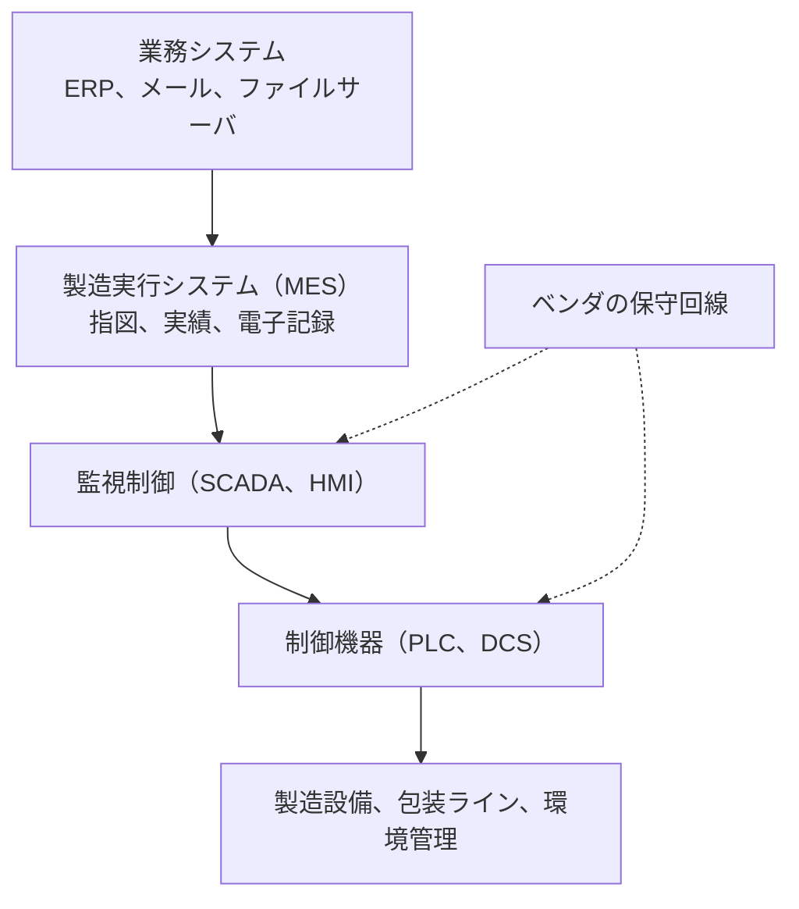

# 🏭 製造設備と OT

医薬品の製造ラインは、制御機器とその管理システムで動いている。
情報システムの停止が事務作業の停止で済むのに対し、ここでの停止は仕掛かり中のバッチの廃棄と、出荷計画の後退につながる。

> [!NOTE]
> **表記ルール**：本ページでは、**事実**（一次情報で確認できる内容。出典を併記する）、**報道ベース**、**分析**（筆者の解釈）を書き分ける。

## 層の構造

**分析**：侵入が業務システム側で起きても、製造が止まる理由は二つある。
一つは、MES が止まると製造指図と記録の運用が続けられないこと。
もう一つは、被害範囲を確定できないあいだ、汚染の可能性を理由に製造側を予防的に停止する判断が取られることである。

## 手を入れられない理由

| 制約 | 内容 |
|---|---|
| **バリデーション** | 計算機化システムは、検証した状態で使うことが前提になる。構成の変更には、その影響を確認する手続きが要る |
| **設備の寿命** | 製造設備は十年単位で使われ、制御系のソフトウェアは設備に紐づく |
| **ベンダ依存** | 制御系の変更はベンダの作業になり、保守契約の範囲に縛られる |
| **停止の代償** | 検証のための停止が、そのまま出荷計画に響く |

**事実**：欧州の GMP ガイドライン（EudraLex Volume 4）は、計算機化システムに対する要件を Annex 11 として定めている。
出典：[EudraLex Volume 4](https://health.ec.europa.eu/medicinal-products/eudralex/eudralex-volume-4_en)

**事実**：PIC/S は GMP ガイド（PE 009-17）を公開し、Annex 11 の改訂ドラフトを 2025 年 7 月に掲載している。
出典：[PIC/S Publications](https://picscheme.org/en/publications)

**分析**：この構造は、医療機関が医療機器に対して置かれている立場と同じである。
資産は自社にあるが、変更の権限は自社にない。
違いは、医療機器では患者の安全が、製造設備では製品の品質が、変更を縛る根拠になっている点にある。

## 検知と緩和

制御系に手を入れられない前提で、周囲を設計する。

| 対象 | 打ち手 |
|---|---|
| IT と OT の境界 | 双方向の通信を必要な相手と用途に限り、経路を一箇所に集約する |
| ベンダの保守回線 | 常設接続をやめ、作業のたびに開放して記録を残す |
| 資産の把握 | 制御系の機器と通信を、能動的なスキャンではなく通信の観測で把握する |
| 認証 | 制御系の共有アカウントを、作業者が特定できる形に置き換える |
| バックアップ | 制御系の設定とレシピを、製造網の外に保管する |
| 復旧 | 製造を止めた状態から再開するまでの手順を、品質保証部門と合意しておく |

**事実**：制御システムのセキュリティについて、NIST は SP 800-82 Revision 3「Guide to Operational Technology (OT) Security」を 2023 年 9 月に公開している。
出典：[NIST SP 800-82 Rev. 3](https://csrc.nist.gov/pubs/sp/800/82/r3/final)

**事実**：制御機器の脆弱性は、CISA が ICS Advisories として継続的に公表している。
出典：[CISA ICS Advisories](https://www.cisa.gov/news-events/ics-advisories)

> [!WARNING]
> 稼働中の製造ラインに対する能動的なスキャンは、制御機器の停止を引き起こしうる。
> 検証は、書面での許可を得たうえで、停止中の設備または検証環境で実施してほしい。

## 関連

- [原薬、受託製造、流通](supply-chain.md)
- [医療機器のセキュリティ](../medical-devices/)：同じ「変更できない資産」の問題を、医療機関の側から扱う

---

[製薬企業のセキュリティ](README.md) | [トップへ](../../README.md)
