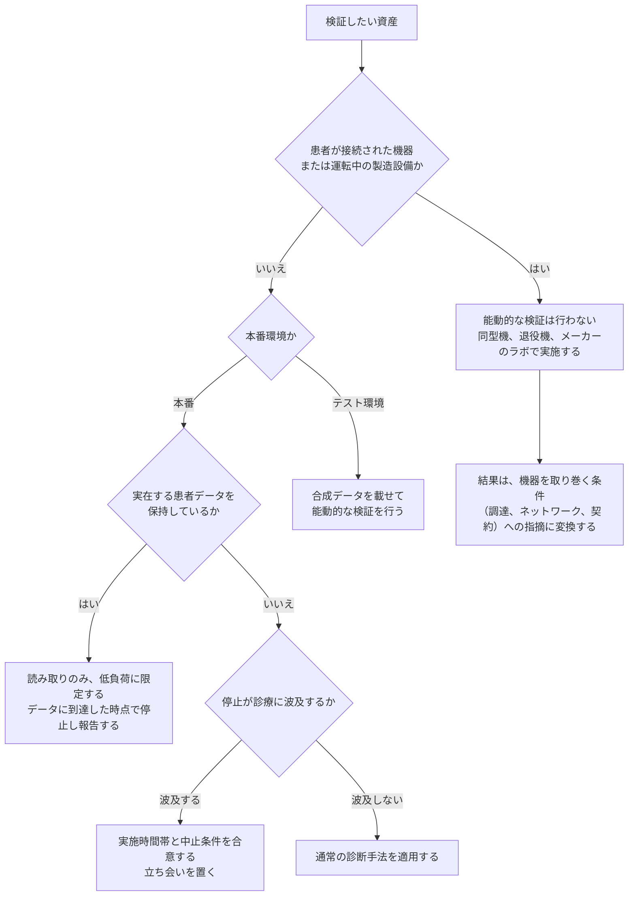

# 🛡️ 検証と実務

守る側が実際に手を動かす工程を扱う。
自組織または受託先を検証する立場と、外部の研究者から報告を受ける立場の両方を対象とする。

## 構成

| セクション | 内容 |
|---|---|
| [診断とペネトレーションテスト](pentest/) | 医療機関と製薬企業に対する検証を、人、外部境界、Web、クラウド、内部、医療機器、製造 OT の領域に分けて整理する |
| [Bug Bounty × 医療、ヘルスケア](bug-bounty/) | 医療分野でのバグバウンティと脆弱性開示。触れてよい対象の線引き、報告経路、サイバー防衛としての位置づけ、受け入れ側の始め方 |

## 検証前に確定させること

医療では、検証の可否が技術ではなく規制と診療の都合で決まる場面が多い。
着手前に次を確定させる。

**対象の稼働状態**：稼働中の医療機器と製造設備は、原則として対象から外す。検証はテスト環境で行う。
**書面での許可**：範囲、期間、停止時の連絡先、中止条件を文書にする。
**規制上の制約**：バリデーション済みの製造設備や承認を受けた医療機器は、構成変更に承認手続きが伴う（[ガイドラインと法規制](../guidelines/)）。
**報告経路**：発見した脆弱性を誰に、どの経路で渡すかを、開始前に決めておく（[Bug Bounty × 医療、ヘルスケア](bug-bounty/)）。

## 対象の性質と、実施できる手法

同じ資産でも、患者が接続されているか、承認済みの構成かによって、許される検証が変わる。
下の分岐を先に通してから、手法とスケジュールを決める。

**分析**：この分岐の目的は、検証を減らすことではなく、実施できる形に変換することである。
稼働中の機器に触れられない場合でも、ネットワーク配置、保守回線の開放状況、調達要件は検証の対象として残る。
「対象外」で終わらせると、攻撃者が実際に通る経路が未検証のまま残る。

検証で見るべき攻撃面は [技術領域](../technology/)、想定する攻撃者の挙動は [脅威](../threats/) に対応する。
発見した脆弱性を誰に渡すかは [Bug Bounty × 医療、ヘルスケア](bug-bounty/)、指摘を組織の意思決定につなげる先は [経営とガバナンス](../governance/) に対応する。

> [!WARNING]
> 権限のないシステムに対する検証は行ってはならない。
> 記載された技術情報は、教育と防御を目的として提供している。

---

[トップへ](../../README.md)
