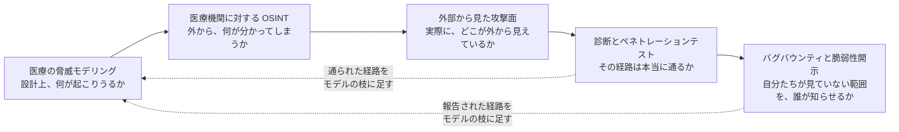
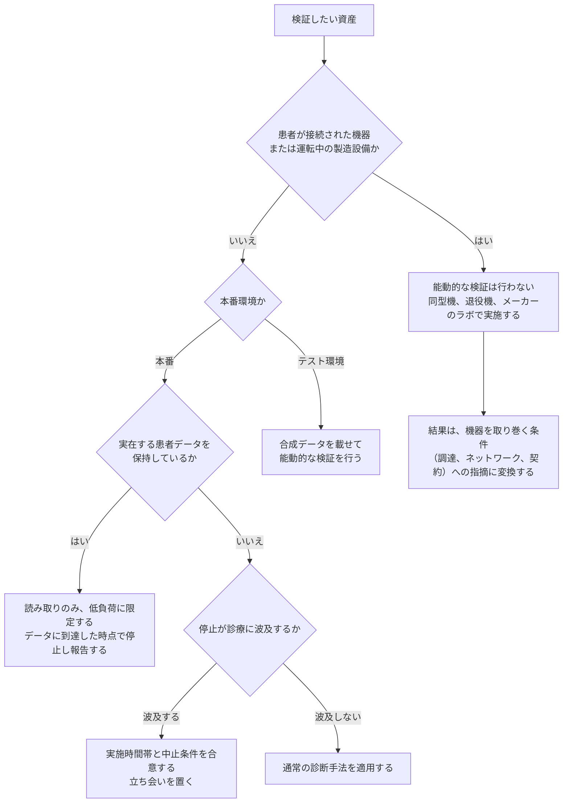

# 🛡️ 検証と実務

守る側が実際に手を動かす工程を扱う。
自組織または受託先を検証する立場と、外部の研究者から報告を受ける立場の両方を対象とする。

## 構成

| セクション | 内容 |
|---|---|
| [医療の脅威モデリング](threat-modeling.md) | 設計図が手元にない状態から、信頼境界と攻撃ツリーを描き、優先順位のついた対策と検証項目に落とす |
| [医療機関に対する OSINT](osint.md) | 制度、広報、学会、求人、調達から何が外に出るか。情報の種類ごとに、経路と手法、攻撃側の使い道、減らせるものと減らせないものを対応づける。Web と IoMT に分けた道具と段階、集めるときに立てる問いを含む |
| [外部から見た自組織の攻撃面](attack-surface.md) | 台帳と実際のずれ、外から到達できる入口の数え方、測ってよい範囲の線引き、継続の設計 |
| [診断とペネトレーションテスト](pentest/) | 医療機関と製薬企業に対する検証を、人、外部境界、Web、クラウド、内部、医療機器、製造 OT の領域に分けて整理する。レッドチーム演習と TLPT の工程、Red Team Operator の職能、潜伏と対になる検知、病院のゾーンを通る経路と越えない線（[レッドチームと TLPT を医療機関に当てはめる](pentest/red-team-tlpt.md)）と、演習環境の型を病院に当てはめた読み替え（[Hack The Box の型で病院を想定する](pentest/htb-style-hospital.md)）を含む |
| [Bug Bounty × 医療、ヘルスケア](bug-bounty/) | 医療分野でのバグバウンティと脆弱性開示。触れてよい対象の線引き、報告経路、サイバー防衛としての位置づけ、受け入れ側の始め方 |
| [検証と調査の法的境界](legal-boundary.md) | 行為の段ごとに当たる法令、立場ごとの線、許諾の文面に書く事項、制度が用意している報告の経路 |

## 五つが答える問いの違い

上の表のうち、工程として順に並ぶ五つは、同じ対象に対して別の問いを立てる。
どれか一つで置き換えられる関係にはない。
残りの一つは、この五つのどこにいても参照する土台にあたる。

**分析**：この順序で進むと、後の工程ほど費用が上がる。
設計の段階で塞げるものを診断で見つけると、修正の適用に承認手続きと停止調整が必要になり、医療では月単位の遅れが生じる。
診断は成果物が一覧として見えるため選ばれやすいが、前の三つを飛ばすと、稼働後には直せない指摘の割合が増える。

## 検証前に確定させること

医療では、検証の可否が技術ではなく規制と診療の都合で決まる場面が多い。
着手前に次を確定させる。

**対象の稼働状態**：稼働中の医療機器と製造設備は、原則として対象から外す。検証はテスト環境で行う。
**書面での許可**：範囲、期間、停止時の連絡先、中止条件を文書にする（[検証と調査の法的境界](legal-boundary.md)）。
**規制上の制約**：バリデーション済みの製造設備や承認を受けた医療機器は、構成変更に承認手続きが伴う（[ガイドラインと法規制](../guidelines/)）。
**報告経路**：発見した脆弱性を誰に、どの経路で渡すかを、開始前に決めておく（[Bug Bounty × 医療、ヘルスケア](bug-bounty/)）。
**公開情報の扱い**：収集を受動的な範囲に限るか能動的な確認を含むかと、患者情報に到達したときの手順を、書面に含める（[医療機関に対する OSINT](osint.md)）。

## 対象の性質と、実施できる手法

同じ資産でも、患者が接続されているか、承認済みの構成かによって、許される検証が変わる。
下の分岐を先に通してから、手法とスケジュールを決める。

**分析**：この分岐の目的は、検証を減らすことではなく、実施できる形に変換することである。
稼働中の機器に触れられない場合でも、ネットワーク配置、保守回線の開放状況、調達要件は検証の対象として残る。
「対象外」で終わらせると、攻撃者が実際に通る経路が未検証のまま残る。

検証で見るべき攻撃面は [技術領域](../technology/)、想定する攻撃者の挙動は [脅威](../threats/) に対応する。
発見した脆弱性を誰に渡すかは [Bug Bounty × 医療、ヘルスケア](bug-bounty/)、指摘を組織の意思決定につなげる先は [経営とガバナンス](../governance/) に対応する。
検証と調査がどこで法の線に触れるかは [検証と調査の法的境界](legal-boundary.md) に対応する。

> [!WARNING]
> 権限のないシステムに対する検証は行ってはならない。
> 記載された技術情報は、教育と防御を目的として提供している。

---

[トップへ](../../README.md)
