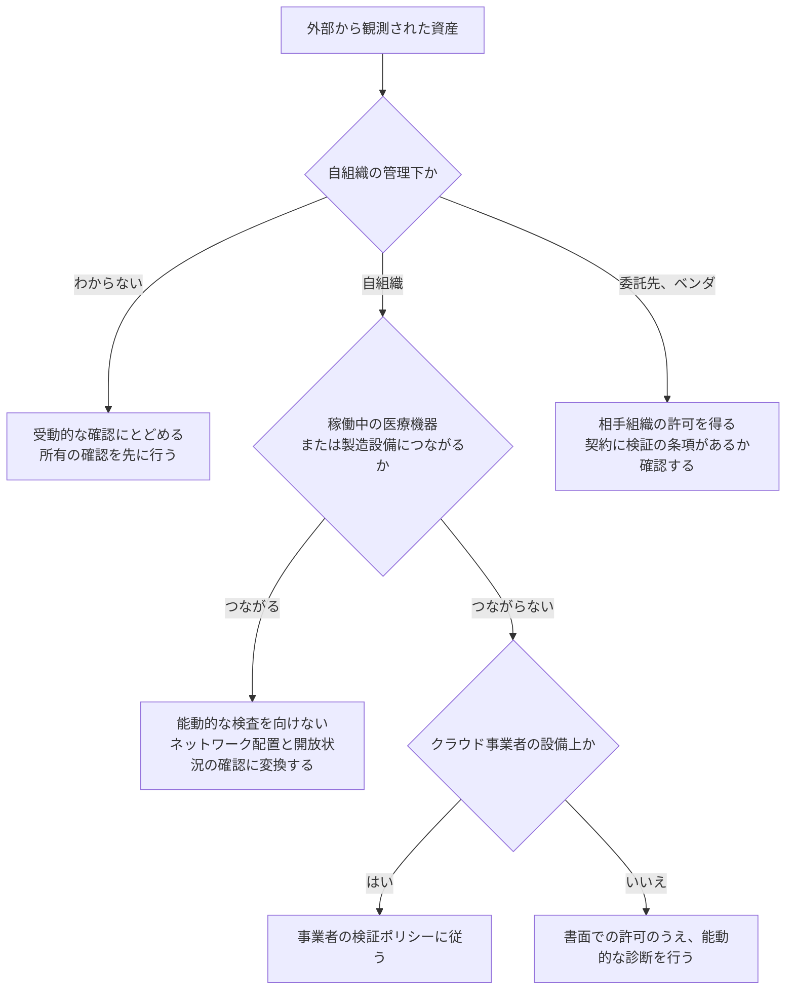

# 🛰️ 外部から見た自組織の攻撃面

防御側の作業は資産台帳から始まり、攻撃側の作業は外から見えるものから始まる（[攻撃者視点と防御者視点](../reference/security-basics.md#18-攻撃者視点と防御者視点)）。
この二つが一致していない限り、対策は台帳に載っている範囲でしか働かない。
台帳に無い資産は、パッチ適用の対象にも、監視の対象にも、診断の対象にもならないためである。

**攻撃面**（攻撃対象領域、Attack Surface）は、外部から到達できる資産と、そこが受け取る入力の総体を指す。
本ページは、その範囲を数え、順序をつけ、増えたときに気付く形にするまでを扱う。

**事実**：経済産業省は、外部から把握できる情報を用いて自組織の IT 資産を発見し管理する手法を ASM（Attack Surface Management）と呼び、導入ガイダンスを公開している（2023 年 5 月 29 日）。
同ガイダンスは ASM を、組織の外部からアクセス可能な IT 資産を発見し、それらに存在する脆弱性などのリスクを継続的に検出し評価する一連のプロセスと定義する。
出典：[ASM（Attack Surface Management）導入ガイダンス](https://www.meti.go.jp/press/2023/05/20230529001/20230529001.html)（経済産業省）

> [!NOTE]
> **表記ルール**：本ページでは、**事実**（一次情報で確認できる内容。出典を併記する）、**報道ベース**（報道のみで確認でき、当事者の公表資料では裏付けが取れていない内容）、**分析**（筆者の解釈）を書き分ける。

---

## 台帳と実際がずれる理由

ずれ方には型がある。
型がわかれば、どこを探せば埋まるかも決まる。

| ずれの型 | 医療機関と製薬企業で起きる形 | 埋める材料 |
|---|---|---|
| 購入を伴わない接続 | 既存機器への回線追加、ベンダ側での設定変更、地域連携の相手側での開放 | 境界機器の許可ルールと、その申請記録 |
| 部門が独自に契約した資産 | 研究費で立てたクラウド、診療科の学会用サイト、治験の検体管理アプリ | 支払いの記録。ドメイン登録の連絡先 |
| ベンダが設置した資産 | 医療機器の管理画面、保守用の踏み台、遠隔監視のための接続 | 保守契約書と据付報告書 |
| 退役の未完了 | 更改後も稼働している旧サーバ、旧患者ポータル、検証用に立てた環境 | 外部からの観測。DNS の登録内容 |
| 法人の統合と事業の譲受 | 旧法人のドメイン、旧メールアドレス、統合前の予約サイト | 統合時の資産引き継ぎ記録 |
| 委託先に置かれた自組織のデータ | 検査、給食、事務、印刷の委託先が持つ複製と、その公開設定 | 委託契約と、再委託の確認 |

**分析**：いずれも担当者の見落としではなく、台帳の目的から生じる。
資産台帳は購入したものを管理する目的で作られるため、購入を伴わない変化を記録する仕組みを持たない。
台帳の運用を直すより、外部からの観測を別に置いて突き合わせるほうが早い。

---

## 何を数えるか

数える対象は、資産そのものではなく、外部から到達できる入口である。

| 区分 | 具体 | 医療での典型 |
|---|---|---|
| ドメインと証明書 | 保有ドメイン、サブドメイン、発行済みの証明書 | 診療科別サイト、旧法人ドメイン、キャンペーン用サイト |
| IP と公開サービス | 割り当てられたアドレス範囲、開いているポート | 回線契約が複数ある施設。医事会計の外部接続 |
| リモートアクセス | VPN、リモートデスクトップ、仮想デスクトップ、保守用踏み台 | 委託先用と保守用で別系統が立つ |
| Web アプリケーション | 患者ポータル、予約、オンライン診療、問い合わせ、採用、寄付 | 制作を外注した資産が別ドメインで残る |
| モバイルと PHR | 患者向けアプリと、その API | 画面より広い範囲を返す API（[PHR、健康アプリ、ウェアラブル](../technology/web-security/phr-apps.md)） |
| クラウド | テナント、ストレージ、公開設定、外部共有リンク | 部門が個別に契約したストレージ |
| 医療機器に由来する露出 | 画像の受け渡しに使う接続、機器の管理画面 | 遠隔読影と地域連携の設定が全開放になる（[PACS / DICOM のセキュリティ](../technology/medical-devices/pacs-dicom.md)） |
| メールとドメインの設定 | 送信ドメイン認証の設定、失効間近のドメイン | 期限切れ後に第三者が再取得する（[メールとドメインの管理](../technology/email-domain.md)） |
| 公開されたコードと設定 | リポジトリ、配布物に含まれる設定値 | 委託先の開発物に接続先と資格情報が残る |
| 流出した認証情報 | 自組織のドメインを含む認証情報の流通 | 委託先の端末経由で流出する |

**分析**：この一覧のうち、医療機関が自力で数えにくいのは、ベンダが設置した資産と、部門が個別に契約した資産の二つである。
どちらも情報システム部門を経由せずに増えるため、内部の記録には現れない。
外部からの観測が、この二つを見つける唯一の経路になる場合がある。

---

## 測り方の線引き

外から見える範囲を測る作業は、公開情報を照会するだけの部分と、相手のシステムに通信を送る部分に分かれる。
医療では、この線を越えたところに患者の安全がある。

**受動的な確認**：公開情報の照会にとどまる範囲を指す。
ドメインの登録内容、証明書の発行記録、公開されている検索結果、流通している認証情報の確認がこれにあたる。
相手のシステムに負荷を与えないため、所有の確認が済む前でも実施できる。

**能動的な検査**：対象へ通信を送る範囲を指す。
ポートの確認、脆弱性スキャン、Web アプリケーション診断がこれにあたる。
自組織の資産であっても、機器がベンダの管理下にある、回線が委託先の設備を通る、クラウド事業者の設備上で動く、といった条件では別の許可が要る（[診断とペネトレーションテスト](pentest/)）。

> [!WARNING]
> 権限のない対象に向けて能動的な検査を行ってはならない。
> 稼働中の医療機器と製造設備は、想定していない通信を受け取ると停止することがあり、その停止が処置の中断と出荷の停止に直結する。

---

## 医療で落ちやすい欄

| 落ちやすい資産 | なぜ落ちるか | 見つかったときの扱い |
|---|---|---|
| 旧法人、旧診療科のドメインと患者ポータル | 統合や移転の際に、公開停止の担当が決まらないまま残る | 稼働の要否を確認し、不要なら停止と DNS の削除まで行う |
| 機器ベンダが保守用に置いた管理画面 | 据付の一部として設定され、情報システム部門の記録に残らない | 接続元の限定と、開放の記録を保守契約に書き込む |
| 地域医療連携のための接続 | 相手側の設定変更で開放範囲が変わる | 双方の設定を突き合わせる時期を決める（[地域医療情報連携ネットワーク](../technology/dx-ax/regional-networks.md)） |
| 研究部門と治験まわりの個別アプリ | 研究費で立ち、業務システムの管理対象に入らない | 所管を決める。研究終了後の停止まで含めて計画する |
| 印刷用画面、PDF 生成、通知メール | 画面と別の経路で同じデータを出すため、認可の点検から漏れる | 認可の判定を、経路ごとではなくデータの単位で行う |
| 患者向けアプリが呼ぶ API | 画面に表示しない項目まで返す設計が残る | 応答の項目を、画面の必要範囲に絞る |
| 期限が近いドメイン | 更新の担当と支払いの経路が分かれている | 更新を継続するか、送信ドメイン認証で否認する（[メールとドメインの管理](../technology/email-domain.md)） |

**分析**：この表の資産は、いずれも自組織の内側から見ると「使っていないもの」として認識されている。
攻撃側から見ると、使われていない資産は、更新が止まり監視も薄いという理由で優先度が上がる。
評価が逆転する構造であるため、棚卸しの目的を「使っているものを数える」から「外から見えるものを数える」に置き換える必要がある。

---

## 見つけたものに順序をつける

見つかった資産の数は、たいてい対応できる数を超える。
順序は四つの軸で決まる。

| 軸 | 高いほうの状態 | 確かめ方 |
|---|---|---|
| 到達性 | インターネットから直接届く | 外部からの観測 |
| 認証 | 認証がない、または単一要素で足りる | 認証方式の確認 |
| そこから届く先 | 院内網、認証基盤、機器ゾーンへつながる | ネットワーク配置と接続の確認 |
| 診療と供給への影響 | 停止または改ざんが、診療と出荷に届く | 臨床側と品質部門への確認 |

四つが揃うものが最上位に来る。
診断の結果と並べて扱う場合は、同じ区分に載せ替える（[深刻度を、診療と患者安全の言葉に翻訳する](pentest/README.md#7-深刻度を診療と患者安全の言葉に翻訳する)）。

**分析**：外部公開資産への対応で最も効くのは、修正ではなく停止である。
一方で、使われていないと思われた資産が、実は特定の診療科や委託先の業務に使われていることがある。
遮断の前に、その経路に通信が来ていないことを測る手順を挟むと、業務で使われていた経路を予告なく塞ぐ事態を避けやすい（[ネットワークの分離](../technology/segmentation.md)）。

---

## 発見を、置く手当てに変える

一覧を作っただけでは攻撃面は減らない。
見つかった型ごとに、先に置く手当てと恒久対策を分けて決める。

| 見つかったもの | 先に置く手当て | 恒久対策 |
|---|---|---|
| 多要素認証のないリモートアクセス | 接続元の限定。対象アカウントの棚卸し | 例外を含めた多要素認証の適用（[認証とアクセス管理](../technology/identity.md)） |
| 外部から届く医用画像の接続 | 経路の遮断 | 機器ゾーンへ戻し、接続元を限定する |
| 退役し忘れたサーバ、旧ポータル | 公開の停止 | DNS と証明書の整理。退役手順に停止確認を組み込む |
| 公開設定のクラウドストレージ | 公開の停止。アクセス記録の確認 | 既定を非公開にする。共有リンクの期限管理 |
| 流出した認証情報 | 該当アカウントの資格情報の失効 | 同一パスワードの使い回しの調査。多要素認証の適用 |
| ベンダが置いた管理画面 | 接続元の限定 | 保守契約に、開放条件と記録の取得を明記する |

**分析**：外部公開資産の是正は、一度で終わる作業に見えて終わらない。
停止した資産の代わりに新しい資産が公開され、委託先の構成も変わるためである。
是正を作業として扱うか、継続する仕組みとして扱うかで、半年後の状態が変わる。

---

## 増えたときに気付く形にする

継続の仕組みは、専任者を置けるかどうかで形が変わる。
共通するのは、全件を毎回見るのではなく、前回との差分を見る形にすることである。

- 新しく公開されたホストと証明書を、定期的に取得して前回と比べる
- 資産が増える契機（調達、統合、部門のクラウド契約、Web 制作の外注）を、棚卸しの起動点に紐づける
- 一覧の所有者を決める。所有者のいない資産を、停止候補として扱う
- 変化のあった項目だけを、月次の報告に載せる

**事実**：厚生労働省は、医療機関におけるサイバーセキュリティ確保事業として、電子カルテを導入済みの医療機関を対象に、外部接続点の洗い出し、外部ネットワーク調査、脆弱性診断を提供している。
出典：[医療機関におけるサイバーセキュリティ確保事業](https://www.mhlw.go.jp/stf/seisakunitsuite/bunya/kenkou_iryou/iryou/johoka/cyber-security_00002.html)（厚生労働省）

**分析**：この事業で得られるのは、ある時点での一覧である。
一覧の維持は事業の範囲外にあるため、調査の後に誰が差分を見るかを、受ける前に決めておく必要がある。
外部委託する場合の選択肢と、国内外の事業者の区分は [セキュリティサービスのカタログ](../reference/security-services/) に整理している。
米国の医療機関向けには、CISA が無償の Cyber Hygiene サービスを提供している（[海外のサービス](../reference/security-services/global.md)）。

---

## 外から指摘されたときに受け取れるか

攻撃面の把握には、自組織で観測する経路のほかに、外部の研究者から報告を受け取る経路がある。
内部の点検は台帳に載っている対象を想定した経路でたどるため、台帳から漏れた資産は、外部からの報告でしか届かないことがある。

受け取る側の設計（連絡先の公開、報告の扱い、修正までの手順）は [Bug Bounty × 医療、ヘルスケア](bug-bounty/) に整理している。
報告先が公開されていない組織では、発見者が連絡経路を探す間に露出が続く。

---

## 関連ページ

- [医療の脅威モデリング](threat-modeling.md)：境界の一覧を、脅威の数え上げに渡す
- [診断とペネトレーションテスト](pentest/)：数えた入口が実際に通るかを測る
- [Bug Bounty × 医療、ヘルスケア](bug-bounty/)：外部からの報告を受け取る側の設計
- [防御プレイブック](../threats/actors/defense-playbook.md)：第 0 段階の現状把握と、その後の順序
- [ネットワークの分離](../technology/segmentation.md)：到達を狭める側の設計
- [認証とアクセス管理](../technology/identity.md)：リモートアクセスの認証と例外
- [メールとドメインの管理](../technology/email-domain.md)：ドメインの失効と、なりすまし
- [セキュリティサービスのカタログ](../reference/security-services/)：外部委託の区分と選び方
- [セキュリティの基礎](../reference/security-basics.md#18-攻撃者視点と防御者視点)：二つの視点の非対称性

## 一次情報

| 資料 | 発行元 |
|---|---|
| [ASM（Attack Surface Management）導入ガイダンス](https://www.meti.go.jp/press/2023/05/20230529001/20230529001.html) | 経済産業省 |
| [医療機関におけるサイバーセキュリティ確保事業](https://www.mhlw.go.jp/stf/seisakunitsuite/bunya/kenkou_iryou/iryou/johoka/cyber-security_00002.html) | 厚生労働省 |
| [Cyber Hygiene Services](https://www.cisa.gov/cyber-hygiene-services) | CISA |

---

[← 医療の脅威モデリング](threat-modeling.md) | [検証と実務](README.md) | [トップへ](../../README.md)
