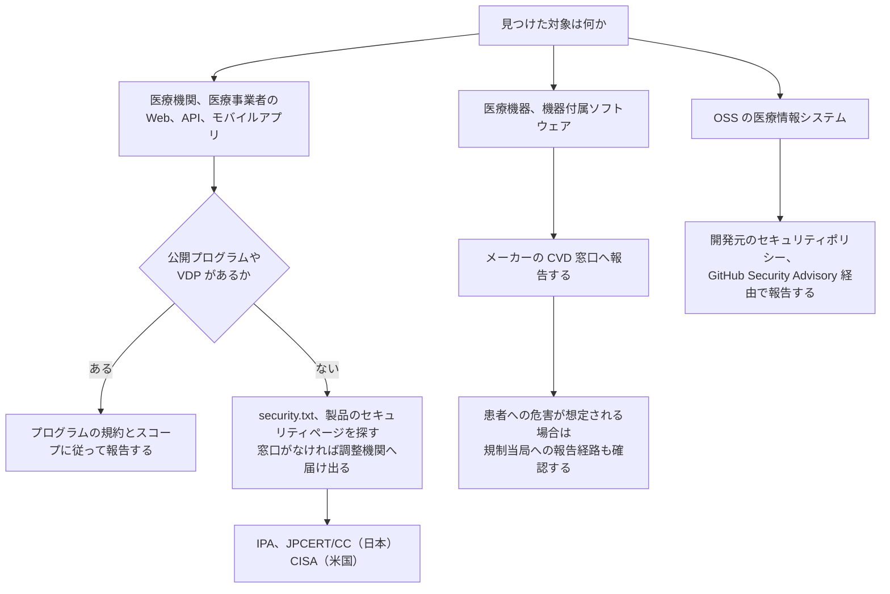

# 🎯 Bug Bounty × 医療、ヘルスケア

バグバウンティと脆弱性開示（VDP、CVD）が、医療分野でどこまで使えるかをまとめる。
一般の Web サービスと違うのは、報告する相手と、触れてよい対象の線引きである。
患者が接続された機器や、実在の診療データが載った本番系は、報奨金の有無にかかわらず検証の対象外になる。
その線を引いたうえで、患者ポータル、オンライン診療、医療 SaaS、機器のクラウド側といった資産は、通常の Web 標的と同じ手法で検証できる。

> [!NOTE]
> **表記ルール**：本ページでは、**事実**（一次情報で確認できる内容。出典を併記する）、**報道ベース**（報道のみで確認でき、当事者の公表資料では裏付けが取れていない内容）、**分析**（筆者の解釈）を書き分ける。
> 出典は、当事者の公表資料、行政文書、CVE、ベンダアドバイザリなどの一次情報を優先して示す。

> [!WARNING]
> スコープに明記されていない資産への検証は行わない。
> 稼働中の医療情報システムと医療機器に対する無許可の検証は、診療の停止と患者への危害につながりうる。
> 機器を対象とする場合は、[医療機器の検証手法](../../technology/medical-devices/testing-methodology.md)の前提条件を先に満たす。

---

## 一般の Web 標的との違い

| 論点 | 医療標的での現れ方 |
|---|---|
| 検証してよい対象 | 患者向けの公開サービスと管理系に限られる。稼働中の機器と実患者データを含む本番系は、スコープに入っていても実質的に触れない |
| 副作用の重さ | ポートスキャンや自動クロールが機器やレガシー連携の応答停止を招く。停止が診療の判断に直結する |
| PoC の作り方 | 他人の診療情報を取得して証拠にできない。自分のテストアカウント間で権限違反を示す形に組み立てる |
| 修正までの期間 | 機器やプログラム医療機器では、修正に薬事上の手続きと検証が必要になり、一般的なソフトウェアより長くなる |
| 報告先 | プログラムの窓口だけでなく、メーカーの CVD 窓口、調整機関、規制当局が関わる |
| 認可要件の複雑さ | 患者本人、家族、担当医、他院、保険者が同じシステムを使う。権限モデルの複雑さがそのまま脆弱性になる（[医療系 Web アプリのセキュリティ](../../technology/web-security/)） |

**分析**：医療標的では、脆弱性を見つける難易度より、見つけたあとに誰へどう渡すかの設計が結果を左右する。
窓口のない相手に報告すると、修正されないまま情報だけが手元に残る。

---

## 報告経路の分岐

対象の種類によって、報告先と手続きが変わる。

日本の窓口は、[IPA の脆弱性関連情報の届出受付](https://www.ipa.go.jp/security/todokede/vuln/uketsuke.html)である。
ソフトウェア製品とウェブアプリケーションの届出を受け付け、[情報セキュリティ早期警戒パートナーシップガイドライン](https://www.ipa.go.jp/security/renkei/rk20250909.html)に沿って IPA と JPCERT/CC が調整を行う（事実、出典：IPA）。
米国の医療機器については、メーカーの CVD 窓口に加えて [CISA](https://www.cisa.gov/report) が調整に入る。

---

## プラットフォームが医療向けに掲げている内容

主要なバグバウンティプラットフォームは、医療を業種別のソリューションとして扱っている。
以下は各社の公開ページに記載されている内容であり、第三者が検証した数値ではない（事実、出典：各社サイト）。

| プラットフォーム | 医療向けページの記載 | 名前が挙がっている医療系の顧客 |
|---|---|---|
| [HackerOne](https://www.hackerone.com/solutions/healthcare) | コード監査、バグバウンティ、ペネトレーションテスト、AI レッドチーミングを、PHI、PII、医療研究データの保護に用いると記載。研究者コミュニティを約 200 万人と記載 | Flo Health |
| [Bugcrowd](https://www.bugcrowd.com/solutions/healthcare/) | バグバウンティ、ペネトレーションテスト、脆弱性開示、攻撃対象領域管理に加え、医療機器を対象とした IoT ペンテストを提供と記載。HIPAA への対応に言及 | Redox |
| [Intigriti](https://www.intigriti.com/solutions/healthcare) | バグバウンティ、VDP、PTaaS、ライブハッキングイベントを提供と記載。対象領域として電子カルテ、接続された医療機器、患者ポータルと遠隔医療、クラウド診断、レガシーの臨床基盤を挙げる。HIPAA、NEN7510、NIS2、GDPR などへの対応に言及。登録ハッカーを 150,000 人以上と記載 | Nexuzhealth、UZ Leuven、Universitäts Spital Zürich、Ada、Shop Apotheke |

HackerOne の医療ページは、医療のデータ侵害の平均コストを 1,093 万ドル、全業種平均の約 2.5 倍と記載している。
この数値の原典は IBM の年次調査であり、本リポジトリでは原典を確認していない（未確認）。

**分析**：欧州のプラットフォームでは、大学病院（UZ Leuven、Universitäts Spital Zürich）や医療 SaaS が実名で挙がっている。
医療機関そのものがプログラムを持つ形は、欧州で先行している。
国内の医療機関、医療 SaaS が運用する公開バグバウンティプログラムは、本ページの執筆時点では確認できなかった（未確認）。

---

## 規制側から見た脆弱性開示

バグバウンティの前段にある CVD は、医療機器では規制上の要求になっている。

- **米国（FD&C Act 第 524B 条）**：Cyber Device の市販前提出において、市販後の脆弱性を監視、特定、対処する計画の提出が求められ、この計画には外部の研究者を含む第三者からの報告を扱う調整型の脆弱性開示が含まれる（事実、出典：[FDA Medical Device Cybersecurity](https://www.fda.gov/medical-devices/digital-health-center-excellence/cybersecurity)、詳細は[海外のガイドライン、法規制](../../guidelines/global.md)）。
- **メーカーの CVD ポリシー**：[Philips の Coordinated Vulnerability Disclosure](https://www.philips.com/a-w/security/coordinated-vulnerability-disclosure.html) は、研究者と顧客による検証を歓迎する一方、ソーシャルエンジニアリング、バックドアの設置、必要範囲を超えた脆弱性の利用、システム上のデータの複製、改変、削除を認めないと定めている。報告者を掲載する [Hall of Honors](https://www.philips.com/a-w/security/coordinated-vulnerability-disclosure/hall-of-honors.html) を公開している（事実、出典：Philips）。
- **日本**：医療分野に特化した報奨制度はない。ウェブアプリケーションとソフトウェア製品の脆弱性は、早期警戒パートナーシップの届出制度で扱われる（事実、出典：IPA）。

**分析**：報奨金の有無より、報告を受け取る窓口と、受け取ったあとに修正へ回す手順が先に要る。
524B が求めているのもこの部分であり、プラットフォームの利用はその実装手段のひとつにすぎない。

---

## 医療標的での交戦規則

プログラムの規約に加えて、次を自分の側の制約として置く。

- **実在の診療データに触れたら、そこで止める**：認可不備を確認できた時点で、追加の取得を行わない。取得済みのデータは保存せず、報告に含めない。スクリーンショットは自分のテストアカウントで再現したものに差し替える。
- **検証は自分が作成した複数アカウント間で行う**：他人の患者 ID を総当たりして範囲を確認しない。1 件の権限違反を示せば、影響の説明には足りる。
- **自動スキャンとブルートフォースを既定で止める**：レガシー連携や機器の Web UI は、通常の負荷で応答を失うことがある（[医療機器の検証手法](../../technology/medical-devices/testing-methodology.md)）。
- **ソーシャルエンジニアリングと物理侵入を行わない**：医療機関では、これらが診療の妨害に直結する。メーカーの CVD ポリシーでも明示的に禁じられている。
- **開示までの猶予を、90 日固定で当てはめない**：機器やプログラム医療機器では、修正の配布に薬事上の手続きが伴う。患者へのリスクと修正の所要期間の両方で期間を決める。
- **報告書に患者安全の観点を書く**：CVSS のスコアだけでは、可用性と完全性の侵害が診療に与える影響を表現できない。悪用に必要な条件と、臨床での現実的な影響を併記する。

---

## 出やすい脆弱性クラスと、防御側の対応

攻撃手法は、検知と緩和策とあわせて記述する。

| クラス | 医療での現れ方 | 防御側の対応 |
|---|---|---|
| 認可不備（IDOR） | 患者 ID、診察券番号、予約番号が連番や推測可能な値で、参照先の切り替えで他患者の記録に到達する | 画面ごとではなく、データ取得層で認可を判定する。1 アカウントからの患者横断参照を監査ログで検知する |
| 代理アクセスの権限委譲 | 家族や保護者の代理ログイン、後見の設定が、委譲の解除後も残る | 委譲を期限付きの明示的な関係として持ち、解除時にセッションとトークンを失効させる |
| テナント境界 | 複数の医療機関が同居する医療 SaaS で、施設 ID の付け替えにより他施設のデータへ到達する | テナント識別子をリクエストの入力ではなくセッションから解決する。跨ぎアクセスをアラート対象にする |
| API のスコープ設計 | FHIR、HL7 連携の API が、画面より広い範囲を返す。スコープが患者単位で絞られていない | API 側でも患者単位の認可を行う。画面の制限を認可と見なさない |
| 印刷、出力経路 | 印刷用画面、PDF 生成、CSV 出力、通知メールに認可の適用が漏れる | 出力生成も同じ認可経路を通す。生成物の URL を推測可能な値にしない |
| レガシー連携 | DICOM、HL7 v2 のエンドポイントが認証なしで公開される（[PACS / DICOM のセキュリティ](../../technology/medical-devices/pacs-dicom.md)） | 外部からの到達性を遮断し、接続元を限定する。公開範囲を定期的に外部から確認する |
| LLM を組み込んだ機能 | 問診票、紹介状の OCR テキスト、カルテ本文が LLM の入力になり、間接プロンプトインジェクションの経路になる（[AX：医療における AI のセキュリティ](../../technology/dx-ax/ai-security.md)） | モデルの出力を権限の判断に使わない。エージェントの操作に人手の確認を挟む |

---

## 実機に触れられる場

医療機器を合法的に検証できる機会は限られる。
DEF CON の [Biohacking Village](https://villageb.io/) は、メーカーが持ち込んだ実機を、CVD の合意に署名した研究者が検証できる Device Lab を運営している。
DEF CON 34 の Device Lab では、9 社の 19 機器が研究対象として公開された（事実、出典：[Biohacking Village](https://www.villageb.io/DeviceList)）。
参加の前提と、発見から開示までの流れは、[Biohacking Village（DEF CON）](../../reference/labs-communities/biohacking-village.md)にまとめている。

---

## 医療機関、事業者が VDP を始めるときの順序

報奨金の設定は最後に来る。
先に受け皿を作らないと、報告が滞留して開示だけが進む。

1. **受け皿を決める**：報告を読み、再現し、修正へ回す担当と、一次応答の期限を決める。委託ベンダの担当範囲も含めて決める。
2. **窓口を公開する**：`security.txt` と製品のセキュリティページを置き、報告に必要な情報と暗号鍵を示す。
3. **スコープと禁止事項を書く**：検証してよい資産、実患者データを含む本番系の除外、負荷試験とソーシャルエンジニアリングの禁止、患者データに触れた場合の中止手順を明記する。
4. **セーフハーバーを明記する**：規約の範囲内で行われた検証に対して、法的措置を取らないことを書く。ここが曖昧だと報告は届かない。
5. **規制上の報告経路とつなぐ**：患者への危害が想定される事象では、社内の報告手順と規制当局への報告要件を接続する。
6. **報奨を検討する**：VDP を運用できてから、有償プログラムやプラットフォームの利用を検討する。

---

## 関連ページ

- [医療系 Web アプリケーションのセキュリティ](../../technology/web-security/)
- [患者用ポータルで狙われやすい脆弱性](../../technology/web-security/patient-portal.md)
- [医療機器の検証手法](../../technology/medical-devices/testing-methodology.md)
- [OSS 医療情報システムの脆弱性](../../technology/oss-vulnerabilities/)
- [ガイドラインと法規制](../../guidelines/)
- [ラボ、コミュニティ](../../reference/labs-communities/)
- [Biohacking Village（DEF CON）](../../reference/labs-communities/biohacking-village.md)

## 参考リンク

| リンク | 内容 |
|---|---|
| [IPA 脆弱性関連情報の届出受付](https://www.ipa.go.jp/security/todokede/vuln/uketsuke.html) | 国内の届出制度の窓口 |
| [JPCERT/CC 脆弱性関連情報の取扱い](https://www.jpcert.or.jp/vh/) | 調整機関としての手続き |
| [CISA Report a Vulnerability](https://www.cisa.gov/report) | 米国の調整窓口 |
| ISO/IEC 29147（Vulnerability disclosure） | 脆弱性開示の手続きを定めた国際規格 |
| ISO/IEC 30111（Vulnerability handling processes） | 受け取った脆弱性を処理する社内プロセスの国際規格 |
| [国際的なバグバウンティ制度の活用状況について（2025 年）](https://scgajge12.hatenablog.com/entry/bugbountyplatform_2025) | プラットフォームごとの運用状況の整理 |

---

[トップへ](../../../README.md)
