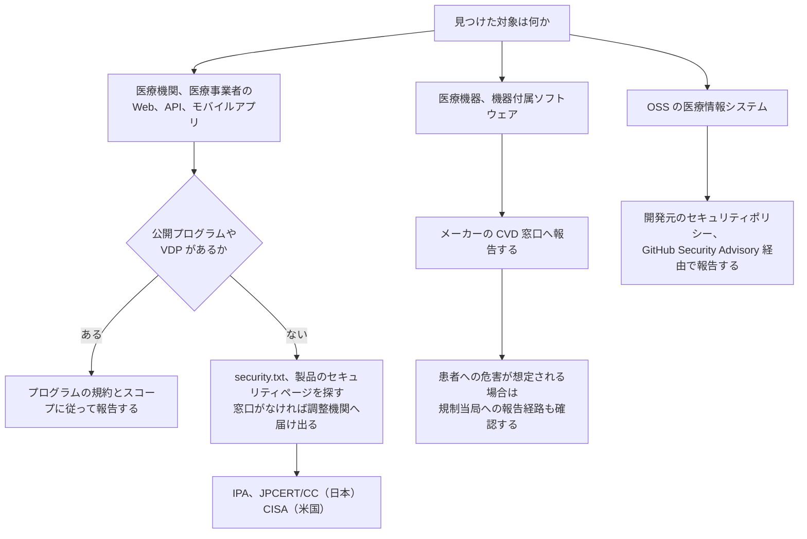
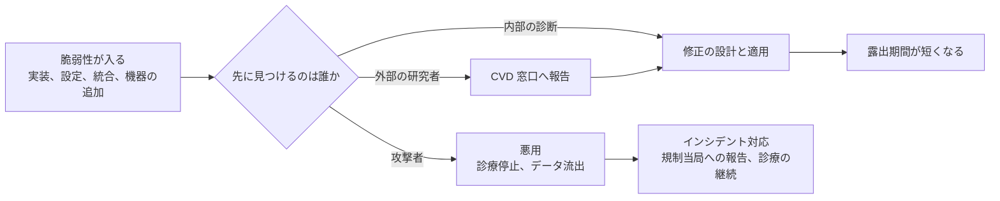

# 🎯 Bug Bounty × 医療、ヘルスケア

バグバウンティと脆弱性開示（VDP、CVD）が、医療分野でどこまで使えるかをまとめる。
一般の Web サービスと違うのは、報告する相手と、触れてよい対象の線引きである。
患者が接続された機器や、実在の診療データが載った本番系は、報奨金の有無にかかわらず検証の対象外になる。
その線を引いたうえで、患者ポータル、オンライン診療、医療 SaaS、機器のクラウド側といった資産は、通常の Web 標的と同じ手法で検証できる。
海外では、外部の研究者による報告を防御の一層として制度に組み込む動きが進んでおり、その位置づけは[バグハンターとサイバー防衛](#バグハンターとサイバー防衛)にまとめる。

> [!NOTE]
> **表記ルール**：本ページでは、**事実**（一次情報で確認できる内容。出典を併記する）、**報道ベース**（報道や第三者の集計のみで確認でき、当事者の公表資料では裏付けが取れていない内容）、**分析**（筆者の解釈）を書き分ける。
> 出典は、当事者の公表資料、行政文書、CVE、ベンダアドバイザリなどの一次情報を優先して示す。

> [!WARNING]
> スコープに明記されていない資産への検証は行わない。
> 稼働中の医療情報システムと医療機器に対する無許可の検証は、診療の停止と患者への危害につながりうる。
> 機器を対象とする場合は、[医療機器の検証手法](../../technology/medical-devices/testing-methodology.md)の前提条件を先に満たす。

---

## 一般の Web 標的との違い

| 論点 | 医療標的での現れ方 |
|---|---|
| 検証してよい対象 | 患者向けの公開サービスと管理系に限られる。稼働中の機器と実患者データを含む本番系は、スコープに入っていても実質的に触れない |
| 副作用の重さ | ポートスキャンや自動クロールが機器やレガシー連携の応答停止を招く。停止が診療の判断に直結する |
| PoC の作り方 | 他人の診療情報を取得して証拠にできない。自分のテストアカウント間で権限違反を示す形に組み立てる |
| 修正までの期間 | 機器やプログラム医療機器では、修正に薬事上の手続きと検証が必要になり、一般的なソフトウェアより長くなる |
| 報告先 | プログラムの窓口だけでなく、メーカーの CVD 窓口、調整機関、規制当局が関わる |
| 認可要件の複雑さ | 患者本人、家族、担当医、他院、保険者が同じシステムを使う。権限モデルの複雑さがそのまま脆弱性になる（[医療系 Web アプリのセキュリティ](../../technology/web-security/)） |

**分析**：医療標的では、脆弱性を見つける難易度より、見つけたあとに誰へどう渡すかの設計が結果を左右する。
窓口のない相手に報告すると、修正されないまま情報だけが手元に残る。

---

## 報告経路の分岐

対象の種類によって、報告先と手続きが変わる。

日本の窓口は、[IPA の脆弱性関連情報の届出受付](https://www.ipa.go.jp/security/todokede/vuln/uketsuke.html)である。
ソフトウェア製品とウェブアプリケーションの届出を受け付け、[情報セキュリティ早期警戒パートナーシップガイドライン](https://www.ipa.go.jp/security/renkei/rk20250909.html)に沿って IPA と JPCERT/CC が調整を行う（事実、出典：IPA）。
米国の医療機器については、メーカーの CVD 窓口に加えて [CISA](https://myservices.cisa.gov/irf) が調整に入る。

---

## バグハンターとサイバー防衛

バグハンターの成果物は、報告書ではなく、塞がれた穴である。
報告先が一企業でも、塞がれる対象は、その企業を経由して患者と診療にたどり着く経路である。
海外では、この働きを個人の善意ではなく制度の一部として扱う動きが進み、法令、政府の指令、分野別のガイダンスに書き込まれている。

### 「能動的サイバー防御」が指すもの

「能動的サイバー防御（active cyber defence）」という語は、二つの異なるものを指して使われる。

一つは、防御側が先回りして穴を潰す取り組みである。
英国 NCSC の Active Cyber Defence は、政府が無償で提供する防御サービス群の名称であり、Vulnerability Disclosure がその構成要素として並んでいる（事実、出典：[NCSC](https://www.ncsc.gov.uk/section/active-cyber-defence/services)）。
NCSC は ACD の目標を "Protect the majority of people in the UK from the majority of the harm caused by the majority of the cyber attacks the majority of the time" と述べている（事実、出典：[NCSC](https://www.ncsc.gov.uk/section/active-cyber-defence/introduction)）。

もう一つは、攻撃基盤への侵入と無害化である。
これは法的権限を持つ政府機関の作用であり、民間の研究者が担う領域ではない。

**分析**：バグハンターの活動は前者に属する。
自分の側の穴を先に見つけて塞ぐ行為であって、攻撃者の資産に手を出す行為ではない。
この区別を曖昧にしたまま「攻めの防御」と語ると、どこまで触れてよいかという交戦規則の議論が成立しなくなる。

### 制度が研究者を防衛の担い手として位置づけた経緯

| 制度、文書 | 時期 | 研究者に関する内容 |
|---|---|---|
| [米国防総省 VDP（DC3 が運営）](https://www.dc3.mil/Missions/Vulnerability-Disclosure/Vulnerability-Disclosure-Program-VDP/) | 2016 年〜 | 外部公開資産で 16,000 件超の脆弱性を受領し、緩和まで追跡したと記載。DC3 は VDP を、外部攻撃面に対する "hacker's view" を得る費用対効果の高い手段と説明する。2022 年の試行を経て、防衛産業基盤（DIB）向けにも展開 |
| [CISA BOD 20-01](https://www.cisa.gov/news-events/directives/bod-20-01-develop-and-publish-vulnerability-disclosure-policy) | 2020 年 9 月 | 米国の連邦民生行政機関（FCEB）全機関に、VDP の策定と公開を義務付けた。善意の脆弱性調査を歓迎し許可する旨を明記させ、インターネットから到達できる全資産をスコープに含めることを求める |
| [CISA VDP Platform](https://www.cisa.gov/resources-tools/services/vulnerability-disclosure-policy-vdp-platform) | 2021 年 7 月 | BOD 20-01 の実装として、各機関が研究者からの報告を受け取る共通基盤を CISA が提供する |
| [米 DOJ の CFAA 訴追方針](https://www.justice.gov/archives/opa/pr/department-justice-announces-new-policy-charging-cases-under-computer-fraud-and-abuse-act) | 2022 年 5 月 | 善意のセキュリティ調査（good-faith security research）を CFAA で訴追しない方針を初めて明文化した。個人や公衆への危害を避ける形で行われ、得た情報が対象の安全向上に用いられることを条件とする |
| [EU NIS2 指令 第 12 条](https://eur-lex.europa.eu/legal-content/EN/TXT/PDF/?uri=CELEX%3A32022L2555) | 2022 年 12 月 | 加盟国に CVD の国内方針の策定と公表を求め（期限 2024 年 10 月 17 日）、ENISA が [European Vulnerability Database](https://euvd.enisa.europa.eu/) を運用する。医療提供者は NIS2 の対象分野に含まれる |
| [ベルギー CCB の CVD 制度](https://ccb.belgium.be/regulation/cvdp) | 2023 年 2 月〜 | 対象組織が CVD ポリシーやバグバウンティを持たない場合でも、条件を満たす脆弱性の調査と報告を合法とする枠組み。条件は、詐欺的意図と悪意がないこと、行為が必要かつ比例的な範囲にとどまること、当該組織と CCB の双方へ報告することである |
| [EU サイバーレジリエンス法（規則 (EU) 2024/2847）](https://eur-lex.europa.eu/eli/reg/2024/2847/oj/eng) | 2024 年 12 月発効 | 製造者に脆弱性取扱いの要求（附属書 I）を課す。悪用が確認された脆弱性は 24 時間以内に早期警告、72 時間以内に通知、修正提供後 14 日以内に最終報告。報告基盤 Single Reporting Platform の適用開始は 2026 年 9 月 11 日（出典：[欧州委員会](https://digital-strategy.ec.europa.eu/en/policies/cra-reporting)） |
| [CISA ほかの共同ガイダンス](https://www.cisa.gov/resources-tools/resources/establishing-coordinated-vulnerability-disclosure-program-work-security-researchers) | 2026 年 7 月 | CISA、NSA、JPCERT/CC、NCSC-NL、NCSC-UK が共同で、外部研究者と協働する CVD プログラムの設計手順を示した。VDP の明文化、トリアージ、修正、CVE 採番までを一連の手続きとして扱う |

医療機器は、EU では CRA ではなく医療機器規則（MDR、規則 (EU) 2017/745）と体外診断用医療機器規則（IVDR、規則 (EU) 2017/746）の側で扱われ、CRA の適用範囲から除かれている（事実、出典：[EUR-Lex](https://eur-lex.europa.eu/EN/legal-content/summary/horizontal-cybersecurity-requirements-for-products-with-digital-elements-cyber-resilience-act.html)）。
医療分野に固有の位置づけとしては、次がある。

- **米 FDA**：FD&C Act 第 524B 条が、Cyber Device の市販前提出に、第三者からの報告を扱う調整型の脆弱性開示を含む計画を求める（後述の[規制側から見た脆弱性開示](#規制側から見た脆弱性開示)）。
- **米 HHS の HPH Cybersecurity Performance Goals**：Enhanced Goals に「Third Party Vulnerability Disclosure」と「Cybersecurity Testing」が置かれている（事実、出典：[HHS](https://hhscyber.hhs.gov/cybersecurity-performance-goals.html)）。任意の目標群であり、義務ではない。
- **I Am The Cavalry の Hippocratic Oath for Connected Medical Devices**：2016 年 1 月に公開された五つの能力の第二に Third-Party Collaboration を置き、"Invite disclosure of potential safety or security issues, reported in good faith" と記す（事実、出典：[I Am The Cavalry](https://iamthecavalry.org/issues/medical/oath/)）。
- **Biohacking Village（DEF CON）**：FDA との連携のもと #WeHeartHackers を掲げ、"Working with the FDA to improve medical device security through coordinated disclosure" と説明する（事実、出典：[Biohacking Village](https://villageb.io/)）。

**分析**：これらに共通するのは、研究者を歓迎する姿勢の表明ではなく、報告を受け取ってから修正が配布されるまでの手順を組織側に書かせている点である。
研究者の側から見れば、報告先の制度がどの段階にあるかで、報告後に何が起きるかが決まる。

### 攻撃者視点が防御に足すもの

脆弱性は、混入してから修正が適用されるまでのあいだ、露出したままになる。
誰が先に見つけるかで、その先の分岐が変わる。

**分析**：内部の点検は、資産台帳に載っている対象を、想定した経路でたどる。
攻撃者は、台帳から漏れた資産と、想定していない経路を使う。
外部の研究者が埋めるのはこの差であり、DC3 が VDP を "hacker's view of its external attack surface" と説明するのは、この差を指している。

医療で台帳から漏れやすいのは、次のような資産である。

- 統合や事業譲渡の前に運用していた旧ドメイン、旧患者ポータル
- 機器ベンダが保守用に置いた管理画面とリモート接続
- 研究部門や個別の診療科が独自に立てた検体管理、治験系のアプリケーション
- 印刷用画面、PDF 生成、通知メールのように、画面と別の経路で同じデータを出す機能

### 律する責任

攻撃側に近い技術と視点を扱う以上、制約は外から与えられる前に自分で置く必要がある。

- **法的保護は自動では付かない**：米 DOJ の方針は連邦検察の訴追裁量に関するものであり、民事上の請求や州法、各国法を排除しない。ベルギーのように条件付きで合法化した国もあるが、条件を外れれば保護は及ばない。
- **医療では危害の可能性が制約を強める**：DOJ が善意の要件として挙げる「個人や公衆への危害を避ける形で行うこと」は、医療標的では、稼働中の機器と実患者データを含む本番系から手を引くことを実質的に意味する。
- **検証環境を自分で用意する**：メーカー提供のシミュレータ、中古機材、[Biohacking Village の Device Lab](../../reference/labs-communities/biohacking-village.md) のように、患者から切り離された環境を優先する。
- **報告後の期間も自分の責任範囲に含める**：修正が配布されるまでのあいだ、手元の再現手順は攻撃に使える情報である。保管期間と保管場所を、報告時点で決めておく。

具体的な行動規範は、後述の[医療標的での交戦規則](#医療標的での交戦規則)に置く。

---

## プラットフォームが医療向けに掲げている内容

主要なバグバウンティプラットフォームは、医療を業種別のソリューションとして扱っている。
以下は各社の公開ページに記載されている内容であり、第三者が検証した数値ではない（事実、出典：各社サイト）。

| プラットフォーム | 医療向けページの記載 | 名前が挙がっている医療系の顧客 |
|---|---|---|
| [HackerOne](https://www.hackerone.com/solutions/healthcare) | コード監査、バグバウンティ、ペネトレーションテスト、AI レッドチーミングを、PHI、PII、医療研究データの保護に用いると記載。研究者コミュニティを約 200 万人と記載 | Flo Health |
| [Bugcrowd](https://www.bugcrowd.com/solutions/healthcare/) | バグバウンティ、ペネトレーションテスト、脆弱性開示、攻撃対象領域管理に加え、医療機器を対象とした IoT ペンテストを提供と記載。HIPAA への対応に言及 | Redox |
| [Intigriti](https://www.intigriti.com/solutions/healthcare) | バグバウンティ、VDP、PTaaS、ライブハッキングイベントを提供と記載。対象領域として電子カルテ、接続された医療機器、患者ポータルと遠隔医療、クラウド診断、レガシーの臨床基盤を挙げる。HIPAA、NEN7510、NIS2、GDPR などへの対応に言及。登録ハッカーを 150,000 人以上と記載 | Nexuzhealth、UZ Leuven、Universitäts Spital Zürich、Ada、Shop Apotheke |

HackerOne の医療ページは、医療のデータ侵害の平均コストを 1,093 万ドル、全業種平均の約 2.5 倍と記載している。
この数値の原典は IBM の年次調査であり、本リポジトリでは原典を確認していない（未確認）。

**分析**：欧州のプラットフォームでは、大学病院（UZ Leuven、Universitäts Spital Zürich）や医療 SaaS が実名で挙がっている。
医療機関そのものがプログラムを持つ形は、欧州で先行している。
国内の医療機関、医療 SaaS が運用する公開バグバウンティプログラムは、本ページの執筆時点では確認できなかった（未確認）。

---

## プラットフォーム運営視点からのサイバー防衛

三社とも、単発の診断の置き換えではなく、防御の一層として継続的に働く仕組みとして自社を説明している。
以下は各社の公開ページの記載であり、第三者が検証した内容ではない（事実、出典：各社サイト）。

| プラットフォーム | 掲げ方 | 公開ページの記載 |
|---|---|---|
| [HackerOne](https://www.hackerone.com/solutions/healthcare) | 多層防御の一部として、攻撃に先んじて潰す | 医療ページで "finds, prioritizes, and helps remediate these threats before an attack can ever occur"、"always-on vulnerability disclosure, from report to remediated risk"、"Pentest-grade signal across your attack surface, continuously" と記載。[ブログの分類](https://www.hackerone.com/blog)でも Defense in Depth と Offensive Security を並置している |
| [Bugcrowd](https://www.bugcrowd.com/solutions/healthcare/) | プロアクティブな発見 | 会社紹介で "proactively keep your digital business one step ahead of cyberthreats" を掲げる。医療ページでは "Identify hidden, critical vulnerabilities" とし、顧客の言として "The advantage of having crowdsourced security as part of our program is the continuous testing. Security researchers can actually spend time testing to find critical flaws, rather than being time bound in a traditional pen test." を掲載 |
| [Intigriti](https://www.intigriti.com/solutions/healthcare) | 継続的な評価 | 医療ページで "Continuous care for clinical systems"、"uncover critical vulnerabilities before exploitation" と記載。対象として電子カルテ、接続された医療機器、患者ポータルと遠隔医療、クラウド診断を挙げる |

**分析**：三社の主張は「点の診断から継続する評価へ」で一致しており、差は強調点にとどまる。
医療では、この継続性が二つの意味を持つ。
医療 DX の進行とともに攻撃面が増え続けることと、診療を止められないために修正の適用が遅れ、露出期間が長くなることである。
後者がある以上、報告を受け取る速さより、受け取ったあとに緩和策を現場へ届ける速さが結果を決める。
プラットフォームが担うのは前者までであり、後者は受け入れ側の設計に残る。

---

## 規制側から見た脆弱性開示

バグバウンティの前段にある CVD は、医療機器では規制上の要求になっている。

- **米国（FD&C Act 第 524B 条）**：Cyber Device の市販前提出において、市販後の脆弱性を監視、特定、対処する計画の提出が求められ、この計画には外部の研究者を含む第三者からの報告を扱う調整型の脆弱性開示が含まれる（事実、出典：[FDA Medical Device Cybersecurity](https://www.fda.gov/medical-devices/digital-health-center-excellence/cybersecurity)、詳細は[海外のガイドライン、法規制](../../guidelines/global.md)）。
- **メーカーの CVD ポリシー**：[Philips の Coordinated Vulnerability Disclosure](https://www.philips.com/a-w/security/coordinated-vulnerability-disclosure.html) は、研究者と顧客による検証を歓迎する一方、ソーシャルエンジニアリング、バックドアの設置、必要範囲を超えた脆弱性の利用、システム上のデータの複製、改変、削除を認めないと定めている。報告者を掲載する [Hall of Honors](https://www.philips.com/a-w/security/coordinated-vulnerability-disclosure/hall-of-honors.html) を公開している（事実、出典：Philips）。
- **日本**：医療分野に特化した報奨制度はない。ウェブアプリケーションとソフトウェア製品の脆弱性は、早期警戒パートナーシップの届出制度で扱われる（事実、出典：IPA）。

**分析**：報奨金の有無より、報告を受け取る窓口と、受け取ったあとに修正へ回す手順が先に要る。
524B が求めているのもこの部分であり、プラットフォームの利用はその実装手段のひとつにすぎない。

---

## 医療標的での交戦規則

プログラムの規約に加えて、次を自分の側の制約として置く。

- **実在の診療データに触れたら、そこで止める**：認可不備を確認できた時点で、追加の取得を行わない。取得済みのデータは保存せず、報告に含めない。スクリーンショットは自分のテストアカウントで再現したものに差し替える。
- **検証は自分が作成した複数アカウント間で行う**：他人の患者 ID を総当たりして範囲を確認しない。1 件の権限違反を示せば、影響の説明には足りる。
- **自動スキャンとブルートフォースを既定で止める**：レガシー連携や機器の Web UI は、通常の負荷で応答を失うことがある（[医療機器の検証手法](../../technology/medical-devices/testing-methodology.md)）。
- **ソーシャルエンジニアリングと物理侵入を行わない**：医療機関では、これらが診療の妨害に直結する。メーカーの CVD ポリシーでも明示的に禁じられている。
- **開示までの猶予を、90 日固定で当てはめない**：機器やプログラム医療機器では、修正の配布に薬事上の手続きが伴う。患者へのリスクと修正の所要期間の両方で期間を決める。
- **報告書に患者安全の観点を書く**：CVSS のスコアだけでは、可用性と完全性の侵害が診療に与える影響を表現できない。悪用に必要な条件と、臨床での現実的な影響を併記する。

---

## 出やすい脆弱性クラスと、防御側の対応

攻撃手法は、検知と緩和策とあわせて記述する。

| クラス | 医療での現れ方 | 防御側の対応 |
|---|---|---|
| 認可不備（IDOR） | 患者 ID、診察券番号、予約番号が連番や推測可能な値で、参照先の切り替えで他患者の記録に到達する | 画面ごとではなく、データ取得層で認可を判定する。1 アカウントからの患者横断参照を監査ログで検知する |
| 代理アクセスの権限委譲 | 家族や保護者の代理ログイン、後見の設定が、委譲の解除後も残る | 委譲を期限付きの明示的な関係として持ち、解除時にセッションとトークンを失効させる |
| テナント境界 | 複数の医療機関が同居する医療 SaaS で、施設 ID の付け替えにより他施設のデータへ到達する | テナント識別子をリクエストの入力ではなくセッションから解決する。跨ぎアクセスをアラート対象にする |
| API のスコープ設計 | FHIR、HL7 連携の API が、画面より広い範囲を返す。スコープが患者単位で絞られていない | API 側でも患者単位の認可を行う。画面の制限を認可と見なさない |
| 印刷、出力経路 | 印刷用画面、PDF 生成、CSV 出力、通知メールに認可の適用が漏れる | 出力生成も同じ認可経路を通す。生成物の URL を推測可能な値にしない |
| レガシー連携 | DICOM、HL7 v2 のエンドポイントが認証なしで公開される（[PACS / DICOM のセキュリティ](../../technology/medical-devices/pacs-dicom.md)、[HL7 v2 と FHIR の攻撃面](../../technology/web-security/hl7-fhir.md)） | 外部からの到達性を遮断し、接続元を限定する。公開範囲を定期的に外部から確認する |
| LLM を組み込んだ機能 | 問診票、紹介状の OCR テキスト、カルテ本文が LLM の入力になり、間接プロンプトインジェクションの経路になる（[AX：医療における AI のセキュリティ](../../technology/dx-ax/ai-security.md)） | モデルの出力を権限の判断に使わない。エージェントの操作に人手の確認を挟む |

---

## 実機に触れられる場

医療機器を合法的に検証できる機会は限られる。
DEF CON の [Biohacking Village](https://villageb.io/) は、メーカーが持ち込んだ実機を、CVD の合意に署名した研究者が検証できる Device Lab を運営している。
DEF CON 34 の Device Lab では、9 社の 19 機器が研究対象として公開された（事実、出典：[Biohacking Village](https://www.villageb.io/DeviceList)）。
国内では、同じ運営が CODE BLUE の併設ビレッジとして 2024 年から Device Lab と CTF を開催している（事実、出典：[CODE BLUE 2024 Biohacking Village](https://archive.codeblue.jp/2024/program/contests-workshops/biohackingvillage/)）。
参加の前提と、発見から開示までの流れは、[Biohacking Village（DEF CON、CODE BLUE）](../../reference/labs-communities/biohacking-village.md)にまとめている。

---

## 医療機関、事業者が VDP を始めるときの順序

報奨金の設定は最後に来る。
先に受け皿を作らないと、報告が滞留して開示だけが進む。

1. **受け皿を決める**：報告を読み、再現し、修正へ回す担当と、一次応答の期限を決める。委託ベンダの担当範囲も含めて決める。
2. **窓口を公開する**：`security.txt` と製品のセキュリティページを置き、報告に必要な情報と暗号鍵を示す。
3. **スコープと禁止事項を書く**：検証してよい資産、実患者データを含む本番系の除外、負荷試験とソーシャルエンジニアリングの禁止、患者データに触れた場合の中止手順を明記する。
4. **セーフハーバーを明記する**：規約の範囲内で行われた検証に対して、法的措置を取らないことを書く。ここが曖昧だと報告は届かない。
5. **規制上の報告経路とつなぐ**：患者への危害が想定される事象では、社内の報告手順と規制当局への報告要件を接続する。
6. **報奨を検討する**：VDP を運用できてから、有償プログラムやプラットフォームの利用を検討する。

---

## 関連ページ

- [外部から見た自組織の攻撃面](../attack-surface.md)：受け取る側が、自分で数えられる範囲
- [医療の脅威モデリング](../threat-modeling.md)：報告された経路を、設計の側に戻す
- [医療系 Web アプリケーションのセキュリティ](../../technology/web-security/)
- [患者用ポータルで狙われやすい脆弱性](../../technology/web-security/patient-portal.md)
- [医療機器の検証手法](../../technology/medical-devices/testing-methodology.md)
- [OSS 医療情報システムの脆弱性](../../technology/oss-vulnerabilities/)
- [ガイドラインと法規制](../../guidelines/)
- [ラボ、コミュニティ](../../reference/labs-communities/)
- [Biohacking Village（DEF CON、CODE BLUE）](../../reference/labs-communities/biohacking-village.md)

## 参考リンク

| リンク | 内容 |
|---|---|
| [IPA 脆弱性関連情報の届出受付](https://www.ipa.go.jp/security/todokede/vuln/uketsuke.html) | 国内の届出制度の窓口 |
| [JPCERT/CC 脆弱性関連情報の取扱い](https://www.jpcert.or.jp/vh/) | 調整機関としての手続き |
| [CISA Report a Vulnerability](https://myservices.cisa.gov/irf) | 米国の調整窓口 |
| [Establishing a Coordinated Vulnerability Disclosure Program to Work With Security Researchers](https://www.cisa.gov/resources-tools/resources/establishing-coordinated-vulnerability-disclosure-program-work-security-researchers) | CISA、NSA、JPCERT/CC、NCSC-NL、NCSC-UK の共同ガイダンス（2026 年 7 月） |
| [CISA BOD 20-01](https://www.cisa.gov/news-events/directives/bod-20-01-develop-and-publish-vulnerability-disclosure-policy) | 米連邦機関に VDP を義務付けた指令 |
| [DC3 Vulnerability Disclosure Program](https://www.dc3.mil/Missions/Vulnerability-Disclosure/Vulnerability-Disclosure-Program-VDP/) | 米国防総省の VDP と防衛産業基盤向けの展開 |
| [DOJ CFAA Charging Policy（2022 年）](https://www.justice.gov/archives/opa/pr/department-justice-announces-new-policy-charging-cases-under-computer-fraud-and-abuse-act) | 善意のセキュリティ調査を訴追対象外とする方針 |
| [NCSC Active Cyber Defence](https://www.ncsc.gov.uk/section/active-cyber-defence/services) | 英国政府が無償提供する防御サービス群。Vulnerability Disclosure を含む |
| [CCB Coordinated Vulnerability Disclosure（ベルギー）](https://ccb.belgium.be/regulation/cvdp) | 条件付きで脆弱性調査を合法とする国内制度 |
| [European Vulnerability Database（ENISA）](https://euvd.enisa.europa.eu/) | NIS2 第 12 条に基づく EU の脆弱性データベース |
| [Cyber Resilience Act の報告義務](https://digital-strategy.ec.europa.eu/en/policies/cra-reporting) | 悪用が確認された脆弱性の報告期限と報告基盤 |
| [HPH Cybersecurity Performance Goals（HHS）](https://hhscyber.hhs.gov/cybersecurity-performance-goals.html) | 米国の医療分野向け目標群。Enhanced Goals に脆弱性開示を含む |
| [Hippocratic Oath for Connected Medical Devices](https://iamthecavalry.org/issues/medical/oath/) | 接続された医療機器に求める五つの能力 |
| ISO/IEC 29147（Vulnerability disclosure） | 脆弱性開示の手続きを定めた国際規格 |
| ISO/IEC 30111（Vulnerability handling processes） | 受け取った脆弱性を処理する社内プロセスの国際規格 |
| [国際的なバグバウンティ制度の活用状況について（2025 年）](https://scgajge12.hatenablog.com/entry/bugbountyplatform_2025) | プラットフォームごとの運用状況の整理 |

---

[トップへ](../../../README.md)
