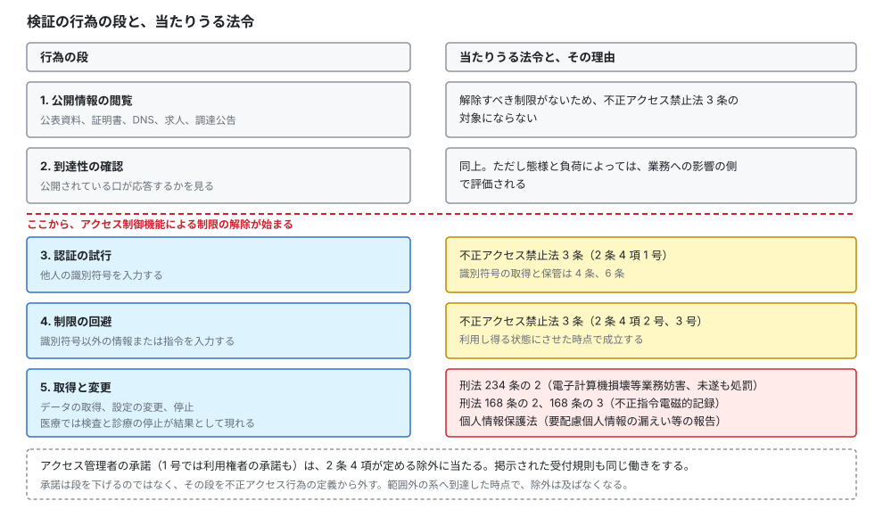
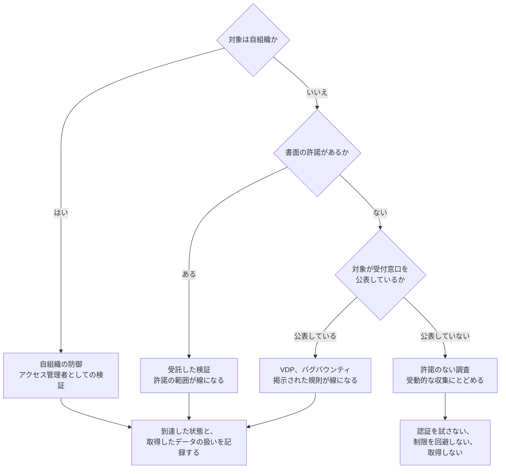

# ⚖️ 検証と調査の法的境界

自組織の攻撃面を測る、診断を受注する、公開されているポータルの欠陥を報告する。
この三つは、やっている操作が同じでも、当たる法律が変わる。
違いを決めるのは操作の種類ではなく、誰の許諾のもとで、どこまでの状態に到達したかである。

本ページは、その線がどこに引かれているかを条文の側から整理する。
検証の進め方は[診断とペネトレーションテスト](pentest/)、収集の範囲は[医療機関に対する OSINT](osint.md)、報告の経路は[Bug Bounty × 医療、ヘルスケア](bug-bounty/)で扱う。

> [!NOTE]
> **表記ルール**：本ページでは、**事実**（一次情報で確認できる内容。出典を併記する）と、**分析**（筆者の解釈）を書き分ける。

> [!IMPORTANT]
> 本ページは条文と公表資料の要約であり、法的助言ではない。
> 個別の案件は、契約と事実関係によって結論が変わる。
> 実施の可否は、依頼元の法務部門または弁護士に確認したうえで決める。

---

## 行為の段階と、法が当たる位置

検証で行う操作を、外側から順に並べる。
どの段で線を越えるかは、対象にアクセス制御機能があるか、許諾があるか、結果として何が起きたかで決まる。

  

**分析**：段が上がるほど罰則が重くなるのではない。
第 5 段で診療が止まれば、不正アクセス禁止法の罰則より業務妨害の側が重くなる。
段は「関わる法律が増えていく順序」を示すものであり、危険度の順序ではない。

---

## 不正アクセス禁止法が禁じているもの

**事実**：不正アクセス行為の禁止等に関する法律（平成 11 年法律第 128 号）は、「不正アクセス行為」を 2 条 4 項で定義している。
1 号は、アクセス制御機能を有する電子計算機に、電気通信回線を通じて他人の識別符号を入力し、制限されている特定利用をし得る状態にさせる行為である。
2 号と 3 号は、識別符号以外の情報または指令を入力して、同じ状態にさせる行為である。
1 号は、アクセス管理者または当該識別符号に係る利用権者の承諾を得てする場合を除くと定めている。
2 号と 3 号は、アクセス管理者の承諾を得てする場合を除くと定めている。
出典：[不正アクセス行為の禁止等に関する法律](https://laws.e-gov.go.jp/law/411AC0000000128)（e-Gov 法令検索）

この定義から、三つの構造が読み取れる。

**アクセス制御機能があることが前提になる**：認証のない公開ページを閲覧しても、解除すべき制限がないため 1 号にも 2 号にも当たらない。

**「利用し得る状態にさせる」時点で成立する**：ログインに成功した後に何も操作しなくても、状態を作った時点で構成要件を満たす。

**承諾が除外事由として条文に書かれている**：許諾は情状の問題ではなく、そもそも不正アクセス行為に当たらないという扱いである。
誰の承諾かも条文が特定しており、1 号ではアクセス管理者または利用権者、2 号ではアクセス管理者である。

### 禁止行為と罰則

**事実**：同法の禁止行為と罰則は次のとおりである。

| 条 | 禁止される行為 | 罰則 |
|---|---|---|
| 3 条 | 不正アクセス行為 | 3 年以下の拘禁刑または 100 万円以下の罰金（11 条） |
| 4 条 | 不正アクセス行為（2 条 4 項 1 号）の用に供する目的での、他人の識別符号の取得 | 1 年以下の拘禁刑または 50 万円以下の罰金（12 条 1 号） |
| 5 条 | 業務その他正当な理由による場合を除く、他人の識別符号の第三者への提供 | 相手方に不正アクセス行為の目的があると知っていた場合は 1 年以下の拘禁刑または 50 万円以下の罰金（12 条 2 号）、知らなかった場合は 30 万円以下の罰金（13 条） |
| 6 条 | 不正アクセス行為の用に供する目的での、不正に取得された他人の識別符号の保管 | 1 年以下の拘禁刑または 50 万円以下の罰金（12 条 3 号） |
| 7 条 | アクセス管理者になりすまして識別符号の入力を求める行為（フィッシング） | 1 年以下の拘禁刑または 50 万円以下の罰金（12 条 4 号） |

出典：[同法](https://laws.e-gov.go.jp/law/411AC0000000128) 3 条から 7 条、11 条から 13 条

**分析**：検証を行う側が見落としやすいのは 4 条と 6 条である。
漏えいした資格情報の一覧を入手して手元に置く行為は、認証を試みる前の段階で条文に触れうる。
外部に流出した自組織の資格情報を確認する作業でも、取得と保管の目的を「自組織の防御」と説明できる形にしておく必要がある（[外に出た認証情報](../technology/credential-exposure.md)）。

**事実**：同法 8 条は、アクセス管理者に対し、識別符号の適正な管理、アクセス制御機能の有効性の検証、必要な場合の措置を努力義務として課している。
9 条は、不正アクセス行為を受けたアクセス管理者から援助を受けたい旨の申出があり、都道府県公安委員会がその申出を相当と認めるときは、必要な資料の提供、助言、指導その他の援助を行うと定めている。
10 条は、国家公安委員会、総務大臣、経済産業大臣が、不正アクセス行為の発生状況とアクセス制御機能に関する技術の研究開発の状況を、毎年少なくとも 1 回公表すると定めている。
出典：[同法](https://laws.e-gov.go.jp/law/411AC0000000128) 8 条から 10 条、公表資料は[警察庁 サイバー空間をめぐる脅威の情勢等](https://www.npa.go.jp/publications/statistics/cybersecurity/index.html)

**分析**：8 条は、防御側の検証（脆弱性診断や有効性の確認）を、法が想定していることを示す条文として読める。
医療機関が自組織に対して行う検証は、この努力義務を果たす手段の側に位置づく。

---

## 同時に検討する四つの条文

同法に当たらない行為でも、別の条文が当たる。
検証の設計では、次の四つを同時に見る。

### 刑法 168 条の 2、168 条の 3

**事実**：刑法 168 条の 2 は、正当な理由がないのに、人の電子計算機における実行の用に供する目的で、その意図に沿うべき動作をさせず、または意図に反する動作をさせるべき不正な指令を与える電磁的記録を作成し、または提供する行為を、3 年以下の拘禁刑または 50 万円以下の罰金としている。
168 条の 3 は、同じ目的での取得と保管を、2 年以下の拘禁刑または 30 万円以下の罰金としている。
出典：[刑法](https://laws.e-gov.go.jp/law/140AC0000000045) 168 条の 2、168 条の 3

**事実**：この規定の適用範囲について、最高裁判所第一小法廷は 2022 年 1 月 20 日、閲覧者の端末で暗号資産の採掘を行うプログラムコードをウェブサイトに設置した事案について、原判決を破棄し、検察官の控訴を棄却した（令和 2 年（あ）第 457 号 不正指令電磁的記録保管被告事件）。
被告人を無罪とした第一審判決が是認された形である。
判決は、条文の要件を反意図性（一般の使用者が認識すべき動作と実際の動作が異なるか）と不正性（社会的に許容し得ないか）に分けたうえで、本件のプログラムコードについて、反意図性は認められるが不正性は認められないとした。
不正性の判断では、動作の内容に加え、動作が電子計算機の機能や情報処理に与える影響の有無と程度、利用方法を考慮するとしている。
本件では、消費電力の増加と処理速度の低下が閲覧者の気付く程度ではなかったこと、社会的に受容されている広告表示プログラムと比べて影響に有意な差異が認められないことを挙げている。
出典：[判決文（PDF）](https://www.courts.go.jp/assets/hanrei/hanrei-pdf-90869.pdf)（最高裁判所）

**分析**：この枠組みは、診断側にも影響する。
検証用のコードや、報告に添える再現手順が「不正な指令を与える電磁的記録」に当たるかは、反意図性と不正性の二段階で評価される。
許諾のある検証で、対象の管理者の意図に沿って動かすものであれば、反意図性の段階で外れる。
逆に、許諾の範囲を超えて第三者の端末で動くコードを配布した場合、不正性の評価に進む。
本リポジトリが実装コードやエクスプロイトを載せない方針を取っているのは、この評価を読み手の側に押しつけないためでもある。

### 刑法 234 条の 2

**事実**：電子計算機損壊等業務妨害罪は、人の業務に使用する電子計算機やその電磁的記録を損壊し、虚偽の情報や不正な指令を与え、その他の方法で使用目的に沿う動作をさせず業務を妨害した者を、5 年以下の拘禁刑または 100 万円以下の罰金としている。
未遂も処罰される。
出典：[刑法](https://laws.e-gov.go.jp/law/140AC0000000045) 234 条の 2

**分析**：医療で最も重く効くのはこの条文である。
検証中に画像サーバや医療機器が応答しなくなり、検査や手術の予定が動けば、業務妨害の結果が現実に発生する。
許諾があれば構成要件の評価は変わるが、許諾の範囲を超えた操作で診療を止めた場合、不正アクセス禁止法の罰則より重い側に触れる。
医療機関に対する検証で、影響を与えうる手法を段階的に扱う理由は、ここにある（[診断とペネトレーションテスト](pentest/README.md#6-実施設計止められない環境でどう安全に測るか)）。

### 通信の秘密

**事実**：電気通信事業法 4 条は、電気通信事業者の取扱中に係る通信の秘密は侵してはならないと定め、電気通信事業に従事する者に対しては、在職中に取扱中の通信に関して知り得た他人の秘密を守る義務を課し、退職後も同様と定めている（同条 2 項）。
出典：[電気通信事業法](https://laws.e-gov.go.jp/law/359AC0000000086) 4 条

**分析**：院内ネットワークで通信を取得する検証（パケットキャプチャ、中間者による復号）は、自組織の設備であっても、経路上に他者の通信が乗る場合に検討が要る。
実務では、取得範囲を対象システムの通信に限定し、患者の診療情報が含まれる区間の扱いを事前に決めておく。

### 個人情報保護法

**分析**：検証の途中で実在する患者の情報に到達した場合、その時点から個人情報保護法の側の時計が動きうる。
医療情報は要配慮個人情報であり、漏えい等が発生し、または発生したおそれがある場合の報告義務が 1 件から生じる（[国内のガイドラインと法規制](../guidelines/japan.md#個人情報保護法と要配慮個人情報)）。
検証で「取れることを確認した」だけでも、取得した件数と保持の有無によっては、依頼元が報告の要否を判断する必要が出る。
だから検証計画では、到達を確認した時点で止める条件と、取得したデータの保管、返却、消去の手順を先に決める。

---

## 立場ごとに、線がどこに動くか

同じ操作でも、許諾の有無と範囲で扱いが変わる。
四つの立場に分けて整理する。

| 立場 | できること | 根拠 | 止まる点 |
|---|---|---|---|
| 自組織の防御 | アクセス管理者として、自らが管理する系への検証 | 2 条 4 項の除外はアクセス管理者の承諾を挙げている。8 条は有効性の検証を努力義務としている | 委託先が管理する系、共同利用先の系、クラウド事業者の基盤側 |
| 受託した検証 | 契約と実施計画に書かれた対象、期間、手法 | アクセス管理者の承諾 | 書かれていない対象。範囲外の系へ到達したら、そこで止めて報告する |
| VDP、バグバウンティ | 公表された規則の範囲での調査と報告 | 運営者が掲示した許諾 | 規則に書かれていない手法（サービス妨害、ソーシャルエンジニアリング、第三者アカウントへの到達） |
| 許諾のない調査 | 公開されている情報の閲覧、公表資料の収集 | 制限の解除を伴わない | 認証の試行、制限の回避、データの取得。到達性の確認も、対象の負荷と意図の説明可能性で判断する |

**分析**：実務で最も揉めるのは、二段目の「範囲外の系へ到達した」場合である。
医療機関の環境では、検証対象のシステムから、電子カルテや部門システムへ意図せず到達できてしまうことがある。
到達できた事実は成果として価値があるが、そこから先へ進むと許諾の外に出る。
計画の段階で「到達を確認したら止め、直ちに連絡する」を手順として書いておくと、判断を現場に委ねずに済む。

---

## 許諾の文面に何を書くか

許諾は、実施の前に書面で確定させる。
口頭の合意は、事故が起きた時点で存在しなかったことになる。

**発注側と受注側で確定させる事項**

| 項目 | 書く内容 |
|---|---|
| 対象 | ホスト名、IP、アプリケーション、アカウント。含まないものも列挙する |
| 期間 | 実施日時。診療への影響が小さい時間帯を明示する |
| 手法 | 使う手法と、使わない手法。サービス妨害、ソーシャルエンジニアリング、物理侵入の可否を個別に決める |
| 承諾者 | アクセス管理者が誰かを特定する。クラウドや委託先が管理する部分は、その事業者の規約と承諾を別に確認する |
| 到達時の扱い | 実データに到達した場合に止める条件、取得の可否、保管場所、消去の時期と方法 |
| 中止条件 | 診療への影響が出た場合の中止の基準と、その判断者 |
| 連絡 | 緊急時の連絡先を、双方向で、夜間休日を含めて確保する |
| 記録 | 実施記録の項目（起点、対象、時刻、操作、結果）と、提出先 |
| 報告後 | 報告書の取り扱い、公開の可否、公開までの期間 |

**分析**：医療で追加が要るのは「到達時の扱い」の行である。
一般的な事業会社の診断では、実データへの到達をもって深刻度を示すことが多い。
医療では、到達を示す証跡がそのまま要配慮個人情報になるため、証跡の残し方を先に決めないと、報告書そのものが漏えいの対象物になる。
実務では、患者を特定できる値を伏せた形の証跡と、伏せる前の値の保管場所を分ける。

### 受け付ける側が掲示する文面

医療機関や事業者が脆弱性の報告を受け付ける場合、報告者が読む位置に次を掲示する。

1. 対象に含まれるもの（ドメイン、アプリケーション、機器）と、含まれないもの
2. 認められる調査（例：自身のアカウントに対する認可の確認）と、認められない調査（例：他の患者のアカウントへの到達、負荷試験、物理侵入、職員への働きかけ）
3. 実データに到達した場合に取るべき行動（直ちに停止し、取得したデータを保持せず、連絡する）
4. 連絡先と、受領の応答を返す目安の期間
5. 掲示した範囲と手順に従った報告について、法的な措置を取らない旨
6. 公表の扱い（調整のうえで行う、修正までの期間の目安）

**分析**：5 の一文が抜けている窓口には、報告者が来ない。
報告する側は、報告した瞬間に「認証を試した記録」を自分から提出することになるため、掲示された許諾がないと動けない。
窓口を作ること自体より、この一文があるかどうかが、受け取れる件数を決める（[医療機関、事業者が VDP を始めるときの順序](bug-bounty/README.md#医療機関事業者が-vdp-を始めるときの順序)）。

---

## 制度が用意している経路

**事実**：脆弱性関連情報の届出は、経済産業省告示にもとづく「情報セキュリティ早期警戒パートナーシップ」として運用されている。
告示は、届出の受付機関として IPA を、製品開発者への連絡および公表に係る調整機関として JPCERT/CC を指定している。
ガイドラインが対象とする関係者は、発見者、IPA と JPCERT/CC、製品開発者、ウェブサイト運営者である。
出典：[脆弱性関連情報の届出受付](https://www.ipa.go.jp/security/todokede/vuln/uketsuke.html)（IPA）、[情報セキュリティ早期警戒パートナーシップガイドライン](https://www.ipa.go.jp/security/guide/vuln/partnership_guide.html)（IPA）

**分析**：この経路は、報告先が窓口を持たない場合に効く。
医療機関の多くは受付窓口を掲示していないため、直接連絡すると、受け取った側が「不正アクセスを受けた」と解釈して警察に相談する事態が起こりうる。
第三者機関を経由すると、報告者と運営者の間に手続きが挟まる。
ただし、この経路も、脆弱性を発見するに至った調査そのものを適法にするものではない。
発見の経緯が許諾の外にある場合、届け出た事実は経緯を消さない。

**事実**：国家サイバー統括室（NCO）は、サイバーセキュリティに関係する法令の適用関係を Q&A 形式で整理したハンドブックを公表している。
出典：[サイバーセキュリティ関係法令 Q&A ハンドブック](https://security-portal.cyber.go.jp/guidance/law-handbook/v2-index.html)（国家サイバー統括室）

---

## 国外の対象を扱うとき

**事実**：米国司法省は 2022 年 5 月 19 日、コンピュータ詐欺濫用防止法（CFAA）にもとづく訴追方針を改定し、善意のセキュリティ研究（good faith security research）に当たる行為を訴追の対象としない方針を示した。
Justice Manual 9-48.000 は、これを、セキュリティ上の欠陥または脆弱性の善意の試験、調査、修正のみを目的として計算機にアクセスする行為であって、個人または公衆への危害を避けるように行われ、得られた情報が当該計算機の属する機器やサービス、またはその利用者の安全性の向上に主として用いられるもの、と定義している。
同省は、脆弱性を不正な利益のために悪用する目的や、所有者を恐喝する目的で行われる調査は、善意には当たらないとしている。
出典：[Justice Manual 9-48.000 Computer Fraud and Abuse Act](https://www.justice.gov/jm/jm-9-48000-computer-fraud)、[Department of Justice Announces New Policy for Charging Cases under the Computer Fraud and Abuse Act](https://www.justice.gov/archives/opa/pr/department-justice-announces-new-policy-charging-cases-under-computer-fraud-and-abuse-act)（米国司法省）

**分析**：これは連邦の訴追方針であり、民事の請求や州法を排除するものではない。
また、日本から米国のサービスを対象に調査した場合、行為地は日本にあるため、国内法の評価は別に成立する。
プログラムの規則が米国法を前提に書かれていても、国内法の側の線は動かない。

**分析**：欧州では、脆弱性の調整開示（CVD）を国の方針として整備する動きがあり、対象国ごとに窓口と免責の扱いが異なる。
海外の医療機関や医療機器メーカーを対象にする場合、プログラムの規則と、対象国の制度の両方を確認する（[海外のガイドラインと法規制](../guidelines/global.md)）。

---

## 事故が起きたときの扱い

検証中に線を越えた、あるいは越えたかもしれない場合、扱いを誤ると、技術的な問題が組織間の問題になる。

1. 操作を止める。追加の確認のために繰り返さない
2. 何を、いつ、どの経路で行い、何が返ってきたかを記録する。記憶で再構成しない
3. 依頼元の責任者へ、時刻とともに報告する。判断を待たずに自分で対処しない
4. 取得したデータがある場合、保管場所を特定し、複製の有無を確認する
5. 依頼元が報告義務を判断できるよう、到達した範囲と件数を提示する
6. 事後に、計画のどの記述が判断を分けたかを確認し、次の計画に反映する

**分析**：3 を飛ばして自分で復旧しようとすると、証跡が上書きされ、後から「何が起きたか」を説明できなくなる。
検証者が最も価値を出せるのは、止めたあとに時系列を提出できることである（[ログと監視の設計](../technology/logging.md)）。

---

## 実務チェックリスト

**計画**
- [ ] アクセス管理者が誰かを、対象ごとに特定した
- [ ] クラウドや委託先が管理する範囲について、事業者側の規約と承諾を確認した
- [ ] 対象、期間、手法、除外を書面にし、双方が署名した
- [ ] 実データに到達した場合に止める条件を書いた
- [ ] 中止の判断者と、夜間休日を含む連絡先を確保した

**実施**
- [ ] 起点、対象、時刻、操作、結果の形で記録を残している
- [ ] 範囲外の系へ到達した時点で止め、報告する手順にしている
- [ ] 取得したデータの保管場所を限定し、複製を作っていない
- [ ] 患者を特定できる値を伏せた形で証跡を作っている

**報告と事後**
- [ ] 報告書の取り扱いと公開の可否を、事前の合意どおりにしている
- [ ] 取得したデータの消去を、時期と方法を決めて実施した
- [ ] 依頼元が報告義務を判断できる情報を提示した

**受け付ける側**
- [ ] 対象範囲、認められる調査、連絡先、法的措置を取らない旨を掲示した
- [ ] 実データに到達した報告者が取るべき行動を書いた
- [ ] 受領の応答を返す期間の目安を書いた

---

## 関連ページ

- [医療機関に対する OSINT](osint.md)：受動的な収集の範囲と、そこから先の線
- [外部から見た自組織の攻撃面](attack-surface.md)：測ってよい範囲の線引き
- [診断とペネトレーションテスト](pentest/)：実施設計と、止められない環境での進め方
- [Bug Bounty × 医療、ヘルスケア](bug-bounty/)：交戦規則と報告経路
- [外に出た認証情報](../technology/credential-exposure.md)：漏えい資格情報の取得と保管の扱い
- [国内のガイドラインと法規制](../guidelines/japan.md)：報告義務と期限
- [医療の倫理とセキュリティの倫理](../reference/ethics.md)：法が答えない範囲での判断
- [メーカー側の脆弱性受付と開示](../technology/medical-devices/psirt-cvd.md)：報告を受け取る側の手続き

---

## 一次情報

| 資料 | 発行元 |
|---|---|
| [不正アクセス行為の禁止等に関する法律](https://laws.e-gov.go.jp/law/411AC0000000128) | e-Gov 法令検索 |
| [刑法](https://laws.e-gov.go.jp/law/140AC0000000045) | e-Gov 法令検索 |
| [電気通信事業法](https://laws.e-gov.go.jp/law/359AC0000000086) | e-Gov 法令検索 |
| [個人情報の保護に関する法律](https://laws.e-gov.go.jp/law/415AC0000000057) | e-Gov 法令検索 |
| [令和 2 年（あ）第 457 号 判決文（PDF）](https://www.courts.go.jp/assets/hanrei/hanrei-pdf-90869.pdf) | 最高裁判所 |
| [サイバーセキュリティ関係法令 Q&A ハンドブック](https://security-portal.cyber.go.jp/guidance/law-handbook/v2-index.html) | 国家サイバー統括室（NCO） |
| [脆弱性関連情報の届出受付](https://www.ipa.go.jp/security/todokede/vuln/uketsuke.html) | IPA |
| [情報セキュリティ早期警戒パートナーシップガイドライン](https://www.ipa.go.jp/security/guide/vuln/partnership_guide.html) | IPA |
| [国民のためのサイバーセキュリティサイト 法律](https://www.soumu.go.jp/main_sosiki/cybersecurity/kokumin/basic/legal/index.html) | 総務省 |
| [サイバー空間をめぐる脅威の情勢等](https://www.npa.go.jp/publications/statistics/cybersecurity/index.html) | 警察庁 |
| [Justice Manual 9-48.000 Computer Fraud and Abuse Act](https://www.justice.gov/jm/jm-9-48000-computer-fraud) | 米国司法省 |

---

[← 検証と実務](README.md) | [トップへ](../../README.md)
