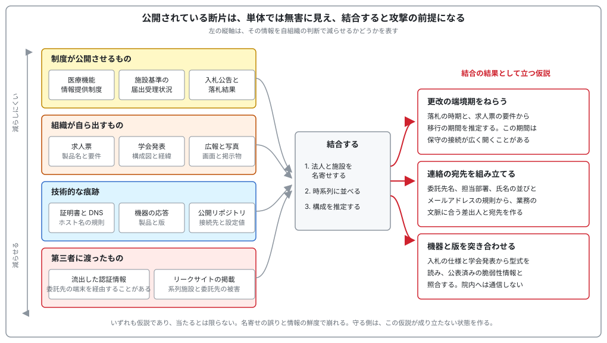
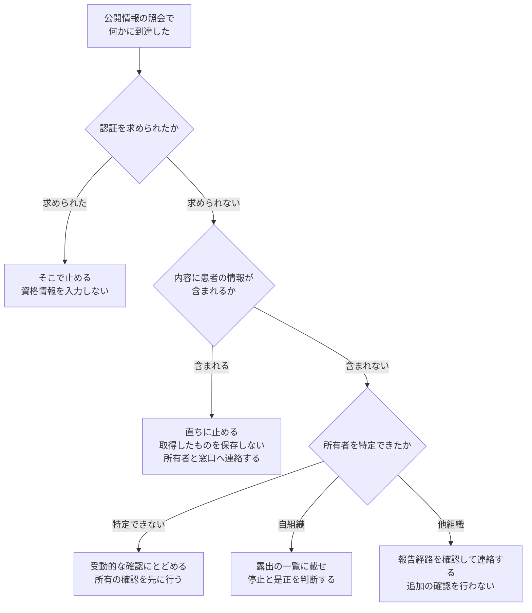

# 🔍 医療機関に対する OSINT

医療機関について、外部の人間が対象のネットワークへ通信を一切送らずに得られる情報は多い。
診療科の構成、届出済みの体制、システム更改の時期と落札した事業者、電子カルテの製品名、情報システム担当者の氏名、保守を請け負う事業者は、制度、広報、学会、求人のいずれかの経路で公開されている。

**OSINT**（Open Source Intelligence）は、公開されている情報を集め、突き合わせて、対象について判断できる形にする作業を指す。
本ページは、医療機関が持つ情報の種類ごとに、それが外に出る経路と用いられる手法、攻撃側の使い道、守る側の手当てを対応づける。

[外部から見た自組織の攻撃面](attack-surface.md) は、外から到達できる入口を数える作業を扱う。
OSINT はその一つ手前にあり、到達を試さずに分かることを集める。
入口の一覧は OSINT の産物の一部でしかない。
人、時期、取引関係は、そこには現れない。

**事実**：MITRE ATT&CK は、攻撃者が標的を選び計画するために情報を集める段階を Reconnaissance（TA0043）として、初期アクセスより前に置いている。
同フレームワークは、この段階の技術に対する緩和策を Pre-compromise（M1056）とし、組織の防御と統制の範囲外で行われる挙動に基づくため予防的な統制では緩和しにくく、外部に提供する情報の量と機微性を最小化することに努力を向けるべきである、と記す。
出典：[Reconnaissance (TA0043)](https://attack.mitre.org/tactics/TA0043/)、[Gather Victim Org Information (T1591)](https://attack.mitre.org/techniques/T1591/)、[Pre-compromise (M1056)](https://attack.mitre.org/mitigations/M1056/)（MITRE ATT&CK）

> [!NOTE]
> **表記ルール**：本ページでは、**事実**（一次情報で確認できる内容。出典を併記する）と、**分析**（筆者の解釈）を書き分ける。

> [!WARNING]
> 本ページは、自組織の露出を把握する担当者、書面での許可を得た検証者、脆弱性を報告する研究者を読み手に想定している。
> 権限のない対象へ通信を送る行為、認証を回避する行為は行ってはならない。
> 公開情報の照会の途中で患者の情報に到達した場合の手順は、[「読み取れるもの」と「取得できてしまうもの」](#読み取れるものと取得できてしまうもの) に示す。

---

## 医療機関の情報が、他の業種より外に出やすい理由

四つの事情が重なる。
いずれも、その制度や慣行の目的からすれば正当であり、止める議論にはならない。

**制度が公開を求める**：医療機関の機能、届出済みの体制、病床の構成は、患者が医療機関を選ぶための制度として公表される。

**事実**：医療機能情報提供制度は、住民と患者による医療機関の選択を支援する目的で、平成 18 年の第五次医療法改正により導入された。
病院等に対し医療機能に関する情報の都道府県知事への報告を義務付け、都道府県知事が報告を受けた情報を提供する制度として運用されている。
令和 5 年の医療法改正を受けて、従来は都道府県ごとに運用されていたシステムとデータを集約した全国統一の医療情報ネットが、令和 6 年 4 月から運用を開始した。
出典：[医療機能情報提供制度について](https://www.mhlw.go.jp/stf/seisakunitsuite/bunya/kenkou_iryou/iryou/teikyouseido/index.html)（厚生労働省）

**事実**：地方厚生局は、保険医療機関ごとの施設基準の届出受理状況を公表している。
出典：[保険医療機関・保険薬局の施設基準の届出受理状況](https://kouseikyoku.mhlw.go.jp/kantoshinetsu/chousa/kijyun.html)（関東信越厚生局。他の地方厚生局も同種の一覧を公表している）

**専門職が外に出る**：医師、看護師、診療放射線技師、臨床工学技士、医療情報技師は、学会発表、論文、講演、認定の名簿を通じて所属と担当を明かす。
情報システムの構成や運用の工夫は、医療情報の分野では発表の題材になる。

**調達が公開の手続きで行われる**：公立病院、独立行政法人、国立大学法人は、入札公告と落札結果を公表する。
仕様書には、更改の対象、既存の構成、接続する相手、移行の期間が書かれる。

**関係する組織が多い**：委託先、機器メーカー、地域連携の相手、健診、給食、清掃、検体検査、廃棄物処理が並ぶ。
自組織が出さなくても、取引の相手が導入事例や実績として出す。

**分析**：この四つのうち、医療機関の裁量が及ぶのは二つ目と、三つ目の一部にとどまる。
一つ目は制度として公表が決まっており、四つ目は取引の相手の判断で出る。
どこに裁量があるかは、[減らせるものと、減らせないもの](#減らせるものと減らせないもの) で項目ごとに分ける。



---

## 手法の区分と、対象ごとの道具

手法は、公開情報を照会するだけの**受動的な収集**と、対象へ通信を送る**能動的な確認**に分かれる。
この線の位置は [外部から見た自組織の攻撃面](attack-surface.md#測り方の線引き) と同じで、受動的な収集は所有の確認が済む前でも実施できるが、能動的な確認は権限のある範囲でしか行えない。
能動の側は、本リポジトリで共通の二段階に分ける。
正規の手順で一度だけ問い合わせる**低侵襲**と、異常な入力や負荷を伴う**侵襲**である（[ツール](../reference/resources/tools.md#対象への影響による三段階)）。

**事実**：行政機関の保有する情報の公開に関する法律は、何人に対しても行政文書の開示を請求する権利を認めている（第三条）。
請求の目的を問わない制度である。
出典：[行政機関の保有する情報の公開に関する法律](https://laws.e-gov.go.jp/law/411AC0000000042)（e-Gov 法令検索）

**分析**：受動の範囲でも、医療では他の業種と内容が変わるものが二つある。
一つは情報公開請求で、公立病院と独立行政法人に対しては上の制度が使えるため、契約書や仕様書といった内部文書に受動のまま手が届く。
もう一つは画像への写り込みで、病院は取材、見学、広報の機会が多く、公開された写真に端末の画面と掲示物が入る。

> [!WARNING]
> OSINT の本体は受動にある。
> 機器検索サービスの索引を読む行為と、その機器へ自分で通信を送る行為は別である。
> 稼働中の医療機器と製造設備に向けてよいのは、原則として受動までである。

### ドメイン、証明書、Web

| 道具、情報源 | 何が分かるか | 段階 |
|---|---|---|
| 検索エンジンの絞り込み（ファイル形式、サイト、表題の指定） | 索引された委員会の資料、患者説明の雛形、部門のマニュアル | 受動 |
| RDAP、whois | 登録者、管理の連絡先、有効期限。統合前の旧法人名が残ることがある | 受動 |
| 権威 DNS への照会（`dig`、`nslookup`） | メール基盤の事業者、クラウドの利用、送信ドメイン認証の設定 | 受動 |
| 証明書の透明性ログ | 発行済み証明書に含まれるホスト名。検証用ホスト、旧患者ポータル、内部の命名規則 | 受動 |
| [Shodan](https://www.shodan.io/)、[Censys](https://censys.com/) | 収集済みの応答の索引。開いているサービス、製品と版、提示している証明書 | 受動 |
| [subfinder](https://github.com/projectdiscovery/subfinder)、[OWASP Amass](https://owasp.org/www-project-amass/) | 複数の公開情報源からサブドメインを集約する。Amass は能動的な列挙も行うため、設定で切り分ける | 受動から低侵襲 |
| [Wayback Machine](https://archive.org/web/) | 削除されたページ。旧職員名簿、旧診療科のサイト、更改前の構成の記述 | 受動 |
| コード検索、[gitleaks](https://github.com/gitleaks/gitleaks)、[TruffleHog](https://github.com/trufflesecurity/trufflehog) | 委託先の成果物に残る接続先と設定値。自組織のリポジトリに向けて定期実行する | 受動 |
| [ExifTool](https://exiftool.org/) | 公開した文書と画像のメタデータ。作成者、作成環境、位置情報 | 受動 |
| [httpx](https://github.com/projectdiscovery/httpx) | 応答の有無、表題、証明書、製品の推定。集めたホスト名を一覧に落とす | 低侵襲 |
| `/.well-known/security.txt` の確認 | 脆弱性の報告先が公開されているか | 低侵襲 |
| [nuclei](https://github.com/projectdiscovery/nuclei) | テンプレートに基づく検査。露出の確認から状態変更を伴うものまで幅がある | 低侵襲から侵襲 |

**事実**：OWASP の Web Security Testing Guide は、検証の最初の工程に情報収集を置き、検索エンジンによる露出の確認、Web サーバの指紋採取、メタファイルの確認、公開されているアプリケーションの列挙を項目として並べている。
出典：[OWASP Web Security Testing Guide](https://owasp.org/www-project-web-security-testing-guide/)（OWASP）

**事実**：証明書の透明性（Certificate Transparency）は、証明書の発行を公開された監査可能なログに記録する仕組みで、RFC 6962 に規定されている。
出典：[RFC 6962](https://datatracker.ietf.org/doc/html/rfc6962)（IETF）、[Certificate Transparency](https://certificate.transparency.dev/)

**分析**：証明書の透明性ログは、攻撃側と守る側が同じものを見る数少ない材料である。
公開を停止したはずのホスト名が残っていれば、退役が完了していないことを外から確認できる。
守る側は同じログを監視の起点にでき、自組織の名前で証明書が新しく発行された時点で、把握していない資産の追加に気付ける。

**事実**：RFC 9116 は、脆弱性の報告先を `/.well-known/security.txt` に記載する形式を定めている。
出典：[RFC 9116: A File Format to Aid in Security Vulnerability Disclosure](https://datatracker.ietf.org/doc/html/rfc9116)（IETF）

**分析**：報告先を公開しても、露出そのものは減らない。
減るのは、発見者が連絡経路を探す時間であり、その分だけ露出している期間が短くなる（[Bug Bounty × 医療、ヘルスケア](bug-bounty/)）。

### 医療機器と IoMT の露出

| 道具、情報源 | 何が分かるか | 段階 |
|---|---|---|
| 機器検索サービスの索引（[Shodan](https://www.shodan.io/)、[Censys](https://censys.com/)） | 外部から届く機器の管理画面、画像の受け渡し口、設備制御の応答 | 受動 |
| [医療機器の承認情報と添付文書](https://www.pmda.go.jp/PmdaSearch/kikiSearch/) | 型式、一般的名称、製造販売業者。院内の写真や入札結果と突き合わせる | 受動 |
| メーカーの公表資料、MDS2、SBOM | 搭載する通信機能、保存されるデータ、更新の方式（[IoMT のリスク](../technology/medical-devices/iomt.md)） | 受動 |
| [NVD](https://nvd.nist.gov/vuln/search)、[CISA ICS Medical Advisories](https://www.cisa.gov/news-events/cybersecurity-advisories)、[CISA KEV](https://www.cisa.gov/known-exploited-vulnerabilities-catalog) | 型式と版に対応する公表済みの脆弱性と、悪用が確認されたもの | 受動 |
| 公開されている更新ファイル | 同型機の構成。[binwalk](https://github.com/ReFirmLabs/binwalk)、[EMBA](https://github.com/e-m-b-a/emba)、[cve-bin-tool](https://github.com/intel/cve-bin-tool) で中身を読む | 受動 |
| 無線設備の認証の記録（技適の番号、FCC ID） | 内蔵する無線モジュールと、対応する規格 | 受動 |
| 施設設備の制御系の応答（空調、電源、入退室） | 診療を止められる系統が外に出ていないか | 受動 |
| 疎通確認（[DCMTK](https://dicom.offis.de/dcmtk) の `echoscu` など） | 認証を求めずに応答するかどうか（[PACS / DICOM のセキュリティ](../technology/medical-devices/pacs-dicom.md)） | 低侵襲 |

**分析**：IoMT の OSINT が Web と違うのは、対象へ通信を送れないという制約が最初から効く点である。
そのため作業の重心は、外から見えた応答よりも、型式と版を公開資料から確定し、公表済みの脆弱性と突き合わせる側に寄る。
この照合は院内へ一切通信を送らずに完結し、結果は機器そのものへの指摘ではなく、調達要件、ネットワーク配置、保守契約への指摘に変換できる（[医療機器の検証手法](../technology/medical-devices/testing-methodology.md)）。

> [!IMPORTANT]
> 露出の確認は、疎通の応答が返るところまでで判断がつくことが多い。
> 画像の取得まで進めると、実在する患者の情報を手元に置くことになる。
> 自組織の資産であっても、そこまで進める必要があるかを先に決める（[ツール](../reference/resources/tools.md#dicom医用画像)）。

### 人と組織

| 道具、情報源 | 何が分かるか | 段階 |
|---|---|---|
| [theHarvester](https://github.com/laramies/theHarvester) | 公開情報から氏名とメールアドレスを集約する。集まった連絡先から、未公開のアドレスの規則を導ける | 受動 |
| 学会の抄録、論文、研究者データベース | 所属、担当、共同研究先、運用しているシステム | 受動 |
| 求人票（[ハローワークインターネットサービス](https://www.hellowork.mhlw.go.jp/)、転職サイト） | 製品名、要件、体制、勤務の形 | 受動 |
| 広報の写真と動画、取材記事 | 端末の画面、掲示物、名札、配線、入館の手順 | 受動 |
| [Have I Been Pwned](https://haveibeenpwned.com/) | 自組織のドメインを含む認証情報の流通。ドメイン単位の検索は、管理者であることの確認を経て使う | 受動 |
| [リークサイト横断フィード](../reference/resources/leak-site-feeds.md) | 委託先と系列施設の被害の公表 | 受動 |

### 制度、調達、公開文書

いずれも受動の範囲に収まる。
医療機関に固有の情報源が集まるのはこの区分である。

| 情報源 | 何が分かるか |
|---|---|
| [医療機能情報提供制度（医療情報ネット）](https://www.mhlw.go.jp/stf/seisakunitsuite/bunya/kenkou_iryou/iryou/teikyouseido/index.html) | 診療科、病床、対応できる診療、オンライン診療の可否 |
| [施設基準の届出受理状況](https://kouseikyoku.mhlw.go.jp/kantoshinetsu/chousa/kijyun.html)（地方厚生局） | 届出済みの体制。運用している仕組みを推定する材料になる |
| [病床機能報告](https://www.mhlw.go.jp/stf/seisakunitsuite/bunya/0000055891.html) | 病棟単位の機能と職員の配置 |
| [調達ポータル](https://www.p-portal.go.jp/pps-web-biz/)、自治体の入札情報 | 更改の対象、既存の構成、期間、落札した事業者 |
| 議会と運営審議会の資料、監査の報告 | 予算、移行のスケジュール、過去の事故の経緯 |
| [jRCT](https://jrct.mhlw.go.jp/)、[ClinicalTrials.gov](https://clinicaltrials.gov/) | 実施施設、責任者、共同研究先 |
| [EDINET](https://disclosure2.edinet-fsa.go.jp/)（製薬企業、上場する事業者） | 拠点、子会社、システム投資、リスクの記述 |
| 情報公開請求 | 契約書、仕様書、監査の結果、事故の報告 |

### 受動の範囲で最初に見る点

自組織を対象にするとき、次の照会から始めると、名寄せとメールの経路が同時に確認できる。
いずれも公開されている DNS への照会であり、対象の設備へ通信を送らない。

```sh
# 登録内容と有効期限（旧法人名や、更新の担当が分かれていないか）
whois example-hospital.or.jp

# 権威 DNS とメールの経路（どの事業者を使っているか）
dig +short NS example-hospital.or.jp
dig +short MX example-hospital.or.jp

# 送信ドメイン認証の設定（なりすましの余地）
dig +short TXT example-hospital.or.jp
dig +short TXT _dmarc.example-hospital.or.jp
```

これに、証明書の透明性ログで自組織の名前を引いた結果を並べると、把握していないホスト名が最初の一覧として出る。
設定の読み方と直し方は [メールとドメインの管理](../technology/email-domain.md) に対応する。

---

## 集めるときに立てる問い

道具を増やしても、問いが一つだと同じ材料しか出てこない。
次の六つを、収集のたびに切り替える。

**境界の問い**：自組織が出していない情報を、繋がっている相手が出していないか。
委託先の導入事例、地域連携の相手の公表資料、共同研究先の発表、機器メーカーの納入実績が該当する。

**別名の問い**：自組織の名前以外で引いたか。
旧法人名、統合前の病院名、診療科名、部門が使っている略称、導入している製品名で引くと、別の資料に当たる。

**代替経路の問い**：同じデータが、別の経路でも外に出ていないか。
画面、印刷、通知メール、API、外部共有リンクは、認可の点検が経路ごとに分かれやすい。

**時期の問い**：変化が起きた時点を軸に並べたか。
統合、移転、更改、事故の公表、委託先の変更の前後に、退役し忘れた資産と古い記述が残る。

**否定の問い**：見つからなかったことを、存在しないことと取り違えていないか。
索引に載っていないだけの場合があり、「確認できなかった」と「無い」は別に記録する。

**停止の問い**：どこで止めるかを、始める前に決めたか。
決めていないと、患者情報に到達した場面でその場の判断になる。

---

## 何が、どこから出て、どう使われるか

情報の種類を四つに分け、外に出る経路と手法、攻撃側の使い道、守る側の手当てを並べる。
手当ての欄には、減らせないものは減らせないと書く。

### 人に関する情報

| 出る情報 | 経路と手法 | 攻撃側の使い道 | 手当て |
|---|---|---|---|
| 職員の氏名、所属、役職 | Web サイトの組織図と医師紹介、学会の抄録、論文の著者欄、認定の名簿（受動） | 標的型メールの宛先と差出人の設定。電話での本人確認の突破 | 掲載を診療上必要な範囲に絞る。氏名と内線の対応表を公開面に置かない |
| メールアドレスの規則 | 論文の連絡先、問い合わせ先、公開資料の署名（受動） | 公開されていないアドレスを規則から組み立てる | 規則は隠せない。多要素認証と、受信側の対策に寄せる（[認証とアクセス管理](../technology/identity.md)、[メールとドメインの管理](../technology/email-domain.md)） |
| 情報システム部門の体制と人数 | 求人票、広報誌、年報、講演資料（受動） | 兼務と当番の状況から、対応が薄くなる時間帯を推定する | 求人票に体制の詳細を書かず、選考の過程で説明する |
| 委託先の担当者と取引関係 | ベンダの導入事例、共同発表、展示会の資料（受動） | 実在する取引関係を使ったなりすまし。請求書の差し替え | 事例掲載の可否と記載の粒度を契約で決める |
| 端末の利用者名 | 公開した文書のメタデータ（受動） | アカウント名の規則の推定 | 公開前にメタデータを除去する |
| 当直と時間外の体制 | 外来案内、救急の受け入れ表示（受動） | 応答が遅れる時間帯に合わせた実行 | 患者に必要な情報であり減らせない。検知と初動の当番で受ける（[ログと監視の設計](../technology/logging.md)） |

**分析**：この表の項目は、いずれも単体では公開して差し支えないものとして掲載されている。
攻撃側が使うのは項目そのものではなく、氏名と所属と取引先を組み合わせて作る文脈である。
掲載の可否を項目ごとに判断すると、組み合わせで生じる問題は見落とされる。

### システムと医療機器に関する情報

| 出る情報 | 経路と手法 | 攻撃側の使い道 | 手当て |
|---|---|---|---|
| 電子カルテと部門システムの製品名 | 求人票の要件、学会発表、入札の仕様書、ベンダの導入事例（受動） | 公表済みの脆弱性情報との突き合わせ。運用手順の推定 | 発表と求人の粒度を製品名までにとどめ、版と構成を書かない |
| ネットワークの構成 | 学会発表の構成図、入札の仕様書、監査の報告（受動） | 分離の程度と、入口から届く範囲の推定 | 図から IP、ホスト名、機器の型式を落とす（[ネットワークの分離](../technology/segmentation.md)） |
| 認証基盤とクラウドの利用 | ログイン画面、送信ドメイン認証の設定、証明書の発行記録（受動） | 認証の方式に合わせた経路の選択 | 設定は隠せない。例外を含めた多要素認証で受ける |
| サブドメインと退役し忘れた資産 | 証明書の発行記録、DNS の記録、過去のページ（受動） | 更新と監視が止まった資産の特定 | 退役の手順に、公開停止と DNS の削除を含める |
| 外部から届くサービスの応答 | 機器検索サービスの索引（受動）、到達性の確認（能動） | 入口の確定 | 入口の数え方と是正は [外部から見た自組織の攻撃面](attack-surface.md) に対応する |
| 医療機器の型式とソフトウェアの版 | 承認情報と添付文書、入札の結果、院内の写真（受動） | 公表済みの脆弱性情報との照合。保守経路の推定 | 撮影の前に機器と掲示物を確認する（[医療機器のセキュリティ](../technology/medical-devices/)） |
| 画像の受け渡しの設定 | 遠隔読影と地域連携の公表資料、機器検索サービスの索引（受動） | 認証のない受け渡し口の特定 | 接続元の限定と、機器ゾーンへの収容（[PACS / DICOM のセキュリティ](../technology/medical-devices/pacs-dicom.md)） |
| 保守の接続 | 保守契約の公告、ベンダの資料（受動） | 保守回線を経由した侵入の準備 | 接続元の限定と記録の取得を保守契約に書き込む |

**事実**：医療機器の承認情報と添付文書は、PMDA が検索できる形で公開している。
出典：[医療機器の承認情報](https://www.pmda.go.jp/PmdaSearch/kikiSearch/)（PMDA）

**分析**：経路の欄は、外部から届くサービスの応答を除いてすべて受動である。
構成の推定に必要な材料は、対象へ通信を送らずに揃う。
外部からのスキャンを遮断しても、構成が読まれる経路は残る。

### 調達、契約、経営に関する情報

| 出る情報 | 経路と手法 | 攻撃側の使い道 | 手当て |
|---|---|---|---|
| 更改の時期と予算 | 入札公告、落札結果、議会の予算資料、中期計画（受動） | 移行の期間を推定する。移行中は構成が変わり、例外の接続が開くことがある | 制度上、公表は避けられない。移行の期間に監視と承認を厚くする |
| 既存構成と接続先 | 入札の仕様書、情報公開請求で得た文書（受動） | 内部の構成の把握 | 仕様書の本体は公開し、構成図と機器一覧は交付に条件を付けた別添にする |
| 委託先の一覧 | 落札結果、契約情報の公表、導入事例（受動） | 委託先を経由した侵入経路の選択 | 委託先に対する要件を契約に書き、再委託まで確認する（[基盤の構えと外部依存](../response/dependencies.md)） |
| 経営の状況 | 医療法人の事業報告書、有価証券報告書（製薬企業）（受動） | 支払い能力の推定。恐喝の金額と圧力の設計 | 減らせない |
| 過去のインシデント | 当事者の公表、行政の公表、リークサイトの掲載（受動） | 未修正のまま残った経路の推定 | 公表の粒度を、再発防止の説明に必要な範囲にとどめる |
| 治験と研究の実施体制 | 臨床研究の登録情報、研究計画の公開資料（受動） | 検体とデータの流れ、外部の共同研究先の特定 | 登録は制度上必要である。共同研究先の接続を分離する（[治験と研究データ](../reference/pharma/clinical-trials.md)） |

**事実**：国内の臨床研究は jRCT、国際的な臨床試験は ClinicalTrials.gov に登録され、実施施設と責任者が公開される。
出典：[jRCT 臨床研究等提出・公開システム](https://jrct.mhlw.go.jp/)（厚生労働省）、[ClinicalTrials.gov](https://clinicaltrials.gov/)（NIH）

**事実**：国の機関の調達情報は調達ポータルに集約されている。
出典：[調達ポータル](https://www.p-portal.go.jp/pps-web-biz/)（デジタル庁）

### 施設と運用に関する情報

| 出る情報 | 経路と手法 | 攻撃側の使い道 | 手当て |
|---|---|---|---|
| 建物の配置と諸室 | 病院の案内図、建築工事の公告、増改築の資料（受動） | 物理的な侵入の計画。サーバ室と分電盤の位置の推定 | 公開する案内図から、機械室と情報システムの諸室を落とす |
| 入退館の運用 | 見学の案内、広報の写真、採用の説明資料（受動） | 立ち入りの口実の設計。入館証の偽造 | 写真に入館証と手順を写さない |
| 端末と掲示物 | 取材、見学、広報の写真と動画（受動） | 画面の内容、貼り出された手順、連絡先の取得 | 撮影と公開の前に確認する手順を、広報の工程に組み込む |
| 災害時と停止時の運用 | 公表された BCP、訓練の報告、地域の協定（受動） | 停止時に人手へ切り替わる箇所の特定 | 公表は地域連携に必要である。手順書の詳細は公開面に置かない（[サイバー BCP](../response/bcp-cyber.md)） |

---

## 「読み取れるもの」と「取得できてしまうもの」

ここまでの表は、公開情報から**読み取れるもの**を扱った。
これとは別に、公開情報の照会の範囲で、内容そのものが手に入ってしまう状態がある。
両者は、発見したあとの扱いが変わる。

| 状態 | 医療で起きる形 | 発見したときの扱い |
|---|---|---|
| 索引された内部文書 | 委員会の資料、患者説明の雛形、部門のマニュアルが検索エンジンに載る | 所有を特定できた時点で止め、所有者へ連絡する |
| 公開設定のままの保管領域 | 検査画像や名簿の受け渡しに使った領域が、期限を過ぎても公開のまま残る | 一覧の取得で止める。中身を開かない |
| 認証を求めない受け渡し口 | 遠隔読影と地域連携のための設定が、接続元を限定しないまま開く | 応答の有無で止める。画像を取得しない |
| 公開リポジトリに残る設定値 | 委託先の開発物に、接続先と資格情報が含まれる | 資格情報を使わない。所有者と、該当する事業者へ連絡する |
| 流通している認証情報 | 委託先の端末を経由して流出した職員のアカウント | 自組織のものは失効の対象として扱う。他組織のものは使わない |

**分析**：この五つに共通するのは、認証を回避していないという点である。
その意味で、閲覧の時点では不正アクセス行為に当たらない場合がある。
一方で、内容が患者の情報であれば、見た側が要配慮個人情報を保有した状態になる。
「法に触れていないから続けてよい」という判断は、この二つを取り違えている。

**事実**：不正アクセス行為の禁止等に関する法律は、他人の識別符号を入力する行為と、アクセス制御機能による制限を免れる情報または指令を入力する行為を、不正アクセス行為として禁じている（第二条第四項、第三条）。
出典：[不正アクセス行為の禁止等に関する法律](https://laws.e-gov.go.jp/law/411AC0000000128)（e-Gov 法令検索）

**事実**：個人情報の保護に関する法律は、病歴を含む記述等が含まれる個人情報を要配慮個人情報と定め、原則として本人の同意を得ない取得を禁じている（第二条第三項、第二十条第二項）。
出典：[個人情報の保護に関する法律](https://laws.e-gov.go.jp/law/415AC0000000057)（e-Gov 法令検索）、[医療・介護関係事業者における個人情報の適切な取扱いのためのガイダンス](https://www.ppc.go.jp/personalinfo/legal/iryoukaigo_guidance/)（個人情報保護委員会）

到達してしまった側が取るべき手順は、次の四つに絞られる。

1. 内容の確認を、所有者を特定するために必要な最小限で止める
2. 取得したものを保存しない。保存してしまった場合は、報告のあとに削除する
3. 所有者へ連絡する。連絡先が公開されていない場合は、IPA の届出制度と JPCERT/CC を経路にする（[Bug Bounty × 医療、ヘルスケア](bug-bounty/)）
4. 修正または公開停止が確認できるまで、第三者へ内容を共有しない



---

## 立場ごとの目的と、止まる線

同じ収集作業でも、誰が何のために行うかで、成果物と止まる位置が変わる。

| | 自組織を守る側 | 許可を得た検証者 | 脆弱性を報告する研究者 |
|---|---|---|---|
| 起点 | 自組織と関係先の名寄せ | 契約書に書かれた範囲 | プログラムまたは公開された報告先の範囲 |
| 立てる問い | 何が、どれだけ外に出ているか | どの経路が実際に通るか | 誰の資産で、報告先はどこか |
| 成果物 | 露出の一覧と、出す量を変える判断 | 攻撃シナリオと、その前提条件 | 資産の帰属の根拠と、再現の手順 |
| 触れてよい範囲 | 自組織の資産。委託先は相手の許可を得る | 契約で合意した範囲と時間帯 | プログラムが明記した範囲 |
| 止まる線 | 減らす判断まで。他組織の資産に踏み込まない | 稼働中の医療機器と製造設備、範囲外の資産 | 認証の先、患者データ、範囲外の資産 |

### 自組織を守る側

作業は名寄せから始まる。
医療法人と関連する社会福祉法人、指定管理を受けた公立病院、附属の健診センター、院内薬局、研究部門は、法人格が別でもドメインと職員を共有していることがある。
名寄せを誤ると、他組織の露出を自組織の問題として数えるか、逆に自組織の露出を見落とす。

成果物を「一覧」で終わらせない。
制度由来の情報は減らせないため、一覧をそのまま是正の対象にすると、着手できない項目が並ぶ。
減らせる項目と、出ている前提で入口の側を固める項目に分けたうえで、後者を [外部から見た自組織の攻撃面](attack-surface.md) と [認証とアクセス管理](../technology/identity.md) に渡す。

委託先の公開情報に自組織の名前が出ていないかを、確認の範囲に含める。
導入事例、共同発表、採用ページの実績欄が該当する。
掲載の可否は契約で決められるため、ここは減らせる側にある。

### 許可を得た検証者

契約前の見積もりと、契約後の事前調査の両方で使う。
契約書には、OSINT の範囲を受動的な収集に限るのか能動的な確認を含むのか、患者情報に到達したときにどう扱うかを書く。
書いていないと、報告書に載せた画面の写しが、そのまま個人情報の取扱いの問題になる。

医療では、OSINT だけで成立する指摘がある。
稼働中の医療機器へ通信を向けられない条件でも、型式と版の照合は成立する（[医療機器と IoMT の露出](#医療機器と-iomt-の露出)）。
その結果は、機器そのものへの指摘ではなく、調達要件、ネットワーク配置、保守契約への指摘に変換する（[検証と実務](README.md)）。

標的型メールの訓練は、実在の取引関係と更改案件を材料にすると、受け取った側が業務の文脈として処理しやすくなるため、実際の攻撃に近い難度になる。
実在する委託先名と担当者名を使うかどうかは、訓練の前に合意しておく。
合意のないまま実在の氏名を使うと、訓練そのものが当該個人に対する問題になる。

### 脆弱性を報告する研究者

**分析**：国内の医療機関で、脆弱性の報告先を公開している例は限られる。
報告先が公開されていない場合、IPA の届出制度と JPCERT/CC が経路になる（[Bug Bounty × 医療、ヘルスケア](bug-bounty/)）。
報告先を探している間も露出は続くため、経路の確認は検証より先に行う。

帰属の確認が最初の作業になる。
病院の Web サイトは制作会社の共用基盤に置かれていることがあり、同じ IP で応答する隣の資産が別の組織のものであることがある。
サブドメインが指す先が委託先のサービスであることもあり、その場合の報告先は病院ではなくその事業者になる。

患者データに到達した時点で止める。
影響の大きさを示すために件数を数える行為は、取得の量を増やすだけであり、報告の受け手にとっても扱いにくい材料になる。
到達したという事実と、到達までの手順を書けば足りる。

---

## 自組織に対して行うときの手順

| 段階 | 作業 | 残す記録 |
|---|---|---|
| 0 | 範囲と権限を決める。委託先の資産を含めるなら相手の許可を取る | 許可した者、範囲、期間 |
| 1 | 名寄せする。法人格、旧名称、系列、指定管理、附属施設、研究部門を並べる | 対象の一覧と、含めなかったものの理由 |
| 2 | 制度由来の公開情報を集める | 取得日と参照先 |
| 3 | 自組織が出している情報を集める。委託先が出している自組織の情報も含める | 取得日と参照先 |
| 4 | 技術的な痕跡を、受動的な収集の範囲で集める | 取得日と参照先 |
| 5 | 第三者に渡った情報を確認する | 取得日と参照先 |
| 6 | 突き合わせ、減らせるものと出ている前提で守るものに分ける | 判断と、判断した者 |

**分析**：記録の欄に取得日を置く理由は、この作業の産物が時間とともに外れるためである。
病院情報システムの更改は数年周期で行われるため、数年前の落札情報から推定した構成は、現在の構成と一致しない。
取得日のない一覧は、いつの状態を指しているのかを誰も判断できなくなり、次の担当者が最初からやり直す。

---

## 減らせるものと、減らせないもの

| 情報源 | 減らせるか | 手当て | 代償 |
|---|---|---|---|
| 制度に基づく届出と公表 | 減らせない | 出ている前提で入口を固める | なし |
| メールアドレスの規則 | 減らせない | 多要素認証と受信側の対策に寄せる | なし |
| 証明書の発行記録 | ほぼ減らせない | 用途を分ける。ワイルドカード証明書で個別のホスト名を出さない判断はある | 失効と鍵の危殆化のときに影響する範囲が広がる |
| 入札の仕様書 | 一部を減らせる | 本体は公開し、構成図と機器一覧は交付に条件を付けた別添にする | 応札の準備に手間が増える。競争性への配慮が要る |
| 求人票 | 減らせる | 製品名と構成を書かず、選考の過程で説明する | 応募者の数と、事前の理解が減る |
| 学会発表と論文 | 減らせる | 粒度を落とし、IP、ホスト名、機器の型式を出さない | 再現性の説明が弱くなる |
| 広報の写真と動画 | 減らせる | 公開前に画面、掲示物、入館証、配線を確認する | 確認の工程が増える |
| 公開文書のメタデータ | 減らせる | 公開前に除去する | なし |
| 委託先が出す導入事例 | 減らせる | 掲載の可否と粒度を契約で決める | 委託先との調整が要る |
| 公開リポジトリの設定値 | 減らせる | 成果物の公開範囲と設定値の扱いを委託契約に書く | なし |

**分析**：減らせる欄は、組織が自ら出している情報に集中する。
制度由来のものと技術的な痕跡は、ほとんど減らせない。
したがって、OSINT への対応の中心は「出さない」ではなく、「出ている前提で、入口と認証と監視を置く」側にある。
減らす作業に人を張ると、労力の大半が、攻撃側の判断をあまり変えない項目に向かう。

---

## 誤りやすい点

**名寄せの誤り**：同じ名称の医療機関が複数の地域に存在する。
公立病院の指定管理では、施設の所有者と運営者が別の組織になる。
医療法人と、同じ経営者による社会福祉法人が、別法人のままドメインと職員を共有していることがある。

**委託先の資産を自組織として数える**：サブドメインが指す先が委託先のサービスである場合、是正の権限は自組織にない。
一覧に載せる際に、所有と運用を分けて書く。

**鮮度の取り違え**：過去のページの保存記録に残った情報を、現在も公開されていると判断する誤りが起きる。
逆に、削除したページの内容が保存記録に残り続けていることを見落とす誤りも起きる。

**断片の過剰な結合**：別々の経路で得た二つの事実の間に、根拠のない因果を置いてしまう。
求人票の要件と落札した事業者が一致しても、その構成が現在も使われている保証はない。

**見つかったことを、脆弱であることと取り違える**：外から見えるという事実は、そこが破られるという意味ではない。
順序づけは、到達性、認証、そこから届く先、診療と供給への影響の四つで行う（[外部から見た自組織の攻撃面](attack-surface.md#見つけたものに順序をつける)）。

---

## 継続する形にする

一度の収集で得られるのは、ある時点の状態である。
継続の形は、全件を毎回見るのではなく、前回との差分を見る形にする。

| 見る対象 | 頻度の目安 | 差分が出たときの行き先 |
|---|---|---|
| 新しいホスト名と証明書 | 月次 | 露出の一覧に追加し、所有者を確認する |
| 新しい求人票と広報の掲載 | 掲載のたび | 記載の粒度を確認する |
| 入札公告と落札結果 | 案件のたび | 移行の期間の監視計画に渡す |
| 流出した認証情報 | 月次 | 該当アカウントの資格情報を失効させる |
| リークサイトの掲載 | 週次 | 委託先と系列施設が出ていないかを確認する |
| 委託先の導入事例 | 契約の更新時 | 掲載の粒度を契約で調整する |

**分析**：この表の頻度は、変化の起きる速さで決まる。
求人票と広報は掲載の直前に確認するほうが早く、掲載後に見つけて取り下げると、保存記録には残る。
確認を掲載の工程に組み込めるかどうかで、この項目の実効性が変わる。

見る担当を決める。
担当が決まっていない項目は、収集の仕組みを作っても更新が止まりやすい。
経営層への報告に載せる形は [経営とガバナンス](../governance/) に対応する。

---

## 関連ページ

- [外部から見た自組織の攻撃面](attack-surface.md)：入口を数え、順序をつけ、増えたときに気付く
- [医療の脅威モデリング](threat-modeling.md)：OSINT で得た構成の推定を、攻撃ツリーの枝に渡す
- [診断とペネトレーションテスト](pentest/)：受動的な収集で立てた仮説を、権限の範囲で確かめる
- [Bug Bounty × 医療、ヘルスケア](bug-bounty/)：報告経路と、受け取る側の設計
- [メールとドメインの管理](../technology/email-domain.md)：なりすましの宛先と、失効したドメイン
- [認証とアクセス管理](../technology/identity.md)：規則の推定できるアカウントを、認証で受ける
- [ネットワークの分離](../technology/segmentation.md)：構成が読まれた場合に、到達を狭める側
- [PACS / DICOM のセキュリティ](../technology/medical-devices/pacs-dicom.md)：画像の受け渡し口の露出
- [医療機器の検証手法](../technology/medical-devices/testing-methodology.md)：型式と版から、公表済みの脆弱性を追う
- [ツール](../reference/resources/tools.md)：段階の定義と、領域ごとの道具の一覧
- [リークサイト横断フィード](../reference/resources/leak-site-feeds.md)：第三者に渡った情報の確認
- [ダークウェブと医療データ](../threats/actors/dark-web-medical-data.md)：流出後の流通
- [医療の倫理とセキュリティの倫理](../reference/ethics.md)：知り得た情報の扱い

## 一次情報

| 資料 | 発行元 |
|---|---|
| [Reconnaissance (TA0043)](https://attack.mitre.org/tactics/TA0043/) | MITRE ATT&CK |
| [Gather Victim Org Information (T1591)](https://attack.mitre.org/techniques/T1591/) | MITRE ATT&CK |
| [Gather Victim Identity Information (T1589)](https://attack.mitre.org/techniques/T1589/) | MITRE ATT&CK |
| [Search Open Technical Databases (T1596)](https://attack.mitre.org/techniques/T1596/) | MITRE ATT&CK |
| [Pre-compromise (M1056)](https://attack.mitre.org/mitigations/M1056/) | MITRE ATT&CK |
| [医療機能情報提供制度について](https://www.mhlw.go.jp/stf/seisakunitsuite/bunya/kenkou_iryou/iryou/teikyouseido/index.html) | 厚生労働省 |
| [保険医療機関・保険薬局の施設基準の届出受理状況](https://kouseikyoku.mhlw.go.jp/kantoshinetsu/chousa/kijyun.html) | 関東信越厚生局 |
| [医療分野のサイバーセキュリティ対策について](https://www.mhlw.go.jp/stf/seisakunitsuite/bunya/kenkou_iryou/iryou/johoka/cyber-security.html) | 厚生労働省 |
| [医療機器の承認情報](https://www.pmda.go.jp/PmdaSearch/kikiSearch/) | PMDA |
| [jRCT 臨床研究等提出・公開システム](https://jrct.mhlw.go.jp/) | 厚生労働省 |
| [ClinicalTrials.gov](https://clinicaltrials.gov/) | NIH |
| [調達ポータル](https://www.p-portal.go.jp/pps-web-biz/) | デジタル庁 |
| [不正アクセス行為の禁止等に関する法律](https://laws.e-gov.go.jp/law/411AC0000000128) | e-Gov 法令検索 |
| [個人情報の保護に関する法律](https://laws.e-gov.go.jp/law/415AC0000000057) | e-Gov 法令検索 |
| [行政機関の保有する情報の公開に関する法律](https://laws.e-gov.go.jp/law/411AC0000000042) | e-Gov 法令検索 |
| [医療・介護関係事業者における個人情報の適切な取扱いのためのガイダンス](https://www.ppc.go.jp/personalinfo/legal/iryoukaigo_guidance/) | 個人情報保護委員会 |
| [ASM（Attack Surface Management）導入ガイダンス](https://www.meti.go.jp/press/2023/05/20230529001/20230529001.html) | 経済産業省 |
| [RFC 6962: Certificate Transparency](https://datatracker.ietf.org/doc/html/rfc6962) | IETF |
| [RFC 9116: A File Format to Aid in Security Vulnerability Disclosure](https://datatracker.ietf.org/doc/html/rfc9116) | IETF |
| [Web Security Testing Guide](https://owasp.org/www-project-web-security-testing-guide/) | OWASP |
| [National Vulnerability Database](https://nvd.nist.gov/vuln/search) | NIST |
| [Cybersecurity Advisories（ICS Medical Advisories を含む）](https://www.cisa.gov/news-events/cybersecurity-advisories) | CISA |
| [Known Exploited Vulnerabilities Catalog](https://www.cisa.gov/known-exploited-vulnerabilities-catalog) | CISA |
| [病床機能報告](https://www.mhlw.go.jp/stf/seisakunitsuite/bunya/0000055891.html) | 厚生労働省 |
| [EDINET](https://disclosure2.edinet-fsa.go.jp/) | 金融庁 |
| [脆弱性関連情報の届出受付](https://www.ipa.go.jp/security/todokede/vuln/uketsuke.html) | IPA |

---

<sub>[← 医療の脅威モデリング](threat-modeling.md) | [検証と実務](README.md) | [外部から見た自組織の攻撃面 →](attack-surface.md) | [トップへ](../../README.md)</sub>
