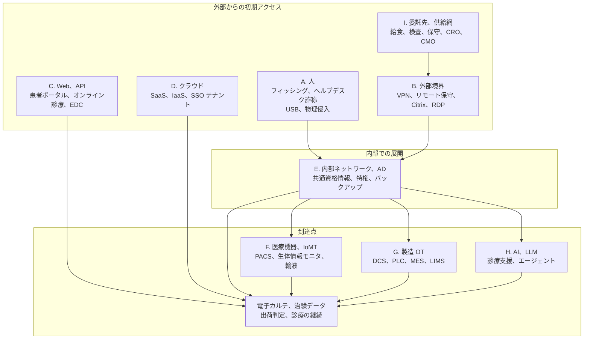

# 🛡️ セキュリティ診断とペネトレーションテスト × 医療機関、製薬企業

医療機関と製薬企業に対する検証は、一般企業向けの診断と設計が変わる。
対象を止められないこと、患者の安全と医薬品の供給が評価軸に入ること、承認やバリデーションによって構成を勝手に変えられない資産が含まれることが理由である。

本ページは、検証の対象を **人、外部境界、Web と API、クラウド、内部ネットワークと AD、医療機器（IoMT）、製造 OT、AI、委託先** に分け、領域ごとに、狙われ方、検証の観点、実施上の制約、根拠となる規制要求を整理する。
領域を分けるのは、同じ「ペネトレーションテスト」という語で発注されたものが、実際には別の作業を指すことが多いためである。

> [!NOTE]
> **表記ルール**：本ページでは、**事実**（一次情報で確認できる内容。出典を併記する）、**報道ベース**（報道や解説記事のみで確認でき、原文で裏付けが取れていない内容）、**分析**（筆者の解釈）を書き分ける。

> [!WARNING]
> 稼働中の医療情報システム、患者が接続された医療機器、GMP 下で運転中の製造設備に対する検証は、書面での許可、停止時の復旧手順、立ち会い者の合意がそろうまで開始しない。
> 能動的な検証は、隔離環境または同型機で影響を確認してから実施する。

---

## 1. 用語を分ける

医療機関の調達では、脆弱性スキャンから侵入シナリオの検証までが、まとめて「ペネトレーションテスト」と呼ばれることがある。
契約前に、次のどれを買うのかを確定させると、成果物の期待値がずれない。

| 手法 | 問いの形 | 主な成果物 | 答えられないこと |
|---|---|---|---|
| **脆弱性スキャン** | 既知の脆弱性が、どこに何件あるか | 検出結果の一覧、CVE との対応 | その脆弱性が実際に悪用可能か。業務にどう波及するか |
| **脆弱性診断（Web、プラットフォーム）** | この対象に、どの脆弱性が存在するか | 網羅性を重視した指摘一覧、再現手順 | 複数の弱点をつないだ場合にどこまで到達するか |
| **ペネトレーションテスト** | 定めた目標（電子カルテの改ざん、治験データの持ち出しなど）に到達できるか | 到達可否と経路、途中で有効だった検知と無効だった検知 | 網羅性。指摘されなかった箇所が安全である保証 |
| **レッドチーム演習** | 検知と対応の体制が、実際の攻撃に気づいて止められるか | 攻撃側の時系列と、防御側の検知、対応の記録 | 個別システムの脆弱性の網羅 |
| **脅威モデリング、構成レビュー** | 設計上どこが弱いか。何を先に直すか | 想定脅威と対策の対応表 | 実装が設計どおりかどうか |
| **バグバウンティ、脆弱性開示** | 継続的に外部から指摘を受け取れるか | 報告の流入と対応記録 | 期間を区切った網羅的評価 |

**分析**：医療機関でまず効果が出るのは、網羅的な脆弱性診断より、**到達点を決めたペネトレーションテスト**であることが多い。
「委託事業者の接続点から入られたとき、何時間で電子カルテとバックアップに到達するか」という問いは、経営層が判断できる形の答えを返すためである。
一方、医療機器メーカーと製薬企業では、規制当局への提出物として網羅性のある検証記録が求められる場面があり、目的が逆になる（[5. 規制が求める検証](#5-規制が求める検証)）。

---

## 2. 対象領域の全体像

攻撃者の初期アクセス経路と、それに対応する検証メニューを対応させる。

| 領域 | 主な対象資産 | 一般的な診断メニュー名 | 稼働系を止めるリスク | 主な発注元 |
|---|---|---|---|---|
| A. 人 | 職員、ヘルプデスク、受付、物理的な出入口 | 標的型メール訓練、ビッシング、物理侵入テスト | 低（ただし診療の妨害に注意） | 医療機関、製薬企業 |
| B. 外部境界 | VPN、保守回線、公開サーバ | 外部プラットフォーム診断、外部ペネトレーションテスト、ASM | 中 | 医療機関、製薬企業、ベンダ |
| C. Web、API | 患者ポータル、予約、オンライン診療、EDC、FHIR API | Web アプリケーション診断、API 診断、モバイルアプリ診断 | 低から中 | 医療機関、システムベンダ、製薬企業 |
| D. クラウド | IaaS 設定、SaaS 設定、IdP、ストレージ | クラウド設定診断、IAM 権限診断、クラウドペネトレーションテスト | 低 | 医療機関、ベンダ、製薬企業 |
| E. 内部、AD | ドメイン、部門システム、バックアップ、共有端末 | 内部ネットワーク診断、AD 診断、侵入前提（Assumed Breach）型テスト | 中から高 | 医療機関、製薬企業 |
| F. 医療機器、IoMT | 生体情報モニタ、輸液ポンプ、PACS、検査装置 | 組込み機器診断、ファームウェア解析、無線診断、プロトコル検証 | 高（患者安全に直結） | 医療機器メーカー、大規模医療機関 |
| G. 製造 OT | DCS、PLC、SCADA、MES、Historian | OT アセスメント、構成レビュー、受動的な資産可視化 | 高（出荷停止に直結） | 製薬企業、CMO |
| H. AI、LLM | 診療支援、問診、文書生成、エージェント | LLM アプリケーション診断、AI レッドチーミング | 低から中 | 医療機関、ベンダ、製薬企業 |
| I. 委託先、供給網 | 接続点、共同で使う資格情報、SBOM | 第三者リスク評価、接続点の共同検証 | 中 | 発注側の組織 |

**分析**：この分類は、業務の所管が分かれる境界と一致する。
A は人事と教育部門、B と E は情報システム部門、F は臨床工学部門とメーカー、G は製造とエンジニアリング部門、I は購買と契約の所管になる。
所管が分かれるために、どの領域も検証されないまま残る箇所が生まれる。
とくに **F と G は、情報システム部門の管理台帳に載っていないことが多い**。

---

## 3. 領域ごとの検証観点

### A. 人（フィッシング、ヘルプデスク詐称、物理）

医療機関では、職員の構成と業務の性質が、そのまま攻撃者の口実になる。
交代勤務と多職種が同居し、応援や派遣の職員が日常的に出入りするため、見慣れない相手からの依頼が通りやすい。
医師名、診療科、外来担当表、代表電話は公開されており、標的の一覧を外部から作成できる。
製薬企業では、CRO、医療機関、規制当局との文書のやり取りが多く、外部から届く添付ファイルが日常の業務に組み込まれている。

**事実**：HHS HC3 は 2024 年 4 月 3 日、医療分野の IT ヘルプデスクを標的とするソーシャルエンジニアリングについて注意喚起を出した。
攻撃者は組織の所在地と同じ市外局番から電話し、収益サイクル担当などの職員を名乗り、本人確認に使われる社会保障番号の下 4 桁と社員番号を提示したうえで、「携帯が壊れて多要素認証を受け取れない」として新しい端末の登録を依頼する。
成功後は、支払サイトの認証情報を書き換えて送金先を変更していた。
緩和策として、登録済みの電話番号への折り返し確認が挙げられている（[HC3 Sector Alert（PDF）](https://www.hhs.gov/sites/default/files/help-desk-social-engineering-sector-alert-tlpclear.pdf)）。

**検証観点**

- 到達率とクリック率だけでなく、**報告率**と、最初の報告から遮断までの所要時間を測る
- 認証情報を入力した後、多要素認証まで突破できるか（プッシュ通知の連打、リアルタイム中継型のフィッシング）
- ヘルプデスクの本人確認手順を、公開情報と過去の漏えい情報だけで通過できるか
- パスワードリセットと多要素認証の再登録が、電話 1 本で完了しないか
- 職員が拾った USB メモリを、共有端末や部門システムの端末に接続できてしまうか（デバイス制御の実効性）
- 受付を通過せずに到達できる範囲はどこまでか。ロビー、外来待合、検査待合に置かれた端末やキオスクから内部網に出られるか
- 診療科の実名と担当表を使った、業務メールを装う文面がどこまで有効か

**実施上の制約**

- 訓練メールの文面は、救急対応や検査依頼を装わない。診療の判断を誤らせる可能性がある
- 実施時間帯を、当直帯と繁忙帯から外す。ヘルプデスクへの問い合わせが集中し、実業務が滞る
- 患者の面前で行われる物理侵入テストは、患者の不安と安全に影響する。立ち会いと中止条件を先に決める
- 結果を個人の懲罰に使わない前提を、人事、労務、職員代表と合意してから始める

### B. 外部境界（VPN、リモート保守、公開サーバ）

国内で調査報告書が公表されている事例では、この領域が起点になっている。
[半田病院（2021 年）](../../threats/incidents/japan/2021-timeline.md#JP-2021-01)では VPN 装置の脆弱性が、[大阪急性期・総合医療センター（2022 年）](../../threats/incidents/japan/2022-timeline.md#JP-2022-01)では給食提供事業者の VPN 装置の脆弱性と認証情報が経路として示されている。

**検証観点**

- 資産の洗い出しから始める。情報システム部門の台帳に、**保守ベンダが引いた回線と機器**が載っているか
- 境界機器（VPN、ファイアウォール、ロードバランサ、リモートデスクトップゲートウェイ）のバージョンと既知脆弱性の突き合わせ
- 管理画面がインターネットから到達できないか。到達できる場合、多要素認証と接続元制限があるか
- 退職者、契約終了したベンダのアカウントが残っていないか
- 医療機関に固有の公開資産：DICOM のポート、HL7 v2 の受信口、地域医療連携のゲートウェイ、遠隔読影の接続点（[HL7 v2 と FHIR の攻撃面](../../technology/web-security/hl7-fhir.md)）
- 証明書の有効期限とワイルドカード証明書の共有範囲
- 検証の観点だけでなく、**同じ経路が保守で日常的に使われているか**を確認する。使われている経路を止める設計は運用に耐えない

**実施上の制約**

- 境界機器への高負荷なスキャンは、診療時間中の通信断を招く。実施時間帯を合意する
- 保守回線はベンダの管理下にあるため、契約上の実施可否を先に確認する（[I. 委託先](#i-委託先供給網)）

### C. Web アプリケーションと API

患者向けサービスと、治験のデータ収集基盤が対象になる。
医療の Web は、認可の設計が壊れたときの影響が、他業種より重い。
参照できてしまう情報が、病名、検査結果、投薬歴だからである。

**検証観点**

- 患者識別子の扱い。連番の患者 ID、予約番号、検査オーダ番号で他人のデータを参照できないか（IDOR）
- 家族アカウント、代理人アカウント、小児と保護者の関係で、権限の委任がどこまで及ぶか
- 検査結果の参照、処方箋の再発行、オンライン診療の予約変更に、認可の検査が入っているか
- パスワードリセットが、生年月日と診察券番号だけで通らないか
- FHIR API を公開している場合、SMART on FHIR のスコープ設計、トークンの有効期間、患者横断の参照可否
- 治験の EDC、eCOA、ePRO：被験者識別コードの推測可否、施設をまたぐ参照、割付情報への到達（**盲検の解除は、試験そのものを毀損する**）
- 問診票、アップロードされた画像や PDF の保管先が、認証なしで参照できる URL になっていないか

詳細は [患者用ポータルの脆弱性](../../technology/web-security/patient-portal.md)、[HL7 v2 と FHIR の攻撃面](../../technology/web-security/hl7-fhir.md)、[治験と研究データ](../../reference/pharma/clinical-trials.md) を参照。

**実施上の制約**

- 本番環境で実在する患者データに触れる検証は行わない。ステージング環境と、合成データを用意する
- 検証データとして登録した架空の患者、架空の被験者は、実施後に削除する手順まで含めて合意する

### D. クラウド

医療機関のクラウド利用は、責任分界の設計が国内ガイドラインの対象になっている。
検証では、事業者側の実装ではなく、**利用者側の設定と権限**を対象にする。

**検証観点**

- ストレージの公開設定。医用画像、バックアップ、ログの保管先が、認証なしで参照できないか
- IdP のテナント設定：条件付きアクセス、レガシー認証の残存、ゲストアカウント、アプリ同意の制限
- 権限昇格の経路：付与された IAM ロールから、他のアカウントやサブスクリプションに横断できるか
- 監査ログの保全。取得しているか、消せない場所に置いているか、保存期間が調査に足りるか
- SaaS（グループウェア、電子カルテの SaaS、治験管理）の共有設定と外部共有リンク
- 事業者との責任分界が、契約と実装で一致しているか（[クラウド事業者と医療](../../technology/cloud/)）

**実施上の制約**

- クラウド事業者ごとに、実施できる検証と事前申請の要否が定められている。テスト前に各事業者のポリシーを確認する
- 事業者の基盤そのものへの攻撃は対象外である。対象は自組織のテナントと設定に限る

### E. 内部ネットワークと Active Directory

**分析**：医療機関に対する検証のうち、経営層が判断に使える形の結果を返しやすいのがこの領域である。
「侵入されたあと、診療停止までどれだけの時間と手数がかかるか」を測れるためである。

**検証観点（侵入前提での到達目標）**

- 一般利用者の権限から、ドメイン管理者に到達するまでの経路と所要時間
- 電子カルテのデータベースサーバ、画像サーバへの到達可否
- **バックアップの削除、暗号化が可能か**。バックアップサーバの認証がドメインと分離されているか
- 部門システム（検査、放射線、薬剤、給食）のサーバに、共通のローカル管理者パスワードが設定されていないか
- ベンダ保守用アカウントの権限と、その資格情報が端末に保存されていないか
- EDR やログ収集の対象外になっている端末の把握。医療機器に付属する PC、承認済み構成のため変更できない端末が該当しやすい
- 検知の実効性：どの操作で警報が上がり、どの操作が素通りしたかを記録する
- ネットワーク分離の実装確認。VLAN は分かれていても、ルーティングで到達できる状態が残っていないか（[ネットワークの分離](../../technology/segmentation.md)）

**実施上の制約**

- 認証の総当たりはアカウントロックを招き、診療の停止に直結する。実施可否と閾値を先に確認する
- 中間者攻撃を伴う手法（LLMNR、NBT-NS の応答偽装など）は、同一セグメントの機器に影響しうる。医療機器が同居するセグメントでは行わない
- 到達目標に達した時点で止める。実際の破壊操作（バックアップ削除、暗号化）は行わず、権限の到達をもって証明とする

### F. 医療機器と IoMT

この領域では、検証の失敗がそのまま患者への危害になりうる。
検証は、患者から切り離された機器、退役した同型機、メーカーのラボで行う。

**事実**：Independent Security Evaluators は 2016 年に公表した実地調査で、実施した攻撃はすべて非重要システム、退役または非接続の医療機器に対して行い、実機の操作を伴う最終段階はオフラインで実施したと明記している（[Securing Hospitals, 2016（PDF）](https://www.ise.io/wp-content/uploads/2017/07/securing_hospitals.pdf)）。

**検証観点（層で分ける）**

| 層 | 見るもの |
|---|---|
| ネットワーク | 開いているポート、独自プロトコルの認証、DICOM と HL7 の認証と暗号化、機器間の相互信頼 |
| アプリケーション | 管理画面の認証、権限分離（技師、管理者、サービス）、初期資格情報の変更可否 |
| ファームウェア | 更新ファイルの署名検証、ハードコードされた鍵と資格情報、SBOM との突き合わせ |
| ハードウェア | UART、JTAG などのデバッグ経路、ストレージの暗号化、取り外し時に読み出せる情報 |
| 無線 | BLE、Wi-Fi、独自 RF のペアリングと通信保護 |
| クラウド側 | 機器が接続する管理ポータル、遠隔監視の API、テナント分離 |

手順の詳細は [医療機器の検証手法](../../technology/medical-devices/testing-methodology.md)、対象の性質は [IoMT のリスク](../../technology/medical-devices/iomt.md) と [PACS / DICOM のセキュリティ](../../technology/medical-devices/pacs-dicom.md) を参照。

**実施上の制約**

- 能動的なスキャンの前に、受動的な通信観察を終える
- 稼働機器が同居するセグメントでのスキャンは、機器の応答停止を招きうる。実施するなら隔離環境の同型機で影響を確認してからにする
- 検証が、薬事上の承認済み構成やメーカーの保証の範囲を外れる場合がある。メーカーへの事前確認を含める
- 中古で入手した機器には、実在する患者データが残存していることがある。取得後ただちに確認し、消去する

### G. 製造 OT（製薬、原薬、受託製造）

製薬の製造系は、可用性に加えて **データ完全性** が評価軸に入る。
製造記録や試験結果が書き換えられた状態で出荷判定が通ることは、ラインの停止より重い結果を招きうる。

**検証観点**

- Purdue モデルでの層構造と、Level 3.5（DMZ）の実装。エンタープライズ網から制御網への直通経路が残っていないか
- MES、LIMS、Historian のアカウント管理と、監査証跡の改ざん耐性（21 CFR Part 11、ALCOA+ の観点）
- リモート保守：装置メーカーが引いた回線、常時接続のモデム、リモートデスクトップの経路
- エンジニアリングワークステーションの持ち込み、USB による更新の運用
- バリデーション済み設備のパッチ適用と、変更管理（CSV）の実際の回り方
- 資産の可視化。制御網に何が接続しているかを、受動的な通信観察で把握する

詳細は [製造設備と OT](../../reference/pharma/manufacturing-ot.md)、[原薬、受託製造、流通](../../reference/pharma/supply-chain.md) を参照。

**実施上の制約**

- 能動的な検証は、定期保全などの計画停止期間に限る。運転中の制御網では受動的な手法と構成レビューを主体にする
- 検証行為そのものが変更管理の対象になりうる。品質部門との事前合意と記録を残す

### H. AI と LLM

医療で LLM が入る位置は、外部から内容を書き込める入力の直後であることが多い。
紹介状、問診票、検査レポート、安全性情報の文書が、そのままモデルの入力になる。

**検証観点**

- 間接プロンプトインジェクション：カルテ本文、問診票、OCR したテキスト、添付文書に指示を埋め込んだ場合の挙動
- エージェントが EHR や FHIR API に接続する構成で、認可がモデルの外側で検査されているか。患者横断の参照に転じないか
- 出力が診療判断に入る場合、入力の改ざんが完全性の問題として扱われているか
- 学習、評価に使うデータの匿名化と、再識別の可能性
- ログに患者情報とプロンプトが残る箇所

詳細は [AX：医療における AI のセキュリティ](../../technology/dx-ax/ai-security.md) を参照。

### I. 委託先、供給網

医療機関の攻撃対象領域は、自組織で完結しない。
給食、検査、清掃、保守、地域連携、製薬では CRO と受託製造が接続点になる。

**検証観点**

- 接続点の一覧化。誰が、どこから、どのシステムに、どの権限で接続しているか
- 委託先の環境を検証する権利が契約にあるか。ない場合、接続点の自組織側だけを検証範囲にできるか
- 共有されている資格情報、共通アカウントの有無
- 委託先で侵害が起きた場合の通知義務と、通知までの時間
- 製品に含まれる第三者コンポーネント（SBOM）と、その脆弱性への対応責任

**実施上の制約**

- 委託先の資産に対する検証は、当事者の書面の許可なしに行わない。自組織の契約だけでは根拠にならない

---

## 4. 公表された事例を、検証の設計に落とす

### 4.1 病院に対する実地調査：Securing Hospitals（2016 年、米国）

**事実**：Independent Security Evaluators（ISE）は、12 の医療施設、2 つの医療データ施設、1 社の稼働中の医療機器 2 台、Web アプリケーション 2 件などを対象に実地調査を行い、2016 年 2 月 23 日に報告書を公表した。
報告書は、患者の健康そのものを狙う攻撃が実行可能であることを、4 つの攻撃シナリオとして記載している（[Securing Hospitals: A Research Study and Blueprint（PDF）](https://www.ise.io/wp-content/uploads/2017/07/securing_hospitals.pdf)）。

| シナリオ | 経路（報告書の記述） | 対応する領域 |
|---|---|---|
| 外部から医療機器の操作へ | 外部公開の Web サーバを侵害して内部に足場を得る → 検知されずに内部スキャン → 別セグメントの生体情報モニタを特定 → 隔離環境で認証バイパスを実証し、誤ったバイタル表示と警報の停止を再現 | B → E → F |
| ロビーからの投薬、検体の取り違え | ロビーのベンダ用キオスクのキオスクモードを脱出して足場を得る（保安検査の手前、制限セグメント外） → 同じ無線 LAN 上のモバイル端末を侵害 → バーコード読取装置を操作し、不一致の照合を「一致」と報告させる | A（物理） → D/E（無線） → F |
| EHR の XSS からカルテ改ざんへ | 低権限の看護師、医師アカウントで患者情報欄に格納型 XSS を仕込む → 管理者が閲覧した時点で権限を昇格 → 全患者のカルテを改ざん可能な状態に到達 | C |
| USB を使った足場の獲得 | 病院のロゴを付けた USB メモリ 18 本を院内に配置 → 24 時間以内にナースステーションで使用され、外部サーバへ接続 → 侵害端末から薬剤在庫、払出装置へ到達可能なことを確認 | A → E → F |

**分析**：この 4 件は、初期アクセスの領域（A、B、C）と到達点の領域（F）が別であることを示している。
医療機器の安全性だけを検証しても、外部 Web サーバとロビーのキオスクという入口は塞がらない。
逆に、境界の検証だけでは、内部に入られたときに医療機器へ到達できる構造が残る。
**領域を分けて検証したうえで、領域をまたぐ経路を 1 本のシナリオとして確認する**必要がある。

報告書は、施設側の設計上の問題として、資金と人員の不足、ネットワークの可視性の欠如、監査とログの不足、レガシーシステムの多用、リモートアクセスの管理が不明な状態、稼働の維持がセキュリティ適用の妨げになっている状態、患者と来訪者の面前で資格情報が入力されている状態などを挙げている。

### 4.2 公表済みインシデントと、対応する検証領域

**分析**：以下は、公表された侵入経路にもとづいて、どの領域の検証であれば事前に把握できた可能性があるかを整理したものである。
検証を実施していれば防げたと主張するものではない。
検証は、修正の優先順位を決める材料を出すところまでを担う。

| 事例 | 公表されている経路 | 事前に把握しえた領域 | 具体的な検証項目 |
|---|---|---|---|
| [半田病院（2021 年）](../../threats/incidents/japan/2021-timeline.md#JP-2021-01) | VPN 装置の脆弱性 | B | 境界機器のバージョン確認、既知脆弱性の突き合わせ、管理画面の露出確認 |
| [大阪急性期・総合医療センター（2022 年）](../../threats/incidents/japan/2022-timeline.md#JP-2022-01) | 給食提供事業者の VPN 装置の脆弱性と認証情報 | I → B → E | 接続点の一覧化、委託先接続の分離状況、内部での横展開経路 |
| [Change Healthcare（2024 年）](../../threats/incidents/global/2024-timeline.md#GL-2024-01) | 多要素認証が設定されていないリモートアクセスアカウントの資格情報（議会証言で公表） | B | 外部公開資産の棚卸し、多要素認証の適用漏れの網羅確認 |
| [Ascension（2024 年）](../../threats/incidents/global/2024-timeline.md#GL-2024-02) | 職員による悪意あるファイルのダウンロード | A → E | 標的型メール訓練、報告経路の実効性、侵入前提での横展開検証 |

**分析**：この 4 件のうち、A（人）を起点とするものと B（外部境界）を起点とするものが分かれている。
どちらも、E（内部での横展開）を止められていれば、被害の範囲は診療停止まで広がらなかった可能性がある。
入口を塞ぐ検証と、入られた後を測る検証は、別に発注する必要がある。

---

## 5. 規制が求める検証

| 対象 | 文書 | 検証に関する要求 | 状態（2026 年 8 月時点） |
|---|---|---|---|
| 国内の医療機関 | [医療情報システムの安全管理に関するガイドライン 第 7.0 版](https://www.mhlw.go.jp/stf/shingi/0000516275_00006.html)（2026 年 6 月） | システム運用編 13.2 で、ネットワーク環境のセキュリティホール（脆弱性等）に対する診断（セキュリティ診断や脆弱性スキャン）を定期的に実施し、パッチ適用等の対策を講じることを挙げる | 公表済み。「ペネトレーションテスト」の語は用いられていない |
| 国内の医療機関 | [医療機関におけるサイバーセキュリティ確保事業](https://www.mhlw.go.jp/stf/seisakunitsuite/bunya/kenkou_iryou/iryou/johoka/cyber-security_00002.html) | 電子カルテ導入済みの医療機関を対象に、外部ネットワーク調査（外部回線情報の洗い出し）と脆弱性診断を国の事業として提供 | 令和 7 年度分は選定済み |
| 国内の医療機関 | 医療法施行規則（2023 年 4 月施行）と[サイバーセキュリティ対策チェックリスト](../../guidelines/japan.md) | 安全管理措置が義務。チェックリストが立入検査で使用される | 施行中 |
| 米国の対象事業者 | [HIPAA Security Rule NPRM](https://www.federalregister.gov/documents/2025/01/06/2024-30983/hipaa-security-rule-to-strengthen-the-cybersecurity-of-electronic-protected-health-information)（2025 年 1 月 6 日公表） | 脆弱性スキャンとペネトレーションテストを新たな要求として提案。解説では 12 か月ごとのペネトレーションテストとされる（**解説ベース**。原文の該当条文は未確認） | **提案段階**。最終規則は未公表 |
| 米国の医療分野 | [HPH Cybersecurity Performance Goals](https://hhscyber.hhs.gov/cybersecurity-performance-goals.html)（2024 年 1 月） | Enhanced Goals に、ペネトレーションテストと攻撃シミュレーションで発見した脆弱性の共有と、優先度に応じた迅速な対応を含む | 任意（自主的目標） |
| 医療機器メーカー（米国） | [Cybersecurity in Medical Devices: Quality Management System Considerations and Content of Premarket Submissions](https://www.fda.gov/regulatory-information/search-fda-guidance-documents/cybersecurity-medical-devices-quality-management-system-considerations-and-content-premarket)（2025 年 6 月 27 日 最終版） | 市販前提出に、脅威モデリング、脆弱性テスト、ファジング、ペネトレーションテストの結果と、発見した脆弱性への対応、再テストの記録を含めることを推奨 | 適用中 |
| 医療機器メーカー（国内） | 薬機法の基本要件基準（2023 年 4 月適用）と関連手引き | 開発から市販後までのサイバーセキュリティ対応を要求 | 適用中。詳細は [国内のガイドライン、法規制](../../guidelines/japan.md) |
| 製薬企業（EU、PIC/S） | EU GMP Annex 11「Computerised Systems」改訂ドラフト（2025 年 7 月 7 日公表、意見募集は同年 10 月 7 日まで） | セキュリティの章に、パッチ管理、ファイアウォール、USB 制御とともに、重要システムへの定期的なペネトレーションテストへの期待が含まれる（**解説ベース**。原文は [EudraLex Volume 4](https://health.ec.europa.eu/medicinal-products/eudralex/eudralex-volume-4_en) を参照） | **ドラフト段階** |

**分析**：規制の側は、医療機関に対しては「診断の定期実施」、医療機器メーカーと製薬企業に対しては「提出物、記録としてのペネトレーションテスト」を求める方向で分かれている。
国内の医療機関向けガイドラインは、第 7.0 版の時点でも脆弱性スキャンとセキュリティ診断までを求めており、侵入シナリオの検証までは明示していない。
規制に合わせるだけでは、[4.2](#42-公表済みインシデントと対応する検証領域) の内部横展開は測れない。

---

## 6. 実施設計：止められない環境で、どう安全に測るか

### 開始前に確定させる事項

| 項目 | 確定させる内容 |
|---|---|
| **目的** | 網羅的な洗い出しか、到達可否の確認か、検知と対応の評価か（[1. 用語を分ける](#1-用語を分ける)） |
| **対象範囲** | IP、URL、機器の型番と台数、対象外の資産を明記する。医療機器と製造設備は個体単位で指定する |
| **到達目標** | 「電子カルテのデータベースへの読み取り到達」「バックアップの削除権限の取得」など、達成の判定基準を先に決める |
| **禁止手法** | サービス妨害、アカウントロックを招く認証試行、中間者攻撃、実データの改ざんと持ち出し |
| **実施時間帯** | 診療時間、当直帯、製造の運転中、月次の締め処理を避ける |
| **停止条件** | どの事象が起きたら即座に中断するか。誰が中断を宣言できるか |
| **緊急連絡** | 24 時間つながる連絡先を双方に置く。夜間の障害と検証の切り分けができる状態にする |
| **立ち会い** | 医療機器は臨床工学技士と該当部門、製造設備は品質部門とエンジニアリング部門 |
| **データの扱い** | 実在する患者データ、被験者データに触れない設計。取得した情報の保管、削除、報告書への記載範囲 |
| **記録** | 実施の記録が、立入検査や監査、規制当局への提出物として使われる場合の形式 |

### 検知側との関係を先に決める

検証には、防御側に知らせずに行う形式（検知能力を測る）と、知らせて行う形式（網羅性を優先する）がある。
医療機関では、**知らせない形式を選ぶ場合でも、中止を宣言できる少人数の関係者には事前に共有する**。
実際の攻撃と誤認した情報システム部門が、診療時間中にネットワークを遮断すると、検証そのものが診療の停止を引き起こす。

### 段階を踏む

**分析**：医療機関で最初に発注すべきは S1 である。
資産の棚卸しをせずに実施したペネトレーションテストは、台帳に載っている資産だけを対象にすることになり、[4.2](#42-公表済みインシデントと対応する検証領域) の委託先接続や保守回線のような、台帳外の経路を最初から外してしまう。

---

## 7. 発注側のチェックリスト

- [ ] 買おうとしているのは、網羅的な診断か、到達可否の検証か、検知と対応の評価かを言語化した
- [ ] 対象領域（A から I）のうち、今回どれを含み、どれを含まないかを明記した
- [ ] 医療機器と製造設備を含む場合、対象個体、実施環境（隔離、同型機）、立ち会い者を決めた
- [ ] 委託先の資産を含む場合、当事者から書面の許可を得た
- [ ] アカウントロック、通信断、機器停止が起きたときの復旧手順と担当を決めた
- [ ] 実施時間帯を、診療、製造の繁忙帯から外した
- [ ] 実データに触れない設計にした。触れざるを得ない場合の取扱いを合意した
- [ ] 報告書の受領後、修正の担当と期限を決める会議体を先に確保した
- [ ] 報告書に、CVSS だけでなく、診療または出荷への影響が併記される形式を指定した
- [ ] 再検証（修正後の確認）の範囲と時期を契約に含めた

**分析**：医療機関の検証で成果が出るかどうかは、報告書の質より、**修正を回す体制が先に用意されているか**で決まる。
検証結果の多くは、パッチ適用の停止調整、ベンダとの契約変更、部門をまたぐ権限設計の見直しに帰着し、いずれも情報システム部門だけでは完結しない。

---

## 8. 受注側（診断ベンダ）が押さえる点

- 医療機器と製造設備は、能動的な検証で停止しうる。事前に同型機で確認できないなら、受動的な手法に切り替える判断をする
- CVSS のスコアだけでは、医療の現場に優先順位が伝わらない。患者への危害の可能性と、診療または出荷への影響を併記する（[医療機器の検証手法](../../technology/medical-devices/testing-methodology.md)）
- 報告書に実在する患者情報を含めない。スクリーンショットのマスキング範囲を先に取り決める
- 検証で得た情報の保管期間と削除を明記する。医療情報の取扱いに関する契約（国内では [三省二ガイドライン](../../guidelines/japan.md)、米国では BAA）の対象になりうる
- 発見した脆弱性が製品側にある場合、報告先はメーカーになる。調整の窓口と開示までの期間を、医療機関とメーカーの双方と合意する（[バグバウンティと脆弱性開示](../bug-bounty/)）

---

## 9. 参照先

| 区分 | 参照先 |
|---|---|
| 国内の制度 | [情報セキュリティサービス基準審査登録制度](https://sss-erc.org/)（脆弱性診断サービス、ペネトレーションテストサービスの登録一覧を公開している） |
| 国内の支援 | [医療機関におけるサイバーセキュリティ確保事業](https://www.mhlw.go.jp/stf/seisakunitsuite/bunya/kenkou_iryou/iryou/johoka/cyber-security_00002.html)、[医療機関向けセキュリティ教育支援ポータルサイト（MIST）](https://mist.mhlw.go.jp/) |
| 医療機関の導入基準 | [OWASP Secure Medical Device Deployment Standard](https://cloudsecurityalliance.org/artifacts/owasp-secure-medical-devices-deployment-standard) |
| 医療機器の評価 | [MITRE Playbook for Threat Modeling Medical Devices](https://www.mitre.org/)、MITRE Rubric for Applying CVSS to Medical Devices |
| 米国の目標値 | [HPH Cybersecurity Performance Goals](https://hhscyber.hhs.gov/cybersecurity-performance-goals.html)、[HHS 405(d) HICP](https://405d.hhs.gov/) |
| 実地調査の報告書 | [Securing Hospitals（ISE, 2016）](https://www.ise.io/wp-content/uploads/2017/07/securing_hospitals.pdf) |
| 人系の脅威情報 | [HC3 Sector Alert: IT ヘルプデスクへのソーシャルエンジニアリング（2024 年 4 月）](https://www.hhs.gov/sites/default/files/help-desk-social-engineering-sector-alert-tlpclear.pdf) |

**分析**：セキュリティベンダを選ぶ際、医療分野での実績として確認できるのは、多くの場合「医療機関向けメニューを公開しているか」までである。
実際に医療機器や製造設備を扱えるかは、次で判別できる。

- 稼働機器に対して能動的な検証を提案してこないか。提案してくる場合、停止時の手順を説明できるか
- 臨床工学技士、品質部門との調整を工程に組み込んでいるか
- 報告書に、患者への影響と診療継続への影響を記載する枠があるか
- 医療機器の脆弱性を発見した場合の、メーカーへの調整開示の経験があるか

---

## 関連ページ

- [医療機器の検証手法](../../technology/medical-devices/testing-methodology.md)：機器単体を安全に検証する手順
- [患者用ポータルの脆弱性](../../technology/web-security/patient-portal.md)：Web 領域で頻出する指摘
- [HL7 v2 と FHIR の攻撃面](../../technology/web-security/hl7-fhir.md)：連携インタフェースの検証観点
- [バグバウンティと脆弱性開示（医療分野）](../bug-bounty/)：継続的に外部の指摘を受け取る仕組み
- [脅威アクターと TTPs](../../threats/actors/)：検証シナリオの元にする攻撃者の手口
- [インシデント事例集](../../threats/incidents/)：公表された侵入経路
- [ガイドラインと法規制](../../guidelines/)：検証を求める規制の全体像
- [ツール](../../reference/resources/tools.md)

---

[トップへ](../../../README.md)
