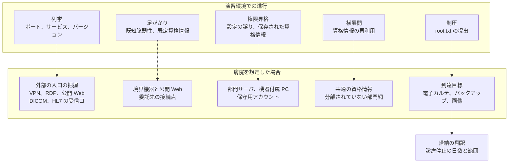
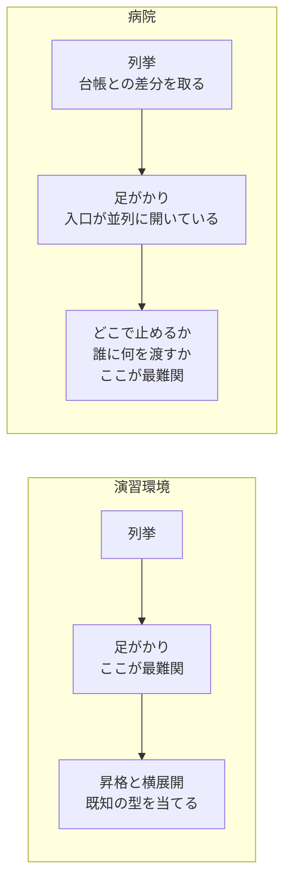
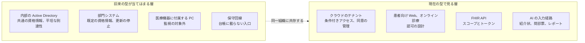
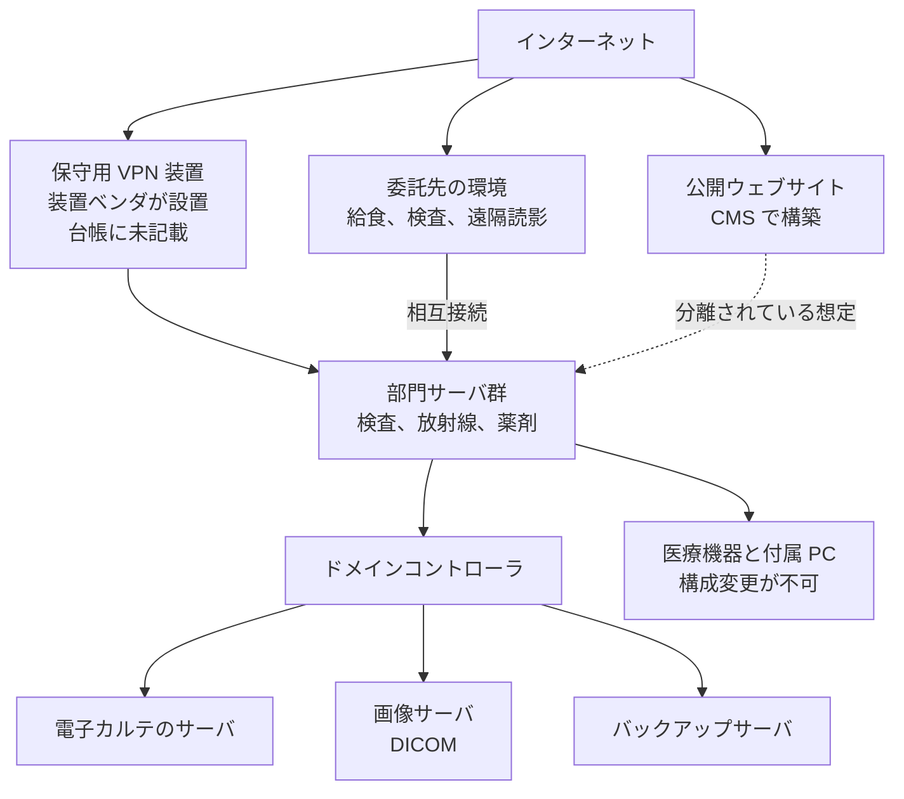

# 🕹️ Hack The Box の型で病院を想定する

演習プラットフォームの [Hack The Box](https://www.hackthebox.com/) で身につく攻略の型が、実在する病院の環境でもそのまま通るのではないか、という見立てがある。

本ページは、まず演習環境の側の仕組みを確認し（[1 節](#1-hack-the-box-という環境)）、そのうえで見立てを一次情報と突き合わせて、当てはまる層と外れる層を分ける。
最後に、演習で身についた手順を実環境に持ち込んだときに何が壊れるかを、段階ごとに挙げる。

> [!NOTE]
> **表記ルール**：本ページでは、**事実**（一次情報で確認できる内容。出典を併記する）と、**分析**（筆者の解釈）を書き分ける。
> 病院の構成として示すものは、公表資料から組み立てた**架空の想定**であり、実在する特定の医療機関を指すものではない。

> [!WARNING]
> 本ページは、許可された環境での学習と、自組織に対する検証の設計に使うことを想定している。
> 権限のない医療機関に対する列挙や検証は行わない。
> 立場ごとにどこで法の線に触れるかは[検証と調査の法的境界](../legal-boundary.md)にまとめている。

---

## 1. Hack The Box という環境

病院の話に移る前に、演習環境の側の用語と仕組みを確定させる。
以下は、いずれも運営が公表している資料による。

### 1.1 何を提供している場か

**事実**：Hack The Box は、攻撃側の技術を実習形式で練習するオンラインの環境である。
公式サイトは、1,500 を超える実習用のラボ、学習コース（Academy）、競技形式の CTF、上位の演習環境（Pro Labs）を提供すると記載し、利用者を 430 万人以上、コミュニティを 20 万人以上としている。
出典：[Hack The Box](https://www.hackthebox.com/)

**分析**：この種の環境は、攻撃側の職種に就く人だけが使うものではない。
防御側の担当者が、攻撃の手順を自分の手で確かめる場としても使われる。
本ページで「演習」と呼ぶのは、許可された標的に対して侵入を試みる、この形の練習を指す。

### 1.2 標的の単位と提出物

**事実**：中心となるコンテンツは Machines と呼ばれる標的の仮想マシンである。
利用者は権限のない状態から侵入し、一般利用者の権限で読める `user.txt` と、管理者権限で読める `root.txt` を提出する。
出典：[Machine Submission Requirements](https://help.hackthebox.com/en/articles/5307061-machine-submission-requirements)（Hack The Box Help Center）

**事実**：入門者向けの Starting Point は三つの階層に分かれており、最後の階層のマシンが「複数の手順をつなぐ」ものとされている。
列挙、初期アクセス、権限昇格を経てシステム権限に達する流れが、そこで示されている。
出典：[Introduction to Starting Point](https://help.hackthebox.com/en/articles/6007919-introduction-to-starting-point)（Hack The Box Help Center）

**分析**：ここに、本ページで「型」と呼ぶものが現れている。
列挙し、足がかりを取り、権限を上げる。
複数台で構成される環境では、これに資格情報の再利用による横展開が加わる。

### 1.3 難易度の区分

**事実**：マシンを投稿する側の要件に、難易度の目安が示されている。

| 難易度 | 手順の数 | 手法 |
|---|---|---|
| Easy | 2 から 3 | 既知の CVE を、改変せずに当てられる |
| Medium | 3 程度 | 既存の実証コードに手を加える必要がある |
| Hard | 3 から 5 | 複数の脆弱性を連鎖させる |
| Insane | 5 以上 | 高度な手法を含んでよい |

出典：[Machine Submission Requirements](https://help.hackthebox.com/en/articles/5307061-machine-submission-requirements)

**事実**：同じ要件は、シナリオを可能な限り現実に近づけること、悪用される欠陥がそのマシンに存在する論理的な理由を持たせること、そして意図された経路（intended path）を示す手順書を添えることを求めている。

**分析**：この定義が、本ページの見立ての土台になる。
病院の環境を「昔の演習マシンに似ている」と言うとき、指しているのは、**既知の CVE を改変せずに当てられ、2 から 3 手順で目的に届く状態**である。
その状態が実在するかどうかは、次節の統計と調査報告書で確かめられる。

意図された経路が用意されているという性質は、[6.1](#61-意図された経路の有無) で扱う。

---

## 2. 「昔の演習マシンに似ている」は、どこまで裏づけられるか

### 2.1 統計が示す入口

**事実**：警察庁がランサムウェアの被害報告から集計した侵入経路は、4 年連続で VPN 機器とリモートデスクトップの合計が有効回答の 8 割前後を占める。
2025 年は VPN 機器が 61 件（66%）、リモートデスクトップが 19 件（21%）、不審メールと添付ファイルが 2 件（2%）である（[日本の統計](../../threats/statistics/japan.md#侵入経路)）。

**事実**：侵入経路とされた機器のパッチ適用状況は、未適用のパッチがあった組織が 40 件、最新のパッチを適用済みだった組織が 31 件である（有効回答 71 件、同上）。

**事実**：厚生労働省が全国の病院に実施した調査（有効回答 5736 施設）では、二要素認証を導入している病院は約 10%（605 施設）である。
導入できない理由の上位は、システム自体が未対応であることと予算不足である（[日本の統計](../../threats/statistics/japan.md#厚生労働省病院における医療情報システムのサイバーセキュリティ対策に係る調査)）。

**分析**：外から到達できる入口が少数のサービスに集中し、そこに既知の脆弱性と単一要素の認証が残っている。
これは、演習環境で「開いているポートを列挙し、製品とバージョンを特定し、公開されている実証コードを当てる」という手順が成立するための条件と同じである。
攻撃側から見れば、独自の道具を用意する理由がない。

### 2.2 報告書が示す経路

国内で調査報告書が公表されている事例を、演習環境での対応物に並べる。

| 事例 | 報告書に記載された経路 | 演習環境での対応物 |
|---|---|---|
| [つるぎ町立半田病院（2021 年）](../../threats/incidents/japan/2021-timeline.md#JP-2021-01) | リモート保守用の VPN 装置が導入以降更新されず、CVE-2018-13379 が放置されていた。同装置の管理者資格情報が窃取され、闇サイトで公開されていた | 公開サービスの既知脆弱性が、そのまま初期侵入になる |
| [大阪急性期・総合医療センター（2022 年）](../../threats/incidents/japan/2022-timeline.md#JP-2022-01) | 給食事業者の VPN 機器から侵入し、RDP で病院の給食サーバへ到達。ウイルス対策ソフトをアンインストールしたうえで、**サーバ間で ID とパスワードが共通**であったため他サーバへ展開した | 一つの資格情報が全台で通る、横展開の型 |
| [国立成育医療研究センター（2021 年）](../../threats/incidents/japan/2021-timeline.md#JP-2021-06) | 公開ウェブサイトの WordPress 管理画面の ID とパスワードが、推測しやすいものであった | 公開 Web の管理画面と、推測できる資格情報 |

**分析**：3 件のいずれも、決め手は新しい攻撃手法ではない。
更新されない境界機器、共通の資格情報、推測できるパスワードである。
半田病院の事例では、2018 年に採番された脆弱性が 2021 年の侵入に使われている。
採番から侵入までの 3 年という間隔は、演習環境の入門帯で扱われる題材の古さと変わらない。

### 2.3 古い構成が残る機構

**分析**：病院で古い構成が残るのは、担当者が更新を知らないからではない。
更新を実行できない条件が、業務と制度の側に置かれている。

| 条件 | 何が起きるか |
|---|---|
| 24 時間 365 日、止められない | 再起動を伴う更新の窓が、年に数回しか取れない。取れた窓は診療系の更新に使われ、境界機器や部門システムは後回しになる |
| 承認を受けた構成である | 医療機器と、その付属 PC は、構成を変えるとメーカーの保証や薬事上の前提から外れうる。院内の判断だけでは更新できない |
| 保守が装置ごとに分かれる | 装置ベンダごとに保守回線と機器が持ち込まれ、誰がどの機器を更新するかが契約で定まらない。半田病院の報告書は、事業者とベンダの双方が脆弱性を認識しながら、担当の範囲外という意識で放置されたと記録している |
| 更新の原資が診療報酬に紐づく | 情報システムの更新は診療の収益に直結しないため、更新周期が長い。二要素認証の導入費用として 1000 万円から 3000 万円が最頻値という調査結果が、この判断の重さを示す |

この 4 条件は互いに補強し合う。
止められないから更新できず、更新できないまま年数が経つと、対応する製品バージョンが提供終了になり、更新の費用が機器の入れ替え費用に変わる。

**分析**：更新を実行できないという条件は、検証の結果の扱いにも及ぶ。
見つけた欠陥を、そのまま塞げないことがある。
薬機法上の承認を受けた構成では、修正の提供がメーカーの検証と手続きを経るため、院内の判断だけでは進まない。
保守用の経路も構成の決定がベンダ側にあり、更新の周期は 7 年から 10 年に及ぶ（[医療機器のセキュリティ](../../technology/medical-devices/README.md)）。
塞げないものは脆弱性の一覧から落とさず、載せたうえで「届かなくする」と「起きたら気付く」に振り分ける。
前者は区画の分離（[ネットワークの分離](../../technology/segmentation.md)）、後者は端末の外側での観測（[検知の設計](../../technology/detection-engineering.md)、[ログと監視の設計](../../technology/logging.md)）に対応する。

---

## 3. 演習の進行と、病院での対応物

演習の進行と、病院を想定した場合の対応を並べる。

**分析**：演習と実務で違うのは、最後の一段である。
演習は所有権の証明で終わるが、病院では到達した先で何が止まるかを言葉にするまでが成果物になる。
[深刻度を、診療と患者安全の言葉に翻訳する](README.md#7-深刻度を診療と患者安全の言葉に翻訳する)に、その変換を整理している。

---

## 4. 段階ごとの読み替え

### 4.1 列挙

演習では、標的の IP が与えられ、全ポートの走査から始まる。
病院を想定する場合、この段の目的は入口の一覧を作ることではなく、**情報システム部門の台帳と、外から見える実際との差分を取る**ことに変わる。
差分に現れるのは、装置ベンダが引いた保守回線、部門で個別に契約したサービス、更新を止めたまま公開が続いている検証用のホストである。

見る対象は、一般的な公開サービスに加えて医療に固有のものが並ぶ。

| 対象 | 見るもの | 参照 |
|---|---|---|
| VPN、リモートデスクトップゲートウェイ | 製品とバージョン、管理画面の到達性、多要素認証の有無 | [外部から見た自組織の攻撃面](../attack-surface.md) |
| DICOM の受信口 | 標準ポート 104 と 11112、Web UI（製品依存、Orthanc は 8042） | [医用画像 OSS の脆弱性](../../technology/oss-vulnerabilities/imaging-pacs.md) |
| HL7 v2 の受信口、FHIR の API | MLLP の待ち受け、FHIR のエンドポイントと認可設計 | [HL7 v2 と FHIR の攻撃面](../../technology/web-security/hl7-fhir.md) |
| 患者向けの Web | CMS の版、管理画面、認証の設計 | [患者用ポータルの脆弱性](../../technology/web-security/patient-portal.md) |
| 証明書透明性ログ、求人、調達公告 | 使用製品、ベンダ名、更新時期 | [医療機関に対する OSINT](../osint.md) |

演習で身につく手つきを、病院に置いたときの帰結に並べる。

| 演習での手つき | 病院で同じことをすると | 代わりに見るもの |
|---|---|---|
| 全 TCP ポートを走査し、応答した順にサービスの版を特定する | 検査機器と生体情報モニタが応答を落とすことがある。専用の実装は、想定しないパケットに弱い | 通信の受動的な観察から機器の一覧を作る |
| SMB の匿名接続で共有と利用者を列挙する | 部門サーバの共有が匿名で読める場合がある。手順書、設定のバックアップ、画像の一時出力が置かれる | 匿名セッションの可否を、設定項目として確認する |
| LDAP の匿名バインドで利用者と部署を引く | 職員の一覧が取れる。医師名と診療科は公開されており、突き合わせると宛先の表になる | 匿名バインドの可否と、公開情報との差分（[医療機関に対する OSINT](../osint.md)） |
| 隠しディレクトリと仮想ホストを探す | 部門システムの管理画面、アプリケーションサーバの管理コンソール、更改前の旧システムが出てくる | 退役したはずの資産が、まだ応答していないか |
| バナーとエラーから製品と版を読む | 医療機器の Web UI は、製品名と版をそのまま返す。保守に必要な情報だからである | 版の情報を必要とする相手と、外から見える範囲を分ける |

**分析**：この段の成果物が、演習と実務で入れ替わる。
演習では「次に何を撃つか」が成果だが、病院では「台帳に載っていないものが何台あったか」が成果になる。
後者は、撃たなくてもそのまま是正の対象になる。

**演習との違い**：外からの観測だけでは、保守回線が一覧に載らない。
装置ベンダごとに引かれた回線は、院内の契約と保守の記録の側にしか名前がないため、通信の観測と、契約書に並ぶベンダ名との突き合わせを両方行う（[医療機器の検証手法](../../technology/medical-devices/testing-methodology.md)）。

**検知側の観測点**：外部からの走査そのものより、**台帳にない機器が応答した事実**を検知の対象にする。
資産の差分は、攻撃の検知よりも早く問題を示す。

### 4.2 足がかり

演習の入門帯では、公開サービスの既知脆弱性、既定のままの資格情報、匿名で読める共有、更新されていない CMS のいずれかが入口になる。
病院を想定した場合、対応するのは境界機器、委託先の接続点、公開 Web である。
[2.2](#22-報告書が示す経路) に挙げた 3 件が、この対応の実例にあたる。

**分析**：入門帯を数多く解いた人ほど、版の一致を調べるより先に、手に入った資格情報を別の場所で試す。
病院では、この順序が実際に当たる。
[半田病院](../../threats/incidents/japan/2021-timeline.md#JP-2021-01)の報告書には、脆弱性を悪用して取得された管理者の資格情報が闇サイトで公開されていた事実が記載されている。
脆弱性そのものより、そこから出た資格情報が生き続けることが、経路を長持ちさせる。

**検証で確かめること**

- 境界機器の版と既知脆弱性の突き合わせ。台帳に載らない保守回線と機器を含める
- 管理画面がインターネットから到達できるか。到達できる場合、多要素認証と接続元の制限があるか
- 退職者と契約終了したベンダのアカウントが残っていないか（[認証とアクセス管理](../../technology/identity.md)）
- 委託先の接続点で、自組織側に置かれた機器と権限がどこまで及ぶか

**演習との違い**：この段の対象には、他社の資産が混じる。
委託先の接続点は自組織の許可だけでは範囲に入らないため、接続先の事業者を含めた許可を開始前の書面で取り付ける（[診断とペネトレーションテスト](README.md#6-実施設計止められない環境でどう安全に測るか)、[検証と調査の法的境界](../legal-boundary.md)）。

### 4.3 権限昇格

演習では、設定の誤り、保存された資格情報、古いカーネル、サービスの実行権限が昇格の起点になる。
病院での対応物には、**運用の都合で意図的に作られた構成**が多く含まれる点が異なる。

演習で定番の昇格経路を、病院での現れ方と緩和に並べる。

| 演習で定番の起点 | 病院での現れ方 | 緩和の方向 |
|---|---|---|
| サービスの実行権限と実行パスの扱い（引用符のないパス、書き込み可能なディレクトリ） | 部門システムの動作条件として、システム権限やローカル管理者権限での実行がメーカーから指定される | 権限を下げられない場合、その端末を分離の対象として扱う |
| 設定ファイルとスクリプトに残る資格情報（グループポリシーの設定、バッチ、手順書） | 保守作業を速くするため、ベンダ用の資格情報が端末や共有フォルダに残る | 共有の棚卸しと、資格情報の探索を定期の作業に組み込む |
| ローカル管理者パスワードの共通化 | 導入時の一括設定が、更改後もそのまま残る | 端末ごとに異なる管理者パスワードを配る仕組みを入れる |
| 高権限での対話ログオンによる資格情報の残留 | ベンダの保守作業の直後、その資格情報が端末に残る | 保守の作業を、専用の端末と経路に限る |
| 個人に紐づかないアカウントの利用 | 交代勤務の現場で、端末に個人単位でログインし直す時間が取れず、部署単位のアカウントが使われる | 認証にかかる時間を短くしたうえで個人に紐づける（[認証とアクセス管理](../../technology/identity.md)） |
| 監視の対象外に置かれた端末 | 医療機器に付属する PC が、承認済み構成のため EDR の導入対象から外れる | ゾーンを分け、端末の外側の通信で観測する（[ログと監視の設計](../../technology/logging.md)） |

**演習との違い**：昇格の経路を塞ぐ相手が、院内にいない場合がある。
メーカーが指定した構成が起点であれば、指摘先は院内の運用ではなく、調達の要件とメーカーへの照会になる。
報告書には、誰が是正を実行できるのかを書き分ける。

### 4.4 横展開

[大阪急性期・総合医療センター](../../threats/incidents/japan/2022-timeline.md#JP-2022-01)の報告書が示す 4 段目は、共通の ID とパスワードによる展開である。
演習で扱う資格情報の再利用と、同じ構造がそのまま本番で成立していた。

演習の Active Directory で定番の手つきは、病院でも成立の条件がそろいやすい。
条件と緩和を並べる。

| 演習で定番の手つき | 病院で成立しやすい条件 | 緩和の方向 |
|---|---|---|
| 権限の関係をグラフにして経路を探す（BloodHound 系） | 更改を重ねた環境ほど、付与された権限が積み上がり、経路が増える | 防御側が先に同じグラフを描く。攻撃者だけが全体像を持つ状態をなくす |
| サービスアカウントのチケットを要求して資格情報を解く（Kerberoasting、AS-REP roasting） | 古い部門システムのサービスアカウントが、弱い暗号種別と短いパスワードで登録されている | サービスアカウントの棚卸し、パスワードの長さ、管理されたアカウントへの移行 |
| 署名を要求しない通信を中継する（NTLM リレー） | 機器と部門サーバで署名の設定が既定のまま。名前解決の偽装と組み合わさる | 署名の強制と、古い名前解決の停止 |
| 証明書の発行テンプレートの権限を使う（AD CS の設定不備） | 院内に証明書の発行基盤があり、テンプレートの権限が広く付与されている | テンプレートごとの権限を確認する |
| 手に入れた資格情報を他のサーバでそのまま試す（パスワードとハッシュの再利用） | 導入時に設定した共通のパスワードが、更改を経ても全台で通る | 分離と、パスワードの個別化 |

観測点と切り出す条件の設計は[検知の設計](../../technology/detection-engineering.md)に対応する。

**検証で確かめること**

- 部門システム（検査、放射線、薬剤、給食）のサーバに、共通のローカル管理者パスワードが設定されていないか
- VLAN が分かれていても、ルーティングで到達できる状態が残っていないか（[ネットワークの分離](../../technology/segmentation.md)）
- バックアップサーバの認証が、業務のドメインと分離されているか
- 検知が働くのはどの操作か。素通りするのはどの操作か（[検知の設計](../../technology/detection-engineering.md)）

**演習との違い**：経路の存在は、権限の関係と設定の確認で示し、実際に多数の端末へ接続して確かめない。
一台ずつ到達を試すと、稼働中の部門システムに接続が積み上がり、障害が起きたときに検証の通信との切り分けができなくなる。

### 4.5 到達目標

演習の目標は、所有権を示すファイルの提出である。
病院を想定した検証では、目標を診療の言葉で定義する。

| 到達目標 | 何を示すか |
|---|---|
| バックアップの削除、暗号化が可能な権限に到達できるか | 復旧の可否そのもの。[半田病院](../../threats/incidents/japan/2021-timeline.md#JP-2021-01)はオフラインで保管していたバックアップで復旧した |
| 電子カルテのデータベースサーバに到達できるか | 診療の停止範囲 |
| 画像サーバの画像を書き換えられるか | 完全性の毀損。読影の判断に届く（[完全性への攻撃と患者安全](../../threats/integrity-attacks.md)） |
| 部門システムをまたいで到達できるか | 復旧に要する期間。[大阪急性期の事例](../../threats/incidents/japan/2022-timeline.md#JP-2022-01)では、基幹システムの再稼働に 43 日、診療システム全体の復旧に 73 日を要している |

**演習との違い**：到達を証明として扱い、破壊の操作は行わない。
権限を得た事実を記録した時点で、その到達目標は終わりにする。

### 4.6 データの取り扱い

演習では、標的の中を探索してファイルを集める行為が得点になる。
病院では、この行為が範囲の外に置かれる。

到達した先に実在する患者データがある場合、閲覧した事実そのものを記録し、依頼元へ報告することになる。
取得や複製に及べば、組織として漏えい等の報告を検討する事態にもなる（[検証と調査の法的境界](../legal-boundary.md)）。
検証は、ステージング環境と合成データで行い、本番環境で実データに到達した場合は、その時点で停止して報告する手順を、開始前に文書化しておく。

---

## 5. 演習の癖が事故になる箇所

| 演習で身につく習慣 | 病院で起きること | 代わりに置くもの |
|---|---|---|
| 全ポートへの高速な走査から始める | 機器が応答を停止する。診療中であれば検査が止まる | 受動的な観察を先に終え、能動的な確認は同型機で影響を確かめてから、時間帯を合意して行う |
| 公開されている実証コードをまず当てる | サービスが停止し、復旧がメーカーの保証の外に出る | 版の特定と到達性で止める。悪用可能性の証明は隔離環境で行う |
| 名前解決の応答を偽装して資格情報を待つ | 同一セグメントの機器の通信が壊れる | 対象セグメントを書面で限定し、機器が同居する区画を除外する |
| 資格情報の総当たりとスプレーを回す | アカウントがロックされ、診療系の共有アカウントであれば診療が止まる | ロックの閾値を先に確認し、対象アカウントと試行数を合意する |
| 最高権限の取得で終える | 経営層に判断材料が渡らない。是正の予算が付かない | 到達点を診療停止の範囲と日数に翻訳して報告する |
| 目についたファイルを回収する | 実在する患者データに触れる | 到達で停止し、報告する。検証は合成データで行う |
| 作業の記録を残さない | 障害が起きたとき、検証との切り分けができない | 送信元 IP を固定し、時刻を同期し、実施した操作の記録を提出物に含める |

**分析**：この表の左側は、いずれも演習では正しい判断である。
標的が使い捨ての仮想マシンであり、壊れても再作成できることが前提になっているためである。
実環境では、この前提だけが成り立たない。

---

## 6. 演習を解く側の視点で見た差

演習を数多く解いた人が実環境に来たとき、何がずれて、何がそのまま効くのかを四つに分けて挙げる。

### 6.1 意図された経路の有無

演習のマシンには作者がいて、解ける経路が用意されている。
行き止まりは意図的に置かれ、そこで消耗するのも設計のうちである。

実環境には作者がいない。
帰結は三つある。

**分析**：第一に、経路が一つに絞られていない。
外から届く入口が複数あり、どれも「意図された」ものではない。
[2.1](#21-統計が示す入口) の統計が示すのは、その入口の分布が VPN 機器とリモートデスクトップに偏っているという事実である。
演習であれば作者が一本の経路を隠すところを、実環境では同種の入口が並列に開いている。

第二に、行き止まりの意味が変わる。
演習の行き止まりは時間を失うだけだが、実環境では「刺さるが撃てない」という別種の行き止まりが現れる。
稼働中の機器、保証の範囲を外れる操作、ロックすると診療が止まるアカウントがそれにあたる。
撃たずに止める判断は、演習では練習できない。

第三に、難所の位置が入れ替わる。
演習では足がかりの確保が最も難しく、そこを越えれば残りは既知の型を当てる作業に近づく。
病院では足がかりまでが最も易しく、そこから先の「どこまでやるか」「誰に何を渡すか」の判断が難所になる。

### 6.2 走査のうるささと、滞在の時間

演習では、走査の速度も試行の回数も自由である。
検知する側がいないからである。

実環境では、そのうるささ自体が測定の対象になる。
[5 節](#5-演習の癖が事故になる箇所)の表の左側に並べた操作について、どれで警報が上がり、どれが素通りしたかが、報告書の中身になる。

**分析**：滞在の時間も違う。
演習は数時間で終わるが、侵入した攻撃者は数週間から数か月にわたって内部にとどまることがある。
短時間の集中で到達できたかどうかより、**長い時間をかけたときに気付ける仕組みがあるか**が、防御側にとっての問いになる。
その設計は[検知の設計](../../technology/detection-engineering.md)と[ログと監視の設計](../../technology/logging.md)に対応する。

### 6.3 難易度の尺度で言えば、どのあたりか

**分析**：[1.3](#13-難易度の区分) の定義を借りると、病院の層ごとの見立ては次のようになる。
これは公表資料から組み立てた推定であり、個別の医療機関の実測ではない。

| 層 | 演習の尺度で言えば | 根拠と理由 |
|---|---|---|
| 外部境界（VPN、リモートデスクトップ） | Easy 相当 | 既知の脆弱性と単一要素の認証。二要素認証の導入は約 10%（[2.1](#21-統計が示す入口)） |
| 内部の Active Directory | Easy から Medium | 共通の資格情報と平坦な到達性。[大阪急性期の 4 段目](../../threats/incidents/japan/2022-timeline.md#JP-2022-01)がその形 |
| 部門システム | Easy 相当 | 既定の資格情報、更新の停止、メーカー指定の高権限実行 |
| 患者向け Web、クラウド | Medium 相当 | 他業種と同じ現代の設計であり、旧来の型では測れない（[7 節](#7-10-年前の検証で外す層)） |
| 医療機器 | Hard 相当 | 情報が少なく、専用のプロトコルで、壊すと戻せない |
| 検知の回避 | 層による | 監視の対象外の端末が残る一方、監視が入っている層では現代的な水準にある |

**分析**：難度が低いことは、防御側に残された時間が短いことを意味する。
Easy 相当の手つきで境界を越えられ、内部でも同じ水準の手つきが通るなら、侵入から診療の停止までの間隔は短い。
[大阪急性期の事例](../../threats/incidents/japan/2022-timeline.md#JP-2022-01)では、外部の入口から電子カルテを含む基幹システムまでが一続きの経路として報告されている。

一方、医療機器の層が上級なのは、防御が厚いからではない。
検証する側が壊せない、という制約が難度を上げている。
攻撃者の側にはその制約がないため、**同じ層でも、攻撃側と検証側で難度が逆転する**。
この非対称は、機器を「対象外」にしたまま放置する理由にはならない（[医療機器の検証手法](../../technology/medical-devices/testing-methodology.md)）。

### 6.4 演習で鍛えた力のうち、病院で効くもの

**分析**：ずれる部分ばかりではない。

**列挙を尽くす習慣**：演習で最も時間を使うのは列挙であり、解けない原因の多くは見落としである。
病院では、この習慣がそのまま資産の棚卸しに対応する。
台帳に載らない保守回線と退役していない資産は、列挙の網の細かさでしか見つからない（[外部から見た自組織の攻撃面](../attack-surface.md)）。

**単発ではなく連鎖で考える力**：演習では、単体では低い評価の欠陥をつないで到達する。
病院の報告書に現れる経路も同じ形である。
深刻度の高い指摘を並べるより、低い指摘の連鎖が到達目標に届くことを示すほうが、判断に使える（[医療の脅威モデリング](../threat-modeling.md)）。

**通らなかった経路を記録する習慣**：演習では試行の記録が次の一手を決める。
検証では、この記録が防御側の資料になる。
「試したが通らなかった」という記録は、どの対策が効いているかを示す数少ない材料になる。
報告書に、通った経路と同じ重みで載せる。

---

## 7. 「10 年前の検証」で外す層

**分析**：病院の環境を一様に古いものとして扱うと、見落とす層がある。
古さは層ごとに異なり、同じ組織の中で年代が混在している。

境界の外側と、患者に向いた面は、他業種と同じ現代の攻撃面を持つ。
[患者用ポータルの脆弱性](../../technology/web-security/patient-portal.md)、[HL7 v2 と FHIR の攻撃面](../../technology/web-security/hl7-fhir.md)、[AX：医療における AI のセキュリティ](../../technology/dx-ax/ai-security.md)が対応する。
一方、内部と機器の層は旧来の型で当たる。

**分析**：この混在は、検証の設計に二つの帰結をもたらす。
第一に、旧来の型だけで臨むと、クラウドのテナント設定と患者向けサービスの認可という、いま増えている攻撃面を素通りする。
第二に、現代的な手法だけで臨むと、報告書に載る指摘が実際の侵入経路とずれる。
統計が示す侵入経路は、依然として VPN 機器とリモートデスクトップである（[2.1](#21-統計が示す入口)）。

---

## 8. 商用のメニューでは、どこで切られているか

医療分野向けにペネトレーションテストを提供する事業者のサービスは、演習で一続きに進む段階が、別々の商品として切り分けられている。
発注の単位はこの切り方に従うため、何を買うと何が見えないかも、ここで決まる。

> [!NOTE]
> 以下に挙げる事業者は、メニューの構成を公表資料で確認できる例として示すものであり、推奨ではない。
> 区分の考え方と選び方は[セキュリティサービスのカタログ](../../reference/security-services/)にまとめている。

### 8.1 情報システム向けのメニュー

**事実**：医療分野に特化する Fortified Health Security（米国）は、ペネトレーションテストを内部ネットワーク、外部ネットワーク、無線ネットワーク、アプリケーションの 4 区分で提供し、これとは別にレッドチーム演習を置いている。
レッドチーム演習は、フィッシング、ソーシャルエンジニアリング、物理的な侵入、潜伏した横展開を組み合わせ、防御側に知らせずに実施すると記載している。
出典：[Fortified Health Security](https://fortifiedhealthsecurity.com/services/advisory-services/advanced-penetration-testing/)

**事実**：ScienceSoft は、医療向けの対象として、公開網と内部網、患者ポータル、モバイルの医療アプリ、EHR と EMR、接続された医療機器、オンプレミスとクラウドの保管先を挙げる。
手法は、外部、内部、アーキテクチャとコードのレビュー、規制に対応づけた検証、ソーシャルエンジニアリング（フィッシング、電話による詐称、ビジネスメール詐欺）に分かれる。
出典：[ScienceSoft](https://www.scnsoft.com/healthcare/penetration-testing)

**事実**：Meditology Services は、医療環境での経験を前提に、機微なシステムとデータを危険にさらさない手法をとると述べ、結果を HIPAA、HITRUST、NIST に対応づけると記載している。
出典：[Meditology Services](https://www.meditologyservices.com/services/penetration-testing/)

**事実**：GMO サイバーセキュリティ byイエラエは、医療情報システムの安全管理に関するガイドラインへの対応支援として、情報資産の可視化と対策方針の策定、監視、事故対応を挙げ、対象の例に Web サイト、患者名簿とカルテの管理システム、処方箋の情報システム、サーバ、PC、ネットワーク機器、クラウドを示している。
出典：[GMO サイバーセキュリティ byイエラエ](https://gmo-cybersecurity.com/service/guideline/medical-system/)

**分析**：国内では、医療向けと明示したメニューを公表する事業者が、海外の医療特化事業者ほど見当たらない。
発注する側が、汎用のメニューから対象と範囲を組み立てることになる。

### 8.2 医療機器向けのメニュー

**事実**：NetSPI は、医療機器のペネトレーションテストの対象として、ファームウェアの解析、ハードウェアの調査、無線の設定、ネットワークの解析、シッククライアントのアプリケーション、モバイルアプリケーション、センサのデータ、プライバシーと追跡、**患者安全に関わりうる問題**を挙げ、FDA の市販前ガイドラインへの適合の確認に位置づけている。
出典：[NetSPI](https://www.netspi.com/netspi-ptaas/hardware-systems/medical-device/)

**事実**：UL Solutions は、脅威モデルの解析、脆弱性スキャンとバイナリ解析、セキュリティ機能の確認とその回避、通信のプロトコルとパケットの解析、暗号に対する検証を挙げている。
出典：[UL Solutions](https://www.ul.com/services/medical-device-penetration-testing-services)

**事実**：Blue Goat Cyber は、FDA の市販前提出に向けて、脅威モデリング、SBOM、ペネトレーションテストを組み合わせる形を示し、検証を機器本体、ファームウェア、BLE と RF、クラウド側、Web、API、モバイル、ネットワーク、無線に分けている。
出典：[Blue Goat Cyber](https://bluegoatcyber.com/services/medical-device-cybersecurity/)

**事実**：国内では、東陽テクニカが医療機器を含む機器のセキュリティ検証を提供している（[国内のセキュリティサービス](../../reference/security-services/japan.md#診断とペネトレーションテスト)）。

### 8.3 メニューと段階の対応

| 商用のメニュー | 本ページの段階 | 買わなかった場合に見えないもの |
|---|---|---|
| 外部ネットワーク | [4.1 列挙](#41-列挙)、[4.2 足がかり](#42-足がかり) | 台帳に載らない保守回線、委託先の接続点 |
| 内部ネットワーク | [4.3 権限昇格](#43-権限昇格)、[4.4 横展開](#44-横展開) | 共通の資格情報が通る範囲、バックアップへの到達 |
| 無線ネットワーク | 対応する段階がない | 不正なアクセスポイント、機器が接続する無線の保護 |
| アプリケーション | [4.2 足がかり](#42-足がかり) | 患者向けサービスの認可設計 |
| ソーシャルエンジニアリング | [4.2 足がかり](#42-足がかり) | ヘルプデスクの本人確認、多要素認証の再登録 |
| レッドチーム | [4.1](#41-列挙) から [4.5](#45-到達目標) を通したもの | 検知と対応が働くかどうか |
| 医療機器 | [4.3 権限昇格](#43-権限昇格)、[4.5 到達目標](#45-到達目標) | 機器の側から入る経路、患者安全に届く欠陥 |

**分析**：第一に、演習では一台の中で連続する段階が、商用では別の商品に分かれる。
外部ネットワークの診断だけを発注すると、報告書には入口の指摘までしか載らない。
半田病院と大阪急性期の経路は、いずれも外部の入口から内部の横展開までをまたいでおり、この境目で切ると経路の後半が測られないまま残る。
到達目標を先に決めて発注するのは、この切断を避けるためである（[実施設計](README.md#6-実施設計止められない環境でどう安全に測るか)）。

第二に、無線が独立した区分として置かれている。
演習の型には対応物がない。
病院では、端末、輸液ポンプ、生体情報モニタが無線に載っており、無線そのものが診療の基盤である。
配置の設計は[ネットワークの分離](../../technology/segmentation.md)に対応する。

第三に、医療機器のメニューには「患者安全に関わりうる問題」が独立した対象として置かれている。
権限の取得でも情報の露出でもない軸であり、演習の得点には存在しない。
型をそのまま持ち込むと、この軸が報告書から抜ける。

**分析**：規制との対応づけをメニューに含める形は、海外の医療特化事業者に共通する（HIPAA、HITRUST、NIST、FDA）。
国内では、対応づけの先が医療情報システムの安全管理に関するガイドラインと、立入検査で使われるチェックリストになる（[規制が求める検証](README.md#5-規制が求める検証)）。
発注の時点で「どの文書のどの項目に対応づけて報告するか」を指定しておくと、成果物を検査と監査の備えに再利用できる。

---

## 9. 演習の題材を用意する

### 9.1 架空の病院を組む

学習の題材として、公表資料から組み立てた架空の構成を置く。
実在する医療機関の構成ではない。

到達目標を三つ定めると、演習として成立する。

1. 委託先の接続点から、部門サーバまで到達できるか。到達したとき、どの記録に痕跡が残るか
2. 部門サーバから、バックアップサーバの認証を突破できるか。バックアップが業務のドメインと分離されているか
3. 画像サーバに書き込み権限を得られるか。書き換えが起きた場合、読影の側で気付けるか

**分析**：3 番目の問いは、演習環境にはない論点である。
可用性の毀損は現場がすぐに気付きやすいが、完全性の毀損は気付かれないまま診療の判断に入りうる。
攻撃の成否ではなく、検知の有無を問う形にすると、演習の成果が防御側の設計に移る。

環境の構築には、公開されている実装を使える。
[OpenEMR](../../technology/oss-vulnerabilities/ehr-systems.md)、[Orthanc](../../technology/oss-vulnerabilities/imaging-pacs.md)、[Mirth Connect と HAPI FHIR](../../technology/web-security/hl7-fhir.md) は、いずれも検証環境の作り方が各ページにある。
患者データは [Synthea](https://github.com/synthetichealth/synthea) が生成する合成データを使い、実在する患者のデータは載せない。

### 9.2 医療を題材にしたマシンでは、何が問われているか

医療を題材にしたマシンを二つ取り上げる。
どちらも公開期間を終えており（retired）、攻略の解説が公開されている。

> [!NOTE]
> 以下は、公開されている解説にもとづく要約である。
> 手順もコードも載せず、どの段で、どの種類の弱点が使われたかだけを示す。

**事実**：Doctor は Linux のマシンで、難易度は Easy、2020 年 9 月 26 日に公開された。
題材は、医療者向けの院内メッセージのアプリケーションである。
出典：[Hack The Box: Doctor](https://www.hackthebox.com/machines/doctor)

| 段 | 使われた弱点 | 本ページの段階 |
|---|---|---|
| 1 | 開いているのは SSH、HTTP、そして 8089 番の Splunk。HTTP のページに載ったメールアドレスから、別の仮想ホスト名が分かる | [4.1 列挙](#41-列挙) |
| 2 | その仮想ホストの投稿フォームで、入力がテンプレートの文字列に連結されたまま描画される（サーバ側テンプレートインジェクション）。Web の実行アカウントでコマンドが動く | [4.2 足がかり](#42-足がかり) |
| 3 | Web の実行アカウントがログ閲覧のグループに属しており、ログにパスワード再設定の要求がパスワードごと記録されていた。その資格情報が別の利用者で通る | [4.3 権限昇格](#43-権限昇格) |
| 4 | root 権限で動く Splunk の管理機能に、その資格情報で認証できる。管理機能はアプリの導入を通じてコマンドを実行できる | [4.3 権限昇格](#43-権限昇格) |

出典：[HTB: Doctor](https://0xdf.gitlab.io/2021/02/06/htb-doctor.html)（0xdf による解説）

**事実**：Hospital は Windows のマシンで、難易度は Medium、2023 年 11 月 18 日に公開された。
Windows のドメインコントローラと、Web を提供する Ubuntu の仮想マシンで構成される。
出典：[Hack The Box: Hospital](https://www.hackthebox.com/machines/hospital)

| 段 | 使われた弱点 | 本ページの段階 |
|---|---|---|
| 1 | Windows 側に SMB、Kerberos、LDAP、RDP が開き、別のポートで Linux 側の Web が待ち受けている | [4.1 列挙](#41-列挙) |
| 2 | Web のファイルアップロードで拡張子の検査を回避でき、Web の実行アカウントでコードが動く | [4.2 足がかり](#42-足がかり) |
| 3 | Ubuntu のカーネルに、既知の権限昇格の欠陥が残っている | [4.3 権限昇格](#43-権限昇格) |
| 4 | 取り出したパスワードのハッシュが解け、その資格情報が **Windows 側でもそのまま通る** | [4.4 横展開](#44-横展開) |
| 5 | Web メールの本文に、EPS ファイルを Ghostscript で処理する運用が書かれている。その処理に既知の欠陥があり、ファイルを開かせるだけでコマンドが実行される | [4.2 足がかり](#42-足がかり)（Windows 側） |
| 6 | 自動処理のスクリプトに、管理者の資格情報が平文で書かれている | [4.3 権限昇格](#43-権限昇格) |

出典：[HTB: Hospital](https://0xdf.gitlab.io/2024/04/13/htb-hospital.html)（0xdf による解説）

**事実**：解説が 3 段目と 5 段目で挙げている欠陥は、いずれも NVD に登録されている。
[CVE-2023-36664](https://nvd.nist.gov/vuln/detail/CVE-2023-36664) は、Ghostscript 10.01.2 より前の版におけるパイプ指定の権限検証の不備である。
[CVE-2023-2640](https://nvd.nist.gov/vuln/detail/CVE-2023-2640) と [CVE-2023-32629](https://nvd.nist.gov/vuln/detail/CVE-2023-32629) は、Ubuntu カーネルの overlayfs で、権限のない利用者が拡張属性を設定できるものである。
[CVE-2023-35001](https://nvd.nist.gov/vuln/detail/CVE-2023-35001) は、Linux カーネルの nftables における領域外の読み書きである。

**分析**：2 台とも、中盤から後半は病院の実環境に近い。
Doctor の 3 段目（ログに残った資格情報）と 4 段目（高い権限で動く管理機能が、認証だけで守られている）は、監視や転送のエージェントを入れた環境でそのまま見る構図である（[ログと監視の設計](../../technology/logging.md)）。
Hospital の 4 段目は、[大阪急性期の 4 段目](../../threats/incidents/japan/2022-timeline.md#JP-2022-01)と同じ形で、片方で得た資格情報がもう片方でも通ることだけで経路がつながっている。
6 段目の平文の資格情報も、[4.3 権限昇格](#43-権限昇格)の表に挙げた形である。

一方、序盤は医療と関係がない。
テンプレートエンジンへの入力の渡し方も、アップロードの拡張子の検査も、どの業種の Web でも同じ形で現れる。
そして 2 台のどちらにも、DICOM も HL7 も、医療機器も、承認済み構成による更新の制約も出てこない。
題材の名前が医療であることと、問われる弱点が医療固有であることは別である。

例外は Hospital の 5 段目である。
この段だけは、医療の運用に読み替えられる。
利用者に文書を開かせる経路であり、紹介状、検査レポート、添付された画像を日常的に開く病院では、同じ構図が成立しうる。

### 9.3 演習コンテンツで身につく範囲

**事実**：Pro Labs は、Active Directory を中心にした企業ネットワークの模擬環境として提供されており、現在は Red Team Operator I から IV の構成である。
出典：[Hack The Box: Pro Labs](https://www.hackthebox.com/hacker/pro-labs)

**分析**：一台では扱えない横展開は、この形の複数台の環境で練習できる。
ただし、[9.2](#92-医療を題材にしたマシンでは何が問われているか) で見たとおり、演習で問われるのは汎用の Web と OS の弱点であり、[4 節](#4-段階ごとの読み替え)で挙げた医療固有の面は題材になりにくい。
それらは**壊せない資産と止められない業務**という条件があって初めて難度になり、その条件は使い捨ての仮想マシンでは再現できないためである。

したがって、既存の演習コンテンツで身につくのは、手順の型と Active Directory の経路までである。
医療固有の面は、[9.1](#91-架空の病院を組む) で組んだ環境で足すことになる。

---

## 10. 合法に手を動かせる場

| 場 | 得られるもの |
|---|---|
| [Hack The Box](https://www.hackthebox.com/) などの演習プラットフォーム | 手順の型と Active Directory の経路。医療固有の面は含まれないため、自前の環境で補う（[9 節](#9-演習の題材を用意する)） |
| 自前で組んだ環境（[9.1](#91-架空の病院を組む)） | 医療のプロトコルと業務の流れ。合成データで完結する |
| [Biohacking Village の Device Lab](../../reference/labs-communities/biohacking-village.md) | メーカーが持ち込んだ実機。国内では CODE BLUE の併設で開催されている |
| [医療分野のバグバウンティと脆弱性開示](../bug-bounty/) | 受け入れ側が定めた範囲での、実サービスに対する報告経路 |
| 自組織または受託先に対する検証 | 書面の許可のもとでの実環境。[実施設計](README.md#6-実施設計止められない環境でどう安全に測るか)に従う |

**分析**：この一覧は難度の順ではなく、**許可の強さ**の順に並んでいる。
下に行くほど扱う環境は実務に近づき、その分、開始前に取り付ける許可の範囲と書面の量が増える。

---

## 関連ページ

- [診断とペネトレーションテスト](README.md)：領域ごとの検証観点、実施設計、報告の形
- [外部から見た自組織の攻撃面](../attack-surface.md)：台帳と実際のずれ、測ってよい範囲の線引き
- [医療の脅威モデリング](../threat-modeling.md)：検証の前に、どこを見るかを決める
- [検証と調査の法的境界](../legal-boundary.md)：立場ごとの線、許諾の文面
- [医療機器の検証手法](../../technology/medical-devices/testing-methodology.md)：機器に触れる場合の順序と制約
- [ネットワークの分離](../../technology/segmentation.md)：横展開が止まる条件
- [検知の設計](../../technology/detection-engineering.md)：どの操作を、どこで観測するか
- [日本の統計](../../threats/statistics/japan.md)：侵入経路と備えの実測値
- [セキュリティサービスのカタログ](../../reference/security-services/)：区分の考え方、国内と海外の事業者。掲載は推奨ではない

---

[← 診断とペネトレーションテスト](README.md) | [検証と実務](../README.md) | [トップへ](../../../README.md)
