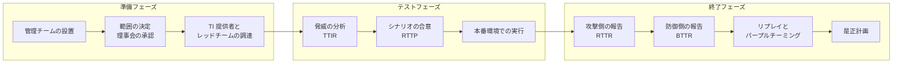
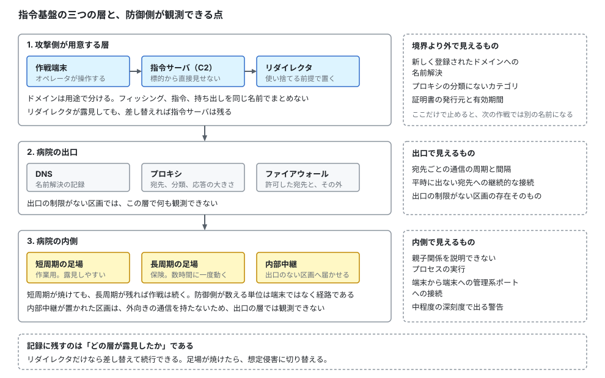
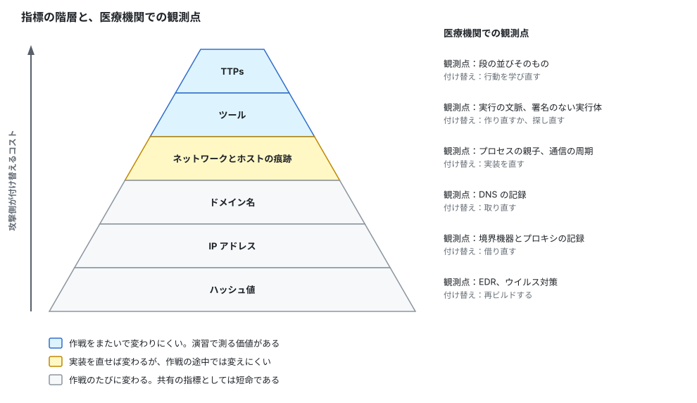
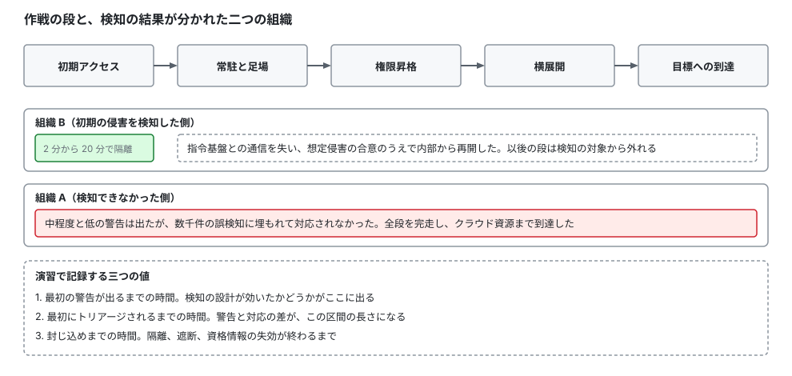
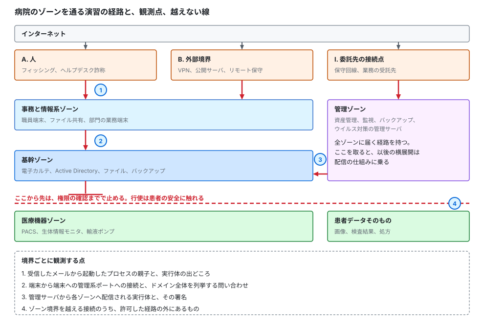
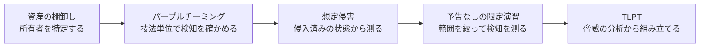

# 🎭 レッドチームと TLPT を医療機関に当てはめる

「レッドチーム」と「TLPT」は、どちらも脆弱性診断より一段上の検証として発注されるが、指すものが違う。
本ページは、まず二つの語が何を意味するかを、この分野の経験がない読者に向けて定義する（[1 節](#1-二つの語が指すもの)）。
そのうえで、TLPT を制度にしている金融の枠組みから工程と主体を取り出し（[2 節](#2-tlpt-の登場人物と工程)、[3 節](#3-tlpt-を制度にした枠組み)）、攻撃側を担う Red Team Operator の仕事の中身を、規制文書が定めた要件に照らして示す（[4 節](#4-レッドチームオペレータの仕事の中身)）。
潜伏（ステルス）が要件になる理由と、対になる検知の設計を [5 節](#5-潜伏ステルスを要件にする理由)に置き、医療機関に当てはめたときに変わる点を [6 節](#6-医療機関に当てはめると変わる点)以降で扱う。

> [!NOTE]
> **表記ルール**：本ページでは、**事実**（一次情報で確認できる内容。出典を併記する）、**報道ベース**（報道や第三者の集計のみで確認でき、当事者の公表資料では裏付けが取れていない内容）、**分析**（筆者の解釈）を書き分ける。
>
> **略語の衝突**：本リポジトリは `RTO` を目標復旧時間（Recovery Time Objective）の意味で使っている（[用語集](../../reference/GLOSSARY.md)）。
> 本ページで扱う Red Team Operator は、以後「レッドチームオペレータ」と書く。
> 医療機関の会議で `RTO` と略すと、事業継続の担当者には別の語として届く。

> [!WARNING]
> 本ページは、自組織に対する検証の設計と、発注、受注の判断に使うことを想定している。
> 権限のない組織に対する検証は行わない。
> 立場ごとにどこで法の線に触れるかは[検証と調査の法的境界](../legal-boundary.md)にまとめている。
> 稼働中の医療情報システムと、患者が接続された医療機器を対象にする場合の前提は、[診断とペネトレーションテスト](README.md#6-実施設計止められない環境でどう安全に測るか)に置いた。

---

## 1. 二つの語が指すもの

### 1.1 レッドチームは何をする側か

レッドチームは、攻撃者の立場で組織への侵入を試みる側を指す。
これに対してブルーチームは、検知と対応を担う防御側を指す（[セキュリティの基礎](../../reference/security-basics.md)）。
両者を同じ卓に着かせ、攻撃の手を一つずつ再現しながら検知が働くかを確認する作業を、**パープルチーミング**と呼ぶ。

脆弱性診断との違いは、測る対象にある。
脆弱性診断が測るのは対象システムの欠陥である。
レッドチーム演習が測るのは、防御側の検知と対応である。
攻撃側の活動は、後者では手段であって成果物ではない。

この違いは、成功の定義を反転させる。
診断では、欠陥を多く挙げたほうが良い成果になる。
レッドチーム演習では、防御側が早く気付いたほうが組織にとって良い結果であり、攻撃側が最後まで気付かれなかった場合、報告書に残るのは「検知が働かなかった」という所見になる。

### 1.2 レッドチームオペレータは何をする人か

**レッドチームオペレータ**は、レッドチーム演習で攻撃側の実作業を担う要員を指す。
担う作業は、攻撃の実行だけではない。
指令基盤（C2）の構築、検知を避ける実装の用意、初期アクセスの獲得、足場の維持、権限の昇格、目標への到達、そして実施した操作の秒単位の記録と、テスト終了後の撤収までが含まれる（[4.2](#42-一件の作戦で何をするか)）。

脆弱性診断の担当者との最大の違いは、**見つからないことが要件に入る**点にある。
診断では、走査の音が大きくても成果は変わらない。
レッドチーム演習では、露見した時点でその経路は使えなくなり、以後の段が測れなくなる。
このため、作業の設計に運用上の秘匿（OPSEC）という軸が加わる。

### 1.3 TLPT は何を測る枠組みか

**TLPT（Threat-Led Penetration Testing）**は、日本語では「脅威ベースのペネトレーションテスト」と訳される。
レッドチーム演習との違いは、攻撃シナリオの出どころを脅威インテリジェンスに固定し、工程と成果物を枠組みとして定めている点にある。
「腕のいい攻撃者に自由にやってもらう」のではなく、「この組織を現に狙っている集団が使う手口を、その手口だけを使って再現する」形をとる。

**事実**：欧州中央銀行（ECB）の TIBER-EU は、この形式の検証を、対象事業体の重要または重大な機能（critical or important functions）と、それを支える人、手順、技術に対する、統制された、対象ごとに設計された、インテリジェンス主導のレッドチームテストと定義し、実在する脅威アクターの TTPs を模倣するものとしている。
目的は、防御、検知、対応の能力の評価に置かれる。
出典：[TIBER-EU FRAMEWORK（2025 年 1 月）](https://www.ecb.europa.eu/pub/pdf/other/ecb.tiber_eu_framework_2025~b32eff9a10.en.pdf)

**事実**：金融庁のガイドラインは、TLPT の実施にあたって留意する点として、脅威インテリジェンスを踏まえて実際の攻撃者が行う水準の技術を用いること、深刻だが現実に起こりうる脅威シナリオを計画で考慮すること、防御側の担当者（ブルーチーム）による防御、検知、報告、封じ込めの能力を評価すること、本番環境を用いてブルーチームに予告せずに実施することを挙げている。
出典：[金融分野におけるサイバーセキュリティに関するガイドライン（令和 6 年 10 月 4 日）](https://www.fsa.go.jp/common/law/cybersecurity_guideline.pdf) 2.2.4【対応が望ましい事項】b

### 1.4 レッドチーム演習、TLPT、パープルチーミングの違い

脆弱性スキャンからバグバウンティまでを含む区分は[診断とペネトレーションテスト](README.md#1-用語を分ける)に置いた。
ここでは、そこで一行にまとめた「レッドチーム演習」の内側を三つに割る。

| | シナリオの出どころ | 防御側への予告 | 工程の定め | 主な成果物 |
|---|---|---|---|---|
| **レッドチーム演習** | 実施者の裁量 | しない | 契約ごと | 攻撃の時系列と、検知の記録 |
| **TLPT** | 対象組織を狙う脅威の分析（脅威インテリジェンス） | しない。実施を知るのは、範囲と中止を決める少数に限る | 枠組みが規定（準備、テスト、終了） | 上記に加えて、防御側の記録と是正計画。制度として実施する場合は当局への報告 |
| **パープルチーミング** | 検証したい技法を先に選ぶ | する。同席する | 技法単位 | 技法ごとに、検知が働いたかどうかの表 |

**分析**：三つは代替ではなく順序である。
検知の作りが分からない段階でパープルチーミングを行えば、どの技法が見えていないかが技法単位で分かる。
その穴を埋めたあとに予告なしの演習を行えば、埋めた検知が実戦の速度で働くかが分かる。
TLPT は、その演習に脅威の裏づけと、記録と是正の手順を足したものにあたる（[7 節](#7-実施までに踏む段階)）。

---

## 2. TLPT の登場人物と工程

### 2.1 六つの主体と、知らされる範囲

**事実**：TIBER-EU が挙げる主体は、管理チーム（Control Team、CT）とその責任者（CTL）、ブルーチーム（BT）、脅威インテリジェンス提供者（TIP）、レッドチームのテスター（RTT）、当局側の TIBER Cyber Team（TCT）とテストマネージャ（TM）、および関係する政府の情報機関または国のサイバーセキュリティセンターである。
2025 年 1 月版で、従来の White Team は Control Team に改称された。
出典：[TIBER-EU FRAMEWORK（2025 年 1 月）](https://www.ecb.europa.eu/pub/pdf/other/ecb.tiber_eu_framework_2025~b32eff9a10.en.pdf)、[TIBER-EU Framework updated to align with DORA（2025 年 2 月 11 日）](https://www.ecb.europa.eu/press/intro/news/html/ecb.mipnews250211.en.html)

| 主体 | 担うこと | テストの実施を知っているか |
|---|---|---|
| 管理チーム（CT、CTL） | 範囲とシナリオの決定、事業者の調達、リスク管理、中止の判断 | 知っている |
| ブルーチーム（BT） | 検知と対応。評価される側 | **知らない** |
| 脅威インテリジェンス提供者（TIP） | 対象組織を狙う脅威の分析と、攻撃シナリオの作成 | 知っている |
| レッドチームのテスター（RTT） | シナリオの実行 | 知っている |
| 当局（TCT、TM） | 枠組みへの適合の確認、範囲とシナリオの検証 | 知っている |
| 情報機関、国のサイバーセキュリティセンター | 脅威情報の提供 | 関与する場合に限る |

**分析**：この枠組みの要は、知らされる範囲を意図的に狭めることにある。
ブルーチームが知らないからこそ、検知が働いたかどうかを測れる。
一方で、知らない担当者が本物の攻撃と誤認して過剰な対応を取れば、業務が止まる。
管理チームは、この二つを両立させるために置かれている（[6.3](#63-管理チームに誰を入れるか)）。

### 2.2 三つのフェーズ

**事実**：TIBER-EU は、準備（preparation）、テスト（testing）、終了（closure）の三つのフェーズからなる工程を定めている。
準備フェーズでは、テストを管理するチームを設置し、範囲を決めて理事会が承認し、当局が検証したうえで、脅威インテリジェンス提供者とレッドチームのテスターを調達する。
テストフェーズでは、脅威インテリジェンス提供者が対象組織向けの脅威インテリジェンス報告書（TTIR）を作り、これをもとにレッドチームが本番環境に対してテストを実施する。
終了フェーズでは、レッドチームテスト報告書（RTTR）とブルーチームテスト報告書（BTTR）を作り、リプレイとパープルチーミングを行い、是正計画をまとめる。

**事実**：2025 年 1 月版で、パープルチーミングが必須の工程になった。
DORA の規制技術基準（RTS）に定められたためである。
出典：[TIBER-EU Framework updated to align with DORA](https://www.ecb.europa.eu/press/intro/news/html/ecb.mipnews250211.en.html)

**事実**：パープルチーミングの演習では、ブルーチームとレッドチームが、レッドチームが他にどの手を取り得たか、それに対して防御側がどう応じられたかを一緒に確認する。
出典：[TIBER-EU FRAMEWORK（2025 年 1 月）](https://www.ecb.europa.eu/pub/pdf/other/ecb.tiber_eu_framework_2025~b32eff9a10.en.pdf)

**分析**：攻撃側は、成功した経路しか報告書に書かない。
試して失敗した手と、時間の都合で試さなかった手は、記録に残さなければ防御側に渡らない。
パープルチーミングを終了フェーズに置くのは、この差分を渡すためである。

### 2.3 防御側が書く報告書

**分析**：成果物に BTTR（ブルーチームテスト報告書）が含まれる点が、通常の診断と最も違う。
防御側が、自分たちが何をいつ見て、どう判断したかを書く。
攻撃側の時系列と突き合わせて初めて、警告は出ていたのに動かなかった箇所と、警告自体が出なかった箇所を分けられる。
この二つは原因が違い、前者は手順と権限の問題、後者は検知の設計の問題である（[5.5](#55-潜伏が効いた側と効かなかった側)）。

---

## 3. TLPT を制度にした枠組み

TLPT は、金融分野で当局が制度として整備してきた。
医療機関の担当者が枠組みを借りる先も、現状ではここになる。

| 枠組み | 主体 | 対象 | 位置づけ | 一次情報 |
|---|---|---|---|---|
| **G7 Fundamental Elements for Threat-Led Penetration Testing** | G7 サイバー専門家グループ | 金融分野 | 2018 年 10 月に公表された共通の要素。各国の枠組みの土台になった | [日本銀行の公表（2018 年 10 月 15 日）](https://www.boj.or.jp/en/about/release_2018/rel181015k.htm)、[本文（PDF）](https://www.ecb.europa.eu/paym/pol/shared/pdf/October_2018-G7-fundamental-elements-for-threat-led-penetration-testing.en.pdf) |
| **TIBER-EU** | ECB と各国中央銀行 | 金融分野（枠組み自体は分野を問わない） | 2018 年 5 月に公表。2025 年 1 月版で DORA の RTS に整合させた | [TIBER-EU（ECB）](https://www.ecb.europa.eu/paym/cyber-resilience/tiber-eu/html/index.en.html) |
| **DORA（規則（EU）2022/2554）第 26 条** | EU | 当局が指定した金融事業体 | TLPT の実施を法的義務にした。詳細は委任規則（EU）2025/1190 が定める | [DORA](https://eur-lex.europa.eu/eli/reg/2022/2554/oj)、[委任規則 2025/1190](https://eur-lex.europa.eu/eli/reg_del/2025/1190/oj)、[ESAs の最終報告書（JC 2024 29、2024 年 7 月 17 日）](https://www.eba.europa.eu/sites/default/files/2024-07/427a52cf-5772-4b69-8eb5-d121c90c470a/JC%202024-29%20-%20Final%20report_DORA%20RTS%20on%20TLPT.pdf) |
| **CBEST** | イングランド銀行、PRA、FCA | 英国の金融機関と金融市場インフラ | 2014 年から監督上の道具として運用されている | [CBEST Threat Intelligence-Led Assessments](https://www.bankofengland.co.uk/financial-stability/operational-resilience-of-the-financial-sector/cbest-threat-intelligence-led-assessments-implementation-guide) |
| **金融分野におけるサイバーセキュリティに関するガイドライン** | 金融庁 | 国内の金融機関等 | 2.2.4 の【対応が望ましい事項】に TLPT の定期実施を置く | [ガイドライン（PDF）](https://www.fsa.go.jp/common/law/cybersecurity_guideline.pdf) |
| **金融機関等における TLPT 実施にあたっての手引書** | 金融情報システムセンター（FISC） | 国内の金融機関等 | 2019 年 9 月発行。上記ガイドラインが参考として挙げている | [FISC](https://www.fisc.or.jp/publication/book/004197.php) |

**事実**：DORA の第 26 条は、当局が指定した金融事業体に TLPT の実施を義務づける。
欧州監督当局（ESAs）は、実施の頻度が加盟国の実装に従って当局が定めるものであり、一般には 3 年ごとであると整理している。
出典：[DORA（規則（EU）2022/2554）](https://eur-lex.europa.eu/eli/reg/2022/2554/oj)、[ESAs の最終報告書（JC 2024 29）](https://www.eba.europa.eu/sites/default/files/2024-07/427a52cf-5772-4b69-8eb5-d121c90c470a/JC%202024-29%20-%20Final%20report_DORA%20RTS%20on%20TLPT.pdf)

**事実**：同じ第 26 条は、内部の要員をテスターに使う場合、3 回に 1 回は外部のテスターと契約することを求めている。
出典：[ESAs の最終報告書（JC 2024 29）](https://www.eba.europa.eu/sites/default/files/2024-07/427a52cf-5772-4b69-8eb5-d121c90c470a/JC%202024-29%20-%20Final%20report_DORA%20RTS%20on%20TLPT.pdf) が引用する第 26 条第 8 項第 1 号

**事実**：金融庁は 2018 年 5 月 16 日に、諸外国の TLPT に関する調査報告書を公表している。
出典：[諸外国の「脅威ベースのペネトレーションテスト（TLPT）」に関する報告書の公表について](https://www.fsa.go.jp/common/about/research/20180516.html)

### 3.1 医療分野での位置づけ

**事実**：TIBER-EU の枠組み文書は、自らを事業体を問わず分野も問わない（entity-agnostic and sector-agnostic）ものと述べ、国や欧州の実装が金融分野に限られる必要はなく、他の分野を含めることを枠組みが妨げないと明記している。
また、枠組み自体は金融およびその他の分野の、あらゆる種類と規模の事業体が使えるとしている。
出典：[TIBER-EU FRAMEWORK（2025 年 1 月）](https://www.ecb.europa.eu/pub/pdf/other/ecb.tiber_eu_framework_2025~b32eff9a10.en.pdf)

**事実**：国内の医療機関に対する要求は、脆弱性診断の定期実施までである。
医療情報システムの安全管理に関するガイドライン第 7.0 版は、システム運用編でセキュリティ診断や脆弱性スキャンの定期実施を挙げるが、「ペネトレーションテスト」の語を用いていない（[規制が求める検証](README.md#5-規制が求める検証)）。

**事実**：米国の HPH Cybersecurity Performance Goals は、Enhanced Goals にペネトレーションテストと攻撃シミュレーションで発見した脆弱性の共有と対応を含める。
これは自主的な目標であり、義務ではない。
出典：[HPH Cybersecurity Performance Goals](https://hhscyber.hhs.gov/cybersecurity-performance-goals.html)

**分析**：本ページの調査の範囲では、医療分野を対象に、当局が TLPT の実施と工程を定めた枠組みは確認できていない。
EU では医療機関が NIS2 指令の重要な事業体に位置づけられているが、NIS2 が求めるのはリスク管理措置とその有効性の評価であり、DORA 第 26 条のような TLPT の指定と頻度の規定ではない（[海外のガイドライン、法規制](../../guidelines/global.md)）。

この空白は、医療機関にとって二つの帰結を持つ。
第一に、当局が範囲とシナリオを検証してくれないため、承認の重みを組織の中に作る必要がある。
第二に、実施の頻度と深さを自分で決めることになり、判断の材料を経営層に示す責任が発注側に残る（[経営とガバナンス](../../governance/)）。

---

## 4. レッドチームオペレータの仕事の中身

### 4.1 規制が定めたチームの要件

「腕のいい人」という以上の定義が要るとき、参照できる文書が一つある。
DORA の TLPT に関する規制技術基準は、外部テスターに求める条件を数値で書いている。

**事実**：欧州監督当局（ESAs）が 2024 年 7 月 17 日に公表した最終報告書の RTS 案は、TLPT に割り当てるレッドチームの要員について次を求めている。

- ペネトレーションテストとレッドチームテストの経験が 5 年以上あるマネージャ 1 名と、それぞれ 2 年以上の経験を持つテスター 2 名以上で構成すること
- 知識と技能の範囲に、対象事業体の業務の理解、偵察、リスク管理、エクスプロイト開発、物理的侵入、ソーシャルエンジニアリング、脆弱性解析、および結果を提示し報告する伝達能力を含むこと
- 過去のペネトレーションテストとレッドチームテストへの従事を、要員の合計で 5 件以上持つこと
- 対象事業体のブルーチーム業務を同時に担う事業者に雇用されず、そこへ役務を提供しないこと
- 同じ TLPT で脅威インテリジェンスを提供する要員と分離されていること

同じ RTS 案は、脅威インテリジェンス提供者側に、5 年以上の経験を持つマネージャ 1 名と 2 年以上の経験を持つ要員 1 名以上を求める。
事業者に対しては、認められた市場標準に照らして適切な認証の写しの提出、不正行為と過失を含む職業賠償責任保険の付保、および過去の従事実績の照会先の提示（脅威インテリジェンス提供者は 3 件以上、外部テスターは 5 件以上）を求めている。
出典：[ESAs の最終報告書（JC 2024 29）](https://www.eba.europa.eu/sites/default/files/2024-07/427a52cf-5772-4b69-8eb5-d121c90c470a/JC%202024-29%20-%20Final%20report_DORA%20RTS%20on%20TLPT.pdf)
この RTS は、委任規則（EU）[2025/1190](https://eur-lex.europa.eu/eli/reg_del/2025/1190/oj) として採択された。

**事実**：同じ RTS 案は、テスト終了時にテスターが実施する復元手順として、指令基盤（C2）の停止、範囲と日付のキルスイッチ、バックドアとその他のマルウェアの除去、侵害の通知の要否の判断、テスト中に導入した道具を含みうるバックアップの復元手順、ブルーチームの活動の監視と検知の管理チームへの通知を挙げる。
あわせて、テスト中に侵害した資格情報、認証情報、秘密鍵に関する情報の安全な削除と、侵害したアカウントの安全な連絡を求めている。

**分析**：後半は、レッドチームオペレータの仕事が侵入で終わらないことを示している。
医療機関では、バックアップの復元手順の項が特に効く。
テスト中に置いた道具は、バックアップに取り込まれる。
そのバックアップを後日の障害で戻せば、道具が本番に戻る。
撤収の記録に、どの資産のどの時刻の断面に何が含まれるかを残しておかないと、この経路は閉じられない（[サイバー BCP](../../response/bcp-cyber.md)）。

### 4.2 一件の作戦で何をするか

| 工程 | 作業 | 医療機関で注意すること |
|---|---|---|
| **基盤の構築** | 指令基盤、ドメイン、証明書、中継点の用意 | 通信先が医療機関から到達可能か、出口の制限を事前に確認する |
| **実装の用意と検証** | ペイロードの作成と、検知製品に対する挙動の確認 | 診療端末と同型の隔離環境で先に確認する。誤って端末を落とすと診療が止まる |
| **初期アクセス** | フィッシング、外部境界の突破、物理的な侵入 | 対象の職員と区域を書面で限る。患者に接する場面を避ける |
| **足場の維持** | 常駐の設置、通信の間隔と経路の調整 | 常駐を置いた資産の一覧を、その日のうちに管理チームへ渡す |
| **権限の昇格と横展開** | 資格情報の収集、隣接資産への移動 | アカウントロックの閾値を先に確認する。診療系のアカウントは対象から外す |
| **目標への到達** | 定めた到達点の証明 | 権限の確認までで止める（[6.1](#61-到達目標と到達の判定)） |
| **記録** | 実行時刻、コマンド、投入した資産、接続元の記録 | 防御側が自分のログと突き合わせられる粒度で残す |
| **撤収と復元** | 常駐の除去、資格情報の削除、復元手順の実施 | バックアップに残った道具の扱いを明記する |

**分析**：診断との差が最も出るのは記録である。
防御側が「その時刻に、その端末で、何が動いたのか」を自分のログで再現できなければ、検知が働かなかった原因を切り分けられない。
記録の粒度は、報告書の厚さではなく、突き合わせの可否で決まる（[ログと監視の設計](../../technology/logging.md)）。

### 4.3 指令基盤の層と、そこで露見する点

一件の作戦で最も設計に時間がかかるのは、侵入の手口ではなく、通信をどこから出してどこへ返すかである。

**事実**：ATT&CK は、指令サーバへの直接の接続を避けるために中継を挟む手口を Proxy（T1090）として置き、内部の中継、外部の中継、多段の中継、ドメインフロンティングの四つに分けている。
出典：[Proxy, Technique T1090（MITRE ATT&CK）](https://attack.mitre.org/techniques/T1090/)

**事実**：CISA の AA26-237A では、レッドチームが侵害した端末を経由して道具の通信を中継し、端末側の EDR による制限を迂回している。
組織 B に対しては、侵害した端末を通す SOCKS の中継を使い、クラウドの管理画面への接続が組織の信頼された IP アドレスから出たように見せた。
出典：[A Tale of Two SOCs（AA26-237A）](https://www.cisa.gov/news-events/cybersecurity-advisories/aa26-237a)

  

**分析**：層を分けるのは、露見の単位を分けるためである。
リダイレクタが遮断されても、指令サーバの所在は防御側に渡らない。
ドメインを用途ごとに分けるのは、フィッシングが検知された時点で指令の経路まで一緒に潰されないためである。

**分析**：医療機関では、この設計の前提が二方向に崩れる。
出口の制限がない区画では、中継を凝る必要がない。
通信が素通りしたという結果そのものが、報告書に書く所見になる（[ネットワークの分離](../../technology/segmentation.md)）。
逆に、医療機器ゾーンのように外向きの通信を持たない区画では、内部に中継を置かない限り足場を維持できない。
この区画への到達は、出口の層では観測できないため、検知の条件を内側に置いていなければ気付けない。

### 4.4 露見したあとに何をするか

露見は事故ではなく、演習の途中で起きる想定内の事象である。
何が焼けたかによって、次の手が変わる。

| 焼けたもの | 起きること | 次の手 | 記録に残すこと |
|---|---|---|---|
| リダイレクタ、ドメイン | 宛先が遮断される | 差し替えて続行する | 遮断までの時間と、遮断を決めた部署 |
| 足場（端末） | 端末が隔離される | 別の足場に移る。残っていなければ、侵入済みの状態を作り直して続きから測る（想定侵害） | 隔離までの時間と、契機になった警告の深刻度 |
| 手法そのもの | 同じ手が以後どこでも通らない | 別の手に替える。替えられないなら、その段は測り終えたものとして扱う | どの条件で検知されたか |
| 作戦全体 | 防御側が全面遮断に動く | 管理チームが演習であることを開示する | 遮断の範囲と、診療への影響 |

**事実**：CISA の AA26-237A では、組織 B の防御側が 3 台の端末を隔離してレッドチームの通信を断ったため、レッドチームは想定侵害の形式に切り替えた。
組織側の信頼された担当者が、防御側に検知されなかった場合と同じ水準の権限を持つ端末で、用意された実行体を動かしている。

**分析**：最後の行だけは、医療機関では他業種と意味が変わる。
全面遮断は、診療の停止と同じ帰結を持つ。
その判断を露見したあとの現場に委ねるわけにはいかない。
どの事象が起きたら開示するかを、実施要領に先に書く（[6.6](#66-中止の条件)）。

### 4.5 ペネトレーションテスターとの違い

| 軸 | ペネトレーションテスター | レッドチームオペレータ |
|---|---|---|
| 成果 | 到達可否と、経路上の欠陥 | 到達可否と、その間に防御側が何を見たか |
| 制約 | 対象範囲と禁止手法 | 上記に加えて、検知されないこと |
| 道具 | 既製の検査ツールを中心に使う | 検知の状況に合わせて実装を作り替える |
| 失敗の意味 | 見落とし | 露見。その経路が使えなくなる |
| 報告 | 指摘の一覧と再現手順 | 時系列と、検知の有無の対応 |

**分析**：「見つからないこと」が要件に入ると、作業の設計が変わる。
走査は分割して間隔を空け、道具は必要な機能だけを持たせ、通信は業務時間の通信量に紛れる形にする。
この設計は、そのまま防御側の課題の裏返しになる。
攻撃側が紛れられる正常系がどれだけあるかが、検知の難度を決める（[検知の設計](../../technology/detection-engineering.md)）。

### 4.6 技能をどう確かめるか

**事実**：RTS は「認められた市場標準に照らして適切な認証の写し」を求めるが、資格の一覧は示していない。
公開協議で認証一覧の提示を求められた ESAs は、特定の資格を推奨することはできないと回答している。
出典：[ESAs の最終報告書（JC 2024 29）](https://www.eba.europa.eu/sites/default/files/2024-07/427a52cf-5772-4b69-8eb5-d121c90c470a/JC%202024-29%20-%20Final%20report_DORA%20RTS%20on%20TLPT.pdf)

以下は、この職能に対応づけられることが多い資格と演習環境である。
掲載は推奨ではない。

| 資格、環境 | 提供元 | 内容 | 出典 |
|---|---|---|---|
| **CCRTS（CREST Certified Red Team Specialist）** | CREST | 旧称は CCSAS。筆記 3 時間と実技 3 時間の二部構成で、実技は攻略の課題と、戦術および運用上のセキュリティの区分からなる。イングランド銀行の CBEST 認定の要件とされている | [CREST](https://www.crest-approved.org/skills-certifications-careers/crest-certified-red-team-specialist/) |
| **GRTP（GIAC Red Team Professional）／ SEC565** | SANS、GIAC | 敵対者エミュレーション計画の作成、指令基盤の構築、MITRE ATT&CK に沿った TTPs の模倣。6 日間、28 の実習 | [SANS](https://www.sans.org/cyber-security-courses/red-team-operations-adversary-emulation/) |
| **OSEP（PEN-300）** | OffSec | 回避技術と防御の突破。ウイルス対策と EDR の回避、プロセスの移行、メモリ上でのペイロードの展開を扱う。48 時間の試験 | [OffSec](https://www.offsec.com/courses/pen-300/) |
| **Pro Labs（Red Team Operator I から IV）** | Hack The Box | Active Directory を中心にした複数台の企業ネットワークの模擬環境 | [Hack The Box](https://www.hackthebox.com/hacker/pro-labs) |

**分析**：これらが測るのは、汎用の企業ネットワークに対する技能である。
医療機関に固有の制約、つまり止められない資産の見分け方、医療機器に触れない範囲の切り方、患者安全に届く欠陥の判断は、いずれの試験範囲にも入っていない（[Hack The Box の型で病院を想定する](htb-style-hospital.md)）。
発注側が確認するのは、資格の有無に加えて、医療環境での従事実績と、中止の判断を過去に自ら行った経験である。

---

## 5. 潜伏（ステルス）を要件にする理由

レッドチーム演習と TLPT が測るのは検知である。
攻撃側が最初から目立つ形で動けば、検知が働いたのは攻撃が下手だったからなのか、防御が良いからなのかを分けられない。
潜伏は、この測定を成立させるための条件として置かれる。

### 5.1 潜伏と、防御の妨害の違い

**事実**：MITRE ATT&CK は、2026 年 4 月 28 日に公開した v19 で、Enterprise の Defense Evasion 戦術を Stealth（TA0005）と Defense Impairment（TA0112）の二つに分割した。
出典：[ATT&CK v19 のリリースノート](https://attack.mitre.org/resources/updates/updates-april-2026/)

**事実**：Stealth は、正規の活動に紛れるか、観測できる信号を最小化することで検知される可能性を下げる技法の集まりと定義され、セキュリティの統制を変更したり収集と監視の経路を損なったりせずに、隠蔽、難読化、正常な運用の模倣を行うものとされる。
Defense Impairment は、防御側が何が起きているかを見えなくする、または信頼できなくするために、セキュリティの機構、パイプライン、ツールを壊す技法の集まりと定義される。
出典：[Stealth, Tactic TA0005](https://attack.mitre.org/tactics/TA0005/)、[Defense Impairment, Tactic TA0112](https://attack.mitre.org/tactics/TA0112/)

**分析**：この分割は、検証の設計にそのまま使える。
前者は、防御側の見え方を変えずに攻撃側が姿を消す。
後者は、防御側の道具そのものを壊す。
国内の医療機関の報告書には、後者が明示的に記録された例がある。
大阪急性期・総合医療センターの報告書は、攻撃者がウイルス対策ソフトをアンインストールしたうえで他サーバへ展開したと記録している（[JP-2022-01](../../threats/incidents/japan/2022-timeline.md#JP-2022-01)）。
この違いは、検証で扱ってよい範囲の線引きにも効く（[5.6](#56-医療機関で潜伏を模擬するときの制約)）。

### 5.2 医療機関を狙う側が使う潜伏

**事実**：CISA、FBI、HHS、MS-ISAC が 2025 年 7 月 22 日に公表した Interlock ランサムウェアの共同勧告（AA25-203A）は、次の手口を記載している。

- 資格情報を窃取する道具が記録したキーストロークを、Windows の正規のファイル名 `conhost.txt` で保存する
- 暗号化の実行ファイルに、正規の Console Windows Host と同じ `conhost.exe` の名前を付ける
- 自動起動のレジストリ値を「Chrome Updater」という名前で登録する
- `rundll32.exe` を経由して悪意ある DLL を実行する
- 実行後に暗号化の実行ファイルを削除して痕跡を消す
- 遠隔監視管理（RMM）の正規製品である AnyDesk を、遠隔アクセスと足場の維持に使う

出典：[#StopRansomware: Interlock（AA25-203A）](https://www.cisa.gov/news-events/cybersecurity-advisories/aa25-203a)

Interlock は、[Kettering Health（2025 年）](../../threats/incidents/global/2025-timeline.md#GL-2025-08)で当事者が確認した集団である。

**事実**：CISA、NSA、FBI ほかは 2024 年 2 月 7 日に、正規の管理ツールを用いて活動する Living off the Land（LOTL）の識別と緩和に関する共同ガイダンスを公表している。
出典：[Identifying and Mitigating Living Off the Land Techniques](https://www.cisa.gov/resources-tools/resources/identifying-and-mitigating-living-land-techniques)

**分析**：この二つが示すのは、潜伏の中身が未知のマルウェアではないことである。
名前を正規のものに合わせ、正規の管理ツールを使い、実行の痕跡を消す。
したがって検知の側では、ファイル名やハッシュ値ではなく、実行の文脈、つまりどのプロセスが、どの親から、どの引数で起動したかを条件に置くことになる。

### 5.3 潜伏の手と、対になる検知

攻撃側の手は、検知の条件と対で書かないと防御に使えない。
以下の手は、[5.2](#52-医療機関を狙う側が使う潜伏) の Interlock の勧告と、[5.5](#55-潜伏が効いた側と効かなかった側) の CISA のレッドチーム評価に記載されたものである。

| 潜伏の手 | 観測できる点 | 検知の条件 | 医療の正常系で紛れうるもの |
|---|---|---|---|
| 正規のファイル名への偽装（T1036.005） | プロセスの実行イベント | 正規の実行ファイル名が、期待される配置以外から起動する | 部門システムのベンダが独自の配置で導入した実行ファイル |
| 署名を避けるよう改変した収集ツール | LDAP のクエリ | 単一の端末から、ドメイン全体の利用者、グループ、GPO を短時間で列挙する | 資産管理と ID 棚卸しのバッチ処理 |
| 侵害端末を経由した道具の中継（T1090.001） | 端末間の通信 | 端末が、他の端末の管理系のポートへ多数接続する | 保守ベンダの遠隔支援、資産管理エージェントの配信 |
| 正規の RMM 製品の持ち込み | 導入と外向き通信 | 許可した RMM の一覧にない製品が動く | 装置ベンダごとに持ち込まれる遠隔保守の道具 |
| 防御の妨害（TA0112） | セキュリティ製品の管理サーバ | エージェントの停止と登録解除を、管理サーバ側で数える | 更新作業に伴う一時停止 |
| 痕跡の削除（T1070.004） | ファイルとログ | 実行の直後に、実行体そのものが消える | 該当しにくい |

**分析**：右端の列が、医療機関で検知を作るときの主要な障害になる。
保守ベンダの遠隔支援と、装置ごとの遠隔保守の道具は、攻撃側の手と外形が同じである。
区別できるのは、許可した製品と接続元の一覧が先にあるときに限られる（[認証とアクセス管理](../../technology/identity.md)、[ネットワークの分離](../../technology/segmentation.md)）。
一覧がない状態で検知の条件だけを増やすと、警告の量が増えて、[5.5](#55-潜伏が効いた側と効かなかった側) の組織 A の状態に近づく。

### 5.4 指標の層と、付け替えのコスト

潜伏を測るとき、防御側が何を条件にしているかで結果が変わる。
指標には、攻撃側が付け替えやすいものと、そうでないものがある。

**事実**：David J. Bianco は 2013 年 3 月に、攻撃の指標を、ハッシュ値、IP アドレス、ドメイン名、ネットワークとホストの痕跡、ツール、TTPs の六層に分け、上の層ほど攻撃側の付け替えの負担が大きいとする整理を公表した。
ツールの層では、攻撃側は同じ能力を持つ道具を探すか、作れるなら新たに作り、その使い方を習得する必要がある。
TTPs の層では、行動そのものを学び直す必要があるとしている。
出典：[The Pyramid of Pain](http://detect-respond.blogspot.com/2013/03/the-pyramid-of-pain.html)（David J. Bianco、2013 年 3 月、2014 年 1 月更新）

  

**分析**：レッドチーム演習が測れるのは、上の三層である。
下の三層は作戦のたびに変わるため、演習で検知できたとしても、次の攻撃者に同じ条件は働かない。
[5.2](#52-医療機関を狙う側が使う潜伏) の Interlock の手口が、この見立てにそのまま当てはまる。
`conhost.exe` という名前も、AnyDesk という製品名も、下の層に属する。
一方、「正規の実行ファイル名が、期待される配置以外から起動する」という条件は、名前が変わっても働く。

**分析**：上の層に条件を置くには、正常系を測る作業が先に来る。
どの実行体がどこから起動するのが正常かを知らなければ、「期待される配置以外」を定義できない（[検知の設計](../../technology/detection-engineering.md)）。
演習の報告書にハッシュ値と IP アドレスの一覧しか載っていない場合、是正の対象は次の作戦まで残らない。

### 5.5 潜伏が効いた側と、効かなかった側

**事実**：CISA は 2026 年 8 月 25 日に、二つの重要インフラ組織に対して同時に実施したレッドチーム評価の結果を、勧告 AA26-237A として公表した。
対象は、政府サービス施設分野の組織 A と、上下水道分野の組織 B である。
どちらの環境でも、レッドチームはドメイン全体の侵害と、重要業務システムおよびクラウド資源への到達に成功した。
組織 A はこれを検知も封じ込めもできず、組織 B は初期の侵害を速やかに検知して該当端末を隔離した。
出典：[A Tale of Two SOCs: Insights From Two Red Team Assessments（AA26-237A）](https://www.cisa.gov/news-events/cybersecurity-advisories/aa26-237a)

**事実**：組織 B では、ペイロードの実行が「実行ファイルが想定外の DLL を読み込んだ」という中程度の深刻度の警告を発生させ、SOC の担当者が 3 台の端末をそれぞれ 10 分、2 分、20 分で隔離した。
これによりレッドチームは指令基盤との通信を失い、想定侵害（assumed breach）の形式に切り替えた。

**事実**：組織 A では、同じ活動が中程度と低の深刻度の EDR の警告を発生させていたが、対応されなかった。
勧告は理由として、通常の業務が生む数千件の誤検知が、より高い深刻度で警告を占めていたこと、複数の SOC と複数の EDR が併存して互いの可視性がなかったこと、エスカレーションの手順がなく担当者の権限が限られていたことを挙げる。
構成管理サーバ（SCCM）に関する警告は、防御側がその資産の所有者と用途を特定できなかったため、最終的に誤検知として処理された。

**事実**：勧告は、同じレッドチームが同じ種類の手口を使ったうえで結果が分かれたとし、教訓の第一に、基準となる正常系と警告の絞り込みがない状態では、誤検知と定常の警告が防御側を埋もれさせることを挙げている。
第二に、検知の道具は、それを支える人、手順、体制の範囲でしか効かないとしている。
第三に、両組織ともクラウドの権限を過大に与えており、侵害されたときの検知と是正の手順が定まっていなかったとしている。

  

**分析**：同じ手口が一方では止まり、他方では素通りしたのだから、差を生んだのは道具ではなく、警告を受け取ったあとの手順と権限である。
医療機関に置き換えると、資産の所有者を特定できない状態が、そのまま検知の失敗になる。
組織 A が誤検知として処理した構成管理サーバと同じことは、部門が個別に導入したサーバで起きる。
検知の設計に着手する前に資産の棚卸しを置く理由が、ここにある（[外部から見た自組織の攻撃面](../attack-surface.md)）。

**事実**：Mandiant の M-Trends 2026（2026 年 3 月 24 日公表、2025 年の調査に基づく）は、世界の滞留期間の中央値を 14 日とし、前年の 11 日から延びたとしている。
検知の契機は、内部での検知が 52%、外部からの通知が 48% である。
出典：[M-Trends 2026](https://cloud.google.com/blog/topics/threat-intelligence/m-trends-2026)

**分析**：この値は、演習の期間を決めるときの目安になる。
現実の攻撃が中央値で 2 週間気付かれずに動いているなら、1 週間で終わる演習は、検知の遅れを再現しきれない。
一方で、期間を延ばすほど、誤認による対応が診療に触れる機会も増える。
期間は、検知の成熟度と、中止の判断が回る体制の両方で決まる。

### 5.6 医療機関で潜伏を模擬するときの制約

| 制約 | そうする理由 | 実施するときの条件 |
|---|---|---|
| 防御の妨害は、原則として本番で行わない | 停止している間、本物の攻撃に対する防御が下がる | 時刻を限り、管理チームが復旧を確認する |
| 回避の実装は、隔離環境で先に確かめる | 実装が診療端末を落とす形で誤動作すると、検証そのものが診療を止める | 同型機で挙動を確認してから持ち込む |
| 正規の遠隔保守製品の模擬は、切り分けの時間を奪う | 保守ベンダの実作業と外形が同じになり、防御側が本物と誤認したときの確認先が増える | 使う製品と時間帯を、管理チームに先に渡す |
| 物理的な侵入と職員の詐称は、患者と職員の安全に触れる | 患者に接する場面で身分を偽ると、診療そのものの妨げになりうる | 立ち入る区域を書面で限り、身分を明かす合図を決める（[検証と調査の法的境界](../legal-boundary.md)） |
| アカウントロックの閾値を超えない | 診療時間中に職員のアカウントが一斉にロックされると、その時点で診療が止まる | 閾値と観測期間を先に確認し、試行の間隔を空ける |

**分析**：これらは潜伏の質を下げる制約である。
下げたぶんは、成果物に書く。
「この手法は隔離環境でのみ確認し、本番では実施していない」と残さなければ、実施しなかった箇所が「試して検知された」と読まれる。

---

## 6. 医療機関に当てはめると変わる点

### 6.1 到達目標と、到達の判定

| 到達目標 | 到達の判定 | 越えない線 |
|---|---|---|
| 電子カルテのデータベースへの読み取り到達 | 権限の確認と、管理チーム立ち会いでの件数の取得まで | 実データの取得と持ち出しはしない |
| バックアップの削除権限の取得 | 権限の確認まで | 削除と改変はしない |
| PACS の画像への書き込み権限 | 権限の確認まで | 画像の改変はしない（[PACS / DICOM のセキュリティ](../../technology/medical-devices/pacs-dicom.md)） |
| 部門システム（検査、輸血、薬剤）の管理者権限 | 権限の確認まで | 実データの改変はしない |
| 医療機器ゾーンへの到達 | 到達の証明まで | 機器そのものへの操作はしない |

**分析**：医療では、権限の取得と、その権限の行使を分けて設計する。
行使が患者の安全に触れるためである。
検査結果や画像の改変は、権限があれば実行できるが、実行した瞬間に、それを読んだ人の治療の判断が変わりうる（[完全性への攻撃と患者安全](../../threats/integrity-attacks.md)）。
到達目標は、権限を確認した時点で止める形で書く。

### 6.2 ゾーンを通る経路と、越えない線

到達目標を決めたら、そこへ至る経路をゾーンの上に描く。
描くのは攻撃側の経路だけではない。
各境界で防御側が何を観測するかを、同じ図の上に置く。

  

**分析**：この図で決まるのは三つである。
どの入口から始めるか、どの境界で観測できていなければならないか、そしてどこで止めるか。
三つ目が書かれていない演習は、攻撃側が到達したあとの振る舞いを、その場の判断に委ねることになる。

**分析**：管理ゾーンの扱いが、医療機関では判断の分かれ目になる。
資産管理と配信の仕組みは、全ゾーンへ届く経路を持つ（[ネットワークの分離](../../technology/segmentation.md)）。
ここを取ると、以後の横展開は正規の配信に乗るため、[5.3](#53-潜伏の手と対になる検知) の表でいう「正規の管理ツール」と外形が一致する。
到達目標に管理ゾーンを含めるなら、配信の仕組みを実際に使うかどうかを先に合意する。
使わずに権限の確認で止めるなら、配信に乗った横展開が検知できるかどうかは、この演習では測れないまま残る。

### 6.3 管理チームに誰を入れるか

| 役割 | 医療機関での担当 | 何を判断するか |
|---|---|---|
| 管理チームの責任者 | 情報システム部門の責任者 | 範囲、シナリオ、中止 |
| 診療側の代表 | 副院長または診療部長 | 診療への影響が出たときの中止 |
| 臨床工学 | 臨床工学技士長 | 医療機器に触れてよい範囲 |
| 委託先の窓口 | 契約担当 | 委託先の資産と接続点に触れてよいか |
| 広報 | 広報担当 | 職員や患者に伝わったときの説明 |
| 経営 | 理事長または院長 | 実施の承認と、結果の受け取り |

**分析**：TIBER-EU では、範囲とシナリオを理事会が承認し、当局が検証する。
医療機関でその重みを担うのは、上の表の経営の行である（[3.1](#31-医療分野での位置づけ)）。
実務上は、中止を宣言できる人が 24 時間つながる状態にあるかどうかが、実施の可否を決める。
夜間に管理チームの誰にもつながらない状態で予告なしの演習を行えば、本物の攻撃と誤認した当直の担当者がネットワークを遮断し、演習が診療を止める。

### 6.4 実施要領に書く項目

発注の合意は、範囲の一行では足りない。
実施の途中で判断が要る事項を、開始前に文書へ落とす。

| 区分 | 書く項目 |
|---|---|
| 目的 | 何を測るか。到達可否か、検知と対応か、その両方か |
| 到達目標 | 目標ごとの到達の判定と、越えない線（[6.1](#61-到達目標と到達の判定)） |
| 範囲 | IP、URL、機器の型番と台数。資産ごとに、誰の所有かを併記する |
| 範囲外 | 委託先の資産、診療系のアカウント、医療機器そのものへの操作 |
| 手法 | 使ってよい手法と、使わない手法。防御の妨害を含めるかどうか（[5.6](#56-医療機関で潜伏を模擬するときの制約)） |
| 時間帯 | 実施してよい時間帯。診療、当直、月次の締め処理を避ける区間 |
| 通信 | 攻撃側が使う接続元の一覧と、途中で増えたときの伝え方 |
| 記録 | 攻撃側が残す記録の粒度と、引き渡しの時期 |
| 知る人 | 実施を知る人の名簿。途中で追加するときの承認者 |
| 露見 | 何が焼けたら続行し、何が起きたら演習であることを開示するか（[4.4](#44-露見したあとに何をするか)） |
| 中止 | 中止を宣言できる人と、宣言後の手順（[6.6](#66-中止の条件)） |
| 連絡 | 24 時間つながる連絡先。夜間の障害と検証を切り分ける手段 |
| 証跡 | 取得した情報の保管、削除、報告書への記載範囲 |
| 撤収 | 常駐の除去、資格情報の失効、バックアップに残る道具の扱い（[4.1](#41-規制が定めたチームの要件)） |

**分析**：「通信」の行を書いておくと、事後の切り分けが早く済む。
演習の期間中に本物の攻撃が来ることはありうる。
攻撃側の接続元が分かっていれば、どちらの活動かをその場で分けられる。
分けられない状態で本物の侵害が起きると、演習の記録が調査の妨げになる（[報告書から攻撃の流れを復元する](../../threats/incidents/report-reading.md)）。

### 6.5 脅威インテリジェンスの材料

TLPT のシナリオは、脅威の分析から作る。
医療は、この材料が公表資料から揃いやすい分野である。

| 材料 | 出どころ | シナリオへの落とし方 |
|---|---|---|
| 医療を狙う集団の TTPs | CISA、FBI、HHS、MS-ISAC の共同勧告 | 記載された初期侵入の手口を、そのまま起点に置く |
| 国内の侵入経路の統計 | 警察庁の集計（[日本の統計](../../threats/statistics/japan.md)） | VPN 装置とリモートデスクトップを起点にする |
| 公表された調査報告書 | 当事者（[報告書から攻撃の流れを復元する](../../threats/incidents/report-reading.md)） | 経路を段に割り当て、自組織で同じ段が成立するかを確かめる |
| 自組織の攻撃面 | 外部からの観測（[外部から見た自組織の攻撃面](../attack-surface.md)） | 実在する入口だけを起点にする |
| リークサイトの掲載 | 集約フィード（[リークサイト横断フィード](../../reference/resources/leak-site-feeds.md)） | 同種の組織が現に狙われているかを確認する |

**分析**：TIBER-EU が脅威インテリジェンス提供者に求める分野全体の脅威の見取り図に相当するものを、医療では公表資料から組み立てられる。
公的機関が分野別の勧告を出し、国内では侵入経路が統計として集計されているためである。
この材料を使うと、シナリオの根拠を発注側が自分で検証できる。
「実在する攻撃者の手口である」という主張が、どの文書のどの記載に対応するかを、報告書の側に書かせる。

### 6.6 中止の条件

| 事象 | 誰が宣言するか | 直後にすること |
|---|---|---|
| 診療系の端末やサーバが応答しなくなった | 管理チームの責任者、または診療側の代表 | 全作業の停止。攻撃側が直前に実行した操作の一覧を提示する |
| 医療機器の動作に異常が出た | 臨床工学の担当 | 全作業の停止。該当機器への到達の有無を提示する |
| 職員のアカウントが多数ロックされた | 管理チームの責任者 | 認証に関わる作業の停止 |
| ブルーチームが本物の攻撃として全面遮断に動いた | 管理チームの責任者 | 演習であることの開示の判断。診療の継続を優先する |
| 対象外の組織の資産に到達した | 攻撃側の責任者 | 即時に停止し、取得した情報を削除して記録に残す |

**分析**：最後の行は、委託先を経由する経路を扱うときに起きうる。
医療機関の入口は、しばしば委託先の側にある（[大阪急性期の事例](../../threats/incidents/japan/2022-timeline.md#JP-2022-01)）。
経路をたどると対象外の組織の資産に入る。
到達してから判断するのでは遅いため、範囲の定義に「誰の資産か」を書き、契約で許諾の範囲を確定させる。

---

## 7. 実施までに踏む段階

| 段階 | 何を測るか | 前に必要なもの | 出てくるもの |
|---|---|---|---|
| **資産の棚卸し** | 台帳と実態の差 | なし | 所有者不明の資産の一覧 |
| **パープルチーミング** | 技法ごとに検知が働くか | 検知の基盤と、実行を許す隔離環境 | 技法と検知の対応表、埋めるべき穴 |
| **想定侵害** | 侵入後にどこまで到達できるか | 到達目標と、触れない線の合意 | 経路と、横展開が止まる位置 |
| **予告なしの限定演習** | 検知と対応が実戦の速度で働くか | 管理チームと、24 時間の連絡経路 | 最初の検知までの時間、対応の記録 |
| **TLPT** | 現に狙われている手口に対して耐えられるか | 脅威の分析と、経営層の承認 | 攻撃側と防御側の双方の記録、是正計画 |

**分析**：最初から予告なしの TLPT を発注しない理由は二つある。
第一に、検知が一件も働かない状態で実施すると、成果物が「すべて素通りした」という一行になり、修正の順序を決める材料が出ない。
第二に、警告の意味を判断できない担当者は、影響の範囲を絞れないまま遮断に動く。
誤認による対応が診療を止める危険は、体制の成熟度が低いほど大きい。
[5.5](#55-潜伏が効いた側と効かなかった側)の組織 A の状態にある組織が予告なしの演習を行っても、得られるのは組織 A と同じ結論である。

### 7.1 想定侵害の起点をどこに置くか

想定侵害では、侵入に成功した状態を作って始める。
どこに置くかで、測れるものが変わる。

| 起点 | 模擬する経路 | 測れること | 測れないこと |
|---|---|---|---|
| 職員端末（標準権限） | フィッシング、USB | 権限昇格、内部の列挙、横展開の広がり | 入口の防御と、メールの検知 |
| 委託先の接続点 | 保守回線、業務の受託先 | 接続点から先の分離と、到達できる範囲 | 委託先の側の防御 |
| 外部境界を抜けた直後 | VPN 装置、公開サーバの脆弱性 | 境界の内側の設計 | 境界機器そのものの堅牢性 |
| 医療機器ゾーンの端末 | 装置に付属する PC、保守用の持ち込み端末 | ゾーンの分離と、そこから基幹への到達 | 機器そのものの欠陥 |
| クラウドの利用者アカウント | 資格情報の流出、多要素認証の欠落 | 権限の設計と、クラウド側の検知 | オンプレミス側の経路 |

**分析**：起点を一つに絞ると、測れない側が丸ごと残る。
公表された医療機関の事例では、入口が委託先にあり、被害の広がりが院内の横展開で決まっている（[大阪急性期の事例](../../threats/incidents/japan/2022-timeline.md#JP-2022-01)）。
一度の演習で両方を測るなら、委託先の接続点を起点に置き、そこから基幹に届くかどうかを到達目標にする。
入口の防御を測りたいなら、想定侵害ではなく、予告なしの演習で境界から始める。

---

## 8. 成果物の読み方

| 文書 | 誰が書くか | 読むときに確認すること |
|---|---|---|
| 脅威インテリジェンス報告書 | 脅威インテリジェンス提供者 | シナリオの根拠が、公表資料のどの記載に対応するか |
| レッドチームテスト報告書 | 攻撃側 | 時刻とコマンドが、防御側のログと突き合わせられる粒度か。実施しなかった手法が明記されているか |
| ブルーチームテスト報告書 | 防御側 | 警告は出たが動かなかった箇所が書かれているか |
| パープルチーミングの記録 | 双方 | 試さなかった手と、それに対する防御側の見立てが挙がっているか |
| 是正計画 | 組織 | 期限と担当が、修正できる単位に割り当てられているか |

指標としては、次の三つを併記する。

- **最初の検知までの時間と、封じ込めまでの時間**：攻撃側の時系列と、防御側の記録の差から出す
- **検知された段と、されなかった段**：ATT&CK の戦術と技法に対応づけて示す
- **警告は出たが対応されなかった件数**：[5.5](#55-潜伏が効いた側と効かなかった側)の組織 A と組織 B を分けた軸である

**分析**：三つ目の値は、製品の導入では動かない。
動かすには、警告の絞り込み、資産の所有者の特定、エスカレーションの手順、担当者の権限の四つが要る。
報告書がこの値を出していれば、経営層に対して「次に買うもの」ではなく「次に決めること」を示せる（[インシデントの費用と、経営層への説明](../../governance/cost.md)）。

指摘の深刻度を診療と患者安全の言葉に置き換える方法は、[診断とペネトレーションテスト](README.md#7-深刻度を診療と患者安全の言葉に翻訳する)に置いた。

---

## 9. 実務チェックリスト

### 発注する側

- [ ] 買うのが脆弱性診断か、ペネトレーションテストか、レッドチーム演習か、TLPT かを契約前に確定させた
- [ ] 資産の棚卸しを先に済ませ、所有者不明の資産の一覧を持っている
- [ ] 到達目標を、権限の確認で止まる形で書いた
- [ ] 触れない線（実データ、医療機器への操作、診療系アカウント）を明記した
- [ ] 管理チームに、診療側の代表と臨床工学の担当を入れた
- [ ] 中止を宣言できる人を決め、24 時間つながる連絡経路を双方に置いた
- [ ] 予告なしで行う場合も、中止を宣言できる少人数には事前に共有した
- [ ] シナリオの根拠として、どの公表資料を使うかを合意した
- [ ] 成果物に、防御側が書く報告書とパープルチーミングの記録を含めた
- [ ] 実施要領に、何が焼けたら続行し、何が起きたら開示するかを書いた
- [ ] 攻撃側が使う接続元の一覧を受け取り、本物の攻撃と切り分けられる状態にした
- [ ] 報告書に、ハッシュ値と IP アドレスより上の層の指摘を求めた
- [ ] テスト後の復元手順（常駐の除去、資格情報の削除、バックアップに残る道具の扱い）を契約に書いた

### 受注する側

- [ ] 対象組織の業務を理解する時間を、見積りに含めた
- [ ] 実行時刻とコマンドを、防御側が突き合わせられる粒度で記録する仕組みを用意した
- [ ] 常駐を置いた資産の一覧を、その日のうちに管理チームへ渡す運用にした
- [ ] 回避の実装を、隔離環境で先に確認した
- [ ] アカウントロックの閾値を確認し、超えない設計にした
- [ ] 防御の妨害にあたる操作を、実施するかどうか明示的に合意した
- [ ] 実施しなかった手法を、報告書に書く形式を決めた
- [ ] 指令基盤を層に分け、どの層が露見したかを記録に残す形にした
- [ ] 出口の制限がない区画を見つけた場合、それ自体を所見として書く形にした
- [ ] 撤収の記録に、バックアップへ取り込まれうる資産と時刻を残した

---

## 10. 参照先

### 枠組みと規制

- [G-7 Fundamental Elements for Threat-Led Penetration Testing（PDF）](https://www.ecb.europa.eu/paym/pol/shared/pdf/October_2018-G7-fundamental-elements-for-threat-led-penetration-testing.en.pdf)：2018 年 10 月。各国の枠組みの土台
- [TIBER-EU（ECB）](https://www.ecb.europa.eu/paym/cyber-resilience/tiber-eu/html/index.en.html)：枠組みの入口。[2025 年 1 月版の本文（PDF）](https://www.ecb.europa.eu/pub/pdf/other/ecb.tiber_eu_framework_2025~b32eff9a10.en.pdf)
- [DORA（規則（EU）2022/2554）](https://eur-lex.europa.eu/eli/reg/2022/2554/oj)：第 26 条が TLPT を定める。[委任規則（EU）2025/1190](https://eur-lex.europa.eu/eli/reg_del/2025/1190/oj)
- [ESAs の最終報告書（JC 2024 29、2024 年 7 月 17 日）](https://www.eba.europa.eu/sites/default/files/2024-07/427a52cf-5772-4b69-8eb5-d121c90c470a/JC%202024-29%20-%20Final%20report_DORA%20RTS%20on%20TLPT.pdf)：テスターの要件と復元手順の原文
- [CBEST Threat Intelligence-Led Assessments（イングランド銀行）](https://www.bankofengland.co.uk/financial-stability/operational-resilience-of-the-financial-sector/cbest-threat-intelligence-led-assessments-implementation-guide)
- [金融分野におけるサイバーセキュリティに関するガイドライン（金融庁、令和 6 年 10 月 4 日）](https://www.fsa.go.jp/common/law/cybersecurity_guideline.pdf)：2.2.4 に TLPT
- [諸外国の「脅威ベースのペネトレーションテスト（TLPT）」に関する報告書（金融庁、2018 年 5 月 16 日）](https://www.fsa.go.jp/common/about/research/20180516.html)
- [金融機関等における TLPT 実施にあたっての手引書（FISC、2019 年 9 月）](https://www.fisc.or.jp/publication/book/004197.php)

### 潜伏と検知

- [Stealth, Tactic TA0005（MITRE ATT&CK）](https://attack.mitre.org/tactics/TA0005/)
- [Defense Impairment, Tactic TA0112（MITRE ATT&CK）](https://attack.mitre.org/tactics/TA0112/)
- [ATT&CK v19 のリリースノート（2026 年 4 月 28 日）](https://attack.mitre.org/resources/updates/updates-april-2026/)：Defense Evasion の分割
- [A Tale of Two SOCs: Insights From Two Red Team Assessments（CISA、AA26-237A、2026 年 8 月 25 日）](https://www.cisa.gov/news-events/cybersecurity-advisories/aa26-237a)
- [Identifying and Mitigating Living Off the Land Techniques（CISA ほか、2024 年 2 月 7 日）](https://www.cisa.gov/resources-tools/resources/identifying-and-mitigating-living-land-techniques)
- [Proxy, Technique T1090（MITRE ATT&CK）](https://attack.mitre.org/techniques/T1090/)：指令サーバへの直接の接続を避ける中継の分類
- [The Pyramid of Pain（David J. Bianco、2013 年 3 月）](http://detect-respond.blogspot.com/2013/03/the-pyramid-of-pain.html)：指標の層と、攻撃側の付け替えのコスト
- [#StopRansomware: Interlock（CISA、FBI、HHS、MS-ISAC、AA25-203A、2025 年 7 月 22 日）](https://www.cisa.gov/news-events/cybersecurity-advisories/aa25-203a)
- [M-Trends 2026（Mandiant、2026 年 3 月 24 日）](https://cloud.google.com/blog/topics/threat-intelligence/m-trends-2026)

### 職能

- [CREST Certified Red Team Specialist](https://www.crest-approved.org/skills-certifications-careers/crest-certified-red-team-specialist/)
- [SEC565: Red Team Operations and Adversary Emulation（SANS）](https://www.sans.org/cyber-security-courses/red-team-operations-adversary-emulation/)
- [PEN-300: Evasion Techniques and Breaching Defenses（OffSec）](https://www.offsec.com/courses/pen-300/)
- [Pro Labs（Hack The Box）](https://www.hackthebox.com/hacker/pro-labs)

---

## 関連ページ

- [診断とペネトレーションテスト](README.md)：領域ごとの検証観点、実施設計、深刻度の翻訳
- [Hack The Box の型で病院を想定する](htb-style-hospital.md)：演習の段階を病院に読み替える。実環境の診断で繰り返し所見になる製品と構成を含む
- [検知の設計を技法単位に落とす](../../technology/detection-engineering.md)：観測点、条件、医療の正常系、欺瞞とカナリア
- [演習シナリオのカタログ](../../response/tabletop.md)：机上演習の進め方。技術の検証と対をなす
- [外部から見た自組織の攻撃面](../attack-surface.md)：資産の棚卸しと、入口の数え方
- [医療の脅威モデリング](../threat-modeling.md)：検証の前に、設計上の脅威を数え上げる
- [検証と調査の法的境界](../legal-boundary.md)：立場ごとの線、許諾の文面
- [ログと監視の設計](../../technology/logging.md)：突き合わせに足りる記録を残す
- [ネットワークの分離](../../technology/segmentation.md)：横展開が止まる条件
- [医療機関で連鎖するランサムウェア攻撃](../../threats/actors/ransomware-chain.md)：模擬する側が参照する、実際の進行
- [インシデントの費用と、経営層への説明](../../governance/cost.md)：検証の結果を経営指標に翻訳する

---

[← 診断とペネトレーションテスト](README.md) | [検証と実務](../README.md) | [トップへ](../../../README.md)
