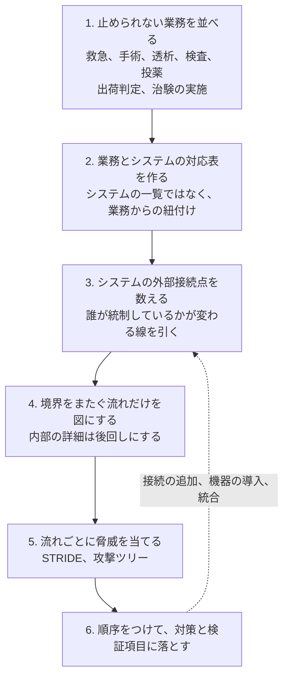
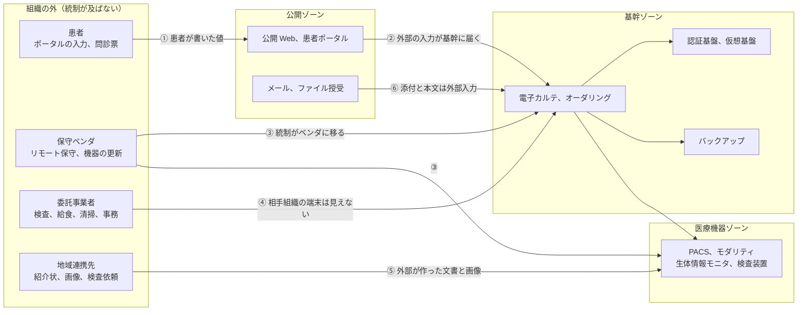
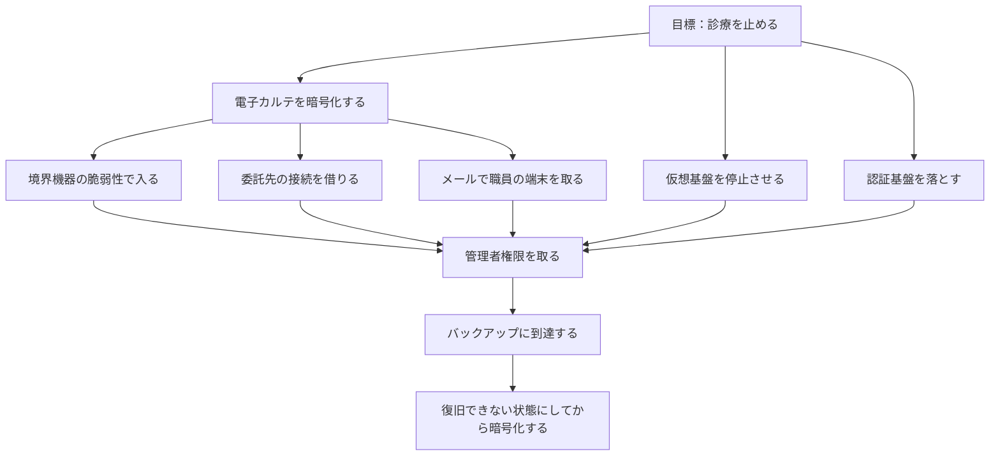
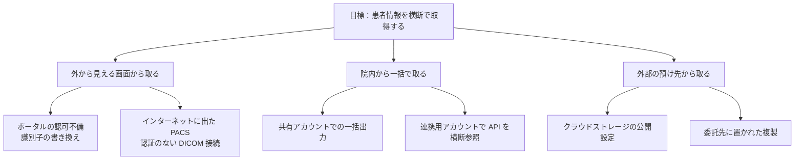
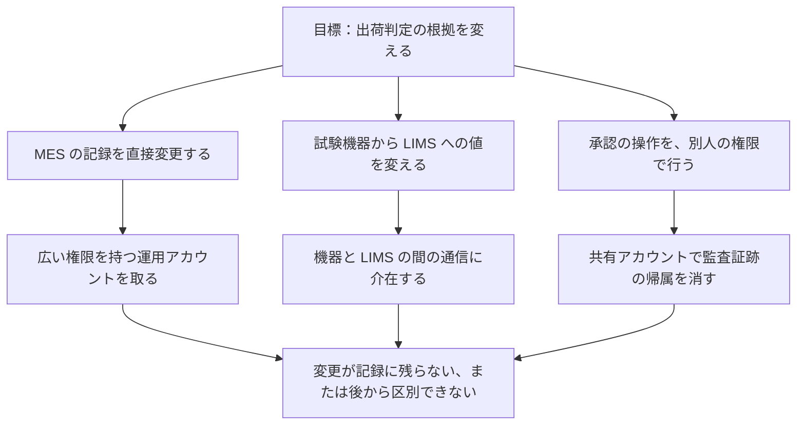
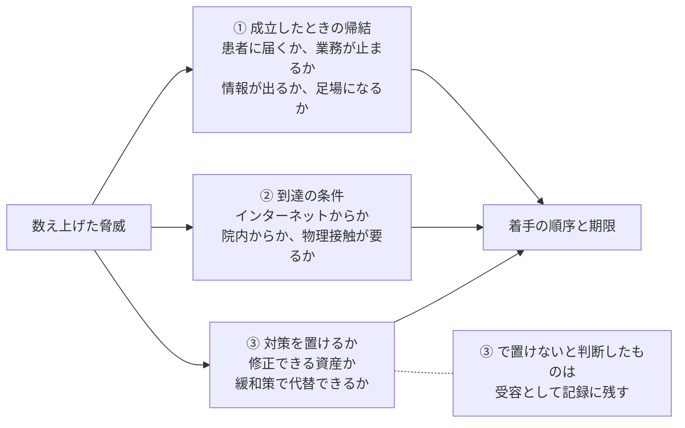

# 🧠 医療の脅威モデリング

脅威モデリングは、対象の設計を見て、攻撃者が何をしうるかを数え上げ、対策の順序を決める作業である（[セキュリティの基礎](../reference/security-basics.md#15-脅威モデリング)に手法の一覧を置いている）。
医療機関でこの作業が止まるのは、手法が難しいからではない。
対象の設計図が組織の内側に存在しないためである。
電子カルテも部門システムも医療機器もベンダが構築しており、院内にデータフローを描ける人が不在の状態から始まる。

本ページは、設計図がない状態から始めて、優先順位のついた対策と、検証で確かめる項目に落とすまでを扱う。

> [!NOTE]
> **表記ルール**：本ページでは、**事実**（一次情報で確認できる内容。出典を併記する）、**報道ベース**（報道や第三者の集計のみで確認でき、当事者の公表資料では裏付けが取れていない内容）、**分析**（筆者の解釈）を書き分ける。

---

## 何に答える作業か

**事実**：Threat Modeling Manifesto は、脅威モデリングを四つの問いとして示している（出典：[Threat Modeling Manifesto](https://www.threatmodelingmanifesto.org/)）。
問いの形は分野に依存しないが、答えの単位は対象によって変わる。
医療と製薬では、次の形に置き換わる。

| 四つの問い | 医療機関での答えの単位 | 製薬企業での答えの単位 |
|---|---|---|
| 何を作っているのか | どの診療業務が、どのシステムと接続点に支えられているか | どの製造と開発の工程が、どのシステムと取引先に支えられているか |
| 何がうまくいかなくなりうるか | 診療が止まる。値が変わったまま参照される。患者情報が横断で出る | 出荷が止まる。記録が変わったまま出荷される。治験データと研究情報が出る |
| それに対して何をするか | 経路を塞ぐ。到達を狭める。気付ける観測点を置く | 同左に加え、変更が承認手続きを通る形にする |
| うまくやれたか | 検証で実際に到達されたか。起きた事象が想定の中にあったか | 同左 |

**分析**：脆弱性診断との違いは、まだ存在しないものについて答えられる点にある。
診断は実装されたものを測るため、調達の前や接続を増やす前には使えない。
医療機関が構成を自由に変えられない以上、決定できる時点は調達と接続の追加に限られる。
その時点で使える手法は、脅威モデリングか構成レビューになる。

---

## 設計図がない状態から始める

完全なデータフロー図を目指すと、着手の前に半年が過ぎる。
先に作るのは、業務と接続点の対応である。

3 の材料は、資産台帳よりも、実際に通っている通信の側に多く残っている。

- ベンダから受け取った構成図と、保守契約に書かれた接続の条件
- 境界ファイアウォールの許可ルールと、その申請記録
- 外部から見えるドメイン、証明書、公開サービス（[外部から見た自組織の攻撃面](attack-surface.md)）
- 部門が独自に契約したクラウドの請求記録
- 医療機器の据付報告書に記載されたネットワーク要件

**分析**：台帳と実際がずれる方向は一定している。
台帳は、購入したものを記録する目的で作られるため、購入を伴わない接続（既存機器への回線追加、ベンダ側の設定変更、部門の月額契約）が落ちる。
ずれを埋める作業を先に済ませないと、以降の工程は台帳の範囲内でしか脅威を数えられない。

---

## 何を守るのかを先に置く

守る対象を決めないまま脅威を数えると、項目は増え続け、どこで止めてよいかが決まらない。
医療と製薬で守る対象は情報そのものではなく、診療の継続と患者の安全、医薬品の供給と製品の品質である（[守るべきものからの逆算](../reference/security-basics.md#2-守るべきものからの逆算)）。

資産は、三つの性質のどれに当たるかで分けると、後の順序づけが機械的になる。

| 性質 | 医療機関の例 | 製薬企業の例 | 失われたときの帰結 |
|---|---|---|---|
| 患者と品質に届く | 検査結果、投薬指示、機器の設定値、放射線治療計画 | 出荷判定の根拠、製造記録、逸脱記録 | 治療の内容が変わる。規格外の製品が出荷される |
| 業務の継続を握る | 電子カルテ、認証基盤、仮想基盤、バックアップ、部門システム | MES、LIMS、製造制御系 | 診療または製造が止まる |
| 取られたら戻らない | 診療録、要配慮個人情報、ゲノムデータ | 治験データ、承認前の研究情報 | 再発行できず、価値も戻らない |

**分析**：この三分類は、そのまま優先順位ではない。
順序を決めるのは、性質ではなく到達の条件である。
ただし分類を先に済ませておくと、後の工程で「この脅威が成立したとき、患者に届くのか、業務が止まるのか、情報が出るのか」を一語で答えられる。

---

## 信頼境界を引く

**信頼境界**とは、統制の主体が変わる線を指す。
脅威は、この線をまたぐ流れに集中して現れる。
線の内側を細かく描くより、線をまたぐ流れを数え切るほうが先に効く。

| 流れ | 統制の主体が変わる点 | この線で先に確かめること |
|---|---|---|
| ① 患者の入力 | 入力内容は、攻撃者が自由に書ける | 認可の単位。他人の記録へ届く識別子の扱い（[患者用ポータルの脆弱性](../technology/web-security/patient-portal.md)） |
| ② ポータルから院内 | 外部で入力された値が、基幹のデータになる | 連携用アカウントの権限。通す項目と通さない項目 |
| ③ 保守ベンダの接続 | 認証と操作の記録が、ベンダの運用に依存する | 常時開放か必要時開放か。個別の資格情報か。操作の記録が残るか（[認証とアクセス管理](../technology/identity.md)） |
| ④ 委託事業者の接続 | 相手組織の端末の状態を、こちらから測れない | 接続元と到達先の限定。接続の期間 |
| ⑤ 地域連携先からの受信 | 送られる文書と画像は、外部で作られたデータ | 受信時の検査。AE Title を認証として扱っていないか（[PACS / DICOM のセキュリティ](../technology/medical-devices/pacs-dicom.md)） |
| ⑥ メールの受信 | 本文と添付は、差出人を検証していない外部入力 | 送信ドメイン認証の判定結果の扱い（[メールとドメインの管理](../technology/email-domain.md)） |

**分析**：医療で落ちやすい境界は、ネットワーク図に現れない経路である。
可搬媒体、ベンダが持ち込む保守用 PC、機器の更新に使われる USB メモリは、線としてどこにも描かれないまま、外部から内部へ値を運ぶ（[記憶媒体の廃棄と機器の下取り](../technology/media-disposal.md)）。
図を描く段階で、通信の線とは別に、人が運ぶ経路の欄を作っておく。

製薬企業では、線の引かれる場所が変わる。
治験では CRO と EDC、製造では受託製造先と原薬の供給元、品質では試験機器と LIMS が、それぞれ別の統制の下にある（[製薬企業のセキュリティ](../reference/pharma/)）。
GMP 下の設備では、構成の変更に承認手続きが伴うため、境界をまたぐ流れを変えること自体が変更管理の対象になる。

---

## 脅威を数え上げる

**STRIDE** は、脅威を六種類に分けて数え上げる手法である（出典：[Microsoft Threat Modeling Tool の脅威分類](https://learn.microsoft.com/en-us/azure/security/develop/threat-modeling-tool-threats)）。
六種類と情報セキュリティの 7 要素の対応は [セキュリティの基礎](../reference/security-basics.md#stride-と-7-要素の対応) に置いた。
ここでは、医療の資産クラスごとに、どの種類が先に効くかを並べる。

| 資産クラス | 先に埋める脅威 | 医療での現れ方 | 先に置く対策 |
|---|---|---|---|
| 電子カルテ、オーダリング | 権限昇格、改ざん | 共有アカウントと広い権限で、記録の作成者を特定できない | 個人単位の認証。監査ログの取得と保存（[ログと監視の設計](../technology/logging.md)） |
| 認証基盤、仮想基盤 | 権限昇格 | 一段の昇格で、全システムへ等しく到達する | 管理インタフェースの分離。多要素認証。特権の期限 |
| バックアップ | 改ざん、サービス妨害 | 業務ドメインの認証を使い、同時に失われる | 認証の分離。変更不可の保管。復旧の実測 |
| 医療機器、PACS | 改ざん、なりすまし、サービス妨害 | AE Title を識別子として扱う構成。停止が処置の中断に直結する | 接続元の限定。ゾーンの分離（[ネットワークの分離](../technology/segmentation.md)） |
| 患者ポータル、PHR | 情報漏えい、権限昇格 | 識別子の書き換えで他人の記録へ届く | 認可の単位を、画面ではなくデータに置く |
| 連携 API（HL7 v2、FHIR） | 改ざん、情報漏えい | 値の書き換えが、診療判断の入力になる。トークンの範囲が広い | 送信元の検証。スコープの限定（[HL7 v2 と FHIR の攻撃面](../technology/web-security/hl7-fhir.md)） |
| 製造 OT、MES、LIMS | 改ざん、否認 | 記録の書き換えが、出荷判定の根拠を変える | 監査証跡の保全。操作の帰属（[製造設備と OT](../reference/pharma/manufacturing-ot.md)） |
| 診療支援の LLM、エージェント | 改ざん、権限昇格、情報漏えい | 外部から届く文書が、そのまま指示として解釈される | 入力の出所ごとの扱い分け。エージェントの権限の限定（[AX：医療における AI のセキュリティ](../technology/dx-ax/ai-security.md)） |

**分析**：六種類すべてを全資産で埋めようとすると、表が埋まる前に作業が止まる。
医療で先に埋めるのは、改ざんと権限昇格の二つになる。
改ざんは、値が変わったまま参照される状態を作り、患者への危害に直接つながる（[完全性への攻撃と患者安全](../threats/integrity-attacks.md)）。
権限昇格は、一段の成立で到達できる範囲を丸ごと変えるため、他の脅威の成立条件を同時に満たす。

要配慮個人情報を扱う範囲では、STRIDE だけでは足りない部分が残る。
連結可能性や再識別のように、個々のアクセスが正当でも結果として侵害が生じる型は、プライバシーに特化した **LINDDUN** の観点が拾う（出典：[LINDDUN](https://linddun.org/)）。
二次利用と匿名加工の設計、外部送信の扱いがこれにあたる（[ゲノムデータの保護](../technology/genomics.md)、[患者向けサイトの第三者送信](../technology/web-security/tracking.md)）。

---

## 攻撃ツリーで到達経路を書く

**攻撃ツリー**は、攻撃者の目標を頂点に置き、達成の手段を分解して枝に並べた図である。
STRIDE が種類ごとの数え上げに向くのに対し、攻撃ツリーは到達経路の把握に向く。
医療で効くのは、枝が合流する点が見えるためである。
入口は数え切れないほどあるが、合流点は少なく、そこに置いた対策は複数の枝を同時に切る。

### 目標 1：診療を止める

合流点は、管理者権限の取得とバックアップへの到達の二つである。
枝の側（境界機器、委託先、メール）は塞ぎ切れないため、合流点に置く対策の効き方が大きくなる（[防御プレイブック](../threats/actors/defense-playbook.md)の第 2 段階と第 3 段階）。

### 目標 2：患者情報を横断で取得する

この目標では、経路が独立していて合流点がない。
対策も経路ごとに置くことになる。
院内の系を通る二つの経路は、「短時間に参照された患者数」という同じ指標に現れるため、検知は一本にまとめられる（[ログと監視の設計](../technology/logging.md)）。
一方、外部の預け先に置かれた複製は、この指標には現れない。
所在の把握と、預け先の設定の確認が、検知の代わりに置く手立てになる。

### 目標 3：製造記録を書き換える

合流点は、変更が記録に残るかどうかである。
監査証跡が、操作した権限では消せない場所に保たれていれば、書き換えは後から突き合わせられる事象になる。
証跡が同じ権限で削除できる構成では、この合流点は機能しない。

> [!IMPORTANT]
> 攻撃ツリーは、網羅の証明にはならない。
> 書けた枝しか潰せないため、材料を組織の内側だけに求めると、想定の外が残り続ける。
> 公表されたインシデントの侵入経路（[インシデント事例集](../threats/incidents/)）と、観測された手口（[グループ別 TTPs](../threats/actors/ransomware-groups.md)）を枝の材料に加える。

---

## 出てきた脅威に順序をつける

数え上げた脅威は、そのままでは対策の順序にならない。
並べ替えの軸は三つある。

① の段階は、診断の報告と同じ区分を使うと、検証の結果と並べられる（[深刻度を、診療と患者安全の言葉に翻訳する](pentest/README.md#7-深刻度を診療と患者安全の言葉に翻訳する)の P1 から P5）。
② は、脅威モデリングの段階では想定であり、実際に通るかは検証で測る。
③ は医療に固有の軸で、承認済みの構成の機器や、バリデーション済みの設備では、修正そのものが選べない。

**分析**：優先順位が狂う典型は、脆弱性の一覧を CVSS の高い順に並べる進め方である。
CVSS は影響の大きさを測る指標であり、悪用の状況と自組織の到達条件を含まない（[リスクベースの考え方](../reference/security-basics.md#3-リスクベースの考え方)）。
脅威モデリングの出力を順序に変えるときは、①と②を先に見て、CVSS は同順位の中の並べ替えに使う。

対策を置けないと判断したものは、受容として扱う。
受容そのものは避けられないが、**誰が、いつ、何を根拠に、いつまで受容したか**が残っていないと、条件が変わったときに見直しが起動しない。
悪用が確認された脆弱性の一覧に載る、外部からの到達経路が増える、といった変化が見直しの契機になる。

---

## 対策を検証に渡す

脅威モデリングの出力が対策の一覧で止まると、実装されたかどうかを誰も確認しないまま残る。
脅威ごとに、確かめ方を決めた時点で作業が閉じる。

| 出てきた脅威 | 置く対策 | 確かめ方 |
|---|---|---|
| 委託先の接続から基幹に届く | 接続元と到達先を限定する | ゾーン間の到達性テスト（[ネットワークの分離](../technology/segmentation.md)） |
| 保守アカウントが常時特権を持つ | 期限付きの付与に変える | 権限の棚卸し。付与記録の突き合わせ |
| ポータルの識別子を書き換えると他人の記録へ届く | 認可をデータの単位で判定する | Web アプリケーション診断 |
| 管理者権限からバックアップへ到達する | 認証を分離する | 侵入前提のペネトレーションテスト |
| 大量参照に気付けない | 参照数の監視を置く | 検知ルールの試験。実際に閾値を超える操作を出して確認する |
| 機器の停止が処置の中断に直結する | 停止時の代替手順を置く | 机上演習（[インシデント対応と事業継続](../response/)） |

**分析**：脅威に識別子を振っておくと、診断の依頼書と検知ルールの両方から同じ脅威を参照できる。
医療機関では、診断を発注する部署と、機器を所管する部署と、契約を扱う部署が分かれる。
識別子がないと、同じ脅威に対する三つの部署の作業が、互いに知らないまま並走する。

---

## いつ回すか

定期的に回す形は、人員の都合で最初に落ちる。
医療機関で続くのは、手続きに組み込む形である。

| 契機 | この時点で決まってしまうこと | 見る範囲 |
|---|---|---|
| システムの調達、更改 | 認証方式、ログの取得可否、責任分界 | 対象システムと、その接続点 |
| 外部接続の追加 | 地域連携、委託先、クラウドへの経路 | 追加される境界だけ |
| 医療機器の導入 | ネットワーク配置、保守回線、更新の手順 | 機器ゾーンと保守経路 |
| クラウドへの移行 | 責任分界、鍵の管理、監査ログの保存先（[クラウド事業者と医療](../technology/cloud/)） | 移行対象と、残る院内側 |
| AI の導入 | 入力の出所、エージェントの権限、出力の使われ方 | 入力経路と、接続先のシステム |
| 法人の統合、事業の譲受 | 旧環境の資産と、引き継ぐ接続 | 統合される側の全体 |
| インシデントのあと | 想定に無かった経路が判明する | 実際に通られた経路の周辺 |

**分析**：調達の時点は、医療機関が構成に介入できる数少ない機会である。
稼働後は、承認済みの構成と保守契約が制約になり、要求を後から足せない（[セキュリティ・バイ・デザイン](../reference/security-basics.md#9-セキュリティバイデザイン)）。
脅威モデリングを調達の手続きに紐づけると、この機会を逃さない形になる。

---

## 専任者がいない組織での短縮版

診療所や中小病院では、上の工程をそのまま回せない。
一時間で終わる範囲に絞っても、出力は残る。

1. 止められない業務を三つ書く
2. その三つを支えるシステムを、名前で書く
3. 外から入れる口を全部書く（VPN、リモート保守、メール、公開サイト、委託先の接続、持ち込みの媒体）
4. 口ごとに、認証の方式と、そこから何に届くかを一行ずつ書く
5. 口を一つ選び、攻撃ツリーを三段だけ書く
6. 埋められなかった欄を、質問の形でベンダに出す

**分析**：この短縮版の出力で価値があるのは、埋まった欄ではなく埋まらなかった欄である。
自組織で答えられない項目の一覧は、そのまま保守契約と次の調達で確認する事項になる。
着手の順序そのものは [小規模組織で何から始めるか](../governance/small-organizations.md) に整理している。

---

## 医療機器メーカー側での位置づけ

医療機関にとって脅威モデリングは任意の作業だが、機器を作る側では規制要求の一部として扱われる。

**事実**：FDA は、Cyber Device の市販前提出資料に、脅威モデリングを含むセキュリティリスク管理の文書を含めることを求めている（[Cybersecurity in Medical Devices: Quality Management System Considerations and Content of Premarket Submissions](https://www.fda.gov/regulatory-information/search-fda-guidance-documents/cybersecurity-medical-devices-quality-management-system-considerations-and-content-premarket)、2025 年 6 月 27 日 最終版。[海外のガイドラインと法規制](../guidelines/global.md)）。

**事実**：FDA の資金提供のもと、MDIC と MITRE、Adam Shostack & Associates が Playbook for Threat Modeling Medical Devices を公開している（2021 年 11 月 30 日付。出典：[MDIC](https://mdic.org/resources/playbook-for-threat-modeling-medical-devices/)）。
特定の手法を指定せず、機器の開発工程に脅威モデリングを組み込む考え方と演習を示す文書である。

**事実**：ANSI/AAMI SW96 は、医療機器メーカーがセキュリティリスクマネジメントを行うための規格として発行されている（出典：[AAMI](https://array.aami.org/doi/10.2345/9781570208621)）。
ISO 14971 が定める安全リスクマネジメントの枠組みの中に置かれる点と、先行する AAMI TIR57、TIR97 を基礎にしている点が、発行元の説明に示されている（[海外のガイドラインと法規制](../guidelines/global.md)）。
規格の本文は有償で提供されるため、本ページでは要求事項の内容には立ち入らない。

**分析**：この構図は、医療機関側にとっての介入点を示している。
メーカーは規制対応として脅威モデルを作っているため、調達の段階で提出を求めれば、機器の想定脅威と残存リスクを読める形で受け取れる。
自組織で機器の内部を解析する代わりに、作った側の文書を要求するほうが早い（[医療機器の検証手法](../technology/medical-devices/testing-methodology.md)）。

---

## モデルが古くなっていないかを測る

四つ目の問い（うまくやれたか）は、モデルの正しさではなく、外れた箇所が見つかるかどうかで測る。
次のいずれかが起きたとき、モデルは実態から離れている。

- 接続が増えたのに、境界の一覧が更新されていない
- 検証で通られた経路が、モデルの枝に無かった（[診断とペネトレーションテスト](pentest/)）
- 実際に起きた事象の経路が、モデルに無かった
- 対策の欄は埋まっているが、確かめ方の欄が空のまま残っている

**分析**：三つ目が起きたときに、モデルを作った意味が失われるわけではない。
記録が残っていれば、なぜその枝を書けなかったかを追える。
材料が足りなかったのか、境界の一覧から落ちていたのか、可能性は認識したうえで受容していたのかで、次に直す場所が変わる。

---

## よくある止まり方

| 止まり方 | 何が起きるか | 進め方 |
|---|---|---|
| 完全なデータフロー図を先に作ろうとする | ベンダへの照会が終わらず、着手前に年度が変わる | 境界をまたぐ流れだけを描く。内部は後回しにする |
| 脅威の一覧を作って終わる | 対策の担当も期限も決まらず、次の年に同じ表を作る | 脅威ごとに、対策と確かめ方と担当を同じ行に書く |
| 情報漏えいだけを数える | 停止と改ざんが表から落ちる | 資産の三分類のうち、患者に届く経路と継続を握る経路を先に埋める |
| ベンダに作業ごと委ねる | 自組織の外側にある境界（委託先、部門契約のクラウド）が視界に入らない | 境界の一覧は自組織で作り、内部の詳細をベンダに聞く |
| 医療機器を対象外にする | 実際の到達点が表から消える | 機器そのものではなく、機器を取り巻く条件（配置、保守回線、調達要件）を対象にする |

---

## 関連ページ

- [セキュリティの基礎](../reference/security-basics.md#15-脅威モデリング)：手法の一覧と、7 要素との対応
- [診断とペネトレーションテスト](pentest/)：モデルの想定を、実際に到達できるかで測る
- [外部から見た自組織の攻撃面](attack-surface.md)：境界の一覧を、外側からの観測で補う
- [防御プレイブック](../threats/actors/defense-playbook.md)：出てきた対策を、着手の順序に落とす
- [組織の脆弱性の分類](../threats/actors/organizational-vulnerabilities.md)：人、プロセス、システムの区分で弱点を棚卸しする
- [ネットワークの分離](../technology/segmentation.md)：到達を狭める側の設計
- [ログと監視の設計](../technology/logging.md)：気付ける観測点の置き方
- [完全性への攻撃と患者安全](../threats/integrity-attacks.md)：改ざんを先に数える理由
- [医療機器の検証手法](../technology/medical-devices/testing-methodology.md)：メーカー側の文書と、医療機関側の確認
- [小規模組織で何から始めるか](../governance/small-organizations.md)：専任者がいない前提での着手順序

## 一次情報

| 資料 | 発行元 |
|---|---|
| [Threat Modeling Manifesto](https://www.threatmodelingmanifesto.org/) | Threat Modeling Manifesto Working Group |
| [Threats - Microsoft Threat Modeling Tool](https://learn.microsoft.com/en-us/azure/security/develop/threat-modeling-tool-threats) | Microsoft |
| [LINDDUN](https://linddun.org/) | KU Leuven DistriNet |
| [Playbook for Threat Modeling Medical Devices](https://mdic.org/resources/playbook-for-threat-modeling-medical-devices/) | MDIC、MITRE、FDA |
| [ANSI/AAMI SW96](https://array.aami.org/doi/10.2345/9781570208621) | AAMI |
| [Cybersecurity in Medical Devices: Premarket Submissions](https://www.fda.gov/regulatory-information/search-fda-guidance-documents/cybersecurity-medical-devices-quality-management-system-considerations-and-content-premarket) | FDA |

---

[← 検証と実務](README.md) | [外部から見た自組織の攻撃面 →](attack-surface.md) | [トップへ](../../README.md)
