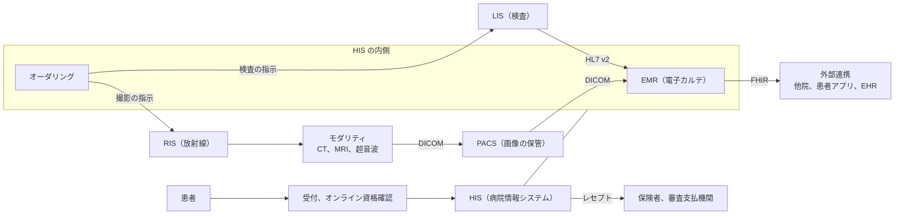

# 📖 用語集

医療 IT とセキュリティが交わる領域では、双方の専門用語が混在する。
医療側の用語をセキュリティ担当者が知らず、セキュリティ側の用語を医療従事者が知らないことが、対策の議論を止める原因になりやすい。

## 用語が指す場所

医療情報システムの用語は、診療の流れに沿って並べると位置関係が分かる。
下の図の各要素が、以下の節で説明する語に対応する。

**分析**：セキュリティの検討でこの図が効くのは、データが施設の外へ出る点が二箇所しかないことを示せるためである。
レセプトの請求と、外部連携である。
残りは院内で閉じており、そこでの防御は経路の分離と参照の記録に寄る。

---

## 医療情報システム

**EHR（Electronic Health Record）**：電子健康記録。複数の医療機関にまたがって共有されることを前提とした患者の健康情報。

**EMR（Electronic Medical Record）**：電子診療録。単一の医療機関内で管理される診療記録。日本では「電子カルテ」がこれにあたる。

**HIS（Hospital Information System）**：病院情報システム。電子カルテ、オーダリング、医事会計などを含む病院全体の情報基盤。

**オーダリングシステム**：医師が検査、処方、処置を指示（オーダ）し、各部門に伝達する仕組み。

**RIS（Radiology Information System）**：放射線科情報システム。検査の予約、実施、報告を管理する。

**PACS（Picture Archiving and Communication System）**：医用画像管理システム。画像の保存、検索、配信を担う。

**LIS（Laboratory Information System）**：臨床検査システム。検体検査の依頼から結果報告までを管理する。

**レセプト**：診療報酬明細書。医療機関が保険者に診療費を請求するための書類。

**オンライン資格確認**：マイナンバーカードや健康保険証で、患者の保険資格をオンラインで確認する仕組み。

---

## 相互運用性の規格

**HL7 v2**：医療情報交換の規格。パイプ（`|`）区切りのテキスト形式で、国内外の部門システム連携で広く使われている。認証や暗号化は規格自体に含まれない。

**HL7 FHIR（Fast Healthcare Interoperability Resources）**：REST と JSON をベースにした新しい医療情報交換規格。Web の技術とセキュリティ手法がそのまま適用できる。

**DICOM（Digital Imaging and Communications in Medicine）**：医用画像のファイル形式と通信プロトコルを規定する規格。

**AE Title（Application Entity Title）**：DICOM 通信で通信相手を識別する文字列。認証情報ではない。

**C-STORE / C-FIND / C-MOVE / C-ECHO**：DICOM の基本的な通信サービス。それぞれ画像送信、検索、取得、疎通確認にあたる。

**DICOMweb**：DICOM を HTTP 上で扱うための API 仕様。QIDO-RS（検索）、WADO-RS（取得）、STOW-RS（送信）からなる。

**MLLP（Minimal Lower Layer Protocol）**：HL7 v2 メッセージを TCP 上で送るためのフレーミング規約。メッセージの前後に区切りのバイトを付けるだけの仕様で、認証と暗号化を含まない。

**ADT / ORM / ORU**：HL7 v2 の代表的なメッセージ種別。それぞれ患者の入退院と属性、検査や処置のオーダ、検査結果の報告にあたる。

**SMART on FHIR**：FHIR API に OAuth 2.0 を組み合わせ、アプリの起動時に利用者と対象患者の文脈を渡す仕様。FHIR 自体は認証と認可を定義しないため、この層が実質的な境界になる。

**SS-MIX2**：国内で使われる、医療情報の標準化ストレージ仕様。HL7 v2 メッセージをファイルとして蓄積する。

**MML（Medical Markup Language）**：国内で使われてきた医療情報交換の記述形式。地域医療情報連携ネットワークの初期の実装で用いられた。

**IHE（Integrating the Healthcare Enterprise）**：既存規格の組み合わせ方を定めた、医療情報連携の実装ガイド。

---

## 医療機器

**IoMT（Internet of Medical Things）**：ネットワークに接続された医療機器の総称。

**モダリティ**：CT、MRI、超音波、X 線装置など、画像を生成する装置の総称。

**臨床工学技士**：医療機器の保守管理と操作を担う国家資格職。医療機関で医療機器の実態を最もよく把握している。

**MDS2（Manufacturer Disclosure Statement for Medical Device Security）**：医療機器のセキュリティ仕様をメーカーが開示するための標準様式。調達時に提出を求める。

**SBOM（Software Bill of Materials）**：ソフトウェア部品表。製品に含まれるコンポーネントとそのバージョンの一覧。脆弱性が公表されたときに影響範囲を判断するための前提になる。

**市販後（Postmarket）対応**：製品出荷後の脆弱性監視、報告、アップデート提供。医療機器規制で明示的に求められる。

**Legacy Device**：メーカーのサポートが終了しているか、セキュリティ更新を提供できない医療機器。IMDRF が定義と対応方針を示している。

---

## セキュリティ

**要配慮個人情報**：病歴、健康診断の結果、遺伝情報など、取扱いに特に配慮を要する個人情報。取得には原則として本人同意が必要である。

**PHI / ePHI（Protected Health Information）**：米国 HIPAA における保護対象保健情報。`e` は電子的に扱われるものを指す。

**BAA（Business Associate Agreement）**：HIPAA において、医療機関から業務を受託する事業者と結ぶ契約。

**Break-glass（緊急時アクセス）**：緊急時に、通常の権限を超えて患者情報へアクセスできるようにする仕組み。医療では正当な要件であり、事後の監査によって濫用を抑止する。

**ダウンタイム手順（Downtime Procedures）**：システムが利用できないときに、紙などで診療を継続するための手順。医療機関の事業継続の要になる。

**二重恐喝（Double Extortion）**：暗号化に加えて、窃取したデータの公開を材料に金銭を要求する手口。

**RaaS（Ransomware as a Service）**：ランサムウェアを開発する集団が、実行役（アフィリエイト）に提供して収益を分配する形態。

**ISAC（Information Sharing and Analysis Center）**：業界ごとに脅威情報を共有する組織。

**IOC（Indicator of Compromise）**：侵害の痕跡。IP アドレス、ハッシュ値、ドメイン名など。

**TTPs（Tactics, Techniques, and Procedures）**：攻撃者の戦術、技術、手順。IOC より変化しにくく、防御設計の基礎になる。

**CVD（Coordinated Vulnerability Disclosure）**：発見者、開発者、調整機関が公表の時期を調整して脆弱性を開示する枠組み。医療機器では、薬事上の手続きを含むため猶予期間が長くなりやすい。

**VDP（Vulnerability Disclosure Policy）**：外部からの脆弱性報告を受け付けることを表明し、受付窓口と対応方針を公開する文書。報奨金の有無とは独立した仕組みである。

---

## 規制

**三省二ガイドライン**：厚生労働省のガイドラインと、経済産業省, 総務省のガイドラインをあわせた通称。医療情報を扱う際の国内の基本的な枠組み。

**薬機法**：医薬品、医療機器等の品質、有効性及び安全性の確保等に関する法律。医療機器の規制の根拠となる。

**QMS 省令**：医療機器の製造管理と品質管理の基準を定めた省令。

**PMDA（医薬品医療機器総合機構）**：医療機器の審査と安全対策を担う国内の機関。

**HIPAA**：米国の医療情報保護に関する法律。Privacy Rule、Security Rule、Breach Notification Rule からなる。

**FD&C Act 524B**：米国で医療機器の市販前提出にサイバーセキュリティ情報の提出を義務づける条項。

**MDR（Medical Device Regulation）**：EU の医療機器規則。

**NIS2**：EU の重要インフラ向け指令。医療分野を対象に含む。

**IMDRF（International Medical Device Regulators Forum）**：各国の医療機器規制当局による国際的な枠組み。各国のガイダンスの基礎になっている。

---

[トップへ](../../README.md)
