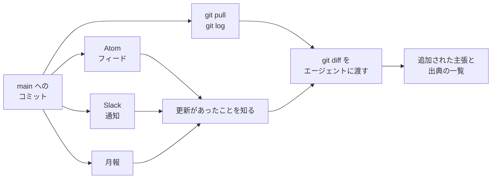

# 🤖 AI エージェントから使う

本リポジトリを、AI エージェント（Claude Code、ChatGPT、社内の RAG など）の参照先として使うための手順をまとめる。
文書はすべて Markdown で、公開リポジトリに平文で置いてある。
クローンするか、GitHub 越しに読ませれば、そのまま知識ベースとして扱える。

扱うのは、取り込み方、構造の渡し方、聞き方、生成物の確かめ方、更新の追い方の五つである。

> [!NOTE]
> **表記ルール**：本ページでは、**事実**（一次情報で確認できる内容。出典を併記する）と、**分析**（筆者の解釈）を書き分ける。

---

## 1. 使う前に確認すること

**事実**：本リポジトリは [CC BY 4.0](../../LICENSE) で公開している。
生成物に本リポジトリの記述を含める場合は、出典としてリポジトリ名と URL を示す（[CITATION.cff](../../CITATION.cff) に引用形式を置いている）。

**分析**：AI エージェントに読ませるときは、次の三つを守ると事故が起きにくい。

| 守ること | 理由 |
|---|---|
| 本文中の一次情報リンクを、生成物にも残す | 本リポジトリの記述は、公表資料、行政文書、CVE、ベンダアドバイザリに紐づけて書いている。リンクを落とすと、確からしさを検証できない要約だけが残る |
| 「事実」「報道ベース」「分析」のラベルを保つ | ラベルを外して平坦に要約すると、筆者の解釈が確定した事実として伝わる |
| 患者情報や未公表のインシデント情報を、プロンプトに混ぜない | 本リポジトリ側の[掲載しない情報の基準](../../CONTRIBUTING.md#何を掲載しないか)と同じ制約が、読ませる側にも当てはまる |

免責事項と、どこまで使ってよいかは[トップページ](../../README.md#-免責事項)に記載している。

## 2. 取り込む

### ローカルにクローンして読ませる

**分析**：エージェントにファイルシステムを触らせる形（Claude Code、Codex、Cursor など）が、いちばん素直に動く。
`grep` で当たりを付け、必要なファイルだけ読ませられるため、全文をコンテキストに載せる必要がない。

```sh
git clone https://github.com/scgajge12/awesome-healthcare-security.git
cd awesome-healthcare-security
```

**事実**：2026 年 8 月時点で、Markdown は 126 ファイル、約 28,600 行、合計約 2.1 MB である。
日本語のため、全文を一度にコンテキストへ載せる用途には大きい。

```sh
# 規模を確認する
find . -name '*.md' -not -path './.git/*' | wc -l

# 語で当たりを付ける
grep -rn "オンライン資格確認" docs/ --include='*.md' -l
```

### 一部だけ取得する

**事実**：raw の URL でファイル単位に取得できる。
API 経由で取得する場合、未認証のレート制限は 1 時間あたり 60 リクエストである（[GitHub Docs](https://docs.github.com/en/rest/using-the-rest-api/rate-limits-for-the-rest-api)）。

```sh
curl -sL https://raw.githubusercontent.com/scgajge12/awesome-healthcare-security/main/docs/reference/GLOSSARY.md
```

### MCP 経由で読ませる

**事実**：GitHub は公式の MCP サーバ [github/github-mcp-server](https://github.com/github/github-mcp-server) を公開している。
接続すると、クローンせずにファイルの取得、コードの検索、コミット履歴の参照ができる。
動かし方は、GitHub がホストするリモートサーバにつなぐ形と、手元で動かす形の二つである。

**分析**：本リポジトリは公開されているため、読むだけなら認証はほぼ形式的な手続きになる。
それでも以下では、読み取り専用と最小のツールセットで構成する形を示す。
同じホストから業務のリポジトリにも触れる以上、書き込みのツールを並べておく理由がない。

#### リモートサーバにつなぐ

**事実**：エンドポイントは `https://api.githubcopilot.com/mcp/` である。
認証は、対応するホストでは OAuth、それ以外では Personal Access Token（PAT）を `Authorization` ヘッダで渡す。
ツールセットは URL のパスで選び、末尾に `/readonly` を付けると読み取り専用のツールだけになる（[リモートサーバの一覧](https://github.com/github/github-mcp-server/blob/main/docs/remote-server.md)）。

ファイルの取得と検索だけでよければ、`repos` の読み取り専用が最小の構成になる。

```sh
# Claude Code の例
claude mcp add github --transport http \
  https://api.githubcopilot.com/mcp/x/repos/readonly \
  -H "Authorization: Bearer $GITHUB_PAT"
```

```json
{
  "servers": {
    "github": {
      "type": "http",
      "url": "https://api.githubcopilot.com/mcp/x/repos/readonly"
    }
  }
}
```

**事実**：この JSON は VS Code（1.101 以降）の形式である。
リモート MCP と OAuth に対応するホストでは、この記述だけで初回にブラウザ経由の認証へ進む。
対応していないホストでは、上のコマンド例と同じく `Authorization` ヘッダに PAT を渡す（[ホスト別の導入手順](https://github.com/github/github-mcp-server/tree/main/docs/installation-guides)）。

#### 手元で動かす

**事実**：Docker イメージ `ghcr.io/github/github-mcp-server` が公開されている。
github.com が相手なら初回に OAuth でログインでき、`GITHUB_PERSONAL_ACCESS_TOKEN` を設定した場合はそちらが優先される。

```sh
claude mcp add github -e GITHUB_PERSONAL_ACCESS_TOKEN=$GITHUB_PAT -- \
  docker run -i --rm \
    -e GITHUB_PERSONAL_ACCESS_TOKEN \
    -e GITHUB_READ_ONLY=1 \
    -e GITHUB_TOOLSETS=context,repos \
    ghcr.io/github/github-mcp-server
```

**事実**：`GITHUB_READ_ONLY=1`（バイナリで直接動かす場合は `--read-only`）を付けると、読み取りのツールだけが提供される。
`GITHUB_TOOLSETS`（同じく `--toolsets`）は、有効にするツール群を絞る。
指定しない場合の既定は `context`、`repos`、`issues`、`pull_requests`、`users` の五つである。

#### 本リポジトリで使うツール

| ツール | 用途 | 指定する内容 |
|---|---|---|
| `get_file_contents` | ファイル、ディレクトリの取得 | `owner: scgajge12`、`repo: awesome-healthcare-security`、`path: docs/reference/GLOSSARY.md` |
| `search_code` | 語からページを探す | `q: repo:scgajge12/awesome-healthcare-security 電子処方箋` |
| `list_commits` | 更新の一覧 | `since` で期間を絞る（[更新を追う](#6-更新を追う)） |
| `get_commit` | 個別のコミットの差分 | `sha` を指定する |

**分析**：エージェントには、まず [構造を先に渡す](#3-構造を先に渡す)の対応表を渡し、そのうえで `get_file_contents` を使わせるほうが速い。
`search_code` から入ると、語が本文のどの文脈で使われているかが分からないまま断片を集めることになる。

#### 権限とプロンプトインジェクション

**事実**：github-mcp-server の README は、PAT に与える権限を必要な範囲に限ること、用途ごとにトークンを分けること、設定ファイルに書いたトークンの権限を絞ることを挙げている。

**分析**：本リポジトリは公開リポジトリであり、読むだけであれば書き込みの権限は要らない。
細粒度のトークン（fine-grained personal access token）なら、公開リポジトリの読み取りだけを許可した状態で足りる。

**事実**：同サーバには lockdown モードがある。
これを有効にすると、対象リポジトリへの push 権限を持たない者が書いた内容（Issue、Pull Request、コメント、コミットなど）が絞り込まれる。
README は、これを内容のフィルタであって認可の境界ではないと明記している。
プロンプトインジェクションのリスクを下げる目的の機能であり、資格情報が読める範囲そのものは変わらない。

**分析**：本リポジトリの Issue と Pull Request には、誰でも書き込める。
エージェントに `issues` や `pull_requests` のツールセットまで渡す場合は、lockdown モードを有効にするか、そもそも `repos` だけに絞るほうが安全になる。

#### クローンとの使い分け

**分析**：MCP は、リポジトリを手元に置けない環境や、更新の取得までを同じ経路にまとめたい場合に向く。
一方、検索は GitHub のコード検索に依存する。
語の区切り方の都合で、日本語の語句は取りこぼすことがある。
全文を横断して数える調査（該当が何件あるか、どのページに出典が付いていないか）は、クローンして `grep` するほうが確実である。
リクエストのたびに API のレート制限も消費する。

## 3. 構造を先に渡す

**分析**：全文を読ませるより、どこに何があるかの地図を先に渡したほうが、答えの精度と再現性が上がる。
以下の対応表と、[トップページのリポジトリ構成](../../README.md#-リポジトリの構成)をプロンプトに含めるとよい。

| パス | 内容 | 命名規則 |
|---|---|---|
| `docs/threats/incidents/japan/`、`global/` | インシデントの履歴 | `YYYY-timeline.md`（年別、地域別） |
| `docs/threats/incidents/years/` | その年の情勢（国内と海外を統合） | `YYYY-summary.md` |
| `docs/threats/incidents/global/` | 米国 HHS OCR 届出の全件集計 | `YYYY-us-hhs.md` |
| `docs/threats/actors/` | 脅威アクター、TTPs、防御プレイブック | 主題ごと |
| `docs/threats/statistics/` | 公的統計から読む脅威 | `japan.md`、`global.md` |
| `docs/technology/` | 守る対象と攻撃面（医療機器、クラウド、DX と AX、ゲノム、認証、ログなど） | 領域ごとのディレクトリまたは単一ファイル |
| `docs/practice/` | 脅威モデリング、攻撃面、診断、バグバウンティ | 主題ごと |
| `docs/response/` | 侵害後の初動、診療の継続、届出、復旧 | 主題ごと |
| `docs/guidelines/` | 規制とガイドライン | `japan.md`、`global.md` |
| `docs/governance/` | 体制、予算、経営層への報告、リスク移転 | 主題ごと |
| `docs/reference/` | 用語集、基礎、製薬、ツール、論文、サービスカタログ | 主題ごと |
| `monthly-reports/` | 月報 | `YYYY/YYYY-MM.md` |

各群の直下に `README.md` があり、その群が何を扱うかと配下へのリンクを示している。
用語の定義は [用語集](GLOSSARY.md)、各ページが前提とする枠組みは [セキュリティの基礎](security-basics.md) にまとめている。

## 4. 聞き方

**分析**：本リポジトリは、対策の一覧ではなく、判断の材料として書いている。
そのため、次のように「どのページの、どの記述にもとづくか」を答えさせる形が噛み合う。

```text
docs/ 配下だけを根拠にして答えてください。
1. 国内で診療停止に至ったランサムウェア事例を、発生年の新しい順に並べる
2. 各行に、停止した業務、復旧までの期間、初期侵入経路を書く
3. 各行に、リポジトリ内の記述箇所（ファイルパスと見出し）と、本文に載っている一次情報の URL を付ける
4. リポジトリに記載がない項目は「記載なし」と書き、推測で埋めない
```

```text
docs/guidelines/japan.md と docs/technology/identity.md を読み、
当院の二要素認証の導入計画に対して、期限が定められている要求と、
そうでない推奨を分けて一覧にしてください。出典の条項番号を残すこと。
```

```text
docs/practice/attack-surface.md の手順に沿って、
外部から見た自組織の攻撃面を洗い出すチェックリストを作ってください。
リポジトリで「測り方の線引き」として書かれている制約は、削らずに残すこと。
```

## 5. 生成物を確かめる

**分析**：以下は、生成結果を鵜呑みにしないための最小限の確認である。

- **リポジトリにない URL が出ていないか**：本文にない出典が付いていれば、モデルが補ったものである
- **ラベルが保たれているか**：「事実」と書かれていた記述が、要約後に断定へ変わっていないか
- **数値の出所が残っているか**：被害人数、金額、期間は、本文で出所を併記している
- **CVE 番号を、そのまま信じていないか**：本リポジトリでは NVD で確認したものだけを記載しているが、生成の過程で番号が変わることがある
- **時点が明示されているか**：規制の要求や統計は、参照した時点によって変わる

**事実**：本リポジトリの文書レビュー手順は [`skills/repo-review/SKILL.md`](../../skills/repo-review/SKILL.md) に置いている。
一次情報、事実と推測の分離、文章規範、公開適格性、構成の整合、図解の六つの観点を、生成物の点検にも流用できる。

## 6. 更新を追う

**分析**：本リポジトリは継続的に加筆している。
どの粒度で追いたいかによって、手段を選ぶ。

| 追いたい粒度 | 手段 |
|---|---|
| 変更の全部（文単位） | `git pull` と `git log`、`git diff` |
| 追加、更新されたページ | コミットの Atom フィード |
| 月ごとの動向のまとめ | [月報](../../monthly-reports/README.md) |
| チームへの通知 | Slack 連携（後述） |

通知は、どれも「何かが変わった」までしか伝えない。
何が増えたかを知るには、差分を取って読む工程が要る。



### git で追う

```sh
# 前回確認した時点からの変更ファイル
git pull
git log --since='2026-08-01' --name-status --oneline

# 差分そのもの
git diff <前回のコミット>..HEAD -- docs/
```

**分析**：差分をエージェントに渡すときは、`git diff` の出力をそのまま貼るより、次のように依頼するほうが読みやすい結果になる。

```text
以下は awesome-healthcare-security の差分です。
1. 新規ページ、追記、修正の三つに分類する
2. 追記については、何の主張が増えたかを一文で書く
3. 出典が追加された箇所は、その URL を列挙する
```

### フィードで追う

**事実**：GitHub は、既定ブランチのコミットを Atom フィードで配信している。

```text
https://github.com/scgajge12/awesome-healthcare-security/commits/main.atom
```

本リポジトリはリリースを作っていないため、`releases.atom` には何も流れない。
更新はすべて `main` へのコミットとして現れる。

**分析**：MCP サーバを接続している場合は、フィードの代わりに `list_commits` を `since` 付きで呼ばせても同じことができる。

### GitHub の通知で追う

**事実**：リポジトリ右上の Watch から通知の種類を選べる（[GitHub Docs](https://docs.github.com/en/account-and-profile/managing-subscriptions-and-notifications-on-github/setting-up-notifications/about-notifications)）。
コミットの通知が必要な場合は、後述の Slack 連携かフィードのほうが細かく制御できる。

## 7. Slack で通知を受け取る

### GitHub 公式アプリを使う

**事実**：GitHub は Slack 向けの公式インテグレーション [integrations/slack](https://github.com/integrations/slack) を提供している。
アプリを導入したチャンネルで、次のコマンドを実行する。

```text
/github signin
/github subscribe scgajge12/awesome-healthcare-security
```

**事実**：購読すると、既定で次の五つが通知される（[integrations/slack](https://github.com/integrations/slack#customize-your-notifications)）。

| 種別 | 内容 |
|---|---|
| `issues` | Issue の作成、クローズ |
| `pulls` | Pull Request の作成、マージ、レビュー可への変更 |
| `commits` | 既定ブランチへの新しいコミット |
| `releases` | 公開されたリリース |
| `deployments` | デプロイの状態 |

**分析**：本リポジトリは文書が主で、更新はほぼ `main` へのコミットとして現れる。
そのため、次のように不要な種別を外すと、通知が更新の追跡に絞られる。

```text
/github unsubscribe scgajge12/awesome-healthcare-security issues pulls deployments
```

**事実**：`commits` は既定ブランチのみを対象とする。
全ブランチを追う場合は `commits:*`、特定のブランチは `commits:<ブランチ名>` を指定する。
現在の購読内容は `/github subscribe list`、購読を止める場合は `/github unsubscribe scgajge12/awesome-healthcare-security` で確認、解除できる。

### RSS アプリを使う

**事実**：Slack の RSS アプリは、RSS と Atom のフィードをチャンネルに流す（[Slack ヘルプ](https://slack.com/help/articles/218688467-Add-RSS-feeds-to-Slack)）。

```text
/feed subscribe https://github.com/scgajge12/awesome-healthcare-security/commits/main.atom
```

`/feed list` で購読の一覧と ID を確認し、`/feed remove <ID>` で解除する。

**分析**：GitHub アプリをワークスペースに追加できない場合や、複数のリポジトリと外部の情報源を同じチャンネルにまとめたい場合に向く。
コミットの件名しか流れないため、内容を追うには本文の取得が別途必要になる。

### 通知を受けてから読むまでをつなぐ

**分析**：通知はチャンネルに溜まるが、それだけでは何が変わったかは分からない。
週次で次のように扱うと、通知が読み物に変わる。

1. Slack に流れたコミットの範囲を確認する
2. ローカルで `git pull` し、その範囲の `git diff` を取る
3. 前節のプロンプトで、追加された主張と出典を一覧にさせる
4. 自組織に関係する項目だけを残し、担当者に割り当てる

## 8. できないこと

**分析**：本リポジトリを知識ベースとして使う場合の限界を、先に共有しておく。

- **網羅ではない**：公開された一次情報のうち、筆者が確認できたものを収録している。特定の年や地域の事例が揃っている保証はない
- **最新ではない場合がある**：規制の改正や統計の更新は、確認でき次第反映するが、時差がある。判断に使う前に、リンク先の原典で時点を確かめる
- **自組織の構成は分からない**：ここにあるのは一般化された記述である。自組織の機器構成、契約、体制を投入しない限り、具体的な適用はできない
- **攻撃に使える形では書いていない**：そのまま実行できるエクスプロイトや、未修正の脆弱性の詳細は掲載していない

誤りを見つけた場合は、[Issue](https://github.com/scgajge12/awesome-healthcare-security/issues) で知らせてほしい。
追加や修正の手順は [CONTRIBUTING.md](../../CONTRIBUTING.md) にまとめている。

---

## 関連ページ

- [用語集](GLOSSARY.md)：本リポジトリで使う用語
- [セキュリティの基礎](security-basics.md)：各ページが前提として使う語彙と枠組み
- [医療における AI のセキュリティ](../technology/dx-ax/ai-security.md)：医療現場に AI を入れる側のリスク
- [事例の調べ方](../threats/incidents/research-tips.md)：情報源、手順、落とし穴
- [月報](../../monthly-reports/README.md)：月単位の動向

---

<sub>[リファレンス](README.md) | [トップへ](../../README.md)</sub>
