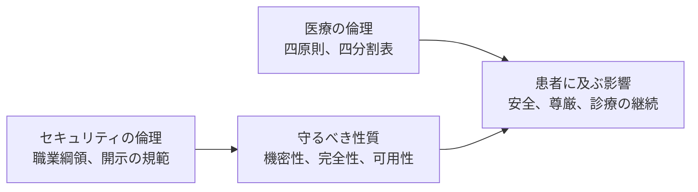

# ⚖️ 医療の倫理とセキュリティの倫理

医療機関で働くセキュリティの担当者は、二つの倫理の間に立つ。
片方は患者に対する医療者の倫理であり、もう片方は情報とシステムを扱う技術者の倫理である。
この二つは似た語を使いながら、答えようとしている問いが違う。

本ページは、両者の概念、特徴、考え方の違いを並べる。
どちらが正しいかを決めるためではなく、判断が衝突したときに、何と何が衝突しているのかを名指せるようにするために置いている。

> [!NOTE]
> **表記ルール**：本ページでは、**事実**（一次情報で確認できる内容。出典を併記する）と、**分析**（筆者の解釈）を書き分ける。
> 倫理の主題は解釈の比重が大きいため、断定を避けた記述を含む。

---

## 目次

1. [二つの倫理が答えようとしている問い](#1-二つの倫理が答えようとしている問い)
2. [概念と特徴の対比](#2-概念と特徴の対比)
3. [考え方の違いが表に出る三つの場面](#3-考え方の違いが表に出る三つの場面)
4. [個人に向き合う倫理と、集団に介入する倫理](#4-個人に向き合う倫理と集団に介入する倫理)
5. [対比の限界](#5-対比の限界)
6. [参照した枠組み](#6-参照した枠組み)

---

## 1. 二つの倫理が答えようとしている問い

**事実**：医療倫理で最も広く使われる枠組みは、Beauchamp と Childress による四原則である。
自律尊重、無危害、善行、正義の四つを挙げ、行為者が守るべき規範として示す。

出典：Tom L. Beauchamp、James F. Childress『Principles of Biomedical Ethics』（Oxford University Press、1979 年初版）

**事実**：セキュリティで最も広く使われる枠組みは、機密性、完全性、可用性の三つ（CIA）である。
これは資産が保つべき性質を示すものであり、行為者の規範ではない。

出典：[セキュリティの基礎](security-basics.md)（情報セキュリティの 7 要素）

**分析**：この二つを直接並べると、対応づけに無理が出る。
四原則は「この行為をしてよいか」に答える規範であり、CIA は「この状態を保てているか」に答える指標である。
問いの種類が違うため、自律尊重を機密性に、無危害を完全性に対応させるといった読み替えは、語呂が合うだけで中身が噛み合わない。
正義に対応する項目が CIA に存在しない点にも、そのずれが出る。

セキュリティの側で四原則に対応する層は、CIA ではなく職業倫理の綱領である。
ACM 倫理綱領、(ISC)² Code of Ethics、Menlo Report、Hippocratic Oath for Hackers が、その層に当たる。

**分析**：両者が交わるのは、原則の層ではなく、患者に及ぶ影響の層である。
医療の倫理は患者から出発して直接そこに届き、セキュリティの倫理は資産の性質を経由して間接的にそこへ届く。
経由するものがあるぶん、セキュリティ側の判断では患者の姿が視野から抜けやすい。

---

## 2. 概念と特徴の対比

| 観点 | 医療の倫理 | セキュリティの倫理 |
|---|---|---|
| 中心にある問い | この患者に何をしてよいか | この系をどう守るか、そのために何をしてよいか |
| 基点となる単位 | 目の前の一人 | 資産、システム、組織、社会 |
| 中心の枠組み | 四原則、四分割表 | 職業綱領、CIA、開示の規範 |
| 枠組みの性質 | 行為の規範 | 守るべき事項の列挙と、保つべき状態の指標 |
| 同意を与える主体 | 患者本人 | 発注者、システムの運用者 |
| 危害が及ぶ先 | 同意した本人 | 同意していない第三者を含む |
| 不作為の扱い | 治療しないことも危害になりうる | 対処しないことも危害になりうる |
| 守秘の受益者 | 患者本人 | 未修正の系を使う第三者 |
| 時間の尺度 | 診療の場で下す判断 | 修正までの期間、開示の期限 |
| 職業の位置 | 免許職。法定の守秘義務がある | 免許職ではない。綱領への準拠は任意 |
| 議論の蓄積 | 生命倫理として体系がある | 綱領はあるが、原則が衝突したときの調停手続きは薄い |

**分析**：最後の二行が、実務で効く違いだと考えている。
医師の守秘義務は刑法第 134 条の秘密漏示罪に裏打ちされ、違反には免許の問題が伴う。
セキュリティ技術者の綱領は、加入している資格団体を離れれば拘束力を持たない。
同じ「守秘」という語を使っていても、破ったときに何が起きるかが違う。

出典：[刑法](https://laws.e-gov.go.jp/law/140AC0000000045)（第 134 条）

---

## 3. 考え方の違いが表に出る三つの場面

### 同意を与える者と、危害を受ける者が一致しない

**分析**：医療では、侵襲を受ける本人が同意を与える。
医療機器のペネトレーションテストでは、同意を与えるのは製造業者または医療機関であり、機器の不具合で影響を受けうるのは患者である。
契約書の署名は法的な問題を解決するが、倫理的な問題は解決しない。

**事実**：DEF CON の Biohacking Village では、実機の検証に入る前に、参加者が行動規範への署名と調整型開示の合意を求められる。

出典：[Biohacking Village](labs-communities/biohacking-village.md)、[Hippocratic Oath for Hackers](https://villageb.io/HippocraticOath)

### 侵襲を正当化する向きが逆になる

**分析**：医療倫理は「まず害をなすな」から出発し、行為を抑制する方向に働く。
セキュリティは、攻撃されうる前提から出発し、自ら攻撃を模して確かめることを求める。
検証しないことのほうが危害になりうる、という判断が入るためである。
出発点が逆であるため、同じ行為が片方では慎重さ、もう片方では怠慢と評価されることがある。

### 緊急時に、守る対象の順位が入れ替わる

**分析**：ランサムウェアの発生時にネットワークを遮断する判断は、機密性と完全性を守るために可用性を捨てる決定である。
臨床の側から見れば、それは診療の停止を意味する。
医療倫理の語彙に置き換えると、無危害と善行の衝突であり、限られた資源をどう配分するかというトリアージの問題になる。

この判断を情報セキュリティの語彙だけで下すと、患者に及ぶ危害が式に入らない。
実務の手順は [インシデント対応と事業継続](../response/) に置いている。

---

## 4. 個人に向き合う倫理と、集団に介入する倫理

医療の倫理は、目の前の一人に向き合う臨床倫理と、集団に介入する公衆衛生倫理に分かれる。

**事実**：公衆衛生倫理には、介入の強さを段階で並べた「介入のはしご」がある。
何もしないから、情報提供、選択の支援、既定の変更、誘因、不利益、選択の制限、選択の排除へと段が上がり、段が上がるほど強い正当化を求める。

出典：Nuffield Council on Bioethics『Public health: ethical issues』（2007 年）

**分析**：セキュリティは、公衆衛生から語彙を多く借りている。
衛生、感染、検疫、集団免疫といった語がそれである。
借りたのは比喩であって、その比喩に付いていたはずの正当化の枠組みは、あまり借りていないように見える。

行政や業界が市民の機器に対して行う施策は、はしごの段で言えば上のほうに位置しうる。
既定パスワードを禁じる規制は選択の制限に当たり、感染端末への遠隔での介入は選択の排除に当たる。
医療でこの段の措置を取るときは、根拠法と、比例性の審査と、事後の検証が伴う。
セキュリティの側で同じ手続きが備わっているかは、施策ごとに確認する必要がある。

---

## 5. 対比の限界

この対比は、考えを整理するための補助線であり、判断の手続きではない。
次の点に注意して使う。

- **四原則は優先順位を定めない**。原則同士が衝突したときにどれを優先するかは、枠組みの外側で決めることになる。この性質は医療倫理の内部でも批判されてきた。
- **比喩は途中で壊れる**。感染症の比喩は、被害が他者に伝播する場面では機能するが、単発の情報漏えいのように伝播を伴わない場面では機能しない。
- **法令の遵守は倫理の代わりにならない**。契約と法令は行為の下限を決めるが、下限を満たした行為が適切であるとは限らない。

---

## 6. 参照した枠組み

| 枠組み | 領域 | 内容 |
|---|---|---|
| 四原則 | 臨床倫理 | 自律尊重、無危害、善行、正義。出典：Beauchamp、Childress『Principles of Biomedical Ethics』（1979 年初版） |
| 四分割表 | 臨床倫理 | 医学的適応、患者の意向、QOL、周囲の状況の四つで事例を整理する。出典：Jonsen、Siegler、Winslade『Clinical Ethics』 |
| Belmont Report | 研究倫理 | 人格の尊重、善行、正義。出典：[The Belmont Report](https://www.hhs.gov/ohrp/regulations-and-policy/belmont-report/index.html)（1979 年） |
| Menlo Report | 情報通信研究の倫理 | Belmont Report の三原則を情報通信技術の研究に翻案し、法と公益の尊重を加える。出典：[The Menlo Report](https://www.dhs.gov/publication/menlo-report)（2012 年） |
| 介入のはしご | 公衆衛生倫理 | 介入の強さを段階で並べ、段ごとに求める正当化の水準を変える。出典：Nuffield Council on Bioethics『Public health: ethical issues』（2007 年） |
| ACM 倫理綱領 | 職業倫理 | 計算機の専門職が守る事項。出典：[ACM Code of Ethics](https://www.acm.org/code-of-ethics) |
| (ISC)² Code of Ethics | 職業倫理 | 資格保持者が守る四つの規範。出典：[ISC2 Code of Ethics](https://www.isc2.org/ethics) |
| Hippocratic Oath for Hackers | 医療機器の検証 | 検証に参加する研究者が署名する行動規範。出典：[Hippocratic Oath for Hackers](https://villageb.io/HippocraticOath) |

**事実**：Menlo Report は、Belmont Report を出発点として明示している。
医学研究の倫理原則が情報通信技術の研究へ移植された例であり、両分野の間には実際の系譜がある。

---

## 関連ページ

- [セキュリティの基礎](security-basics.md)：情報セキュリティの 7 要素、リスクの捉え方
- [Biohacking Village](labs-communities/biohacking-village.md)：署名と調整型開示の手続き
- [セキュリティ診断とペネトレーションテスト](../practice/pentest/)：検証の範囲と同意
- [バグバウンティと脆弱性開示](../practice/bug-bounty/)：開示の規範
- [インシデント対応と事業継続](../response/)：遮断と診療継続の判断
- [ガイドラインと法規制](../guidelines/)：法令が定める下限

---

[リファレンスへ](README.md) | [トップへ](../../README.md)
