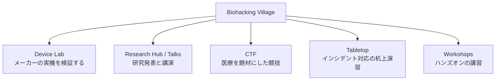
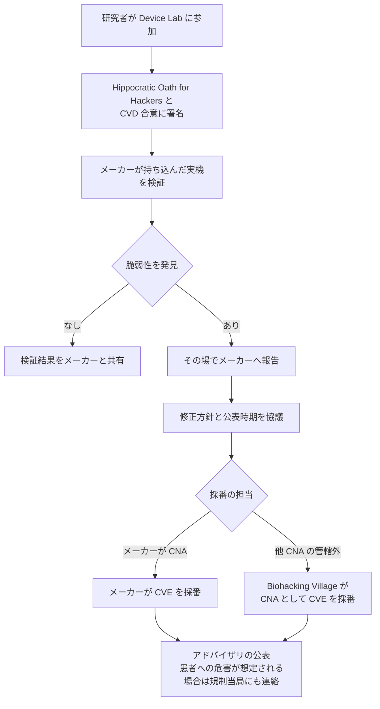

# 🧬 Biohacking Village（DEF CON, CODE BLUE）

稼働中の医療機器に無断で触れることはできない。
中古機を入手しても、保守用の資料もメーカーの回答も得られないため、検証は途中で止まる。
Biohacking Village は、メーカーが実機を会場へ持ち込み、研究者が合意書に署名して検証する形で、この制約を外した場である。
DEF CON では 2014 年から続き、2024 年からは日本の CODE BLUE でも開催されている。

> [!NOTE]
> **表記ルール**：本ページでは、**事実**（一次情報で確認できる内容。出典を併記する）、**報道ベース**（報道や第三者の集計のみで確認でき、当事者の公表資料では裏付けが取れていない内容）、**分析**（筆者の解釈）を書き分ける。
> 出典は、当事者の公表資料、行政文書、CVE、ベンダアドバイザリなどの一次情報を優先して示す。

---

## 名称、組織、活動

| 項目 | 内容 |
|---|---|
| 名称 | Biohacking Village（BHV、[villageb.io](https://villageb.io/)） |
| 位置づけ | DEF CON 内のビレッジのひとつ。医療とバイオセキュリティを扱う |
| 組織 | 501(c)(3) の非営利団体（登録番号 83-3941279） |
| 掲げる目的 | "Healthier Tech for Healthier People"、"making healthcare safer through better cybersecurity" |
| 起点 | 2014 年の DEF CON 22（ラスベガス、Rio Hotel） |
| 主な活動 | 実機を用いた機器検証のラボ、CTF、講演、机上演習、ワークショップ、調整型脆弱性開示（CVD）の支援 |
| CNA | 2023 年 6 月に CVE Numbering Authority となった |
| 開催先 | DEF CON（米国）、CODE BLUE（日本）、DEF CON Singapore、DistrictCon ほか |

（事実、出典：[Biohacking Village About](https://villageb.io/About)、[Our Story](https://villageb.io/OurStory)、[Events](https://www.villageb.io/Events)、[CVE Program](https://medium.com/@cve_program/our-cve-story-biohacking-village-3611169d1f87)）

**分析**：この場の特異さは、参加者の顔ぶれにある。
メーカーの開発者、研究者、臨床医、規制当局、病院側の担当者が同じ部屋にいるため、技術的な指摘が、修正の可否と臨床への影響の議論にその場でつながる。
脆弱性を報告してから相手の窓口を探す通常の順序が、逆になっている。

---

## 沿革

| 時期 | 出来事 |
|---|---|
| 2014 年 | DEF CON 22 でビレッジが始まる。ハッカー、看護師、エンジニアが集まった |
| 2015 年から 2017 年 | 南米、欧州、アジア、中東へ活動を広げる |
| 2016 年 | ニューヨークの国際連合で発表を行う |
| 2023 年 6 月 | CVE Numbering Authority（CNA）となる |
| 2024 年 11 月 | CODE BLUE 2024 で日本初開催（Device Lab と CTF） |
| 2026 年 8 月 | DEF CON 34 で開催。Device Lab で 68 件の指摘が出た |

（事実、出典：[Our Story](https://villageb.io/OurStory)、[Biohacking Village at DEF CON](https://www.villageb.io/def-con)、[CODE BLUE 2024 Biohacking Village](https://archive.codeblue.jp/2024/program/contests-workshops/biohackingvillage/)）

公式サイトは、これまでの累計として、30 か国以上での活動、1000 名を超える研究者への教育、100 機種以上の機器の検証を挙げている（事実、出典：Our Story）。
FDA と HHS の医療機器サイバーセキュリティ関連文書に、ビレッジの成果が反映されたとも説明している（事実、出典：Our Story。
ただし当該文書側での言及は本ページでは未確認）。

---

## ビレッジの構成

会期中は、次の要素が同じフロアで並行して動く（事実、出典：[Biohacking Village at DEF CON](https://www.villageb.io/def-con)、[DEF CON 33 Villages](https://defcon.org/html/defcon-33/dc-33-villages.html)）。

| 要素 | 内容 | 向く人 |
|---|---|---|
| Device Lab | メーカーが持ち込んだ実機を、研究者がその場で検証する | 機器の検証経験を積みたい研究者 |
| Research Hub / Talks | 医療機器、臨床システム、規制動向の講演 | 領域の全体像をつかみたい人 |
| CTF | 医療のシナリオを模した競技。初心者向けの手引きが用意される年もある | 実機に触れる前の入口が欲しい人 |
| Tabletop | 病院で侵害が起きた想定の机上演習 | 医療機関の情報システム部門、CSIRT |
| Workshops | 基板を使った実技、デジタルリテラシーの講習 | 組込みや無線の実技を学びたい人 |

DEF CON 34 の実績として、講演 13 本、ワークショップ参加 103 名、CTF 登録 194 名、80 チーム、総プレイ時間 134 時間が公表されている（事実、出典：Biohacking Village at DEF CON）。

---

## Device Lab で行われること

メーカーが実機を持ち込み、研究者がリアルタイムで検証する。
メーカーの担当者が同席し、質問への回答と、見つかった事象の一次切り分けをその場で行う（事実、出典：[Device Lab](https://www.villageb.io/LabDetails?lab=device)）。

参加している主なメーカーは、BD、MiniMed、Medtronic、Roche、Solventum、Siemens Healthineers、Philips、Boston Scientific、Omnicell である（事実、出典：Device Lab）。

DEF CON 34 の Device Lab では、9 社の 19 機器が研究対象として公開された（事実、出典：[Medical Device Vulnerability Database](https://www.villageb.io/DeviceList)）。

| メーカー | 公開された機器数 |
|---|---|
| Siemens Healthineers | 5 |
| Philips | 3 |
| MiniMed | 2 |
| Solventum | 2 |
| Boston Scientific | 2 |
| Omnicell | 2 |
| BD | 1 |
| Medtronic | 1 |
| Roche | 1 |

掲載されている機器には、患者モニタ（Philips IntelliVue）、超音波（Siemens ACUSON）、PET/CT（Siemens Biograph）、MRI（Siemens MAGNETOM）、インスリンポンプ（MiniMed）、薬剤管理システム（Omnicell）、PCR 診断装置（Roche）が含まれる（事実、出典：Medical Device Vulnerability Database）。

DEF CON 34 の会期を通じて、68 件の機器の指摘が挙がり、いずれも調整型開示として処理された（事実、出典：Biohacking Village at DEF CON）。

**分析**：画像診断装置から薬剤管理まで、臨床で実際に動いている系列が並んでいる。
対象が実機であるため、ネットワーク越しの検証だけでなく、操作画面、保守モード、外部インタフェースといった、資料からは読み取れない部分に触れられる。

---

## 署名する二つの文書

検証に入る前に、研究者は次に同意する（事実、出典：Device Lab）。

- **Hippocratic Oath for Hackers への署名**：会期中と会期後の行動規範に同意する
- **CVD の合意**：脆弱性を見つけた場合の取り扱いを、検証を始める前に確定する

Hippocratic Oath for Hackers は、I Am The Cavalry が作成した文書を起点とし、各国の規制の更新に合わせて毎年改訂されている（事実、出典：[Hippocratic Oath for Hackers](https://villageb.io/HippocraticOath)）。
掲げられているのは、個人データの保護（HIPAA、GDPR、PIPL などの枠組みへの準拠）、医療と重要インフラの安全性の優先、責任ある開示、FDA ガイダンスや MDR に沿った機器の扱い、機微情報の秘匿、公益の増進、当局が定める期限内の報告である（事実、出典：Hippocratic Oath for Hackers）。
DEF CON 34 では、この宣誓に 3274 件の署名があった（事実、出典：Biohacking Village at DEF CON）。

**分析**：この署名は形式的な同意書ではなく、参加者が持ち帰れる情報の範囲を決める文書である。
何を公表できるかが会期の前に確定するため、あとから公表の可否を交渉する必要がない。
一方で、その場で撮った画面や取得したデータを、そのまま登壇資料や SNS に出すことはできない。

---

## 発見から開示までの流れ

CNA としてのスコープは、他の CNA の管轄に含まれない医療機器の脆弱性である（事実、出典：CVE Program）。
CNA になる前は、Device Lab で見つかった脆弱性の扱いはメーカー側に委ねられていた。
講演やワークショップで見つかる脆弱性も責任をもって開示できるようにする必要が、CNA 取得の背景にあった（事実、出典：CVE Program）。

**分析**：CNA を持つことの効果は、報告先が存在しない機器を拾えることにある。
医療機器のメーカーには、製品セキュリティの窓口を持たない企業が残っている。
窓口がない場合、研究者は報告先を探す段階で止まる。
ビレッジが採番できると、この段階で止まっていた指摘が、識別子の付いた公開情報になる。

---

## CODE BLUE の Biohacking Village

日本では、[CODE BLUE](https://codeblue.jp/) の併設ビレッジとして 2024 年に初開催された（事実、出典：[CODE BLUE 2024 Biohacking Village](https://archive.codeblue.jp/2024/program/contests-workshops/biohackingvillage/)、[CODE BLUE 実行委員会 プレスリリース](https://en.atpress.com/news/412216)）。
運営は DEF CON と同じ Biohacking Village である（事実、出典：CODE BLUE 2024 Biohacking Village）。

### 2024 年（初開催）

| 項目 | 内容 |
|---|---|
| 日程 | 2024 年 11 月 14 日 10:00-18:00、11 月 15 日 9:00-16:30 |
| 会場 | 1F Meetingroom 2 |
| 対象 | CODE BLUE 参加者全員 |
| 内容 | Device Lab、CTF「Code D.A.R.K.」 |

Device Lab では、行動規範に署名した研究者が医療機器とアプリケーションをその場で検証した（事実、出典：CODE BLUE 2024 Biohacking Village）。
CTF「Code D.A.R.K.」は、生体データをデジタル資産と同じ重みで守ることを題材とし、初参加者向けの手引きが用意された（事実、出典：CODE BLUE 2024 Biohacking Village）。

### 2025 年

| 項目 | 内容 |
|---|---|
| 日程 | 2025 年 11 月 18 日 10:00-17:30、11 月 19 日 10:00-16:00 |
| 会場 | 1F Conference Room（ベルサール高田馬場） |
| 対象 | CODE BLUE 2025 参加者全員 |
| 内容 | 講演、ハンズオンボードワークショップ、CTF「Code Crimson」、実機の展示と検証 |

講演では、生体医療分野のセキュリティ、患者ケアへの影響、医療インフラが持つ国家安全保障上の位置づけ、ハッカーと産業界と規制当局のあいだの脆弱性開示の実務が扱われた（事実、出典：[CODE BLUE 2025 Biohacking Village](https://archive.codeblue.jp/2025/program/contests-workshops/biohacking-village/)）。
ハンズオンワークショップは、医療機器の接続性、セキュリティ機能、安全な探索手法を扱う基板演習である（事実、出典：CODE BLUE 2025 Biohacking Village）。
Device Lab で扱われた機材として、Operative Suite の ICS 用プログラマブルロジックコントローラと EKO の電子聴診器、CTF 用の SolaSec トレーニングボードが公表されている（事実、出典：[Biohacking Village at CODE BLUE 2025](https://villageb.io/CodeBlue2025)）。
血圧、血糖、酸素飽和度の測定に関する技術デモも行われた（事実、出典：Biohacking Village at CODE BLUE 2025）。

同じ会期には、Aerospace Village、Car Hacking Village、ICS Village、Maritime Village が併設された（事実、出典：Biohacking Village at CODE BLUE 2025）。

### 2026 年

CODE BLUE 2026 は、トレーニングが 11 月 11 日から 15 日、カンファレンスが 11 月 17 日から 18 日にベルサール高田馬場で開催される（事実、出典：[CODE BLUE 公式ニュース](https://codeblue.jp/about/news/20251121-codeblue2025_finish_to_2026/)）。
併設ビレッジの一覧は、2026 年 8 月 20 日時点で公表されていない（未確認、確認先：[Contests/Workshops](https://codeblue.jp/program/contests-workshops/)）。

### DEF CON との違い

| 観点 | DEF CON（ラスベガス） | CODE BLUE（東京） |
|---|---|---|
| 会期 | 4 日間。DEF CON 34 は 2026 年 8 月 6 日から 9 日、LVCC West Hall | 2 日間。会議室 1 室で全要素を回す |
| Device Lab の規模 | 9 社 19 機器（DEF CON 34） | ICS 用 PLC、電子聴診器などの機材（2025 年） |
| 講演 | 13 本（DEF CON 34） | ビレッジ内のトラックで実施。本数は未確認 |
| CTF | 年ごとに変わる。DEF CON 34 は登録 194 名、80 チーム | 2024 年は Code D.A.R.K.、2025 年は Code Crimson |
| 参加条件 | DEF CON への現地参加と、宣誓への署名 | CODE BLUE 参加者は追加登録なしで入れる。検証には行動規範への署名が要る |

Device Lab に機器を出しているとして公表されているメーカーは、いずれも海外の企業である（事実、出典：Device Lab）。

**分析**：規模は DEF CON が上回るが、日本の医療機関や国内メーカーの担当者にとっては CODE BLUE のほうが実際に行ける。
渡航を伴わずに、医療機器の検証がどう行われ、どこまでが許容され、指摘がどう処理されるかを一度見ておける。
国内メーカーの製品が Device Lab に並ぶようになれば、国内で CVD を受け付ける体制づくりの実例が増える。

---

## 技術者が持ち込める技能と、事前の準備

**分析**：Device Lab で有効なのは、医療特有の知識よりも、組込みとネットワークの基本的な検証技能である。

| 技能 | 医療機器での現れ方 |
|---|---|
| ネットワークサービスの検証 | 保守用のポート、Web の管理画面、独自プロトコルの待ち受け |
| 医療プロトコルの理解 | DICOM、HL7 v2、FHIR のインタフェース（[PACS / DICOM のセキュリティ](../../technology/medical-devices/pacs-dicom.md)） |
| 無線の検証 | BLE、Wi-Fi、独自の近距離無線（インスリンポンプ、患者モニタ） |
| 組込みの検証 | シリアル、JTAG、ファームウェアの取得と解析 |
| 認証と権限の検証 | 保守モード、既定の資格情報、権限の分離 |

準備として次を勧める（分析）。

- 実機の検証は現地参加が前提になる。オンラインでの Device Lab は提供されていない。
- 対象機器は年ごとに変わる。事前に公開される機器リストから、狙う系統を先に決める。会期中に選び直す時間はない。
- 対象機器の MDS2 や公開マニュアル、既存の CVE と ICS Medical Advisory を読んでおく。既知の指摘を再発見しても成果にならない。
- メーカーごとに CVD ポリシーが異なる。破壊を伴う操作や分解の可否は、触る前に担当者へ確認する。
- 検証のログを自分の手元に残す。報告の粒度が、その後の協議の速さを決める。
- 医療機器の修正は、配布に薬事上の手続きが伴うため、一般的なソフトウェアより開示までの期間が長くなる（[医療機器の検証手法](../../technology/medical-devices/testing-methodology.md)）。

医療機関の情報システム部門や CSIRT の担当者にとっては、Device Lab より Tabletop と講演のほうが自組織の運用に直結する（分析）。

---

## 関連ページ

- [ラボ、コミュニティ](README.md)
- [医療機器の検証手法](../../technology/medical-devices/testing-methodology.md)
- [IoMT（医療 IoT 機器）のセキュリティリスク](../../technology/medical-devices/iomt.md)
- [PACS / DICOM のセキュリティ](../../technology/medical-devices/pacs-dicom.md)
- [Bug Bounty × 医療、ヘルスケア](../../practice/bug-bounty/)
- [学習リソース](../resources/learning.md)

---

[トップへ](../../../README.md)
