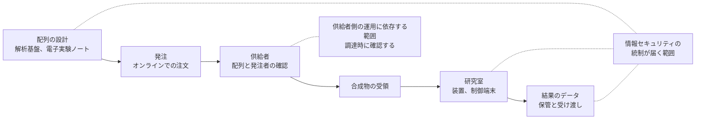

# 🧫 サイバーバイオセキュリティ

生物学の研究と製造は、機器と情報システムを介して行われる。
配列は電子データとして設計され、注文はオンラインで出され、合成された物質が届く。
この経路のどこかで、情報セキュリティの問題が生物学的な危害につながりうる、という関心の置き方をサイバーバイオセキュリティと呼ぶ。

本ページは、この領域のうち、製薬企業の研究部門と研究機関が実務として扱える範囲に絞る。
注文のスクリーニング、機器の管理、配列データの取り扱いの三点である。

> [!NOTE]
> **表記ルール**：本ページでは、**事実**（一次情報で確認できる内容。出典を併記する）、**報道ベース**（報道や第三者の集計のみで確認でき、当事者の公表資料では裏付けが取れていない内容）、**分析**（筆者の解釈）を書き分ける。

---

## 本リポジトリで扱う範囲

**分析**：この領域は、生物兵器の規制から研究室の情報システムまで、幅が広い。
本リポジトリの目的（医療機関と製薬企業の防御）に沿う範囲は、次の三つに限られる。

| 範囲 | 扱うこと | 扱わないこと |
|---|---|---|
| 注文のスクリーニング | 合成核酸の調達で、供給側がどのような確認を行っているか | 具体的な配列や、危害の生じうる手順 |
| 機器と研究室のシステム | 実験機器、解析基盤、電子実験ノートの保護 | 設備の生物学的な封じ込め設計 |
| 配列データの取り扱い | 研究データとしての機密性と完全性 | 生物学的リスク評価の方法論 |

**分析**：三つ目は、[ゲノムデータの保護](../../technology/genomics.md)および[治験と研究データ](../pharma/clinical-trials.md)と重なる。
本ページでは、注文と機器の側を中心に置く。

---

## 合成核酸のスクリーニング

**事実**：米国では、大統領令 14110（2023 年 10 月 30 日）にもとづき、OSTP が 2024 年 4 月 29 日に「Framework for Nucleic Acid Synthesis Screening」を公表した。
連邦の生命科学研究資金を受ける条件として、スクリーニングの要件を満たす提供者から合成核酸およびベンチトップ合成装置を調達することを求める枠組みである。
出典：[ASPR 2024 OSTP Framework for Nucleic Acid Synthesis Screening](https://www.aspr.gov/readiness-response/medical-countermeasures-biodefense/s3/synthetic-nucleic-acid-screening/ostp-framework-nucleic-acid-synthesis-screening)

**事実**：大統領令 14110 は 2025 年 1 月に撤回された。
2025 年 5 月 5 日の大統領令 14292「Improving the Safety and Security of Biological Research」が、2024 年の枠組みの改訂または置き換えを指示している。
出典：[Federal Register 2025-08266](https://www.federalregister.gov/documents/2025/05/08/2025-08266/improving-the-safety-and-security-of-biological-research)

**事実**：2026 年 8 月時点で、置き換えとなる枠組みは公表されていない。
出典：[ASPR の案内](https://aspr.hhs.gov/S3/Pages/OSTP-Framework-for-Nucleic-Acid-Synthesis-Screening.aspx)

**事実**：業界側の枠組みとして、遺伝子合成の事業者等で構成される International Gene Synthesis Consortium（IGSC）があり、注文の配列と発注者の双方を確認する共通の手順を運用している。
出典：[IGSC](https://genesynthesisconsortium.org/)

**事実**：2024 年 2 月に設立された International Biosecurity and Biosafety Initiative for Science（IBBIS）は、無償で公開されるスクリーニング用のツール Common Mechanism を提供しており、IGSC の会員でもある。
出典：[IBBIS Common Mechanism](https://ibbis.bio/our-work/common-mechanism/faq/)、[IBBIS Joins International Gene Synthesis Consortium](https://ibbis.bio/ibbis-joins-international-gene-synthesis-consortium/)

**分析**：制度が動いている最中であるため、調達側が確認できるのは「供給者がどの枠組みに参加し、どの手順で確認しているか」になる。
規制の条文を追うより、取引先の運用を確認するほうが実務に直結する。

---

## 研究部門の情報システム

**分析**：研究部門は、診療部門と違う理由で統制が緩みやすい。

| 事情 | 生まれる状態 | 対応の方向 |
|---|---|---|
| 装置ごとに専用の制御端末が付属する | サポートが終了した OS が残る | 装置ネットワークを分離する（[ネットワークの分離](../../technology/segmentation.md)） |
| 研究室単位で機器と基盤を運用する | 共有アカウント、個人の裁量での構成変更 | 個人 ID の維持と、機器の台帳化（[認証とアクセス管理](../../technology/identity.md)） |
| 外部との共同研究が多い | データの受け渡し手段が定まらない | 受け渡し経路を限定し、記録を残す |
| 解析に大量の計算資源を使う | クラウド上に一時的な環境が作られる | 権限の既定値と、設定変更の検知 |
| 発表前のデータを扱う | 漏えいが競争上の損失に直結する | 保存場所の限定と、持ち出しの記録 |

**分析**：この表の内容は、製造設備（[製造設備と OT](../pharma/manufacturing-ot.md)）や医療機器（[医療機器のセキュリティ](../../technology/medical-devices/)）で扱う制約とほぼ同じである。
研究部門に固有なのは、装置と手順を変える裁量が現場にあることで、これは統制の弱さであると同時に、対策を現場の判断で入れられる余地でもある。

---

## AI の進展との関係

**分析**：本リポジトリのトップページで述べたとおり、能力の向上は攻撃側と防御側の双方に効くが、届く順序が違う。
生物学の領域では、モデル提供者が独自に評価と制限を設ける動きがあるが、これは提供者ごとに異なり、時期によっても変わる。
研究機関と製薬企業の側で、防御の前提としてこれを数えるのは適切でない。

**分析**：実務として置ける対策は、次の二点に限られる。

- 発注と調達の経路で、供給者が行うスクリーニングの内容を確認する
- 研究データと配列情報の保管、受け渡し、持ち出しを記録できる状態にする

いずれも既存の情報セキュリティの範囲に収まる。
この領域に固有の新しい統制を作るより、既存の統制を研究部門まで広げるほうが実行しやすい。

---

## 参照先

| 組織、文書 | 内容 |
|---|---|
| [OSTP Framework for Nucleic Acid Synthesis Screening](https://aspr.hhs.gov/S3/Pages/OSTP-Framework-for-Nucleic-Acid-Synthesis-Screening.aspx) | 合成核酸の調達に関する米国の枠組み。改訂の状況もこのページで示される |
| [International Gene Synthesis Consortium](https://genesynthesisconsortium.org/) | 遺伝子合成の事業者等による業界の枠組み |
| [IBBIS](https://ibbis.bio/) | 国際的な生物安全とバイオセキュリティの取り組み。Common Mechanism を提供 |
| [Biohacking Village](biohacking-village.md) | 医療機器とバイオの領域を扱うコミュニティ |

---

## 関連ページ

- [Biohacking Village（DEF CON、CODE BLUE）](biohacking-village.md)：実機に触れられる場
- [ゲノムデータの保護](../../technology/genomics.md)：配列データの保管と二次利用
- [治験と研究データ](../pharma/clinical-trials.md)：製薬企業の研究データ
- [製造設備と OT](../pharma/manufacturing-ot.md)：装置ネットワークの制約
- [AX：医療における AI のセキュリティ](../../technology/dx-ax/ai-security.md)：AI の導入に伴う脅威

---

[← ラボ、コミュニティ](README.md) | [トップへ](../../../README.md)
