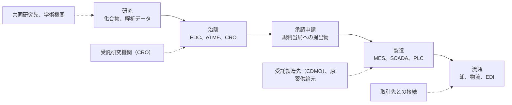

# 💊 製薬企業のセキュリティ

製薬企業が守る対象は、医薬品の供給と、承認前の研究データである。
医療機関と同じく可用性と完全性が先に来るが、止まったときに困る相手も、盗まれたときに失うものも異なる。

> [!NOTE]
> **表記ルール**：本ページでは、**事実**（一次情報で確認できる内容。出典を併記する）、**報道ベース**（報道や第三者の集計のみで確認でき、当事者の公表資料では裏付けが取れていない内容）、**分析**（筆者の解釈）を書き分ける。
> 出典は、行政文書、規制当局の公表資料、当事者の公表資料などの一次情報を優先して示す。

## 医療機関との違い

| 観点 | 医療機関 | 製薬企業 |
|---|---|---|
| **止まると何が起きるか** | 診療が止まる。影響は受診中の患者に即時に及ぶ | 出荷が止まる。影響は治療を続けている患者に、在庫が切れた時点で及ぶ |
| **主に狙われるデータ** | 診療情報。再発行できず、恐喝の材料になる | 承認前の研究データと治験データ。盗まれた時点で先行の価値が戻らない |
| **変更を縛るもの** | 薬事承認された医療機器の構成 | バリデーション済みの計算機化システムと製造設備 |
| **攻撃対象領域の外縁** | 委託事業者、保守回線 | 受託研究機関、受託製造先、原薬の供給元 |
| **停止の見え方** | 当日に表面化する | 在庫が尽きるまで表面化しない |

**分析**：最後の行が、対応の設計を分ける。
医療機関では停止が即座に可視化されるのに対し、製薬では出荷停止から供給不足までに時間差があり、その間に判断を誤ると影響が広域化する。

## 攻撃対象領域

**分析**：どの段にも外部組織との接続があり、自社の内側だけを対象にした設計では経路を塞げない。
研究と治験の段は情報の窃取が、製造と流通の段は停止が、それぞれ主な損害の形になる。

## 一覧

- [治験と研究データ](clinical-trials.md)
- [製造設備と OT](manufacturing-ot.md)
- [原薬、受託製造、流通](supply-chain.md)

## 規制の位置づけ

**事実**：欧州の GMP ガイドライン（EudraLex Volume 4）は、計算機化システムに対する要件を Annex 11 として定めている。
出典：[EudraLex Volume 4](https://health.ec.europa.eu/medicinal-products/eudralex/eudralex-volume-4_en)

**事実**：PIC/S は、GMP ガイド（PE 009-17）を公開しており、Annex 11 の改訂ドラフトを 2025 年 7 月に「Documents for Industry」として掲載している。
改訂の検討自体は 2022 年 11 月のコンセプトペーパーから続いている。
出典：[PIC/S Publications](https://picscheme.org/en/publications)

**分析**：計算機化システムへの要件が GMP の一部として書かれている以上、セキュリティ対策は品質保証部門の管轄と重なる。
情報システム部門だけで変更を決められない構造は、医療機関が医療機器に対して置かれている立場と同じである。

## 関連

- [脅威アクターと TTPs](../../threats/actors/)：医療と製薬の双方を標的とするランサムウェアグループ
- [ガイドラインと法規制](../../guidelines/)：国内外の規制の全体像
- [インシデント事例集](../../threats/incidents/)：医療機関の事例

---

[トップへ](../../../README.md)
