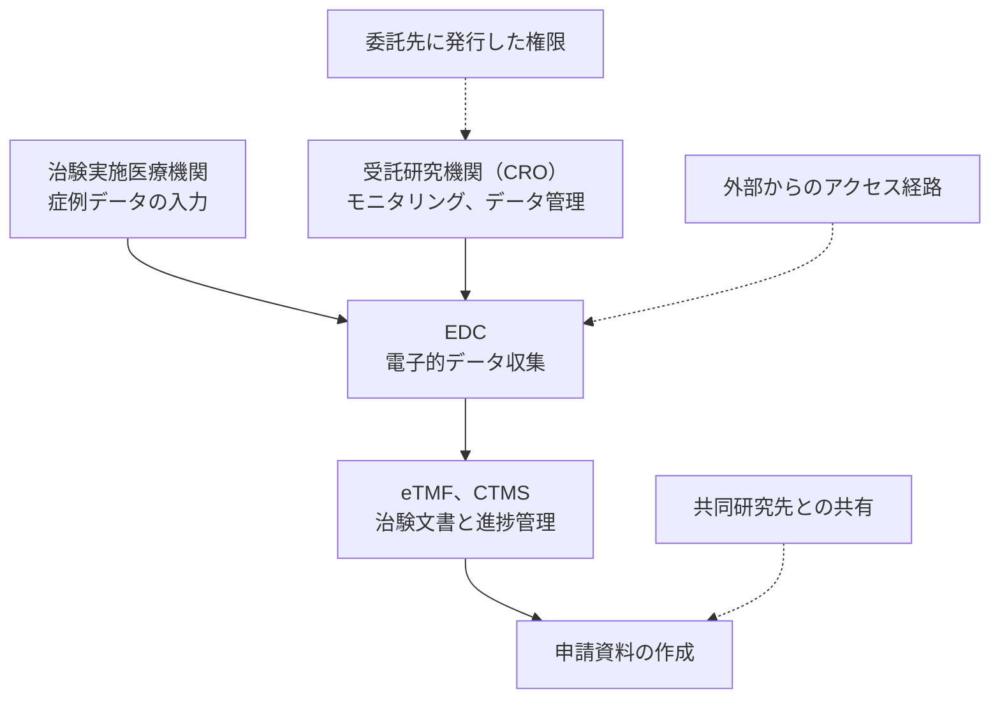

# 🧪 治験と研究データ

新薬の開発では、承認前のデータが最大の資産になる。
公表前に持ち出された研究データは、暗号化されたシステムと違って復旧できない。

> [!NOTE]
> **表記ルール**：本ページでは、**事実**（一次情報で確認できる内容。出典を併記する）、**報道ベース**（報道や第三者の集計のみで確認でき、当事者の公表資料では裏付けが取れていない内容）、**分析**（筆者の解釈）を書き分ける。

## 何が価値を持つか

| 対象 | 内容 | 盗まれたときの損失 |
|---|---|---|
| **化合物と解析データ** | 候補化合物の構造、スクリーニング結果 | 研究への投資が、他社の出発点になる |
| **治験データ** | 症例データ、有効性と安全性の評価 | 開発の進捗と結果が、公表前に外部へ渡る |
| **申請書類** | 規制当局への提出物一式 | 承認の見通しが外部に知られる |
| **被験者情報** | 同意書、識別コード、健康状態 | 要配慮個人情報の漏えいとして扱われる |

**分析**：上の三つは、恐喝よりも窃取そのものが目的になりやすい。
暗号化して身代金を要求する手口とは、必要な検知の形が変わる。
大量の外向き転送と、公開前資料への異常な参照を、停止よりも先に捉える必要がある。

## 攻撃対象領域

治験は、複数の組織が同じデータを扱う業務である。

侵入の起点になりやすいのは、次の三つである。

- **外部公開されたシステムの認証**：EDC や治験関連ポータルは、実施医療機関から接続できる必要があり、外部に開いている。
- **委託先に発行した権限**：受託研究機関の担当者に付与したアカウントが、契約終了後も有効なまま残る。
- **研究者個人のアカウント**：学術機関との共同研究では、管理外の端末とメールアドレスが混ざる。

## 完全性の問題

盗まれることだけが損害ではない。

**分析**：治験データの改ざんは、情報漏えいではなく試験そのものの成立に関わる。
割り付け情報への不正なアクセスは盲検性を損ない、記録の書き換えは、どの時点のデータが正しいかを事後に決められない状態を作る。
どちらも、発覚した時点で試験の一部をやり直す判断につながりうる。

**事実**：欧州の GMP ガイドラインは、計算機化システムに対する要件を Annex 11 として定めており、PIC/S も同名の附属書を GMP ガイドに含めている。
出典：[EudraLex Volume 4](https://health.ec.europa.eu/medicinal-products/eudralex/eudralex-volume-4_en)、[PIC/S Publications](https://picscheme.org/en/publications)

**事実**：治験の実施基準は、ICH が国際的な調和の枠組みを定めている。
出典：[ICH](https://www.ich.org/)

## 検知と緩和

| 対象 | 打ち手 |
|---|---|
| 委託先の権限 | 契約単位で有効期限を設定し、終了時の失効を手続きに組み込む |
| 外部公開システム | 多要素認証を必須にし、実施医療機関からの接続元を限定する |
| データの持ち出し | 公開前資料への参照と外向き転送を、量と時間帯で監視する |
| 記録の完全性 | 変更履歴を、変更した本人が消せない場所に残す |
| 割り付け情報 | 盲検を維持する範囲の権限を、業務上の役割と一致させる |
| 共同研究 | 共有する範囲を対象データ単位で決め、組織間の接続を常設にしない |

> [!IMPORTANT]
> 治験データの取り扱いは、品質保証部門と情報システム部門の双方が関わる。
> 権限設計を情報システム部門だけで決めると、業務上の役割との対応が取れなくなる。

## 関連

- [製造設備と OT](manufacturing-ot.md)
- [ガイドラインと法規制](../../guidelines/)

---

[製薬企業のセキュリティ](README.md) | [トップへ](../../../README.md)
