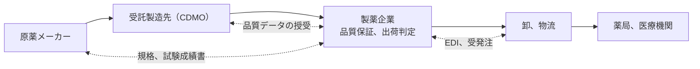

# 🔗 原薬、受託製造、流通

一つの医薬品が患者に届くまでに、原薬の製造元、製剤の受託先、包装、卸、薬局が関わる。
このどこか一点が止まっても、供給は途切れる。

> [!NOTE]
> **表記ルール**：本ページでは、**事実**（一次情報で確認できる内容。出典を併記する）、**報道ベース**、**分析**（筆者の解釈）を書き分ける。

## つながりの形

**分析**：取引先との接続は、受発注のためのデータ交換と、品質データの授受という二種類がある。
前者は止まると出荷が滞り、後者は改ざんされると出荷判定の根拠が崩れる。
どちらも、相手先の環境に依存する。

## 侵入経路になりやすい接続

- **取引先に発行したアカウント**：発注ポータルや品質データの共有基盤に、社外の担当者が接続する。
- **受託先との常設接続**：製造の委託先と、設計情報や製造記録をやり取りするための経路が常時開いている。
- **物流と卸のデータ交換**：受発注のための接続が、業務の都合で広い権限のまま運用される。
- **買収した拠点の統合**：買収後に接続した拠点が、統合前の運用のまま残る。

**分析**：接続の目的は限定されているのに、権限とネットワーク経路が限定されていない場合が多い。
これは医療機関が委託事業者との接続で抱えている問題と同じ構造であり、対策も同じ方向に向く。

## 集中と単一障害点

**分析**：原薬の供給が特定の地域や事業者に集中している品目では、一社の停止が供給不足に直結する。
セキュリティ事象が起きたときに代替の調達先へ切り替えられるかどうかは、契約と在庫の設計で先に決まっている。
この判断は情報システム部門の管轄外にあるため、事業継続計画の側で扱う必要がある。

## 検知と緩和

| 対象 | 打ち手 |
|---|---|
| 取引先のアカウント | 有効期限と棚卸しの周期を契約に紐づけ、担当者の異動時に失効させる |
| 常設接続 | 用途ごとに経路を分け、接続先と通信先を明示的に許可した相手に限る |
| データの授受 | 品質データの受け渡しに、改ざんを検出できる形式と記録を用いる |
| 供給の継続 | 主要な品目について、供給元が停止した場合の手順を決めておく |
| 統合 | 買収した拠点の接続を、統合前に棚卸しの対象として扱う |
| 情報共有 | 業界の情報共有組織を通じて、同種の攻撃の兆候を受け取る |

**事実**：医療分野の情報共有組織として、Health-ISAC が国際的に活動している。
出典：[Health-ISAC](https://health-isac.org/)

**事実**：国内の医薬品に関する制度は、厚生労働省が所管している。
出典：[厚生労働省 医薬品、医療機器](https://www.mhlw.go.jp/stf/seisakunitsuite/bunya/kenkou_iryou/iyakuhin/index.html)

## 関連

- [製造設備と OT](manufacturing-ot.md)
- [脅威アクターと TTPs](../../threats/actors/)

---

[製薬企業のセキュリティ](README.md) | [トップへ](../../../README.md)
