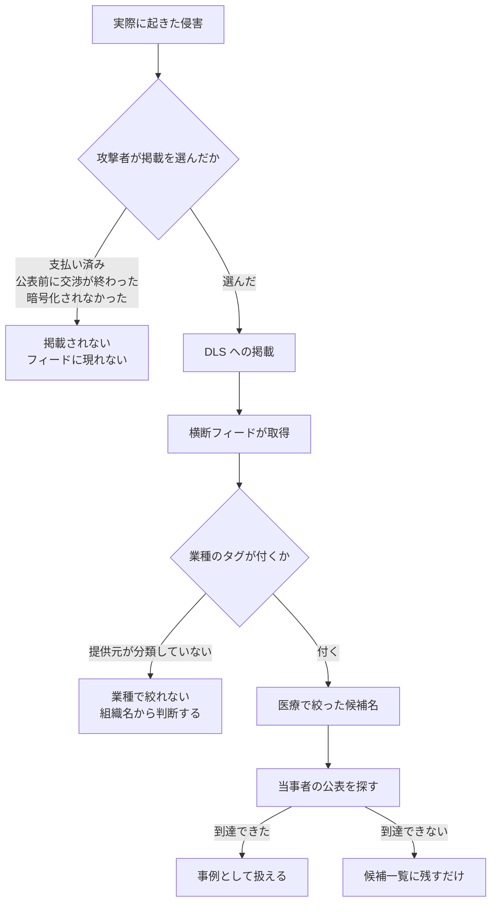

# 🕸️ リークサイト横断フィード

ランサムウェアグループと恐喝グループは、身代金の交渉を有利に進めるため、被害を受けた組織の名前を自らの公開サイト（Data Leak Site、DLS）に掲載する。
この掲載を横断して集めて公開しているサイトが、有志と事業者の双方から提供されている。

医療分野では、この種のフィードは候補名を得る入口として使える。
組織名に医療を示す語がない事業者や、非英語圏の被害は、報道の検索だけでは届かないことがあるためである。
一方で、掲載は攻撃者の主張であって、当事者の公表ではない。
本ページはサイトの一覧と、それぞれで医療をどう絞り込めるかを示す。
使い方の制約は[事例の調べ方](../../threats/incidents/research-tips.md#3-リークサイトの横断フィードで候補名を補う)に定めている。

> [!NOTE]
> **表記ルール**：本ページでは、**事実**（一次情報で確認できる内容。出典を併記する）と、**分析**（筆者の解釈）を書き分ける。
> 各サイトの機能、利用条件、掲載件数は運営者の都合で変わる。本ページの記載は 2026 年 8 月 26 日に各サイトを参照した時点のものである。

> [!IMPORTANT]
> 掲載は推奨ではない。
> 公開情報で存在と内容を確認できたものを並べている。網羅も主張しない。
> **掲載された組織名を、そのまま被害の事実として書かない**。当事者または公的機関の公表に到達できたものだけを事例として扱う。

---

## フィードに載るもの、載らないもの

**分析**：フィードが写しているのは、攻撃者が掲載を選んだ範囲に限られる。
被害の全体を写した集合ではないため、件数を統計として引くと実態からずれる。



掲載の有無は、被害の大きさの根拠にもならない。
支払いに応じた組織ほど掲載されにくく、大規模な被害が抜け落ちる向きに偏る。

---

## 業種で絞り込めるフィード

| サイト | 運営 | 扱う範囲 | 医療の絞り込み | 利用条件 |
|---|---|---|---|---|
| [ransomware.live](https://www.ransomware.live/) | Julien Mousqueton。About に「personal project built and maintained independently, outside of working hours」と記載 | 被害組織名、グループ、国、掲載日、掲載画面の記録、統計、世界地図、ランサムノート、交渉ログ | [Healthcare の一覧](https://www.ransomware.live/activity/Healthcare)。API は [`/v2/sectorvictims/Healthcare`](https://api.ransomware.live/v2/sectorvictims/Healthcare) | API v2 は「Personal use only」「not intended for corporate or business use」「Rate limited: 1 req/min per endpoint」。法人利用は有料の API PRO |
| [Ransomfeed](https://ransomfeed.it/) | Dario Fadda（伊） | 被害組織名、グループ、国、地域、都市、業種（`work_sector`）、RQL という検索言語、公開 API | [`work_sector="Healthcare services"` の検索結果](https://ransomfeed.it/?page=search-rql&q=d29ya19zZWN0b3I9IkhlYWx0aGNhcmUgc2VydmljZXMi)。業種別の集計は [`/stats/sectors`](https://api.ransomfeed.it/stats/sectors) | 公開 API（`api.ransomfeed.it`、既定 100 件、最大 1000 件） |
| [Ransomtracker（Ransomnews）](https://ransomnews.com/ransomtracker/) | Ransomnews | RansomLook のデータに業種の分類を付け直したもの | Industry のフィルタ。URL は固定形ではない | 「Source data: RansomLook (CC BY 4.0), aggregated and adapted by Ransomnews」と明記 |
| [Ransom-DB](https://www.ransom-db.com/) | 運営者の記載を確認できず | 被害組織名、グループ、国、Industry、被害組織の概要文、脅威マップ | 各件に Industry が付く。ただし無料枠は直近 10 件の表示に限られ、検索とフィルタは登録が必要 | 無料枠は API 対象外。API は Researcher 以上の有料プラン |

### 業種タグの粒度は提供元ごとに違う

**事実**：Ransomfeed の `work_sector` は医療系が複数の値に割れている。
2026 年 8 月 26 日時点の累計は、Healthcare services が 1406 件、Health が 348 件、Pharmacy and drugs manufacturing が 280 件、Healthcare research が 141 件、Public Health が 57 件、Ambulance Services が 1 件である。
一方 ransomware.live の分類は Healthcare の一つにまとまっている。

**分析**：そのため、サイト間で医療の件数を比較しても意味を持たない。
Ransomfeed で医療を数えるときは複数の値を足す必要があり、綴りの近い Hospitality（宿泊）を巻き込みやすい。
本リポジトリでは、統計は[年ごとのページ](../../threats/incidents/years/)に挙げた公的な集計を使い、フィードの件数は使わない。

取得の例を挙げる。

```sh
# 医療系の work_sector を機械的に拾う（Ransomfeed）
curl -sS "https://api.ransomfeed.it/stats/sectors" -o sectors.json
python3 -c '
import json
kw = ("health", "hospit", "medic", "pharma", "clinic", "ambul")
for k, v in json.load(open("sectors.json")).items():
    if any(w in k.lower() for w in kw):
        print(v["total"], k)
'
```

ransomware.live の API を使う例は[事例の調べ方](../../threats/incidents/research-tips.md#3-リークサイトの横断フィードで候補名を補う)に置いている。

---

## 業種の分類を持たないフィード

| サイト | 運営 | 扱う範囲 | 利用条件 |
|---|---|---|---|
| [RansomLook](https://www.ransomlook.io/) | Alexandre Dulaunoy と Fafner（[_KeyZee_]）。2022 年から稼働 | DLS に加えて Telegram とフォーラムの投稿、暗号資産アドレス、ランサムノート、[RSS](https://www.ransomlook.io/rss.xml) | コードは AGPLv3、コンテンツは CC BY 4.0 |
| [ransomwatch](https://github.com/joshhighet/ransomwatch) | Josh Highet | `posts.json` と `groups.json` を Git の履歴つきで保持する | Unlicense。**2026 年 3 月 3 日にアーカイブされ、読み取り専用**になった |

**分析**：RansomLook は業種を持たないため、医療だけを取り出す用途には向かない。
組織名やグループ単位で追うとき、あるいは Telegram の投稿まで含めて見たいときに使う。

ransomwatch は更新が止まっているが、掲載日つきの記録が Git の履歴に残っているため、過去の掲載時点を後から再現する用途で使える。
新しい掲載を追う目的には使えない。

---

## 商用の監視サービス

| サイト | 運営 | 扱う範囲 | 利用条件 |
|---|---|---|---|
| [eCrime.ch](https://ecrime.ch/) | Cam Michel | 280 を超える恐喝、リーク元の監視、子会社のマッピング、業種のタグ付け | 商用。[Weekly Report](https://ecrime.ch/weekly-report.php) は無料で読める |
| [DarkFeed](https://darkfeed.io/) | DarkFeed | リークサイトの掲載と脅威アクターの監視 | 商用。`app.darkfeed.io` へ転送され、ログインが必要 |

**分析**：無料のフィードとの違いは、被害組織の子会社や取引先まで名寄せする機能にある。
供給元の被害が自組織の診療に波及するかを継続して見るなら、この種のサービスが対象になる。
本リポジトリの用途（過去の事例を調べる）には、無料のフィードで足りる。

---

## 掲載を追った調査報道

フィードが列挙にとどまるのに対し、個々の掲載を追って裏を取る媒体がある。
攻撃グループの主張と当事者の説明が食い違う場面を扱うため、フィードの次に読む先になる。

| サイト | 運営 | 扱う範囲 | 医療の絞り込み |
|---|---|---|---|
| [DataBreaches.net](https://databreaches.net/) | Dissent Doe。2009 年から。「This site is totally non-commercial and not-for-profit. We do not accept sponsored posts.」と明記 | 侵害の報道と独自取材。攻撃グループへの直接取材を含む | [Healthcare Sector のカテゴリ](https://databreaches.net/category/healthcare-sector/) |
| [SuspectFile](https://www.suspectfile.com/) | Marco A. De Felice（amvinfe）。2006 年から | 個々の掲載を検証した記事。窃取されたとされるデータの内容と、当事者の対応を扱う | カテゴリの分類はない。記事単位で読む |

**分析**：どちらも一次情報ではなく報道である。
本リポジトリで引くときは「報道ベース」として扱い、当事者の公表資料に当たり直す。
ただし、当事者が沈黙している事案について何が起きているかを知る手がかりとしては、フィードの列挙より情報量が多い。

---

## 使うときの制約

本リポジトリでフィードを使うときの手順と判定の境界は、[事例の調べ方](../../threats/incidents/research-tips.md#3-リークサイトの横断フィードで候補名を補う)に定めている。
要点は三つである。

- 用途は**候補名の取得に限る**。掲載されただけの組織名を事例として書かない
- 事案の存在と、攻撃グループの帰属を分ける。帰属は当事者が事案を公表している場合に「報道ベース」として併記する
- 件数を統計として引かない。掲載されない被害が抜け落ちるため、実態の集計にならない

**分析**：フィードの参照そのものは、公開されている集約サイトを見る行為であり、DLS へ直接接続する行為とは別である。
攻撃者のサイトへ自組織の環境から接続すると、接続元が記録される。
調査の目的でも、そこまで踏み込む必要があるかを先に決めておく。

---

## 関連ページ

- [事例の調べ方](../../threats/incidents/research-tips.md)：情報源、手順、落とし穴。フィードの使い方の規範はここにある
- [インシデント事例集](../../threats/incidents/)：収録した事例と、収録の基準
- [脅威アクターと TTPs](../../threats/actors/)：グループごとの傾向
- [セキュリティサービスのカタログ](../security-services/)：監視を外部から調達する場合の区分

---

<sub>[トップへ](../../../README.md)</sub>
