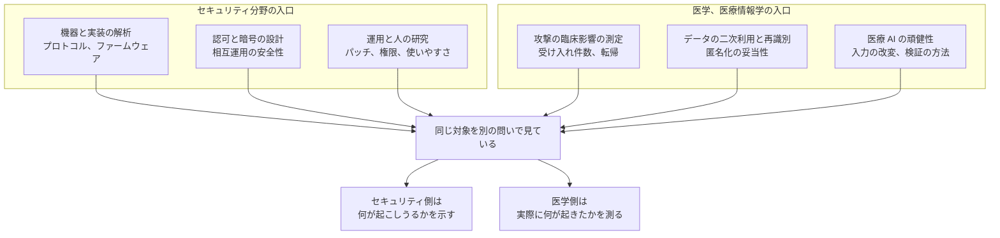

# 🔬 医療とヘルスケアの研究に現れるセキュリティのテーマ

医療のセキュリティに関する研究は、一つの分野にまとまっていない。
セキュリティの学会に出るものと、医学と医療情報学の学会に出るものがあり、扱う問いも査読の基準も違う。
同じ「病院へのランサムウェア」を、前者は侵入経路と機器の実装として扱い、後者は救急の受け入れ件数と転帰として扱う。

実務者がこの領域の研究を読む理由は二つある。
一つは、制度になる前の論点が先に現れることである。
もう一つは、対策の効果が測られた数少ない場所であることである。
本ページは、どこに何のテーマがあるかの地図を示す。
個別の文献の一覧は [論文、レポート](research.md) に置いている。

> [!NOTE]
> **表記ルール**：本ページでは、**事実**（一次情報で確認できる内容。出典を併記する）、**報道ベース**（報道や第三者の集計のみで確認でき、当事者の公表資料では裏付けが取れていない内容）、**分析**（筆者の解釈）を書き分ける。
> 学会の名称、開催、公募は年ごとに変わる。参照するときは出典先の最新の記載を確認してほしい。

---

## 研究が入ってくる二つの入口

**分析**：この二つは、証拠の性質が違う。
セキュリティ側の研究は、条件を作れば再現できることを示す。
医学側の研究は、母集団で観察された差を示す。
再現できる攻撃が実際には起きていないこともあり、実際に起きた被害の機構が特定されていないこともある。
片方だけでは、対策の優先順位を決められない。

---

## テーマの地図

| テーマ | 問われていること | 手がかりになる文献、資料 |
|---|---|---|
| 埋め込み機器と生体情報の機器 | 無線通信の認証、電力制約下での防御 | [論文、レポート](research.md#医療機器セキュリティの基礎になった研究)に挙げた初期の研究群 |
| 医用画像とプロトコル | 認証を持たない規格の運用、匿名化の消し残し | [PACS / DICOM のセキュリティ](../../technology/medical-devices/pacs-dicom.md) |
| 相互運用と認可 | 標準 API で誰がどこまで取得できるか、同意の粒度 | [HL7 v2 と FHIR の攻撃面](../../technology/web-security/hl7-fhir.md) |
| 匿名化と再識別 | 匿名化した後に個人へ戻せるか、二次利用の環境をどう設計するか | 欧州の安全な処理環境の議論（[TEHDAS2](https://tehdas.eu/results/tehdas2-publishes-new-specifications-for-secure-processing-environments-under-the-ehds/)、[EHDS の二次利用と PET に関する論文](https://pmc.ncbi.nlm.nih.gov/articles/PMC12222193/)） |
| ゲノムのプライバシー | 再発行できないデータの共有と、系統からの推定 | [ゲノムデータの保護](../../technology/genomics.md) |
| 医療 AI への敵対的入力 | 画像や記述の小さな改変で判定が変わるか、誰が得をするか | [Finlayson ら, Science 2019](https://www.science.org/doi/10.1126/science.aaw4399)、[敵対的攻撃と防御のサーベイ](https://dl.acm.org/doi/10.1145/3702638) |
| 転移学習に由来する脆さ | 一般画像で作った摂動が医用画像の分類を崩せるか | [自然画像による普遍的摂動の研究](https://pmc.ncbi.nlm.nih.gov/articles/PMC8875959/) |
| 連合学習とプライバシー強化技術 | データを出さずに学習できるか、勾配から復元されないか | EHDS の二次利用をめぐる議論と重なる |
| 臨床での LLM 利用 | 指示の混入、出力の検証、責任の所在 | [AX：医療における AI のセキュリティ](../../technology/dx-ax/ai-security.md) |
| 攻撃の臨床影響の測定 | 攻撃を受けた施設と周辺施設で何が変わったか | [Neprash ら, JAMA Health Forum 2022](https://doi.org/10.1001/jamahealthforum.2022.4873)、[Dameff ら, JAMA Network Open 2023](https://jamanetwork.com/journals/jamanetworkopen/fullarticle/2804585) |
| 運用と人 | 誰がいつパッチを当てるか、権限を誰が持つか、教育は届くか | [USENIX Security 2025 の医療機器の更新に関する研究](https://www.usenix.org/system/files/usenixsecurity25-kustosch-patching.pdf) |
| 人材の育成と配置 | 医療機関にどの技能の人をどこへ置くか | [厚生労働科学研究（武田理宏）](https://mhlw-grants.niph.go.jp/project/170891)、[医療分野のセキュリティ人材の育成をどうするか](https://www.jstage.jst.go.jp/article/jami/44/3/44_44.125/_article/-char/ja) |
| 地域単位の体制 | 一施設で持てない機能を、地域の共通基盤で持てるか | [厚生労働科学研究（黒田知宏）](https://mhlw-grants.niph.go.jp/project/180408) |

### 臨床影響を測った研究の内容

**事実**：Neprash らは、2016 年から 2021 年までの米国の医療提供組織に対するランサムウェア攻撃 374 件を集計し、年間の件数が 43 件から 91 件へ倍以上に増えたこと、この期間に約 4200 万人分の個人健康情報が影響を受けたことを報告した（JAMA Health Forum, 2022;3(12):e224873、[本文](https://doi.org/10.1001/jamahealthforum.2022.4873)）。

**事実**：Dameff らは、ある医療提供組織がランサムウェアの被害を受けた期間に、隣接する二つの救急部門で受診と搬送が増え、脳卒中の初期対応の起動件数が攻撃前の 59 件から攻撃期間中の 102 件へ増えたことを報告した（JAMA Network Open, 2023、[本文](https://jamanetwork.com/journals/jamanetworkopen/fullarticle/2804585)）。

**事実**：2019 年には、英国の WannaCry の影響を診療実績から事後に分析した研究が公表されている（[本文](https://pmc.ncbi.nlm.nih.gov/articles/PMC6775064/)）。

**分析**：この三つは、攻撃の影響が攻撃を受けた施設の中に閉じないことを、施設の外の指標で示している。
医療機関が単独で復旧計画を立てても、地域の受け入れ能力が同時に落ちる前提は入らない。
[インシデント対応と事業継続](../../response/) で扱う地域調整の議論は、この観測に対応する。

### 運用を対象にした研究

**事実**：USENIX Security 2025 で発表された研究は、接続された医療機器の更新の実態を、九つの医療提供組織と三つの製造事業者の関係者 23 人への半構造化面接と、25 の機器に関する実際の更新状況から調べている（[論文（PDF）](https://www.usenix.org/system/files/usenixsecurity25-kustosch-patching.pdf)）。

**分析**：この型の研究は、技術的な脆弱性ではなく、更新が実行されない理由を対象にしている。
脆弱性の一覧を作る作業と、更新が現場で止まる位置を特定する作業は別であり、後者が分からないと対策が計画のまま残る。

---

## 発表の場

**セキュリティ分野**

| 場 | 位置づけ |
|---|---|
| [USENIX Security](https://www.usenix.org/conferences)、IEEE Symposium on Security and Privacy、ACM CCS、NDSS | 分野の主要な国際会議。医療は対象領域の一つとして現れる |
| [ACSAC の HealthSec ワークショップ](https://www.acsac.org/2025/workshops/healthsec/) | 医療のサイバーセキュリティに絞ったワークショップ。重要インフラ、機器と埋め込み機器、遠隔医療、供給網、内部脅威、政策と経済までを対象としている（[開催サイト](https://publish.illinois.edu/healthsec2025/)） |
| [SOUPS](https://soups.page/) と併設ワークショップ | 使いやすさとプライバシーの研究。2026 年は接続された医療を対象とするワークショップが併設される（[ワークショップ](https://souphealthsec.web.illinois.edu/)） |

**医学、医療情報学分野**

| 場 | 位置づけ |
|---|---|
| [AMIA Annual Symposium](https://amia.org/education-events) と JAMIA | 医療情報学の主要な場。運用、記録、同意の設計が扱われる |
| [IEEE ICHI](https://zhang-informatics.github.io/ICHI2026/)、[IEEE/ACM CHASE](https://conferences.computer.org/chase2026/) | 医療情報学と接続された医療の工学的な側面 |
| JAMA、JAMA Network Open、JAMA Health Forum、npj Digital Medicine | 攻撃の臨床影響を測った研究が載る |

**国内**

| 場 | 位置づけ |
|---|---|
| [日本医療情報学会](https://www.jami.jp/)の学術大会と春季学術大会 | 医療機関の実務者が多く参加する。近年はセキュリティのセッションとチュートリアルが設けられている |
| [医療情報学連合大会](https://jcmi45.org/) | 日本医療情報学会と関連学会の合同開催 |
| 学会誌「医療情報学」（[J-STAGE](https://www.jstage.jst.go.jp/browse/jami/-char/ja)） | 人材、運用、制度に関する論考が載る |
| [コンピュータセキュリティシンポジウム（CSS）](https://www.iwsec.org/css/) | 国内のセキュリティ分野の主要な場。医療を扱う発表が個別に現れる |

---

## 資金の出どころ

資金がどこへ向かうかは、その国が何を課題と見ているかの手がかりになる。

| 制度 | 対象 | 参照 |
|---|---|---|
| 厚生労働科学研究費補助金 | 医療機関の体制、人材、地域の共通基盤。報告書が年度ごとに公開される | [厚生労働科学研究成果データベース](https://mhlw-grants.niph.go.jp/) |
| 日本医療研究開発機構（AMED） | 研究データの利活用基盤。データ管理計画と保護の要求が公募条件に含まれる | [AMED の研究データの取扱い](https://www.amed.go.jp/koubo/datamanagement.html) |
| 米国 ARPA-H の DIGIHEALS | 医療機関の電子基盤の防御。医療機器の自動更新、ランサムウェアへの介入、電子カルテの統合などを対象とする | [DIGIHEALS](https://arpa-h.gov/explore-funding/programs/digiheals)、[採択先](https://arpa-h.gov/explore-funding/programs/digiheals/awardees) |
| 欧州の EHDS 関連事業 | 二次利用の安全な処理環境の仕様と、加盟国での実装 | [TEHDAS2](https://tehdas.eu/) |

**事実**：ARPA-H は DIGIHEALS の枠で最大 5000 万ドル規模の契約を六件公表しており、対象には医療機器の自動的な更新、ランサムウェアへの介入、電子カルテの統合が含まれる（[ARPA-H の公表](https://arpa-h.gov/news-and-events/arpa-h-announces-six-digiheals-awardees)）。

**分析**：日本と米国で、資金が向かう先が違う。
日本の厚生労働科学研究は、体制と人材の配置という組織の問題に資金を配分している。
米国の DIGIHEALS は、機器の更新や復旧の自動化という技術の問題に配分している。
どちらが正しいという話ではなく、解けていない位置の見立てが違う。
日本では、技術が存在しても運用する人がいないという診断が先に立っている（[調査データから読む、備えの穴](../../governance/readiness-gaps.md)）。

---

## 実務者が研究に関わる経路

**分析**：医療機関や事業者の担当者が研究に関わる方法は、論文を書くことに限らない。

**現場のデータを提供する**：更新の所要時間、承認までの経路、例外の件数といった運用の記録は、研究側が手に入れにくい。
面接や質問紙への協力は、そのまま研究の入力になる。

**学会の実務セッションで報告する**：医療情報学の学会には、査読論文とは別に実務の報告枠がある。
公表できる範囲での事例の共有は、同じ規模の施設の判断材料になる。

**脆弱性を正規の手順で開示する**：研究として発表される機器の脆弱性は、開示の手続きを経たものである。
受け取る側の窓口を用意しておくことが、研究の成立条件になる（[PSIRT と協調的な脆弱性開示](../../technology/medical-devices/psirt-cvd.md)）。

**研究班の公募に応じる**：厚生労働科学研究と AMED の公募は、医療機関の所属者が代表または分担者になれる枠がある。

---

## 読むときに確認すること

**分析**：この領域の文献は、質のばらつきが大きい。
次の四点を先に確認すると、判断に使える材料かどうかが分かる。

**査読を経ているか**：事業者の調査報告と査読論文を、同じ体裁で並べない。
事業者の報告は、対象の選び方と検証の手順が公開されていないことがある。

**母集団と期間**：件数の増加は、攻撃の増加と報告制度の変更のどちらでも起きる。
集計の出所が届出制度である場合、制度の改定時期を確認する。

**相関と因果**：攻撃期間に指標が悪化したことと、攻撃が悪化させたことは違う。
研究の側が因果を主張しているか、関連の報告にとどめているかを見る。

**再現の条件**：機器の脆弱性の研究は、特定の型番、特定のファームウェア、特定の設定で成立する。
自組織の資産に当てはまるかは、条件を照合しないと決まらない。

---

## 関連ページ

- [論文、レポート](research.md)：個別の文献と一次資料の一覧
- [学習リソース](learning.md)：入門から実務までの学習教材
- [ラボ、コミュニティ](../labs-communities/)：研究を継続している組織
- [デジタルヘルス](../../technology/digital-health/)：研究の対象になっている製品群
- [AX：医療における AI のセキュリティ](../../technology/dx-ax/ai-security.md)：医療 AI の頑健性
- [調査データから読む、備えの穴](../../governance/readiness-gaps.md)：国内調査の読み替え

---

[トップへ](../../../README.md)
