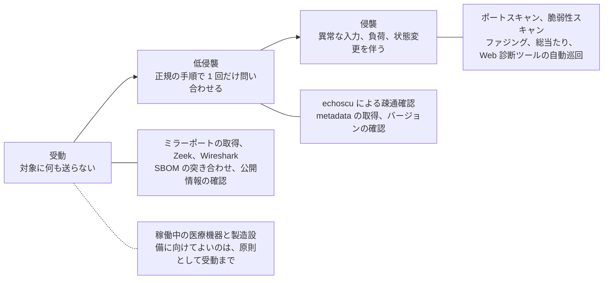

# 🧰 ツール

医療セキュリティの検証と運用に使えるツールをまとめる。

> [!NOTE]
> **表記ルール**：本ページでは、**事実**（一次情報で確認できる内容。出典を併記する）、**報道ベース**（報道や第三者の集計のみで確認でき、当事者の公表資料では裏付けが取れていない内容）、**分析**（筆者の解釈）を書き分ける。
> 出典は、当事者の公表資料、行政文書、CVE、ベンダアドバイザリなどの一次情報を優先して示す。

> [!WARNING]
> ここに挙げるツールは、自組織の資産、または許可を得た対象に対してのみ使用できる。
> 稼働中の医療機器に対するスキャンは、機器の停止や誤動作を引き起こす可能性がある。
> 検証は隔離環境で行い、本番環境での実施には書面での承認と、臨床部門の立ち会いを得てほしい。

---

## 対象への影響による三段階

医療では、ツールの選定を機能ではなく影響の大きさから始める。
同じ調査目的でも、どの段階まで許されるかは対象の稼働状態で変わる（[検証と実務](../../practice/README.md)の分岐を先に通す）。

| 段階 | 稼働中の医療機器 | 稼働中の医療情報システム | テスト環境 |
|---|---|---|---|
| 受動 | 実施できる | 実施できる | 実施できる |
| 低侵襲 | 同型機で影響を確認してから、立ち会いのもとで | 実施時間帯を合意したうえで | 実施できる |
| 侵襲 | 行わない | 原則として行わない | 実施できる |

---

## DICOM、医用画像

| ツール | 用途 | 段階 |
|---|---|---|
| [DCMTK](https://dicom.offis.de/dcmtk) | DICOM の標準的なツールキット。`echoscu`、`findscu`、`movescu`、`storescu` による疎通確認と通信検証 | 低侵襲から侵襲 |
| [pydicom](https://github.com/pydicom/pydicom) | Python による DICOM ファイルの解析、生成。タグ検証の自動化に使える | 受動 |
| [pynetdicom](https://github.com/pydicom/pynetdicom) | Python による DICOM ネットワーク通信の実装。検証用のサーバ、クライアント構築 | 低侵襲から侵襲 |
| [Orthanc](https://www.orthanc-server.com/) | 軽量な PACS サーバ。検証環境の構築に使える | 受動 |
| [dcm4che](https://github.com/dcm4che/dcm4che) | Java 製の DICOM ツールキット | 低侵襲から侵襲 |
| [fo-dicom](https://github.com/fo-dicom/fo-dicom) | .NET の DICOM 実装 | 受動 |
| [Evil-DICOM](https://github.com/rexcardan/Evil-DICOM) | C# の DICOM 操作ライブラリ | 受動 |
| [GDCM](https://sourceforge.net/projects/gdcm/) | `gdcmanon` による匿名化を含む DICOM 処理ライブラリ | 受動 |
| [DICOM Anonymizer](https://github.com/KitwareMedical/dicom-anonymizer) | DICOM の匿名化ツール | 受動 |

> [!TIP]
> 露出確認では、`echoscu` による疎通確認（C-ECHO）までで判断がつくことが多い。
> 応答が返る時点で、認証なしに到達できる状態が確認できる。
> 画像の取得（C-MOVE、C-GET）まで進めると、実在する患者の情報を手元に置くことになる。
> 自組織の資産であっても、そこまで進める必要があるかを先に決める。

---

## HL7、FHIR

| ツール | 用途 | 段階 |
|---|---|---|
| [HAPI HL7v2](https://github.com/hapifhir/hapi-hl7v2) | Java の HL7 v2 パーサ | 受動 |
| [HAPI FHIR](https://hapifhir.io/) | Java の FHIR 実装。参照サーバとしても使える | 受動 |
| [python-hl7](https://github.com/johnpaulett/python-hl7) | Python の HL7 v2 パーサ。MLLP のクライアントを含む | 受動から低侵襲 |
| [nHapi](https://github.com/nHapiNET/nHapi) | .NET の HL7 v2 実装 | 受動 |
| [HL7Fuse](https://github.com/dib0/HL7Fuse) | HL7 メッセージのルーティングサービス | 受動 |
| [HL7 Snoop](https://github.com/dgrinberg/HL7-Snoop) | HL7 メッセージの解析、表示 | 受動 |
| [Mirth Connect / NextGen Connect](https://github.com/nextgenhealthcare/connect) | HL7 連携エンジン。検証環境の構築にも使える | 受動 |
| [Inferno](https://inferno-framework.github.io/) | FHIR サーバの適合性テストツール | 低侵襲 |
| [Synthea](https://github.com/synthetichealth/synthea) | 合成患者データの生成。実データを使わずに検証環境を作れる | 受動 |

> [!TIP]
> 検証には必ず合成データを使ってほしい。
> Synthea は、実在しない患者の診療履歴を FHIR、HL7、CSV 形式で生成できる。
> 医療システムの検証環境を作るとき、実データを持ち込まないための最も実用的な手段になる。

連携インタフェースの検証観点は [HL7 v2 と FHIR の攻撃面](../../technology/web-security/hl7-fhir.md) にまとめている。

---

## ネットワーク、資産可視化

| ツール | 用途 | 段階 |
|---|---|---|
| [Zeek](https://zeek.org/) | ネットワーク通信の記録、分析。医療機器セグメントの可視化に使える | 受動 |
| [Wireshark](https://www.wireshark.org/) | DICOM、HL7 プロトコルの解析（両方ともディセクタが用意されている） | 受動 |
| [Arkime](https://arkime.com/) | 通信の全量保存と検索。事後の追跡に使う | 受動 |
| [Shodan](https://www.shodan.io/) | 自組織の資産の外部露出確認 | 受動 |
| [Censys](https://censys.com/) | 同上 | 受動 |
| [Nmap](https://nmap.org/) | ポートスキャン。DICOM 向けの NSE スクリプトを含む | 侵襲 |

> [!IMPORTANT]
> 稼働中の医療機器に対する Nmap のスキャンは、機器の応答停止を引き起こした事例が報告されている。
> 医療機器セグメントの可視化には、能動的なスキャンではなく、通信の受動的な観測を優先してほしい。
> スキャンを避けられない場合の考え方は、[医療機器の検証手法](../../technology/medical-devices/testing-methodology.md#能動的なスキャンを避けられないとき)に整理している。

外部から見える範囲を、対象へ通信を送らずに確認する手順と道具は [医療機関に対する OSINT](../../practice/osint.md#手法の区分と対象ごとの道具) にまとめている。
Web とドメイン、医療機器と IoMT、人と組織、制度と調達の四つに分けて、道具と段階を対応づけている。

---

## ファームウェアと組込み機器の解析

医療機器の検証では、更新ファイルやストレージから取り出したイメージを対象にする。
機器そのものに触れずに進められるため、受動に分類される作業が中心になる。

| ツール | 用途 | 段階 |
|---|---|---|
| [binwalk](https://github.com/ReFirmLabs/binwalk) | ファームウェアイメージの構造解析とファイルシステムの抽出 | 受動 |
| [EMBA](https://github.com/e-m-b-a/emba) | 組込み Linux ファームウェアの自動解析。既知脆弱性と設定不備の洗い出し | 受動 |
| [FACT](https://github.com/fkie-cad/FACT_core) | ファームウェアの比較解析。機種間で共通する部品を突き合わせられる | 受動 |
| [cve-bin-tool](https://github.com/intel/cve-bin-tool) | バイナリに含まれるコンポーネントを推定し、既知脆弱性と突き合わせる | 受動 |
| [Ghidra](https://github.com/NationalSecurityAgency/ghidra) | 逆アセンブルと逆コンパイル。独自プロトコルの解析に使う | 受動 |

**分析**：ファームウェア解析は、SBOM が入手できない機器に対する代替手段になる。
メーカーから SBOM が提供されていれば、[脆弱性管理](#脆弱性管理sbom) の側で同じ問いに答えられる。
解析に手間をかける前に、調達と保守契約で SBOM を求められないかを確認する。

---

## 脆弱性管理、SBOM

| ツール | 用途 | 段階 |
|---|---|---|
| [OSV-Scanner](https://github.com/google/osv-scanner) | 依存パッケージの脆弱性検出 | 受動 |
| [Syft](https://github.com/anchore/syft) | SBOM の生成 | 受動 |
| [Grype](https://github.com/anchore/grype) | SBOM や成果物に対する脆弱性検出 | 受動 |
| [Trivy](https://github.com/aquasecurity/trivy) | コンテナ、ファイルシステム、IaC の脆弱性検出 | 受動 |
| [Dependency-Track](https://dependencytrack.org/) | SBOM を継続的に管理し、新規脆弱性を追跡する | 受動 |

医療機器メーカーにとって、SBOM の生成と継続的な追跡は規制要求への対応そのものになる。
医療機関にとっては、調達時に受け取った SBOM を Dependency-Track のような仕組みに取り込むことで、新しい脆弱性が公表されたときに自組織への影響を即座に判断できる。

運用の組み立ては [SCA と SBOM で既知脆弱性に対処する](../../technology/oss-vulnerabilities/sca-sbom.md) を参照してほしい。

---

## Web アプリケーション検証

医療系 Web アプリの検証は、一般的な Web 診断と同じツールで行える。

| ツール | 用途 | 段階 |
|---|---|---|
| [Burp Suite](https://portswigger.net/burp) | Web アプリケーションの検証 | 低侵襲から侵襲 |
| [OWASP ZAP](https://www.zaproxy.org/) | 同上（オープンソース） | 低侵襲から侵襲 |
| [Caido](https://www.caido.io/) | Web プロキシツール | 低侵襲から侵襲 |
| [Autorize](https://github.com/PortSwigger/autorize) | 記録した要求を別のセッションで再送し、認可の欠落を検出する Burp 拡張 | 低侵襲 |
| [AuthMatrix](https://github.com/SecurityInnovation/AuthMatrix) | 立場と機能の行列を定義し、期待する可否と実測を突き合わせる Burp 拡張 | 低侵襲 |

**分析**：医療系ポータルは立場の数が多く、手作業では組み合わせが抜ける。
立場と機能の行列を先に定義し、その行列を機械的に通す形にすると、抜けを減らせる（[患者用ポータルで狙われやすい脆弱性](../../technology/web-security/patient-portal.md#確かめ方立場の行列で通す)）。
再送は既存の要求をなぞる操作であり、更新系を含めると実データが書き換わる。
対象を参照系に絞るか、合成データを載せた環境で行う。

> [!IMPORTANT]
> 自動巡回（クローラ、アクティブスキャン）は侵襲にあたる。
> 医療系では、巡回そのものが予約の登録、問診の送信、通知メールの発火といった業務上の操作を起こしうる。
> 稼働中のシステムで使う場合は、対象 URL を限定し、更新系の操作を除外する。

医療系での使い方は、[患者用ポータルで狙われやすい脆弱性](../../technology/web-security/patient-portal.md)を参照してほしい。

---

## 検証環境の構築

| 対象 | 構築方法 |
|---|---|
| OpenEMR | 公式の Docker 構成を利用（[詳細](../../technology/oss-vulnerabilities/ehr-systems.md)） |
| Orthanc | `docker run jodogne/orthanc-plugins`（[詳細](../../technology/oss-vulnerabilities/imaging-pacs.md)） |
| OpenMRS | 公式の Docker 構成を利用 |
| HAPI FHIR | 公式のコンテナイメージを利用 |
| HL7 v2 の連携 | Mirth Connect でチャネルを組み、python-hl7 などで送信側を作る（[詳細](../../technology/web-security/hl7-fhir.md#検証環境)） |
| テストデータ | Synthea による合成データ、[TCIA](https://www.cancerimagingarchive.net/) の公開画像データセット |

---

[トップへ](../../../README.md)
