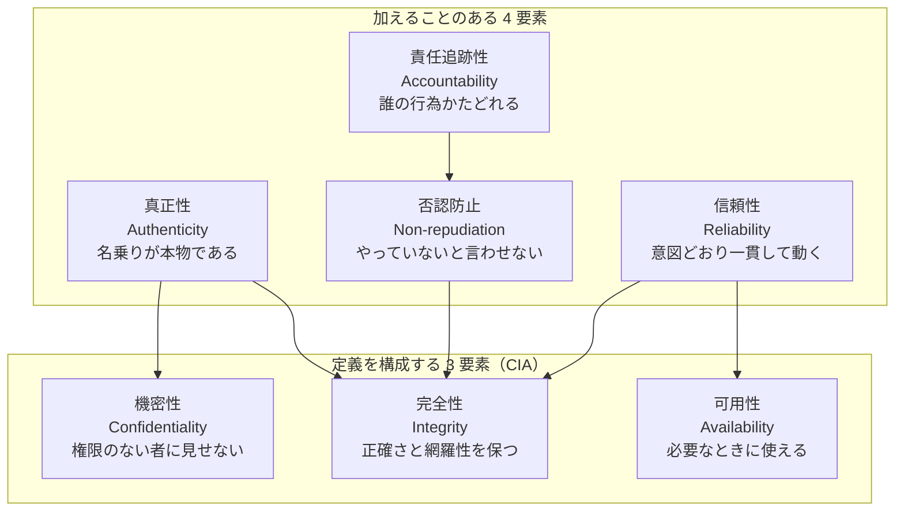
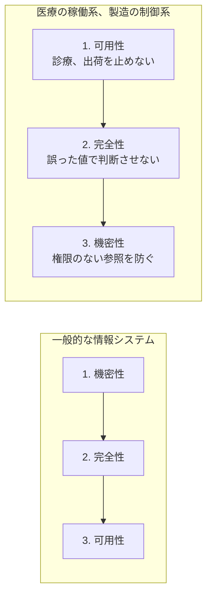
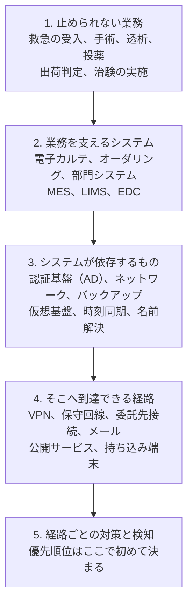
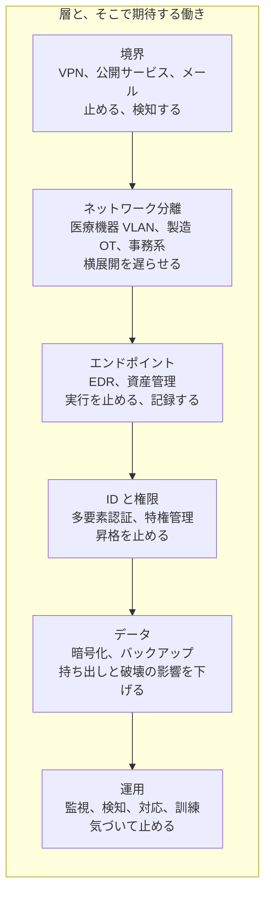
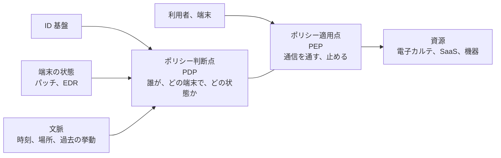
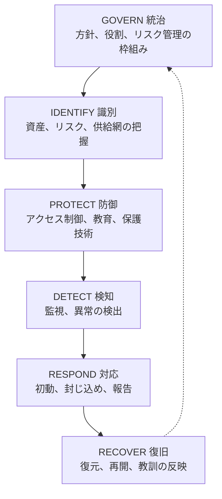
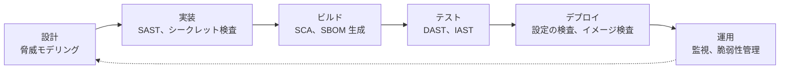

# 🧭 セキュリティの基礎

医療機関と製薬企業の現場では、セキュリティの用語が、出所の異なる枠組みから混ざって降ってくる。
三省二ガイドラインは ISMS の語彙で書かれ、医療機器メーカーの資料は FDA と IEC の語彙で書かれ、診断ベンダの提案書は OWASP と ATT&CK の語彙で書かれる。
同じ「リスク」「脆弱性」「テスト」という語が、それぞれ別の枠組みの中で別の意味を持つ。

本ページは、その語彙と枠組みを一通り並べ、どれが何を測る道具なのかを示す。
個々の主題を深く扱うページは本リポジトリの各所にあり、該当箇所からリンクする。
最初の節「情報セキュリティの 7 要素」だけは、他のすべての枠組みが参照する土台になるため、他より詳しく書く。
通読を前提とせず、必要な節を引く使い方を想定して、節ごとに独立させている。

> [!NOTE]
> **表記ルール**：本ページでは、**事実**（一次情報で確認できる内容。出典を併記する）、**報道ベース**（報道や第三者の集計のみで確認でき、当事者の公表資料では裏付けが取れていない内容）、**分析**（筆者の解釈）を書き分ける。

---

## 目次

**土台**：何を守るのか、どう優先順位を付けるのか

1. [情報セキュリティの 7 要素](#1-情報セキュリティの-7-要素)
2. [守るべきものからの逆算](#2-守るべきものからの逆算)
3. [リスクベースの考え方](#3-リスクベースの考え方)
4. [セーフティとセキュリティの違い](#4-セーフティとセキュリティの違い)

**設計の原則**：どう組むのか

5. [セキュリティの設計原則](#5-セキュリティの設計原則)
6. [多層防御](#6-多層防御)
7. [最小権限](#7-最小権限)
8. [ゼロトラスト](#8-ゼロトラスト)
9. [セキュリティ・バイ・デザイン](#9-セキュリティバイデザイン)
10. [アイデンティティを中心に置く防御](#10-アイデンティティを中心に置く防御)
11. [データの保護](#11-データの保護)
12. [レジリエンスとバックアップ](#12-レジリエンスとバックアップ)

**枠組みと手法**：何をどう測るのか

13. [フレームワークの使い分け](#13-フレームワークの使い分け)
14. [攻撃側を記述する枠組み](#14-攻撃側を記述する枠組み)
15. [脅威モデリング](#15-脅威モデリング)
16. [脆弱性の深刻度を測る](#16-脆弱性の深刻度を測る)
17. [脆弱性診断とペネトレーションテスト](#17-脆弱性診断とペネトレーションテスト)

**立場と工程**：誰が、どの工程で担うのか

18. [攻撃者視点と防御者視点](#18-攻撃者視点と防御者視点)
19. [オフェンシブとディフェンシブ](#19-オフェンシブとディフェンシブ)
20. [検知と対応](#20-検知と対応)
21. [サプライチェーンと第三者リスク](#21-サプライチェーンと第三者リスク)
22. [DevSecOps](#22-devsecops)
23. [OWASP](#23-owasp)
24. [ハードニング](#24-ハードニング)

**参照**

25. [混同されやすい用語の区別](#25-混同されやすい用語の区別)
26. [用語の対応表](#26-用語の対応表)

---

## 1. 情報セキュリティの 7 要素

### 7 要素はどこから来たか

情報セキュリティは、長らく **機密性、完全性、可用性** の三つで定義されてきた。
頭文字をとって **CIA トライアド**（Confidentiality、Integrity、Availability）と呼ぶ。

**事実**：ISO/IEC 27000 は、情報セキュリティを「情報の機密性、完全性、可用性を維持すること」と定義したうえで、注記として「さらに、真正性、責任追跡性、否認防止、信頼性などの特性を維持することを含めることもある」と述べている。
国内の対応規格である JIS Q 27000 も同じ構成をとる。
出典：ISO/IEC 27000（[ISO 規格一覧](https://www.iso.org/standards.html)）、JIS Q 27000（[日本産業標準調査会](https://www.jisc.go.jp/)）

つまり 7 要素は、対等な 7 個の並びではない。
**定義そのものを構成する 3 要素**（機密性、完全性、可用性）と、**必要に応じて加える 4 要素**（真正性、責任追跡性、否認防止、信頼性）の二層になっている。

**分析**：後から加わった 4 要素は、独立した目標というより、CIA を実際に成り立たせるための条件に近い。
相手が本物でなければ（真正性が崩れれば）、権限による制御そのものが意味を失い、機密性も完全性も守れない。
記録が残らなければ（責任追跡性が崩れれば）、完全性が破られたことに気づけない。
この依存関係が、上の図の矢印にあたる。

### 各要素の意味と、医療での現れ方

#### 1. 機密性（Confidentiality）

**機密性**とは、権限を与えられた者だけが情報にアクセスできる状態を指す。

崩れた状態は、権限のない者が情報を読める状態である。
外部の攻撃者による窃取だけでなく、職員が業務と無関係な患者記録を閲覧する場合も機密性の侵害にあたる。

医療では、守る対象が要配慮個人情報である。
診療情報はカード番号と違って再発行できず、病名や治療歴は生涯変わらない。
製薬企業では、治験データと承認前の研究情報が同じ性質を持つ。

支える仕組みは、アクセス制御、認証と認可、暗号化（保存時と通信時）、権限の棚卸し、ログによる事後監査である。

医療での注意点として、緊急時に参照権限を広げる運用（ブレークグラス）が常態化すると、機密性の制御が名目だけになる。
広い権限を残すこと自体が誤りではなく、広げた事実が記録され、事後に確認される仕組みとセットになっているかが分かれ目になる。

#### 2. 完全性（Integrity）

**完全性**とは、情報が正確であり、欠落や不正な改変がない状態を指す。

崩れた状態は二つに分かれる。
一つは、値が書き換わっている状態。
もう一つは、あるはずのデータが欠けている状態である。
どちらも、参照した側は正常な値として扱ってしまう。

医療では、完全性の侵害が可用性の侵害より危険になりうる。
システムが止まっていれば、現場は止まっていると認識して紙運用に切り替える。
一方、検査値が 1 桁ずれたまま参照できる状態や、アレルギー情報が欠落したまま処方が続く状態では、誰も異常に気づかないまま診療が進む。

製薬企業では、この要素が **データインテグリティ** として規制要求に組み込まれている。
製造記録や試験記録は、ALCOA+（帰属性、判読性、同時性、原本性、正確性ほか）の原則を満たす形で残すことが求められる。
記録の改ざんは、情報漏えいではなく製品品質の問題として扱われる（[製造設備と OT](pharma/manufacturing-ot.md)）。

支える仕組みは、書き込み権限の分離、ハッシュと電子署名、変更履歴（監査証跡）、バックアップとその復元検証、入力値の検証である。

#### 3. 可用性（Availability）

**可用性**とは、必要なときに情報とシステムを使える状態を指す。

崩れた状態は、ランサムウェアによる暗号化、機器の故障、DDoS、災害による停止など、原因を問わず「使えない」状態全般である。

医療では、可用性の低下が診療の停止に直結する。
電子カルテが止まれば、過去の処方歴も検査結果も参照できず、救急の受入を制限する判断が必要になる。
この構造が、支払いに傾く条件を作っている（[インシデント事例集](../threats/incidents/)）。

支える仕組みは、冗長化、バックアップ（オフラインまたはイミュータブル）、復旧手順の訓練、ダウンタイム運用の準備である（[インシデント対応と事業継続](../response/)）。

**分析**：一般の企業システムでは、CIA の順に優先されることが多い。
医療機関の稼働系では、可用性と完全性が先に来て機密性が続く順序になりやすい。
守る対象が情報そのものではなく、診療の継続と患者の安全であるためである。

#### 4. 真正性（Authenticity）

**真正性**とは、利用者、機器、データの出所が、名乗っているとおりのものである状態を指す。

崩れた状態は、なりすましである。
職員を装った電話でパスワードを再設定させる手口も、正規の機器を装って通信する機器も、真正性の侵害にあたる。

医療で真正性が崩れやすい箇所は、規格の側に認証の仕組みがない部分である。
DICOM の AE Title は通信相手を識別する文字列であって、認証情報ではない（[PACS / DICOM のセキュリティ](../technology/medical-devices/pacs-dicom.md)）。
HL7 v2 も、認証と暗号化を規格自体には含まない。
接続元を制限する設定が外れた時点で、送信元を名乗るだけで書き込める状態になる。

支える仕組みは、多要素認証、証明書による機器認証、電子署名、接続元の制限である。
国内の医療では、医療従事者の資格を証明する **HPKI**（保健医療福祉分野の公開鍵基盤）が、電子処方箋などで真正性の根拠として使われる。

#### 5. 責任追跡性（Accountability）

**責任追跡性**とは、ある操作が誰の行為であったかを、後からたどれる状態を指す。

崩れた状態は、操作の記録がない、または記録があっても個人まで特定できない状態である。

医療機関でこの要素が崩れる典型は、共有アカウントである。
交代勤務で ID を引き継ぎ、緊急時は入力の速さが優先される運用では、ログには残っても「誰が」が確定しない。
内部不正の調査が最初に行き詰まるのはこの点である（[組織の脆弱性の分類](../threats/actors/organizational-vulnerabilities.md)）。

支える仕組みは、個人単位の ID 発行、操作ログの取得と保全、ログの改ざん防止、定期的な監査である。

**分析**：責任追跡性は、事故を防ぐ要素ではなく、事故のあとに機能する要素である。
そのため平時は費用だけがかかり、削られやすい。
削った結果は、侵害の範囲を確定できない形で現れる。
届出や患者への通知の対象を決められない状態は、ここから生じる。

#### 6. 否認防止（Non-repudiation）

**否認防止**とは、ある行為を行った者が、後から「行っていない」と主張できない状態を指す。

責任追跡性と近いが、向きが違う。
責任追跡性は組織が内部で追跡できるかどうかの話であり、否認防止は第三者に対して証明できるかどうかの話である。

医療と製薬で否認防止が要求される場面は、記録が外部の判断材料になるときである。
電子処方箋の発行、治験データの記録、GMP 下の製造記録と出荷判定がこれにあたる。
米国 FDA の 21 CFR Part 11 は、電子記録と電子署名がこの性質を満たすための要件を定めている。
出典：[FDA Part 11、Electronic Records; Electronic Signatures](https://www.fda.gov/regulatory-information/search-fda-guidance-documents/part-11-electronic-records-electronic-signatures-scope-and-application)

支える仕組みは、電子署名、タイムスタンプ、改ざん検知のできるログ、鍵の管理である。

#### 7. 信頼性（Reliability）

**信頼性**とは、システムが意図した動作を、意図したとおりに一貫して行う状態を指す。

崩れた状態は、攻撃を受けていなくても発生する。
連携メッセージが特定の条件下でだけ取りこぼされる、バッチ処理が月末に失敗する、といった挙動である。

医療でこの要素が問題になるのは、システム間の連携である。
電子カルテ、オーダリング、部門システム、医療機器が別々のベンダによって作られ、規格の解釈が実装ごとに違う。
どこかで欠落した情報は、受け取った側では最初から存在しなかったものとして扱われる。

AI を組み込んだ機能は、この要素を新しい形で問う。
同じ入力に対して出力が揺れる仕組みを診療の流れに置くとき、信頼性は「精度」ではなく「一貫性と、外れたときに気づける設計になっているか」として評価される（[AX：医療における AI のセキュリティ](../technology/dx-ax/ai-security.md)）。

支える仕組みは、テスト、監視、エラー処理の設計、フェイルセーフの実装である。

### 7 要素の一覧

| 要素 | 守るもの | 崩れた状態 | 医療での典型例 | 主な対策 |
|---|---|---|---|---|
| **機密性** | 見せる相手の範囲 | 権限のない者が読める | 診療記録の窃取、担当外の患者記録の閲覧 | アクセス制御、暗号化、権限の棚卸し |
| **完全性** | 値の正しさ | 改ざん、欠落に気づけない | 検査値の改ざん、製造記録の書き換え | 権限分離、監査証跡、電子署名、バックアップ |
| **可用性** | 使えること | 停止、性能低下 | ランサムウェアによる電子カルテ停止 | 冗長化、オフラインバックアップ、復旧訓練 |
| **真正性** | 名乗りの正しさ | なりすまし | ヘルプデスク詐称、DICOM のなりすまし送信 | 多要素認証、証明書、電子署名、HPKI |
| **責任追跡性** | 行為の帰属 | 誰の操作か特定できない | 共有アカウント、当直での ID 引き継ぎ | 個人 ID、ログ保全、事後監査 |
| **否認防止** | 第三者への証明 | 「やっていない」と言える | 電子処方箋、治験記録、出荷判定 | 電子署名、タイムスタンプ、鍵管理 |
| **信頼性** | 動作の一貫性 | 想定外の挙動、取りこぼし | システム連携での情報欠落 | テスト、監視、フェイルセーフ |

**分析**：この 7 要素は、対策を思いつくための道具ではなく、**抜けを見つけるための点検軸**として使うと効きやすい。
「暗号化したので安全である」という説明に対して、では真正性はどう担保されているか、責任追跡性は残るか、と順に当てていく使い方である。
[脅威モデリング](#15-脅威モデリング) の STRIDE は、この当て方を手順にしたものにあたる。

---

## 2. 守るべきものからの逆算

### 対策の一覧から入ると終わらない

セキュリティの検討を「やるべき対策の一覧」から始めると、項目は増え続け、どこで手を止めてよいかが決まらない。
先に決めるのは、**何を守るのか**である。
守る対象が決まれば、それを失う経路が決まり、経路が決まれば対策の順序が決まる。

医療と製薬で守る対象は、情報そのものではない。
**診療の継続と患者の安全**、製薬であれば**医薬品の供給と製品の品質**が最上位に来る。
情報は、それらを支える手段として位置づく。
この順序を取り違えると、個人情報の保護だけが対策の目的になり、診療を止める経路（バックアップ、認証基盤、ネットワーク機器）が優先資産から外れる。

### 逆算の順序

**1 の決め方**：業務を止めたときに何分、何時間で影響が出るかで並べる。
事業影響度分析（BIA）の考え方であり、目標復旧時間（RTO）と目標復旧時点（RPO）を業務ごとに置く（[インシデント対応と事業継続](../response/)）。

**2 の決め方**：業務ごとに、使っているシステムを紐づける。
ここで「システムの一覧」ではなく「業務とシステムの対応表」を作る点が要になる。

**3 の決め方**：システムが単独で動かない部分を書き出す。
実際の侵害で最後に止まるのはここである。

**4 の決め方**：外から到達できる点を、自組織の台帳ではなく外部からの観測で確かめる（[外部から見た自組織の攻撃面](../practice/attack-surface.md)）。

### 攻撃者の評価と、自組織の評価はずれる

**分析**：院内で「重要」とされる資産は、患者情報を持つシステムに寄る。
一方、攻撃者が最初に狙うのは、情報を持たない資産である。
VPN 装置、Active Directory、バックアップサーバ、仮想基盤の管理コンソール、ベンダの保守用アカウントがこれにあたる。
これらは、それ自体に患者情報がなくても、**すべての資産への到達を一度に与える**ためである。

このずれは、資産の分類を「保有する情報の機微さ」だけで行うと生じる。
分類には、**そこを取られたとき他の何に到達できるか**という軸を加える。

| 軸 | 高い資産の例 | 見落とされ方 |
|---|---|---|
| 保有する情報の機微さ | 電子カルテ、治験データ、人事システム | 見落とされにくい |
| 到達の広さ（取られると他に波及する） | AD、仮想基盤、バックアップ、VPN、保守回線 | 情報を持たないため優先度が下がる |
| 業務の停止耐性の低さ | 部門システム、輸血、透析、放射線治療計画 | 情報系の台帳に載っていないことがある |
| 外部からの見えやすさ | 公開 Web、患者ポータル、リモート保守 | 部門が独自に契約した資産が漏れる |

**分析**：資産台帳が「機器とライセンスの一覧」として作られている組織では、この三つ目と四つ目の軸が最後まで埋まらない。
台帳の目的が資産管理（会計）にあるためで、担当者の怠慢ではなく設計の問題である。
セキュリティの用途で使うなら、業務との紐付けと、外部からの到達可否の列を足す必要がある。

---

## 3. リスクベースの考え方

### すべてを同じ強さで守らない

人員と予算に上限がある以上、対策は選ぶことになる。
**リスクベース**とは、選ぶ基準を「起こりやすさ」と「起きたときの影響」に置く考え方を指す。

リスクは、おおむね次の形で捉える。

> リスク ＝ 脅威（誰が、どう狙うか）× 脆弱性（通ってしまう弱点）× 影響（起きたときの損害）

三つのうち、自組織が動かせるのは主に脆弱性と影響である。
脅威の側は、医療が狙われ続ける条件が揃っている以上、減らせる前提で計画を立てない（[脅威アクターとリスク](../threats/actors/actors-and-risks.md)）。

### リスクへの四つの対応

| 対応 | 内容 | 医療での例 |
|---|---|---|
| **低減** | 対策を打って発生確率か影響を下げる | 境界機器のパッチ適用、ネットワーク分離、オフラインバックアップ |
| **回避** | リスクの原因になる活動をやめる | 使っていない外部公開サービスの停止、サポート切れ機器の更新 |
| **移転** | 損失の一部を他者に移す | サイバー保険、委託契約での責任分担（[経営とガバナンス](../governance/)） |
| **受容** | 対策せず、そのまま抱える | 更新提供が終了した機器を、代替の緩和策付きで運用し続ける |

**分析**：医療で扱いを誤りやすいのは、四つ目の受容である。
止められない機器、更新できない設備は必ず残るため、受容は避けられない。
問題は受容そのものではなく、**受容した記録が残っていないこと**にある。
「誰が、いつ、何を根拠に、いつまで受容したか」が文書化されていなければ、条件が変わったとき（その機器を狙う攻撃が KEV に載ったときなど）に見直しが起動しない。

### 医療でリスクを測るときの軸

一般的なリスク評価は、損失を金額に換算して比較する。
医療では、この換算が途中で成立しなくなる。
診療の遅延と患者の転帰は金額に置き換えられず、置き換えようとすると評価そのものが形骸化する。

**分析**：現実的には、金額ではなく**診療への影響**を評価軸に置くほうが機能する。
「この資産が停止したとき、救急の受入を止めるか」「手術の延期が発生するか」「代替の手順で何時間しのげるか」という問いは、臨床側と情報システム部門が同じ土俵で答えられる。
この形にしておくと、経営層への説明も、投資判断の材料として成立する。

### 脆弱性対応をリスクベースにする

**分析**：脆弱性の一覧を CVSS の高い順に上から潰す進め方は、リスクベースではない。
CVSS は影響の大きさを測る指標であり、起こりやすさと自組織の事情を含まないためである。
実務では、次の順に絞り込むと、限られた適用の窓に収まりやすい。

1. 悪用が確認されているか（[CISA KEV](https://www.cisa.gov/known-exploited-vulnerabilities-catalog)）
2. 外部から到達できる資産か（境界機器、公開サービス、リモート保守）
3. 取られたときの到達の広さは（[2. 守るべきものからの逆算](#2-守るべきものからの逆算)の第二の軸）
4. 代替の緩和策があるか（分離、アクセス制限、監視の強化）

指標そのものの説明は [16. 脆弱性の深刻度を測る](#16-脆弱性の深刻度を測る) にある。

---

## 4. セーフティとセキュリティの違い

### 同じ「リスク」という語が、別のものを指している

医療では、二つの安全が同居する。

**セーフティ（安全性）**：意図しない事象から人への危害を防ぐこと。故障、誤操作、設計上の欠陥が対象になる。
**セキュリティ**：悪意ある行為から資産を守ること。攻撃者という意図を持った主体が前提にある。

この二つは、リスクの数え方が違う。
セーフティのリスクは、危害の重大さと発生確率で評価する。
発生確率は、部品の故障率のように、統計から見積もれる。
一方、セキュリティのリスクには、攻撃者の意図と能力が入る。
攻撃者は対策を見て手口を変えるため、確率は固定されない。

**分析**：医療機関でセキュリティの提案が通らない場面の多くは、この違いが共有されていないことから起きる。
臨床側と品質保証側は、セーフティの枠組みで「リスク」という語を使う。
情報システム側は、セキュリティの枠組みで同じ語を使う。
同じ会議で「リスクは低い」という言葉が、別の意味で交わされる。

### 対策が衝突する場面

| 場面 | セキュリティ側の要求 | セーフティ側の要求 |
|---|---|---|
| 端末の自動ログオフ | 離席時に権限を残さない | 急変時に即座に記録へ到達したい |
| パッチ適用 | 既知の欠陥を速やかに塞ぐ | 検証済みの構成を変えない |
| 認証の強化 | 本人確認を厳格にする | 手袋、清潔区域、緊急時の操作性を損なわない |
| 機器の隔離 | 感染の疑いがあれば切り離す | 稼働中の機器を止めない |

**分析**：この衝突は、どちらかが正しいという形では解けない。
解けるのは、**セキュリティのリスクを患者への危害に翻訳したとき**である。
「認証を強化したい」ではなく「この経路が使われると、輸液ポンプの設定が外部から変更されうる」と表現すれば、臨床側はセーフティの枠組みで評価できる。
医療機器の分野では、この翻訳が規格として制度化されている。

**事実**：医療機器のリスクマネジメントは ISO 14971 が定め、ヘルスソフトウェアのセキュリティを含むライフサイクル要求は IEC 81001-5-1 が定める。
出典：ISO 14971（[ISO 規格一覧](https://www.iso.org/standards.html)）、IEC 81001-5-1（[IEC Webstore](https://webstore.iec.ch/)）

セキュリティ侵害が患者安全の事象になりうる点は、本リポジトリの前提でもある（[医療機器の検証手法](../technology/medical-devices/testing-methodology.md)）。

---

## 5. セキュリティの設計原則

要素が「何を守るか」だとすれば、設計原則は「どう組むか」にあたる。

**事実**：1975 年に Saltzer と Schroeder が示した保護機構の設計原則は、現在も参照され続けている。
最小権限、機構の経済性、フェイルセーフなデフォルト、完全な仲介、オープンな設計などが含まれる。
出典：[The Protection of Information in Computer Systems](https://www.cs.virginia.edu/~evans/cs551/saltzer/)

| 原則 | 内容 | 医療で効く場面 |
|---|---|---|
| **最小権限** | 必要な範囲と期間だけ権限を与える | ベンダ保守アカウント、救急時の参照権限（[7. 最小権限](#7-最小権限)） |
| **多層防御** | 単一の防御が破られる前提で層を重ねる | パッチを当てられない機器の周囲（[6. 多層防御](#6-多層防御)） |
| **フェイルセーフなデフォルト** | 既定を拒否側に置く | 情報系では有効。機器では向きが逆になる場合がある |
| **完全な仲介** | すべてのアクセスを毎回検査する | ゼロトラストの前提（[8. ゼロトラスト](#8-ゼロトラスト)） |
| **機構の経済性** | 仕組みを単純に保つ | 運用者が少ない環境では、複雑な設定は形骸化しやすい |
| **オープンな設計** | 仕組みの秘匿を安全の根拠にしない | 「閉域だから安全」という前提の否定 |
| **攻撃面の最小化** | 使わない機能、ポート、アカウントを止める | [24. ハードニング](#24-ハードニング) |
| **信頼境界の明示** | 統制の主体が変わる線を図にする | 委託事業者との接続点、クラウドの責任分界 |

**分析**：医療で最も扱いが難しいのはフェイルセーフである。
情報システムでは「止める」が安全側になるが、生命維持に関わる機器では「止める」が最も危険な選択になる。
安全側の向きが逆の資産が同じ組織に同居している点が、医療の設計を一般の企業システムと分ける。
この場合、機器そのものを拒否側の既定に寄せるのではなく、機器へ到達できる経路の側を拒否側の既定にする（[8. ゼロトラスト](#8-ゼロトラスト)）。

---

## 6. 多層防御

### 層を重ねる理由

**多層防御**とは、単一の防御が破られることを前提に、性質の違う防御を重ねる設計を指す。
目的は、攻撃を完全に止めることではなく、**攻撃者の各段階に検知と遅延の機会を作ること**にある。

層は、攻撃の進行に沿って置く。

**分析**：層を数えるときは、対策の個数ではなく**性質の違い**を数える。
同種の製品を二つ導入しても層は増えない。
攻撃者が同じ手口で両方を通過できるためである。
「境界で止める」「内部で気づく」「取られても被害を限定する」という、破られ方の異なる三つが揃って初めて層になる。

### 医療で層を組むときの順序

医療機関では、パッチを当てられない資産が必ず残る。
その資産自体を堅牢にできない以上、**守れないものを認めたうえで、その周囲に層を置く**設計になる。

| 守れない対象 | 周囲に置く層 |
|---|---|
| サポート切れ OS の医療機器 | ネットワーク分離、通信相手の制限、機器へ到達できる端末の限定 |
| 常時接続のベンダ保守回線 | 接続の申請制、接続時間の限定、操作の記録、多要素認証 |
| 認証機構を持たないプロトコル（DICOM、HL7 v2） | 経路の分離、送信元の制限、通信の監視 |
| 共有端末での運用 | 端末側の制限、参照ログの事後監査、物理的な設置場所の制御 |

**分析**：国内外の公表事例で繰り返し現れるのは、境界の一枚に依存していた構成である。
閉域網を前提とした設計では、境界を越えられた後の層が用意されていない（[インシデント事例集](../threats/incidents/)、[防御プレイブック](../threats/actors/defense-playbook.md)）。
医療で層を足す順序としては、内部のネットワーク分離とバックアップの隔離が、費用に対する効果が出やすい位置にある。
ゾーンの切り方と、切れていることの確かめ方は [ネットワークの分離](../technology/segmentation.md) にある。

---

## 7. 最小権限

### 範囲と期間の両方を絞る

**最小権限**とは、業務の遂行に必要な権限だけを、必要な期間だけ与える原則を指す。
権限の**範囲**（何にアクセスできるか）と**期間**（いつまで有効か）の二つを絞る点が要になる。
医療機関で実際に問題になるのは、後者であることが多い。

### 実装の手立て

**ロールの設計**：職種と業務に対応づけて権限をまとめる。個人ごとの例外を積み上げない。

**特権アクセス管理（PAM）**：管理者権限を常時付与せず、必要なときに借りる形にする。操作は記録する。

**Just-In-Time の昇格**：権限を申請制にし、承認後の一定時間だけ有効にする。

**ブレークグラス**：緊急時に広い権限を使える経路を、あらかじめ設計しておく。使用の事実が必ず記録され、事後に確認される仕組みとセットにする。

**サービスアカウントの管理**：システム間連携に使うアカウントは、対話ログインを禁止し、権限を用途ごとに分ける。

**棚卸し**：退職、異動、契約終了に連動してアカウントを削除する。連動していなければ、権限は増える一方になる。

### 医療で最小権限が崩れる箇所

| 崩れ方 | 起きる仕組み | 現実的な打ち手 |
|---|---|---|
| 救急を想定した広い参照権限 | 緊急時に参照できないことのほうが危険と判断される | 権限を狭めきれない前提で、参照ログの事後監査を制度化する |
| ベンダ保守アカウントの常時有効 | 24 時間対応の保守契約に紐づく | 接続の申請制、時間限定、多要素認証、操作の記録を契約に書く |
| 当直での ID 引き継ぎ | 交代勤務と、入力の速さの優先 | 個人 ID とカード認証、同一 ID の同時ログインの検知 |
| 退職者アカウントの残存 | 人事システムと認証基盤が連動していない | 定期棚卸しと、人事イベントとの連動 |

**分析**：最小権限の失敗は、設計より運用の側に出る。
権限を狭めた初期状態は作れても、業務の例外に対応するたびに権限が足され、削られないためである。
この構造を踏まえると、**権限を狭めること**と同じだけ、**広い権限が使われた事実を記録して事後に見ること**（責任追跡性）に投資する意味がある。
医療のように、業務上どうしても権限を広く取らざるをえない領域では、後者が実質的な統制になる（[1. 情報セキュリティの 7 要素](#1-情報セキュリティの-7-要素)）。

---

## 8. ゼロトラスト

### ネットワークの位置を信頼の根拠にしない

**ゼロトラスト**とは、ネットワーク上のどこにいるかを信頼の根拠にせず、アクセスのたびに利用者、端末、文脈を検証して認可する考え方を指す。
「内部だから信頼する」という前提を外す点が中核にある。

**事実**：NIST SP 800-207 は、ゼロトラストアーキテクチャの基本理念と論理構成を示している。
アクセスの可否を判断する要素（Policy Decision Point）と、それを実際に適用する要素（Policy Enforcement Point）を分けて記述する。
出典：[NIST SP 800-207 Zero Trust Architecture](https://csrc.nist.gov/pubs/sp/800/207/final)

### 前提条件

ゼロトラストは製品の名前ではなく、いくつかの前提が揃って初めて成立する。

**ID 基盤の統合**：誰が何者かを一箇所で判断できる状態。部門ごとに認証が分かれていると、判断の材料が揃わない。

**資産と端末の把握**：接続してくる端末の状態（パッチ、EDR の稼働）を判断材料にする以上、把握できない端末は扱えない。

**ログと可視化**：判断の妥当性を後から検証できること。

### 医療で成立する範囲と、しない範囲

| 対象 | 適用のしやすさ | 理由 |
|---|---|---|
| 事務系、リモートワーク、SaaS | しやすい | 一般の企業システムと条件が同じ |
| ベンダの保守アクセス | しやすく、効果が大きい | 常時接続を、都度認可の接続に置き換えられる |
| 職員の院内端末 | 条件つき | 端末管理が行き届いていれば可能。共有端末では文脈の判断が弱くなる |
| 医療機器、製造 OT | 難しい | 機器にエージェントを入れられない。認証機構を持たないプロトコルが前提 |

**分析**：医療におけるゼロトラストは、全面的な移行として計画すると、機器の層で必ず止まる。
機器を変えられない以上、機器の前段に適用点を置き、**機器そのものではなく機器へ至る経路を都度認可する**形が現実的な落とし所になる。
最初に着手して効果が見えやすいのは、保守アクセスの経路である。
常時開いた保守回線を、申請と多要素認証を経た都度接続に変えるだけで、外部から到達できる時間が大幅に減る。

**分析**：「ゼロトラスト製品を導入したので閉域網の前提から脱した」という説明は、前提条件（ID 基盤、資産の把握、ログ）が揃っていなければ成立しない。
導入の順序としては、資産と ID の整理が先に来る。

---

## 9. セキュリティ・バイ・デザイン

### 後から足せないものがある

**セキュリティ・バイ・デザイン**とは、設計と開発の段階でセキュリティを組み込む考え方を指す。
運用開始後に足せる対策（監視、分離、アクセス制限）と、足せない対策（認証機構、権限モデル、更新の仕組み、ログの出力）を分けたとき、後者は設計時にしか入れられない。

**セキュア・バイ・デフォルト**は、これと対になる考え方で、出荷時の既定の設定が安全側になっていることを指す。
初期パスワードが共通である、不要な機能が既定で有効である、といった状態を製品側の問題として扱う。

**事実**：CISA は、製品の設計段階から安全性を組み込むことを製造者に求める Secure by Design の取り組みを公表している。
出典：[CISA Secure by Design](https://www.cisa.gov/securebydesign)

**事実**：米国 FDA は、医療機器の市販前提出資料にサイバーセキュリティの設計と管理に関する文書を含めることを求めている。
出典：[FDA Cybersecurity in Medical Devices](https://www.fda.gov/regulatory-information/search-fda-guidance-documents/cybersecurity-medical-devices-quality-system-considerations-and-content-premarket-submissions)

国内でも、医療機器のサイバーセキュリティは薬機法に基づく制度の中で扱われる（[国内のガイドライン、法規制](../guidelines/japan.md)、[海外のガイドライン、法規制](../guidelines/global.md)）。

### 医療機関側にとっての介入点は調達

**分析**：医療機関と製薬企業は、電子カルテも医療機器も製造設備も自ら設計しない。
設計に関与できる機会は、**調達の瞬間**にほぼ限られる。
導入後に「ログを出してほしい」「共通アカウントをやめてほしい」と求めても、製品の構成は変えられず、変更が保守契約や薬事上の位置づけに影響する。

調達の段階で確認し、契約に書ける項目を挙げる。

| 確認する項目 | 何を防ぐか |
|---|---|
| SBOM の提供 | 脆弱性公表時に影響範囲を判断できない状態 |
| 更新の提供期間と、提供が終わる時期 | サポート切れ機器が予告なく残る状態 |
| 脆弱性が見つかったときの通知経路と期限 | 情報が届かないまま運用が続く状態 |
| 個人単位の認証、共有アカウントの要否 | 責任追跡性が最初から成立しない状態 |
| 監査ログの出力仕様と保存先 | 侵害範囲を確定できない状態 |
| リモート保守の接続方式と制御手段 | 常時接続の保守回線が残る状態 |
| MDS2 などの様式による開示 | 仕様が不明なまま院内網に接続する状態 |

**分析**：この一覧を発注仕様に含めることは、医療機関が製品の設計に影響を与えうる数少ない方法にあたる。
導入後の運用でどれだけ努力しても、設計時に出力されないログは取得できず、存在しない権限分離は作れない。
調達で効かせられなかった項目は、次の更新まで固定される。

開発側の工程にセキュリティを組み込む具体は [22. DevSecOps](#22-devsecops)、設計段階で脅威を洗い出す手法は [15. 脅威モデリング](#15-脅威モデリング) にある。

---

## 10. アイデンティティを中心に置く防御

### 境界が薄くなるほど、ID が制御点になる

クラウドと外部接続が増えると、通信の経路で制御できる範囲が狭くなる。
残る制御点が、**誰が、どの端末で、何にアクセスしようとしているか**である。

三つの語を区別する。

**識別（Identification）**：誰であると名乗るか。ユーザー ID の提示にあたる。
**認証（Authentication）**：名乗りが本物かを確かめる。パスワード、カード、生体、証明書。
**認可（Authorization）**：確かめた相手に、何を許すか。権限とロールの話になる。

侵害の調査で「認証は突破されていない」と説明されるとき、認可の不備は別に確認する必要がある。
正規の利用者として認証された者が、権限のない情報に到達できる状態は、認可の問題である。

### 実装で押さえる要素

| 要素 | 内容 | 医療での注意 |
|---|---|---|
| **IdP と SSO** | 認証を一箇所に集約し、SAML や OIDC で各システムに渡す | 部門システムが独自認証を持ち、統合から外れやすい |
| **多要素認証（MFA）** | 知識、所持、生体のうち二つ以上を使う | 共有端末とベンダ保守が最後まで残りやすい |
| **フィッシング耐性のある認証** | FIDO2、パスキー、証明書。SMS やプッシュ承認より強い | プッシュ通知の連打で承認させる手口が知られている |
| **条件付きアクセス** | 端末の状態、場所、時刻を条件に加える | 端末管理が前提。管理外端末では条件を作れない |
| **特権アクセス管理** | 管理者権限を常時持たせない | 保守ベンダの管理者アカウントが常時有効になりやすい |
| **サービスアカウント** | システム間連携用の資格情報 | 対話ログイン可のまま放置されると、横展開に使われる |

### 認証基盤そのものが到達点になる

**分析**：Active Directory をはじめとする認証基盤は、患者情報を持たないため、資産の重要度分類で優先度が下がりやすい。
一方、公表された調査報告書で繰り返し現れるのは、認証基盤の管理者権限が奪われた結果、電子カルテからバックアップまでが一度に暗号化された経緯である（[インシデント事例集](../threats/incidents/)）。
認証基盤は、それ自体の機密性ではなく、**そこから到達できる範囲**で評価する（[2. 守るべきものからの逆算](#2-守るべきものからの逆算)）。

国内の医療では、医療従事者の資格を証明する HPKI が、電子処方箋などで真正性の根拠として使われる。
院内の運用としては、個人 ID とカード認証を組み合わせ、共有 ID を減らす方向が、責任追跡性の確保と同じ方向を向く（[7. 最小権限](#7-最小権限)）。

---

## 11. データの保護

### 暗号化が守る範囲を、状態ごとに分ける

暗号化は三つの状態に分かれ、効く攻撃が違う。

**保存時（at rest）**：ディスク、バックアップ媒体、データベースの暗号化。媒体の盗難と紛失に効く。
**通信時（in transit）**：TLS、VPN。経路上の盗聴と改ざんに効く。
**使用時（in use）**：処理中のメモリ上の保護。限られた場面で使われる。

**分析**：侵害の説明で「暗号化していたため安全である」とされるとき、**どの状態の暗号化が、どの攻撃に効いたのか**を分けて確認する必要がある。
ディスクの暗号化は、盗まれたノート PC に対しては有効に働く。
一方、正規の利用者の認証情報を奪った攻撃者に対しては、システムが復号した状態のデータを見せるため、防御として働かない。
医療機関の公表資料で暗号化が言及される場面では、この区別が判断の分かれ目になる。

鍵の管理が伴わない暗号化は、運用の負担だけが残る。
鍵の保管場所、権限、更新、失効の手順を、暗号化の導入と同時に決める。

### 加工と二次利用

医療データは、研究と品質向上のために二次利用される。
このとき、識別性を下げる加工の種類を区別する。

**匿名加工情報**：特定の個人を識別できないように加工し、元に戻せないようにした情報。
**仮名加工情報**：他の情報と照合しない限り特定の個人を識別できないように加工した情報。元の情報との対応表が残る。

**事実**：この二つは、日本の個人情報保護法で定義が分かれ、取り扱いの義務も異なる。
出典：[個人情報保護委員会](https://www.ppc.go.jp/)

**事実**：米国 HIPAA では、Safe Harbor 方式（定められた 18 種類の識別子を除去する）と Expert Determination 方式（専門家が再識別リスクを評価する）の二つの非識別化手法が定められている。
出典：[HHS Guidance Regarding Methods for De-identification](https://www.hhs.gov/hipaa/for-professionals/privacy/special-topics/de-identification/index.html)

**分析**：加工済みであることは、保護が不要であることを意味しない。
ゲノム情報や希少疾患のように、他の情報と組み合わせると再識別されうるデータでは、加工の水準と提供先の統制をセットで設計する。

---

## 12. レジリエンスとバックアップ

### 復旧できるかどうかで被害の大きさが決まる

侵入を完全に防ぐ前提で計画を立てると、破られたときに何も残らない。
**レジリエンス**は、侵害が起きることを前提に、業務をどれだけ早く、どこまで戻せるかを設計する考え方を指す。

バックアップの基本形は 3-2-1 で表される。
**3 つの複製**を持ち、**2 種類の媒体**に置き、**1 つは隔離した場所**に置く。
ランサムウェアを想定する場合、隔離を「オフライン、または書き換えできない形（イミュータブル）」まで踏み込む必要がある。

| 観点 | 確認する内容 |
|---|---|
| 隔離 | バックアップが、本番と同じ認証基盤で管理されていないか |
| 権限 | バックアップの削除、保持期間の変更を、誰ができるか |
| 復元試験 | 実際に戻して、業務が動くところまで確認しているか |
| 範囲 | 部門システム、医療機器の設定、ネットワーク機器の構成が入っているか |
| 戻す先 | 侵害された基盤にそのまま戻す計画になっていないか |

**分析**：ランサムウェアの攻撃者は、暗号化の前にバックアップを探して消す。
そのため、バックアップが本番と同じ認証基盤の管理下にある構成では、管理者権限を奪われた時点で両方が失われる。
バックアップ管理系の権限を、本番の管理者権限から切り離すことが、この経路を塞ぐ手にあたる。

**分析**：復元試験を行っていないバックアップは、資産として数えられない。
医療機関の復旧では、電子カルテ単体が戻っても、部門システムとの連携が戻らなければ診療は再開できない。
試験の単位は、システムごとではなく業務ごとに置く。

停止中の診療をどう続けるか、復旧の順序をどう決めるかは [インシデント対応と事業継続](../response/) で扱う。

---

## 13. フレームワークの使い分け

フレームワークは、それぞれ違う問いに答える道具である。
並べて優劣を比べるものではない。

| 枠組み | 答える問い | 性格 | 医療での使いどころ |
|---|---|---|---|
| **NIST CSF 2.0** | 組織全体として、何が抜けているか | 6 機能による整理。認証制度ではない | 経営層への報告、現状把握の共通言語 |
| **ISO/IEC 27001 / 27002** | 管理体制が第三者に説明できる状態か | 認証を伴うマネジメントシステム | 取引先への説明、製薬企業の受託要件 |
| **CIS Controls v8** | 何から手を付けるか | 優先順位付きの具体的な対策項目 | 人員の限られた医療機関の着手順 |
| **NIST SP 800-53 / 800-171** | 個々の管理策をどう実装するか | 詳細な管理策のカタログ | 米国政府調達、大規模組織の実装基準 |
| **ゼロトラスト（SP 800-207）** | 境界を信頼しない設計とは何か | アーキテクチャの考え方 | 閉域網の前提が崩れた環境の再設計（[8. ゼロトラスト](#8-ゼロトラスト)） |
| **HIPAA Security Rule** | 米国の法令要求を満たすか | 法規制 | 米国で PHI を扱う場合 |
| **HITRUST CSF** | 複数の規制要求を一つの枠で満たすか | 認証を伴う統合フレームワーク | 米国のヘルスケア事業者、その取引先 |
| **三省二ガイドライン** | 国内の医療機関として求められる水準か | 所管省庁のガイドライン | 国内の医療機関、事業者（[国内のガイドライン](../guidelines/japan.md)） |

### NIST CSF 2.0 の 6 機能

**事実**：NIST は 2024 年に Cybersecurity Framework 2.0 を公開した。
従来の 5 機能（識別、防御、検知、対応、復旧）に、統治（Govern）が加わって 6 機能になっている。
出典：[NIST Cybersecurity Framework](https://www.nist.gov/cyberframework)

**分析**：統治が追加されたことは、医療機関にとって形式的な変更ではない。
医療のインシデントで繰り返し報告される問題は、技術的対策の不足より、誰が決めるかが決まっていないことに寄っている。
資産の管理主体が病院かベンダか曖昧なまま、パッチ適用の判断が誰にも属さない状態は、統治の欠落として説明できる（[経営とガバナンス](../governance/)）。

### CIS Controls の実装グループ

**事実**：CIS Controls は 18 の管理策を持ち、組織の規模とリスクに応じて IG1、IG2、IG3 の三段階に分かれる。
IG1 は、すべての組織が満たすべき基本的な衛生管理として位置づけられている。
出典：[CIS Critical Security Controls](https://www.cisecurity.org/controls)

**分析**：中小規模の医療機関が最初に参照する枠組みとしては、CSF より CIS Controls IG1 のほうが行動に移しやすい。
CSF は「何が抜けているか」を示すが、抜けを埋める順序までは示さないためである。

---

## 14. 攻撃側を記述する枠組み

防御側の枠組みが「何を備えるか」を並べるのに対し、攻撃側の枠組みは「何が起きるか」を並べる。

**Cyber Kill Chain**：Lockheed Martin が示した、偵察から目的の実行までを 7 段階に分けるモデル。
侵入を一本の線として捉える点が分かりやすい一方、内部での横展開が繰り返される実際の侵害を表現しきれない。
出典：[Cyber Kill Chain](https://www.lockheedmartin.com/en-us/capabilities/cyber/cyber-kill-chain.html)

**MITRE ATT&CK**：実際に観測された攻撃の戦術（Tactics）と技術（Techniques）を体系化した知識ベース。
「初期アクセス」「永続化」「認証情報アクセス」などの戦術ごとに、具体的な手法が識別子付きで並ぶ。
検知ルールと攻撃手法を対応づける共通言語として使われる。
出典：[MITRE ATT&CK](https://attack.mitre.org/)

**MITRE D3FEND**：ATT&CK の裏返しにあたる、防御技術の知識ベース。
出典：[MITRE D3FEND](https://d3fend.mitre.org/)

本リポジトリでは、医療を狙うランサムウェアグループの手口を ATT&CK にマッピングしている（[グループ別 TTPs](../threats/actors/ransomware-groups.md)）。

**分析**：ATT&CK を医療で使うときの制約は、産業用制御システム向けの ATT&CK for ICS を含めても、医療機器に固有の挙動（DICOM や HL7 を使った操作）を表す項目が十分には整備されていない点にある。
院内の攻撃面を記述するには、汎用の IT 部分は ATT&CK を使い、機器側は別途記述を補う形になる。

---

## 15. 脅威モデリング

**脅威モデリング**とは、対象の設計を見て、攻撃者が何をしうるかを列挙し、対策を決める作業を指す。
実装ができてから探すのではなく、設計の段階で考える点が [脆弱性診断](#17-脆弱性診断とペネトレーションテスト) との違いになる。
本節は手法の概観にとどめ、医療機関で実際に回すときの手順は [医療の脅威モデリング](../practice/threat-modeling.md) に置いている。

### 四つの問い

**事実**：Threat Modeling Manifesto は、脅威モデリングを次の四つの問いとして示している。
出典：[Threat Modeling Manifesto](https://www.threatmodelingmanifesto.org/)

1. 何を作っているのか（What are we working on?）
2. 何がうまくいかなくなりうるか（What can go wrong?）
3. それに対して何をするか（What are we going to do about it?）
4. うまくやれたか（Did we do a good enough job?）

### 構成要素

**資産**：守る対象。医療では、診療の継続と患者の安全が最上位に来る。データはその手段として位置づく。

**信頼境界**：統制の主体が変わる線。委託事業者との接続点、院内 LAN と医療機器 VLAN の境界、クラウド事業者との責任分界がこれにあたる（[クラウド事業者と医療](../technology/cloud/)）。

**データフロー図（DFD）**：外部エンティティ、プロセス、データストア、データフローで対象を描き、信頼境界を重ねる。
脅威は、境界をまたぐフローに集中して現れる。

**攻撃者像**：誰が、どの動機で、どこまでの能力を持つか（[脅威アクターとリスク](../threats/actors/actors-and-risks.md)）。

**攻撃ツリー**：目標を頂点に置き、達成手段を分解して枝に並べる。到達経路の網羅に向く。

### STRIDE と 7 要素の対応

**STRIDE** は、脅威を 6 種類に分けて数え上げる手法である。
7 要素と一対一に近い対応を持つため、点検の抜けを見つけやすい。

| STRIDE | 脅威 | 損なわれる要素 | 医療での例 |
|---|---|---|---|
| **S**poofing | なりすまし | 真正性 | 職員を装った電話でのパスワード再設定 |
| **T**ampering | 改ざん | 完全性 | 検査結果、製造記録の書き換え |
| **R**epudiation | 否認 | 否認防止、責任追跡性 | 共有アカウントによる操作の帰属不能 |
| **I**nformation Disclosure | 情報漏えい | 機密性 | 患者ポータルの認可不備による他人の記録参照 |
| **D**enial of Service | サービス妨害 | 可用性 | 部門システムの停止、通信の飽和 |
| **E**levation of Privilege | 権限昇格 | 機密性、完全性 | 一般利用者から管理者権限への昇格 |

**LINDDUN**：プライバシー侵害に特化した脅威モデリング手法。
連結可能性、識別可能性、追跡可能性などの観点を持ち、要配慮個人情報を扱う医療では STRIDE を補う位置にある。
出典：[LINDDUN](https://linddun.org/)

**PASTA**：攻撃のシミュレーションと事業影響の分析を段階的に進める、7 段階のリスク中心の手法。

### 医療で脅威モデリングを回すときの制約

**分析**：医療機関で脅威モデリングが機能しにくい理由は、手法の難しさより、対象の設計図が組織の内側に存在しないことにある。
電子カルテも部門システムも医療機器もベンダが構築しており、院内にデータフローを描ける人が不在である場合が多い。
この状況では、詳細な DFD を目指すより、**資産の棚卸しと接続点の一覧**から始めて、境界をまたぐ通信だけを先に洗い出すほうが進む。

医療機器メーカー側では、脅威モデリングが規制要求の一部として扱われる。
FDA は、市販前提出資料にセキュリティリスク管理の文書を含めることを求めている（[海外のガイドライン、法規制](../guidelines/global.md)）。

---

## 16. 脆弱性の深刻度を測る

**CVSS**：脆弱性の深刻度を数値化する共通指標。
攻撃元区分、必要な権限、影響の範囲などから 0.0 から 10.0 のスコアを出す。
v4.0 では、環境と脅威の情報を反映する仕組みが整理されている。
出典：[FIRST CVSS](https://www.first.org/cvss/)

**EPSS**：その脆弱性が今後 30 日以内に悪用される確率を推定するモデル。
CVSS が「悪用されたらどれだけ悪いか」を測るのに対し、EPSS は「悪用されそうか」を測る。
出典：[FIRST EPSS](https://www.first.org/epss/)

**KEV カタログ**：CISA が公表する、悪用が実際に確認された脆弱性の一覧。
出典：[CISA Known Exploited Vulnerabilities Catalog](https://www.cisa.gov/known-exploited-vulnerabilities-catalog)

**SSVC**：スコアではなく決定木で対応方針（即時、計画的、静観）を決める枠組み。
資産の重要度と悪用状況を分岐に持つため、止められない資産を抱える組織との相性がよい。

**分析**：医療機関でパッチ適用の順序を決めるとき、CVSS のスコアだけを基準にすると適用の窓が足りなくなる。
稼働中の資産に対する現実的な優先順位は、KEV に載っているか、外部から到達可能か、代替の緩和策があるかの三点で決まる場合が多い。
CVSS が高くても外部から到達できない資産より、CVSS が中程度でも KEV に載っている境界機器を先に見る、という順序である。

---

## 17. 脆弱性診断とペネトレーションテスト

同じ「テスト」という語でまとめられがちな作業は、答える問いが違う。

| 手法 | 問いの形 | 答えられないこと |
|---|---|---|
| **脆弱性スキャン** | 既知の脆弱性が、どこに何件あるか | 実際に悪用可能か |
| **脆弱性診断** | この対象に、どの脆弱性が存在するか | 弱点をつないだ場合の到達点 |
| **ペネトレーションテスト** | 定めた目標に到達できるか | 網羅性 |
| **レッドチーム演習** | 検知と対応の体制が機能するか | 個別の脆弱性の網羅 |
| **バグバウンティ** | 継続的に外部から指摘を受け取れるか | 期間を区切った網羅的評価 |

医療機関と製薬企業に固有の制約（稼働中の機器を対象にできない、バリデーション済み設備の構成を変えられない、書面での許可が前提になる）は、[セキュリティ診断とペネトレーションテスト](../practice/pentest/) で扱う。
外部からの報告を受け取る側の設計は [Bug Bounty × 医療、ヘルスケア](../practice/bug-bounty/) にある。

> [!WARNING]
> 権限のないシステムに対する検証を行ってはならない。
> 稼働中の医療機器と製造設備は、原則としてテストの対象から外し、隔離環境または同型機で確認する。

---

## 18. 攻撃者視点と防御者視点

### レッド、ブルー、パープル

**レッドチーム**：攻撃者の立場で、実際に侵入を試みる側。
目的は脆弱性の一覧を作ることではなく、防御と検知が機能するかを実地で確かめることにある。

**ブルーチーム**：防御と検知、対応を担う側。
資産の把握、ログの収集、検知ルールの作成、事案対応が業務範囲になる。

**パープルチーム**：レッドとブルーを対立させず、攻撃手法と検知の対応づけをその場で行う進め方。
レッドが ATT&CK の特定の技術を実行し、ブルーがそれを検知できたかを確認して、検知ルールを直す。

**分析**：医療機関で費用対効果が出やすいのはパープルチーム型である。
体制の人数が限られる環境では、隠して攻めて後から答え合わせをする形式より、一つずつ実行して検知の有無を確認し、その場でルールを直すほうが、検知の穴が早く埋まる。

### 二つの視点が見ているもの

| 観点 | 攻撃者視点（レッド） | 防御者視点（ブルー） |
|---|---|---|
| 出発点 | 外から見えるもの。到達できる経路 | 内側の資産台帳。守るべき対象 |
| 成功の定義 | 一つでも通る経路を見つける | すべての経路を塞ぐ、または気づく |
| 非対称性 | 一点突破で足りる | 全体を守る必要がある |
| 時間 | 待てる。何度でも試せる | 常時稼働。人員に上限がある |
| 見落としの型 | 業務上の重要度を誤る | 外から見えている資産を把握していない |

**分析**：この非対称性が、防御側だけで攻撃面を把握しきれない理由になっている。
資産台帳から出発すると、台帳に載っていない資産（部門が独自に契約したクラウド、退役予定のまま残る公開サーバ）は最後まで視界に入らない。
外部から観測する ASM（Attack Surface Management）や外部診断が必要になるのは、この盲点を埋めるためである。
数え方と、測ってよい範囲の線引きは [外部から見た自組織の攻撃面](../practice/attack-surface.md) に整理している。

---

## 19. オフェンシブとディフェンシブ

**オフェンシブセキュリティ**：攻撃側の技術を使って、守りの実効性を確かめる領域。
ペネトレーションテスト、レッドチーム演習、エクスプロイト開発、バグバウンティが含まれる。

**ディフェンシブセキュリティ**：防御、検知、対応、復旧を担う領域。
SOC の運用、検知エンジニアリング、フォレンジック、脅威ハンティング、事案対応が含まれる。

対立する二つの職能ではなく、同じ対象を別方向から見る二つの入り方である。
攻撃手法を知らなければ検知ルールは書けず、防御の実装を知らなければ有効な攻撃経路は見つからない。

医療でこの二つをつなぐ位置にあるのが、公表された事例の読み方である。
侵入経路と被害の広がりを攻撃側の順序で読み、自組織で同じ経路が通るかを防御側の視点で確認する使い方になる（[インシデント事例集](../threats/incidents/)、[防御プレイブック](../threats/actors/defense-playbook.md)）。

---

## 20. 検知と対応

### 気づくまでの時間が、被害の量を決める

防御を突破されたあと、被害の大きさを左右するのは、気づくまでの時間である。
攻撃者が侵入してから発見されるまでの期間を**滞留時間（dwell time）**と呼ぶ。
ランサムウェアの場合、この期間に権限の奪取、バックアップの探索、データの持ち出しが進む。

指標として次の二つを使う。

**MTTD（平均検知時間）**：発生から検知までの時間。
**MTTR（平均対応時間）**：検知から封じ込め、復旧までの時間。

### 構成要素

| 要素 | 役割 | 医療での注意 |
|---|---|---|
| **SIEM** | 各所のログを集約し、相関で異常を見つける | 医療機器や部門システムがログを出さない箇所が残る |
| **EDR / XDR** | 端末の挙動を記録し、実行を止める | 医療機器にはエージェントを入れられないことが多い |
| **NDR** | ネットワークの通信から異常を見つける | エージェントを置けない機器の層を、通信側から補える |
| **SOAR** | 対応手順を自動化する | 人員が限られる組織ほど効果が出るが、手順の整備が前提 |
| **MDR** | 監視と一次対応を外部に委託する | 24 時間体制を内製できない医療機関の現実的な選択肢 |

### ログの設計

検知は、ログがなければ成立しない。
何を、どこに、どれだけの期間残すかを、事案対応の必要から逆算して決める。

- 認証（成功と失敗）、権限の変更、管理操作は最優先で残す。
- 医療機器が出力しないログは、機器の前段のネットワーク側で補う。
- 保存期間は、侵害の発覚が数か月後になる場合を想定して決める。
- ログ自体の改ざん防止と、侵害時に消されない配置を確認する。

### 検知の質と、脅威情報の使い方

**検知エンジニアリング**：攻撃手法に対応する検知ルールを作り、維持する作業。
ATT&CK の技術に紐づけて管理すると、どの段階に検知がないかが見える（[14. 攻撃側を記述する枠組み](#14-攻撃側を記述する枠組み)）。

**脅威ハンティング**：アラートを待たず、仮説を立てて痕跡を探す活動。

**IoC と TTP**：IoC（Indicator of Compromise）は、IP アドレスやハッシュ値のような具体的な痕跡を指す。
TTP は、攻撃者の戦術と手口を指す。
IoC は攻撃者が容易に変更できるのに対し、TTP の変更には手間がかかる。
そのため、TTP に基づく検知のほうが持続しやすい。

**情報共有**：国内では JPCERT/CC、IPA、医療 ISAC が、脆弱性情報と注意喚起の経路になる（[ラボ、コミュニティ](labs-communities/)）。

**分析**：医療機関で検知が機能しない典型は、製品を導入したものの、アラートを見る人と、止める権限を持つ人が決まっていない状態である。
これは技術の問題ではなく統治の問題として扱う（[経営とガバナンス](../governance/)）。
検知した後の初動、届出、復旧は [インシデント対応と事業継続](../response/) にまとめる。

---

## 21. サプライチェーンと第三者リスク

### 攻撃対象領域が自組織で終わらない

医療機関と製薬企業の攻撃面は、契約関係の外側まで伸びる。
三つの層に分けて扱う。

**ソフトウェアの部品**：製品に組み込まれた OSS とライブラリ。
SBOM で構成を把握し、VEX（脆弱性が実際に影響するかの製造者見解）で対応の要否を判断する。
SBOM だけでは「含まれているか」しか分からず、「影響を受けるか」は分からない。

**委託事業者**：給食、検査、清掃、保守、事務代行。
接続と入館の権限を持つ相手が、自組織の統制の外にいる。

**製品ベンダ**：機器メーカー、システムベンダ、クラウド事業者。
保守回線とリモートアクセスが、常時開いた経路になりやすい（[クラウド事業者と医療](../technology/cloud/)）。

### 契約で決めておく事項

| 項目 | 決めておかないと起きること |
|---|---|
| 侵害時の通知義務と期限 | 委託先で発生した事案を、報道で知る |
| 再委託の可否と範囲 | 把握していない事業者が接続している |
| 接続方式と、接続時の認証 | 常時接続の保守回線が残る |
| 脆弱性対応の期限と、更新の提供期間 | 修正が提供されないまま運用が続く |
| 監査、または報告を受ける権利 | 相手の対策状況を確認できない |
| 事案発生時の協力範囲 | 調査に必要なログを出してもらえない |

**分析**：委託事業者を経由した侵入は、国内外の公表事例に繰り返し現れる構造である（[インシデント事例集](../threats/incidents/)）。
評価の実務では、質問票の回収だけでは接続の実態が分からない。
**どの事業者が、どの経路で、いつ接続しているか**の一覧を、契約書ではなくネットワークの実態から作ると、質問票との差が見える。

製薬企業では、この構造が CRO、CMO、原薬の供給元に及ぶ（[原薬、受託製造、流通](pharma/supply-chain.md)）。

---

## 22. DevSecOps

**DevSecOps** とは、開発と運用の流れにセキュリティの工程を組み込み、リリースのたびに自動で検査が走る状態を指す。
リリース直前の一度きりの診断に依存する形（**シフトレフト**の対義にあたる状態）を避けることが目的になる。

### 工程と検査の対応

**SAST**（静的解析）：ソースコードを実行せずに解析し、脆弱性のパターンを検出する。
**DAST**（動的解析）：稼働中のアプリケーションに対して外側から検査する。
**IAST**：実行時の情報を使い、静的解析と動的解析の中間に位置する。
**SCA**（ソフトウェアコンポジション解析）：依存ライブラリの既知脆弱性を検出する。
**SBOM**：製品に含まれる部品の一覧。脆弱性が公表されたときに影響範囲を判断する前提になる。

**事実**：NIST は、開発工程に組み込むセキュリティ実践を SSDF（Secure Software Development Framework、SP 800-218）として整理している。
出典：[NIST SSDF](https://csrc.nist.gov/projects/ssdf)

### 医療での制約

**分析**：医療機器メーカーと製薬企業では、DevSecOps の自動化が規制と衝突する箇所がある。
バリデーション済みのシステムでは、変更のたびに検証の記録が要求される。
自動デプロイの頻度を上げることが、そのまま検証記録の作成コストの増加になる。
この領域では、自動化の対象を「検査の実行」に絞り、リリースの判断は手続きとして残す形が採られることが多い。

一方、SBOM の生成と依存ライブラリの追跡は、医療機器の分野で規制側からも要求が強まっている領域であり、自動化の効果が出やすい（[海外のガイドライン、法規制](../guidelines/global.md)）。

---

## 23. OWASP

**OWASP**（Open Worldwide Application Security Project）は、アプリケーションセキュリティの資料とツールを公開している非営利団体である。
出典：[OWASP](https://owasp.org/)

| プロジェクト | 内容 | 使いどころ |
|---|---|---|
| [**Top 10**](https://owasp.org/Top10/) | Web アプリケーションのリスクの上位 10 種 | 発注時の共通言語、教育の入口 |
| [**API Security Top 10**](https://owasp.org/API-Security/) | API 固有のリスク | FHIR API、患者ポータルの裏側 |
| [**ASVS**](https://owasp.org/www-project-application-security-verification-standard/) | 検証すべき要件を段階別に列挙した標準 | 診断の範囲を契約で定義するとき |
| [**SAMM**](https://owasp.org/www-project-samm/) | 開発組織の成熟度モデル | ベンダの体制を評価するとき |
| [**MASVS / MASTG**](https://owasp.org/www-project-mobile-app-security/) | モバイルアプリの検証標準と手引き | 患者向けアプリ、機器の操作アプリ |
| [**Top 10 for LLM Applications**](https://genai.owasp.org/) | 生成 AI 固有のリスク | 診療支援 AI、問診チャットの評価 |
| [**Cheat Sheet Series**](https://cheatsheetseries.owasp.org/) | 対策の実装指針 | 開発者への具体的な指示 |
| [**ZAP**](https://www.zaproxy.org/) | Web アプリケーションの検査ツール | 検証環境での動的検査 |

**分析**：医療で OWASP が効くのは、Top 10 を「網羅すべき一覧」として使うときではなく、**発注仕様に書く語彙**として使うときである。
「セキュリティ診断を実施する」という発注は成果物が定まらないが、「ASVS Level 2 の要件を対象に検証する」という発注は範囲が定まる。

Top 10 の上位に置かれるアクセス制御の不備は、患者ポータルで最も影響が大きい形で現れる（[患者用ポータルの脆弱性](../technology/web-security/patient-portal.md)）。

---

## 24. ハードニング

**ハードニング**とは、システムの設定を絞り込み、攻撃面を減らす作業を指す。
脆弱性を修正する作業（パッチ適用）とは別で、「欠陥がなくても、使っていない機能が動いていれば経路になる」という前提に立つ。

### 主な作業

**不要な機能とサービスの停止**：使っていないポート、プロトコル、管理機能を止める。

**既定の認証情報の変更**：初期パスワード、共通のサービスアカウントを個別化する。

**権限の絞り込み**：管理者権限の常用をやめ、必要な時だけ昇格する。

**プロトコルの制限**：古い暗号スイート、SMBv1、Telnet などを無効化する。

**ログの有効化**：既定では記録されない操作ログを有効にする。責任追跡性の前提になる。

**分離**：医療機器、制御系、事務系を同じセグメントに置かない。

### 基準となる文書

**CIS Benchmarks**：OS、ミドルウェア、クラウドサービスごとの設定基準。
出典：[CIS Benchmarks](https://www.cisecurity.org/cis-benchmarks)

**DISA STIG**：米国防総省が定める設定基準。CIS より厳格な項目を含む。
出典：[DISA STIGs](https://public.cyber.mil/stigs/)

### 医療機器でハードニングが進まない理由

**分析**：医療機関のハードニングが情報系で止まりやすいのは、担当者の意識ではなく承認の構造による。
医療機器では、メーカーが検証した構成から外れる変更が、保守契約や薬事上の位置づけに影響しうる。
「設定を絞ってよいか」の判断が院内で完結せず、メーカーの回答を待つ工程が入る。

この制約下で現実的に取れる手は、機器そのものの設定変更ではなく、周囲で攻撃面を絞る方向になる。
ネットワークの分離、機器へ到達できる端末の限定、通信できる相手の制限が該当する（[IoMT（医療 IoT 機器）のリスク](../technology/medical-devices/iomt.md)）。
調達の段階で MDS2 を求め、設定変更の可否を契約に書くことが、次の更新時に効く手になる。

---

## 25. 混同されやすい用語の区別

会議や報告書で意味がずれやすい語を、対にして並べる。

| 対になる語 | 区別 |
|---|---|
| **脅威** と **脆弱性** と **リスク** | 脅威は狙う側の存在と手口、脆弱性は通ってしまう弱点、リスクはその組み合わせで生じる影響の見込み |
| **イベント** と **インシデント** | イベントは観測された事象一般、インシデントは対応を要すると判断された事象 |
| **識別** と **認証** と **認可** | 名乗り、その確認、許可の範囲。侵害の説明では三つを分けて確認する |
| **暗号化** と **ハッシュ** と **エンコード** | 暗号化は鍵で戻せる、ハッシュは戻せない、エンコードは変換であって保護ではない |
| **匿名加工情報** と **仮名加工情報** | 元に戻せないか、対応表が残るか。法令上の扱いが異なる |
| **0-day** と **N-day** | 修正が存在しない段階か、修正が出た後に未適用のまま残っている段階か |
| **IoC** と **TTP** | 具体的な痕跡か、手口の型か。前者は変更されやすく、後者は持続する |
| **誤検知** と **見逃し** | 検知した内容が誤りか、検知すべき事象を検知できなかったか。片方を減らすと他方が増えやすい |
| **セーフティ** と **セキュリティ** | 意図しない危害への備えか、悪意ある行為への備えか（[4. セーフティとセキュリティの違い](#4-セーフティとセキュリティの違い)） |
| **脆弱性診断** と **ペネトレーションテスト** | 弱点の網羅か、目標への到達可否か（[17. 脆弱性診断とペネトレーションテスト](#17-脆弱性診断とペネトレーションテスト)） |
| **SBOM** と **VEX** | 何が含まれるかの一覧か、それが影響するかの見解か |
| **RTO** と **RPO** | どれだけの時間で戻すかと、どの時点まで戻せるか |

**分析**：報告や調達の文書で最も影響が大きい取り違えは、暗号化とエンコードの混同、そして 0-day と N-day の混同である。
前者は保護の有無を誤らせ、後者は「防ぎようがなかった」という説明の妥当性を左右する。
公表された侵害の多くは、修正が提供済みで未適用だった N-day を経路としている。

---

## 26. 用語の対応表

同じ対象を、立場によって別の語で呼ぶ場面をまとめる。

| 概念 | 情報システム部門の語 | 診断ベンダの語 | 規制の語 |
|---|---|---|---|
| 権限のない参照を防ぐ | アクセス制御 | 認可、Broken Access Control | 機密性の確保、最小権限 |
| 記録が誰の操作か分かる | 監査ログ | ロギング不備 | 責任追跡性、監査証跡 |
| 値が書き換わっていない | データ保全 | 改ざん、Tampering | 完全性、データインテグリティ |
| 止まらない | 可用性、冗長化 | サービス妨害 | 事業継続、非常時の体制 |
| 本人であることの確認 | 認証 | なりすまし、Spoofing | 真正性、本人確認 |

より広い用語の一覧は [用語集](GLOSSARY.md) にある。

---

## 関連

- [用語集](GLOSSARY.md)：医療 IT とセキュリティの用語
- [脅威アクターとリスク](../threats/actors/actors-and-risks.md)：誰が、何のために狙うか
- [組織の脆弱性の分類](../threats/actors/organizational-vulnerabilities.md)：人、プロセス、システムの三層
- [セキュリティ診断とペネトレーションテスト](../practice/pentest/)：検証の設計と制約
- [ガイドラインと法規制](../guidelines/)：国内外の要求事項
- [経営とガバナンス](../governance/)：誰がどう決めるか
- [インシデント対応と事業継続](../response/)：検知したあとの初動、届出、復旧
- [医療機器の検証手法](../technology/medical-devices/testing-methodology.md)：セーフティとセキュリティが交わる検証
- [学習リソース](resources/learning.md)：学習の入口

## 一次情報

| 対象 | 出典 |
|---|---|
| 情報セキュリティの定義と 7 要素 | ISO/IEC 27000、JIS Q 27000（[ISO](https://www.iso.org/standards.html)、[日本産業標準調査会](https://www.jisc.go.jp/)） |
| サイバーセキュリティフレームワーク | [NIST Cybersecurity Framework](https://www.nist.gov/cyberframework) |
| 管理策のカタログ | [NIST SP 800-53](https://csrc.nist.gov/projects/risk-management/sp800-53-controls)、[CIS Critical Security Controls](https://www.cisecurity.org/controls) |
| ゼロトラスト | [NIST SP 800-207](https://csrc.nist.gov/pubs/sp/800/207/final) |
| 攻撃手法の体系 | [MITRE ATT&CK](https://attack.mitre.org/)、[MITRE D3FEND](https://d3fend.mitre.org/)、[Cyber Kill Chain](https://www.lockheedmartin.com/en-us/capabilities/cyber/cyber-kill-chain.html) |
| 脅威モデリング | [Threat Modeling Manifesto](https://www.threatmodelingmanifesto.org/)、[LINDDUN](https://linddun.org/) |
| 深刻度と悪用可能性 | [FIRST CVSS](https://www.first.org/cvss/)、[FIRST EPSS](https://www.first.org/epss/)、[CISA KEV](https://www.cisa.gov/known-exploited-vulnerabilities-catalog) |
| セキュア開発 | [NIST SSDF](https://csrc.nist.gov/projects/ssdf) |
| アプリケーションセキュリティ | [OWASP](https://owasp.org/)、[OWASP Top 10](https://owasp.org/Top10/)、[OWASP ASVS](https://owasp.org/www-project-application-security-verification-standard/) |
| 設定基準 | [CIS Benchmarks](https://www.cisecurity.org/cis-benchmarks)、[DISA STIGs](https://public.cyber.mil/stigs/) |
| 電子記録と電子署名 | [FDA 21 CFR Part 11](https://www.fda.gov/regulatory-information/search-fda-guidance-documents/part-11-electronic-records-electronic-signatures-scope-and-application) |
| 設計原則 | [The Protection of Information in Computer Systems (Saltzer & Schroeder、1975)](https://www.cs.virginia.edu/~evans/cs551/saltzer/) |
| セキュリティ・バイ・デザイン | [CISA Secure by Design](https://www.cisa.gov/securebydesign)、[FDA Cybersecurity in Medical Devices](https://www.fda.gov/regulatory-information/search-fda-guidance-documents/cybersecurity-medical-devices-quality-system-considerations-and-content-premarket-submissions) |
| 医療機器のリスクマネジメント | ISO 14971、IEC 81001-5-1（[ISO](https://www.iso.org/standards.html)、[IEC Webstore](https://webstore.iec.ch/)） |
| 個人情報の加工と二次利用 | [個人情報保護委員会](https://www.ppc.go.jp/)、[HHS De-identification Guidance](https://www.hhs.gov/hipaa/for-professionals/privacy/special-topics/de-identification/index.html) |

---

[用語集](GLOSSARY.md) | [リファレンス](README.md) | [トップへ](../../README.md)
