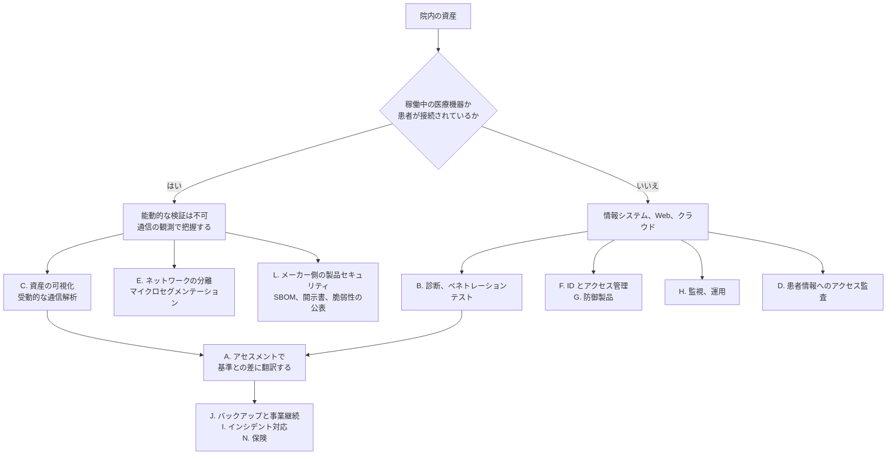

# 🗂️ セキュリティサービスのカタログ

医療機関、医療機器メーカー、製薬企業が外部から調達できるセキュリティサービスを、国内と海外に分けて整理する。

守る側の手は足りない。
[経営とガバナンス](../../governance/readiness-gaps.md) で見たとおり、専任の担当者を置けない医療機関は多く、実務の相当部分が外部委託になる。
そのとき、何が売られているかを知らないまま調達仕様を書くと、必要な機能が抜けるか、既に持っている機能を二重に買うことになる。

本ページは区分と選び方を扱い、個々のサービスは次の二つに分けて記載する。

| ページ | 内容 |
|---|---|
| [国内のサービス](japan.md) | 公的な支援事業と補助金、医療機関向けパッケージ、IoMT 可視化、認証と端末管理、診断、機器メーカー向け支援、教育、保険 |
| [海外のサービス](global.md) | CPS、IoMT 保護基盤、医療特化の ID 管理とプライバシー監視、コンサルとマネージドサービス、第三者リスク管理、製品セキュリティ、機器メーカーが売る運用サービス、公的な無償プログラム |

> [!NOTE]
> **表記ルール**：本ページでは、**事実**（一次情報で確認できる内容。出典を併記する）、**報道ベース**（報道や第三者の集計のみで確認でき、当事者の公表資料では裏付けが取れていない内容）、**分析**（筆者の解釈）を書き分ける。
> サービスの機能、価格、提供状況は、事業者の都合で変わる。本ページの記載は、出典に示した時点のものである。契約の判断は、必ず出典先の最新の記載で行ってほしい。

> [!IMPORTANT]
> 掲載は推奨ではない。
> 公開情報で存在と内容を確認できたものを、区分ごとに並べている。
> 網羅も主張しない。医療向けのメニューを公開していない事業者にも、医療機関の実績を持つところはある。

---

## サービスの区分

医療機関が調達するセキュリティサービスは、次の十四区分に分かれる。
区分が違えば、比較すべき項目も、価格の桁も違う。
六つの群にまとめると、どこが埋まっていないかを見やすい。

| 群 | 区分 | 買うもの | 成果物 | 主な買い手 |
|---|---|---|---|---|
| **測る** | **A. アセスメント** | 現状と基準との差の測定 | ギャップ一覧、優先順位、ロードマップ | 医療機関の全規模 |
| | **B. 診断、ペネトレーションテスト** | 攻撃者視点での検証 | 脆弱性の一覧、侵入経路の再現手順 | 病院、システムベンダ、機器メーカー |
| **見る** | **C. 資産の可視化（IoMT を含む）** | 何が院内ネットワークにいるかの把握 | 資産台帳、通信の相関、機器ごとのリスク | 中規模以上の病院 |
| | **D. 患者情報へのアクセス監査** | 誰がどのカルテを見たかの継続的な点検 | 不適切閲覧の検知、監査記録 | 病院、健診機関 |
| **守る** | **E. ネットワークの分離** | ゾーン設計とマイクロセグメンテーション | 分離ポリシー、到達性の検証結果 | 中規模以上の病院、製薬工場 |
| | **F. ID とアクセス管理** | 職員と委託先の認証、権限の統制 | 二要素認証、シングルサインオン、権限の棚卸し | 全規模 |
| | **G. 防御製品の導入** | EDR、UTM、無害化、フィルタリング | 稼働する構成と設定 | 全規模 |
| | **H. 監視、運用（SOC、MDR）** | 検知と初動を継続的に回す人手 | アラートの一次判断、封じ込めの指示 | 病院、機器メーカー |
| **戻す** | **I. インシデント対応、フォレンジック** | 侵害発生後の調査と復旧 | 調査報告、復旧手順、届出の材料 | 全規模 |
| | **J. バックアップ、事業継続** | 復旧可能な状態の維持 | 隔離された複製、復旧試験の記録、IT-BCP | 全規模 |
| **広げる** | **K. 第三者、供給網リスク管理** | 委託先と製品の評価を回す仕組み | ベンダ評価台帳、継続監視、契約条項 | 大規模病院、製薬企業 |
| | **L. 製品セキュリティ支援** | 機器を出す側の規制対応 | SBOM、脅威モデル、提出資料、開示書 | 医療機器メーカー、システムベンダ |
| **支える** | **M. 教育、訓練** | 人の対応力 | 研修記録、標的型メール訓練、机上演習の講評 | 全規模 |
| | **N. 保険、リスク移転** | 損失の一部を他者に移すこと | 保険証券、付帯する事故対応サービス | 全規模 |

**分析**：この十四区分のうち、C、D、L の三つは医療に固有の知識がないと成立しない。
C は、稼働中の医療機器を能動的にスキャンできないという制約から出発するため、汎用の資産管理ツールでは代替しにくい（[医療機器の検証手法](../../technology/medical-devices/testing-methodology.md)）。
D は、正当な業務としての閲覧と不適切な閲覧を、診療の文脈で切り分ける必要がある。
L は、薬機法、FDA、EU MDR の提出物に落とす必要があるため、規制の様式を知らないと納品物が使えない。
それ以外の区分は、汎用のサービスに医療の文脈を足したものが多い。
「医療特化」を名乗るサービスが、この三つの知識を持つのか、汎用サービスに医療の看板を掛けたものかを見分けることが、比較の出発点になる。

**分析**：区分 D は、国内ではまだ独立した市場になっていない。
米国では患者プライバシー監視として独立の製品分野が成立している（[海外のサービス](global.md#4-患者情報へのアクセス監査)）。
国内で同じ機能を担っているのは、多くの場合、電子カルテの標準機能か、端末管理ソフトの操作ログ機能である（[国内のサービス](japan.md#6-端末と操作ログの管理)）。

---

## 資産と区分の対応

医療機関の資産は、能動的に触れてよいかどうかで大きく二つに分かれる。
この分岐が、買えるサービスを決める。

**分析**：左の系統（稼働中の機器）は、買えるサービスが限られる。
そのため、機器の安全は院内の対策だけでは閉じず、メーカー側の L に依存する。
医療機関が L を直接買うことはないが、調達仕様でメーカーに求めることはできる（[医療機器のセキュリティ](../../technology/medical-devices/)）。
海外では、この求め方を標準化した契約条項の雛形が無償で公開されている（[HSCC の Model Contract Language](global.md#米国の公的業界枠組み)）。

---

## 買い手の類型と、先に埋める区分

同じ「医療機関向け」でも、200 床の病院と無床診療所では、成立する構成が違う。

| 買い手 | 先に埋める区分 | 理由 |
|---|---|---|
| **大規模病院（急性期、災害拠点）** | A → C → H → J | 停止が地域の医療提供体制に波及する。資産の把握と常時監視が前提になる |
| **中規模病院** | A → G → J → N | 専任者を置けないことが多い。導入と運用を委託しつつ、復旧手段を先に確保する |
| **診療所、薬局** | F → G → J → N | 汎用のパッケージで足りる範囲が大きい。公的な補助の対象になりやすい |
| **健診機関、検査センター** | D → K → J | 患者情報の量に対して職員数が少なく、閲覧の統制と委託先の管理が中心になる |
| **医療機器メーカー** | L → B → I | 規制上の提出物が先。上市後の脆弱性対応の窓口も必要になる |
| **医療情報システム事業者** | L → A → K | 医療機関から開示書とチェックリストの提出を求められる。再委託先の管理も問われる |
| **製薬企業** | K → A → H | 委託先と受託製造の管理が中心。製造 OT は別系統で扱う（[製造設備と OT](../pharma/manufacturing-ot.md)） |

**分析**：どの類型でも、J（バックアップと事業継続）が早い段階に入る。
検知や防御が破られたときに診療を続けられるかどうかが、被害の大きさを決めるためである（[サイバー攻撃を想定した BCP](../../response/bcp-cyber.md)）。
[国内のインシデント事例](../../threats/incidents/japan/)では、復旧の長期化がバックアップの設計に起因した例が公表されている。

---

## 「医療特化」を名乗るサービスの判別

医療向けのメニューを公開していること自体は、医療の実務を扱えることを意味しない。
提案を受けた段階で、次を確認できる。

- **稼働中の医療機器に何をするか**：能動的なスキャンを提案してくる場合、停止時の手順と、臨床工学部門との調整をどう組むかを説明できるか
- **報告の宛先**：発見した脆弱性が機器側にある場合、メーカーへの調整開示の経験があるか（[バグバウンティと脆弱性開示](../../practice/bug-bounty/)）
- **深刻度の表現**：CVSS のスコアだけでなく、診療の継続と患者への危害の言葉に翻訳する枠が報告書にあるか
- **データの取扱い**：検証や監視で触れる情報が医療情報にあたる場合、[三省二ガイドライン](../../guidelines/japan.md)の対象事業者としての位置づけを説明できるか
- **開示書の提出**：システムを提供する立場なら、医療情報セキュリティ開示書（MDS/SDS）を出せるか（[国内のサービス](japan.md#12-医療情報セキュリティ開示書と製品セキュリティ体制)）
- **納品物の再利用**：立入検査のチェックリスト、監査、更新時の調達仕様に、そのまま使える形で出てくるか

詳しい確認項目は [診断とペネトレーションテスト](../../practice/pentest/README.md#10-参照先) に置いている。

---

## 市場の区分を、外から見る枠組み

自分で区分を立てる前に、既にある枠組みに当てはめると、抜けを見つけやすい。

**事実**：米国の KLAS Research は、医療機関へのアンケートにもとづく製品評価を分野別に公表しており、セキュリティ関連では Healthcare IoT Security、Patient Privacy Monitoring、Identity Management、Access Management、Security & Privacy Consulting Services、Security & Privacy Managed Services の区分を置いている。
出典：[KLAS Research](https://klasresearch.com/best-in-klas-ranking/cybersecurity-solutions/2026/520)

**事実**：国内の[情報セキュリティサービス基準審査登録制度](https://sss-erc.org/)は、情報セキュリティ監査サービス、脆弱性診断サービス、デジタルフォレンジックサービス、セキュリティ監視、運用サービスの区分で登録一覧を公開している。
出典：[同制度](https://sss-erc.org/)

**分析**：二つの枠組みを重ねると、国内の制度が扱っていない区分が見える。
KLAS にあって国内の登録制度にないのは、資産の可視化、患者情報へのアクセス監査、ID 管理である。
制度に区分がないことは、その領域のサービスが存在しないことを意味しないが、第三者が品質を見る仕組みがないことは意味する。
この三区分については、事業者の説明をそのまま受け取らず、自組織での試験導入で確かめる比重が上がる。

---

## 第三者による裏書きと、その射程

「認定」「登録」「受賞」は、それぞれ別のことを保証している。
何を保証していないかを併せて見ないと、比較に使えない。

| 仕組み | 対象 | 何を確認しているか | 保証していないこと |
|---|---|---|---|
| [情報セキュリティサービス基準審査登録制度](https://sss-erc.org/) | 事業者のサービス | 技術要件と品質管理の体制が基準を満たすこと | 医療分野の実績。個々の案件の品質 |
| [サイバーセキュリティお助け隊サービス](https://www.ipa.go.jp/security/sme/otasuketai/index.html) | 中小企業向けのパッケージ | 相談窓口、監視、対応、保険が一式そろっていること | 医療情報を扱う要件への適合 |
| [ISMS（ISO/IEC 27001）](https://isms.jp/) | 組織のマネジメント体制 | 適用範囲内で管理策が運用されていること | 適用範囲外。個別製品の安全性 |
| [HITRUST 認証](https://hitrustalliance.net/) | 組織の統制（米国が中心） | CSF の要件群を満たすこと（e1、i1、r2 で範囲が異なる） | 認証範囲外のシステム。取得後の変更 |
| AHA Preferred Cybersecurity Provider | 事業者 | 米国病院協会が選定手続きを経て推奨していること | 技術的な優劣。日本の規制への適合 |
| Best in KLAS | 製品、サービス | 導入済み顧客への調査にもとづく満足度の順位 | 未導入環境での有効性。評価対象が北米に偏る点 |
| [ISMAP](https://www.ismap.go.jp/) | クラウドサービス | 政府の求める管理策を満たすこと | 医療情報ガイドラインへの適合（[クラウド事業者と医療](../../technology/cloud/)） |
| [ASPIC 医療情報 ASP・SaaS 情報開示認定](https://aspicjapan.org/nintei/iryo-nintei/) | 事業者の開示 | 定められた項目を開示していること | 開示された対策の有効性 |
| [HISPRO の適合性評価](https://hispro.or.jp/) | 医療情報を扱うクラウドサービス等 | 事業者向けガイドラインへの適合をチェックシートで評価したこと | 評価時点以降の変更。医療機関側の運用 |
| [プライバシーマーク（JIS Q 15001）](https://privacymark.jp/) | 組織の個人情報保護体制 | 適用範囲内で個人情報保護マネジメントシステムが運用されていること | 情報セキュリティ全般。適用範囲外 |
| MDS/SDS、MDS2 | 製品、サービス | 事業者が自らセキュリティ機能を申告していること | 申告内容の第三者による検証 |

**分析**：これらはいずれも、事業者側の状態を示すものであり、自組織の環境で機能するかどうかは示さない。
裏書きは候補を絞る道具として使い、絞ったあとは自組織の構成に対する具体的な提案で比較する。

**事実**：この見方は、ガイドライン自身が示している。
第 7.0 版の経営管理編は、ISMS 認証について「情報システム管理が適正になされていることを認証するものであり、安全対策の有効性までを認証するものではないことに留意する必要がある」とし、ISMS 認証のみを取得している事業者には有効性を示す資料の提供を求めることが望ましいとしている。
出典：[経営管理編（第 7.0 版）](https://www.mhlw.go.jp/content/10808000/001716291.pdf)（厚生労働省、5.1.2 事業者選定の基準、脚注）

**分析**：認証取得を求められるのは委託先の事業者であり、医療機関自身に求められているのは ISMS の構築と、定期的な監査である。
この書き分けと、認証が確認できない場合に代わりに何を見るかの階段は、[国内のサービス](japan.md#15-認証と監査)に整理している。

**分析**：最下段の開示書は性質が異なる。
認証や受賞が第三者の判断であるのに対し、MDS/SDS と MDS2 は事業者の自己申告である。
それでも実務では役に立つ。
申告の内容が誤っていれば契約上の責任を問える形になるため、口頭の説明より確実な記録になるからである。

---

## 契約で決めること

サービスの内容そのものより、契約で決め損ねた点があとで効く。

**責任分界**：検知はするが遮断はしない、遮断はするが復旧はしない、という切れ目がどこに入るか。
**取得できるログ**：監視サービスが取得したログを、自組織が独自に取り出せるか。事業者を替えたときに残るか。
**データの所在と保存期間**：検証や監視で触れる医療情報の保管場所、保存期間、削除の方法。
**再委託**：実作業を誰が行うか。海外拠点が含まれるか。
**インシデント時の到達時間**：連絡から着手までの時間と、それが休日夜間にも適用されるか。
**平時と有事の価格**：インシデント発生後に発生する費用が、契約に含まれるのか別料金なのか。
**保険との重複**：保険の付帯サービスで同じ役務が提供されないか（[国内のサービス](japan.md#14-保険とリスク移転)）。
**契約終了時**：設定、除外リスト、蓄積した資産台帳を、どの形式で引き渡すか。

**分析**：最後の項目が抜けている契約は多い。
資産台帳と通信のベースラインは、蓄積に時間がかかるうえ、事業者の製品に紐づくと持ち出せない。
乗り換えの費用が予想を超える原因は、たいていここにある。
[海外のサービス](global.md#13-市場の再編)で見るとおり、この分野は買収と統合が続いており、契約の相手が数年で変わることを前提に条件を決めておく必要がある。

---

## 価格の見え方

**分析**：この分野の価格は、原則として公開されない。
公開されるのは、単価が定義しやすい三つの型に限られる。

| 型 | 例 | 見積が立てやすい理由 |
|---|---|---|
| ID 課金 | 認証サービスの月額 ／ ID | 職員数から総額を計算できる |
| 対象数課金 | ASM の 1 サイトあたり ／ 診断の 1 ホストあたり | 対象を数えれば済む |
| 制度の上限 | 補助金の補助率と上限額 | 制度側が公表している |

アセスメント、SOC、インシデント対応は、対象範囲と体制で価格が変わるため、相見積が前提になる。
比較のためには、対象範囲（何台、何セグメント、何時間）を発注側でそろえてから見積を取る必要がある。
そろえずに取ると、安い見積は範囲が狭いだけということが起こる。

---

## 国内と海外の構造の違い

**分析**：同じ区分でも、市場の形は日本と海外で異なる。

| 観点 | 国内 | 海外（主に米国） |
|---|---|---|
| 医療特化の専業事業者 | 少ない。地域 SIer と電子カルテベンダのメニューとして提供されることが多い | 医療のみを顧客とするコンサルとマネージドサービスの層が厚い |
| IoMT 可視化 | 海外製品を国内事業者が提供する形が中心 | 専業ベンダが複数競合し、統合と買収が続いている |
| 患者情報へのアクセス監査 | 電子カルテと端末管理の機能として提供される | 独立した製品分野として成立している |
| 買い手を束ねる主体 | 行政（厚生労働省の支援事業、都道府県の委託事業） | 業界団体（病院協会、ISAC）と保険会社 |
| 導入の駆動力 | 医療法施行規則にもとづく義務と立入検査 | HIPAA の執行、保険の引受条件、訴訟リスク |
| 契約条項の雛形 | チェックリストの項目を各自が調達仕様に翻訳する | 業界団体が契約条項の雛形を無償公開する |
| 価格の公開 | パッケージの一部で公開される | ほとんど非公開。相見積が前提 |

この差は、調達の進め方に直結する。
国内では、まず公的な支援事業と補助金の対象になるかを確認してから商用サービスを検討する順序が成立する。
海外では、業界団体や ISAC が用意した枠組みを入り口にすることが多い。

---

## 関連ページ

- [国内のサービス](japan.md)
- [海外のサービス](global.md)
- [診断とペネトレーションテスト](../../practice/pentest/)：B の区分を発注する側と受ける側の実務
- [経営とガバナンス](../../governance/)：予算と体制の判断
- [インシデント対応と事業継続](../../response/)：I と J の区分が効く場面
- [ガイドラインと法規制](../../guidelines/)：調達に反映すべき要求
- [ネットワークの分離](../../technology/segmentation.md)：E の区分の設計論
- [クラウド事業者と医療](../../technology/cloud/)：基盤側の責任分界
- [ツール](../resources/tools.md)：自組織で回す場合の道具

---

[← リファレンス](../README.md) | [国内 →](japan.md) | [トップへ](../../../README.md)
