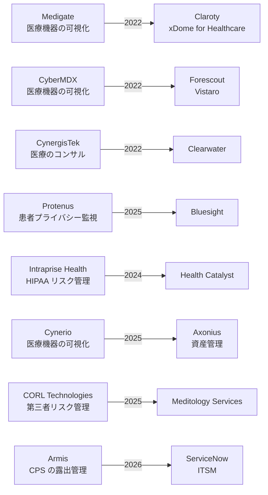

# 🌐 海外のセキュリティサービス

海外で、医療機関と医療機器メーカーが調達できるセキュリティサービスを、区分ごとに整理する。
区分の意味と選び方は [セキュリティサービスのカタログ](README.md) に置いている。

記載の中心は米国である。
医療機関を顧客とするサービスの層が最も厚く、日本で提供される製品の多くがここを起点にしているためである。
英国と欧州は、公的な枠組みの部分で扱う。

> [!NOTE]
> **表記ルール**：本ページでは、**事実**（一次情報で確認できる内容。出典を併記する）、**報道ベース**（報道や第三者の集計のみで確認でき、当事者の公表資料では裏付けが取れていない内容）、**分析**（筆者の解釈）を書き分ける。
> 掲載は推奨ではない。公開情報で内容を確認できたものを並べている。
> 買収と統合が続く領域であり、社名と製品名の対応は短期間で変わる。判断は出典先の最新の記載で行ってほしい。

---

## 1. CPS、IoMT の保護基盤

稼働中の医療機器を能動的にスキャンできないという制約から、通信を受動的に観測して機器を同定し、リスクを評価する製品群が独立した市場を形成している。
米国では、この区分を「Healthcare IoT Security」または「Medical Device Security」と呼ぶ。

| 製品 | 提供者 | 特徴 |
|---|---|---|
| [xDome for Healthcare](https://claroty.com/healthcare-cybersecurity) | Claroty | Medigate を統合。臨床の文脈を加えたリスクの優先順位付け、CMMS 連携 |
| [Armis Centrix](https://www.armis.com/) | Armis（ServiceNow） | IT、OT、医療機器を横断する資産と露出の管理 |
| [Asimily](https://asimily.com/) | Asimily | 脆弱性の悪用可能性にもとづく優先順位付け、設定のドリフト検出 |
| [Ordr](https://ordr.net/) | Ordr | エージェント不要の資産可視化と、機器単位のマイクロセグメンテーション |
| [Medical Device Security](https://www.forescout.com/solutions/medical-device-security/) | Forescout | CyberMDX を統合。FDA のリコール情報と照合 |
| [Cynerio](https://www.cynerio.com/) | Axonius | マイクロセグメンテーション、ePHI の露出検出 |
| [Cylera](https://cylera.com/) | Cylera | 医療 IoT に特化した資産インテリジェンスと監視 |
| [Medical IoT Security](https://www.paloaltonetworks.com/network-security/medical-iot-security) | Palo Alto Networks | 追加センサー不要。仮想パッチでレガシー機器を保護 |
| [Healthcare IoT Security](https://www.nozominetworks.com/industries/healthcare-cybersecurity) | Nozomi Networks | 医療機器と建物設備（BAS）を同じ基盤で扱う |

### 各製品の位置づけ

**事実**：Claroty は Medigate を買収し、その医療向けプラットフォームを xDome へ統合した。
xDome for Healthcare は、医療機器、IoT、建物設備を含む資産の発見、臨床の文脈を加えた露出管理、臨床業務に沿ったネットワーク分離、医療分野に固有の脅威検知、機器のライフサイクル管理と CMMS 連携で構成される。
出典：[Claroty](https://claroty.com/healthcare-cybersecurity)

**事実**：Forescout は 2022 年 2 月 1 日に CyberMDX の買収を発表した。
現在の医療機器セキュリティ製品は Vistaro プラットフォーム上で提供され、eyeSight（エージェント不要の資産の発見と評価）、eyeFocus（リスクと適合性の優先順位付け）、eyeSegment（ゼロトラストの分離）で構成される。
FDA のリコールデータベースとの照合と、機器の設定履歴の保持を機能として挙げている。
出典：[Forescout 買収発表](https://www.forescout.com/press-releases/forescout-acquires-cybermdx-to-expand-healthcare-cybersecurity-focus/)、[Medical Device Security](https://www.forescout.com/solutions/medical-device-security/)

**事実**：Axonius は 2025 年 7 月に、医療機器セキュリティの Cynerio を 1 億ドル超で買収したと公表した。
Cynerio の機能として、マイクロセグメンテーション、機器の可視化、露出した ePHI の特定、ランサムウェアの阻止が挙げられている。
出典：[Axonius](https://www.axonius.com/newsroom/press-release/axonius-acquires-medical-device-security-specialist-cynerio)

**事実**：ServiceNow は、Armis の買収を 2026 年 4 月 20 日に完了したと公表した。
Armis Centrix は、OT、IoT、医療機器、クラウドを含む接続資産に対する検出、優先順位付け、保護を提供する。
出典：[ServiceNow](https://newsroom.servicenow.com/press-releases/details/2026/ServiceNow-completes-Armis-acquisition-closing-the-gap-between-asset-visibility-and-cyber-risk/default.aspx)

**報道ベース**：この買収の公表額は 77.5 億ドルとされ、ServiceNow にとって過去最大の買収と報じられた。
出典：[Cybersecurity Dive](https://www.cybersecuritydive.com/news/servicenow-to-buy-armis-for-775b/808623/)

**事実**：Asimily は、資産インベントリ、継続的な脆弱性の検出とリスクにもとづく優先順位付け、検証済みポリシーによるネットワーク分離、機器のファームウェア更新とパスワード管理、設定のドリフト検出と是正を提供する。
FDA のリコール情報と機器の利用状況を扱い、購入前のリスク回避も対象に含める。
出典：[Asimily](https://asimily.com/)

**事実**：Ordr は、IT、IoT、OT、IoMT を横断する資産の可視化、AI による機器分類、リスクにもとづく脆弱性の優先順位付け、機器レベルの自動マイクロセグメンテーション、適用前のポリシー検証を提供する。
出典：[Ordr](https://ordr.net/)

**事実**：Nozomi Networks は、医療機器（IoMT）に加えて、空調、カメラ、エレベータなどの建物管理システム（BAS）を同じ基盤で扱い、患者の安全と快適性の観点から運用上のリスクを優先順位付けする。
出典：[Nozomi Networks](https://www.nozominetworks.com/industries/healthcare-cybersecurity)

**事実**：Palo Alto Networks の Medical IoT Security は、センサーを追加せずに接続機器を可視化し、機器の種類、患者ケアにおける重要度、露出度を踏まえたリスク評価を行う。
パッチを当てられない機器に対しては、仮想パッチと ID 対応ポリシーで保護する構成を取る。
NGFW、Prisma SASE、Cortex XDR と統合される。
出典：[Palo Alto Networks](https://www.paloaltonetworks.com/network-security/medical-iot-security)

### 第三者評価

**事実**：KLAS Research の 2026 年の Best in KLAS では、Healthcare IoT Security 部門で Asimily が総合スコア 96.6 で受賞している。
出典：[KLAS Research](https://klasresearch.com/best-in-klas-ranking/healthcare-iot-security/2026/374)

**分析**：この部門の評価は、導入済みの顧客に対する満足度調査にもとづく。
北米の医療機関が回答者であるため、日本の医療機関の構成（部門システムの多さ、保守回線の扱い、電子カルテベンダとの関係）で同じ結果になるとは限らない。
候補を絞る材料にはなるが、適合性の判断は自組織の構成に対する検証で行う必要がある（[裏書きの射程](README.md#第三者による裏書きとその射程)）。

**分析**：製品の機能差は、資産の同定精度そのものよりも、その後の工程に現れる。
資産一覧を出すところまでは各社できる。
差が出るのは、機器の脆弱性を臨床上の優先順位に翻訳できるか、CMMS（医療機器管理システム）と突き合わせて機器管理部門が使える形にできるか、分離ポリシーを実機に適用する前に検証できるか、である。
評価では、機器一覧の精度だけでなく、その一覧を誰がどの業務で使うかを先に決めておくとよい。

---

## 2. ネットワークの分離

可視化で見つけた機器を、実際に守る段になると分離が要る。
医療では、分離の実装を新しい機器の追加なしに行えるかが選定の分かれ目になる。

**事実**：Elisity は、新しいハードウェアやエージェントを追加せず、既存のネットワーク機器をセンサーとして使う identity ベースのマイクロセグメンテーションを提供する。
パッチを当てられないレガシー機器をネットワーク層で保護する用途と、適用前のポリシーシミュレーションを挙げている。
出典：[Elisity](https://www.elisity.com/solutions/healthcare)

**分析**：分離は、設計より運用で失敗する。
機器が入れ替わり、部門が増え、臨床側が新しい連携を求めるたびにポリシーがずれていく。
選定では、初期のポリシー生成より、変更を検証してから適用する仕組みがあるかを見るとよい。
分離の設計論そのものは [ネットワークの分離](../../technology/segmentation.md) に置いている。

---

## 3. ID とアクセス管理

医療機関の認証は、一般企業と要件が違う。
共有端末を短時間で何度も切り替える運用が前提で、ログインに時間がかかると臨床側が回避策を編み出す。
この制約に合わせた製品分野が成立している。

**事実**：Imprivata は、医療向けに設計した ID とアクセス管理の製品群を提供する。
Enterprise Access Management（シングルサインオン、多要素認証、パスワードレス認証）、Mobile Access Management（共有モバイル端末）、Medical Device Access Management（臨床端末と共有タブレット）、Patient Access（患者の本人確認、Epic MyChart やキオスクとの連携）、Privileged Access Management（ベンダの遠隔アクセスと顧客側の特権管理）、Access Compliance（利用者の行動とアクセスの分析）で構成される。
出典：[Imprivata](https://www.imprivata.com/solutions/industries/for-healthcare)

**分析**：Privileged Access Management の位置づけが、医療では特に効く。
医療機器と部門システムの保守は、メーカーの遠隔接続に依存することが多く、その接続が院内の台帳に載っていない例が [国内のインシデント事例](../../threats/incidents/japan/) でも侵入口になっている。
ベンダの遠隔アクセスを、常時開けた回線ではなく、都度承認する経路に置き換えられるかどうかが、この区分を買う理由になる。

**分析**：国内との差は、製品の性能ではなく統合の範囲にある。
日本では、職員のログイン統制（認証製品）、患者の本人確認（オンライン資格確認）、委託先の遠隔アクセス（リモート保守）、資格の証明（HPKI）が、それぞれ別の事業者の別の製品として調達される（[国内のサービス](japan.md#5-id-とアクセス管理)）。
米国ではこれらを一つの製品群として売る事業者が成立している。
統合されていれば、誰がどの経路で何にアクセスしたかを一箇所で追える。
国内で同じ状態を作るには、複数製品のログを突き合わせる設計を自分たちで持つ必要がある。

---

## 4. 患者情報へのアクセス監査

誰がどの患者のカルテを見たかを継続的に点検する分野は、米国では独立した製品市場になっている。
HIPAA が不適切な閲覧を規制の対象に置き、執行の実績があることが背景にある。

**事実**：Bluesight は、患者プライバシー監視（Patient Privacy Monitoring）と薬剤転用の監視（Diversion Surveillance）を製品として提供している。
出典：[Bluesight](https://bluesight.com/)

**事実**：Bluesight は 2025 年 1 月 9 日に、患者プライバシー監視の Protenus を買収したと公表した。
出典：[Bluesight](https://bluesight.com/news/bluesight-expands-compliance-capabilities-and-strengthens-platform-through-acquisition-of-protenus/)

**事実**：Imprivata の製品群にも、患者プライバシー監視と薬剤転用の監視が含まれる。
出典：[Imprivata](https://www.imprivata.com/solutions/industries/for-healthcare)

**分析**：この区分が独立した市場になるかどうかは、規制の設計で決まる。
不適切な閲覧そのものが執行の対象になり、検知の仕組みを持っていることが求められると、専用製品を買う理由が生まれる。
国内では、閲覧の記録は残るが、それを継続的に分析する仕組みまでは制度が求めていない。
そのため同じ機能が、電子カルテの監査機能か端末管理ソフトの操作ログとして提供されている（[国内のサービス](japan.md#6-端末と操作ログの管理)）。

**分析**：薬剤転用（drug diversion）の監視が、患者プライバシー監視と同じ製品に載っているのは偶然ではない。
どちらも、電子カルテと調剤システムの操作記録から、正当な業務では説明がつかない行動を見つける作業である。
検知の対象が違うだけで、必要なデータと分析手法が重なる。

---

## 5. 医療特化のコンサルティングとマネージドサービス

米国には、医療機関のみを顧客とするコンサルとマネージドサービスの層がある。
日本にほとんど存在しない類型である。

| 提供者 | 主なサービス |
|---|---|
| [Fortified Health Security](https://fortifiedhealthsecurity.com/) | 仮想 CISO、リスク評価、第三者リスク管理、ペネトレーションテスト、HITRUST 認証支援、Managed XDR、EDR、SIEM、医療機器セキュリティ管理、インシデント対応 |
| [Clearwater](https://clearwatersecurity.com/) | OCR-Quality Risk Analysis、405(d) HICP アセスメント、NIST CSF 成熟度評価、医療機器セキュリティ、マネージドセキュリティ、IRM Pro プラットフォーム |
| [Meditology Services](https://www.meditologyservices.com/) | セキュリティリスク評価、ペネトレーションテスト、HITRUST 認証支援、SOC 2、仮想 CISO、医療機器と IoT のセキュリティ、AI ガバナンス |
| [First Health Advisory](https://firsthealthadvisory.com/) | 医療機器セキュリティ、第三者リスク管理、HICP、NIST、HIPAA への適合支援 |
| [Intraprise Health by Health Catalyst](https://healthcatalyst.com/products/intraprise-health-by-health-catalyst) | HIPAA One による自動化されたリスクアセスメント、ベンダリスク管理、HITRUST 対応、NIST 準拠のギャップ分析 |
| [CyberMaxx](https://www.cybermaxx.com/) | MaxxMDR（24 時間 365 日の検知と対応）。医療を対象産業として明示 |

**事実**：Fortified Health Security は、医療分野に固有の専門性を掲げ、アドバイザリと脅威防御の二系統でサービスを構成する。
医療分野のサイバーセキュリティの動向をまとめた Horizon Report を年二回公表している。
出典：[Fortified Health Security](https://fortifiedhealthsecurity.com/)

**事実**：同社は、2026 年の Best in KLAS で 5 年連続の受賞を公表している。
出典：[Fortified Health Security](https://fortifiedhealthsecurity.com/press-releases/fortified-health-security-named-best-in-klas-for-fifth-consecutive-year/)

**事実**：Clearwater は、HIPAA のリスク分析を中核に、405(d) HICP アセスメント、NIST CSF 成熟度評価、ベンダリスク管理、マネージドクラウドを提供する。
IRM Pro は、分析、プライバシー、セキュリティ、405(d) HICP の進捗を扱うモジュール群で構成される。
出典：[Clearwater](https://clearwatersecurity.com/)

**事実**：KLAS Research の 2026 年の Best in KLAS では、Security & Privacy Consulting Services 部門で Clearwater が総合スコア 94.3 で受賞している。
出典：[KLAS Research](https://klasresearch.com/best-in-klas-ranking/security-and-privacy-consulting-services/2026/400)

**報道ベース**：Clearwater は 2022 年に CynergisTek を 1,770 万ドルの現金取引で買収した。
出典：[Fierce Healthcare](https://www.fiercehealthcare.com/health-tech/clearwater-buys-rival-cybersecurity-firm-cynergistek-177m-cash)

**事実**：Meditology Services は 2025 年 11 月 12 日に、第三者リスク管理（TPRM）の CORL Technologies を買収したと公表した。
CORL の TPRM プログラム、マネージドサービス、データにもとづく知見を自社のポートフォリオに加えるとしている。
出典：[Businesswire](https://www.businesswire.com/news/home/20251112255203/en/Meditology-Services-Expands-Third-Party-Risk-Management-Capabilities-with-Acquisition-of-CORL-Technologies)、[CORL Technologies](https://corltech.com/)

**事実**：First Health Advisory は「サイバーリスクは臨床リスクである」という立場を掲げ、識別と評価、警報と対応、保護と監視、是正と検証の四段でサービスを構成する。
出典：[First Health Advisory](https://firsthealthadvisory.com/)

**事実**：Intraprise Health は Health Catalyst の傘下で、HIPAA One による自動化されたセキュリティリスクアセスメント、内部と外部のリスクを一つの視点で扱うリスク管理、ベンダリスク管理、HITRUST 認証への対応、NIST OSCAL 標準に沿ったギャップ分析を提供する。
出典：[Health Catalyst](https://healthcatalyst.com/products/intraprise-health-by-health-catalyst)

**分析**：これらの事業者に共通するのは、成果物が規制の様式に沿って出てくることである。
HIPAA のリスク分析は、OCR（公民権局）の調査で提出を求められる文書である。
そのため「監査で通る形式で書けること」自体が商品価値になっている。
日本で同じ構造が成立しにくいのは、立入検査で使われるチェックリストが自己点検の形式で、第三者による分析文書の提出を求めていないためである。
仮に検査の様式が変われば、この類型のサービスは国内でも成立しうる。

---

## 6. 保証と第三者評価の仕組み

**事実**：HITRUST は、60 以上の規格を統合したコントロールライブラリである CSF を基盤に、三段階の認証を提供する。
e1 は 43 のコアコントロールを対象とし有効期間 1 年、i1 は 182 のコントロール要件で有効期間 1 年、r2 はリスクプロファイルに応じてカスタマイズされ有効期間 2 年である。
出典：[HITRUST](https://hitrustalliance.net/)

**事実**：米国病院協会（AHA）は、選定手続きを経た事業者を Preferred Cybersecurity Provider として推奨している。
Censinet は、Cyber Firm Risk Management and Information Governance の区分で選定されている。
出典：[Censinet（選定された事業者側の公表）](https://www.censinet.com/blog/censinet-selected-aha-preferred-cybersecurty-provider)

**事実**：Rubrik は、2026 年 4 月に AHA の Preferred Provider（Cybersecurity Resiliency）に選定されたと公表した。
出典：[Businesswire](https://businesswire.com/news/home/20260408439265/en/Rubrik-Selected-as-an-AHA-Preferred-Provider-for-Cybersecurity-Resiliency)

**事実**：KLAS Research は、セキュリティ関連で Healthcare IoT Security、Patient Privacy Monitoring、Identity Management、Access Management、Security & Privacy Consulting Services、Security & Privacy Managed Services の区分を置いている。
出典：[KLAS Research](https://klasresearch.com/best-in-klas-ranking/cybersecurity-solutions/2026/520)

**分析**：米国では、医療機関がベンダを評価する負担を、業界団体と認証制度が肩代わりする構造がある。
HITRUST 認証を取得している事業者には個別の質問票を省く、という運用が取られることがある。
この仕組みは評価コストを下げる一方、認証の範囲外に何が残るかを見落とす原因にもなる。
認証は、質問票を省く根拠としてではなく、質問を絞り込む材料として使うのが安全である。

**分析**：業界団体による推奨（AHA Preferred Provider）は、日本には対応する仕組みがない。
病院団体が特定の事業者を推奨すると、選定の公正さと責任の所在が問われるためだと考えられる。
その代わりに国内では、行政が事業を委託する形（[国内のサービス](japan.md#1-国の枠組みから確認する)）で同じ機能を果たしている。
どちらの形でも、推奨されたことは自組織で機能することを意味しない点は変わらない。

---

## 7. 第三者と供給網のリスク管理

医療機関が抱えるベンダの数は多く、個別に質問票を送る運用は破綻しやすい。
この工程を仕組みとして売るサービスが独立した区分になっている。

**事実**：Censinet の RiskOps は、医療分野に特化した第三者リスクと企業リスクの管理基盤である。
標準化された評価、ワークフローの自動化、継続的な監視を組み合わせ、臨床と業務の重要ベンダ、第三者のソフトウェアとハードウェア、医療機器、治験審査委員会が扱う研究、消費者向け健康アプリ、関連する診療所、内製アプリケーションを対象に含む。
出典：[Censinet](https://censinet.com/)

**事実**：CORL Technologies は医療分野に特化した第三者リスク管理を提供し、2025 年に Meditology Services の傘下に入った。
出典：[CORL Technologies](https://corltech.com/)、[Businesswire](https://www.businesswire.com/news/home/20251112255203/en/Meditology-Services-Expands-Third-Party-Risk-Management-Capabilities-with-Acquisition-of-CORL-Technologies)

**事実**：Fortress Information Security は、ベンダ、資産、ソフトウェアに由来する供給網のリスクを扱う事業者で、対象産業に医療を含む。
資産情報とセキュリティ情報を事業者間で交換する Asset to Vendor（A2V）Network を運営し、SBOM と HBOM の解析ライブラリを提供している。
出典：[Fortress Information Security](https://www.fortressinfosec.com/critical-infrastructure-cybersecurity)

**事実**：Health-ISAC は Community Services Program を運営し、選定した事業者が会員向けに無償または割引でサービスを提供する仕組みを置いている。
Censinet は同プログラムに参加し、会員の重要度の高い第三者ベンダ、製品、サービスに対するリスクアセスメントを無償で提供するとしている。
出典：[Health-ISAC Community Services](https://health-isac.org/community-services/)、[Censinet](https://censinet.com/blog/censinet-joins-health-isac-community-services-program-to-deliver-free-third-party-risk-management-services-to-members)

**分析**：この区分が成立している理由は、評価結果を複数の医療機関で共有できる点にある。
同じベンダを多数の病院が使うため、一度評価すれば他の病院も参照できる。
ISAC が仲介する形は、その共有をさらに広げる仕組みである。
国内で同種のサービスが薄いのは、[事業者確認用のチェックリスト](../../guidelines/japan.md)が医療機関と事業者の一対一の関係を前提にしており、結果を共有する枠組みがないためだと見ている。
委託事業者経由の侵入が実際の経路として公表されている以上（[国内のインシデント事例](../../threats/incidents/japan/)）、共有の仕組みは検討に値する。

---

## 8. 医療機器メーカー向けの製品セキュリティ

機器を出す側が、FDA、EU MDR、各国規制への提出物を作るための支援である。

| 提供者 | 内容 |
|---|---|
| [Medcrypt](https://www.medcrypt.com/) | Guardian（暗号化と鍵管理）、Helm（SBOM と脆弱性管理）、MSI（提出前のギャップ分析とリスク定量化）。脅威モデリング、暗号アーキテクチャのレビュー、PKI 戦略 |
| [Cybellum](https://cybellum.com/) | Product Security Platform。SBOM の作成と検証、脆弱性管理、製品リスク管理、PSIRT、ソフトウェア供給網。自動車、医療機器、産業機械を対象 |
| [Finite State](https://finitestate.io/) | ファームウェアとバイナリからの SBOM 生成、到達可能性解析、脅威モデルの生成。医療機器を対象産業に明示 |
| [Blue Goat Cyber](https://bluegoatcyber.com/) | FDA の市販前、市販後の要求への対応。ペネトレーションテスト、脅威モデリング、SBOM、提出書類の作成 |
| [Ketryx](https://www.ketryx.com/) | 規制対応のアプリケーションライフサイクル管理。SBOM、脅威モデル、リスク文書を一つの流れに接続 |
| [Velentium Medical](https://velentiummedical.com/cybersecurity) | 医療機器の開発と製造を含む一貫した支援のなかでの製品セキュリティ |

**事実**：Medcrypt は医療機器メーカーを顧客とし、FDA の 510(k) と PMA、EU MDR、Health Canada への提出に対応するとしている。
SBOM の自動解析による脆弱性レビューを機能に含む。
出典：[Medcrypt](https://www.medcrypt.com/)

**事実**：Finite State は、ファームウェア、バイナリ、ソースコードから SBOM を生成し、到達可能性解析によって実際に悪用されうる脆弱性を絞り込む。
対象産業として医療機器（FDA への適合）を挙げている。
出典：[Finite State](https://finitestate.io/)

**事実**：Cybellum の Product Security Platform は、SBOM と資産管理、脆弱性管理、製品リスク管理、製品のサイバー適合性、製品セキュリティのインシデント対応（PSIRT）、ソフトウェアライセンス管理、レッドチームの自動化、ソフトウェア供給網のセキュリティで構成され、対象産業に医療機器を含む。
出典：[Cybellum](https://cybellum.com/)

**分析**：この区分は、医療機関が直接買うものではない。
ただし、機器を調達する側が仕様書で求めることはできる。
SBOM の提供、脆弱性情報の通知経路、サポート終了日の明示を調達要件に入れておけば、[院内での資産可視化](#1-cpsiomt-の保護基盤)で見つかった機器の脆弱性を、メーカーに戻す経路が確保される（[医療機器のセキュリティ](../../technology/medical-devices/)、[SCA と SBOM](../../technology/oss-vulnerabilities/sca-sbom.md)）。
その求め方を標準化した契約条項の雛形が、無償で公開されている（[米国の公的、業界枠組み](#米国の公的業界枠組み)）。

---

## 9. 機器メーカーが医療機関に売る運用サービス

医療機器メーカー自身が、医療機関向けにセキュリティの運用サービスを提供する類型がある。
自社製品の保守の延長ではなく、他社製の機器も対象に含める点が特徴である。

**事実**：GE HealthCare は、ネットワークに接続された医療機器を対象とするサイバーセキュリティサービス Skeye を提供している。
遠隔の SOC による監視と対応を 24 時間体制で行い、機器のセキュリティアセスメント、リスクと脆弱性の特定、対応計画の提示を含む。
ベンダ非依存を掲げ、年式、製造元、OS を問わず、ネットワークに接続された医療機器を対象とするとしている。
出典：[GE HealthCare](https://www.gehealthcare.com/services/skeye-cybersecurity)

**事実**：Siemens Healthineers は、医療機器を対象とするサイバーセキュリティサービスとして、セキュリティアプライアンスの提供、ウイルス対策（機器のマルウェアスキャンと通知）、Cybersecurity Management Services（機器の透明性の確保と規制ガイドラインへの適合）、アップグレードプログラムを提供している。
提供の可否は国、モダリティ、ソフトウェア版によって異なるとされる。
出典：[Siemens Healthineers](https://www.siemens-healthineers.com/services/customer-services/uplift-services/cybersecurity-services)

**事実**：Philips は、2014 年に調整された脆弱性開示（CVD）のプログラムを開始し、セキュリティアドバイザリを公開している。
また、ePHI を扱う製品について、医療機器セキュリティの製造業者開示書（MDS2）で顧客に情報を提供している。
出典：[Philips Security Advisories](https://www.philips.com/a-w/security/security-advisories.html)、[Philips Product Security](https://www.philips.com/a-w/about/news/archive/standard/news/articles/2022/20220503-philips-among-the-first-health-technology-companies-granted-critical-vulnerability-classification-authority-by-global-cybersecurity-standards-organization.html)

**分析**：メーカーが運用サービスを売る形には、医療機関から見て二つの利点がある。
機器の内部構成を知っている側が監視するため、通信の正常、異常を切り分けやすい。
そして、脆弱性が見つかったときの修正の主体と、監視の主体が同じになる。
一方で、他社製機器まで対象に含めると、修正の権限は他社にあるため、この二つ目の利点は失われる。
契約では、対象機器のうち自社製と他社製で対応がどう変わるかを分けて確認する必要がある。

**分析**：国内で同じ形を買えるかどうかは、機器メーカーの日本法人がサービスを展開しているかによる。
国内メーカーの多くは、脆弱性情報の公開と保守窓口までを提供し、他社機器を含む監視サービスの提供は確認できていない（[国内のサービス](japan.md#12-医療情報セキュリティ開示書と製品セキュリティ体制)）。

---

## 10. バックアップと復旧

侵害を前提にしたとき、復旧の速さが被害の大きさを決める。
医療では、どのシステムを最初に戻すかを決めておくことが復旧計画の中心になる。

**事実**：Rubrik は、医療機関向けに不変（イミュータブル）でエアギャップされた複製によるランサムウェア対策を提供し、Epic の電子カルテを対象とした保護を挙げている。
また、患者ケアを続けるために最低限要るアプリケーションを絞り込み、それを先に復旧させる考え方を Minimum Viable Hospital として整理している。
出典：[Rubrik](https://www.rubrik.com/industries/healthcare)、[Minimum Viable Hospital](https://www.rubrik.com/industries/minimum-viable-hospital)

**事実**：Veeam は、医療分野向けに不変バックアップとインシデント対応を組み合わせたデータ保護を提供している。
出典：[Veeam](https://www.veeam.com/solutions/industry/healthcare.html)

**分析**：Minimum Viable Hospital の考え方は、製品の有無にかかわらず使える。
全部を同時に戻す計画は現実には動かないため、診療を最低限続けるために何が要るかを事前に順序づけておく必要がある。
国内で同じ作業をするなら、[サイバー攻撃を想定した BCP](../../response/bcp-cyber.md) のダウンタイム運用と接続する形になる。
順序を決める作業は臨床側の判断であり、ベンダに委ねられない。

---

## 11. 公的な枠組みと無償のプログラム

商用サービスの前に確認できる枠組みがある点は、国内と同じである。

### 米国の公的、業界枠組み

**事実**：CISA は、米国内の政府機関と重要インフラ組織に対して無償の Cyber Hygiene サービスを提供している。
インターネットに接続された資産を継続的に評価する脆弱性スキャンと、公開 Web アプリケーションを対象とする Web Application Scanning があり、週次の報告と緊急時のアドホックな通知を含む。
出典：[Cyber Hygiene Services](https://www.cisa.gov/cyber-hygiene-services)（CISA）、[Healthcare and Public Health Sector: Know the Risks、Use Cyber Hygiene](https://www.cisa.gov/topics/cybersecurity-best-practices/healthcare/use-cyber-hygiene)（CISA）

**事実**：米国保健福祉省（HHS）の 405(d) プログラムと、医療、公衆衛生セクターのサイバーセキュリティ実績目標（HPH CPG）は、規模別の対策集と目標値を無償で公開している。
出典：[405(d) HICP](https://405d.hhs.gov/)、[HPH Cybersecurity Performance Goals](https://hhscyber.hhs.gov/cybersecurity-performance-goals.html)

**事実**：医療、公衆衛生セクター調整協議会（HSCC）は、医療機関（HDO）と医療機器メーカー（MDM）の間で結ぶ契約条項の雛形「Model Contract Language for MedTech Cybersecurity（MC2）」を公開している。
版 2 は 2025 年 11 月に公開され、無償でダウンロードできる。
出典：[HSCC](https://healthsectorcouncil.org/model-contract-language-for-medtech-cybersecurity/)

**事実**：HSCC は、中小規模の医療機関を対象とした供給網リスク管理の手引き「HIC-SCRiM」も公開しており、供給者のリスク評価、契約に用いるセキュリティ要件の記述、供給者台帳の属性、供給者リスク管理方針のテンプレートを含む。
出典：[HIC-SCRiM v2](https://healthsectorcouncil.org/hic-scrim-v2/)（HSCC）

**分析**：MC2 と HIC-SCRiM は、国内でもそのまま参考にできる。
規制の参照先は米国のものだが、医療機関がメーカーに求める項目（SBOM の提供、脆弱性の通知期限、サポート終了日の明示、事故時の協力義務）の立て方は、規制の違いに依存しない。
国内の調達仕様を書くときに、チェックリストの項目だけでは足りない部分を埋める材料になる。

### 業界団体と ISAC

**事実**：Health-ISAC は、脅威インテリジェンス、指標（Indicator）の共有、標的化されたアラート、SecureChat による会員間の情報交換、ワーキンググループ、演習（Operation Vital Signs）、サミットとワークショップを提供する。
拠点は米州（フロリダ）、欧州（ベルギー）、アジア太平洋（シンガポール）にある。
出典：[Health-ISAC](https://health-isac.org/)

### ベンダによる無償、割引プログラム

**事実**：Microsoft は 2024 年 6 月 10 日に、地方の病院を対象とするサイバーセキュリティプログラムを発表した。
無償のセキュリティアセスメント、職員向けの無償訓練、セキュリティ製品の割引（独立系の Critical Access Hospital と Rural Emergency Hospital に対して最大 75%）、適格な病院への高度なセキュリティスイートの 1 年間無償提供を含む。
米国病院協会（AHA）と全米農村保健協会（NRHA）と連携している。
出典：[Microsoft](https://news.microsoft.com/source/2024/06/10/microsoft-to-help-rural-hospitals-defend-against-rising-cybersecurity-attacks/)

**分析**：ベンダが無償または大幅な割引で提供するプログラムは、対象範囲が自社製品に限られる。
評価が自社製品の導入提案に接続する設計である点は理解したうえで使う必要がある。
それでも、専任者を置けない小規模病院にとって、外部の目が一度入ること自体の価値は大きい。

### 英国

**事実**：英国では、NHS の患者データとシステムにアクセスするすべての組織が Data Security and Protection Toolkit（DSPT）による自己評価を行う。
DSPT は NCSC の Cyber Assessment Framework（CAF）に沿う形へ移行しており、NHS トラストと ICB などは 2024 年 9 月から、指定を受けた独立プロバイダとゲノム関連組織は 2025 年 9 月から新しい形式に移行した。
出典：[NHS England Digital](https://digital.nhs.uk/data-and-information/information-governance/evolution-of-our-assurance-model)

**事実**：NHS England は Cyber Security Operations Centre（CSOC）を運営し、NHS のネットワーク上の組織に対して 24 時間体制の監視を提供している。
重大なアラートが出た場合、対象組織は「Respond to an NHS cyber alert」サービスで対応状況を記録することが求められる。
出典：[Cyber Security Operations Centre (CSOC)](https://digital.nhs.uk/cyber-and-data-security/cyber-security-operations-centre-csoc)（NHS England Digital）、[Respond to an NHS cyber alert](https://digital.nhs.uk/services/respond-to-an-nhs-cyber-alert)

**分析**：英国の枠組みは、監視そのものを公的機関が提供する点で日米と異なる。
個々の医療機関が SOC を調達する代わりに、中央の CSOC が network 全体を見る構造である。
評価（DSPT）と監視（CSOC）と対応の記録（cyber alert への応答）が一つの体系につながっているため、医療機関側が用意する範囲が相対的に小さい。
日本の共同利用型の議論を考えるとき、参照先として意味がある。

### 欧州連合

**事実**：ENISA は、病院と医療提供者が調達の過程にサイバーセキュリティの要求を組み込むための調達ガイドラインを公開している。
2026 年 7 月 22 日に更新された版は、NIS2 指令、医療機器規則、GDPR、欧州ヘルスデータスペース規則と整合させたものとされる。
出典：[ENISA](https://www.enisa.europa.eu/publications/procurement-guidelines-for-the-cybersecurity-of-hospitals-and-healthcare-providers)

**分析**：EU の枠組みは、サービスを買う前段の「何を求めるか」に重心がある。
NIS2 が供給網リスクの管理を義務として置いたため、調達の要求水準を書けることが規制対応の一部になっている。
規制の詳細は [海外のガイドラインと法規制](../../guidelines/global.md) を参照してほしい。

---

## 12. インシデント対応と保険

**事実**：Mandiant（Google Cloud）、Kroll、Arete は、いずれもインシデント対応のリテイナ契約を提供している。
リテイナは、あらかじめ料金と条件を合意しておき、発生時の着手を早める形の契約である。
出典：[Mandiant Incident Response Retainer](https://www.mandiant.com/resources/datasheets/incident-response-retainer)、[Kroll Cyber Risk Retainer](https://www.kroll.com/en/services/cyber-risk/incident-response-litigation-support/cyber-incident-response-retainer)、[Arete](https://areteir.com/solutions/incident-response)

**事実**：サイバー保険では、医療分野向けの引受と付帯サービスを明示する商品がある。
Corvus は医療分野向けの Smart Cyber、Coalition は医療分野向けのページ、Beazley は Breach Response として、事故対応の役務を含む形の商品を提供している。
出典：[Corvus](https://www.corvusinsurance.com/smart-cyber-made-for-healthcare)、[Coalition](https://www.coalitioninc.com/industry/healthcare)、[Beazley](https://www.beazley.com/usa/cyber_and_executive_risk/cyber_and_tech/beazley_breach_response/healthcare.html)

**分析**：リテイナと保険の付帯サービスは、役務が重なる。
両方を契約している組織では、事故時にどちらの経路で動くかが決まっていないと、初動で時間を使う。
保険会社が指定する事業者と、自組織がリテイナを結んだ事業者が違う場合、保険金の支払対象になるかを事前に確認しておく必要がある。

---

## 13. 市場の再編

この領域では、専業ベンダが大手の資産管理、ITSM プラットフォームに統合される動きと、医療特化の事業者が隣接分野を買って一社で覆う動きが並行している。

**事実**：Health Catalyst は 2024 年 11 月 6 日に、Intraprise Health を買収する最終契約を締結したと公表した。
取得価額は約 4,300 万ドルで、現金と株式を組み合わせて充当するとしている。
出典：[Health Catalyst](https://www.healthcatalyst.com/news/health-catalyst-signs-definitive-agreement-to-acquire-top-rated-cybersecurity-provider-intraprise-health)

**分析**：この再編には二つの方向がある。
一つは、医療機器の可視化が単独の製品では成立しにくくなり、より広い資産管理や CPS 保護の一機能になる方向である。
Medigate、CyberMDX、Cynerio、Armis がこれにあたる。
もう一つは、医療特化のサービス事業者が、隣接する区分を買って一社で覆う方向である。
CynergisTek、CORL、Intraprise Health、Protenus がこれにあたる。

医療機関にとっての実務上の影響は、契約の相手と製品名が変わることである。
可視化製品を導入している場合、統合後にライセンス体系、サポート窓口、データの持ち出し条件が変わりうる。
[契約で決めること](README.md#契約で決めること)で挙げた引き渡し条件は、この再編を前提にすると重みが増す。

---

## 14. 日本との差

**分析**：海外（主に米国）と国内では、同じ区分でも成立の仕方が違う。

| 観点 | 米国 | 国内 |
|---|---|---|
| 医療特化の事業者 | 医療のみを顧客とするコンサルとマネージドサービスが複数存在する | 地域 SIer と電子カルテベンダのメニューとして提供される |
| 患者情報へのアクセス監査 | 独立した製品分野。KLAS に評価区分がある | 電子カルテと端末管理の機能として提供される |
| ID とアクセス管理 | 医療専用の製品分野が成立している | 汎用の ID 基盤に医療機関向けプランを設ける形 |
| 評価の共有 | 業界団体と第三者リスク管理の基盤が、ベンダ評価を複数の医療機関で共有する | 医療機関と事業者の一対一の確認が基本 |
| 規制と成果物 | HIPAA のリスク分析など、監査で提出する文書がサービスの成果物になる | 立入検査は自己点検のチェックリストが中心 |
| 契約条項の雛形 | 業界団体が無償で公開する（MC2、HIC-SCRiM） | 各医療機関がチェックリストから調達仕様に翻訳する |
| 無償の入り口 | 政府、業界団体、ISAC、ベンダのプログラムが並立する | 行政の支援事業と補助金が中心 |
| 監視の担い手 | 民間の MDR を各組織が調達する（英国は公的な CSOC） | 民間の SOC を各組織が調達する |
| 医療機器の可視化 | 専業ベンダが競合し、統合が進む | 海外製品を国内事業者が提供する |

**分析**：国内の事業者を評価するとき、米国の区分をそのまま当てはめると「該当なし」が並ぶ。
比較の軸は、区分の有無ではなく、その工程を誰がやっているかに置くとよい。
たとえば K（第三者リスク管理）の専業サービスが国内になくても、電子カルテベンダが自社の再委託先を管理していれば、その範囲は覆われている。
覆われていない範囲を特定することが、調達仕様を書く作業そのものになる。

**分析**：海外の資料のうち、規制に依存しない部分は国内でも使える。
HSCC の契約条項の雛形、ENISA の調達ガイドライン、Rubrik の Minimum Viable Hospital の考え方は、いずれも「何を求め、何を先に戻すか」を決める材料であり、法域を問わない。
制度の違いを理由に読まずに済ませると、国内では埋まっていない部分を自力で考え直すことになる。

---

## 関連ページ

- [セキュリティサービスのカタログ](README.md)：区分と選び方
- [国内のサービス](japan.md)
- [海外のガイドラインと法規制](../../guidelines/global.md)：HIPAA、FDA、EU MDR、NIS2
- [医療機器のセキュリティ](../../technology/medical-devices/)：可視化の対象になる機器の性質
- [ネットワークの分離](../../technology/segmentation.md)：分離の設計論
- [SCA と SBOM](../../technology/oss-vulnerabilities/sca-sbom.md)：製品セキュリティ支援の中心にある実務
- [サイバー攻撃を想定した BCP](../../response/bcp-cyber.md)：復旧の順序づけ
- [海外のインシデント事例](../../threats/incidents/global/)
- [ラボ、コミュニティ](../labs-communities/)：Health-ISAC を含む情報共有の場

---

[← 国内](japan.md) | [カタログ](README.md) | [トップへ](../../../README.md)
