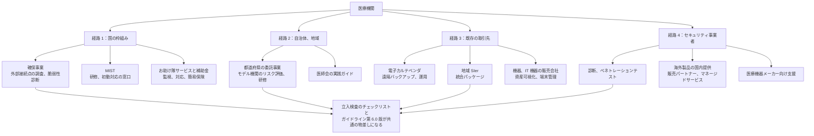
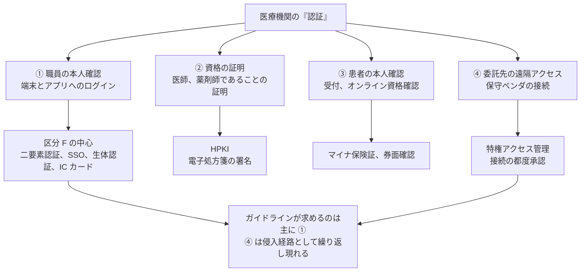

# 🇯🇵 国内のセキュリティサービス

国内で、医療機関、医療情報システム事業者、医療機器メーカーが調達できるセキュリティサービスを、区分ごとに整理する。
区分の意味と選び方は [セキュリティサービスのカタログ](README.md) に置いている。

> [!NOTE]
> **表記ルール**：**事実**（一次情報で確認できる内容。出典を併記する）、**報道ベース**（報道のみで確認できる内容）、**分析**（筆者の解釈）を書き分ける。
> 掲載は推奨ではない。公開情報で内容を確認できたものを並べている。
> 機能、価格、提供状況は変わる。判断は出典先の最新の記載で行ってほしい。

---

## 調達の経路

国内の医療機関がセキュリティサービスに到達する経路は、大きく四つある。
どの経路で来たかによって、比較できる相手と、価格の出方が変わる。

**分析**：経路 1 と 2 は費用がかからないか補助の対象になるため、最初に確認する価値がある。
経路 3 は院内の構成を知っている相手なので導入が早い一方、そのシステム自体を評価する立場に立ちにくい。
経路 4 は独立した評価が得られるが、医療の制約（稼働中の機器、保守契約、診療の時間帯）を提案に織り込めるかが事業者によって差が出る。
四つを組み合わせるとき、同じ物差し（ガイドライン第 6.0 版とチェックリストの項目）に結果を並べられるかを、発注の時点で決めておくとよい。

---

## 1. 国の枠組みから確認する

商用サービスを検討する前に、行政が用意した枠組みの対象になるかを確認する順序が成立する。
費用がかからないか、補助の対象になるためである。

### 医療機関におけるサイバーセキュリティ確保事業

**事実**：厚生労働省は、医療機関のサイバーセキュリティ確保を目的として、外部ネットワークとの接続点の調査と脆弱性診断を行う事業を実施している。
令和 7 年度は東日本電信電話株式会社（NTT 東日本）が受託し、外部接続点の洗い出し、外部ネットワーク調査、脆弱性診断を実施した。
対象は電子カルテシステムを導入している医療機関で、支援対象は都道府県が選定する。
出典：[医療機関におけるサイバーセキュリティ確保事業](https://www.mhlw.go.jp/stf/seisakunitsuite/bunya/kenkou_iryou/iryou/johoka/cyber-security_00002.html)（厚生労働省）

**事実**：同ページは令和 7 年度のアーカイブとして公開されており、令和 8 年度については、選定された医療機関へ事務局から直接連絡する旨のみが記載されている。
出典：同上

**報道ベース**：支援対象は電子カルテを導入している病床数 20 床以上の病院とされ、選定にあたっては地域の基幹病院、災害拠点病院、急性期病院が優先されると報じられている。
出典：[GemMed](https://gemmed.ghc-j.com/?p=65074)

**分析**：この事業は、区分でいえば A（アセスメント）と B（診断）にあたる。
外部から見える接続点を洗い出す作業は、自組織で台帳を作るより先に一度やっておく価値がある。
[国内のインシデント事例](../../threats/incidents/japan/)で繰り返し現れる侵入口が、情報システム部門の台帳に載っていない保守回線と VPN 装置だからである。

### 教育と初動対応の窓口

**事実**：[医療機関向けセキュリティ教育支援ポータルサイト（MIST）](https://mist.mhlw.go.jp/) は厚生労働省の委託事業で、経営者向け、システム管理者向け、初学者向けの研修と e-learning、動画教材を提供する。
サイバー攻撃発生時の初動対応支援窓口も置かれている。
出典：[MIST](https://mist.mhlw.go.jp/)

### 中小規模向けのパッケージ制度と補助金

**事実**：「サイバーセキュリティお助け隊サービス」は、中小企業向けに、相談窓口、異常の監視、緊急時の対応支援、簡易サイバー保険をワンパッケージで提供する民間サービスを、IPA が基準に照らして登録し公表する制度である。
登録されたサービスの一覧は公開されている。
出典：[サイバーセキュリティお助け隊サービス制度](https://www.ipa.go.jp/security/sme/otasuketai/index.html)（IPA）、[登録一覧](https://www.ipa.go.jp/security/sme/otasuketai/servicelist/index.html)、[経済産業省](https://www.meti.go.jp/policy/netsecurity/otasuketai.html)

**事実**：中小企業デジタル化、AI 導入支援事業（デジタル化、AI 導入補助金 2026、旧 IT 導入補助金）には「セキュリティ対策推進枠」がある。
補助対象は、IPA の「サイバーセキュリティお助け隊サービスリスト」に掲載され、IT 導入支援事業者が登録したサービスである。
補助率は小規模事業者が 2 分の 1 以内から 3 分の 2 以内、補助額は 5 万円から 150 万円で、導入費用と最大 2 年分のサービス利用料が対象となる。
出典：[セキュリティ対策推進枠](https://it-shien.smrj.go.jp/applicant/subsidy/security/)（中小企業基盤整備機構）

**分析**：診療所と薬局にとっては、この二つの組み合わせが現実的な入り口になる。
G（防御製品）、H（監視）、I（インシデント対応）、N（保険）を、個別に選定せずまとめて調達でき、費用の一部が補助されるためである。
ただし登録は中小企業一般を対象とした基準にもとづくもので、医療情報を扱う要件を確認したものではない。
医療情報システムに触れる範囲については、[三省二ガイドライン](../../guidelines/japan.md)への対応を別途確認する必要がある。

### サービス提供者側の登録制度

**事実**：[情報セキュリティサービス基準審査登録制度](https://sss-erc.org/) は、情報セキュリティ監査サービス、脆弱性診断サービス、デジタルフォレンジックサービス、セキュリティ監視、運用サービスについて、提供者が基準を満たすかを審査し、登録一覧を公開する制度である。
出典：[同制度](https://sss-erc.org/)

---

## 2. 自治体と業界団体の枠組み

国の事業とは別に、都道府県と医師会が用意する枠組みがある。
規模の小さい医療機関ほど、この経路の比重が大きい。

### 都道府県の委託事業

**事実**：徳島県は、医療機関のサイバーセキュリティ体制構築を支援する事業を公募型プロポーザルで両備システムズに委託し、2022 年 4 月から 2023 年 3 月にかけて実施した。
病院 3 機関、診療所 3 機関をモデル医療機関として、ヒアリングと実地調査により医療情報システムのガイドライン 94 項目の対策状況を確認し、マニュアルとチェックリスト（改善推奨事項に関連する 20 項目）を作成した。
医療機関向けの研修は病院向け（93 名）と診療所向け（99 名）に分けて実施し、県下 1,009 医療機関に周知した。
出典：[両備システムズ](https://www.ryobi.co.jp/news/2023/20230518)

**分析**：この形は、個々の医療機関が単独で発注するより費用対効果が高い。
モデル機関の調査結果を一般化してマニュアルにし、県下全体に配る構造になっているためである。
自組織が対象外だった県でも、公開された成果物は使える。
発注を検討する前に、自県が同種の事業を実施していないかを確認する価値がある。

### 医師会の実践ガイド

**事実**：日本医師会は「医療機関におけるサイバーセキュリティ対策チェックリストの実践ガイド」を 2025 年 11 月に発行した。
厚生労働省のチェックリストを効率的に確認するための解説資料で、体制構築、医療情報システムの管理、運用、インシデント発生に備えた対応、FAQ、チェックリストとの対応表、相談窓口の一覧で構成される。
出典：[日医 on-line](https://www.med.or.jp/nichiionline/article/011545.html)（日本医師会）

**分析**：チェックリストは項目の羅列であり、何をもって「はい」と答えてよいかが分かりにくい。
実践ガイドは、その判断基準を埋める資料である。
外部にアセスメントを発注する前に、この資料で自己点検を通しておくと、発注する範囲を絞り込める。

### 情報共有と訓練の団体

| 団体 | 内容 |
|---|---|
| [一般社団法人医療 ISAC](https://m-isac.jp/) | 国内の医療機関を対象とした脅威情報の共有、Health-ISAC レポートの翻訳配信、認証サービス、相談 |
| [一般社団法人医療サイバーセキュリティ協議会（MedCSC）](https://medcsc.org/) | インシデント訓練、ワークショップ、サイバーリスク可視化ツール HCARE、地域のセキュリティ組織ネットワーク |
| [Health-ISAC（日本語ページ）](https://health-isac.org/ja/) | 国際的な情報共有組織。日本語での情報提供がある |

**事実**：MedCSC は、医療セキュリティ人材の実践的トレーニングとして医療機関におけるインシデント訓練を実施し、サイバーリスク可視化ツール HCARE と、AI を用いたインシデントシミュレータ、地域単位のセキュリティ組織ネットワーク HCARE Regional を提供している。
出典：[MedCSC](https://medcsc.org/)

**事実**：MedCSC は、医療版インシデントボードゲームをもとに、医療機器ベンダを含む複数の関係者が連携して対応を協議する形式の訓練を設計している。
出典：[MedCSC](https://medcsc.org/boardgame)

**分析**：訓練の設計で医療に固有なのは、参加者が院内で閉じないことである。
電子カルテベンダ、医療機器メーカー、給食や検査の委託先が同時に動かないと復旧が進まない。
複数の関係者を同じ卓に着かせる形式は、この構造を再現している。
団体の一覧と役割は [国内のガイドラインと法規制](../../guidelines/japan.md) にもまとめている。

---

## 3. 医療機関向けの統合パッケージ

複数の区分をまとめて一社から調達する形である。
専任の担当者を置けない医療機関で選ばれやすい。

| 提供者 | サービス名 | 構成 |
|---|---|---|
| 両備システムズ | [Ryobi-MediSec](https://www.ryobi.co.jp/security/ryobi-medisec) | 可視化、防御製品導入、運用監視、教育訓練、保険、インシデント対応の六区分 |
| GMO サイバーセキュリティ byイエラエ | [GMO サイバーセキュリティ for 医療](https://group.gmo/news/article/8637/) | コンサルティング、診断、ペネトレーションテスト、事故対応、SOC、ASM |
| キヤノン ITS メディカル | [病院向けトータルセキュリティ](https://canon.jp/biz/solution/medical/lineup/security) | ウイルス対策、無害化、リモートアクセス、ランサムウェア対策、オフラインバックアップ |
| NTT 西日本 | [医療機関向けセキュリティ対策](https://business.ntt-west.co.jp/solution/medical_secure/) | セキュリティ診断、リモートアクセス、常時監視、バックアップ |

### Ryobi-MediSec（両備システムズ）

**事実**：医療機関向けのセキュリティサービスパッケージで、「医療情報システムの安全管理に関するガイドライン第 6.0 版」への対応を掲げている。
構成は次の六タイプである。
出典：[Ryobi-MediSec](https://www.ryobi.co.jp/security/ryobi-medisec)（両備システムズ）、[提供開始のお知らせ](https://www.ryobi.co.jp/news/ryobi-medisec)

| タイプ | 内容 | 対応する区分 |
|---|---|---|
| Ⅰ | セキュリティ脅威の可視化（ガイドラインチェック、VPN 機器診断、リスクの可視化） | A、B |
| Ⅱ | セキュリティ強化対策（UTM、EDR、DDI、二要素認証 ARCACLAVIS） | F、G |
| Ⅲ | セキュリティ運用監視（Mini-SOC、Standard-SOC） | H |
| Ⅳ | 職員向け教育訓練（研修、標的型メール訓練） | M |
| Ⅴ | サイバー保険 | N |
| Ⅵ | インシデント対応（フォレンジック調査） | I |

**分析**：この六タイプは、[カタログ](README.md#サービスの区分)の十四区分のうち、C（資産の可視化）、D（アクセス監査）、K（第三者リスク）、L（製品セキュリティ）を除くほぼ全域を覆う。
一社にまとめる利点は、区分の境目で作業が落ちないことにある。
一方で、H（監視）を導入した事業者に任せると、導入した構成の問題を自ら指摘しにくいという構造が残る。
可視化と診断だけを別の事業者から買うという分け方は、規模が許すなら検討に値する。

### GMO サイバーセキュリティ for 医療

**事実**：2023 年 10 月 26 日に提供を開始した、医療機器メーカーと医療機関の双方を対象とするパッケージである。
コンサルティング、脆弱性診断、ペネトレーションテスト、サイバー事故対応支援、SOC、ASM ツールで構成される。
公表資料では、背景として 2022 年 10 月末の大阪急性期・総合医療センターのランサムウェア被害と、2023 年 4 月の医療法施行規則改正、同年 5 月のガイドライン第 6.0 版を挙げている。
出典：[GMO インターネットグループ](https://group.gmo/news/article/8637/)

**分析**：医療機関と機器メーカーの両方を一つのメニューで受ける構成は、国内では珍しい。
機器の脆弱性が見つかったときの調整開示は、両者の間で止まりやすい論点であり、双方を顧客に持つ事業者がその窓口になれるかどうかは、実務上の差になりうる（[バグバウンティと脆弱性開示](../../practice/bug-bounty/)）。

### 病院向けトータルセキュリティ（キヤノン ITS メディカル）

**事実**：医療情報システムのマルチベンダとしての導入実績を前提に、ウイルス対策（ESET）、マルウェア侵入防止（VOTIRO）、リモートアクセス（Kompira Greac、マジックコネクト）、ランサムウェア対策（Cipher Security Service）、オフラインバックアップ（AppCheck）を組み合わせて提供する。
出典：[キヤノン](https://canon.jp/biz/solution/medical/lineup/security)

**分析**：既存の医療情報システムを納めている事業者が、その上にセキュリティ製品を載せる形である。
院内システムの構成を把握している側が担当するため導入は早い。
確認すべきは、そのシステム自体の脆弱性を誰が評価するかである。

### そのほかの提供

**事実**：NTT 西日本は、医療機関向けにセキュリティ診断（ポートスキャンによる公開サービスとソフトウェアの調査）、リモートアクセス（MagicConnect）、常時監視による異常通信の検知と遠隔対処（セキュリティおまかせプラン）、バックアップ（データ安心保管プラン）を提供している。
出典：[NTT 西日本](https://business.ntt-west.co.jp/solution/medical_secure/)

**報道ベース**：SCSK システムマネジメントは、病院向けの IT 運用サービス「医療情報サポート」を 2023 年 5 月から提供している。
医療情報技師が院内に常駐する基本サービスと、SCSK のセキュリティ担当者と連携するセキュリティアドバイザリを含む連携サービスで構成されると報じられている。
出典：[日本経済新聞](https://www.nikkei.com/article/DGXZRSP656246_R30C23A5000000/)

---

## 4. 資産と IoMT の可視化

稼働中の医療機器を能動的にスキャンできないという制約から、通信の観測で機器を同定する方式が使われる。
国内では、海外製のプラットフォームを国内事業者が提供する形が中心である。

### IoMT デバイスマネジメントサービス（富士フイルムビジネスイノベーション）

**事実**：2023 年 11 月 9 日に「IT Expert Services IoMT デバイスマネジメントサービス」の提供を開始した。
医療機関向けの IoMT セキュリティプラットフォームを用いてネットワーク通信を監視し、接続された IoMT を含む IT 機器を可視化する。
通信データの継続的な監視と脆弱性情報の照合により、機器台数とリスクの推移、対策例をまとめた定期レポートを提供する。
プレスリリースでは、使用するプラットフォームの製品名は示されていない。
出典：[富士フイルムビジネスイノベーション](https://www.fujifilm.com/fb/company/news/release/2023/81359)

**事実**：石巻赤十字病院（宮城県、460 床）の導入事例が公開されている。
院内ネットワークデバイスの詳細情報と稼働率データの自動収集により、セキュリティ対策のほか、稼働していない機器の発見と機器更新の判断に用いたことが記載されている。
出典：[導入事例](https://www.fujifilm.com/fb/ja/solutions/case-studies/ishinomaki)（富士フイルムビジネスイノベーション）

**分析**：この事例で注目すべきは、成果としてセキュリティと並んで資産管理と稼働率が挙げられている点である。
セキュリティ単独では予算の説明がつかない医療機関でも、機器更新の判断材料として説明できれば通る場合がある。
可視化の区分は、この二重の用途を持つ点で他の区分と性質が違う。

### Claroty xDome の国内提供

**事実**：Claroty は、医療機関向けの Medigate プラットフォームを xDome へ統合し、[xDome for Healthcare](https://claroty.com/healthcare-cybersecurity) として提供している。
機能は、医療機器、IoT、建物設備を含む資産の発見、臨床の文脈を加えたリスクの優先順位付け、ネットワークの分離、医療分野に固有の脅威検知である。
出典：[Claroty](https://claroty.com/healthcare-cybersecurity)

**事実**：日本語のページも公開されており、資産の可視化、端末間通信の把握、接続機器の OS バージョン特定と変更時の通知を挙げている。
同ページは、厚生労働省が 2024 年 8 月に示した「サイバー攻撃リスク低減のための最低限の措置」への対応として、パスワードの設定、IoT 機器を含む通信制御の確認、ネットワーク機器のファームウェア更新を挙げている。
出典：[Claroty（日本語）](https://claroty.com/cybersecurity-measures-at-medical-institutions-jp)

**事実**：ユニアデックスは 2025 年 3 月 18 日に Claroty と販売パートナー契約を締結し、Claroty xDome を取り扱うと発表した。
出典：[ユニアデックス](https://www.uniadex.co.jp/news/2025/20250318_claroty.html)

### そのほかの提供

**事実**：TXOne Networks は、OT セキュリティ製品の日本語サイトで、病院ネットワークを対象としたガイドと国内事例を含む資料を公開している。
出典：[TXOne Networks（日本語）](https://www.txone.com/ja/)

**事実**：トレンドマイクロは、ヘルスケア業界、医療機関向けのソリューションページを公開している。
出典：[トレンドマイクロ](https://www.trendmicro.com/ja_jp/business/capabilities/solutions-for/healthcare.html)

**分析**：国内で IoMT の可視化を買う経路は、大きく三つある。
海外ベンダの日本法人から直接買う、国内の販売パートナーから買う、国内事業者のマネージドサービスとして買う、である。
三つ目は、製品名が表に出ないことがある。
乗り換えの可否と、蓄積した資産台帳の引き渡し条件を、契約時に確認しておく必要がある（[契約で決めること](README.md#契約で決めること)）。
---

## 5. ID とアクセス管理

医療で「認証」と言うとき、四つの別のものが同じ語で呼ばれる。
要件が噛み合わなくなるのは、たいていこの取り違えが原因である。

**分析**：規制が名指しで求めているのは ① である。
一方、[国内のインシデント事例](../../threats/incidents/japan/)で侵入口として繰り返し現れるのは ④ の保守回線である。
① を整えても ④ が常時開いたままなら、攻撃者の経路は残る。
調達では、この二つを別々の案件として扱わず、同じ時期に見直すほうがよい。

### 何が求められているか

**事実**：医療情報システムの安全管理に関するガイドライン第 7.0 版のシステム運用編は、認証、認可の遵守事項⑤として、令和 9 年度（令和 9 年 4 月 1 日時点）で稼働していることが想定される医療情報システムについて、今後の新規導入または機器の入替等を伴うシステム更改に際して、二要素認証を採用するか、これに相当する対応を行うことを求めている。
技術的な理由等で令和 9 年度までの対応が困難な場合は、令和 9 年度以降の直近の次期更新までを期限とする。
出典：[システム運用編（第 7.0 版）](https://www.mhlw.go.jp/content/10808000/001716295.pdf)（厚生労働省）

**事実**：同編は、クライアント端末とサーバの双方に実装を要するとし、クライアント端末では電子カルテ等のアプリケーションのログイン時に、サーバでは OS のログイン時に二要素認証を実装することを求めている。
認証した情報をアプリケーションの資格情報と連携して適切な権限付与ができる場合は、OS やミドルウェアでの二要素認証も許容されるが、OS で一要素、アプリケーションで一要素という組み合わせは許容されない。
出典：同上（表 14-1）

**事実**：サーバ OS については、次のいずれか、またはこれと同等以上の措置があれば二要素認証を実装しているものとみなされる。
出典：同上

1. サーバ群へのアクセスを別ドメインの踏み台端末からの RDP、SSH 等に限定し、踏み台端末の OS ログイン時に二要素認証を実装する
2. 上記の接続限定に加えて、踏み台端末に振る舞い検知（EDR 機能）を備え、外部からの接続を VPN 経由の踏み台端末に限定する

いずれの場合も、外部から踏み台端末にログインするユーザに管理者権限を与えないこと、OS のセキュリティアップデートを十分に行うこと、サーバ群と踏み台端末で共通のパスワードを使わないことが前提となる。

**事実**：パスワードの桁数は、二要素認証を採用している場合は 8 桁以上（PIN であれば 4 桁以上）、採用していない場合は 13 桁以上とされ、英数字の混在が求められる。
定期的な変更は不要とされている。
VPN 装置についても、記憶認証のみに依存せず二要素認証等の導入が望ましいとされる。
出典：同上

**分析**：この条文で見落とされやすいのはサーバ側である。
「電子カルテのログインに IC カードを入れた」で終わっている医療機関は多いが、ガイドラインはサーバ OS のログインにも二要素認証を求めている。
サーバ側は院内ネットワークの再構築を伴うことがあるため、踏み台端末を経由させる代替措置が明示的に用意されている。
認証製品を選ぶ前に、自院がクライアント側とサーバ側のどちらを、どの方式で満たすつもりかを決めておく必要がある。

**分析**：ベンダの資料は、2026 年 8 月時点でも「第 6.0 版対応」と書かれているものが多い。
ガイドラインは 2026 年 6 月に第 7.0 版へ改定されている（[国内のガイドラインと法規制](../../guidelines/japan.md)）。
二要素認証の要求そのものは第 6.0 版から引き継がれているが、提案書の記載が旧版のままの場合、他の要求事項も旧版を前提にしている可能性がある。

### 実装の二通り

二要素認証を満たす経路は二つある。

| 経路 | 内容 | 向く条件 |
|---|---|---|
| **システム側で実装** | 電子カルテなど医療情報システム自体が二要素認証に対応する | システム更改の時期が近い。ベンダが対応済み |
| **認証基盤を別に入れる** | 端末のログインに認証製品を入れ、シングルサインオンで各システムに渡す | 複数の部門システムがある。更改時期がそろわない |

**分析**：後者を選ぶ場合、シングルサインオンで各アプリケーションに資格情報を渡す構成になるため、前掲の表 14-1 の注記に当たるかを確認する必要がある。
「OS で二要素認証し、その情報をアプリケーションの権限付与に連携する」形であれば許容されるが、連携がなく単にログイン画面を自動入力しているだけでは、要件を満たしているとは言いにくい。

### 国内で確認できる認証製品

| 製品 | 提供者 | 認証方式 |
|---|---|---|
| [ARCACLAVIS NEXT](https://www.ryobi.co.jp/security/arcaclavis-next) | 両備システムズ | 顔認証、IC カード、ワンタイムパスワードとパスワードの組み合わせ |
| [SmartOn](https://www.soliton.co.jp/lp/medical/) | ソリトンシステムズ | IC カード、顔認証による PC ログオン認証、USB 接続制御 |
| [DigitalPersona AD](https://www.digitalpersona.jp/wp_content_13/) | ヒューマンテクノロジーズ | 指紋を含む生体認証、Windows ログオンへの二要素認証 |
| [静紋 J300、AUthentiGate](https://www.hitachi-solutions.co.jp/johmon/medical/medical.html) | 日立ソリューションズ | 指静脈、顔認証、IC カード。Single Sign-On Manager と連携 |
| [GMOトラスト・ログイン 医療機関認証強化プラン](https://group.gmo/news/article/9961/) | GMO グローバルサイン | デスクトップ SSO、ワンタイムパスワード、IP 制限、FIDO とプッシュによるパスワードレス |
| [クライアント証明書](https://www.cybertrust.co.jp/blog/certificate-authority/client-authentication/emr-mfa.html) | サイバートラスト | ID、パスワードに端末の電子証明書を組み合わせる |

**事実**：GMO グローバルサイン株式会社は、2026 年 3 月 30 日に「GMOトラスト・ログイン 医療機関認証強化プラン」の提供を開始した。
Windows 統合認証によるデスクトップ SSO、ワンタイムパスワードと IP 制限による多要素認証、パスワードレス認証（プッシュ、FIDO）、パスワード漏洩検知を含む。
価格は月額 500 円（税込 550 円）／ ID である。
ガイドライン第 6.0 版のうち、二要素認証の導入と、アカウントの安全性を継続的に確認する仕組みの整備に対応するとしている。
出典：[GMO インターネットグループ](https://group.gmo/news/article/9961/)

**分析**：価格を公開している点が、国内の医療機関向けサービスとしては例外的である。
[カタログ](README.md#価格の見え方)で触れたとおり、ID 課金は職員数から総額を先に見積もれるため、予算要求の資料を作りやすい。

**事実**：ARCACLAVIS NEXT は両備システムズの多要素認証製品で、顔認証、IC カード認証、ワンタイムパスワード認証とパスワードを組み合わせる。
医療機関の導入事例として、電子カルテ端末に二要素認証とシングルサインオンを導入した例が公開されている。
出典：[ARCACLAVIS NEXT](https://www.ryobi.co.jp/security/arcaclavis-next)（両備システムズ）

**事実**：日立ソリューションズは、指静脈認証装置「静紋 J300」、指静脈認証管理システム「AUthentiGate」、シングルサインオンソフトウェア「Single Sign-On Manager」を医療現場の本人確認向けに提供しており、指静脈、顔認証、IC カードから方式を選べるとしている。
出典：[日立ソリューションズ](https://www.hitachi-solutions.co.jp/johmon/medical/medical.html)

### 導入事例と、電子カルテベンダ経由の提供

**事実**：つるぎ町立半田病院は、約 200 台の医療系 Windows 端末に IC カード（FeliCa）を用いた二要素認証として SmartOn ID を導入し、2023 年 6 月に導入を完了した。
2021 年 10 月末のランサムウェア被害の後、パスワード認証からの脱却と、医療現場の利便性を損なわない強化が課題になったことが背景として挙げられている。
マスクや手袋を外さずに IC カードをかざすだけで認証できる点が効果として記載されている。
出典：[ソリトンシステムズ 導入事例](https://www.soliton.co.jp/case_study/post.html)

**事実**：ソリトンシステムズは 2026 年 4 月 1 日に、SmartOn がウィーメックス（PHC ホールディングス傘下）の医療機関、薬局向けセキュリティ対策ソリューションに採用されたと発表した。
医療機関側にサーバを設置しないマネージド型サービスとして、IC カードによる PC ログイン時の二要素認証と、利用者権限に応じた USB デバイスの接続制御を提供する。
厚生労働省の令和 7 年度版チェックリストに記載された二要素認証と外部記憶媒体の接続制限への対応を目的とし、IT 管理者が常駐しないクリニックと薬局を想定している。
出典：[ソリトンシステムズ プレスリリース](https://www.soliton.co.jp/news/assets/docs/20260401/2026_0401_WEMEX_NR-Soliton.pdf)

**分析**：この形は、[調達の経路](#調達の経路)でいう経路 3（既存の取引先）に認証製品を載せたものである。
IT 管理者を置けない診療所と薬局にとって、認証製品を単体で選定して自前で運用するのは現実的でない。
電子カルテベンダが自社の導入端末にまとめて載せる形が、この規模で二要素認証が広がる主な経路になると見ている。

**分析**：半田病院の事例が示すのは、認証方式の選定が臨床の動線で決まることである。
手袋とマスクを外さずに認証できるかどうかが、実際に使われるかを分ける。
指紋認証が医療現場で敬遠されるのは、手袋と手指衛生の運用に合わないためである。
カタログ上の強度ではなく、どの場面で誰が何秒で認証するかを先に洗い出す必要がある。

### 診療報酬が要求する認証

**報道ベース**：2025 年 4 月 1 日以降、電子カルテに「救急時医療情報閲覧機能」を備えていることが、総合入院体制加算、急性期充実体制加算、救命救急入院料の算定要件に含まれるようになった。
この機能を利用するには、閲覧者が電子カルテにアクセスする際の二要素認証の導入が必要とされている。
出典：[サイバートラスト](https://www.cybertrust.co.jp/blog/certificate-authority/client-authentication/emr-mfa.html)、[GemMed](https://gemmed.ghc-j.com/?p=65635)

**分析**：規制上の義務と、診療報酬の算定要件は、動機の強さが違う。
義務は違反が問われるまで先送りできるが、算定要件は収入に直結するため優先順位が上がる。
認証への投資を経営層に説明するとき、ガイドラインの遵守事項より算定要件のほうが通りやすい場面がある（[経営とガバナンス](../../governance/)）。

### 資格に紐づく認証（HPKI）

**事実**：保健医療福祉分野公開鍵基盤（HPKI）は、医師、薬剤師などの国家資格を電子証明書で証明する仕組みで、電子処方箋への電子署名などに用いられる。
認証局は医療情報システム開発センター（MEDIS-DC）、日本医師会、日本薬剤師会などが運営し、カードを用いない「HPKI セカンド電子証明書」も提供されている。
出典：[HPKI 電子認証局のご案内](https://www.medis.or.jp/8_hpki/)（MEDIS-DC）

**分析**：HPKI は職員の認証基盤ではなく、資格の証明である。
院内のログイン統制とは目的が違うが、電子処方箋や電子カルテの署名で必要になるため、調達では両方が並ぶ。
どちらの話をしているかを混同すると、要件が噛み合わなくなる。

---

## 6. 端末と操作ログの管理

米国で患者プライバシー監視として独立した市場になっている領域（[海外のサービス](global.md#4-患者情報へのアクセス監査)）は、国内では端末管理ソフトの機能として提供されることが多い。

**事実**：Sky 株式会社の SKYSEA Client View は、医療機関向けオプション機能を提供している。
電子カルテシステムと連携し、操作ログに電子カルテのログインユーザー情報を含めることで共有 PC でも使用者を特定でき、電子カルテのログインユーザー単位で USB メモリなどのデバイス使用を制限できる。
電子カルテ用 PC ごとの操作開始、終了時刻のレポート出力、フロアレイアウト表示、システム稼働監視、タブレット端末の利用履歴管理を含む。
出典：[SKYSEA Client View 医療機関向けオプション機能](https://www.skyseaclientview.net/guide/medicaloption/)（Sky 株式会社）

**事実**：同社は、医療機関向けの IT 機器管理システムとして SKYMEC IT Manager も提供している。
対象は医療法で定められた病院と診療所などで、電子カルテシステムとの連携、PC の異常通知、フロアレイアウト表示、災害時や機器更新時の操作ログ引き継ぎ、ログ管理とファイル暗号化、外部媒体の管理を行う。
医療機器そのものは管理対象に含まれず、製品は医療機器として規制される対象ではないと明記されている。
出典：[SKYMEC IT Manager](https://www.skymec.net/concept/)（Sky 株式会社）

**分析**：共有端末で誰が操作したかを特定できるかどうかは、医療で特に効く。
外来と病棟の端末は共用が前提で、OS のログインアカウントでは個人を特定できないことが多いためである。
電子カルテのログインユーザーと端末の操作ログを結びつける機能は、不適切閲覧の調査と、インシデント時の影響範囲の絞り込みの両方に効く。
一方で、これは記録を残す機能であり、不適切な閲覧を自動で見つける機能とは別である。
後者を求める場合、電子カルテ側の監査機能で足りるかを先に確認する必要がある。

---

## 7. アセスメントと診断

### Web アセスメントサービス（医療 AI プラットフォーム技術研究組合）

**事実**：医療 AI プラットフォーム技術研究組合（HAIP）は、2026 年 7 月 1 日に医療機関向けの Web セキュリティアセスメントサービスを開始した。
設問は三形態に分かれる。
病院の医療情報システム向けが 21 領域 80 問、これに経営層向けの 9 領域 15 問を加えた形態、診療所、介護施設、薬局向けが 11 領域 13 問である。
設問は、医療情報システムの安全管理に関するガイドライン第 6.0 版、令和 7 年度版の医療機関等におけるサイバーセキュリティ対策チェックリスト、ISMS を反映している。
出典：[医療 AI プラットフォーム技術研究組合](https://prtimes.jp/main/html/rd/p/000000016.000113605.html)

**分析**：立入検査で使われるチェックリストを設問に取り込んでいる点が、実務上の意味を持つ。
アセスメントの結果が、そのまま検査への備えと重なるためである（[国内のガイドラインと法規制](../../guidelines/japan.md)）。
一方で、自己申告にもとづく回答は、実装の確認とは別のものである。
回答と実機の状態が一致しているかは、B（診断）の区分で別に確かめることになる。

### ガイドライン適合と IT-BCP

**事実**：ラックは、医療情報システムの提供事業者と医療機関の双方に対し、ガイドライン第 6.0 版への適合に向けたアセスメントと対策支援、および IT-BCP 整備の支援を提供している。
出典：[LAC WATCH](https://www.lac.co.jp/lacwatch/service/20260115_004590.html)（2026 年 1 月 15 日）

### 外部公開資産の把握（ASM）

**事実**：GMO サイバーセキュリティ byイエラエは、外部公開 IT 資産を攻撃者の視点で洗い出して脆弱性を管理する ASM ツール「GMO サイバー攻撃 ネットde診断 ASM」を提供している。
出典：[GMO サイバーセキュリティ byイエラエ](https://product.gmo-cybersecurity.com/case/asm/)

**分析**：ASM は、確保事業の外部ネットワーク調査と目的が重なる。
違いは、調査が単発であるのに対し、ASM は継続的に回る点である。
確保事業で一度洗い出した結果を、その後どう維持するかという問いに対する選択肢の一つになる。

### 診断とペネトレーションテスト

国内には、脆弱性診断とペネトレーションテストを提供する事業者が多数あり、そのうち医療向けのメニューを明示するものは限られる。
発注側と受注側の実務、対象領域ごとの手法、契約前に確定させる事項は、[診断とペネトレーションテスト](../../practice/pentest/) に分けて記載している。

**事実**：東陽テクニカは、医療機器を含む機器のセキュリティ検証に対応するサービスを提供している。
対象は通信機器、PC、サーバ、事務機、医療機器、産業用機器、自動車などである。
出典：[東陽テクニカ](https://www.toyo.co.jp/ict/contents/detail/solution_security.html)

**分析**：医療機関が診断を発注するときに固有なのは、対象を選ぶ段階である。
Web と外部境界は一般の診断と変わらないが、部門システムと医療機器は、停止の可否と保守契約の制約で対象から外れやすい。
外れた範囲を「対象外」で終わらせず、ネットワーク配置と保守回線の開放状況への指摘に変換できるかが、医療分野での経験の差として現れる。

---

## 8. 監視と運用

**事実**：NEC フィールディングは、EDR 製品（Cybereason）の提案から初期導入、運用までを一括で提供し、ベンダの MDR または自社 SOC による 24 時間 365 日の監視を行うサービスを提供している。
検知時には端末のネットワーク隔離、不審プロセスの停止、ファイルの隔離を行う。
出典：[NEC フィールディング](https://www.fielding.co.jp/service/security/edr-soc/)

**分析**：医療機関で監視を委託するとき、契約で詰めるべきなのは検知の精度より遮断の権限である。
端末を自動で隔離する設定は、それが電子カルテ端末や医療機器を制御する PC だった場合に診療を止める。
どの機器を自動隔離の対象から外すか、外した機器で検知したときに誰に何分以内に連絡するかを、導入時に決めておく必要がある（[ネットワークの分離](../../technology/segmentation.md)）。

---

## 9. インシデント対応とフォレンジック

**事実**：ラックのサイバー救急センターは、2009 年に設置され、緊急対応サービス「サイバー 119」を 24 時間受け付けている。
出典：[サイバー救急センター](https://www.lac.co.jp/corporate/unit/cyber119.html)（ラック）

**事実**：デジタル・フォレンジック研究会「医療」分科会と医療 ISAC は、「医療機関向けランサムウェア対応検討ガイダンス」を公開している。
出典：[デジタル・フォレンジック研究会](https://digitalforensic.jp/wp-content/uploads/2021/11/medi-18-gl02_compressed.pdf)

**分析**：フォレンジック調査は、インシデントが起きてから事業者を探すと着手が遅れる。
医療では、着手の遅れが診療の停止期間に直結する。
平時に決めておくのは、連絡先そのものより、調査を発注する権限が誰にあるか、費用の上限を誰が承認するか、保険の付帯サービスで手配できる事業者が決まっているか、である（[インシデント対応と事業継続](../../response/)）。

---

## 10. バックアップと事業継続

**事実**：株式会社ソフトウェア・サービスは、電子カルテシステム「新版 e-カルテ」の導入病院に対し、東京と大阪の二拠点のデータセンターで医療記録をリアルタイムに転送、同期する遠隔バックアップサービスを提供している。
同社の電子カルテは 1,000 以上の病院に導入され、そのうち約 500 以上の医療機関がこのサービスを利用しているとされる。
管理者アカウントが乗っ取られてもデータを上書き、削除できない不変（イミュータブル）バックアップを実装している。
出典：[日立ヴァンタラ 導入事例](https://www.hitachivantara.com/ja-jp/company/customer-stories/software-service-customer-story)

**報道ベース**：大津赤十字病院は 2021 年 9 月から、HCI 環境で稼働する 20 の部門システム（33 VM）を対象に、Veeam Backup & Replication を用いた統合バックアップ基盤の構築を進めている。
マルチベンダ構成でサイロ化していたバックアップ運用を統合し、VM 単位に水準をそろえることを目的としている。
出典：[ASCII](https://ascii.jp/elem/000/004/113/4113444/)

**分析**：電子カルテベンダが遠隔バックアップを提供する形は、国内に特徴的な構造である。
医療機関から見れば、システムを納めた事業者が復旧まで担うため責任の所在が明確になる。
一方で、電子カルテ以外の部門システムは対象外であることが多い。
[国内の事例](../../threats/incidents/japan/)では、電子カルテが復旧しても部門システムが戻らず診療が正常化しなかった経過が公表されている。
契約の対象範囲を、部門システムと外部連携まで含めて確認する必要がある（[サイバー攻撃を想定した BCP](../../response/bcp-cyber.md)）。

---

## 11. 医療機器メーカーとシステム事業者向けの支援

薬機法の基本要件基準にサイバーセキュリティの要求が入ったことで、機器を出す側の支援が独立した市場になっている。

| 提供者 | サービス | 準拠する枠組み |
|---|---|---|
| NRI セキュアテクノロジーズ | [IMDRF ガイダンスに基づいたセキュリティアセスメントサービス](https://www.nri-secure.co.jp/news/2023/0907) | IMDRF ガイダンス、薬機法の基本要件基準 |
| 富士ソフト | [医療機器サイバーセキュリティ支援サービス](https://www.fsi-embedded.jp/iomt/cybersecurity/) | JIS T 81001-5-1 |
| 富士ソフト | [MDS/SDS 作成支援サービス](https://www.fsi-embedded.jp/iomt/mds-sds/) | JAHIS、JIRA の医療情報セキュリティ開示書 |
| 日立ソリューションズ | [医療業界、医療機器メーカー向け SBOM 支援](https://www.hitachi-solutions.co.jp/sbom/solution/sbom/industries/medical/) | IMDRF ガイダンス、JIS T 81001-5-1、基本要件基準 |
| サイバートラスト | [EMLinux](https://www.cybertrust.co.jp/iot/emlinux/) | 長期サポート対応の組込み Linux、SBOM |
| UL Solutions Japan | [ソフトウェア評価、サイバーセキュリティ対応試験](https://japan.ul.com/resources/medical_software_cybersecurity/) | IEC 62304（JIS T 2304）、IEC 81001-5-1（JIS T 81001-5-1） |
| TÜV SÜD Japan | [IEC 81001-5-1 研修](https://www.tuvsud.com/ja-jp/services/training/ac/medical/open-schedule/iec81001-5-1) | IEC 81001-5-1 |

**事実**：NRI セキュアテクノロジーズは 2023 年 9 月 7 日に、医療機器製造業者を対象とするアセスメントサービスを開始した。
アセスメントシートによる現状把握、脅威動向を踏まえた対策の優先度提示、ロードマップ策定（オプション）、第三者視点での報告で構成される。
出典：[NRI セキュアテクノロジーズ](https://www.nri-secure.co.jp/news/2023/0907)

**事実**：富士ソフトは、JIS T 81001-5-1 への対応を掲げ、コンサルティング（QMS 構築と規格適合文書の作成）、リスクアセスメント、脆弱性診断、静的解析、SBOM 作成（SPDX と Excel 形式）、脆弱性監視の六つを提供する。
対象は、ネットワークに接続される機器と、外部からの不正アクセスが想定される機器である。
出典：[富士ソフト](https://www.fsi-embedded.jp/iomt/cybersecurity/)

**事実**：同社は、医療情報システムを提供するシステムベンダを対象に、MDS/SDS の作成支援も提供している。
チェックリストの解説、記入の支援、完成したチェックリストの妥当性評価で構成され、運用管理規程やサービスレベル合意書などの関連文書も対象になる。
出典：[富士ソフト](https://www.fsi-embedded.jp/iomt/mds-sds/)

**事実**：日立ソリューションズは、医療機器メーカー向けに SBOM 動向調査、SBOM 導入支援、SBOM ガイドライン策定支援を提供する。
扱う製品として Black Duck、FOSSA、Insignary Clarity、Polaris を挙げている。
出典：[日立ソリューションズ](https://www.hitachi-solutions.co.jp/sbom/solution/sbom/industries/medical/)

**事実**：UL Solutions Japan は、医療機器メーカー向けに IEC 62304 に関する評価と、サイバーセキュリティ対応試験（静的ソースコード解析、ソフトウェアコンポジション解析、脆弱性診断、マルウェア試験、堅牢性試験とファジング、侵入試験）を提供している。
出典：[UL Solutions Japan](https://japan.ul.com/resources/medical_software_cybersecurity/)

**事実**：サイバートラストの組込み Linux「EMLinux」は、OS のメジャーリリースから 10 年間、脆弱性に対するパッチを提供する長期サポートモデルを取り、医療機器を含む長期稼働の分野で採用されている。
2023 年 10 月には SBOM 対応の強化を公表している。
出典：[EMLinux](https://www.cybertrust.co.jp/iot/emlinux/)、[プレスリリース](https://www.cybertrust.co.jp/pressrelease/2023/1003-emlinux.html)（サイバートラスト）

**分析**：これらのメニューは、依拠する枠組みが少しずつ違う。
IMDRF ガイダンス、JIS T 81001-5-1、基本要件基準は互いに関連するが、同一ではない。
発注する側は、自社の提出先（国内の承認、FDA、EU MDR）で何が求められるかを先に確定させないと、納品物が提出資料に使えないことが起こる。
SBOM は作れば済むものではなく、上市後に脆弱性情報を突き合わせ続ける運用がないと基準を満たさない（[SCA と SBOM](../../technology/oss-vulnerabilities/sca-sbom.md)）。

**分析**：EMLinux のような長期サポート OS は、サービスというより調達の選択である。
医療機器の耐用年数は 10 年を超えることがあり、汎用のディストリビューションではサポート期間が先に尽きる。
機器を調達する医療機関の側からは、搭載 OS のサポート終了日を仕様書で確認する形で効いてくる（[医療機器のセキュリティ](../../technology/medical-devices/)）。

---

## 12. 医療情報セキュリティ開示書と、製品セキュリティ体制

医療機関が事業者側の対策を確認する仕組みとして、開示書の提出がある。

**事実**：JAHIS と JIRA は「製造業者／サービス事業者による医療情報セキュリティ開示書」（MDS/SDS）を定めており、医療情報システムのセキュリティ機能を記述する標準様式として使われる。
項目は三省二ガイドラインの安全管理に関する要求にもとづく。
出典：[JAHIS](https://www.jahis.jp/standard/detail/id=987)、[医療機関等向けユーザーズガイド](https://www.jira-net.or.jp/commission/system/files/MDS-SDS-Ver4_usersguide.pdf)（JIRA）

**事実**：医療機器については、製造業者による医療機器セキュリティ開示書として MDS2 が用いられる。
経済産業省の検討会資料でも、事業者からサービス仕様適合開示書（MDS/SDS、MDS2 等）を確認する項目が示されている。
出典：[経済産業省 検討会資料](https://www.meti.go.jp/shingikai/mono_info_service/medical_information_system/pdf/003_03_00.pdf)

**事実**：キヤノンメディカルシステムズは、製品セキュリティポリシーとセキュリティ勧告（アドバイザリ）を公開し、製品セキュリティに関する問い合わせ窓口を置いている。
出典：[セキュリティアドバイザリ](https://jp.medical.canon/service-support/securityinformation)（キヤノンメディカルシステムズ）

**分析**：開示書は事業者の自己申告であり、第三者が検証したものではない。
それでも実務では効く。
記載内容が事実と異なれば契約上の責任を問える形になるため、口頭の説明より確実な記録になるからである。
医療機関側で確認すべきなのは、開示書が提出されているかどうかより、記載された前提（想定する設置環境、必要なネットワーク構成、利用者側で実施すべき対策）が自院の構成と一致しているかである。

**分析**：国内メーカーの製品セキュリティ体制は、脆弱性情報の公開ページの有無で大まかに判別できる。
公開ページがあり、過去の勧告が蓄積されているメーカーは、報告を受け取って処理する経路が動いている。
公開ページがないメーカーの機器は、脆弱性が見つかったときに誰にどう伝えるかを、医療機関側が保守窓口経由で探すことになる。
調達の段階で、脆弱性の報告先と公表方針を確認しておくと、この探索が省ける（[海外のサービス](global.md#9-機器メーカーが医療機関に売る運用サービス)）。

---

## 13. 教育と訓練

| 提供者 | 内容 |
|---|---|
| [MIST](https://mist.mhlw.go.jp/)（厚生労働省の委託事業） | 階層別の研修、e-learning、動画教材。無償 |
| [MedCSC](https://medcsc.org/) | インシデント訓練、ワークショップ、HCARE によるリスク可視化 |
| [中部テレコミュニケーション](https://www.ctc.jp/solution/ad/healthcare_securitytraining/) | e ラーニング、標的型攻撃メール訓練、専門トレーナーによる講義、厚生労働省教材を用いた研修 |
| 両備システムズ（Ryobi-MediSec タイプⅣ） | 職員向け研修、標的型メール訓練 |

**事実**：中部テレコミュニケーションは、医療機関向けにセキュリティ研修サービスを提供している。
e ラーニング（確認テストと実施状況の一括管理）、標的型攻撃メール訓練、サイバージムジャパンと連携した専門トレーナーによる講義、厚生労働省の教材を活用した研修と規程策定支援で構成される。
出典：[中部テレコミュニケーション](https://www.ctc.jp/solution/ad/healthcare_securitytraining/)

**事実**：GSX（グローバルセキュリティエキスパート）は、2024 年 2 月 21 日に、常務取締役が MedCSC の理事に就任したことを公表し、医療機関向けの脆弱性診断、セキュリティ教育、アセスメント、監査を提供するとしている。
出典：[GSX](https://www.gsx.co.jp/news/pr/pr_240221.html)

**分析**：教育の区分は、無償の教材が充実しているため、有償サービスとの線引きが必要になる。
MIST の教材で足りるのは、職員全般への基礎的な啓発である。
有償で買う価値があるのは、自院の構成と過去のインシデントを踏まえた訓練、経営層が判断を迫られる形式の机上演習、実施記録が監査で使える形で残ること、の三つに絞られる。

---

## 14. 保険とリスク移転

**事実**：Ryobi-MediSec はタイプⅤとしてサイバー保険を、タイプⅥとしてフォレンジック調査を含むインシデント対応を、パッケージの一部として位置づけている。
出典：[両備システムズ](https://www.ryobi.co.jp/security/ryobi-medisec)

**事実**：サイバーセキュリティお助け隊サービスは、簡易サイバー保険をパッケージに含む形で登録されている。
出典：[IPA](https://www.ipa.go.jp/security/sme/otasuketai/index.html)

**事実**：東京海上日動のサイバーリスク保険は、損害賠償金と争訟費用、原因調査と事故対応のために生じた費用損害、システム中断による利益損失と営業継続費用（オプション）を補償対象とし、サイバー攻撃のおそれが発見された段階での外部機関への調査依頼費用も対象に含む。
出典：[サイバーリスク保険](https://www.tokiomarine-nichido.co.jp/hojin/baiseki/cyber/)（東京海上日動火災保険）

**分析**：保険の付帯サービス（初動の相談窓口、フォレンジック事業者の手配）は、契約していることを現場が知らないと使われない。
[経営とガバナンス](../../governance/readiness-gaps.md)で触れたとおり、加入率は上がっている一方、免責事項と付帯サービスの範囲を把握していない例がある。
保険は I（インシデント対応）の調達手段でもあるという見方をすると、契約時に確認する項目が変わる。
具体的には、手配される事業者が医療機関の対応経験を持つか、電子カルテの復旧に立ち会えるか、を先に聞いておく。

---

## 15. 認証と監査

医療機関が自ら認証を取るのか、それとも事業者に求めるのか。
ガイドラインは、この二つを明確に書き分けている。

### 医療機関自身に求められるのは、認証の取得ではない

**事実**：ガイドライン第 7.0 版の経営管理編は、経営層の遵守事項として「医療情報及び医療情報システムといった医療機関等における情報資産のセキュリティに関する管理を、通常業務の一環として整え、ISMS を策定し、実施すること」を挙げている。
出典：[経営管理編（第 7.0 版）](https://www.mhlw.go.jp/content/10808000/001716291.pdf)（厚生労働省）

**事実**：企画管理編は、企画管理者の遵守事項として「PDCA モデルに基づく ISMS を構築し、管理すること。また、ISMS が適切に実施されていることを確認し、経営層にその状況を報告すること」を挙げ、別に節を設けて PDCA の各段階を説明している。
出典：[企画管理編（第 7.0 版）](https://www.mhlw.go.jp/content/10808000/001716292.pdf)（厚生労働省、6.2 ISMS）

**分析**：どちらも求めているのは ISMS の**構築と運用**であり、**第三者認証の取得ではない**。
JIS Q 27001 の認証を取らずに ISMS を回している医療機関は、この条文には適合している。
認証は、その状態を外部に示す手段の一つであって、要求そのものではない。

**事実**：ISMS の構築を医療機関向けに解説した資料として、JIPDEC が「医療機関向け ISMS ユーザーズガイド」を公開している。
想定読者は経営層と、ISMS の構築または認証取得を検討している医療機関の担当者である。
ガイドラインの Q&A も、PDCA の考え方の説明でこの資料を引いている。
出典：[医療機関向け ISMS ユーザーズガイド](https://www.jipdec.or.jp/archives/publications/JIP-ISMS114-21.pdf)（JIPDEC）、[ガイドライン第 6.0 版 Q&A 企 Q-20](https://www.mhlw.go.jp/content/10808000/001145860.pdf)

### 求められているのは監査である

**事実**：企画管理編は、企画管理者の遵守事項として「医療情報システムの取扱いの安全管理の状況を客観的に把握するために、定期的に、医療機関等内の企画管理者や担当者から独立した組織又は第三者による監査を実施すること」を挙げている。
監査方針と監査計画を策定して経営層の承認を得ること、監査結果を経営層に報告して承認を得ること、指摘事項を踏まえて管理の見直しを図ることも求めている。
出典：[企画管理編（第 7.0 版）](https://www.mhlw.go.jp/content/10808000/001716292.pdf)（10.2 運用に対する監査）

**事実**：同編は、監査には内部監査（企画管理者等から独立した組織による）と外部監査（外部の第三者による）があるとし、組織形態やシステムの規模、利用形態に応じた確認であることが重要で、監査対応の負担が過大となり運用に支障が出る事態は避けるよう留意すべきとしている。
出典：同上

**分析**：条文の順序が意味を持つ。
求められているのは監査であって認証ではない。
認証審査は外部監査の一形態として使えるが、認証の維持には範囲の固定と年次の審査が伴うため、費用と手間が監査だけを行う場合より大きくなる。
小規模な医療機関で内部監査の体制を組めない場合に、外部監査を依頼するという順序で考えるのが、条文の趣旨に沿う。

**事実**：医療情報システムを対象とする監査人の資格として、医療情報システム開発センター（MEDIS-DC）が医療情報システム監査人（MISCA）と准認定監査人（MISCA-Associate）の認定、試験制度を運営している。
出典：[医療情報システム監査人試験制度](https://privacy.medis.or.jp/shiken/miscaes_system.html)（MEDIS-DC）

### 認証取得を求められるのは、委託先の事業者である

**事実**：経営管理編は、事業者選定に関する経営層の遵守事項として「委託する事業者を選定する場合には、JIS Q 15001、JIS Q 27001 又はこれと同等の規格の認証を受けているシステム関連事業者を選定するよう指示すること」を挙げている。
出典：[経営管理編（第 7.0 版）](https://www.mhlw.go.jp/content/10808000/001716291.pdf)（5. 医療情報システム・サービス事業者との協働）

**事実**：医療情報の外部保存を委託する場合、企画管理編は委託先の確認事項として、基本方針や取扱規程の整備状況、実施体制、バックアップの取得と管理の状況、信用度、経営の健全性に加えて、プライバシーマーク認定または ISMS 認証の取得を挙げている。
いずれも取得していない場合は、次のいずれかの認証等により、適切な外部保存に求められる技術及び運用管理能力の有無を確認するとしている。
出典：[企画管理編（第 7.0 版）](https://www.mhlw.go.jp/content/10808000/001716292.pdf)（7. 安全管理のための人的管理）

- 政府情報システムのためのセキュリティ評価制度（ISMAP。ISMAP-LIU は含まない）
- JASA クラウドセキュリティ推進協議会 CS ゴールドマーク
- 米国 FedRAMP（LI-SaaS は含まない）
- AICPA SOC 2／SOC 3（またはこれに準じる公認会計士による監査報告書）
- 民間事業者による医療情報に係るクラウドサービスの評価（一般社団法人保健医療福祉情報安全管理適合性評価協会）

**事実**：上記のいずれも確認できない場合は、システム監査技術者試験の合格者または ISACA 認定の Certified Information Systems Auditor（CISA）の資格を有する者による外部監査結果により、同等の能力の有無を確認するとされている。
出典：同上

**事実**：一般社団法人保健医療福祉情報安全管理適合性評価協会（HISPRO）は、民間事業者による医療情報に係るクラウドサービス、レセプトオンライン請求用の IPsec ＋ IKE サービス、オンライン資格確認システムを対象とする適合性評価を実施し、評価結果を公開している。
出典：[HISPRO](https://hispro.or.jp/)、[適合性評価結果](https://hispro.or.jp/open/kekka-top.htm)

**分析**：この階段構造は、[カタログ](README.md#第三者による裏書きとその射程)で述べた「裏書きは候補を絞る道具」という位置づけを、制度の側から裏づけている。
認証がなければ即座に失格ではなく、代わりに何を確認するかが決められている。
医療機関側から見ると、調達仕様に書くべきなのは「ISMS 認証を取得していること」ではなく、「f、g のいずれかを満たすこと。いずれも満たさない場合は外部監査結果を提出すること」という形になる。

### ガイドライン自身が示す、認証の限界

**事実**：経営管理編は、事業者選定の基準を述べた箇所に脚注を付し、次のように記している。
「特に、プライバシーマーク認定を取得している事業者であることが望ましい。また ISMS 認証については、情報システム管理が適正になされていることを認証するものであり、安全対策の有効性までを認証するものではないことに留意する必要がある。そのため、ISMS 認証のみを取得している事業者については、事業者における具体的な管理方法の説明等、有効性を示す資料の提供を求めることが望ましい。」
出典：[経営管理編（第 7.0 版）](https://www.mhlw.go.jp/content/10808000/001716291.pdf)（5.1.2 事業者選定の基準、脚注）

**事実**：ガイドラインの Q&A は、ISMS 認証を取得している事業者に根拠資料を求められるかという問いに対し、選定対象の事業者が管理しているリスクに応じて適合性を示す資料の提供を求めるよう回答し、これらの認証は「あくまで事業者として最低限の適格性を医療機関等へ示す手段」だとしている。
出典：[ガイドライン第 6.0 版 Q&A 企 Q-28](https://www.mhlw.go.jp/content/10808000/001145860.pdf)（厚生労働省）

**分析**：行政の文書が、自ら挙げた認証制度の射程をここまで明示しているのは珍しい。
実務上の意味は二つある。
一つは、ISMS 認証の有無で事業者選定を終わらせてはいけないということ。
もう一つは、認証を持たない事業者を機械的に除外する必要もないということである。
求めるべきは、管理策が自組織の医療情報に対して実際に効くことを示す資料であり、認証はその入口にすぎない。

### それでも医療機関が認証を取る場合

**事実**：多摩南部地域病院（東京都立病院機構）は、ISO/IEC 27001（JIS Q 27001:2014）の認証を 2017 年 2 月 16 日に取得し、2020 年 1 月 23 日に更新している。
認証の適用範囲は「電子カルテシステム及び職員が利用する統合事務システムの導入・運用保守業務」である。
出典：[ISMS 認証取得](https://www.tmhp.jp/tamanan/about/others/isms.html)（多摩南部地域病院）

**分析**：この事例で見るべきは適用範囲である。
病院全体ではなく、電子カルテと統合事務システムの導入、運用保守業務に限定されている。
医療機関が認証を取る場合、診療行為そのものを範囲に含めるのは現実的でなく、情報システムの管理業務に絞るのが通例になる。
認証書を見るときは、取得の有無より範囲の記載を先に読む必要がある。
これは事業者を評価するときにも同じで、認証の適用範囲に自分たちが委託する業務が入っているかを確認しないと、認証の意味がない。

**分析**：医療機関が認証を取る動機は、規制対応ではなく別のところにあると見ている。
考えられるのは、健診や検体検査で企業と取引する際に求められる場合、研究データの受託で共同研究先から求められる場合、自治体立の病院で説明責任の手段として使う場合である。
逆に言えば、これらに当たらない医療機関が認証取得を検討するとき、費用に見合う理由を規制の側からは見つけにくい。
同じ費用を、監査（内部または外部）と、指摘への対応に充てるほうが、条文の要求には直接に応える。

### 海外との差

**事実**：米国には医療分野に特化した認証制度として HITRUST があり、e1、i1、r2 の三段階で認証を提供している（[海外のサービス](global.md#6-保証と第三者評価の仕組み)）。
出典：[HITRUST](https://hitrustalliance.net/)

**分析**：国内には、医療機関自身を対象とする医療特化の認証制度が確認できない。
HISPRO の評価は事業者のサービスを対象とし、ISMS とプライバシーマークは業種を問わない汎用の制度である。
医療機関側の水準を外から確認する仕組みは、立入検査のチェックリストと[病院機能評価](https://www.jq-hyouka.jcqhc.or.jp/)が担っており、いずれも情報セキュリティの認証ではない。
この構造の違いが、[カタログ](README.md#市場の区分を外から見る枠組み)で触れた「医療機関側の第三者評価が薄い」という状態の背景にある。

---

## 16. 区分ごとの一覧

| 区分 | 国内で確認できるサービスの例 |
|---|---|
| A. アセスメント | 厚生労働省の確保事業、HAIP の Web アセスメント、Ryobi-MediSec タイプⅠ、ラック、NRI セキュア（機器メーカー向け）、都道府県の委託事業 |
| B. 診断、ペネトレーションテスト | GMO サイバーセキュリティ for 医療、確保事業の脆弱性診断、東陽テクニカ、[各診断事業者](../../practice/pentest/) |
| C. 資産の可視化 | 富士フイルムビジネスイノベーション、Claroty xDome（ユニアデックスほか） |
| D. 患者情報へのアクセス監査 | 電子カルテの監査機能、SKYSEA Client View 医療機関向けオプション |
| E. ネットワークの分離 | Claroty xDome、TXOne Networks、各 SIer のネットワーク設計（[分離の設計](../../technology/segmentation.md)） |
| F. ID とアクセス管理 | ARCACLAVIS NEXT（両備システムズ）、SmartOn（ソリトンシステムズ）、DigitalPersona AD（ヒューマンテクノロジーズ）、静紋 J300 と AUthentiGate（日立ソリューションズ）、GMOトラスト・ログイン 医療機関認証強化プラン、サイバートラストのクライアント証明書、HPKI 認証局 |
| G. 防御製品の導入 | Ryobi-MediSec タイプⅡ、キヤノン ITS メディカル、NTT 西日本、トレンドマイクロ |
| H. 監視、運用 | Ryobi-MediSec タイプⅢ、GMO の SOC、NEC フィールディング、NTT 西日本の常時監視 |
| I. インシデント対応 | ラックのサイバー救急センター、Ryobi-MediSec タイプⅥ、GMO の事故対応支援、MIST の初動対応支援窓口 |
| J. バックアップ、事業継続 | ソフトウェア・サービスの遠隔バックアップ、キヤノン ITS メディカルの AppCheck、NTT 西日本のデータ安心保管、ラックの IT-BCP 支援 |
| K. 第三者、供給網リスク管理 | 事業者確認用チェックリストと MDS/SDS の運用（[ガイドライン](../../guidelines/japan.md)） |
| L. 製品セキュリティ支援 | 富士ソフト、日立ソリューションズ、NRI セキュア、サイバートラスト、UL Solutions Japan、TÜV SÜD Japan |
| M. 教育、訓練 | MIST、MedCSC、中部テレコミュニケーション、Ryobi-MediSec タイプⅣ、GSX |
| N. 保険、リスク移転 | 東京海上日動などのサイバーリスク保険、Ryobi-MediSec タイプⅤ、お助け隊サービスの簡易保険 |

---

## 17. 国内市場の構造

**分析**：国内の医療向けセキュリティサービスには、次の傾向がある。

**医療だけを顧客とする専業事業者が少ない**。
多くは、地域 SIer、電子カルテベンダ、汎用のセキュリティ事業者が、医療向けメニューを追加する形で提供している。
利点は、院内システムの構成を知っている事業者が担当することである。
弱点は、そのシステム自体を評価する立場に立ちにくいことである。

**行政が買い手を束ねる**。
確保事業も、お助け隊サービスも、都道府県の委託事業も、行政が仕様を決めて事業者を登録または選定する形を取る。
結果として、サービスの内容がチェックリストとガイドラインの項目に強く紐づく。
チェックリストに項目がない領域（たとえば医療機器の個別評価、患者情報へのアクセス監査）は、市場が育ちにくい。

**制度が扱う区分と、実務で要る区分がずれている**。
[情報セキュリティサービス基準](https://sss-erc.org/)の区分は、監査、診断、フォレンジック、監視の四つである。
[カタログ](README.md#市場の区分を外から見る枠組み)で見たとおり、資産の可視化、患者情報へのアクセス監査、ID 管理には、第三者が品質を見る仕組みがない。
この三区分は、事業者の説明をそのまま受け取らず、試験導入で確かめる比重が上がる。

**K（第三者リスク管理）の商用サービスが薄い**。
制度上は、医療機関が事業者確認用のチェックリストと MDS/SDS で委託先を確認する形になっているが、それを継続的に回す仕組みを売るサービスは、[海外](global.md#7-第三者と供給網のリスク管理)に比べて確認できる例が少ない。
評価の結果を医療機関どうしで共有する枠組みもない。
委託事業者経由の侵入が実際の経路として公表されている以上、この差は埋まる方向に動くと見ている。

**医療特化のメニューは、継続性を確認する必要がある**。
医療向けを掲げたサービスが、数年後に一覧から消えていることがある。
可視化と監視のように蓄積が価値を生む区分では、提供終了が乗り換え費用として跳ね返る。
契約時に、終了時の引き渡し条件を決めておく（[契約で決めること](README.md#契約で決めること)）。

---

## 関連ページ

- [セキュリティサービスのカタログ](README.md)：区分と選び方
- [海外のサービス](global.md)
- [診断とペネトレーションテスト](../../practice/pentest/)
- [国内のガイドラインと法規制](../../guidelines/japan.md)
- [経営とガバナンス](../../governance/)
- [インシデント対応と事業継続](../../response/)
- [ネットワークの分離](../../technology/segmentation.md)
- [国内のインシデント事例](../../threats/incidents/japan/)

---

[← カタログ](README.md) | [海外 →](global.md) | [トップへ](../../../README.md)
