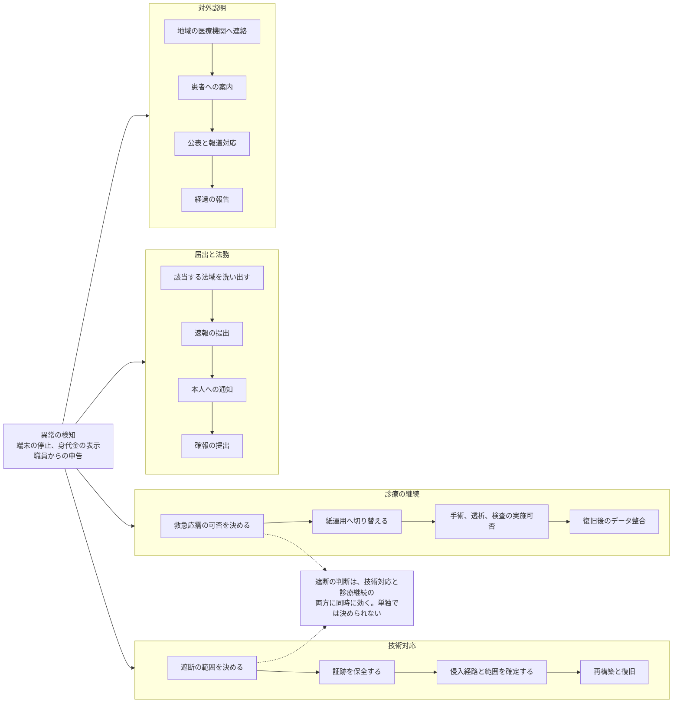

# 🚑 インシデント対応と事業継続

侵害が起きたあとを扱う。
初動の判断、診療を続けるための運用、法令上の届出、復旧の順序を整理する。

## この群で扱うこと

| 主題 | 内容 |
|---|---|
| 初動の判断 | ネットワーク遮断を誰が、どの情報で、何分以内に決めるか。外部支援を呼ぶ基準 |
| ダウンタイム運用 | 電子カルテが止まった状態で診療を続ける手順。紙運用への切り替えと、復旧後のデータ整合 |
| 復旧の優先順位 | 救急応需、手術、透析、検査、薬剤という診療の緊急度に沿った復旧順序 |
| 届出の義務 | 個人情報保護委員会、厚生労働省と自治体、海外事業がある場合の各法域。期限が異なるため時間軸で並べる |
| 身代金の判断 | 支払いを検討する場合の法的論点と、交渉を外部に委ねるときの契約 |
| 訓練 | 机上訓練のシナリオ。医療に固有の分岐を含める |
| 対外的な説明 | 患者、地域の医療機関、報道への説明。何を、いつ、どこまで出すか |

## 一覧

- [サイバー攻撃を想定した BCP](bcp-cyber.md)：災害の BCP との違い、国が示した確認表とひな形、一般企業の BCP との差、攻撃者から見た計画の弱点
- [基盤の構えと、外部への依存](dependencies.md)：可用性の責任分界、オンプレミスと単一クラウドと複数クラウド、委託先と共通基盤と AI サービスの停止

残りの主題は順次追加する。

## 同時に走る四つの流れ

医療機関のインシデント対応が一般企業と違うのは、技術的な封じ込めと並行して、診療そのものを続けなければならない点にある。
四つの流れは互いに待ち合わせず、別々の判断者が同時に動く。

**分析**：この四つのうち、平時に決めておかないと有事に決まらないのは「誰が遮断を決めるか」である。
遮断は感染の拡大を止める一方で、電子カルテの参照も同時に止める。
情報システム部門だけでも、診療部門だけでも判断できないため、両者の上に立つ役割を先に定義しておく必要がある（[経営とガバナンス](../governance/)）。

判断の余地がどれだけあるかは、平時の構成で決まっている。
ゾーン単位で切れる構成なら、止める範囲を選べる。
切れない構成では、初動の遮断が全停止と同義になる（[ネットワークの分離](../technology/segmentation.md)）。

## 事例集との違い

[インシデント事例集](../threats/incidents/) は、公表された事案の記録である。
この群は、自組織で同じ事態が起きたときに使う手順を扱う。
記録から手順を導くときは、公表資料に書かれた復旧経過と、そこで実際に決めた人を読む。

## 医療に固有の制約

復旧の順序を決める軸が二つあり、一致しない。
診療の緊急度で決まる重要度と、技術的な依存関係で決まる復旧優先度である。
救急の受入可否や透析の実施可否は重要度の側で決まるが、認証基盤とネットワークが戻らなければ、その上の業務システムは戻せない。
厚生労働省の手引きも、この二つを別の語で区別している（[サイバー攻撃を想定した BCP](bcp-cyber.md)）。

また、届出の期限は根拠法ごとに分かれており、患者への通知、行政への報告、取引先への連絡が並行する。
どの窓口に何時間以内かを一枚に整理しておかないと、初動の混乱の中で期限を逸しやすい。

判断の主体と権限は [経営とガバナンス](../governance/)、想定する攻撃者の挙動は [脅威アクターと TTPs](../threats/actors/)、事前に手を打つ順序は [防御プレイブック](../threats/actors/defense-playbook.md) に対応する。

> [!NOTE]
> 本リポジトリは公開リポジトリである。
> 未公表のインシデント情報や、当事者が公表していない被害の詳細は扱わない。

---

[トップへ](../../README.md)
