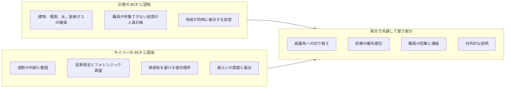
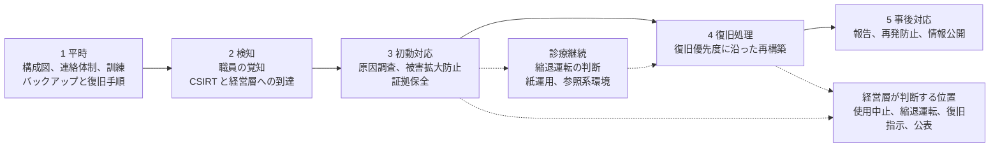
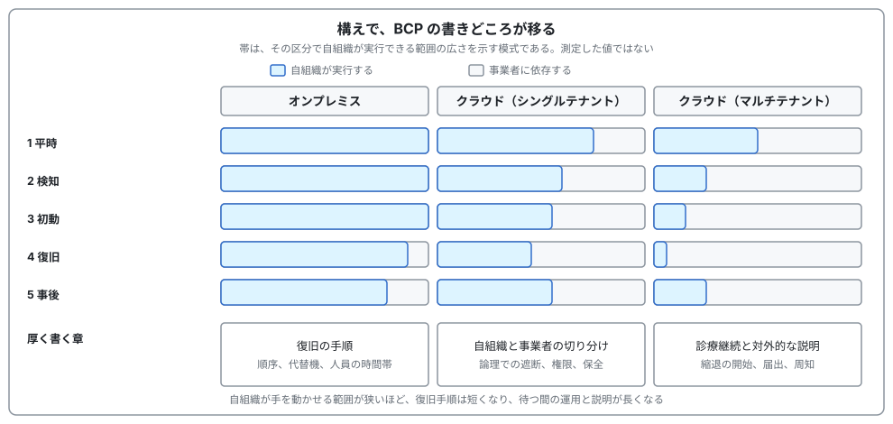
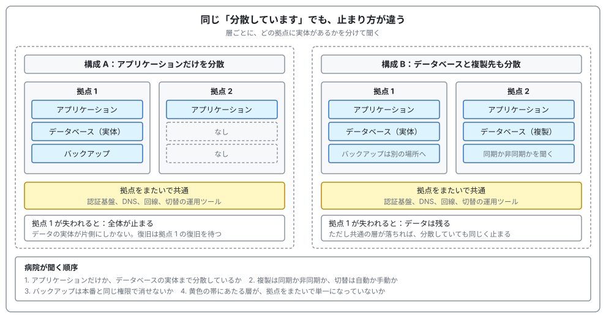
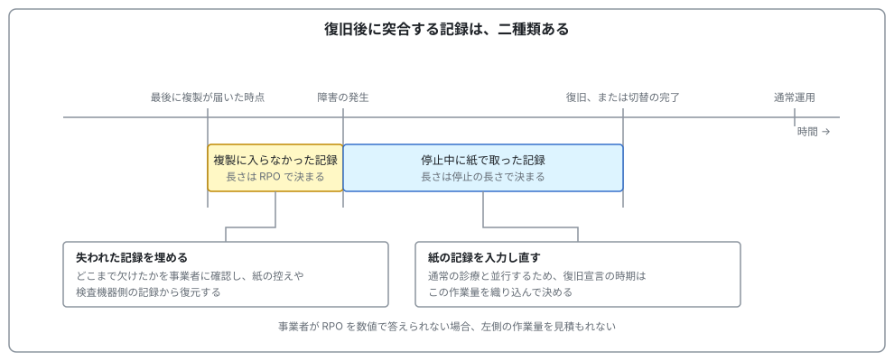

# 🛟 サイバー攻撃を想定した BCP

医療機関の事業継続計画は、長く自然災害を前提に整備されてきた。
そこにサイバー攻撃を追加すると、章の一つが増えるのではなく、計画が置いている前提のいくつかが反転する。
本ページは、何が反転して何が反転しないのかを整理し、国が示した枠組みと、攻撃者から見たときに計画のどこが狙われるのかを扱う。

> [!NOTE]
> **表記ルール**：本ページでは、**事実**（一次情報で確認できる内容。出典を併記する）と、**分析**（筆者の解釈）を書き分ける。
> 出典は、当事者の公表資料、行政文書などの一次情報を優先して示す。

初動から復旧までの流れそのものは [インシデント対応と事業継続](README.md) に、基盤の構え方と責任分界は [基盤の構えと、外部への依存](dependencies.md) に置いている。

## 国は二つの BCP を別に整備している

**事実**：厚生労働省は、自然災害を対象とする「[医療施設の災害対応のための事業継続計画（BCP）](https://www.mhlw.go.jp/stf/seisakunitsuite/bunya/kenkou_iryou/kenkou/kekkaku-kansenshou/infulenza/kenkyu_00001.html)」を整備している。
災害拠点病院向けの手引きと、それ以外の医療機関向けの手引き、作成指針、チェックリストが公開されており、想定する事象は地震、津波、洪水、土砂災害、噴火災害等である。

**事実**：これとは別に、2024 年 6 月、サイバー攻撃を対象とする三つの資料が公開された。

| 資料 | 内容 |
|---|---|
| [サイバー攻撃を想定した事業継続計画（BCP）策定の確認表](https://www.mhlw.go.jp/content/10808000/001261299.pdf) | 五つの区分に分けた確認項目の一覧 |
| [確認表のための手引き](https://www.mhlw.go.jp/content/10808000/001261301.pdf) | 各確認項目の解説と、安全管理ガイドラインの該当箇所の対応づけ |
| [医療情報システム部門等における BCP のひな形](https://www.mhlw.go.jp/content/10808000/001261302.pdf) | 全四章の記入用テンプレート（[Word 版](https://www.mhlw.go.jp/content/10808000/001261303.docx)） |

**事実**：確認表の前書きによれば、厚生労働省は 2023 年度から、医療法に基づく立入検査の項目にサイバーセキュリティ対策を位置づけている。
検査時に確認する項目は「医療機関におけるサイバーセキュリティ対策チェックリスト」で示されており、そのチェックリストが BCP の策定を求めている。
確認表は、その BCP を作る際の参考資料として作成された（[国内のガイドライン、法規制](../guidelines/japan.md)）。

**事実**：ひな形の 1.3.2 は、想定する事象として診療情報の参照不能、入力不能、スタッフ間の連絡不能、情報機器と医療機器の操作不能などを挙げたうえで、「なお、自然災害、大規模停電等による電源喪失などの計画は別に定めるものとする」と明記している。

**事実**：確認表の前書きは、この資料を作成した理由として、過去に実際に発生したものとして次の三つを挙げている。
初動対応が十分に協議されておらず証拠保全が不十分となり被害範囲を特定できなかった事例、ネットワーク機器が院内のどこに配置されているか分からず原因究明に時間を要した事例、バックアップが適切に確保できておらず復旧が難航した事例である。

**分析**：三つとも、攻撃を受けたこと自体ではなく、受けたあとに動けなかったことを指している。
国が BCP を別建てにしたのは、防御の失敗ではなく復旧の失敗が診療の停止時間を決めていたためである。

## 反転するもの、しないもの

災害とサイバーで前提がどう入れ替わるかを並べる。

| 軸 | 自然災害 | サイバー攻撃 |
|---|---|---|
| 発災の認知 | 明確。揺れた、浸水した | 曖昧。侵入は数週間前、認知は端末が動かなくなった朝 |
| 被害範囲の確定 | 目視で数時間 | 調査に数週間から数か月 |
| バックアップ | 健全である前提で計画できる | 健全性そのものを確認するところから始まる |
| 復旧の速さ | 速いほどよい | 急ぐと再感染する。速さと安全が対立する |
| 終息の判定 | 揺れが止まれば発災は終わる | 攻撃者が残っていないことは証明しにくい |
| 周囲の状況 | 地域が同時に被災し、支援が届きにくい | 周囲の医療機関は動いており、患者を渡せる |
| 相手 | いない | いる。復旧を観測し、交渉と公表の時期を操作してくる |

反転の中身を、機構として三つに絞る。

**バックアップが被害の対象に含まれる。**
災害では、遠隔地に置いたデータは被災地の外にあるという理由で健全である。
サイバーでは、遠隔地にあってもネットワークで到達できる限り同じ資格情報で削除できるため、距離が保護にならない。
オフラインまたは書き換え不可の保管が要求されるのは、この違いによる。

**復旧の速さが安全と対立する。**
災害復旧では、早く戻すことが患者の利益に一致する。
サイバーでは、侵入経路を塞がないまま戻すと同じ経路で再度暗号化されるため、戻す前に経路の特定が要る。
確認表が初動対応（区分 3）と復旧処理（区分 4）を分け、復旧を経営層の指示を起点とする形にしているのは、この順序を崩さないためである。

**終わりを宣言する主体が変わる。**
災害では物理的な事象の終息が宣言の根拠になるが、サイバーでは調査の結果が根拠になる。
ひな形 3.5.2 は、システムが安全な状態で正常に稼働したことの確認を担当者が行い、通常運用への復旧を経営層が宣言する形をとっている。
技術的な確認と、診療を通常に戻す判断が、別の主体に分かれている。

一方で、反転しない部分がある。

**事実**：手引き 3-4 は、経営層が「診療を継続する観点で『医療施設の災害対応のための事業継続計画』も参考にしながら医療機関全体の事業継続計画を策定する」としている。
ひな形 3.4.1 も、インシデント対応中の診療継続について「紙カルテの運用等、自然災害時を想定した事業継続計画（もしくはシステムダウン時マニュアル等）に則り運用する」としている。

**分析**：診療を紙で続ける手順は、電子カルテが止まった原因が地震でも暗号化でも変わらない。
サイバー BCP は白紙から書き起こす文書ではなく、災害 BCP の診療継続の部分を再利用し、その上に遮断、証拠保全、再感染の防止を積む構造になる。
災害 BCP を持たない施設が先にサイバー BCP を書こうとすると、土台にあたる紙運用の記述が空欄のまま残りやすい。

## 確認表が定める五つの区分

**事実**：確認表は、確認項目を次の五つの大項目に分けている。

| 区分 | 定義された役割 | 主な項番 |
|---|---|---|
| 1 平時 | 非常時に備え、サイバーセキュリティの体制整備を行う | 情報機器の把握と全体構成図（1-1）、体制整備と情報収集（1-2） |
| 2 検知 | 障害が見受けられる場合に早期に報告し、異常内容の事実確認を行う | 報告先の把握（2-1）、異常の検知（2-2）、CSIRT と経営層の覚知（2-3） |
| 3 初動対応 | 被害拡大の防止と診療への影響の最小化 | 原因調査（3-1）、事業者への連絡（3-2）、被害拡大防止（3-3）、経営層への報告（3-4）、証拠保全（3-5）、外部機関への報告（3-6） |
| 4 復旧処理 | 復旧計画に基づき、事業者と協力して復旧する | 復旧指示（4-1）、事業者への依頼（4-2）、バックアップからの復旧（4-3）、結果の確認（4-4） |
| 5 事後対応 | 再発防止の検討、周知、実施を進める | 復旧結果と漏えい有無の報告（5-1）から情報公開の検討（5-6） |

区分 3 の内側で、技術的な対応と診療の継続が並走する。
ひな形は診療継続を独立した節（3.4）として置き、縮退運転または運転中止の判断を経営層に置いている。

**事実**：手引き 1-2 は、非常時の連絡体制の整備に際して「契約書やサービス・レベル合意書（SLA）により、非常時の責任分界点や役割分担について事業者等との明示的な合意内容を確認しておく」ことを求めている。
責任分界の扱いは [基盤の構えと、外部への依存](dependencies.md) で扱う。

## 一般企業の BCP と、病院の BCP で違うこと

同じ BCP という語を使っていても、決めるべき事項の重心が違う。

| 論点 | 一般企業 | 医療機関 |
|---|---|---|
| 守る対象 | 事業の継続と損失の抑制 | 患者の生命と安全。売上の停止より先に決めることがある |
| 需要の性質 | 受注を後ろ倒しにできる | 延期できる診療とできない診療が混在する。救急と分娩は当日 |
| 第一の代替手段 | 別システム、別拠点 | 紙。運用そのものが変わる |
| 停止の判断 | 業務上の判断 | 医療安全の判断。誤ったデータで動かすほうが危険なことがある |
| 当事者の範囲 | 情報システム部門と事業部門 | 全部署。看護、検査、放射線、薬剤、医事が同時に当事者になる |
| 需要の逃がし先 | 競合に流れると失注になる | 地域の他院に渡すことが正しい対応になる |
| 復旧の主導権 | 自社と主要ベンダ | 機器とシステムの多くがベンダ管理下にあり、自院だけでは動かせない |

医療に固有の論点を五つ取り出す。

**時間帯で許容できる停止が変わる。**
一般企業の RTO は業務ごとに一つ置けばよいが、病院では同じ業務でも時間帯で意味が変わる。
透析は中二日の間隔があるため翌日に振り替えられるが、当日の分娩と救急搬送は振り替えられない。
業務ごとの目標復旧時間に加えて、その業務が動いている時間帯を書いておかないと、夜間に発災したときも日中と同じ順序で復旧しようとすることになる。

**重要度と復旧優先度が一致しない。**

**事実**：手引き 4-1 は「ワークフローを意識してあらかじめ設定した医療情報システムの『復旧優先度』を基に復旧を行う」としたうえで、「復旧優先度は、診療継続を意識して定める『重要度』と異なる場合がある」と明記している。

**分析**：この二つを混同すると復旧計画が組めない。
重要度は診療の緊急度で決まり、救急応需、手術、透析、検査、薬剤の順に並ぶ。
復旧優先度は技術的な依存関係で決まり、認証基盤とネットワークが先に戻らなければ、その上の業務システムは戻せない。
BCP には両方を書き、重要度の高い業務を早く戻すために、どの基盤を先に戻す必要があるかの対応を示す。

**紙運用は、戻すときに負債になる。**

**事実**：ひな形 2.1.5 は、業務内容に対する代替手段の例として、電子カルテは紙運用、オーダリングはカーボンコピーによる紙運用、PACS は撮影機器のワークステーションでの画像閲覧、医事会計は未収扱いの検討を挙げている。

**事実**：ひな形 3.5.1 は、復旧作業に際して「システム停止中に生じたアナログ情報についてシステムに反映させる選択肢を提示する」とし、反映の時期と程度を、医療安全に照らして経営層が意思決定するとしている。

**分析**：紙運用の期間が長いほど、復旧後に入力すべき記録が積み上がる。
停止が数週間に及べば、システムが戻ったあとも、通常の診療と並行して遡及入力を続ける期間が生じる。
訓練で紙運用の切り替えだけを試して、戻すときの入力量を見積もっていないと、復旧宣言の時期を誤る。

**請求には期限があり、遅れは資金繰りに出る。**

**事実**：保険医療機関は、1 か月分の診療報酬明細書（レセプト）を診療月の翌月 10 日までに審査支払機関へ提出する（療養の給付及び公費負担医療に関する費用の請求に関する命令 第 2 条第 1 項）。
支払基金は、医療機関への振込を診療月の翌々月の原則 21 日までとしている。
請求権の消滅時効は、令和 2 年 4 月診療分から原則 5 年で、起算日は診療月の翌月 1 日とされている。

**出典**：[e-Gov 法令検索](https://laws.e-gov.go.jp/law/351M50000100036)、[社会保険診療報酬支払基金 診療報酬の審査・支払業務の流れ](https://www.ssk.or.jp/smph/shinryohoshu/gyomuflow/index.html)、[同 請求支払に関する Q&A](https://www.ssk.or.jp/goshitsumon/goshitsumon_04.html)

**分析**：ひな形が挙げる「医事会計は未収扱いの検討」は、患者からの窓口負担の話である。
保険者へ請求する側の期限はこれとは別に立っており、窓口での未収扱いでは埋まらない。
紙運用の様式に、後から請求へ変換できる項目を含めておかないと、遡及入力の段になって請求の根拠を作れない範囲が残る。
締めた月の医事会計データを業務ドメインの外に書き出しておけば、電子カルテの復旧を待たずに請求だけは出せる（[インシデントの費用](../governance/cost.md#支出と入金の時期がずれる)、[連鎖するランサムウェア攻撃](../threats/actors/ransomware-chain.md#診療報酬の請求サイクル)）。

**判断者が診療側と情報システム側にまたがる。**
ネットワークの遮断は感染の拡大を止める一方で、電子カルテの参照も同時に止める。
どちらの部門も単独では決められないため、両者の上に立つ役割を平時に決めておく必要がある。
ひな形が縮退運転の判断を経営層に置いているのは、この構造による（[経営とガバナンス](../governance/)）。

## 攻撃者から見た BCP

ランサムウェアの実行に先立って攻撃者が行うのは、多くの場合、復旧能力の破壊である。
BCP に書かれた手段は、そのまま優先的な攻撃対象になる。

| 攻撃者の行動 | 無効化される BCP の記述 |
|---|---|
| バックアップサーバとカタログの削除 | 「バックアップから復旧する」 |
| 仮想化基盤の直接暗号化 | 「業務ごとに順に復旧する」 |
| ディレクトリサービスの破壊 | 「職員が端末にログインして作業する」 |
| 監視とログ基盤の停止 | 「範囲を特定してから戻す」 |
| 社内メールとチャットの停止 | 「連絡体制図に沿って招集する」 |
| ファイルサーバの暗号化 | 「復旧手順書に従う」 |

**事実**：国内の公表事例では、バックアップが被害を受け復旧が難航したことが報告されている（[つるぎ町立半田病院](../threats/incidents/japan/2021-timeline.md#JP-2021-01)、[大阪急性期・総合医療センター](../threats/incidents/japan/2022-timeline.md#JP-2022-01)）。

**事実**：ひな形 3.3.2 は、被害拡大防止の手順を「まずは、バックアップに通ずるネットワークの遮断を行う。次に、外部の通信経路を遮断する」と、順序を指定して記述している。

**分析**：外部との通信より先にバックアップへの経路を切る順序は、攻撃者が復旧能力から潰すという前提に立っている。
一般的な封じ込めの手順が外部通信の遮断から始まるのに対し、この順序は復旧可能性を守ることを優先している。

### 計画の仮定を壊して読む

自組織の BCP を攻撃者の側から読むと、記述の一つずつが仮定の集合として見える。
仮定を壊す質問の形にすると、演習の設計に使える。

| 計画の記述 | 壊す質問 |
|---|---|
| バックアップから復旧する | バックアップサーバは本番と同じ認証基盤に参加していないか。一つの管理者権限で両方消せないか |
| 復旧手順書に従う | その手順書は暗号化される側のファイルサーバにないか。紙またはオフラインで持っているか |
| 連絡体制図に沿って招集する | 連絡先は認証基盤と社内メールにしかないのではないか |
| ベンダに連絡する | 契約書と緊急連絡先はどこにあるか。夜間休日をカバーする契約か。そのベンダ自身が同時に被害を受けている場合はどうするか |
| 紙運用に切り替える | 帳票の原本は電子ファイルとしてサーバにないか。プリンタはネットワーク認証で動いていないか |
| 参照系環境を構築する | 構築に必要な機器と用紙は在庫にあるか。手引き 3-4 はプリンタ、印刷用紙、トナーの準備まで例示している |
| 遮断を判断する | 判断者の端末とメールが使えない場合の代行者は、氏名で決まっているか |

**分析**：これらはいずれも、平時の運用が便利であるほど成立しにくくなる。
バックアップを同じ認証基盤に載せ、手順書を共有フォルダに置き、連絡先をディレクトリで一元管理する設計は、日常の運用としては正しい。
BCP の点検は、その正しさが有事に反転する箇所を探す作業になる。

## 発災の種類で何が変わるか

原因の違いは、初動の判断と対外的な説明の両方を変える。

| 類型 | 予兆 | 範囲の確定 | データの信頼性 | 復旧の主導権 | 周囲の状況 |
|---|---|---|---|---|---|
| 自然災害 | 警報がある | 数時間 | 保たれる | 自組織 | 同時に被災する |
| 設備障害（電源、空調、回線） | 一部あり | 数時間 | 保たれる | 自組織と設備事業者 | 無事 |
| 高温、蓄電池の発火 | 気温は予報で分かる。発火は予兆が出ないことがある | 数時間から数日 | 保たれる。ただし急な停止で不整合が残る | 自組織と設備事業者 | 無事 |
| クラウド、SaaS の障害 | ない | 自組織では確定できない | 保たれる | 事業者 | 同じ事業者の利用者に同時に及ぶ |
| ランサムウェア | 事後に判明する | 数週間 | 失われる | 自組織。ただし調査が先行する | 無事。転送先がある |
| 委託先、ベンダ経由の侵害 | ない | 数か月に及ぶことがある | 疑わしい | 委託先と自組織 | 同じベンダの顧客に同時に及ぶ |
| 内部の不正、誤操作 | ない | 数日 | 部分的に失われる | 自組織 | 無事 |

**分析**：この表から、BCP の記述を変えるべき箇所が四つ出る。

自然災害では周囲も被災するため自力で耐える計画になるが、サイバーでは周囲の医療機関が動いている。
患者を地域に渡す判断は、災害時より早い段階から広く使える。
地域の医療機関との相互支援の取り決めは、災害対策として整備されていることが多いが、サイバー被害を発動事由に含めているかは別に確認する（[ランサムウェアの連鎖](../threats/actors/ransomware-chain.md)）。

クラウド事業者の障害と委託先の侵害では、自組織に復旧の手段がない。
この二つに対して BCP に書けるのは復旧手順ではなく、縮退運用の開始基準と、待つ間の対外的な説明である。

委託先経由の侵害だけは、復旧を依頼する相手が同時に被害を受けている。
地震であれば被災していない地域のベンダが応援に入れるが、ベンダ自身の侵害では代替が効かない。

そして、高温と蓄電池の発火は、リスク管理の枠組みから抜けやすい。

**事実**：ロンドンの Guy's and St Thomas' NHS Foundation Trust は、2022 年 7 月 19 日の記録的な高温で二つのデータセンターが同時に障害を起こし、371 のシステムが停止して紙運用へ移行した。
同 Trust の内部監査が複数の NHS 組織のリスク登録簿を確認したところ、空調の喪失や極端な高温に関するリスクを記載していた組織はなく、いずれもサイバーセキュリティを IT の主要リスクとして挙げていた（[GL-2022-S01](../threats/incidents/global/2022-timeline.md#GL-2022-S01)）。

**分析**：診療が止まる原因の順位づけと、リスク登録簿に載っている項目の順位づけがずれている。
サイバー攻撃を想定した BCP を整備する過程で、設備と気象を起点とする停止が相対的に軽く扱われると、同じ「電子カルテが数週間使えない」状態に別の経路で到達する。
要因ごとの詳細は [基盤の構えと、外部への依存](dependencies.md#熱と発火という攻撃ではない停止要因) に整理している。

## 基盤の構えで、BCP に書く内容が変わる

確認表の五つの区分は、基盤の構えを問わず同じである。
変わるのは、各区分に何を書けるかである。
自組織が手を動かせる範囲が狭いほど、復旧手順の記述は短くなり、待つ間の運用と対外的な説明の記述が長くなる。

構えは、[基盤の構えと、外部への依存](dependencies.md#三つの構えで止まり方が変わる) と同じ三つを使う。
オンプレミス、クラウド（シングルテナント。一つの基盤に自院だけが載る）、クラウド（マルチテナント。一つの基盤に複数の医療機関が載る）である。
止まり方そのものは向こうに整理しており、ここでは計画の書き方だけを扱う。

| 区分 | オンプレミス | クラウド（シングルテナント） | クラウド（マルチテナント） |
|---|---|---|---|
| 1 平時 | 構成図、機器の物理配置、代替機の調達先 | 責任分界の確認、管理面の権限の棚卸し、別アカウントへの複製 | 定期エクスポートの取得と保管、参照系、契約で取れるログ |
| 2 検知 | 自組織の監視から入る | 自組織の監視と、事業者の障害通知の両方 | 職員の「使えない」という報告と、事業者の告知 |
| 3 初動 | 物理と論理の両方で遮断できる | 論理でのみ遮断する。操作権限を持つ人を決める | 遮断の手段がない。利用停止と縮退運用の開始を判断する |
| 4 復旧 | 自組織が順序を決めて実施する | 自組織が動かす層と、事業者を待つ層を分けて書く | 復旧手順は書けない。待つ間の運用を書く |
| 5 事後 | 手元のログで範囲を特定する | 事業者から出るログを合わせて特定する | 事業者の調査結果を待つ。届出の期限に間に合わない場合の書き方を決める |

**分析**：この表の右へ行くほど、BCP は「どう戻すか」の文書から「戻るまでどう診療を続け、何をいつ誰に伝えるか」の文書に変わる。
どちらが正しいという話ではなく、書くべき章の厚みが移動する。
マルチテナントの SaaS を使いながら復旧手順を厚く書いた BCP は、有事に開いても実行できる項目がない。

### オンプレミス：復旧の実作業まで自組織で書く

この構えでは、確認表の区分 4 に実際の作業手順を書ける。
同時に、書いた手順が動く前提もすべて自組織側にあるため、前提の点検も自組織の責任になる。

**平時（区分 1）に書くこと**

- 構成図が実物と一致していること。確認表がこの項目を置いた背景には、ネットワーク機器が院内のどこに配置されているか分からず原因究明に時間を要した事例がある
- バックアップの世代、保管場所、オフラインまたは書き換え不可の方式、復元試験を実施した日付
- 代替機の調達先とリードタイム。推定ではなく、見積りまたは過去の実績で書く
- 夜間休日に人を出せる保守契約になっているか

**初動（区分 3）**：ひな形 3.3.2 の「まずはバックアップに通ずるネットワークの遮断、次に外部の通信経路の遮断」という順序が、最も直接に効くのがこの構えである。
物理的に経路を切れる強みがある一方、切る人が現場にいることが前提になる。
夜間と休日に、誰が院内に入り、どの機器のどのケーブルを抜くかまで書いておく。

**復旧（区分 4）**：復旧の順序を自組織で決められる。
認証基盤とネットワークを戻さなければ業務システムを戻せないという依存関係を、重要度の順序とは別に書く。
併せて、クリーンな再構築先をどこに作るかを平時に決めておく。
汚染された可能性のある基盤の上に戻すと、経路を塞ぐ前に再度暗号化される。

**分析**：この構えの制約は人員である。
復旧の速さは作業できる人数と時間帯で決まるため、BCP に書く目標復旧時間は、その人数で裏づけられる値にする。
裏づけのない数値を書くと、有事に計画そのものが参照されなくなる。

### クラウド（シングルテナント）：自組織が動かす層と、事業者を待つ層を分けて書く

自院だけが載る専用の環境であるため、複製と保全は自組織で取れる。
一方、仮想化基盤から下は事業者の復旧を待つ。
区分 4 の各項目に「自組織」「事業者」「両者」の別を付けると、有事に議論せずに済む。

**平時（区分 1）に書くこと**

- 責任分界の書面での確認。手引き 1-2 は、SLA により非常時の責任分界点と役割分担を確認しておくことを求めている
- 管理面の権限の棚卸し。誰が資源とスナップショットを削除できるかを一覧にする
- バックアップを本番と別のアカウントに置くこと。事業者の管理境界の外側にも一つ持つこと
- 復旧先を、本番と同じアカウントの外に用意しておくこと

**初動（区分 3）**：遮断が物理から論理の操作に変わる。
経路の切断、鍵の失効、セッションの無効化、権限の剥奪を、誰が実行するかを名前で決めておく。
その人が不在のときの代行者と、管理コンソールに入れない場合の手順も併せて書く。
管理者アカウントを奪われた場合、多要素認証の端末が使えない場合が、実際に起きる形である。

**証拠保全（区分 3-5）**：スナップショットの取得を初動の手順に入れる。
攻撃者に削除される前で、かつ自組織が復旧のために上書きする前という、二重に狭い時間帯にある作業になる。
取得の判断者と、保存先（本番と別のアカウント）を先に決めておく。

**分析**：この構えに固有のシナリオは、アカウントごと使えなくなる状態である。
管理面の資格情報の奪取、支払いの停止、規約違反の検知のいずれでも起こる。
この状態では、その事業者の中にある手段はバックアップも管理コンソールも含めてすべて使えない。
演習の開始条件に一度入れておくと、復旧計画が同じアカウントの中で完結していないかを確かめられる。

### クラウド（マルチテナント）：復旧手順ではなく、待つ間の計画を書く

この構えで復旧手順を書こうとすると、大半が空欄になる。
自組織に操作の余地がないためであり、記述が薄いこと自体は誤りではない。
厚く書くべき章が、区分 3 の診療継続と区分 5 の対外的な説明に移る。

**平時（区分 1）に書くこと**

- 定期エクスポートの取得と保管。実際に読める状態かを、年に一度は実物で確認する
- 参照専用の縮退系。直近の処方、アレルギー、検査結果、退院サマリを読み取り専用で持つ
- 契約で取得できるログの種類と保存期間、侵害と障害の通知義務、証拠保全を依頼できる窓口と依頼できる範囲
- 事業者の障害告知をどこで受け取るか。告知の経路が自組織のメールに依存していないか

**検知（区分 2）**：最初の情報が、職員の「使えない」という報告になる。
自組織の障害か事業者の障害かを切り分ける手順を、報告を受けた直後の一段目に置く。
別回線と別端末からの到達確認、事業者の告知の確認までを含める。

**初動（区分 3）**：遮断という手段がない。
決めるのは、そのサービスの利用を止めるか、縮退運用をいつ始めるかである。
原因が確定する前に縮退を始める判断者を、平時に名前で決めておく。

**復旧（区分 4）**：復旧の見込みが「調査中」としか示されない時間が続く前提で書く。
事業者から情報を取りに行く頻度、職員への周知の頻度、患者と地域の医療機関への説明の内容を、時間の単位で決めておく。
復旧したあとには、停止中に紙で取った記録を戻す作業が残る（ひな形 3.5.1）。

**事後（区分 5）**：漏えいの範囲の特定が、事業者の調査結果に依存する。
個人情報保護委員会への報告は、速報が発覚からおおむね 3 日から 5 日以内、確報が 30 日以内（不正の目的をもって行われたおそれがある行為による場合は 60 日以内）である（[国内のガイドライン、法規制](../guidelines/japan.md)）。

**分析**：事業者の調査がこの期限より遅れることは十分に起こる。
届出の義務は医療機関に残るため、判明している範囲で報告し、確定した時点で更新する書き方を平時に決めておく。
「事業者の報告を待って提出する」という運用は、期限の側と両立しない。

**分析**：もう一つ、この構えでは代替の逃がし先が同時に失われることがある。
近隣の医療機関が同じサービスを使っていれば、患者を渡す相手も同じ時刻に止まっている。
地域の相互支援の取り決めを結んでいる相手がどの電子カルテを使っているかは、平時に確認できる項目である（[ランサムウェアの連鎖](../threats/actors/ransomware-chain.md)）。

### 導入済みのクラウドに、分散の中身を確かめる

医療機関は、その SaaS が何拠点に載っているかを選べない。
選べないが、確かめて BCP に書くことはできる。
どれだけ分散しているかで、縮退運用が数時間で終わるのか数日続くのかが変わり、参照系にいくら投じるべきかが変わるためである。

**分析**：確かめるときに最初に必要なのは、「分散しているか」を一つの質問にしないことである。
「マルチ AZ 対応」という説明は、多くの場合ウェブとアプリケーションの層を指している。
その下でデータベースが単一の拠点にあり、そこが落ちれば全体が止まる構成は成立する。
層ごとに分けて聞く。

| 層 | 病院が聞くこと | この答えが変える BCP の記述 |
|---|---|---|
| ウェブ、アプリケーション | 何拠点で動いているか。一拠点が落ちたとき、利用者側の操作は要るか | 縮退運用を始めるまでの猶予 |
| データベース | 実体はいくつの拠点にあるか。複製は同期か非同期か。切替は自動か手動か | 切替で欠ける記録の範囲。紙との突合の量 |
| バックアップ | 本番と別の拠点にあるか。本番と同じ権限で消せないか。世代と保存期間 | 全損したときに、どこまで戻せるか |
| 管理面、運用ツール | 事業者が切替を操作する仕組みは、どの拠点にあるか | 拠点が分かれていても切り替わらない事象への備え |
| 認証基盤、DNS、回線 | 拠点をまたいで共通か | 分散していても全体が止まる経路の有無 |

**分析**：この表の下二行が、実務では抜けやすい。

**事実**：韓国 SK C&C のデータセンター火災の調査結果では、運用と管理のツールを他のデータセンターに二重化していなかった事業者において、稼働系が動作不能になった時点で復旧が遅れたことが示されている（[基盤の構えと、外部への依存](dependencies.md#蓄電池が発火の起点になる)）。

**報道ベース**：国内では、2025 年 11 月 15 日のクラウド型電子カルテの障害について、原因が計算資源ではなくデータセンターと医療機関を結ぶ回線の高負荷にあったと最終報告で説明されている（[事業者側で起きた事象](../technology/cloud/README.md#事業者側で起きた事象)）。

**分析**：拠点が分散していても、切り替える道具と、そこへ至る経路が単一なら、分散は診療に効かない。
分散の程度と、それが耐えられる事象の対応は [事業者は、いくつのデータセンターに載せているか](dependencies.md#事業者はいくつのデータセンターに載せているか) に整理している。

**分析**：データベースの複製の方式は、そのまま病院側の作業量になる。
同期であれば切替の時点で記録は欠けないが、非同期であれば直近の数分から数時間が失われる。
その範囲は、停止中に紙で取った記録とは別に、復旧後に突合しなければならない。
BCP の復旧の節には、紙から入力する分と、切替で欠けた分の二つを分けて書く。
事業者が RPO を数値で答えられない場合、この作業量を見積もれないことになる。

**分析**：複数の SaaS を使っている施設では、棚卸しの単位を契約ではなく載っている基盤に置く。
電子カルテ、予約、Web 問診、オンライン診療、検査の受託システムを別々の事業者と契約していても、その全部が同じクラウド事業者の同じ地域に載っていることがある。
事業者を分けたつもりで、一つの地域の障害で同時に止まる形である。
[依存の逆引き表](dependencies.md#依存の逆引き表) には、どのクラウド事業者のどの地域に載っているかを書く列を置いてある。
この列を埋めると、重なりが見える。

**答えが得られないとき**

**分析**：導入済みのサービスでは、聞ける相手が販売の窓口しかなく、技術的な構成は開示されないことが多い。
その場合に取れる手は三つある。

- 第三者の評価資料から読み取る。三省二ガイドラインへの対応を説明した資料や、医療機関向けのセキュリティリファレンスに、構成の範囲が書かれていることがある（[選定と契約で確認する項目](../technology/cloud/README.md#選定と契約で確認する項目)）
- 過去の障害の告知を読む。復旧までに要した時間と、事業者の説明の粒度が、構成と運用の実態を示す
- 答えが得られない項目は「不明」と BCP に明記し、その分だけ手元の備えを厚くする。参照系と定期エクスポートは、事業者の構成が分からなくても自組織だけで用意できる

**分析**：三つ目が、この節の結論になる。
分散の中身を確かめる目的は、事業者を評価することではなく、自組織が持つべき備えの量を決めることである。
拠点の数を答えられない事業者に載っている場合、縮退運用の想定を長く取り、参照系を持つ判断が優先される。
確認は、契約の更新時期に合わせて年に一度行う項目として、平時（区分 1）の点検表に入れておく。

### 構えを問わず変わらない部分

紙運用への切り替え、診療の優先順位、職員の招集、患者と地域への説明は、原因も構えも問わず同じ手順が使える。
ここは災害 BCP から再利用する部分であり、構えごとに書き分ける必要がない。

構えを問わず必ず点検するのは、次の三つである。

| 点検する項目 | 確認すること |
|---|---|
| 判断のあとの連絡手段 | 遮断または利用停止を決めた本人が、その決定を伝えられるか。判断と伝達が同じ経路に載っていないか |
| 手順書の置き場所 | 手順書、構成図、契約書、緊急連絡先が、止まる側のシステムの中だけに存在していないか |
| 紙から戻す作業 | 停止が長引いたときの遡及入力の量を見積もっているか。復旧宣言の時期がその作業を織り込んでいるか |

## 訓練の開始条件

**事実**：確認表 1-2 は教育訓練の実施を確認項目に含め、ひな形 2.2.3 は年間の教育計画に沿った訓練の実施と、訓練で見つかった課題の改善計画の立案を定めている。

**分析**：訓練の質は、開始条件をどこに置くかでほぼ決まる。
「電子カルテが止まりました」から始めると、参加者は復旧手順の確認に向かう。
攻撃者が復旧能力から潰すという前提を訓練に反映するには、その手段が使えない状態を開始条件に含める。

> 月末の月曜 6 時 30 分。夜勤の看護師から電子カルテが開かないと連絡が入る。
> 情報システム担当が出勤すると、仮想化基盤の管理画面に身代金の表示がある。
> ディレクトリサービスが応答せず、院内のメールとチャットが使えない。
> バックアップサーバの管理画面にも到達できない。
> 電子カルテベンダの緊急窓口は 9 時開始で、担当者の携帯番号を知っている職員は休暇中である。
> 8 時 30 分から外来受付、9 時から予定手術が三件、10 時から透析が 40 名。
> 7 時 10 分に救急隊から受入照会の予定がある。

分岐として、少なくとも次を含める。

- 救急の受入を断るか。断る場合、誰が、どこに、いつ連絡するか
- 予定手術を中止するか。麻酔科と外科のどちらが決めるか
- 透析を、前回の設定条件を参照できない状態で実施できるか
- ネットワークを全遮断すると、遮断を判断した本人の連絡手段も同時に失われる。どうするか
- 情報公開をいつ、どの範囲で行うか。ひな形 4.3 は、被害が発生した可能性が高い段階から迅速に行い、複数回の更新で確度を高める形をとっている
- 締め前の医事会計データが戻らない場合、当月分の診療報酬をどう請求するか。翌月 10 日の期限までに間に合わないとき、資金の手当てを誰が動かすか

同じ演習は、開始条件を高温に差し替えても成立する。
猛暑日にサーバ室の空調が停止し、機器を守るために自ら電源を落とす判断から始める形である。
以降の分岐は、救急、手術、透析、紙運用、対外的な説明のいずれも変わらない。
紙運用の手順を一度作れば、原因を問わず使えるのはこのためである。

上の筋書きは、オンプレミスを前提にしている。
クラウドに載せている施設では、開始条件を構えに合わせて置き換える。

| 構え | 開始条件の例 | この演習で確かめること |
|---|---|---|
| オンプレミス | 仮想化基盤に身代金の表示。ディレクトリサービスとバックアップサーバに到達できない | 手順書がオフラインにあるか。夜間に機器を触れる人がいるか |
| クラウド（シングルテナント） | 管理コンソールにログインできない。事業者からアカウントの停止を通知された | 復旧の手段が同じアカウントの中だけで完結していないか |
| クラウド（マルチテナント） | 事業者から障害の告知。復旧の見込みは「調査中」のまま 6 時間が経過している | 縮退運用をいつ始めるか。近隣の医療機関が同じサービスを使っていないか |

**分析**：クラウドの二つでは、演習の焦点が復旧作業から判断と伝達に移る。
参加者に技術的な作業がないぶん、開始から何分で縮退運用を決めたか、患者と地域に何を伝えたかが、そのまま評価の対象になる。

**分析**：この種の演習で最も詰まるのは、遮断を決めたあとの連絡手段である。
遮断の判断と、判断を伝える経路が同じネットワークに載っている構成では、決めた瞬間に伝達ができなくなる。
連絡手段の冗長化は、機器の冗長化より安く、有事の効果が大きい。

## 出典

### 国の資料（サイバー攻撃を対象とするもの）

- [サイバー攻撃を想定した事業継続計画（BCP）策定の確認表](https://www.mhlw.go.jp/content/10808000/001261299.pdf)（厚生労働省、2024 年 6 月）
- [サイバー攻撃を想定した事業継続計画（BCP）策定の確認表のための手引き](https://www.mhlw.go.jp/content/10808000/001261301.pdf)（厚生労働省）
- [医療情報システム部門等における BCP のひな形](https://www.mhlw.go.jp/content/10808000/001261302.pdf)（厚生労働省、[Word 版](https://www.mhlw.go.jp/content/10808000/001261303.docx)）
- [令和 8 年度版 医療機関・薬局におけるサイバーセキュリティ対策チェックリスト](https://www.mhlw.go.jp/content/10808000/001716185.pdf)（厚生労働省、医療機関・薬局確認用）
- [令和 8 年度版 医療機関・薬局におけるサイバーセキュリティ対策チェックリストマニュアル](https://www.mhlw.go.jp/content/10808000/001716186.pdf)（厚生労働省）

### 国の資料（自然災害を対象とするもの）

- [医療施設の災害対応のための事業継続計画（BCP）](https://www.mhlw.go.jp/stf/seisakunitsuite/bunya/kenkou_iryou/kenkou/kekkaku-kansenshou/infulenza/kenkyu_00001.html)（厚生労働省）

### 関連ページ

- [インシデント対応と事業継続](README.md)：侵害後に並走する四つの流れ
- [基盤の構えと、外部への依存](dependencies.md)：三つの構えの止まり方、データセンターの分散、供給網と AI サービス
- [調査データから読む、備えの穴](../governance/readiness-gaps.md)：BCP 策定率と、そこから読める弱点
- [医療機関で連鎖するランサムウェア攻撃](../threats/actors/ransomware-chain.md)：地域への波及と相互支援
- [GL-2022-S01 Guy's and St Thomas'](../threats/incidents/global/2022-timeline.md#GL-2022-S01)：攻撃ではなく高温で診療が止まった事例
- [経営とガバナンス](../governance/)：判断の主体と権限の設計
- [国内のガイドライン、法規制](../guidelines/japan.md)：安全管理ガイドラインと立入検査

---

[トップへ](../../README.md)
