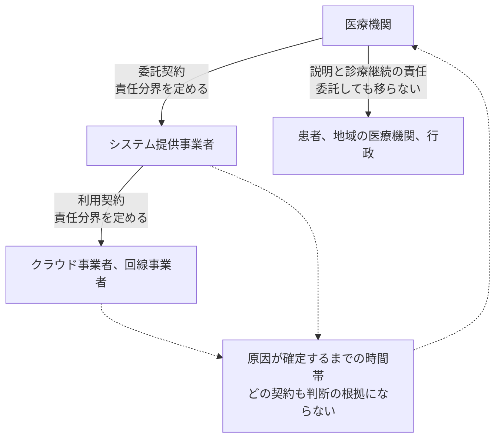
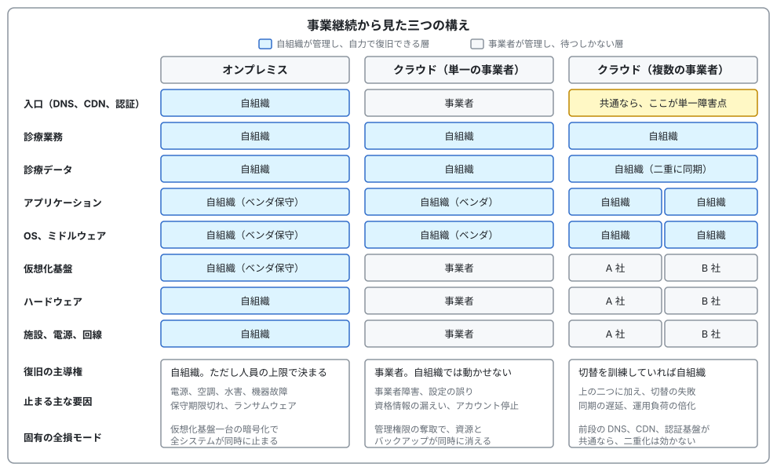

# 🔗 基盤の構えと、外部への依存

診療が止まる原因は、自組織の内側にあるとは限らない。
クラウド事業者の障害、委託先の侵害、共通基盤の停止、AI サービスの提供終了は、いずれも自組織の設定が正しくても起こる。
本ページは、システムをどこに置くかで止まり方がどう変わるか、止まったときに誰が何に責任を負うか、外部への依存をどう棚卸しするかを扱う。

> [!NOTE]
> **表記ルール**：本ページでは、**事実**（一次情報で確認できる内容。出典を併記する）、**報道ベース**（報道や第三者の集計のみで確認でき、当事者の公表資料では裏付けが取れていない内容）、**分析**（筆者の解釈）を書き分ける。
> 出典は、当事者の公表資料、行政文書などの一次情報を優先して示す。

計画そのものの書き方は [サイバー攻撃を想定した BCP](bcp-cyber.md)、クラウド上の医療システムが侵害される経路は [クラウド事業者と医療](../technology/cloud/) に置いている。

## 責任分界は二つに分かれる

医療情報システムの責任分界は、セキュリティの文脈と可用性の文脈で、線を引く位置が違う。

**セキュリティの責任分界**は、誰が権限を設計し、誰が脆弱性を塞ぎ、誰がログを保存するかを決める。
医療機関、システム提供事業者、クラウド事業者の三層に分かれ、事業者向けガイドラインが対象を定めている（[責任が三層に分かれる](../technology/cloud/README.md#責任が三層に分かれる)）。

**可用性と復旧の責任分界**は、止まったときに誰が動かし、誰が待つかを決める。
こちらは契約と運用の問題であり、上の三層とは一致しない。

**事実**：厚生労働省の[確認表のための手引き](https://www.mhlw.go.jp/content/10808000/001261301.pdf) 1-2 は、非常時の連絡体制の整備に際して「契約書やサービス・レベル合意書（SLA）により、非常時の責任分界点や役割分担について事業者等との明示的な合意内容を確認しておく」ことを求めている。

**事実**：[BCP のひな形](https://www.mhlw.go.jp/content/10808000/001261302.pdf) 2.1.6 は、脆弱性への対応について「契約等で定められた責任分界をもとに」情報収集を行い、対応プログラムを適用できない場合の代替手段を事業者と合意したうえで実施するとしている。

**分析**：どちらも、責任分界を平時に文書で確定させることを求めている。
確定させる意味は、有事に責任を追及するためではなく、有事に「これは誰の作業か」を議論せずに済ませるためである。

### SLA は賠償ではない

**分析**：SLA の可用性目標が未達だった場合に返ってくるのは、多くの場合、利用料のクレジットである。
診療が停止したことによる減収も、患者への説明にかかる費用も、その対象には入らない。
SLA は役務の品質に関する取り決めであり、損害賠償の予定ではないためである。
「稼働率 99.99% の SLA があるので大丈夫」という説明は、可用性の期待値の話をしているのであって、リスクを移転した話にはなっていない。
リスク移転の手段は保険と契約上の賠償条項であり、両者は別に確認する（[リスク移転](../governance/)）。

**分析**：可用性は、契約している事業者だけで決まるわけでもない。
クラウドの計算資源が動いていても、医療機関とデータセンターを結ぶ回線が詰まれば診療は止まる。
国内では、クラウド型電子カルテの障害の原因が回線の高負荷にあったと最終報告で説明された事例がある（[事業者側で起きた事象](../technology/cloud/README.md#事業者側で起きた事象)）。
契約の相手が一社でも、可用性を決める当事者は複数いる。

### 分界が定まらない時間帯がある

障害が起きてから原因が切り分けられるまでの間、責任の所在は決まらない。

**事実**：手引き 3-1 は、初動の原因調査として、サイバー攻撃の兆候があるか、医療情報システムのメンテナンス等の問題か、システム自体の問題か、LAN 設備やケーブルの問題か、設備の電源系統の問題か等を調査するとしている。
3-2 は、障害の前日等にメンテナンスやデータ移行の作業があったかを確認し、それが原因かを確かめるとしている。

**分析**：この確認項目の並びは、初動の段階では原因が特定できないことを前提にしている。
責任分界の取り決めは、事後の費用負担と契約交渉には効くが、この時間帯の判断には使えない。
したがって BCP に書くべきは分界の定義ではなく、原因が確定する前に誰が縮退運用の開始を決めるか、である。

**分析**：契約上の責任は一段ずつしか結ばれないが、患者と行政に対する説明の責任は医療機関に直行する。
この非対称のため、BCP の記述は「誰の責任か」ではなく「原因が誰であれ診療をどう続けるか」から始める必要がある。

もう一点、契約の実効性を確認しておく。
BCP に「事業者に問い合わせる」と書いてあっても、サポート契約の等級によっては応答が営業日単位になる。
夜間休日に人と話せる契約になっているかは、平時に確認できる項目である。

## 三つの構えで、止まり方が変わる

システムをどこに置くかで、止まる要因も、止まったときに自分で何ができるかも変わる。

### オンプレミス

止まる要因は、電源、空調、外気温の上昇、水害、ハードウェアの故障、保守期限切れ、そしてランサムウェアである。
サーバ室が地下にある施設では、浸水が現実的な要因に入る。
外気温と蓄電池については、後述の[熱と発火](#熱と発火という攻撃ではない停止要因)で扱う。

復旧の主導権は自組織にあるが、復旧の速さは自組織の人員の上限で決まる。
夜間に作業できる人がいなければ、朝まで止まる。

見落とされやすい強みが一つある。
インターネットや事業者側で何が起きても、院内で完結する処理は動き続ける。
広域の通信障害と事業者障害に対しては、三つの構えの中で最も強い。

弱みは二つある。
院内のネットワークが平坦だと侵入後の横展開が容易で、仮想化基盤が暗号化されると全システムが同時に止まる。
また、代替機の調達に時間がかかる。
BCP には、代替機の調達リードタイムを推定ではなく実測または見積りで書いておく。

### クラウド（単一の事業者）

止まる要因が入れ替わる。
事業者側で起きるリージョン、管理面、認証基盤の障害と、自組織の設定の誤り、資格情報の漏えい、支払いや規約違反の検知によるアカウントの停止である。

止まる頻度は下がるが、止まったときに自組織でできることがない。
復旧の見込みが「調査中」としか示されない時間が続くため、BCP には復旧手順ではなく、その間の縮退運用と対外的な説明を書く。

単一障害点は計算資源だけではない。
認証基盤、DNS、CDN、管理コンソールのいずれかが落ちれば、データが無事でも操作できない。

侵入経路も変わる。
VPN 装置の脆弱性ではなく、漏えいしたアクセスキー、権限の過剰な役割、CI/CD の設定、管理者アカウントの奪取が起点になる（[クラウド上の医療システムが侵害される経路](../technology/cloud/README.md#クラウド上の医療システムが侵害される経路)）。

この構えに固有の全損モードは、アカウント単位の消失である。
管理権限を奪われると、資源とスナップショットとバックアップを同じ権限で削除できる。
オンプレミスには、請求の停止でサーバが消えるという障害は存在しない。

**事実**：2024 年 5 月、オーストラリアの年金基金 UniSuper と Google Cloud は、設定の誤りが Private Cloud のサブスクリプション削除につながり、二つの地域に複製していた環境がいずれも削除されたことを共同声明で公表した。
復旧は別の事業者に置いていたバックアップによって行われた（[詳細](../technology/cloud/README.md#事業者側で起きた事象)）。

**分析**：この事例は、地理的な冗長化が同一事業者のアカウント配下で完結している場合に、アカウント単位の操作でその冗長性が無効になることを示している。
対策は二つに絞られる。
バックアップの削除権限を日常運用の権限から分離すること（別アカウント、多要素認証、書き換え不可の保管、削除の遅延）と、事業者の管理境界の外側に復旧手段を一つ持つことである。

### クラウド（複数の事業者）

複数の事業者に分散すれば片方が落ちても動く、という期待で選ばれることが多い。
実際に効く範囲は狭い。

**分析**：複数クラウドが効くのは、事業者起因の広域障害と、アカウント単位の全損の二つである。
侵害に対しては効かない。
攻撃者は共通の認証基盤を通って両方に入るため、認証を統合しているほど二重化の意味が薄れる。

そのうえで、増えるものがある。

| 増えるもの | 具体 |
|---|---|
| 攻撃面 | 権限管理、ネットワーク設計、監査ログの形式が二系統になる。人員が足りない組織では両方が中途半端になり、弱い側から侵入される |
| 運用負荷 | 更新の適用、権限の棚卸し、設定の点検がすべて二重になる |
| 費用 | 二倍では収まらない。データ転送の課金、専用線、人件費が加わる |
| 残る単一障害点 | 前段の DNS、CDN、認証基盤、証明書の発行元が共通なら、そこが単一障害点として残る |

**分析**：さらに、両方に置いてあることと切り替わることは別である。
切替の成否を分けるのは、名前解決の存続時間、データの同期の遅延、セッションの引き継ぎ、そして切替を誰が判断するかである。
これらを訓練していない切替は、有事に動かない。
複数クラウドを採る場合、投資の中心は構築ではなく切替の演習に置く。

### 非対称な二重化という中間解

**分析**：対称な複数クラウドは、専任者を置けない規模の医療機関では維持できない。
費用に対する効果が大きいのは、本番系は一つに寄せたうえで、性質の違う二つの備えを外側に置く形である。

| 層 | 置き方 | 何に備えるか |
|---|---|---|
| 本番系 | オンプレミスまたはクラウド一社 | 平時の運用を単純に保つ |
| バックアップ | 別の事業者、またはオフライン媒体 | アカウント単位の全損、バックアップの暗号化 |
| 参照専用の縮退系 | 別の基盤に、直近の患者データを読み取り専用で置く | 本番系の停止中に、診療の判断材料を残す |

参照専用の縮退系が効くのは、医療では書けなくても読めれば診療が続く場面が多いためである。
直近の処方、アレルギー、検査結果、退院サマリを参照できるだけで、判断できる範囲が変わる。

**事実**：厚生労働省の手引き 3-4 は、代替の業務運用として紙カルテ運用と並んで参照系環境の構築を挙げ、その準備としてサーバと端末の構築、プリンタ、印刷用紙、トナーの準備まで例示している。

**分析**：本番系を二重化するより桁が小さく、平時の運用負荷もほとんど増えない。
電子カルテはオンプレミス、バックアップと参照系はクラウド、という組み合わせが、規模の制約がある施設では現実的な落としどころになる。

## 熱と発火という、攻撃ではない停止要因

オンプレミスの災害対策は、地震と水害と停電で欄が埋まりやすい。
近年はここに、外気温そのものと、無停電電源装置に使う蓄電池が加わっている。
どちらも攻撃ではないが、診療の止まり方はランサムウェアと変わらない。

### 冷却の設計前提を、気温の側が追い越す

**事実**：気象庁の「日本の気候変動 2025」は、日本の年平均気温が 1898 年から 2024 年までに 100 年あたり 1.40°C の割合で上昇していること、国内 13 地点の観測で猛暑日の日数が 1990 年代半ばを境に大きく増加していることを示している。

**分析**：空調と凝縮器は、設置した時点の想定外気温に合わせて選定される。
気温の分布が動いても、機器の仕様上限は据え置かれる。
設計と実際の気温の差は、更新をしない限り毎年開く。

そして、過去に耐えた実績が、リスクの評価を下げる方向に働く。

**事実**：ロンドンの Guy's and St Thomas' NHS Foundation Trust の報告書は、同じデータセンターが 2018 年 7 月の 37°C、2019 年 7 月の 38°C、2020 年 8 月の 36°C では問題なく稼働していたことを記録している。
その施設が、2022 年 7 月 19 日に 40.3°C を記録した日に停止した（[GL-2022-S01](../threats/incidents/global/2022-timeline.md#GL-2022-S01)）。

**分析**：「去年の猛暑は乗り切った」は、来年の判断材料にならない。
冷却の余裕は気温との差で決まるため、数度の上振れで一気に尽きる。
サーバ室の温度は、記録を残して最高値の推移を見る対象にする。

### 二重化していても、気温は共通の原因になる

**事実**：同報告書は、二つのデータセンターによる冗長性が個別サイトの障害を緩和した一方で、この事象を防ぐには両方を同時に停止させうるリスクを特定して緩和する必要があった、と述べている。
二か所は互いのバックアップとして設計されていたが、同じ日の同じ気温で両方が障害を起こした。

**事実**：同 Trust の内部監査が複数の NHS 組織のリスク登録簿を確認したところ、空調の喪失や極端な高温に関するリスクを記載していた組織はなく、いずれもサイバーセキュリティを IT の主要リスクとして挙げていた。

**分析**：この二つは、冗長化の点検の軸を示している。
二系統が別の建屋にあるかではなく、二系統が同じ環境要因を共有していないかを見る。
外気温、電力系統、冷却水、上流の回線、保守事業者は、距離を離しても共有され続けることがある。
[クラウド（複数の事業者）](#クラウド複数の事業者)で挙げた「前段が共通なら二重化は効かない」と同じ構造が、物理側にもある。

### 蓄電池が発火の起点になる

**事実**：消防庁は 2026 年 1 月 29 日、リチウムイオン電池等から出火した火災の調査結果を公表した。
全国の消防機関が覚知した件数は、2022 年 601 件、2023 年 739 件、2024 年 982 件、2025 年 1 月から 6 月で 550 件と推移している。
製品別ではモバイルバッテリーからの出火が多く、その出火原因の上位には外部からの衝撃と高温下での使用が挙げられている。

> [!NOTE]
> この統計は製品からの火災が中心であり、データセンターや電気室の無停電電源装置に用いる蓄電池の件数を示すものではない。
> ここで参照するのは、材料としての挙動と、高温が出火原因の上位にあるという点である。

蓄電池の火災がシステムをどう止めるかは、公的機関の調査結果が出ている。

**事実**：韓国の科学技術情報通信部は 2022 年 12 月 6 日、同年 10 月 15 日 15 時 19 分ごろに SK C&C のパンギョ（板橋）データセンター地下 3 階のバッテリー室で発生した火災について、調査結果を公表した。
リチウムイオン電池が一部の無停電電源装置と完全には分離されていない空間に配置されており、火災の熱等が装置に影響したと推定されること、バッテリー監視システムはあったが火災の直前まで関連する特異な兆候が現れなかったこと、ガス消火設備は作動したがガス消火が難しいリチウムイオン電池の特性により初期の鎮圧に限界があったことが示されている。
バッテリー上部に敷設されていた電力線が損傷し、放水による鎮圧の際の漏電など二次被害を懸念して全体の電力が遮断された。
入居していた事業者のうち、運用と管理のツールを他のデータセンターに二重化していなかった事業者では、パンギョの稼働系が動作不能になった時点で復旧が遅れ、全サービスの正常化は 10 月 20 日 23 時ごろとなった。

**分析**：この調査結果から、蓄電池の火災には設備障害と違う三つの性質が読める。

**予兆が監視に出ない。**
温度監視があっても、直前まで異常として現れないことがある。
温度の閾値監視だけでは、発火の前に手を打てるとは限らない。

**消火が電源の全遮断につながる。**
ガス消火が効きにくいため放水に移り、漏電を避けるために電力を落とすことになる。
火が届いていない区画も、消火の判断の結果として止まる。
BCP の停電想定には、「電力会社の停電」だけでなく「自施設の判断による全遮断」も含める。

**二重化していても、管理する道具が片寄っていれば戻らない。**
稼働系と待機系を分けていても、それを切り替える運用ツールが片方の拠点にしかなければ、切替そのものができない。
これは物理的な二重化の話ではなく、復旧の操作をどこから行えるかの話である。

### 平時に確認する項目

| 項目 | 確認すること |
|---|---|
| サーバ室の温度記録 | 記録を残しているか。年間の最高値がいつ、何度だったかを答えられるか |
| 空調の冗長 | 何台構成で、何台停止まで耐えるか。同じ電源系統、同じ制御系に載っていないか |
| 凝縮器の設置場所 | 排気を吸い込む位置にないか。日射と外気温の影響を受ける位置か |
| 高温時の手順 | 猛暑の予報が出た日に、誰が何をするか。監視の強化だけになっていないか |
| 警報の経路 | 温度警報がメールだけに依存していないか。停止したときに警報自体が届かなくなる構成か |
| 蓄電池の種類と設置 | 種類と設置年を把握しているか。無停電電源装置本体や電力線と同じ区画にないか |
| 消火設備 | 蓄電池の区画に何が設置されているか。放水に移行した場合の電源遮断の範囲を把握しているか |
| 縮退の判断 | 温度が上がり続けたときに、機器を守るために自ら停止させる判断を誰がするか |
| リスク登録簿 | 空調の喪失と極端な高温が、項目として載っているか。過去に閉じたリスクを再開する契機を決めているか |

**分析**：この一覧のうち、最も費用がかからず効果が大きいのは温度警報の経路である。
温度が上がると先に落ちるのは冷却ではなくネットワーク機器と監視系であることが多く、警報が同じ経路に載っていると、異常が起きた瞬間に通知が止まる。
サーバ室の温度は、院内のシステムと独立した経路で担当者に届くようにしておく。

## 外部への依存を層で分ける

依存の棚卸しは、層を分けないと抜ける。

| 層 | 対象 | 止まったときに起きること |
|---|---|---|
| ソフトウェア | OSS の依存、ライブラリ、ビルド、更新の配信 | 汚染された更新が正規の経路で入る |
| IT ベンダ、保守事業者 | 電子カルテベンダ、保守用の回線、共通の保守アカウント | 同じベンダの顧客に同時に及ぶ。復旧を依頼する先が同時に被害を受ける |
| クラウド、SaaS、共通基盤 | 認証、メール、オンライン資格確認、レセプト、地域医療連携 | 業務が止まるが、自組織では直せない |
| AI サービス | 画像診断支援、音声入力、要約、問診 | 止まる場合と、誤り続ける場合がある |
| 物流、物理 | 医薬品卸、医療材料、滅菌、給食、リネン、電力、医療ガス | 薬と材料が届かない |
| 人 | 委託の警備、清掃、派遣の職員 | 権限を持つ外部の要員が入れなくなる |

ソフトウェアの層は [SCA と SBOM](../technology/oss-vulnerabilities/sca-sbom.md)、製薬の物流の層は [原薬と受託製造](../reference/pharma/supply-chain.md) で扱う。
以下では、事業継続の側で押さえる四つを取り上げる。

### 委託先とベンダ

**事実**：大阪急性期・総合医療センターの事例では、給食提供事業者の VPN 装置の脆弱性と認証情報が侵入の経路として調査報告書に示されている（[JP-2022-01](../threats/incidents/japan/2022-timeline.md#JP-2022-01)）。

**分析**：攻撃者が選ぶのは、最も堅い医療機関ではなく、その医療機関に接続されている最も弱い組織である。
防御の投資は自組織に集まりやすいが、接続の相手方は自組織より予算も人員も少ないことが多い。
接続元、接続先、期間、権限を必要最小限に絞り、常時接続を必要時の開放に変える対策が、[防御プレイブック](../threats/actors/defense-playbook.md) に整理されている。

事業継続の側で押さえるのは、復旧を依頼する相手が同時に被害を受ける場合である。
地震であれば被災していない地域のベンダが応援に入れるが、ベンダ自身が侵害された場合は代替が効かない。
ベンダに依存する作業には、ベンダ抜きで暫定的に回す手順を一つ用意しておく。

**事実**：ひな形 2.2.2 は、各システムの脆弱性情報を事業者から定期的に受け取る体制を求め、システムごとに事業者名と連絡先を記載する表を置いている。

契約で確認する項目を挙げる。

| 項目 | 確認すること |
|---|---|
| 侵害の通知義務 | 何時間以内に通知するか。通知の対象に「疑い」の段階を含むか |
| 再委託の開示 | 再委託先を開示するか。再委託先の変更を事前に通知するか |
| 監査 | 監査権を持つか。持たない場合、第三者認証の報告書を受け取れるか |
| 復旧支援 | 事故時の支援の内容、着手までの時間、夜間休日の扱い |
| 作業履歴 | 保守作業の記録を、医療機関側から確認できるか |
| 終了時の扱い | 契約終了時のデータ返還と削除の証明 |

**分析**：この中で最初に入れるべきは通知義務である。
通知義務がない契約では、委託先が侵害されていても医療機関がそれを知るまでに数か月かかりうる。
知らない間は、BCP のどの手順も起動しない。

### 共通基盤への集中

分散しているつもりでも、複数の取引先が同じ基盤を使っていることがある。
医療では、オンライン資格確認、レセプトの請求経路、地域医療連携ネットワークがこれにあたる（[医療 DX と AX](../technology/dx-ax/)）。

**事実**：医療決済を担う Change Healthcare の侵害では、全米規模で保険請求と支払いの処理が停止した（[GL-2024-01](../threats/incidents/global/2024-timeline.md#GL-2024-01)）。
病理検査を受託する Synnovis の侵害では、ロンドンの複数の医療機関で輸血と検査に影響が生じた（[GL-2024-03](../threats/incidents/global/2024-timeline.md#GL-2024-03)）。

**分析**：どちらも、被害を受けた組織は一つで、止まった医療機関は多数である。
自組織のセキュリティ投資では防げない類型であり、BCP に書けるのは代替手段と縮退運用に限られる。
共通基盤ごとに、止まった場合の運用を一行でよいので決めておく。

### セキュリティ製品自体が停止の原因になる

**事実**：2024 年 7 月 19 日、CrowdStrike の Falcon センサー向けコンテンツ更新（Channel File 291）に起因して、Windows 端末が異常終了する事象が世界規模で発生した。
同社の根本原因分析は、センサーが 20 個の入力フィールドを想定していたのに対し更新が 21 個を提供したため、範囲外のメモリ読み取りが発生したと説明している（[Remediation and Guidance Hub](https://www.crowdstrike.com/falcon-content-update-remediation-and-guidance-hub/)、[根本原因分析](https://www.crowdstrike.com/wp-content/uploads/2024/08/Channel-File-291-Incident-Root-Cause-Analysis-08.06.2024.pdf)）。

**報道ベース**：医療機関を含む多くの業種で端末が起動しなくなり、予約や受付の業務に影響が出たと報じられた。

**分析**：攻撃ではないが、BCP の設計には直接効く。
端末防御製品、フィルタリング製品、パターン配信を伴う製品は、全端末に同時に更新が届く構造を持つ。
供給網の一種として扱い、段階的な配信を自組織で制御できるか、できない場合に更新を止める手段があるかを、契約と設定の両面で確認する。
自組織の全端末が同時に起動しなくなる事象を、演習の想定に一度入れておく。

### AI サービスの停止

**分析**：AI への依存は、導入の意思決定を経ずに生じることがある。
画像診断の支援、音声によるカルテ記載、問診の要約、翻訳が部署ごとに導入され、情報システム部門が把握しないまま業務が前提にする。
棚卸しの起点は、契約の一覧ではなく、現場で使われている機能の聞き取りになる。

障害の種類が、従来のシステムより多い。

| 種類 | 内容 |
|---|---|
| 事業者の障害 | API の停止、要求数の制限、リージョンの障害 |
| モデルの変更、提供終了 | 止まらないが、精度と出力の形式が変わる |
| 規約、価格、提供地域の変更 | 使い続けられなくなる |
| 上流の依存 | AI 事業者自身がクラウド事業者に載っている |
| プロンプトインジェクション | 外部の文書やメールを経由して出力が汚染される |

**分析**：扱いにくいのは、止まらない障害である。
汚染された出力や、精度の落ちた出力が返り続ける状態では、可用性はあるが完全性がない。
稼働の監視だけでは検知できないため、出力の妥当性を確認する手順が必要になる。
医療での AI 利用に固有の攻撃面は [AX：医療における AI のセキュリティ](../technology/dx-ax/ai-security.md) に整理している。

BCP への落とし込みは、使用箇所を三つに分けるところから始める。

| 区分 | 内容 | 停止時の対応 |
|---|---|---|
| a | AI がなくても業務が成立する（要約、下書き、翻訳） | 機能を止める |
| b | 遅くなるが成立する（音声入力から手入力へ） | 手動の手順を残し、定期的に手動で回す |
| c | AI がないと成立しない | 臨床判断の領域に、この区分を作らない |

**分析**：区分 c を臨床判断に作らないという線引きが、設計の中心になる。
AI は処理を速くする手段であって、できなかったことをできるようにする手段ではない、という位置づけを明文化しておく。
プログラム医療機器として承認されたものは、薬事上の管理体系に載るため、この区分とは別に扱う。

区分 b には、可用性以外の問題がある。
平時に AI の出力を確認せずに通していると、停止したときに確認する能力が組織から失われている。
手動の手順を定期的に実際に回す意味は、手順書の維持ではなく、確認する能力の維持にある。

切替については、別の事業者のモデルへの自動的な切替を組まない。
汚染や誤動作まで自動的に引き継ぐため、人の判断を挟む。

## 依存の逆引き表

依存の棚卸しは、自組織が止まる原因を並べる形では抜ける。
他社が止まったときに自組織の何が止まるか、という向きで作る。

列は五つでよい。

| 列 | 書く内容 |
|---|---|
| 外部の相手 | 事業者名、または役務の名前 |
| 止まると使えなくなる業務 | 診療の単位で書く。システム名だけでは判断に使えない |
| 代替手段 | 紙運用、参照系、他社への切替、手作業のいずれか |
| 代替で耐えられる期間 | 時間または日数。分からない場合は分からないと書く |
| 通知義務 | 侵害と障害の通知義務が契約にあるか。ない場合は次回の更新の課題になる |

「代替で耐えられる期間」に何も書けない相手が、その組織の最も弱い依存である。

**分析**：二次より先の依存は、追い切れないことを前提にする。
卸が使う物流事業者、ベンダが使うクラウド事業者、そのさらに先まで把握することは実務上できない。
上流の透明性を上げる努力と、代替手段を用意する努力は別の投資であり、規模の制約がある組織では後者に寄せたほうが確実に効く。
表の「代替手段」と「耐えられる期間」の二列が埋まっていれば、原因を特定できなくても運用の判断はできる。

契約と選定の段階で確認する項目は、[クラウド事業者と医療](../technology/cloud/README.md#選定と契約で確認する項目) にも一覧がある。
そちらは安全管理の要求事項が中心で、この表は停止したときの動き方が中心である。

## 出典

### 公的機関の資料

- [サイバー攻撃を想定した事業継続計画（BCP）策定の確認表のための手引き](https://www.mhlw.go.jp/content/10808000/001261301.pdf)（厚生労働省）
- [医療情報システム部門等における BCP のひな形](https://www.mhlw.go.jp/content/10808000/001261302.pdf)（厚生労働省）
- [医療情報を取り扱う情報システム・サービスの提供事業者における安全管理ガイドライン 第 2.0 版](https://www.meti.go.jp/policy/mono_info_service/healthcare/teikyoujigyousyagl.html)（経済産業省、総務省）
- [日本の気候変動 2025（第 4 章 気温）](https://www.data.jma.go.jp/cpdinfo/ccj/2025/html_honpen/cc2025_honpen_4.html)（気象庁）
- [リチウムイオン電池等から出火した火災の調査結果の公表](https://www.fdma.go.jp/pressrelease/houdou/items/6be5cb385831acee905c811ed30098cb8a106ec3.pdf)（消防庁、2026 年 1 月 29 日）
- [디지털서비스 장애 원인 조사결과 발표 등](https://www.korea.kr/news/policyNewsView.do?newsId=156540855)（韓国 科学技術情報通信部、2022 年 12 月 6 日）

### 事業者、当事者の公表資料

- [UniSuper と Google Cloud の共同声明](https://www.unisuper.com.au/about-us/media-centre/2024/a-joint-statement-from-unisuper-and-google-cloud)
- [REVIEW OF THE GUY'S AND ST THOMAS' IT CRITICAL INCIDENT](https://www.guysandstthomas.nhs.uk/sites/default/files/2023-01/IT-critical-incident-review.pdf)（Guy's and St Thomas' NHS Foundation Trust、2023 年 1 月）
- [CrowdStrike Falcon Content Update Remediation and Guidance Hub](https://www.crowdstrike.com/falcon-content-update-remediation-and-guidance-hub/)
- [Channel File 291 Incident Root Cause Analysis](https://www.crowdstrike.com/wp-content/uploads/2024/08/Channel-File-291-Incident-Root-Cause-Analysis-08.06.2024.pdf)

### 関連ページ

- [サイバー攻撃を想定した BCP](bcp-cyber.md)：計画の書き方と、災害 BCP との関係
- [インシデント対応と事業継続](README.md)：侵害後に並走する四つの流れ
- [クラウド事業者と医療](../technology/cloud/)：責任の三層、侵害の経路、事業者側で起きた事象
- [AX：医療における AI のセキュリティ](../technology/dx-ax/ai-security.md)：AI 利用に固有の攻撃面
- [SCA と SBOM](../technology/oss-vulnerabilities/sca-sbom.md)：ソフトウェア供給網の可視化
- [医療機関向け防御プレイブック](../threats/actors/defense-playbook.md)：委託先接続の見直し

---

[トップへ](../../README.md)
