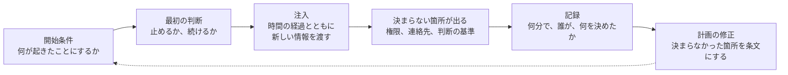

# 🗂️ 演習シナリオのカタログ

計画は、読み合わせでは検証できない。
「バックアップから復旧する」と書かれた一行が実行できるかどうかは、その手順書がどこに置かれているかと、夜間にサーバ室へ入れる人がいるかで決まる。

机上演習は、その一行を実行する側に立たせて、決まらない箇所を洗い出す方法である。
[サイバー攻撃を想定した BCP](bcp-cyber.md#訓練の開始条件)に、ランサムウェアを開始条件とする筋書きを一つ置いている。
本ページは、それ以外の開始条件を並べ、進行の設計と、記録の取り方を扱う。

> [!NOTE]
> **表記ルール**：本ページでは、**事実**（一次情報で確認できる内容。出典を併記する）と、**分析**（筆者の解釈）を書き分ける。

---

## 演習が明らかにするもの

**分析**：演習の成果は、対応がうまくいったかどうかではなく、どこで止まったかにある。
止まらずに終わった演習は、開始条件が甘いか、注入が足りない。

**分析**：医療機関で特に確かめる価値があるのは、次の三つである。
診療を止める判断を誰がするか。
遮断を決めたあと、その判断をどの経路で伝えるか。
外部（患者、地域の医療機関、行政、報道）へ、いつ何を言うか。
どれも技術の問題ではないため、情報システム部門だけで演習を組むと出てこない。

---

## 進行の設計

| 要素 | 決めること |
|---|---|
| 参加者 | 経営層、診療部門、看護部門、事務、情報システム、広報。技術者だけで組まない |
| 時間 | 90 分から 180 分。判断の時刻を記録するため、開始からの経過時間で進める |
| 役割 | 進行役（注入を渡す）、記録役（判断と時刻を残す）、観察役（決まらなかった点を拾う） |
| 注入 | 開始条件のあとに渡す情報を、時系列で用意する。参加者の判断で分岐させる |
| 制約 | 使えないものを明示する（電子カルテ、社内メール、電話交換機、認証基盤） |
| 記録 | 判断の内容、時刻、判断者、根拠とした情報 |
| 事後 | 決まらなかった箇所を、計画のどの条文に反映するかまで決めて終える |

**分析**：「制約」の行を省くと、参加者が既存の道具を前提に話し、演習が計画の朗読になる。
最初に「電子カルテ、院内のメール、職員の名簿は参照できない」と置くだけで、出てくる論点が変わる。

**事実**：CISA は、机上演習の資料一式を Tabletop Exercise Packages（CTEP）として公開している。
状況設定の手引に加え、企画者、進行役と評価者、参加者の役割を定めた雛形、招待状、説明資料、事後の意見収集の様式、事後報告書の様式が含まれる。
分野別の筋書きとして、選挙基盤、地方自治体、港湾、水道とならんで医療（healthcare）が用意されている。
出典：[CISA Tabletop Exercise Packages](https://www.cisa.gov/resources-tools/services/cisa-tabletop-exercise-packages)（CISA）

**事実**：Health Sector Coordinating Council は、深刻なサイバー攻撃による長期の業務停止に対応し、復旧するための確認表として Operational Continuity-Cyber Incident（OCCI）を公開している（2022 年 4 月）。
運用担当者と経営層が使う雛形として示され、組織の規模、資源、複雑さ、能力に応じて修正することを想定している。
出典：[Operational Continuity-Cyber Incident](https://healthsectorcouncil.org/occi/)（HSCC）

---

## シナリオ一覧

| # | 開始条件 | 主に確かめること | 関連するページ |
|---|---|---|---|
| 1 | 電子カルテの暗号化 | 診療停止の判断、紙運用、届出 | [サイバー攻撃を想定した BCP](bcp-cyber.md) |
| 2 | 画像と検査結果の不整合 | 完全性への疑いをどう扱うか | [完全性への攻撃と患者安全](../threats/integrity-attacks.md) |
| 3 | 委託先の停止 | 自組織が動けない範囲の把握 | [基盤の構えと、外部への依存](dependencies.md) |
| 4 | 職員の資格情報の流出 | 失効の順序、影響の確認 | [外に出た認証情報](../technology/credential-exposure.md) |
| 5 | 医療機器の重大な脆弱性の公表 | 使い続ける判断と緩和策 | [メーカー側の脆弱性受付と開示](../technology/medical-devices/psirt-cvd.md) |
| 6 | 外部からの脆弱性の報告 | 受け取り、確認、修正、返信 | [Bug Bounty × 医療、ヘルスケア](../practice/bug-bounty/) |

**分析**：1 は最も準備されているが、2 から 6 は、担当が決まっていないことが多い。
どれも「システムが止まっていない」状態から始まるため、既存の BCP の発動条件に当てはまらない。
当てはまらない事案をどこで判断するかを決めることが、この五つの目的である。

---

## 1. 電子カルテの暗号化

**開始条件**：早朝、電子カルテの端末に身代金の表示。
仮想化基盤の管理画面に到達できず、バックアップサーバも応答しない。

**最初の 60 分で決めること**

- 外来を開けるか、予定手術を実施するか、救急の応需を止めるか
- ネットワークを遮断するか、遮断した場合に判断をどの経路で伝えるか
- 誰を招集するか、その連絡先はどこにあるか

**注入の例**

1. 30 分：近隣の医療機関から「患者を搬送してよいか」と電話が入る
2. 60 分：職員が私物端末で状況を投稿していることが分かる
3. 120 分：報道機関から取材の申し入れが入る
4. 240 分：攻撃者を名乗る側から、データを公開するという連絡が届く

**詰まりやすい箇所**：遮断後の連絡手段、紙の伝票の在庫と置き場所、検査と処方の代替手順、当日の予約患者への連絡方法。

---

## 2. 画像と検査結果の不整合

**開始条件**：放射線科から「読影用の画面で、患者の画像と氏名の対応がおかしい例が複数ある」との連絡。
システムの停止は起きていない。

**最初の 60 分で決めること**

- 当該の検査を止めるか、過去の検査をどこまで疑うか
- 誰が「不整合である」と確定させるか（技師、医師、ベンダ、情報システム）
- 診療を続けながら確認する場合、患者への影響をどう抑えるか

**注入の例**

1. 30 分：ベンダから「設定の変更が入った形跡がある」と連絡
2. 90 分：同じ時間帯に、検体検査の結果でも並び替えの異常が見つかる
3. 180 分：改変の期間が特定できず、影響を受けた患者の数が確定しない

**詰まりやすい箇所**：障害と攻撃の切り分け、過去にさかのぼる範囲の決め方、既に治療方針が決まった患者への対応、記録の保全と確認作業の両立。

**分析**：このシナリオは、演習として最も価値が高い部類に入る。
停止を伴わないため既存の発動条件に当たらず、しかも患者に直接届く。
どの部門が主導するかが決まっていない組織が多い（[完全性への攻撃と患者安全](../threats/integrity-attacks.md)）。

---

## 3. 委託先の停止

**開始条件**：電子カルテの運用を委託している事業者から「当社がサイバー攻撃を受け、調査中である」との連絡。
自組織のシステムは動いている。

**最初の 60 分で決めること**

- 委託先の環境に置いてある自組織のデータの範囲を、誰が答えられるか
- 接続を切るか、切った場合に何が止まるか
- 患者への説明が必要になる条件は何か

**注入の例**

1. 60 分：委託先が保持していた保守用の資格情報が、自組織の系でも有効であることが分かる
2. 180 分：委託先から「復旧の見込みは立っていない」と連絡
3. 翌日：委託先が他の医療機関でも同じ ID を使っていたと判明する

**詰まりやすい箇所**：契約に書かれた通知と報告の義務、委託先の環境にあるデータの一覧、個人情報の漏えい報告の主体（[国内のガイドラインと法規制](../guidelines/japan.md)）。

---

## 4. 職員の資格情報の流出

**開始条件**：外部の組織から「貴院の職員のアドレスとパスワードが、公開されている一覧に含まれている」との連絡。

**最初の 60 分で決めること**

- 対象のアカウントを止めるか、止めた場合に診療へ影響が出るか
- 同じ資格情報が通る系を、どうやって特定するか
- 通報の内容が本物かを、どう確かめるか

**注入の例**

1. 60 分：当該アカウントで、外部から VPN への成功ログインの記録が見つかる
2. 120 分：当該アカウントが、部門で共有されていることが分かる
3. 240 分：同じ一覧に、保守ベンダの ID が含まれていることが分かる

**詰まりやすい箇所**：共有アカウントの停止による診療への影響、失効の順序、委託先への連絡、通報者への返信（[外に出た認証情報](../technology/credential-exposure.md)）。

---

## 5. 医療機器の重大な脆弱性の公表

**開始条件**：使用中の医療機器について、遠隔から動作に影響しうる脆弱性が公表された。
修正プログラムの提供は数か月後と案内されている。

**最初の 60 分で決めること**

- 当該機種が院内に何台あり、どこで使われているかを、誰が答えられるか
- 使用を止めるか、止めた場合の代替手段はあるか
- 修正までの間に置ける緩和策は何か

**注入の例**

1. 当日：当該機器が、想定していたゾーンの外にも接続されていることが分かる
2. 翌日：規制当局から安全性情報が出る
3. 1 週間後：緩和策として遮断した経路が、別の業務で必要になる

**詰まりやすい箇所**：機器の台帳と実際の設置場所の差、緩和策の適用による業務への影響、使用継続の判断を誰がするか（[メーカー側の脆弱性受付と開示](../technology/medical-devices/psirt-cvd.md)）。

---

## 6. 外部からの脆弱性の報告

**開始条件**：患者用ポータルについて「他人の検査結果が見える状態にある」という連絡が、代表のメールアドレスに届いた。
送信者は外部の個人である。

**最初の 60 分で決めること**

- 誰が受け取り、誰が事実を確認するか
- 送信者へいつ返信するか、何を書くか
- 機能を止めるか、止めた場合の患者への影響は何か

**注入の例**

1. 当日：送信者から「一定の期間の後に公表する」との連絡が入る
2. 翌日：確認の結果、実際に到達できることが分かる
3. 3 日後：当該経路で参照された記録が、ログから特定できない

**詰まりやすい箇所**：受け取り窓口の不在、送信者を通報の対象と見るか協力者と見るかの判断、参照ログの粒度、届出の要否（[Bug Bounty × 医療、ヘルスケア](../practice/bug-bounty/)、[検証と調査の法的境界](../practice/legal-boundary.md)）。

**分析**：このシナリオは、実施すると窓口の設計に直結する。
演習の場で「誰が返信するか」が決まらなければ、実際に届いたときも決まらない。

---

## 攻撃側の選択を、分岐として置く

**分析**：注入を「次に何が起きるか」の一本道で書くと、参加者は先を読んで動く。
攻撃側の選択として置くと、判断の順序が現実に近づく。

| 参加者の判断 | 攻撃側が取りうる次の手 | 演習で確かめられること |
|---|---|---|
| 遮断を決めた | 既に取得した資格情報で、遮断されていない経路から戻る | 遮断の範囲が、外部公開の認証口を含んでいるか |
| 復旧を優先した | 復旧した系を再び暗号化する | 侵入経路を塞ぐ前に戻す判断をしていないか |
| 公表を遅らせた | 窃取したデータの一部を公開する | 公表の判断が、攻撃側の行動に従属していないか |
| 交渉に応じない方針を示した | 患者や取引先へ直接連絡する | 患者からの問い合わせを受ける体制があるか |

**分析**：三行目と四行目は、技術的な対応がすべて正しくても発生する。
広報と患者相談の担当を演習に入れる理由は、ここにある（[経営とガバナンス](../governance/)）。

---

## 記録と評価

記録するのは、対応の巧拙ではなく、次の四つである。

1. 判断の時刻（開始から何分で決まったか）
2. 判断者（決めた人が、決める権限を持っていたか）
3. 根拠にした情報（手元にあったか、探しに行ったか、なかったか）
4. 決まらなかった事項（保留のまま演習が進んだ箇所）

**分析**：4 が最も価値がある。
保留のまま進んだ事項は、実際の事案でも保留になる。
演習の後に、その事項を計画のどの条文にするかまで決めて終える。

**評価の観点**

| 観点 | 見るところ |
|---|---|
| 権限 | 診療を止める判断が、その場に居る役職で決まったか |
| 伝達 | 判断が、想定した経路で全部門に届いたか |
| 情報 | 台帳（機器、委託先、アカウント、連絡先）が、使える形で手元にあったか |
| 外部 | 患者、地域、行政、報道への対応が、時間内に決まったか |
| 記録 | 判断の記録が、後から説明できる形で残ったか |

---

## 頻度と、次に何を試すか

**分析**：年に 1 回、同じ開始条件で行うと、二年目には答えが用意される。
開始条件を変えるか、制約を厳しくすることで、新しい箇所が止まる。

| 回 | 変えるもの |
|---|---|
| 1 回目 | 基本の開始条件。制約は電子カルテの停止のみ |
| 2 回目 | 制約を追加する（社内メール、認証基盤、電話交換機） |
| 3 回目 | 開始条件を、停止を伴わない事案に変える（2、4、6） |
| 4 回目 | 時刻を夜間または連休中に置く |
| 5 回目 | 委託先または近隣の医療機関と合同で行う |

**事実**：厚生労働省は、医療機関におけるサイバーセキュリティ対策チェックリスト（令和 7 年度版）と、経営層や医療従事者を階層別に対象とする研修の案内を公開している。
出典：[医療機関におけるサイバーセキュリティ対策](https://www.mhlw.go.jp/stf/seisakunitsuite/bunya/kenkou_iryou/iryou/johoka/cyber-security.html)（厚生労働省）

**事実**：米国では、保健福祉省の 405(d) プログラムが、医療分野を対象とした実務資料と教材を公開している。
出典：[405(d) Program](https://405d.hhs.gov/)（HHS）

---

## 実務チェックリスト

**準備**
- [ ] 参加者に、経営層、診療部門、看護部門、事務、広報を含めた
- [ ] 使えないものを、開始時に明示する形にした
- [ ] 注入を時系列で用意し、分岐を持たせた
- [ ] 記録役と観察役を、進行役とは別に置いた

**実施**
- [ ] 判断の時刻と判断者を記録した
- [ ] 決まらなかった事項を、保留として記録した
- [ ] 遮断後の連絡手段を、実際に使えるか確認した

**事後**
- [ ] 決まらなかった事項を、計画のどの条文に反映するかを決めた
- [ ] 台帳の不足（機器、委託先、アカウント、連絡先）を洗い出した
- [ ] 次回に変える条件を決めた

---

## 関連ページ

- [サイバー攻撃を想定した BCP](bcp-cyber.md)：計画の構造と、訓練の開始条件
- [基盤の構えと、外部への依存](dependencies.md)：自組織が動けない範囲
- [完全性への攻撃と患者安全](../threats/integrity-attacks.md)：停止を伴わない事案
- [外に出た認証情報](../technology/credential-exposure.md)：資格情報の流出への初動
- [検知の設計を技法単位に落とす](../technology/detection-engineering.md)：通知が判断につながるか
- [メーカー側の脆弱性受付と開示](../technology/medical-devices/psirt-cvd.md)：公表と緩和策の出方
- [経営とガバナンス](../governance/)：判断の権限と、外部への説明

---

## 一次情報

| 資料 | 発行元 |
|---|---|
| [CISA Tabletop Exercise Packages](https://www.cisa.gov/resources-tools/services/cisa-tabletop-exercise-packages) | CISA |
| [Operational Continuity-Cyber Incident](https://healthsectorcouncil.org/occi/) | HSCC |
| [405(d) Program](https://405d.hhs.gov/) | HHS |
| [医療機関におけるサイバーセキュリティ対策](https://www.mhlw.go.jp/stf/seisakunitsuite/bunya/kenkou_iryou/iryou/johoka/cyber-security.html) | 厚生労働省 |

---

[← インシデント対応と事業継続](README.md) | [トップへ](../../README.md)
