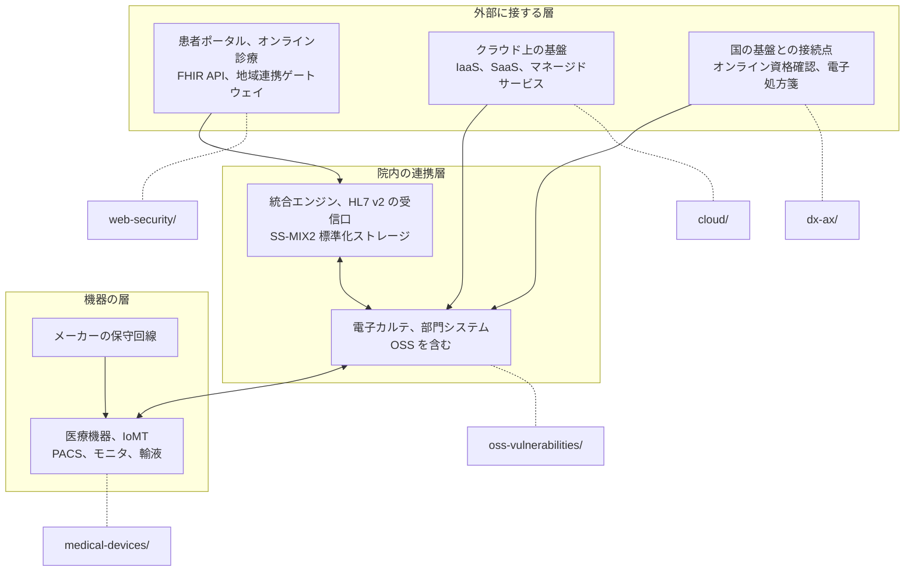

# 🧩 技術領域

医療と製薬で守る対象を、システムの種類ごとに分けて扱う。
それぞれの領域について、固有のリスク、公表された脆弱性、検証時の注意点を整理する。

## 構成

| セクション | 内容 |
|---|---|
| [医療機器のセキュリティ](medical-devices/) | IoMT、PACS / DICOM 固有のリスクと、安全に検証するための手法 |
| [OSS 医療情報システムの脆弱性](oss-vulnerabilities/) | 医療で使われる OSS の一覧、報告された CVE、SCA と SBOM による対処 |
| [医療系 Web アプリのセキュリティ](web-security/) | 患者ポータル、オンライン診療で狙われやすい脆弱性と、HL7 v2 と FHIR の攻撃面 |
| [クラウド事業者と医療](cloud/) | AWS、Google Cloud、Azure、さくらインターネットの責任分界と、侵害される経路 |
| [医療 DX と AX](dx-ax/) | 国の基盤で増える接続点と、医療に AI を組み込むときの脅威 |
| [ネットワークの分離](segmentation.md) | 領域をまたいで効く防御設計。ゾーンの切り方、分離が破れる構造、到達性の確認 |

## どの領域が、どこに位置するか

医療機関の資産を外側から順に並べると、各セクションが対応する位置が決まる。
同じ患者情報が層をまたいで移動するため、ひとつの層だけを固めても経路は残る。

**分析**：層の境界は、担当部署の境界とほぼ一致する。
外部に接する層は情報システム部門、機器の層は臨床工学部門とメーカーが所管し、連携層はベンダに委ねられることが多い。
検証されないまま残る箇所は、この境界に生まれる。

## 領域をまたぐ論点

領域の境界に、管理主体が決まらない箇所が残る。

**保守回線**：医療機器とネットワークの境界にあり、メーカーと医療機関のどちらが監視するかが曖昧になりやすい（[医療機器のセキュリティ](medical-devices/)、[診断とペネトレーションテスト](../practice/pentest/)）。
**責任分界**：クラウド上に置いた医療情報システムで、事業者側の責任と利用者側の責任が分かれる（[クラウド事業者と医療](cloud/)）。
**接続点**：オンライン資格確認や電子処方箋のように、閉域を前提とした設計に外部接続が加わる箇所（[医療 DX と AX](dx-ax/)）。
**認証を持たないプロトコル**：DICOM と HL7 v2 は、規格の本体に認証を含まない。到達性がそのまま権限になるため、経路の分離と送信元の限定が唯一の境界になる（[PACS / DICOM のセキュリティ](medical-devices/pacs-dicom.md)、[HL7 v2 と FHIR の攻撃面](web-security/hl7-fhir.md)）。

この四つは、どれも一つの層の中では解けない。
層の境界に何を通すかを決める作業は [ネットワークの分離](segmentation.md) にまとめている。

いずれも、規制側の要求は [ガイドラインと法規制](../guidelines/) に対応する記述がある。

> [!WARNING]
> 稼働中の医療機器や医療情報システムに対する無断の検証は、患者の生命を危険にさらしうる。
> 検証は書面での許可を得たうえで、隔離環境または承認されたテスト環境で実施してほしい。

---

[トップへ](../../README.md)
