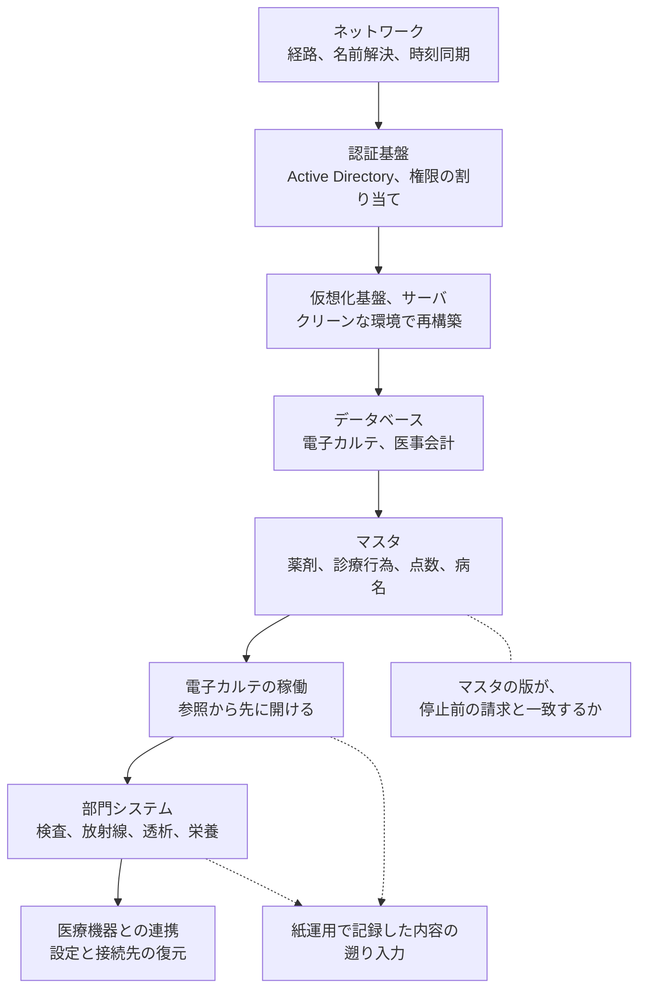

# 💾 バックアップと復旧の設計

バックアップを取っている医療機関は多い。
そこから戻せた医療機関は少ない。
警察庁の統計では、被害組織の 9 割がバックアップを取得していた一方、復元できたのは 2 割である。

この差は、取得の有無ではなく設計で決まる。
本ページは、何を戻す対象に数えるか、攻撃者からどう隔離するか、どこへ戻すか、戻せることをどう確かめるかを扱う。

停止中に診療をどう続けるかと、復旧の順序を誰が決めるかは [インシデント対応と事業継続](../response/) で扱う。
ここで扱うのは、その手順が前提にしているデータと基盤の側である。

> [!NOTE]
> **表記ルール**：本ページでは、**事実**（一次情報で確認できる内容。出典を併記する）、**報道ベース**（報道や第三者の集計のみで確認でき、当事者の公表資料では裏付けが取れていない内容）、**分析**（筆者の解釈）を書き分ける。

---

## 取得率と復元率の差

**事実**：警察庁が集計したランサムウェア被害組織の回答は次のとおりである。

| 項目 | 件数 |
|---|---|
| バックアップを取得していた | 105 / 116 |
| バックアップから復元できた | 20 / 99 |
| 復元できなかった理由：バックアップも暗号化されていた | 48 / 72 |
| 復元できなかった理由：運用の不備 | 19 / 72 |

出典：[令和 7 年 統計データ](https://www.npa.go.jp/publications/statistics/cybersecurity/index.html)（統計編 P128、P129、P130）。集計の詳細は [日本の統計](../threats/statistics/japan.md)に置いている。

**分析**：復元できなかった理由の最多は、バックアップ自体が暗号化されていたことである。
攻撃者は暗号化の前にバックアップを探して消す。
バックアップが本番と同じ認証基盤の管理下にある構成では、管理者権限を奪われた時点で両方が失われる。

二番目の「運用の不備」は、取得の設定はあったが実際には戻せる状態になかった類型である。
この二つを足すと、復元できなかった理由の 9 割を占める。
どちらも、平時に確かめられる項目である。

---

## バックアップが生きていても、復旧の長さは別に決まる

**事実**：国内外の公表事例で、バックアップの状態と復旧までの期間を並べると次のようになる。

| 事例 | バックアップの状態 | 復旧までの期間 |
|---|---|---|
| [宇治病院](../threats/incidents/japan/2023-timeline.md#JP-2023-02)（2023 年） | 暗号化の範囲外に置かれていた | **1 日から 2 日** |
| [つるぎ町立半田病院](../threats/incidents/japan/2021-timeline.md#JP-2021-01)（2021 年） | オフライン保管分が影響を受けず、復旧に使えた | 通常診療の再開まで **約 2 か月** |
| [大阪急性期・総合医療センター](../threats/incidents/japan/2022-timeline.md#JP-2022-01)（2022 年） | 全サーバと端末 約 2200 台をクリーンインストール | 基幹システムの再稼働に **43 日**、診療システム全体に **73 日** |
| [岡山県精神科医療センター](../threats/incidents/japan/2024-timeline.md#JP-2024-01)（2024 年） | オフラインバックアップの契約はあったが、正しく取得されていなかった | 暗号化を免れた別のサーバからデータを取り出して復旧 |
| [宇陀市立病院](../threats/incidents/japan/2019-earlier.md#JP-2018-01)（2018 年） | 復元用の磁気テープが装填されておらず、戻せなかった | システムの再構築を選択 |
| [宇都宮セントラルクリニック](../threats/incidents/japan/2025-timeline.md#JP-2025-01)（2025 年） | 機器の新規購入を含む復旧 | 通常業務の再開まで **約 3 か月** |
| [University of Vermont Health Network](../threats/incidents/global/2020-timeline.md#GL-2020-08)（2020 年、米） | サーバ 1300 台、端末 5000 台を再構築 | 電子カルテの復旧に **約 4 週間**、全アプリケーションの本番復帰は翌年初 |

**分析**：宇治病院と半田病院は、どちらもバックアップが攻撃の範囲外にあった。
それでも復旧の長さは 2 日と 2 か月に分かれている。
差を作ったのは、戻す対象の広さである。
宇治病院で暗号化されたのはファイルサーバ 3 台であり、半田病院は電子カルテを含む端末とサーバの全体だった。

**分析**：大阪急性期・総合医療センターと University of Vermont Health Network の期間を決めたのは、データの復元ではなく基盤の再構築である。
侵害された端末とサーバをそのまま使い続けられないため、クリーンインストールの台数がそのまま日数になる。
バックアップの設計だけを整えても、この部分は短くならない。
短くしたい場合は、再構築を並行して進められる人手と、交換用の機器をどこから調達するかを先に決めておく必要がある。

**分析**：復旧の見積もりは、次の三つを足して出す。
データを戻す時間、基盤を作り直す時間、機器を調達する時間である。
バックアップの議論は最初の一つしか短くしない。

---

## 何を戻す対象に数えるか

電子カルテのデータベースだけを対象にした計画では、診療は再開できない。
医療機関で戻す必要があるものは、保持している主体が分かれている。

| 対象 | 内容 | 主に保持している主体 |
|---|---|---|
| 電子カルテのデータ | 診療記録、オーダー、処方 | 医療機関（ベンダの運用管理下にあることが多い） |
| 部門システムのデータ | 検査、放射線、内視鏡、透析、リハビリ、栄養 | 部門ごとのベンダ |
| 画像 | PACS の画像と付帯情報 | 医療機関、または外部保存の受託事業者 |
| 医事会計のデータ | 請求、患者基本情報、保険情報 | 医療機関 |
| マスタ | 薬剤、診療行為、点数、病名、職員 | ベンダが更新を代行していることがある |
| サーバとネットワークの構成 | 仮想化基盤の構成、機器の設定、経路と許可ルール | 構築ベンダ |
| 認証の基盤 | Active Directory のドメイン情報、権限の割り当て | 医療機関、または運用委託先 |
| 医療機器の設定 | 校正値、プロトコル、接続先の設定 | メーカと臨床工学部門 |
| ライセンスと証明書 | ソフトウェアのライセンス、機器の認証情報、サーバ証明書 | ベンダ、医療機関 |

**分析**：この表の右列が、医療機関に固有の難所である。
病院ではパッチの適用と同じく、バックアップの取得と復元も納入ベンダ側の作業であることが多い。
自組織で取得している範囲だけを数えると、部門システムと機器の設定が計画から抜ける。

**分析**：復旧の場面で最初に足りなくなるのはマスタとライセンスである。
データが戻ってもマスタが古いと請求が通らず、ライセンスの再発行に日数がかかるとシステムが起動しない。
契約の時点で、ベンダが保持するバックアップの対象、世代、保管場所、復元の所要時間を書面で確認する（[基盤の構えと、外部への依存](../response/dependencies.md)）。

---

## 攻撃者から隔離する

隔離は三段階で考える。
上の段ほど攻撃者から遠く、復元にかかる手間も増える。

| 段階 | 状態 | 破られる条件 |
|---|---|---|
| 同一ネットワーク上の複製 | 本番と同じネットワーク、同じ認証基盤にある | 管理者権限を一つ奪われた時点で失われる |
| 論理的な隔離 | 別の認証基盤で管理し、本番から到達できない経路に置く | バックアップ基盤の資格情報が別途奪われた場合 |
| 物理的な隔離、または書き換え不可 | オフライン保管、またはイミュータブル（保持期間内は削除も変更もできない）設定 | 保持期間の設定を変更できる権限が奪われた場合 |

**分析**：三段目でも、保持期間を短縮する操作ができる権限が本番側の管理者と同じなら、隔離は成立しない。
イミュータブルの設定では、保持期間そのものを誰が変更できるかを確認の対象にする。

確認する項目は次の四つである。

**認証の分離**：バックアップ基盤の管理者が、業務ドメインの管理者と同じアカウントになっていないか（[Active Directory の攻撃面](windows/active-directory.md)）。
**経路の分離**：本番のサーバからバックアップ基盤の管理画面へ到達できないか（[ネットワークの分離](segmentation.md)）。
**削除の権限**：保持期間の変更と世代の削除を、誰が単独でできるか。
**検知**：バックアップジョブの異常終了と、基盤への異常なログインが監視の対象に入っているか（[防御プレイブック](../threats/actors/defense-playbook.md)）。

---

## 世代と保存期間は、潜伏期間から決める

**事実**：[岡山県精神科医療センター](../threats/incidents/japan/2024-timeline.md#JP-2024-01)では、フォレンジック調査により、初期侵入が 2024 年 5 月 13 日、暗号化の開始が 5 月 19 日と確認されている。
その間に、院内ネットワークの探索、バックアップデータの探索と破壊、Active Directory の情報の窃取、ウイルス対策ソフトの停止と削除が行われている。

**分析**：暗号化の直前の世代へ戻すと、攻撃者が侵入したあとの状態へ戻る。
そこには、作られた管理者アカウント、無効化された防御製品、設置された遠隔操作の仕組みが含まれる。
復元の対象に選べるのは、初期侵入より前の世代である。

**分析**：したがって世代の数は、業務上の必要ではなく、侵入から覚知までの想定日数で決める。
岡山県精神科医療センターは 6 日、[日本医科大学武蔵小杉病院](../threats/incidents/japan/2026-timeline.md#JP-2026-01)は侵入から覚知まで 14 日である。
日次の世代を 2 週間分保持できない設計では、戻す先が残らない場合がある。

**分析**：どこまでのデータ損失を許容するかは、業務ごとに違う。
検査結果と処方は当日分が失われると診療に直結するが、統計や研究用の抽出は日単位で足りる。
一律の間隔ではなく、業務ごとに許容できる巻き戻しの幅を決める。

---

## 復元先を先に決める

**分析**：侵害された基盤にそのまま戻す計画は成立しない。
侵入経路と、攻撃者が残した仕組みがそのまま残るためである。
そのため復元先は、次のどれかを事前に決めておく。

1. 侵害範囲の外にある予備の基盤
2. クラウド上に新規に構築する環境
3. 調達して新設する機器

**分析**：三番目を選ぶ場合、機器の調達期間が復旧の所要時間に組み込まれる。
宇都宮セントラルクリニックは、サーバと端末のクリーン化に加えて新規購入を行い、通常業務の再開まで 約 3 か月を要した。
「バックアップから戻す時間」だけを見積もった計画では、この長さを説明できない。

**分析**：復元の手順書とネットワーク構成図が、復元しようとしている基盤の中にしかない構成は、事案時に参照できない。
手順書、構成図、連絡先、ライセンス情報は、紙または独立した保管先に置く（[サイバー攻撃を想定した BCP](../response/bcp-cyber.md)）。

---

## 復旧の依存順序

診療の緊急度で決まる重要度と、技術的な依存関係で決まる復旧順序は一致しない。
重要度は救急応需、手術、透析、検査、薬剤の順に並ぶが、その上の業務システムは下の基盤が戻らなければ動かない。

**分析**：この順序で最初に詰まるのは認証基盤である。
Active Directory を侵害された場合、復元したドメインに攻撃者が作った権限が残っていないかを確認しないまま先へ進めない。
確認の作業量が読めないため、ここが復旧計画で最も見積もりを外しやすい。

**分析**：紙運用で記録した内容の遡り入力は、システムが戻ってからの作業である。
停止期間が長いほど入力の量が増え、診療の再開後に別の負荷として現れる。
復旧の完了を「システムが動いた時点」で数えると、この期間が計画から抜ける。

---

## 復元試験の単位と頻度

**分析**：復元試験を行っていないバックアップは、復旧の手段として数えられない。
試験の単位は、システムごとではなく業務ごとに置く。
電子カルテ単体が起動しても、部門システムとの連携が戻らなければ診療は再開できないためである。

試験で確認する項目は次のとおりである。

| 項目 | 確認する内容 |
|---|---|
| 復元の可否 | 対象の世代から、実際にデータが戻るか |
| 所要時間 | 復元の開始から、業務が動くまでの実測値 |
| 業務の成立 | 外来の一連の流れ（受付、診察、オーダー、会計）が通るか |
| 連携 | 部門システムと医療機器との接続が戻るか |
| 担当者 | 復元の作業を、ベンダの担当者が不在でも開始できるか |

**分析**：所要時間を実測していない場合、BCP に書かれた復旧目標は根拠のない数字になる。
試験の記録には、実施日、対象、所要時間、戻せなかった項目を残す。
戻せなかった項目が次回までの課題になる。

**分析**：頻度は、システムの更改と構成変更に合わせる。
年 1 回の定期試験に加えて、基盤の更改、ベンダの交代、部門システムの追加のあとに実施する。
構成が変わるとバックアップの対象範囲も変わるが、設定の更新が漏れても平時には気付けない。

---

## クラウドと SaaS では、誰が取るのか

**分析**：クラウド上の環境では、事業者が基盤の冗長化を担う一方、利用者のデータの世代管理は利用者の側に残ることが多い。
冗長化は機器の故障に効くが、誤操作と暗号化には効かない。
複製が即座に反映される構成では、暗号化されたデータも同じ速さで複製される。

**分析**：バックアップを本番と同じ事業者の同じアカウント内に置くと、そのアカウントが侵害された時点で両方が失われる。
また、事業者側の広範な障害では、その事業者の中にある手段は管理コンソールを含めて使えない（[基盤の構えと、外部への依存](../response/dependencies.md)）。
少なくとも 1 系統を、別のアカウント、または別の事業者の管理境界の外に置く。

**分析**：SaaS では、事業者が保持する期間を過ぎたデータを利用者が取り戻せない場合がある。
契約時に、保持期間、利用者側で取り出せる形式、解約時のデータの扱いを確認する（[クラウド事業者と医療](cloud/README.md)）。

---

## 制度が求めているもの

**事実**：オフラインバックアップの確保は、令和 6 年度の診療報酬改定で診療録管理体制加算の要件に取り込まれている（[厚生労働省 第 32 回医療等情報利活用ワーキンググループ 資料 7](https://www.mhlw.go.jp/content/10808000/001705951.pdf)）。

**事実**：医療情報システムの安全管理に関するガイドラインは、2026 年 6 月に第 7.0 版が公表され、保守委託機関編が新設されて 5 編構成になった（[国内のガイドラインと法規制](../guidelines/japan.md)）。

**分析**：加算の要件は「オフラインバックアップを取得していること」であり、「復元できること」ではない。
要件を満たした状態と、事案時に戻せる状態は別である。
監査の場面では要件の充足を示せばよいが、復旧の場面で問われるのは復元試験の記録のほうである。

---

## 実務チェックリスト

**対象**
- [ ] 電子カルテ以外の部門システム、画像、マスタ、機器の設定が対象に入っているか一覧で確認した
- [ ] ベンダが取得している範囲と、自組織が取得している範囲を書面で切り分けた
- [ ] ライセンスと証明書の再発行に要する日数をベンダに確認した

**隔離**
- [ ] 少なくとも 1 系統をオフライン、または書き換え不可の設定で保管している
- [ ] バックアップ基盤の認証を、業務ドメインから分離した
- [ ] 保持期間の変更と世代の削除ができる権限者を特定した
- [ ] バックアップジョブの異常終了を監視の対象に入れた

**世代**
- [ ] 侵入から覚知までの想定日数より長い期間の世代を保持している
- [ ] 業務ごとに、許容できるデータの巻き戻しの幅を決めた

**復元**
- [ ] 復元先の基盤を、侵害された基盤とは別に決めてある
- [ ] 機器を調達する場合の納期を、復旧の見積もりに含めた
- [ ] 手順書、構成図、連絡先を、復元対象の外に保管している
- [ ] 業務単位の復元試験を実施し、所要時間を実測した
- [ ] ベンダの担当者が不在でも復元を開始できる手順になっている

---

## 関連ページ

- [サイバー攻撃を想定した BCP](../response/bcp-cyber.md)：復旧の順序と、停止中の診療の継続
- [基盤の構えと、外部への依存](../response/dependencies.md)：オンプレミスとクラウドで責任の分かれ方が変わる
- [防御プレイブック](../threats/actors/defense-playbook.md)：バックアップ破壊の検知の観測点
- [Active Directory の攻撃面](windows/active-directory.md)：認証基盤とバックアップ基盤の権限の分離
- [ネットワークの分離](segmentation.md)：バックアップ基盤への経路を絞る
- [クラウド事業者と医療](cloud/README.md)：責任分界と、鍵管理の位置づけ
- [日本の統計](../threats/statistics/japan.md)：復元の成否と復旧期間の分布
- [インシデントの費用と、経営層への説明](../governance/cost.md)：復旧期間が費用に変わる仕組み
- [セキュリティの基礎](../reference/security-basics.md#12-レジリエンスとバックアップ)：3-2-1 と復元試験の位置づけ

---

[← 技術領域](README.md) | [トップへ](../../README.md)
