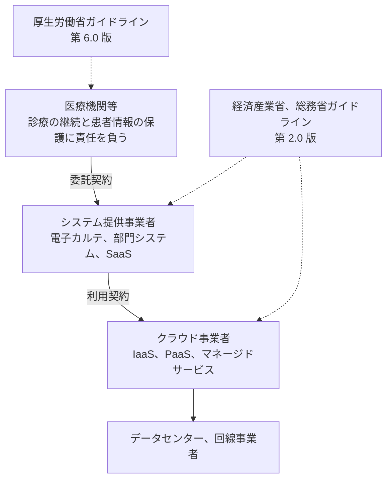
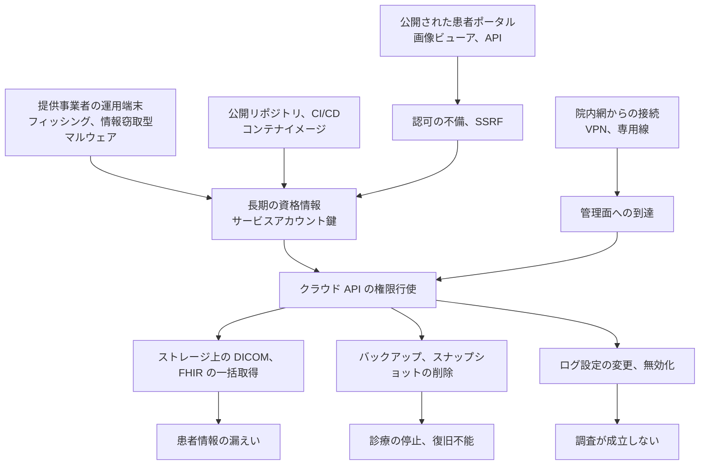

# ☁️ クラウド事業者と医療

医療機関や製薬企業がクラウドを使うとき、契約の相手は電子カルテや検査システムのベンダであることが多い。
そのベンダがどのクラウド事業者の上で動いているかは、契約書の表面に現れないまま、侵害時に追える範囲、取得できるログ、データが置かれる国、復旧に使える手段を決めている。

本ページは、AWS、Google Cloud、Microsoft Azure、さくらインターネットの四社について、二つの層から整理する。
前半は制度と責任分界、後半はクラウド上の医療システムが実際に侵害される経路と、各社の機能でどこを抑えられるかを扱う。

> [!NOTE]
> **表記ルール**：本ページでは、**事実**（一次情報で確認できる内容。出典を併記する）、**報道ベース**（報道のみで確認でき、当事者の公表資料では裏付けが取れていない内容）、**分析**（筆者の解釈）を書き分ける。
> 出典は、当事者の公表資料、行政文書、CVE、ベンダアドバイザリなどの一次情報を優先して示す。
> 各社のサービス構成と既定値は変わりうるため、設計と監査にあたっては必ず出典先の最新の記載を確認してほしい。

---

## 責任が三層に分かれる

医療情報を扱うシステムでは、責任の所在が医療機関、システム提供事業者、クラウド事業者の三層に分かれる。
どの層に何を求めるかは、事業者向けガイドラインが定めている。

**事実**：経済産業省と総務省の「医療情報を取り扱う情報システム、サービスの提供事業者における安全管理ガイドライン」は、2025 年 3 月 28 日に第 2.0 版へ改定された。
同版は、対象となる事業者を次の三つに整理している（[経済産業省](https://www.meti.go.jp/policy/mono_info_service/healthcare/teikyoujigyousyagl.html)、[第 2.0 版本文 PDF](https://www.meti.go.jp/policy/mono_info_service/healthcare/01gl_20250328.pdf)）。

1. 医療機関等との契約等に基づいて医療情報システム等を提供する事業者
2. 医療機関等と直接的な契約関係になくても、医療機関等に提供される医療情報システムに必要な資源や役務を提供する事業者
3. 患者等の指示に基づいて医療機関等から医療情報を受領する事業者

**分析**：クラウド事業者は、医療機関と直接契約していなくても二番目の類型に当たりうる。
医療機関から見ると、契約関係のない相手がガイドラインの対象に含まれることになり、要求事項の履行状況を自分で確認できない範囲が生じる。
この範囲を、契約している一次のベンダを通じて確認できる形にしてあるかどうかが、実務上の分かれ目になる。

障害や侵害の起点は下の層にありうるが、診療が止まるのは最上層である。
契約が一段ずつしか結ばれていない構造では、下層で起きたことの説明が上層に届くまでに時間がかかる。

### 責任共有モデルとガイドラインの噛み合わせ

クラウド事業者は、自社の責任範囲を責任共有モデルとして公表している。
医療情報ガイドラインの遵守事項は、その多くが利用者側の範囲に落ちる。

| 層 | 主な担い手 | 医療情報ガイドラインで問われる代表的な事項 |
|---|---|---|
| 物理施設、ハードウェア、ハイパーバイザ | クラウド事業者 | 設置場所の国、入退管理、機器の廃棄 |
| マネージドサービスの内部実装 | クラウド事業者 | 暗号化方式、可用性設計、監査報告書の提供 |
| OS、ミドルウェア、アプリケーション | 利用者（多くは提供事業者） | 更新の適用、脆弱性対応、バックアップの検証 |
| 権限設計、鍵管理、ログ、ネットワーク構成 | 利用者（多くは提供事業者） | アクセス制御、証跡の保存、通信の保護 |
| 医療情報そのものの取扱い | 医療機関等 | 同意、開示、保存義務、委託先の監督 |

**事実**：AWS は、医療情報ガイドラインへの対応可否を一律には示さず、責任共有モデルに基づいて関係者ごとに整理する立場を取っている（[AWS 医療情報ガイドライン](https://aws.amazon.com/jp/local/health/medical-information-guidelines-on-aws0/)）。

**分析**：この立場は四社に共通する。
「このクラウドはガイドラインに準拠している」という言い方は、どの層までを指すのかが定まらないため、単独では意味を持たない。
確認すべきは、事業者が公表している対応表と、自分たちの構成が対応表のどの前提に当てはまるかである。

---

## 四社の比較

| 事業者 | 日本の医療情報ガイドライン向け資料 | 医療データ向けマネージドサービス | 国内での制度的な位置づけ |
|---|---|---|---|
| **AWS** | 「医療情報システム向け AWS 利用リファレンス」を AWS パートナー各社が作成、公開 | AWS HealthLake（FHIR）、AWS HealthImaging（DICOM）、AWS HealthOmics | ISMAP 登録、ガバメントクラウドの対象事業者 |
| **Google Cloud** | PwC Japan 作成のセキュリティリファレンス（2021 年 10 月公開） | Cloud Healthcare API（FHIR、HL7v2、DICOM） | ISMAP 登録、ガバメントクラウドの対象事業者 |
| **Microsoft Azure** | 「医療機関向けクラウドサービス対応セキュリティリファレンス」を日本マイクロソフトと富士ソフトが作成（2024 年度版） | Azure Health Data Services（FHIR サービス、DICOM サービス、識別解除サービス） | ISMAP 登録、ガバメントクラウドの対象事業者 |
| **さくらインターネット** | 医療分野に特化した公開リファレンスは確認できていない | 医療データ形式に特化したマネージドサービスは確認できていない | ISMAP 登録、ガバメントクラウドの対象事業者（国内事業者で最初） |

**分析**：この表は「どこまでを事業者側が引き受けるか」を示すものではない。
上の三社は医療データ形式（FHIR、DICOM）を扱うマネージドサービスを持ち、さくらインターネットは汎用の IaaS を国内で提供する形になっている。
医療データの標準形式を扱う機能を自前で実装するか、事業者のサービスに載せるかで、責任分界の線が引かれる位置と、後述する監査ログの取り方が変わる。

---

## AWS

**事実**：日本の三省二ガイドラインに対応するための参照文書として「医療情報システム向け AWS 利用リファレンス」がある。
これは AWS が直接配布するのではなく、AWS パートナー各社が作成して公開している（[AWS 医療情報ガイドライン](https://aws.amazon.com/jp/local/health/medical-information-guidelines-on-aws0/)）。
リファレンスは、リスクアセスメント、リスク対応、リスクコミュニケーションの三段で構成され、AWS が実施する対策、提供事業者が対応する事項、医療機関等に求める事項を分けて記述する形を取る（[AWS 公式ブログ](https://aws.amazon.com/jp/blogs/news/japan-security-guideline-for-medical-infromation-systems-2024-practice-02/)）。

**事実**：医療データ向けには、FHIR を扱う [AWS HealthLake](https://aws.amazon.com/jp/healthlake/)、DICOM を扱う [AWS HealthImaging](https://aws.amazon.com/jp/healthimaging/)、オミクスデータを扱う [AWS HealthOmics](https://aws.amazon.com/jp/healthomics/) が提供されている。

**事実**：米国の HIPAA については、ePHI を扱えるサービスの一覧（HIPAA 対象サービス）が公開されており、PHI を含む用途で使う前に AWS との BAA（Business Associate Agreement）の締結が必要とされている（[AWS HIPAA 対象サービス](https://aws.amazon.com/compliance/hipaa-eligible-services-reference/)）。
BAA を締結しても、各サービスの設定を要件に適合させる責任は利用者に残る。

---

## Google Cloud

**事実**：日本の医療情報ガイドラインへの対応は、コンプライアンスページに整理されている（[Google Cloud 三省ガイドライン](https://cloud.google.com/security/compliance/3g3m?hl=ja)）。
医療情報システム向けのセキュリティリファレンスは PwC Japan が作成し、2021 年 10 月 26 日に公開された（[Google Cloud 公式ブログ](https://cloud.google.com/blog/ja/products/identity-security/security-reference-for-medical-information-systems)、[PwC Japan](https://www.pwc.com/jp/ja/services/consulting/cloud-transformation/security-ref-hia.html)）。
このリファレンスが対応しているのは、厚生労働省ガイドライン第 5.1 版（2021 年 1 月）と、統合前の総務省, 経済産業省ガイドラインである。

**分析**：厚生労働省ガイドラインは第 6.0 版（2023 年 5 月）で構成が三編に再編され、事業者向けガイドラインも第 2.0 版で対象事業者の定義が変わっている。
公開時点の版に対応したリファレンスを、そのまま現行版の適合証明として使うわけにはいかない。
版のずれはどのクラウドのリファレンスでも起こりうるため、参照する前に対応版を確認する必要がある。

**事実**：医療データ向けには [Cloud Healthcare API](https://cloud.google.com/healthcare-api) があり、FHIR（DSTU2、STU3、R4）、HL7v2、DICOM の三つのデータ形式を扱う。

**事実**：HIPAA については BAA の締結手順と対象サービスの一覧が公開されている（[Google Cloud HIPAA](https://cloud.google.com/security/compliance/hipaa?hl=ja)）。
同ページは、一般提供前（Pre-GA）の機能を PHI に使わないこと、監視のラベルやビルド構成に PHI を含めないことなど、利用者側の禁止事項を具体的に挙げている。

---

## Microsoft Azure

**事実**：「医療機関向けクラウドサービス対応セキュリティリファレンス（2024 年度）」を日本マイクロソフトと富士ソフトが作成し、公開している。
対応するガイドラインは、厚生労働省ガイドライン第 6.0 版（2023 年 5 月）と、事業者向けガイドライン第 1.1 版（2023 年 7 月）である。
対象は Microsoft Azure、Microsoft 365、Microsoft Dynamics 365 と Microsoft Power Platform（[マイクロソフト業界別ブログ](https://www.microsoft.com/ja-jp/microsoft-cloud/blog/health/2024/10/16/microsoft_cloud_healthcare2024/)）。

**事実**：医療データ向けには [Azure Health Data Services](https://learn.microsoft.com/ja-jp/azure/healthcare-apis/healthcare-apis-overview) があり、FHIR サービス、DICOM サービス、識別解除サービスを含む。
先行していた Azure API for FHIR は 2026 年 9 月 30 日に廃止が予定されており、2025 年 4 月 1 日以降は新規顧客の展開が停止している。

**分析**：マネージドサービスの廃止と移行は、医療でも通常の SaaS と同じ頻度で起こる。
承認や検証の手続きを伴う医療システムでは、移行期限に間に合うかどうかが技術面ではなく手続面で決まる。
サービス選定の段階で、提供終了時の告知期間と移行先の有無を契約上どう扱うかを確認しておく必要がある。

**事実**：ISMAP については、対象となる Azure リージョンとして東日本と西日本が挙げられ、日本の顧客が契約できる世界のリージョンが追加で登録されている（[Microsoft Learn](https://learn.microsoft.com/ja-jp/compliance/regulatory/offering-ismap)）。

---

## さくらインターネット

**事実**：「さくらのクラウド」は ISMAP クラウドサービスリストに登録されている。
登録の対象は東京リージョン第 1, 第 2 ゾーンと石狩リージョン第 1, 第 2 ゾーンであり、パブリック ISO イメージは言明の範囲外とされている。
仮想サーバの利用開始後の OS 更新は利用者側の責任と明記されている（[さくらのクラウド マニュアル](https://manual.sakura.ad.jp/cloud/ismap/index.html)）。

**事実**：ガバメントクラウドについて、デジタル庁は 2023 年 11 月 28 日と 2026 年 3 月 27 日に対象クラウドサービスに関する公表を行っている（[デジタル庁 ガバメントクラウド](https://www.digital.go.jp/policies/gov_cloud)）。

**報道ベース**：2023 年 11 月の採択は、2025 年度末までに技術要件を満たすことを条件とした条件付きのものであり、国内事業者としては最初の採択だったと報じられている。
2026 年 3 月には全ての技術要件を満たしたとして正式に選定された（[ITmedia NEWS](https://www.itmedia.co.jp/news/article/2603/27/1260327085/)、[日経クロステック](https://xtech.nikkei.com/atcl/nxt/news/24/03153/)）。

**事実**：2026 年 5 月 28 日、NEDO の事業「AI の安全性確保に関する研究開発, 検証等の推進事業／日本語版医療特化型 LLM の社会実装に向けた安全性検証, 実証」において、さくらインターネットを含む連名 10 者が医療業務支援向けの日本語 LLM を開発したと公表した。
想定される運用環境は「医療機関のオンプレミス環境または医療機関が管理する国内クラウド環境などの患者情報を安全に管理できる環境」とされている（[さくらインターネット ニュースリリース](https://www.sakura.ad.jp/corporate/information/newsreleases/2026/05/28/1968224678/)）。

**分析**：医療データ形式を扱うマネージドサービスを前提にしない構成では、FHIR や DICOM の取扱いを提供事業者側が実装することになる。
責任分界の線は上に移り、暗号化、監査ログ、可用性の設計をベンダが自ら設計し説明する必要が生じる。
一方で、データが国内に閉じることと、ISMAP の言明範囲が明示されていることは、外国法の適用可能性と評価範囲を論点から外したい場合に効いてくる。

---

## クラウド上の医療システムが侵害される経路

ここからは、設計と検証を担当する立場で見た内容に移る。
クラウドで起きる侵害の多くは、事業者の基盤が破られた結果ではなく、利用者側の資格情報と権限設定を経由して起きる。
医療で問題になるのは、その経路の先にあるのが患者記録と画像であり、一度の権限行使で取得できる件数が制約されないことである。

### 資格情報とアイデンティティ

長期の資格情報が漏れると、そのまま API の権限行使に変わる。
アクセスキー、サービスアカウント鍵、アプリケーションの資格情報は、盗まれても認証としては正当な操作に見える。

**抑え方**：長期鍵を発行せず、ワークロードには一時的な資格情報を割り当てる。
AWS では IAM ロールと IAM Identity Center、Google Cloud ではサービスアカウントの権限借用と Workload Identity 連携、Azure ではマネージド ID と Entra ID の条件付きアクセスが対応する機能になる。
運用者の恒常的な特権は外し、必要なときに限って昇格させる仕組みを使う（[Microsoft Entra Privileged Identity Management](https://learn.microsoft.com/ja-jp/entra/id-governance/privileged-identity-management/pim-configure)、[Google Cloud Privileged Access Manager](https://docs.cloud.google.com/iam/docs/pam-overview)）。
AWS では IAM Identity Center の権限セットで付与範囲を分け、恒久的なアクセスキーを配らない構成にする。

**検知**：普段と異なる地域や自律システムからの API 呼び出し、短時間での列挙操作、権限の自己付与を検知対象にする。
AWS では GuardDuty と IAM Access Analyzer、Google Cloud では Security Command Center、Azure では Microsoft Defender for Cloud と Entra ID のサインインログが該当する。

**分析**：医療の運用では、ベンダの保守要員が広い権限を常時持つ構成が残りやすい。
夜間や休日の障害対応を人手で回す前提が、権限の常時付与という形で残っているためである。
権限を減らす前に、緊急時に誰がどう昇格するかの手順を決めておかないと、対策が診療の継続を妨げる側に働く。

### ストレージに置かれた画像とデータの公開範囲

DICOM 画像や FHIR のエクスポート、検査結果の CSV は、オブジェクトストレージに置かれることが多い。
公開範囲の設定を一つ誤ると、認証なしで一括取得できる状態になる。

**抑え方**：組織単位で公開を禁止する設定を先に入れる。
AWS の S3 ブロックパブリックアクセス、Google Cloud の公開アクセスの防止（組織のポリシー）、Azure Storage の匿名アクセス無効化がこれに当たる。
そのうえで、外部との受け渡しは署名付き URL の期限を短くする、私設エンドポイント経由に限定するといった形にする。
Google Cloud の VPC Service Controls のように、認証済みの資格情報でも境界の外へデータを持ち出せなくする仕組みは、資格情報が漏れた後の被害範囲を絞る方向に働く。

**検知**：公開設定の変更そのものをイベントとして検知する。
保存されているデータに患者情報が含まれるかは、Amazon Macie、Google Cloud の Sensitive Data Protection、Microsoft Purview のような分類機能で継続的に確認する。

### SSRF とインスタンスメタデータ

患者ポータルや画像ビューアに SSRF がある場合、攻撃者はアプリケーションを経由してインスタンスメタデータへ到達し、そのインスタンスに割り当てられた資格情報を取得しうる。
これは、Web の脆弱性がクラウドの権限に変換される代表的な経路である。

**事実**：AWS のインスタンスメタデータサービスには、セッション指向の IMDSv2 がある。
IMDSv2 は `PUT` でトークンを取得し、以降の `GET` にそのトークンを付ける方式で、既定ではインスタンスは IMDSv1 と IMDSv2 の両方を受け付ける。
インスタンス単位で IMDSv2 のみを受け付ける設定にでき、その場合 IMDSv1 の呼び出しは失敗する。
`PUT` 応答のホップ制限は既定で 1 であり、`X-Forwarded-For` ヘッダを含む `PUT` は拒否される（[AWS ドキュメント](https://docs.aws.amazon.com/AWSEC2/latest/UserGuide/configuring-instance-metadata-service.html)）。

**抑え方**：AWS では IMDSv2 を必須にし、組織のポリシーで新規インスタンスの既定にする。
Google Cloud と Azure のメタデータサーバは、いずれも専用のリクエストヘッダを要求する方式を取っている。
アプリケーション側では、外部から与えられた URL への発行をホスト単位の許可リストで制限し、リンクローカルアドレスへの到達を塞ぐ。

**検知**：メタデータから取得した資格情報が、そのインスタンス以外から使われた場合を検知する。
AWS の GuardDuty は、この形の異常を検出結果の種類として定義している（[AWS ドキュメント](https://docs.aws.amazon.com/guardduty/latest/ug/guardduty_finding-types-iam.html)）。

**分析**：医療系の Web アプリケーションでは、外部の施設が置いた画像や紹介状を取得する機能が仕様として存在する。
URL を受け取って取得する処理は要件そのものであり、機能を削って塞ぐことができない。
このため、アプリケーション側の入力検証だけに頼らず、資格情報の側で被害を止める設計にしておく必要がある。
Web 側の詳細は [医療系 Web アプリケーションのセキュリティ](../web-security/) を参照してほしい。

### マルチテナントの分離

複数の医療機関が同じ SaaS を共同利用する構成では、テナント識別子の扱いを誤ると、他施設の患者記録を参照できる状態になる。
クラウド事業者の責任範囲ではなく、提供事業者の実装の問題である。

**抑え方**：テナント境界をアプリケーションの条件分岐だけに置かず、ストレージの分離、鍵の分離、データベースの行レベルの制御を重ねる。
検証では、識別子を差し替えたリクエストが拒否されることを、参照, 更新, 削除の各操作で確認する。

**検知**：テナントをまたぐ参照が発生した場合に記録が残る形にする。
アプリケーション層の監査ログがないと、この種の事象は事後に確認できない。

### 鍵管理と、バックアップの不変性

ランサムウェアがクラウド上のバックアップに到達した場合、暗号化ではなく削除で復旧手段が失われる。
スナップショットとバックアップが同じ資格情報で操作できる構成は、この経路を開けたままにする。

**抑え方**：保持期間中の削除と上書きを技術的に禁止する仕組みを使う。
AWS の S3 オブジェクトロックとバックアップボールトのロック、Google Cloud の保持ポリシーとバケットロック、Azure の不変ストレージ（時間ベースの保持、リーガルホールド）が該当する。
鍵は、利用者が管理する鍵（CMEK、カスタマーマネージドキー）にして、鍵の削除にも保護期間を設ける。

**検知**：保持設定の変更、鍵の無効化、大量の削除操作を、単独のイベントとして通知対象にする。

### 院内網とクラウドをつなぐ経路

専用線や VPN で院内網とクラウドを接続すると、院内で侵害された端末からクラウドの管理面へ到達しうる。
逆に、クラウド側で得た権限が院内へ折り返す経路にもなる。

**抑え方**：接続経路を通るのはデータ面に限り、管理面の操作は別の認証経路に分ける。
運用端末は専用の端末に限定し、多要素認証と条件付きアクセスを適用する。

**分析**：医療機関の内部では、電子カルテ、部門システム、医療機器、事務系が同じ網に同居していることが多い。
この状態でクラウドを接続すると、クラウド側の分離設計が院内の平坦な構造に引きずられる。
接続の前に、院内側のどのセグメントから何に到達できるかを確定させておく必要がある（[ネットワークの分離](../segmentation.md)）。

### 事業者側で起きた事象

利用者側の設定が正しくても、事業者側の事象で影響を受けることがある。
公表された二つの事例は、確認すべき点が異なる。

**事実**：2024 年 5 月、オーストラリアの年金基金 UniSuper と Google Cloud は共同声明を出し、プロビジョニング時の意図しない設定の誤りが Private Cloud のサブスクリプション削除につながったこと、二つの地域に複製していた環境がいずれも削除されたことを公表した。
復旧は別の事業者に置いていたバックアップによって行われた（[UniSuper と Google Cloud の共同声明](https://www.unisuper.com.au/about-us/media-centre/2024/a-joint-statement-from-unisuper-and-google-cloud)）。

**事実**：2023 年 5 月から 6 月にかけて、Storm-0558 と呼ばれる攻撃者が Microsoft の Exchange Online 上で 22 組織と 500 名超のメールボックスにアクセスした。
米国の Cyber Safety Review Board は 2024 年 4 月 2 日に報告書を公開し、2016 年に発行された MSA の署名鍵が取得された経緯を Microsoft が説明できていないこと、鍵の更新が 2021 年以降行われていなかったことを指摘した（[CISA CSRB 報告書](https://www.cisa.gov/resources-tools/resources/CSRB-Review-Summer-2023-MEO-Intrusion)、[Microsoft の技術解説](https://www.microsoft.com/en-us/security/blog/2023/07/14/analysis-of-storm-0558-techniques-for-unauthorized-email-access/)）。

**分析**：前者は、地理的な冗長化が同一事業者のアカウント配下で完結している場合、アカウント単位の操作がその冗長性を無効化しうることを示す。
医療機関のバックアップ設計で「別リージョンに複製しているか」だけを確認していると、この経路は見えない。
後者は、認証基盤そのものが侵害された場合、利用者側の権限設計では検知できない範囲があることを示す。
この二つに対して利用者が取れる手は、事業者の管理境界の外側に復旧手段を一つ持つことと、事業者から出るログを自組織側に保存しておくことに絞られる。

**報道ベース**：国内では、2025 年 11 月 15 日にクラウド型電子カルテで障害が発生し、全国の医療機関と薬局で電子カルテが利用できなくなった。
原因はデータセンターと医療機関を結ぶ回線の高負荷であり、通信事業者側の機器の設定不備と当日の大量通信が重なったものと最終報告で説明されている（[EM システムズ ニュース](https://emsystems.co.jp/news/news.html)、[日経クロステック](https://xtech.nikkei.com/atcl/nxt/column/18/00598/041800342/)）。
この事例では障害の起点がクラウドの計算資源ではなく回線にあり、医療機関から見た可用性がクラウド事業者の SLA だけでは決まらないことを示している。

### ATT&CK との対応

上の経路を、クラウド環境の技法に対応づけると次のようになる。
[脅威アクターと TTPs](../../threats/actors/) の記述と揃えて読めるようにするための対応表である。

| 技法 | ID | 医療での現れ方 |
|---|---|---|
| Valid Accounts: Cloud Accounts | [T1078.004](https://attack.mitre.org/techniques/T1078/004/) | 保守要員の資格情報で管理コンソールへ到達される |
| Unsecured Credentials: Cloud Instance Metadata API | [T1552.005](https://attack.mitre.org/techniques/T1552/005/) | 患者ポータルの SSRF からインスタンスの資格情報が取られる |
| Account Manipulation: Additional Cloud Credentials | [T1098.001](https://attack.mitre.org/techniques/T1098/001/) | 侵入後に別の鍵を追加され、初期経路を塞いでも残る |
| Data from Cloud Storage | [T1530](https://attack.mitre.org/techniques/T1530/) | 画像や FHIR エクスポートが一括で取得される |
| Impair Defenses: Disable or Modify Cloud Logs | [T1562.008](https://attack.mitre.org/techniques/T1562/008/) | 証跡が消され、漏えい範囲を特定できなくなる |
| Data Destruction | [T1485](https://attack.mitre.org/techniques/T1485/) | スナップショットとバックアップが削除され、復旧できなくなる |
| Trusted Relationship | [T1199](https://attack.mitre.org/techniques/T1199/) | 提供事業者の環境を経由して医療機関のテナントへ入られる |

---

## 監査ログは、既定では足りない

漏えいの範囲を特定するには、誰がどの患者記録に触れたかの記録が要る。
クラウド事業者が既定で記録するのは管理操作であり、データへのアクセスは別に設定しないと残らない。

| 事業者 | 既定で記録される層 | 明示的に有効化しないと残らない層 |
|---|---|---|
| AWS | CloudTrail の管理イベント | S3 のオブジェクト操作などのデータイベント（[AWS ドキュメント](https://docs.aws.amazon.com/awscloudtrail/latest/userguide/logging-data-events-with-cloudtrail.html)） |
| Google Cloud | Admin Activity と System Event の監査ログ（無効化できない） | Data Access 監査ログ（BigQuery を除き既定で無効）（[Google Cloud ドキュメント](https://docs.cloud.google.com/logging/docs/audit)） |
| Microsoft Azure | アクティビティログ | リソースごとの診断設定で出力するデータ面のログ（[Microsoft Learn](https://learn.microsoft.com/ja-jp/azure/azure-monitor/essentials/diagnostic-settings)） |

**分析**：これらはいずれもクラウド API の層の記録であり、アプリケーションの内部で誰がどの患者記録を開いたかは記録しない。
患者からの開示請求や、内部の不正閲覧の調査で必要になるのは後者である。
提供事業者に対しては、記録の対象、保存期間、医療機関側が取得できる形式の三点を確認しておく。

**分析**：保存先の設計も検討対象になる。
侵害された環境と同じアカウントにログを置いていると、権限を得た攻撃者が記録を消せる。
別のアカウント、別のプロジェクト、または事業者の外側へ複製する構成にしておくと、この経路を減らせる。

---

## データの所在と適用される法

医療情報を国外に保存する場合、その国の法が適用される可能性を評価する必要がある。
医療機関が保存場所を把握していない状態は、この評価そのものを成立させない。

**分析**：確認すべきは、事業者が国内リージョンを持つかどうかではなく、実際に使う構成でデータが国内に留まるかどうかである。
バックアップの複製先、マネージドサービスの制御プレーン、障害解析のためにサポート担当者がデータへアクセスする経路は、本番データの保存先と一致しないことがある。
リージョンの選択だけで所在が決まると考えると、この差を見落とす。

---

## 生成 AI サービスへ医療情報を入力するとき

各社は、生成 AI のサービスを自社のクラウド上で提供している。
医療情報を入力する場合、モデルの学習に使われるか、どのリージョンで推論が行われるか、入出力のログがどこに残るかが論点になる。

**事実**：Google Cloud は、HIPAA 対象の用途において、一部のサービスでデータログ機能をオプトインしないこと、監視のラベルなどに PHI を含めないことを利用者側の遵守事項として挙げている（[Google Cloud HIPAA](https://cloud.google.com/security/compliance/hipaa?hl=ja)）。

**分析**：この種の条件はサービス単位で異なり、更新される。
「クラウド事業者と契約しているから安全」という整理では追随できない。
また、カルテ本文や紹介状の OCR テキストを入力に使う構成では、入力データ自体が外部から書き込まれうる経路になる。
検索や要約の結果が後続の処理に渡る設計では、入力の出所ごとに信頼度を分けておく必要がある。

---

## 選定と契約で確認する項目

医療機関がクラウド事業者に直接確認できることは限られる。
以下は、契約している提供事業者に対して確認する形を想定している。

| 区分 | 確認する内容 |
|---|---|
| 構成 | どのクラウド事業者の、どのリージョンとサービスを使っているか |
| 所在 | 本番データ、バックアップ、ログの保存先の国。障害解析時に誰がデータへアクセスするか |
| 対応表 | 参照している医療情報ガイドライン対応リファレンスの名称と、対応しているガイドラインの版 |
| 責任分界 | 更新の適用、脆弱性対応、バックアップの検証を誰が行うか。書面に記載があるか |
| 権限 | 提供事業者の運用者が持つ権限の範囲、常時付与か都度昇格か、その操作記録の確認方法 |
| 資格情報 | 長期の鍵を使っているか。使っている場合、更新の頻度と保管方法 |
| 証跡 | 取得できるログの種類、保存期間、医療機関側への提供形式。データアクセスのログが有効か |
| 復旧 | 復旧に使う複製が、当該クラウド事業者の管理境界の外側にも存在するか。復旧試験の実施記録 |
| 可用性 | 復旧目標（RTO、RPO）と、その根拠。クラウド事業者の SLA と回線の扱い |
| 終了 | サービス提供終了時の告知期間、データの返却方式、移行の負担 |
| 連絡 | 障害と侵害の発生時に、どの経路で、どの時間内に医療機関へ連絡されるか |

> [!TIP]
> 「ISMAP に登録されている」「三省二ガイドラインに対応している」という説明は、評価や対応の範囲を伴って初めて意味を持つ。
> ISMAP であれば言明の範囲（対象サービス、対象リージョン、範囲外の機能）、ガイドライン対応であれば対応表と参照した版を、あわせて示してもらう。

> [!WARNING]
> 本ページに挙げた検証は、いずれも自組織が権限を持つ環境に限って行う。
> クラウド事業者の基盤や、他のテナントに影響する検証は、各社が定める検証ポリシーの範囲を事前に確認する必要がある。

---

## 参照先

### 制度、行政文書

| 名称 | 発行 |
|---|---|
| [医療情報システムの安全管理に関するガイドライン 第 7.0 版](https://www.mhlw.go.jp/stf/shingi/0000516275_00006.html) | 厚生労働省 |
| [医療情報を取り扱う情報システム, サービスの提供事業者における安全管理ガイドライン](https://www.meti.go.jp/policy/mono_info_service/healthcare/teikyoujigyousyagl.html) | 経済産業省, 総務省 |
| [ISMAP クラウドサービスリスト](https://www.ismap.go.jp/csm?id=cloud_service_list) | ISMAP 運営委員会 |
| [ガバメントクラウド](https://www.digital.go.jp/policies/gov_cloud) | デジタル庁 |

### 各社の医療関連ページ

| 事業者 | 参照先 |
|---|---|
| AWS | [医療情報ガイドライン](https://aws.amazon.com/jp/local/health/medical-information-guidelines-on-aws0/) ／ [HIPAA 対象サービス](https://aws.amazon.com/compliance/hipaa-eligible-services-reference/) |
| Google Cloud | [三省ガイドライン](https://cloud.google.com/security/compliance/3g3m?hl=ja) ／ [HIPAA](https://cloud.google.com/security/compliance/hipaa?hl=ja) ／ [Cloud Healthcare API](https://cloud.google.com/healthcare-api) |
| Microsoft Azure | [医療機関向けクラウドサービス対応セキュリティリファレンス](https://www.microsoft.com/ja-jp/microsoft-cloud/blog/health/2024/10/16/microsoft_cloud_healthcare2024/) ／ [Azure Health Data Services](https://learn.microsoft.com/ja-jp/azure/healthcare-apis/healthcare-apis-overview) |
| さくらインターネット | [さくらのクラウドの ISMAP 登録範囲](https://manual.sakura.ad.jp/cloud/ismap/index.html) |

### 事業者横断のリファレンス

- 医療機関向けクラウドサービス対応セキュリティリファレンス（三菱総合研究所）：クラウドサービスが 3省2ガイドラインの要求に適合するかを第三者として確認した資料。公開ページの所在が変わっているため、[三菱総合研究所](https://www.mri.co.jp/) のサイト内で表題を検索する。

### 関連ページ

- [国内のガイドラインと法規制](../../guidelines/japan.md)
- [海外のガイドラインと法規制](../../guidelines/global.md)
- [脅威アクターと TTPs](../../threats/actors/)
- [医療系 Web アプリケーションのセキュリティ](../web-security/)
- [ネットワークの分離](../segmentation.md)
- [インシデント事例集](../../threats/incidents/)

---

[トップへ](../../../README.md)
